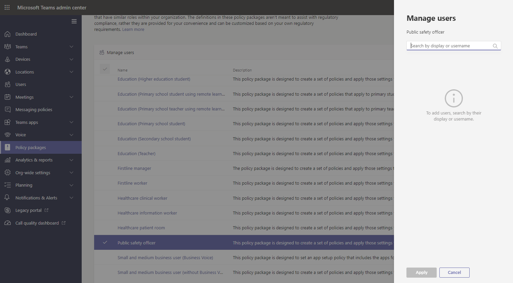

# Пакеты политики Teams для государственных организаций

> [!NOTE]
> В настоящее время пакеты политик не поддерживаются в сетях Microsoft 365 для государственных организаций по высококачественной или невысокой развернутости.

## Обзор

[Пакет политики](manage-policy-packages.md) в Microsoft Teams — это набор предопределенных политик и параметров политики, которые можно назначить пользователям, имеющим аналогичные роли в Организации. Пакеты политик упрощают, оптимизируют и помогают обеспечивать согласованность при управлении политиками. Вы можете настроить параметры политик в пакете в соответствии с потребностями пользователей. При изменении параметров политик в пакете политики все пользователи, которым назначен этот пакет, получают обновленные параметры. Управление пакетами политики осуществляется с помощью центра администрирования Microsoft Teams или оболочки PowerShell.

Пакеты политик предварительно определяют следующие политики в зависимости от пакета:

- Обмен сообщениями
- Собрания
- Звонки
- Настройка приложения
- Трансляции

В настоящее время команды включают следующие пакеты политик для государственных организаций.

|Имя пакета в центре администрирования Microsoft Teams|Кому предназначено|Описание |
|---------|---------|---------|
|Открытый директор по безопасности  |Общедоступные руководителей по безопасности в вашей организации государственных учреждений  |Создает набор политик и параметров политики, которые применяются для руководителей общедоступной безопасности в Организации. |
|Менеджер Firstline  |Руководители Firstline в вашей организации правительственных учреждений |Создает набор политик и применяет эти параметры для руководителей Firstline в вашей организации.|
|Firstline рабочий процесс  |Firstline работников в вашей организации государственной власти |Создает набор политик и применяет эти параметры для Firstlineных сотрудников в Организации.|

Каждой отдельной политике назначается имя пакета политики, что позволяет легко определять политики, связанные с пакетом политики. Например, при назначении общего пакета политики поддиректора безопасности для пользователей в Организации, для каждой политики в пакете создается политика с именем PublicSafety_Officer.

## Управление пакетами политик

### Просмотр

Перед назначением пакета просмотрите параметры каждой политики в пакете политики. В левой области навигации центра администрирования Microsoft Teams выберите **пакеты политики**, выберите имя пакета, а затем выберите имя политики.

Определите, являются ли предопределенные значения подходящими для вашей организации, или настройте их так, чтобы они были более строгими или Lenient в зависимости от потребностей Организации.

### Настроить

Настройте параметры политик в пакете политики в соответствии с потребностями Организации. Любые изменения, внесенные в параметры политики, автоматически применяются к пользователям, которым назначен пакет. Чтобы изменить параметры политики в пакете политики, в центре администрирования Microsoft Teams выберите пакет политики, выберите имя политики, которую вы хотите изменить, и нажмите кнопку **изменить**.

Имейте в виду, что вы также можете изменить параметры политик в пакете после назначения пакета политики. Дополнительные сведения можно найти [в разделе Настройка политик в пакете политики](manage-policy-packages.md#customize-policies-in-a-policy-package). 

### Присваивают

Назначение пакета политики пользователям. Чтобы назначить пакет политики для одного или нескольких пользователей, нажмите кнопку **Управление пользователями**. Вы также можете [использовать PowerShell](https://docs.microsoft.com/powershell/module/teams/new-csbatchpolicypackageassignmentoperation) для назначения пакета политики большим пакетам пользователей. 

Инструкции по назначению пакета политики с помощью центра администрирования Microsoft Teams или оболочки PowerShell приведены в статье [Назначение пакета политики](manage-policy-packages.md#assign-a-policy-package).

Если пользователю назначена политика, а затем в дальнейшем вы назначаете другую политику, она имеет приоритет.

## См. также

[Управление пакетами политик в Teams](manage-policy-packages.md)

[Назначение политик пользователям в Teams](assign-policies.md) 
