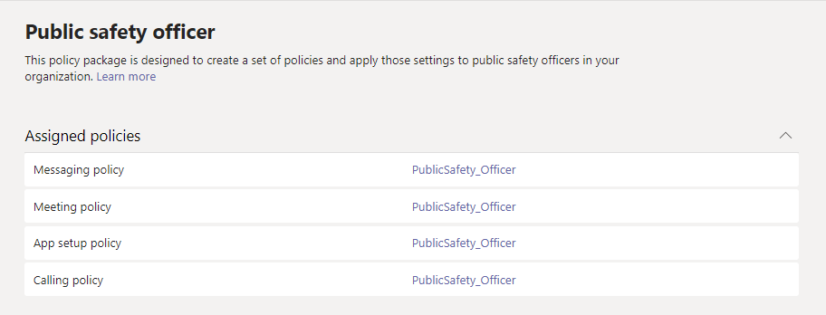

# Пакеты политик Teams для государственных организаций

> [!NOTE]
> Пакеты политик в настоящее время недоступны в развертываниях Microsoft 365 для государственных организаций GCC High или DoD.

## Обзор

[Пакет политики](manage-policy-packages.md) в Microsoft Teams — это набор готовых политик и параметров политик, которые можно назначить пользователям с похожими ролями в организации. Пакеты политик упрощают, оптимизируют и помогают обеспечивать согласованность при управлении политиками. Вы можете настроить параметры политик в пакете в соответствии с потребностями пользователей. При изменении параметров политик в пакете политик все пользователи, которым назначен этот пакет, получают обновленные параметры. Вы можете управлять пакетами политик с помощью Центра администрирования Microsoft Teams или PowerShell.

Пакеты политик предопределяют политики для следующих функций в зависимости от пакета.

- Обмен сообщениями
- Собрания
- Звонки
- Настройка приложения
- Трансляции

В настоящее время Teams включает следующие пакеты политик для государственных организаций.

|Имя пакета в Центре администрирования Microsoft Teams|Кому предназначено|Описание |
|---------|---------|---------|
|Специалист по общедоступной безопасности  |Сотрудники по обеспечению общедоступной безопасности в вашей организации для государственных организаций  |Создает набор политик и параметров политики, которые применяются к сотрудникам службы безопасности организации. |
|Диспетчер переднего плана  |Руководители переднего плана в вашей организации для государственных организаций |Создает набор политик и применяет эти параметры к менеджерам переднего плана в организации.|
|Frontline worker  |Frontline Workers in your government organization |Создает набор политик и применяет эти параметры к сотрудникам без компьютеров в организации.|

Каждой отдельной политике присваивается имя пакета политики, чтобы легко определять политики, связанные с пакетом. Например, при назначении пакета политики public safety officer пользователям в организации создается политика с именем PublicSafety_Officer для каждой политики в пакете.

## Управление пакетами политик

### Просмотр

Перед тем как назначать пакет, просмотрите параметры каждой политики в пакете политик. В левой области навигации Центра администрирования Microsoft Teams нажмите **Пакеты политик**, выберите имя пакета, а затем имя политики.

Решите, соответствуют ли готовые значения вашей организации или нужно настроить их, чтобы они были более или менее строгими, исходя из потребностей организации.

### Настройка

При необходимости настройте параметры политики в пакете политик, чтобы они соответствовали потребностям вашей организации. Изменения, внесенные в параметры политики, автоматически применяются к пользователям, которым назначен пакет. Чтобы изменить параметры политики в пакете политик, в Центре администрирования Microsoft Teams выберите пакет политики, нажмите имя политики, которую вы хотите изменить, а затем щелкните **Правка**.

Обратите внимание, что также можно изменить параметры политик в пакете после назначения пакета политики. Дополнительные сведения см. в статье [Настройка политик в пакете политики](manage-policy-packages.md#customize-policies-in-a-policy-package). 

### Назначение

Назначение пакета политики пользователям. Если пользователю с назначенной политикой назначается другая, приоритет будет иметь самое последнее назначение.

> [!NOTE]
> Для получения назначенного пользовательского пакета политик каждому пользователю будет необходима надстройка Advanced Communications. Дополнительные сведения см. в статье [Надстройка Advanced Communications для Microsoft Teams](/microsoftteams/teams-add-on-licensing/advanced-communications).

#### Назначение пакета политики для одного или нескольких пользователей

Чтобы назначить пакет политики одному или нескольким пользователям, в левой области навигации Центра администрирования Microsoft Teams перейдите в раздел **Пакеты политик**, а затем выберите **Управление пользователями**.  

Дополнительные сведения см. в статье [Назначение пакета политики](assign-policy-packages.md).

Если пользователю с назначенной политикой, назначается другая, приоритет будет иметь самое последнее назначение.

#### Назначение пакета политики группе

**Эта функция доступна в закрытой ознакомительной версии**

Назначение пакетов политики группам позволяет назначать несколько политик группе пользователей, например группе безопасности или группе рассылки. Назначение политики распространяется на участников группы в соответствии с правилами очередности. При добавлении или удалении участников группы, назначения политик для них обновляются соответствующим образом. Этот способ рекомендуется для групп, включающих до 50 000 пользователей, но также подойдет и для больших групп.

Дополнительные сведения см. в статье [Назначение пакета политики группе](assign-policy-packages.md#assign-a-policy-package-to-a-group).

#### Назначение пакета политики множеству (пакету) пользователей

Используйте назначение группового пакета политики, чтобы назначить пакет политики для множества пользователей одновременно. Используйте командлет [New-CsBatchPolicyPackageAssignmentOperation](/powershell/module/teams/new-csbatchpolicypackageassignmentoperation), чтобы отправить множество пользователей и пакет политики, который вы хотите назначить. Задания будут обрабатываться в фоновом режиме, а для каждого пакета будет создан идентификатор операции.

Пакет может содержать до 5 000 пользователей. Можно указать пользователей по идентификатору объекта, UPN, адресу протокола SIP или электронной почты. Дополнительные сведения см. в статье [Назначение пакета политики множеству пользователей](assign-policy-packages.md#assign-a-policy-package-to-a-batch-of-users).

## Связанные статьи

[Управление пакетами политик в Teams](manage-policy-packages.md)

[Назначение пакетов политик пользователям и группам](assign-policy-packages.md)
