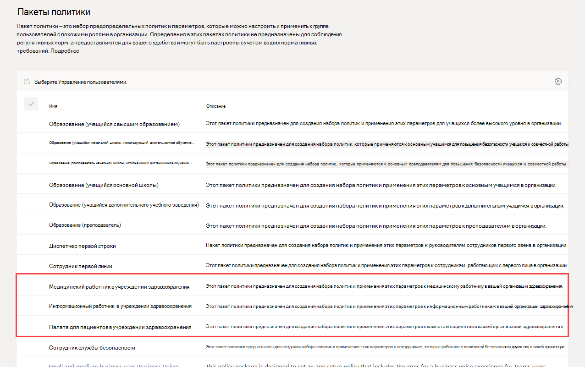
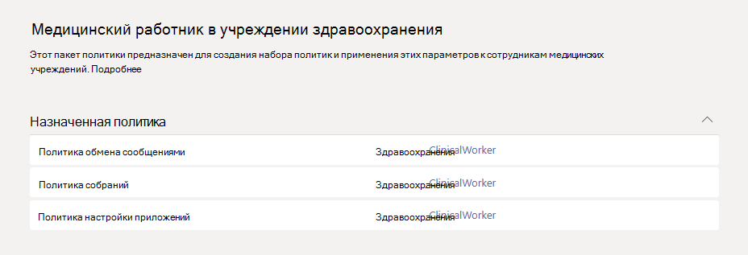
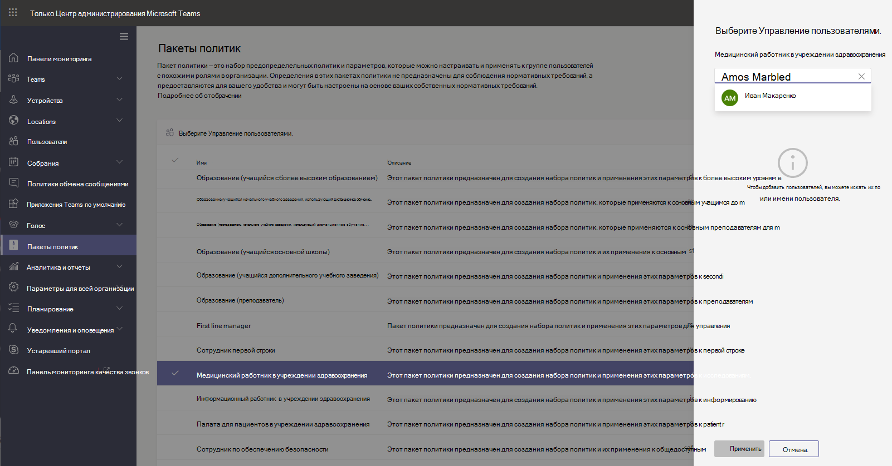

# Пакеты политик Teams для здравоохранения

## Обзор

[Пакет политики](manage-policy-packages.md) в Microsoft Teams — это набор готовых политик и параметров политик, которые можно назначить пользователям с похожими ролями в организации. Пакеты политик упрощают, оптимизируют и помогают обеспечивать согласованность при управлении политиками. Вы можете настроить параметры политик в пакете в соответствии с потребностями пользователей. При изменении параметров политик в пакете политик все пользователи, которым назначен этот пакет, получают обновленные параметры. Вы можете управлять пакетами политик с помощью Центра администрирования Microsoft Teams или PowerShell.

> [!VIDEO https://www.microsoft.com/videoplayer/embed/RE4Ht2o]

Пакеты политик предопределяют политики для следующих функций в зависимости от пакета.

- Обмен сообщениями
- Собрания
- Звонки
- Настройка приложения
- Трансляции

В настоящее время Teams включает следующие пакеты политик для здравоохранения.

|Имя пакета в Центре администрирования Microsoft Teams|Кому предназначено|Описание |
|---------|---------|---------|
|Медицинский работник в учреждении здравоохранения  |Медицинские работники в организации здравоохранения  |Создает набор политик и параметров политик, предоставляющий медицинским работникам, таким как медсестры, старшие сестры, терапевты и социальные работники, полный доступ к чатам, звонкам, управлению сменами и собраниям. |
|Информационный работник в учреждении здравоохранения  |Информационные работники в организации здравоохранения |Создает набор политик и параметров политик, предоставляющий информационным сотрудникам, таким как ИТ-персонал, информационный персонал, финансовый персонал и сотрудники по обеспечению соответствия требованиям, полный доступ к чатам, звонкам и собраниям.|
|Палата для пациентов в учреждении здравоохранения  |Устройства палат для пациентов|Создает набор политик и параметров политик, применяемый к палатам для пациентов в медицинской организации.|

Каждой отдельной политике присваивается имя пакета политики, чтобы легко определять политики, связанные с пакетом. Например, когда вы назначаете пакет политик "Медицинский работник в учреждении здравоохранения" медицинским работникам в своей организации, для каждой политики в пакете создается политика с именем Healthcare_ClinicalWorker.

## Начало работы с пакетами политик

Чтобы начать работу с пакетами политик для здравоохранения, в центре подключения Центра администрирования Майкрософт выберите **Здравоохранение**, а затем — **Назначить параметры политики по роли**. Когда будете готовы начать, решите, какие пакеты политик нужно назначить пользователям в организации.

Выберите **Просмотреть сведения политики**, чтобы узнать больше об определенных политиках в пакете и соответствующих параметрах. Их [можно настроить](manage-policy-packages.md#customize-policies-in-a-policy-package) после назначения в Центре администрирования Teams.

Выберите один или несколько пакетов, которые нужно назначить, и нажмите **Далее**. Вы можете искать и добавлять людей в пакет политик, наиболее подходящий для их роли. Отдельного человека нельзя назначить в несколько пакетов политик одновременно.

Добавив людей в нужный пакет политик, нажмите **Завершить**, чтобы подтвердить выбор. Вы можете продолжить настройку пакетов политик и управлять ими в Центре администрирования Microsoft Teams.

## Управление пакетами политик

### Просмотр

Перед тем как назначать пакет, просмотрите параметры каждой политики в пакете политик. В левой области навигации Центра администрирования Microsoft Teams нажмите **Пакеты политик**, выберите имя пакета, а затем — имя политики.

Решите, соответствуют ли готовые значения вашей организации или нужно настроить их, чтобы они были более или менее строгими, исходя из потребностей организации.

### Настройка

При необходимости настройте параметры политики в пакете политик, чтобы они соответствовали потребностям вашей организации. Изменения, внесенные в параметры политики, автоматически применяются к пользователям, которым назначен пакет. Чтобы изменить параметры политики в пакете политик, в левой области навигации Центра администрирования Microsoft Teams нажмите **Пакеты политик**, выберите пакет политики, нажмите имя политики, которую нужно изменить, а затем щелкните **Изменить**.

Обратите внимание, что также можно изменить параметры политик в пакете после назначения пакета политики. Дополнительные сведения см. в статье [Настройка политик в пакете политики](manage-policy-packages.md#customize-policies-in-a-policy-package).

### Назначение

Назначение пакета политики пользователям. Если пользователю с назначенной политикой назначается другая, приоритет будет иметь самое последнее назначение.

> [!NOTE]
> Для получения назначенного пользовательского пакета политик каждому пользователю будет необходима надстройка Advanced Communications. Дополнительные сведения см. в статье [Надстройка Advanced Communications для Microsoft Teams](/microsoftteams/teams-add-on-licensing/advanced-communications).

#### Назначение пакета политики для одного или нескольких пользователей

Чтобы назначить пакет политики одному или нескольким пользователям, в левой области навигации Центра администрирования Microsoft Teams перейдите в раздел **Пакеты политик**, а затем выберите **Управление пользователями**.  

Дополнительные сведения см. в статье [Назначение пакета политики](assign-policy-packages.md).

Если пользователю с назначенной политикой, назначается другая, приоритет будет иметь самое последнее назначение.

#### Назначение пакета политики группе

**Эта функция доступна в закрытой ознакомительной версии**

Назначение пакетов политики группам позволяет назначать несколько политик группе пользователей, например группе безопасности или группе рассылки. Назначение политики распространяется на участников группы в соответствии с правилами очередности. При добавлении или удалении участников группы, назначения политик для них обновляются соответствующим образом. Этот способ рекомендуется для групп, включающих до 50 000 пользователей, но также подойдет и для больших групп.

Дополнительные сведения см. в статье [Назначение пакета политики группе](assign-policy-packages.md#assign-a-policy-package-to-a-group).

#### Назначение пакета политики множеству (пакету) пользователей

Используйте назначение группового пакета политики, чтобы назначить пакет политики для множества пользователей одновременно. Используйте командлет [New-CsBatchPolicyPackageAssignmentOperation](/powershell/module/teams/new-csbatchpolicypackageassignmentoperation), чтобы отправить множество пользователей и пакет политики, который вы хотите назначить. Задания будут обрабатываться в фоновом режиме, а для каждого пакета будет создан идентификатор операции.

Пакет может содержать до 5 000 пользователей. Можно указать пользователей по идентификатору объекта, UPN, адресу протокола SIP или электронной почты. Дополнительные сведения см. в статье [Назначение пакета политики множеству пользователей](assign-policy-packages.md#assign-a-policy-package-to-a-batch-of-users).

## Связанные статьи

[Управление пакетами политик в Teams](manage-policy-packages.md)

[Назначение пакетов политики пользователям и группам](assign-policy-packages.md)
