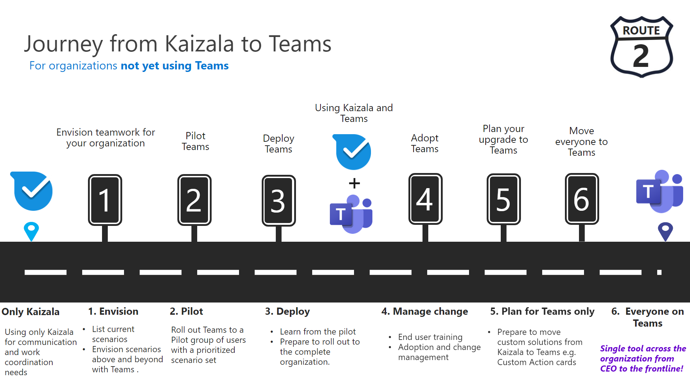

# Подготовка к перемещению Kaizala в Teams

> [!Important]
> Microsoft Kaizala прекратит использование 31 августа 2023 г. Мы рекомендуем перейти на Microsoft Teams для продолжения работы, обмена данными и совместной работы. После даты прекращения поддержки Kaizala доступ и поддержка будут прекращены.

Вы решили перейти с Kaizala на Microsoft Teams.

Прежде чем приступить к работе, важно ответить на следующие два вопроса:

- Какие группы пользователей будут перемещены в Teams?  

- Каков ваш путь к Teams?

## Определение групп пользователей

*Какие группы существуют в вашей организации? Кто и как будет использовать Teams? Какие потребности требуются этим группам для эффективной командной работы?* Чтобы начать работу с Teams, сначала **определите группы пользователей для перехода.**  Группы пользователей — это набор сотрудников в вашей организации, которые выполняют работу в аналогичных областях бизнеса. 

Мы определили три распространенные группы пользователей, которые будут поддерживать вас в определении потребностей совместной работы. Каждая группа пользователей имеет собственные уникальные потребности в плане взаимодействия. 

 1. **Информационные** работники — это сотрудники, которые создают, используют, преобразовывайте, используют и управляют информацией в ходе работы.

 2. **В** основном это сотрудники без рабочего места, основной функцией которых является работа непосредственно с клиентами или общедоступными сотрудниками, предоставляющими услуги, поддержку и продажу продуктов, или непосредственно участвующими в производстве продуктов и услуг.

 3. **Внешние пользователи** — это люди за пределами вашей организации, такие как ваши поставщики, поставщики, бизнес-партнеры, клиенты или клиенты.

Пользователям, которые подключаются к другим информационным работникам в своих рабочих ролях, требуется следующее:

- Чат, собрание, совместная работа с файлами

- Работа на разных устройствах

- Отраслевые решения

- Расширенные ИТ-элементы управления
  
- Внутренняя и внешняя совместная работа с электронной почтой

Пользователям, подключанымся к сотрудникам frontline, требуется следующее:

- Подключение к сотрудникам без компьютеров в каталоге организации

- Автономные удаленные расположения

- Вовлеченность и вовлечение сотрудников

- Цифровые процессы и рабочие процессы

- Смены планирования и управления задачами

Пользователи, которые подключаются к внешним пользователям (поставщикам или поставщикам), могут использовать:

- [Пользователи Microsoft Teams могут общаться в чате с любыми пользователями Teams, которые находятся за пределами организации](https://techcommunity.microsoft.com/t5/microsoft-teams-blog/microsoft-teams-users-can-now-chat-with-any-teams-user-outside/ba-p/3070832)

- [Добавление или приглашение пользователей за пределами организации Teams в чат](https://support.microsoft.com/en-us/office/add-or-invite-people-outside-your-teams-org-to-a-chat-6897ab47-9f60-4db6-8b95-18599714fe57)

## Определение пути

Проверив потребности в совместной работе групп пользователей, вы сможете определить, как будет выглядеть ваш путь из Kaizala в Teams. Каждая организация уникальна, и ни один из сотрудников не будет одинаковым. Организациям, которые в настоящее время не используют Teams, потребуется принять дополнительные стратегические решения, чтобы обеспечить успешный переход. Определение пути поможет определить все важные действия, которые необходимо выполнить для успешного перехода.

Мы определили, из чего может состоять путь в зависимости от использования вашей организации на сегодняшний день:  

Для **организаций, не использующих Teams**:

 1. Представление командной работы для организации

 2. Пилотные команды
  
 3. Развертывание Teams
  
 4. Использование Kaizala и Teams
  
 5. Управление изменениями

 6. Планирование внедрения Teams

 7. Перемещение организации в Teams

Для **организаций, уже использующих Teams**:

 1. Планирование перехода

 2. Управление изменениями

## Дальнейшие действия

[Планирование успешного перехода на Microsoft Teams](/MicrosoftTeams/plan-your-move-kaizala)
