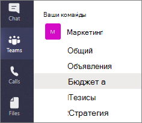
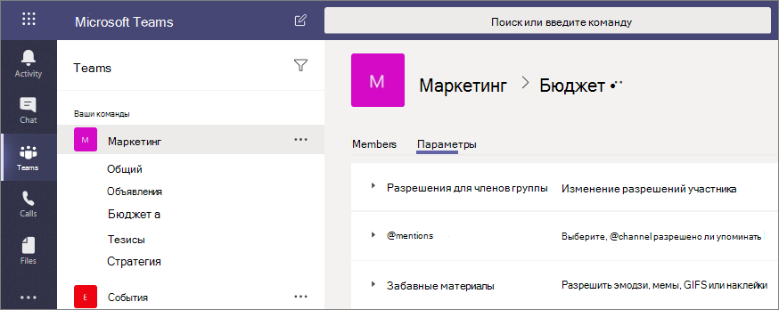

# Частные каналы в Microsoft Teams

Частные каналы в Microsoft Teams создают целевые пространства для совместной работы в ваших командах. Доступ к каналу предоставляется для пользователей команды, являющихся владельцами или членами этого закрытого канала. Любых пользователей, в том числе гостей, можно добавлять в закрытый канал в качестве членов, если эти пользователи уже являются членами команды.

Закрытые каналы имеет смысл использовать, если нужно ограничить круг участников работы, допуская лишь тех, кому необходима рассматриваемая информация, или для организации общения среди группы людей, назначенных на определенный проект (в этом случае при использовании закрытого канала не нужно будет создавать дополнительную команду, которой потребовалось бы управлять).

Например, частный канал полезен в этих сценариях:

- Группа людей в команде хочет сфокусированного пространства для совместной работы без создания отдельной команды.
- Подмножество людей в команде хочет, чтобы частный канал обсуждает конфиденциальную информацию, например бюджеты, ресурсы, стратегическое позиционирование и т. д.

Значок замка обозначает частный канал. Видеть частные каналы и участвовать в них могут только участники, которые к ним добавлены.

Когда создается частный канал, он связывается с родительской командой и не может быть перемещен в другую команду. Кроме того, частные каналы не могут быть преобразованы в стандартные каналы и наоборот.

[Сравните частные каналы с другими типами каналов](/microsoftteams/teams-channels-overview#channel-feature-comparison).

## Создание частного канала

По умолчанию любой владелец или член команды может создать частный канал. Гости не могут их создать. Управление возможностью создания закрытых каналов может осуществляться на уровне команды и на уровне организации. Используйте [политики](teams-policies.md), чтобы выбрать пользователей в организации, которым разрешено создавать закрытые каналы. Задав политики, владельцы команды могут включить или отключить возможность создания закрытых каналов для участников на вкладке **Параметры** команды.

Человек, который создает частный канал, является владельцем частного канала, и только владелец частного канала может напрямую добавлять или удалять людей из него. Владелец частного канала может добавить любого члена команды в созданный ими частный канал, включая гостей. Члены частного канала имеют безопасное пространство для разговоров, и при добавлении новых участников они могут видеть все разговоры (даже старые разговоры) в этом частном канале.

Владельцы команды могут видеть имена всех частных каналов в своей команде, а также могут удалить любой частный канал в команде. (Удаленный частный канал может быть восстановлен в течение 30 дней после его удаления). Владельцы групп не могут видеть файлы в частном канале или в разговорах и списке участников частного канала, если они не являются членами этого частного канала.

Участники команды могут видеть только те закрытые каналы, в которые они добавлены.

## Добавление и удаление владельцев и участников

Владельца закрытого канала невозможно удалить через клиент Teams, если он является последним владельцем одного или нескольких закрытых каналов.

Если владелец закрытого канала покидает организацию или удален из группы Microsoft 365, связанной с командой, уровень одного из участников закрытого канала автоматически повышается до владельца.

Если член команды покидает или удаляется из команды, этот пользователь также покидает или удаляется из всех частных каналов в команде. Если пользователь добавлен обратно в команду, его необходимо добавить обратно в частные каналы в команде.

## Параметры владельца канала

Каждый закрытый канал имеет свои параметры, которыми его владелец может управлять, в том числе возможность добавлять или удалять участников, добавлять вкладки и @упоминания для всего канала. Эти настройки не зависят от настроек родительской команды. Когда создается частный канал, он наследует настройки родительской команды, после чего его настройки можно изменять независимо от настроек родительской команды.

Владелец частного канала может щелкнуть **Управление каналом**, а затем использовать вкладки **Участники** и **Настройки**, чтобы добавлять или удалять участников и редактировать настройки.

## Действия владельцев и участников закрытого канала

В следующей таблице описываются действия, которые владельцы, участники и гости могут выполнять в частных каналах.

|Действие  |Владелец команды|Участник команды|Гость команды|Владелец частного канала|Участник частного канала|Гость частного канала|
|---------|---------|---------|---------|---------|---------|---------|
|Создать частный канал|Управляется администратором|Управляется администратором и владельцем команды|Нет|Н/Д|Н/Д|Н/Д|
|Удалить частный канал|Да|Нет|Нет|Да|Нет|Нет|
|Покинуть частный канал|Недоступно|Н/Д|Н/Д|Да, если это не последний владелец|Да|Да|
|Изменить частный канал|Нет|Н/Д|Н/Д|Да|Нет|Нет|
|Восстановить удаленный частный канал|Да|Нет|Нет|Да|Нет|Нет|
|Добавить участников|Нет|Н/Д|Н/Д|Да|Нет|Нет|
|Изменение параметров|Нет|Н/Д|Н/Д|Да|Нет|Нет|
|Управление вкладками и приложениями|Нет|Н/Д|Н/Д|Да, для команды следует установить приложения|Управляется владельцем канала|Нет|

## Частный канал сайтов SharePoint

Каждый закрытый канал имеет собственный сайт SharePoint. Отдельный сайт ограничивает доступ к файлам закрытого канала его участниками. Эти сайты создаются с библиотекой документов по умолчанию, и их можно легко преобразовать в полнофункциональные сайты, используя [интерфейс управления сайтами](https://support.office.com/article/A2F2A5C2-093D-4897-8B7F-37F86D83DF04). Каждый сайт создается в том же географическом регионе, что и сайт родительской группы. Эти облегченные версии сайтов имеют собственный идентификатор шаблона "TEAMCHANNEL#0" или "TEAMCHANNEL#1", что упрощает управление с помощью PowerShell и API Graph. 

> [!NOTE]
> Доступ к содержимому на сайте общего канала предоставляется только пользователям с разрешениями владельца или участника. Пользователи из родительской группы и администраторы не будут иметь доступа, если они не являются участниками канала.

Сайт закрытого канала синхронизирует классификацию данных и наследует разрешения гостевого доступа от сайта родительской группы. Членство в группах владельцев и участников сайта синхронизируется с членством в закрытом канале в Teams. Разрешениями для сайта частного канала нельзя управлять независимо с помощью SharePoint. 

Teams управляет жизненным циклом сайта закрытого канала. Если сайт удален за пределами Teams, фоновое задание восстанавливает его в течение четырех часов, пока частный канал еще активен.

Если закрытый канал или команда, содержащая закрытый канал, будут восстановлены, сайты будут восстановлены вместе с ними. Если закрытый канал восстановлен после завершения 30-дневного периода обратимого удаления, сайт работает автономно.

> [!NOTE]
> Когда вы создаете новую команду либо частный или общий канал в Microsoft Teams, автоматически создается сайт команды в SharePoint. Чтобы изменить описание сайта или классификацию для этого сайта команды перейдите в раздел [параметров в Microsoft Teams](https://support.microsoft.com/office/change-a-team-s-data-security-classification-in-teams-bf39798f-90d2-44fb-a750-55fa05a56f1d) для соответствующего канала.
>
> Узнайте больше об управлении [сайтами команд, подключенных к Microsoft Teams](/SharePoint/teams-connected-sites).

## Соответствующие требованиям копии сообщений частного канала

Соответствующие требованиям копии сообщений, отправленных в частный канал, доставляются в почтовый ящик всех участников частного канала, а не в групповой почтовый ящик. Названия соответствующих требованиям копий форматируются, чтобы указать, из какого частного канала они были отправлены.

Для получения дополнительной информации о выполнении поиска eDiscovery для сообщений частного канала см. Раздел [eDiscovery частных каналов](ediscovery-investigation.md#ediscovery-of-private-and-shared-channels).

## Информация по поводу доступа к файлам в закрытых каналах

Когда новая записная книжка OneNote создается в частном канале, дополнительные пользователи могут по-прежнему получать доступ к этой записной книжке, поскольку поведение аналогично общему доступу к любому другому элементу на сайте SharePoint частного канала с пользователем.

Если пользователю предоставляется доступ к записной книжке в частном канале через SharePoint, удаление пользователя из группы или частного канала не приведет к удалению доступа пользователя к записной книжке.

Если существующая записная книжка добавляется в качестве вкладки в закрытый канал, это не изменяет доступ к сайту и записная книжка сохраняет существующие разрешения.

## Ограничения для закрытых каналов

В настоящее время частные каналы поддерживают соединители и вкладки (кроме Stream, Planner и Forms). Мы работаем над полной поддержкой приложений для частных каналов, включая расширения для обмена сообщениями и ботов.

Каждая команда может иметь максимум 30 частных каналов, а каждый частный канал может иметь максимум 250 участников. Ограничение 30 частных каналов является дополнением к 200 стандартным ограничениям канала для команды. 

При создании команды из уже существующей закрытые каналы существующей команды не копируются.

Закрытый канал невозможно преобразовать в канал другого типа.

Уведомления из частных каналов не включаются в письма о пропущенных действиях.

Собрания канала нельзя запланировать.

Собрания канала нельзя настроить с помощью заголовка собрания.

## Статьи по теме

[Общие каналы в Microsoft Teams](/MicrosoftTeams/shared-channels)

[Обзор команд и каналов в Teams](teams-channels-overview.md)

[Обзор PowerShell в Teams](teams-powershell-overview.md)

[Использование Microsoft Graph API для работы с Teams](/graph/api/resources/teams-api-overview)

[Тип ресурса канала](/graph/api/resources/channel)
