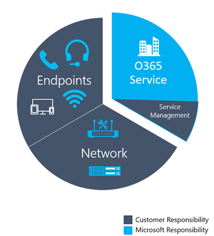

#  <a name="use-cqd-to-manage-call-and-meeting-quality-in-microsoft-teams"></a>Использование CQD для управления звонком и качеством собраний в Microsoft Teams 

Эта статья поможет вам — Teams администраторам или технической поддержке и инженеру службы технической поддержки — разработать процесс мониторинга и обслуживания звонка и качества собраний для организации с помощью панели мониторинга качества Microsoft Teams звонка (CQD). Наше руководство акцентирует внимание на сценариях качества звука, так как любые улучшения сети, которые вы сделаете для улучшения качества звука, будут переводиться на улучшения видео и общего доступа.

Ключевыми в этом руководстве являются два рекомендуемых [шаблона CQD.](https://aka.ms/QERtemplates) Рекомендуем скачать их, прежде чем переходить к рекомендациям в этой статье.

В этой статье предполагается, что вы уже [настроили CQD.](turning-on-and-using-call-quality-dashboard.md)


## <a name="categories-to-monitor-and-maintain"></a>Категории для отслеживания и обслуживания

После проведения собраний и голосового Teams вам потребуется план постоянного мониторинга и обслуживания. Это гарантирует, что Teams всегда работает оптимально. Этот план должен включать перечисленные ниже ключевые области. Кроме того, необходимо определить целевые показатели качества и план устранения и изоляции неполадок при их устранении.

<table>
<thead>
<tr class="header">
<th>Категория</th>
<th>Описание</th>
</tr>
</thead>
<tbody>
<tr class="odd">
<td><strong>Качество звонка</strong></td>
<td>
<p>Разбитие показателей по внутренним звонкам (внутри организации, таким как VPN, Wi-Fi, проводные) или внешним звонкам</p>
<p>Разбитие показателей по зданиям или сетям</p>
<p>VPN-вызовы</p>
<p>Звонки с использованием TCP, UDP или прокси-сервера</p>
</td>
</tr>
<tr class="even">
<td><strong>Надежность звонка</strong></td>
<td><p>Выявление и устранение проблем с сетью или брандмауэром</p>
<p>Анализ процентов сбоев при настройке вызовов и их переустановки</p>
<p>Узнайте, где возникает основная часть сбоев при установке и пере drop вызове</p>
</td>
</tr>
<tr class="odd">
<td><strong>Опрос пользователей</strong></td>
<td>
<p>Использование данных "Оценить мой звонок" для сведения о фактическом опыте пользователей</p>
<p>Где находится неудовлетворительный опыт?</p>
<p>Сопоставляет неудовлетворительный опыт с качеством, надежностью и устройствами</p>
</td>
</tr>
<tr class="even">
<td><strong>Devices</strong></td>
<td><p>Узнайте, какие микрофоны и динамики используются чаще всего и как они влияют на качество звонка</p>
<p>Регулярно обновляются ли вспомогательные драйверы аудио, видео, USB и Wi-Fi?</p>
</td>
</tr>
<tr class="odd">
<td><strong>Клиенты</strong></td>
<td>
<p>Узнайте, какие типы и версии клиентов используются, и их влияние на качество и надежность звонка  </p>
</ol></td>
</tr>
</tbody>
</table>

Постоянная оценка и исправление областей, описанных в этой статье, позволяет снизить риск негативного влияния на пользователей. Большинство проблем пользователей можно сгруппировали по следующим категориям:

-   Неполная настройка брандмауэра или прокси-сервера
-   Слабый охват сети Wi-Fi
-   Недостаточная пропускная способность
-   VPN;
-   Несогласованные или устаревшие версии и драйверы клиента
-   Неотвеченные или встроенные звуковые устройства
-   Проблемы с подсетями или сетевыми устройствами

За счет правильного планирования и проектирования перед развертыванием Teams или Skype для бизнеса Online вы можете уменьшить объем усилий, необходимых для обслуживания высококачественных продуктов.

В этой статье основное внимание уделяется использованию панели мониторинга качества звонка (CQD) Online в качестве основного средства для отчетов и изучения каждой области, уделяя особое внимание звуку для максимального внедрения и влияния. Все улучшения, внося в сеть для улучшения качества звука, также будут непосредственно переводить на улучшение общего доступа к видео и рабочему столу.

Для ускорения оценки предоставляются два готовых шаблона [CQD:](https://aka.ms/qertemplates) один — для управления всеми сетями, а другой фильтруется только для управляемых (внутренних) сетей. Хотя в отчетах шаблонов "Все сети" настроено отображение сведений о здании и сети, их можно использовать при сборе и отправке сведений о здании. Добавление сведений о здании в CQD позволяет службе улучшить отчеты за счет добавления настраиваемой информации о здании, сети и расположении, при этом отличая внутреннюю информацию от внешних подсетей. Дополнительные сведения об этом можно узнать в [документе Сопоставление здания.](CQD-building-mapping.md)

### <a name="intended-audience"></a>Предполагаемая аудитория

Эта статья предназначена для партнеров и заинтересованных лиц с такими ролями, как "Руководство по совместной работе", "Архитектор", "Консультант", "Специалист по управлению изменениями и внедрению", "Руководство службы поддержки/технической поддержки", "Сетевой клиент", "Клиент для настольных компьютеров" и "ИТ-администратор".

Эта статья также предназначена для назначенных защитников качества. Дополнительные сведения см. [в роли "Защитник качества"](4-envision-plan-my-service-management.md#the-quality-champion-role).


## <a name="what-is-quality"></a>Что такое качество?

В этом контексте качество — это сочетание метрик службы и пользовательского интерфейса.


### <a name="service-metrics"></a>Показатели службы

Метрики службы состоят из определенных клиентских метрик. Во время каждого звонка клиент собирает телеметрию для звонка и подает отчет в конце каждого звонка, который позже можно будет получить в CQD или в средстве аналитики вызовов для каждого [пользователя.](set-up-call-analytics.md) Эти показатели включают (но не ограничиваются):

-   Poor Stream (входящие и исходящая)
-   Setup Failure Rate
-   Drop Failure Rate


#### <a name="poor-stream-rate"></a>Низкая скорость потока

Низкая скорость потока (PSR) представляет общий процент потоков в организации, которые имеют низкое качество. Этот показатель предназначен для выделения областей, в которых организация может сосредоточиться на усилиях, чтобы самое [](#managed-versus-unmanaged-networks) сильное влияние на снижение этого значения и улучшение пользовательского интерфейса, поэтому управляемые сети являются основными при оценке psr. Внешние пользователи также важны, но исследования различаются в организации. Рассмотрите возможность предоставления лучших методик для внешних пользователей и независимого изучения внешних звонков из всей организации.

Фактическое измерение в CQD зависит от рабочей нагрузки, но для целей данной статьи мы уделяем основное внимание измерению _Audio Poor Percentage._ PsR состоит из пяти средних метрик сети, описанных в таблице ниже. Чтобы поток можно было классифицировать как неудовлетворительный, необходимо, чтобы только одна метрика превысила определенное пороговое значение. CQD предоставляет "Poor Due To..." чтобы лучше понять, какое условие привело к классификации потока как неудовлетворительного. Подробнее об этом можно узнать в [классификации Stream в CQD.](stream-classification-in-call-quality-dashboard.md)

> [!Note]
> CQD предоставляет "Плохое из-за..." чтобы лучше понять, какое условие привело к классификации потока как неудовлетворительного.


##### <a name="audio-poor-quality-metrics"></a>Показатели низкого качества звука

| Среднее значение метрики     | Описание     | Впечатления от использования |
|-------------|-----------------|-----------------|
| Jitter \> 30 ms        | Это среднее изменение задержки между последовательными пакетами. Teams и Skype для бизнеса могут адаптироваться к некоторым уровням дрожания с помощью буферизации. Участник заметит эффект дрожания только тогда, когда дрожание превышает буфериозику.      | Пакеты, поступающие с разной скоростью, приводят к тому, что звук динамика зазвучит.   |
| Коэффициент потерь \> пакетов: 10% или 0,1        | Этот показатель часто определяется как процент потерянных пакетов. Потеря пакетов напрямую влияет на качество звука — от небольших потерянных пакетов, которые практически не оказывают влияния на потери во время пакетов, что приводит к полному обрезку звука.     | Пакеты, которые были сброшены и не долетят до места назначения, приводят к разрыву мультимедиа, что приводит к пропущенным слогам и словам, а также к изумительным видео и совместному доступу. |
| Время кругового \> пути: 500 мс        | Это время, необходимое для получения IP-пакета из точки A в точку B и обратно в точку А. Эта задержка распространения по сети связана с физическим расстоянием между двумя точками и скоростью света и включает дополнительные затраты различных устройств на сетевом пути.      | Пакеты, которые слишком долго добирались до пункта назначения, приводят к эффекту примиа-личицы.   |
| Среднее ухудшение NMOS \> : 1,0         | Среднее ухудшение средней экспертной оценки разлия точки зрения [(NMOS)](/previous-versions/office/communications-server/bb894481(v=office.12)#network-mos) для потока. Представляет, насколько дрожания и потери в сети повлияли на качество полученного звука, из-за чего NMOS паднул более чем на один пункт. | Это сочетание дрожания, потери пакетов и (в меньшей степени) увеличенного времени кругового пути. У пользователя может возникнуть сочетание этих симптомов.   |
| Среднее соотношение скрытых выборок \> 7% или 0,07 | Среднее отношение числа аудиокадров с скрытыми образцами, созданными в результате потери пакетов, к общему числу аудиокадров. Скрытый образец звука — это способ сглаживания перехода между аудиофайлами, который обычно вызван сбросом сетевых пакетов.      | Высокие значения указывают на то, что были применены значительные уровни скрытия потери, что приводит к искажению или потере звука.     |

##### <a name="why-do-we-prefer-to-use-streams-instead-of-calls"></a>Почему мы предпочитаем использовать потоки вместо звонков?

Потоки, какая часть звонка была неудовлетворительной — исходящая или входящий. При анализе аналитики вызовов для неудовлетворительного звонка определите, был ли неудовлетворительный звонок вызван потоком (исходящим) или потоком (входящий звонок) вызываемого. Для конференций еще важнее определить, какой поток влияет на качество звонка. Если вы видите только данные о звонках, вы увидите, сколько конференций участвует человек, но вы не увидите, кто из них является активными выступающими, при этом общий доступ к экрану ведется чаще всего.

Данные об звонках дают метрики использования, но не обязательно приводят к корневой причине низкого качества звонка. В зависимости от направления потока можно определить такие факторы, как вызов, который не в управляемой сети, звонок от внешних сотрудников (например, от поставщика или другого поставщика в другой сети). В таких случаях, если сетевое подключение другого человека было неудовлетворительно, весь звонок будет помечен как неудовлетворительный. С внешними факторами нельзя что-либо делать, поэтому эти данные не полезны.

Направление потока также помогает выявить проблемные устройства или клиенты.

 - Например, если у вас ограниченный бюджет для устройств и вы хотите предоставить устройства только для пользователей с ограниченным звуком, используйте отчет об использовании звука (VoIP) и фильтрацию для исходяющих потоков и аудиоконференций. Вы можете найти пользователей с высоким уровнем громкости звука, которые разговаривают во встроенных микрофонах. Они могут соотнестися с неудовлетворительным качеством звонка (а для этих пользователей может потребоваться предоставить аудио устройства). Для более четкой фильтрации можно отфильтровать использование пакетов, что позволит вам уфильтровать пользователей с высокой громкостью звука. 

  - Еще один пример включает совместный доступ к экрану. Если клиент использует старый клиент Teams, это может повлиять на производительность общего доступа к экрану. Эту проблему можно решить, расширив приоритеты обновлений клиентов для тех, кто много делиться экранами.

 - Определяя направление потока, которое вызывает неудовлетворительный уровень качества звонка, вы можете определить, есть ли проблема с качеством обслуживания или пропускной способностью. Если вы еще не полностью реализовали QoS или пометили пакеты только на клиенте, а не на входящий поток, качество звонка может быть неудовлетворительным. Просматривая направление потока, вы можете получить более детальное представление потери пакетов, задержки или дрожания в определенном направлении. 

   - Например, предположим, что пользователь жалуется на звук во время проводного подключения (дрожать). В зависимости от потока и направления можно определить, что проблема возникает в входящий поток только для определенного набора подсетей. После того как вы передайте эту информацию вашей сетевой команде, они смогут отследить ее до неправильного ускорителя WAN, который не обошел трафик мультимедиа. После того как группа сети перенастроит ускоритель WAN, дрожание исчезнет, и качество зова улучшится. 


#### <a name="setup-failure-rate"></a>Setup Failure Rate

Коэффициент сбоя установки, иначе известный как Total _Call Setup Failure Percentage_ (Процент сбоя общей настройки звонка) в CQD, — это количество потоков, где не удалось установить медиапоток между конечными точками в начале звонка.

Это означает любой поток мультимедиа, который не удалось установить. Учитывая серьезность этой проблемы на пользовательский интерфейс, цель — уменьшить это значение до максимально близкого к нулю. Высокая ценность для этой метрики чаще всего используется в новых развертываниях с неполными правилами брандмауэра, чем при развертывании с зрелости, но это важно делать регулярно.

Этот показатель вычисляется путем подсчета общего количества потоков, которые не удалось настроить, на общее количество потоков, которые отправили запись с подробными данными о звонках:

-   **Setup Failure Rate** = Total Call Setup Failed Stream Count / Total CDR Available Stream Count

#### <a name="drop-failure-rate"></a>Drop Failure Rate

Коэффициент сбоя drop, иначе известный как _Total Call Dropped Failure Percentage_ (Процент прерываемого звонка) в CQD, — это процент успешно установленных потоков, где потоки мультимедиа завершались не так, как обычно.

Это означает, что поток мультимедиа неожиданно завершился. Несмотря на то, что это не так серьезно, как поток, который не удалось настроить, оно по-прежнему отрицательно влияет на пользовательский интерфейс. Неожиданные и частые потери мультимедиа могут не только негативно сказаться на пользовательском интерфейсе, но и привести к необходимости повторного подключения пользователей, что приведет к потери производительности (не говоря уже о безысходности).

Показатель вычисляется путем деления общего количества потоков, разделенных на общее количество успешно настроенных потоков:

-   **Drop Failure Rate** = Total Call Dropped Stream Count / Total Call Setup Succeeded Stream Count

### <a name="define-your-target-metrics"></a>Определение целевых метрик

В этом разделе рассмотрены некоторые основные показатели служб, которые используются для оценки их состояния. Постоянно оценивая показатели и движуя усилия по их обеспечению в соответствии с целевыми показателями, вы помогаете обеспечить пользователям согласованное и надежное качество звонка. В качестве отправной точки используйте предлагаемые цели в таблице ниже. При необходимости скорректируем целевые показатели для своих бизнес-целей.

<table>
<tr>
<th rowspan="2" colspan="2" valign="center">Тип сети</th><th rowspan="1">Целевые показатели качества</th><th colspan="2">Целевые показатели надежности</th></tr>
<tr><th>Audio Poor Stream Rate</th><th>Setup Failure Rate</th><th>Drop Failure Rate</th></tr>
<tr><td rowspan="2"><strong>All</strong></td><td>Internal</td><td>2.0%</td><td>0.5%</td><td>2.0%</td></tr>
<tr><td>Общий уровень</td><td>3.0%</td><td>1.0%</td><td>3.0%</td></tr>
<tr><td rowspan="5"><strong>Конференции</strong></td><td>Internal</td><td>2.0%</td><td>0.5%</td><td>2.0%</td></tr>
<tr><td>Проводные внутренние</td><td>1.0%</td><td>0.5%</td><td>1.0%</td></tr>
<tr><td>Wi-Fi 5 ГГц для внутренних</td><td>1.0%</td><td>0.5%</td><td>1.0%</td></tr>
<tr><td>Wi-Fi 2,4 ГГц для внутренних</td><td>2.0%</td><td>0.5%</td><td>2.0%</td></tr>
<tr><td>Общий уровень</td><td>2.0%</td><td>0.5%</td><td>3.0%</td></tr>
<tr><td rowspan="4"><strong>P2P</strong></td><td>Internal</td><td>2.0%</td><td>0.5%</td><td>2.0%</td></tr>
<tr><td>Проводная/Wi-Fi 5 ГГц внутренняя</td><td>1.0%</td><td>0.5%</td><td>1.0%</td></tr>
<tr><td>Проводные/Wi-Fi 5 ГГц в целом</td><td>2.0%</td><td>1.0%</td><td>1.0%</td></tr>
<tr><td>Общий уровень</td><td>2.0%</td><td>1.0%</td><td>3.0%</td></tr>
</table>

### <a name="user-experience"></a>Впечатления от использования

Анализ пользовательского интерфейса является большей картиной, чем наукой, так как собранные здесь показатели не всегда означают, что возникла проблема с сетью или службой, а просто указывают на то, что пользователь видит проблему. В CQD есть встроенный механизм опроса — Rate My Call (RMC), который помогает оценить общий пользовательский интерфейс. RMC позволит вам получить представление о следующих вопросах с точки зрения ваших пользователей:

-   Знаете ли я, как использовать решение?
-   Решение просто в использовании и интуитивно понятно и поддерживает ли оно мои потребности в связи с ежедневной связью?
-   Поможет ли мне решение для моей работы?
-   Каковы общие общие представления о решении?
-   Можно ли использовать решение в любой момент времени независимо от того, где я нахожусь?
-   Можно ли настроить и поддерживать звонок?

#### <a name="rate-my-call"></a>"Оценить мой звонок" 

Тарифный курс мой звонок (RMC) встроен в Teams и Skype для бизнеса. Он автоматически выскакиет после одного из 10 звонков или 10 %. В этом кратком опросе пользователю будет попросят оценить звонок и дать небольшой контекст, чтобы понять, почему качество звонка может быть неудовлетворительно. Одна или две оценки считаются неудовлетворительной, три–четыре — хорошо, а пять — отлично. Это своего рода индикатор отстающих показателей, но это полезная метрика для выявления проблем, которые могут пропустить показатели службы.

> [!Note]
> Человеческий фактор. Пользователи часто игнорируют опрос, когда качество звонка хорошее, и они заполняют его, когда качество звонка плохое. В результате отчеты RMC могут быть неудовлетворительны, даже если показатели служб хороши.

CQD можно использовать для отчетов по ответам пользователей RMC, а образцы отчетов включаются в шаблон CQD. Однако они не подробно рассмотрены в этой статье. 

#### <a name="client-and-device-readiness"></a>Готовность клиента и устройства

Чтобы обеспечить пользователям согласованный и положительный пользовательский интерфейс, необходима сплошная стратегия работы с клиентами и устройствами. Каждой стратегии готовности является несколько ключевых принципов.

##### <a name="client-readiness"></a>Готовность клиента

Постоянное Teams клиента гарантирует, что ваши пользователи всегда будут получать наилучшие возможности. Корпорация Майкрософт выпускает частые обновления для клиента [Teams](teams-client-update.md) (обновление устанавливается в фоновом режиме, если вы не отключили эту функцию (не рекомендуется). Кроме того, важно не забывайте об обновлении сетевых, видео- и USB-драйверов звука, так как они часто пропускаются и могут влиять на качество звонка и собрания. Рассмотрите возможность добавления драйверов сети, Wi-Fi, видео, USB и аудиофайла в текущий процесс управления исправлениями.


##### <a name="device-readiness"></a>Готовность устройства

Ни одна стратегия не может повлиять на работу пользователей более, чем стратегия готовности устройства. Например, у пользователей, которые используют динамики ноутбука и микрофон, будет много фонового шума во время звонков и собраний. Teams предназначен для работы практически с любым устройством, но если у вас возникают проблемы, связанные с устройством, ознакомьтесь с Телефон для [Teams.](./devices/phones-for-teams.md)


### <a name="categories-of-quality"></a>Категории качества

Вы можете провести ряд практических занятий по управлению качеством, что дает наилучшие шансы на качественное качество звонка и собрания. Хороший план управления качеством адресовает эти категории:

-   **Сеть:** Качество звука, уделяемое метрики Poor Stream Ratio (PSR), использованию TCP, проводным и беспроводным подсетям, а также использованию прокси-каналов HTTP и VPN

-   **Конечные точки:** Звуковые устройства и новые клиенты

-   **Управление службами.** Эта категория состоит из двух разделов:

    -   Во-первых, корпорация Майкрософт несет ответственность за управление службами Teams и Skype для бизнеса Online.

    -   Во-вторых, управление организацией обеспечивает надежный доступ к службе, например обновление сведений о здании и обслуживание брандмауэров для новых Office 365 IP-адресов при добавлении в службу инфраструктуры.



Просмотрите список задач, рекомендуемых для сохранения качества. Эти задачи следует выполнять регулярно ( например, еженедельно).

#### <a name="service-management-tasks"></a>Задачи управления службами

В диапазоне от обеспечения достаточной пропускной способности для подключения к службе без насыщенности интернет-ссылок, проверки качества обслуживания (QoS) во всех управляемых сетевых областях и контроля Office 365 [диапазонов](/microsoft-365/enterprise/urls-and-ip-address-ranges)IP-адресов в брандмауэрах.

#### <a name="network-tasks"></a>Сетевые задачи

Существует две категории сетевых задач: надежность и качество. Надежность зависит от того, сможет ли пользователь успешно выполнять звонки и оставаться на связи. Фокус в качестве фокуса на агрегированной телеметрии, относящуюся к Teams и Skype для бизнеса Online клиентом пользователя во время звонка и после его окончания. 

Учитывая критическое влияние надежности на работу пользователей, мы рекомендуем оценить и изучить показатели надежности, прежде чем пригружться к качеству. 

#### <a name="endpoints-tasks"></a>Задачи конечных точек

Основная задача в этой категории — устранение проблем с регулярными обновлениями Teams [клиента.](teams-client-update.md) По умолчанию Teams регулярно обновляется (если вы не отключили этот параметр, который не рекомендуется). 

Кроме того, следует отслеживать устройства и предоставлять обновления при выявлении проблем, связанных с устройством.

## <a name="use-cqd-to-manage-call-quality"></a>Управление качеством звонка с помощью CQD

Настроив [CQD,](turning-on-and-using-call-quality-dashboard.md)вы сможете использовать его для управления качеством звонка и собрания в организации.

Большинство проблем с производительностью Teams попадают в следующие категории:

-   Неполная настройка брандмауэра или прокси-сервера
-   Слабый охват сети Wi-Fi
-   Недостаточная пропускная способность
-   VPN;
-   Несогласованные или устаревшие версии и драйверы клиента
-   Неотвеченные или встроенные звуковые устройства
-   Проблемы с подсетями или сетевыми устройствами

Если вам потребуется время, прежде чем Teams оценить эти области и устранить любые недостатки, вы уменьшите объем усилий, необходимых для Teams высокого качества работы для всех пользователей. Справку по оценке сети по подготовке к [](use-advisor-teams-roll-out.md) Teams разных пользователей можно найти в Teams и Подготовка сети [к Teams.](prepare-network.md)

### <a name="expectations-using-cqd"></a>Ожидания с использованием CQD

С помощью панели мониторинга качества звонков (CQD) можно получить представление о качестве звонков с помощью служб Teams и Skype для бизнеса звонка. CQD помогает администраторам Teams и Skype для бизнеса и сетевым инженерам оптимизировать сеть и внимательно следить за качеством, надежностью и пользовательским интерфейсом. CQD ищет агрегатную телеметрию для всей организации, где общие закономерности могут стать видимыми; это позволяет делать обоснованные оценки и планировать исправление. CQD предоставляет отчеты о метриках, которые дают представление об общем качестве, надежности и пользовательском интерфейсе.

Однако это может быть полезно для анализа тенденций и подсетей, но не всегда дает конкретные причины для конкретного сценария. Важно понимать это и правильность ожидания при использовании CQD:

-   CQD не будет предоставлять корневую причину для каждого сценария
-   CQD не содержит потоков телефонная система аудиоконференцию или аудиоконференцию
-   В CQD будут вызовите области для дальнейшего исследования на основе тенденций.

### <a name="cqd-reports-overview"></a>Обзор отчетов CQD

Откройте отчет с помощью меню в верхней части экрана. Список данных, предоставляемых в каждом отчете, можно найти в документе Данные, доступные [в отчетах CQD.](CQD-data-and-reports.md#data-available-in-cqd-reports)

Новое в январе 2020 [г.: скачивание шаблонов Power BI запросов для CQD.](https://github.com/MicrosoftDocs/OfficeDocs-SkypeForBusiness/blob/live/Teams/downloads/CQD-Power-BI-query-templates.zip?raw=true) Настраиваемые Power BI шаблоны, которые можно использовать для анализа данных CQD и отчета о них.


### <a name="teams-vs-skype-for-business"></a>Teams или Skype для бизнеса

CQD может сообщать как по Teams, так и по Skype для бизнеса. Однако иногда может потребоваться разработать отчет, чтобы Teams телеметрию отдельно от Skype для бизнеса.

#### <a name="summary-reports"></a>Сводные отчеты

Чтобы изменить страницу сводных отчетов для Teams или Skype для бизнеса, в  верхней части экрана выберите в верхней части экрана пункт Фильтр по продуктам, а затем выберите нужный продукт.


#### <a name="detailed-reports"></a>Подробные отчеты

Чтобы отфильтровать все подробные отчеты, в панели браузера в конце URL-адреса следует увести следующее:

```PowerShell
/filter/[AllStreams].[Is Teams]|[FALSE]
```

**Примере:**

```https://cqd.teams.microsoft.com/cqd/#/1234567/2018-5/filter/[AllStreams].[Is Teams]|[FALSE]```

Дополнительные сведения о фильтрах [](CQD-data-and-reports.md#report-filters) URL-адресов можно узнать далее в разделе Фильтрация отчетов.

Чтобы отфильтровать отдельный подробный отчет, добавьте в него фильтр и зайте для него true ``Is Teams`` или False.


### <a name="managed-versus-unmanaged-networks"></a>Управляемые и неуправляемые сети

По умолчанию все конечные точки в CQD классифицируются как внешние. Как только появится файл здания, мы можем приступить к просмотру управляемых данных конечной точки. Как уже было рассмотрено, сети в CQD определяются как:

-   Организация _может_ управлять управляемой сетью, которая часто называется внутренней или внутренней. Это относится к внутренней локальной сети, удаленной локальной сети и VPN.
-   _Неуправляемая_ сеть, которая часто называется внешней или внешней, не может быть под контролем организации. Примером неугодной сети является сеть гостиницы или аэропорта.

### <a name="dimensions-measures-and-filters"></a>Измерения, меры и фильтры

Сформированный запрос CQD содержит все три следующих параметра:

-   **Размерность:** Сведения о том, как сводить данные.

-   **Мера:** То, о чем я хочу сообщить.

-   **Фильтр:** Как уменьшить набор данных, возвращаемый запросом.

Кроме того, измерение — это функция группировки,  мера — это данные, которые меня  интересуют, а фильтр — то, как я хочу сузить результаты до тех, которые нужны для запроса. 

Пример хорошо сформированного запроса: **Show me Poor Потоки [Measure] by Subnet [Dimension] for Building 6 [Filter]**. Дополнительные сведения см. в [теме Измерения и меры, доступные в CQD.](./dimensions-and-measures-available-in-call-quality-dashboard.md)

### <a name="first-vs-second"></a>Первое и второе 

Многие измерения и меры в CQD классифицируются как первые или вторые. В CQD не используются поля вызываемой или  вызываемой связи — они переименованы в первую и вторую, так как между вызываемой и вызываемой связью существуют этапы взаимодействия.  Следующая логика определяет, какая конечная точка помечена первой:

-   **Первой** всегда будет серверная конечная точка (сервер-посредник, сервер-посредник и так далее), если в потоке или звонке участвует сервер.

-   **Вторая** всегда будет клиентской конечной точкой, если поток не находится между двумя конечными точками сервера.

-   Если обе конечные точки имеют один и тот же тип, выбор первой из них зависит от внутреннего порядка категории агентов пользователя. Такой подход обеспечивает согласованность.

Дополнительные сведения о том, как определить первую или вторую конечную точку, если они одинаковы, см. в области Измерения и меры, доступные в [CQD.](./dimensions-and-measures-available-in-call-quality-dashboard.md)

### <a name="stream-vs-call"></a>Потоковая передача и звонок

Чтобы правильно выбрать измерения или меры в CQD, необходимо понять разницу между звонком и потоком. Хотя основное внимание CQD уделяется потокам, также доступны измерения на основе звонка.

-   **Stream:** Поток _существует_ только между двумя конечными точками. Для каждого направления существует только один поток, и для связи требуется два потока. Потоки полезны для исследования зданий, сетей и подсетей. В некоторых случаях в названии измерения используются как звонок, так и поток (например, Поток настройки зова или Поток звонка). Они по-прежнему классифицируются как потоки.

-   **Звонок:** Звонок _—_ это группировка всех потоков от всех участников. Звонок состоит как минимум из двух потоков. Один звонок будет иметь по крайней мере две конечные точки, каждая из которых имеет не менее одного потока.

Дополнительные инструкции о том, является ли измерение или мера ссылкой на звонок или поток, см. в области Измерения и меры, доступные [в CQD.](./dimensions-and-measures-available-in-call-quality-dashboard.md)

### <a name="good-poor-and-unclassified-calls"></a>Хорошие, неудовлетворительные и неклассифицированные звонки

Звонок классифицируются как удовлетворительный, неудовлетворительный или неклассифицированный. Давайте рассмотрим каждую из них более подробно.

-   **Хорошая или неудовлетворительная:** Хороший или неудовлетворительный звонок состоит из звонка, который содержит полный набор метрик службы, для которых служба создает и получает полный отчет о качестве обслуживания. Определение того, удовлетворительн ли поток или неудовлетворительный, [описано выше в этой статье.](#poor-stream-rate)

-   **Неклассифицировано:** Неклассифицированный поток не содержит полный набор метрик службы. Это могут быть короткие вызовы (обычно менее 60 секунд), в которых не удалось вычислить средние значения и не был создан отчет о качестве. Самая распространенная причина, по которой звонки не классифицироваться, заключается в том, что практически ничего не использовалось для пакетов. Примером этого может быть участник, который присоединяется к собранию без звука и никогда не выступает. Участник получает, но не передает мультимедиа. Без передачи мультимедиа для CQD не будут доступны метрик, которые можно использовать для классификации исходящие потоки мультимедиа конечной точки.

Подробнее об этом можно узнать в [классификации Stream в CQD.](stream-classification-in-call-quality-dashboard.md)

### <a name="common-subnets"></a>Общие подсети

Общие подсети — это частные подсети, которые используются в районах, домашних сетях, хот-спотах и аналогичных областях. Эти подсети сложно определить из-за их широкого использования. Если в вашей организации используется одна из этих общих подсетей, рекомендуем переместить ее в другую. Это упростит отчеты в CQD. При этом отчеты в шаблоне "Все сети" настроены таким образом, чтобы исключить эти подсети в качестве источника неудовлетворительного качества. Общие подсети определены ниже. их влияние зависит от организации.

-   10.0.0.0/24
-   192.168.0.0/24
-   192.168.1.0/24
-   192.168.2.0/24
-   172.20.10.0/24
-   192.168.43.0/24

При исследовании управляемой сети, использующей общую подсеть, для группировки подсетей необходимо использовать измерение Second Нейметивная локализованная сеть. Это измерение содержит общедоступный IP-адрес конечной точки.


## <a name="reliability-investigations"></a>Исследование надежности

Первым шагом к повышению качества является оценка состояния надежности в организации. Так как надежность очень важна для положительного пользовательского интерфейса, мы начнем с двух компонентов, которые измеряют надежность:

1.  **Сбои настройки:** Не удалось установить звонок.

2.  **Сбои в работе:** Звонок был установлен и неожиданно завершен.

В этом разделе мы раскроем способы изучения обеих областей.

> [!NOTE]
> В этой статье содержатся не все отчеты, включенные в шаблоны. Однако методы исследования, которые приведены ниже, по-прежнему применяются. Дополнительные сведения можно найти в описании отдельного отчета.


### <a name="setup-failures"></a>Сбои настройки

В первую очередь ото всех сбоев в настройке в этой области, так как эти сбои оказывают существенное отрицательное влияние на пользовательский интерфейс.

Начните исследование, оценив процент неудачных действий по общей настройке для организации, а затем расставить приоритеты для областей исследования на основе самого высокого процента по зданиям или сетям. 

#### <a name="setup-failure-trend-analysis"></a>Анализ тенденций сбоя установки

В этом отчете отображаются общее количество потоков, сбои настройки потока и коэффициент сбоев в настройке потока. На один из столбцов на один из столбцов, чтобы отобразить отдельные значения. 

##### <a name="analysis"></a>Анализа

Используя этот отчет, вы можете ответить на следующие вопросы и определить следующий курс действий:

-   Каков общий процент сбоев при установке звонка за текущий месяц?

-   Является ли общее число сбоев при установке звонка ниже или выше определенной целевой метрики?

-   Тренд сбоя хуже или лучше, чем в предыдущем месяце?

-   Растет ли тренд сбоя, он постоянно растет или убывает?

Вне зависимости от ответов на эти вопросы у вас не будет времени для дальнейшего изучения, используя сопутствующие подот отчеты, чтобы найти отдельные здания или подсети, которые могут потребовать исправлений. Хотя общее число неудачных сбоев может быть меньше целевого показателя, скорость сбоев для одного или более зданий или сетей может быть выше целевой и требуют исследования.

#### <a name="setup-failure-investigations"></a>Исследования сбоев при установке 

Этот сводный отчет используется для обнаружения и изоляции всех зданий или сетей, которые могут потребовать исправлений.

> [!NOTE]
> Не забудьте настроить фильтр отчета "Месяц год" с текущим месяцем. Выберите **Изменить** и настройте фильтр отчета **"Месяц год",** чтобы сохранить новый месяц по умолчанию.

##### <a name="remediation"></a>Исправления 

Сосредоточьте первые усилия по устранению этой ошибки на зданиях или подсетях с наибольшим количеством сбоев. Это максимально повлияет на пользовательский интерфейс и поможет быстро уменьшить количество неудачных вызовов в организации. В следующей таблице перечислены две причины сбоев в установке, как было по сообщению CQD.

| Причина сбоев при установке звонка       | Типичная причина                    |
|----------------------------------|----------------------------------|
| Missing FW Deep Packet Inspection Exemption Rule | Указывает на то, что сетевое оборудование вдоль пути не позволяет установить путь мультимедиа из-за правил deep Packet Inspection. Скорее всего, это вызвано неправильной настройкой правил брандмауэра. В этом сценарии успешное рукопожатие TCP было успешным, но не для SSL.      |
| Missing FW IP Block Exception Rule      | Указывает на то, что сетевое оборудование вдоль пути не позволяет установить путь мультимедиа к сети Microsoft 365 или Office 365 сети. Это может быть вызвано неправильной настройкой правил прокси-сервера или брандмауэра для доступа к IP-адресам и портам, используемым для Teams и Skype для бизнеса трафика. |

При начале работы над исправлением вы можете сосредоточиться на определенном здании или подсети. Как показано в предыдущей таблице, эти проблемы вызваны конфигурацией брандмауэра или прокси-сервера. Просмотрите параметры в таблице ниже, чтобы просмотреть действия по исправлению.

|      Исправления      |Рекомендации  |
|-----------------------|----------|
| Настройка брандмауэров | Работайте со своей командой сети и проверьте конфигурацию брандмауэров в Office 365 [IP-адресов.](/microsoft-365/enterprise/urls-and-ip-address-ranges)<br><br>Убедитесь, [что подсети и](https://support.office.com/article/Office-365-URLs-and-IP-address-ranges-8548a211-3fe7-47cb-abb1-355ea5aa88a2#bkmk_teams) порты мультимедиа включены в правила брандмауэра. <br><br>[Убедитесь, что необходимые порты](prepare-network.md) открыты в брандмауэре. Приоритет следует уделить UDP, так как протокол TCP считается протоколом отката для общего доступа к аудио- и видеофайлам, а его использование влияет на качество звонка. В устаревших версиях общего доступа к приложениям RDP используется только TCP.|

### <a name="drop-failures"></a>Drop failures

В отличие от кодов сбоев при установке, в CQD нет кода сбоя перепада, который указывает, почему возникают сбои, что затрудняет изолирование конкретной корневой причины. Чтобы лучше идент рубить сбои, используйте метод, выявив который. Исправление интересующих вас областей мультимедиа, исправлений клиентов и драйверов, а также использования сертифицированных устройств для Teams и Skype для бизнеса вы можете ожидать отказа от сбоев в работе.

#### <a name="drop-failure-trend-analysis"></a>Drop failure trend analysis

В этом отчете отображаются общее количество аудиопотоков, общее количество сбоев в перепаде и коэффициент сбоев в отпаде. На указателе на один из столбцов, чтобы отобразить его значения. 


##### <a name="analysis"></a>Анализа

Используя отчет такого типа, вы можете ответить на следующие вопросы:

-   Какова текущая скорость сбоя в drop-drop?
-   Не ниже ли целевой метрике коэффициент сбоя в drop- или drop?
-   Тренд сбоя хуже или лучше, чем в предыдущем месяце?
-   Растет ли тренд сбоя, он постоянно растет или убывает?

Вне зависимости от ответов на вышеуказанные вопросы у вас будет время изучить использование под отчетов, чтобы найти здания или сети, которые могут потребовать исправлений. Несмотря на то что общий показатель сбоев в отпаде может быть меньше целевого показателя, он может быть выше целевого показателя и нуждается в исследованиях.

#### <a name="drop-failure-investigations"></a>Drop failure investigations

Сбои, указанные в этом сообщении, указывают на то, что звонок неожиданно был сброшен, что отрицательно скажется на работе пользователей. В отличие от последних отчетов, эти отчеты предоставляют дополнительные сведения об определенных подсетей, которые требуют дальнейшего исследования.


##### <a name="remediation"></a>Исправления

Используя включенные в отчеты таблицы, вы можете изолировать проблемные области в сети, где скорость перепада выше целевой метрики, определенной вами. Сосредоточьте первые усилия на устранении проблем со зданиями или подсетями с наибольшим количеством потоков, чтобы получить наибольшее влияние.

Распространенные причины отбрасывки звонка:

-   Недозаконная сеть или интернет-доступ
-   В сетях с ограниченными ограничениями не настроено QoS
-   Более старые версии клиента
-   Поведение пользователя

После обнаружения проблемных областей [](use-call-analytics-to-troubleshoot-poor-call-quality.md) можно использовать аналитические данные о звонках "на пользователя" для дальнейшего анализа конкретных проблем пользователей в этом здании. Аналитика вызовов содержит дополнительные данные EUII и может быть полезна для дальнейшего изолировать возможные причины сбоев при сбросе.

Независимо от следующего действия сообщите в своей справке, что в определенных зданиях или подсетях обнаружена проблема. Это позволяет помощнику быстро отвечать на входящие звонки и более эффективно управлять пользователями. После этого помеченные пользователи можно будет вернуть в команду технических разработки для дальнейшего исследования.

В следующей таблице перечислены некоторые распространенные способы устранения сбоев в оттаблике.

| Исправления                              | Рекомендации                      |
|------------------------------------------|-------------------------------|
| **Сеть и Интернет**                         | **Перегрузка.** Работайте со своей командой сети для отслеживания пропускной способности в определенных зданиях или подсетях, чтобы подтвердить наличие проблем с перезапуском. Если вы подтверждаете наличие сетевой перегрузки, рассмотрите возможность увеличения пропускной способности для этого здания или применения QoS. Используйте включенные сводные отчеты [Quality Poor Stream](#quality-investigations) для проверки проблемных подсетей на проблемы с дрожанием, задержкой и потерей пакетов, так как они часто предшествуют упадаемму потоку.<br><br>**QoS.** Если увеличение пропускной способности нецелесообразно или неопрепрестительно, рассмотрите возможность внедрения QoS. Это средство эффективно управляет трафиком в утехах и гарантирует, что пакеты мультимедиа в управляемой сети имеют более высокий приоритет, чем трафик без мультимедиа. Кроме того, если нет четких признаков того, что это является проблемой, рассмотрите указанные здесь решения.<ul><li>[Microsoft Teams Рекомендации по QoS](qos-in-teams.md)</li></ul><br>**Оценка готовности** сети. Оценка сети содержит подробные сведения об ожидаемом использовании пропускной способности, о том, как справляться с изменениями пропускной способности и сети, а также рекомендации по Teams и Skype для бизнеса. У вас есть список зданий или подсетей, которые отлично подходит для оценки.<ul><li>[Подготовка сети организации к использованию Teams](prepare-network.md)</li></ul> |
| **Клиенты (только Skype для бизнеса Online)** | У некоторых Skype для бизнеса более старых клиентов есть известные и задокументированные проблемы с надежностью мультимедиа. Просмотрите отчеты средства аналитики вызовов от нескольких затронутых пользователей или создайте настраиваемый отчет о версии клиента в CQD, отфильтрованный по конкретным зданиям или подсетям с показателем Total Call Dropped Failure %. Эти сведения помогут вам понять, существует ли связь между звоном в определенном здании и конкретной версией клиента.     |
| **Devices**                                  |Если причина проблем с качеством звонка — устройства, обнаружающие их, обновите. Подробнее [об этом можно узнать Teams](./devices/phones-for-teams.md) в области Телефоны для Teams. |
| **Поведение пользователя**                            | Если вы определили, что проблема не заключается ни в сети, ни в устройствах, ни в клиентах, разработать стратегию внедрения пользователей, чтобы обучить пользователей лучше присоединяться к собраниям и выходить из них. Более Teams и Skype для бизнеса пользователей будут более удобными для всех участников собрания. Например, пользователь, который помещает ноутбук в спящий режим (закрывая крышку), не выходя из собрания, будет классифицироваться как непредвиденное перепадение звонка.   |

## <a name="quality-investigations"></a>Исследования качества

Следующий шаг к оценке качества звука в организации — изучение неудовлетворительной скорости потока (PSR), TCP и использования прокси-сервера. Важно помнить, что данные CQD не предоставляют корневую причину, а предоставляют, скорее всего, проблемные области, чтобы начать совместную беседу с соответствующими группами для действий по исправлению. 

> [!NOTE]
> В этой статье содержатся не все отчеты, включенные в шаблоны. однако методы исследования, которые приведены ниже, будут по-прежнему применяться к этим отчетам. Дополнительные сведения можно найти в описании отдельного отчета. 

### <a name="quality"></a>Качество

Процентные показатели PSR используются для определения целевых показателей для определенной области фокуса. Важно отметить, что даже если высокоуровневые проценты находятся в пределах определенного целевого показателя, отдельные подсети или здания могут не соответствовать определенным целевым целям и, следовательно, требуют дальнейшего исследования. Например, если общий процент psR для звука в апреле составляет 2 процента, что соответствует целевому выборке, в отдельных зданиях и подсетях могут по-прежнему быть неудовлетворительные показатели в зависимости от общего распределения этих 2 процентов. 

Чтобы оценить процент неудовлетворительного качества потоков, используйте отчеты о качестве. Предоставляются различные отчеты о качестве для проверки метрик для общих, конференций, двухсторонних звонков, звонков по ЗВОНКОВ по ННР, VPN и комнат для собраний. Для оказания помощи в этом предоставляются ежемесячные, еженедельные и ежедневные отчеты. Еженедельные и еженедельные отчеты ограничиваются шаблоном управляемых сетей для повышения их эффективности и уменьшения шума. 

#### <a name="quality-trend-analysis"></a>Анализ тенденций качества

В последних отчетах отображаются сведения о качестве со временем, которые помогают выявлять и понимать тенденции качества в каждой из интересующих их области. Как было отмечено выше, в шаблоны для исследования качества включены дерева отчетов. конференцию, двухсторонние вызовы, вызовы по ННП, VPN и комнаты для собраний. При анализе качества процесс проверки одинаковый. Однако мы рекомендуем сначала начать работу с конференц-связи, так как любые улучшения качества конференции также положительно повлияют на все остальные области. 

> [!Note]
> Двустороннее изучение звонков по ЗВОНКОВ по ПС И комнаты для собраний похоже на исследование для проведения собраний. Основное внимание уделяется выделению зданий или подсетей с наихудшим качеством и выявлению причины низкого качества.

> [!Important]
> Vpn-отчеты фильтруются с помощью второго измерения VPN. Для этого параметра необходимо правильно зарегистрировать сетевой адаптер VPN как адаптер удаленного доступа. Поставщики VPN не используют этот флажок, и ваш пробег зависит от поставщика VPN, развернутого в вашей организации. При необходимости [измените](CQD-upload-tenant-building-data.md#vpn) VPN-отчеты, используя название здания или сети.

##### <a name="investigation"></a>Расследование

Используя эти отчеты, вы можете ответить на следующие вопросы:

-   Каков общий объем PSR за текущий месяц?
-   Находится ли PSR ниже определенной целевой метрики?
-   Чем он лучше предыдущего месяца, тем лучше или хуже?
-   Увеличивается ли тренд PSR, его стабильность или убывающей?

Независимо от ответов на вышеперечисленные вопросы у вас не будет времени для изучения с помощью подотефонов, чтобы найти все здания или подсети, которые могут потребовать исследования. Хотя общий показатель PSR может быть меньше целевого показателя, он часто находится выше метрики и требует исправлений.

#### <a name="quality-investigations"></a>Исследования качества

Сводные отчеты по качеству дают более глубокое представление о том, какой вклад внес вклад в классификацию потоков как неудовлетворительных, и помогают изолировать проблемные области в управляемой сети.

Хотя используемые измерения в отчете могут немного отличаться, каждый отчет будет включать показатели для потоков итогов, общего неудовлетворительного качества потоков, psR и низкого качества. Отчеты созданы для каждой из интересующих их тем: для проведения собраний, для двухсторонних вызовов, звонков по ЗВОНКОВ по ННР, VPN и комнаты для собраний. Шаблон "Уличеная сеть" содержит дополнительные отчеты, которые могут использовать сведения о расположении, добавленные с помощью файла здания.


> [!Note]
> Распространенные подсети сложно переустанавлить из-за их широкого использования. Отдельный отчет, отображающий общедоступный IP-адрес клиента (Second Нейметивный локальный IP-адрес), добавлен в шаблон "Все сети", чтобы помочь в исправлении офисов, в которые используются общие сети.


##### <a name="remediation"></a>Исправления

Сосредоточьте усилия по исправлению на зданиях или подсетях с наибольшим количеством потоков, так как это максимально повлияет на пользователей и поможет быстро улучшить их работу. Используйте измерения дрожания, потери пакетов и времени кругового пути (RTT), чтобы понять, что способствует неудовлетворительной качества (возможны несколько проблем):

-   **Дрожание:** пакеты мультимедиа устанавливаются с разной скоростью, из-за чего динамик зазвучит.
-   **Потеря пакетов:** пакеты мультимедиа будут сброшены, что приводит к потере слов или слогов.
-   **RTT:** пакеты мультимедиа долго находятся в нужном месте, что создает эффект рвания.

Чтобы помочь в анализе проблем с качеством, используйте аналитические данные о [звонках для каждого пользователя.](use-call-analytics-to-troubleshoot-poor-call-quality.md) С помощью средства аналитики вызовов вы можете посмотреть на определенную конференцию или отчет о звонках пользователя. Этот отчет будет содержать данные EUII или PII и удобен, если вы ищете причину сбоя. После того как вы знаете, какое здание затронуто, вы легко сможете отслеживать пользователей в этом здании. 

Не забудьте о том, что в этих сетях возникли проблемы с качеством, чтобы они могли быстро реагировать на входящие звонки и реагировать на них.

| Исправления                              | Рекомендации                         |
|------------------------------------------|----------------------------------|
| **Сетей**                                 | **Перегрузка:** перегруженная или неоконченная сеть может стать причиной проблем с качеством мультимедиа. Вместе с командой сетевой группы определите, достаточно ли пропускной способности сетевых подключений от пользователя к точке доступа к Интернету для поддержки мультимедиа. <br><br>**Оценка готовности** сети. Оценка сети содержит подробные сведения об ожидаемом использовании пропускной способности, о том, как справляться с изменениями пропускной способности и сети, а также рекомендации по Teams и Skype для бизнеса. У вас есть список зданий или подсетей, которые отлично подходит для оценки.<ul><li>[Подготовка сети организации к использованию Teams](prepare-network.md)</li></ul>|
| **Качество обслуживания (QoS)**  | QoS — это проверенный инструмент, который помогает расставить приоритеты пакетов в угрюмой сети, чтобы обеспечить их вовремя и без изменений. Рассмотрите возможность внедрения QoS в организации, чтобы максимально повысить качество пользовательского интерфейса, при котором пропускная способность ограничена. QoS помогает решать проблемы, как правило, связанные с высокой потерей пакетов и (в меньшей степени) дрожания и времени кругового пути.<ul><li>[Teams Рекомендации по QoS](qos-in-teams.md)</li></ul> |
| **Wi-Fi**               | Wi-Fi может существенно повлиять на качество звонка. Wi-Fi развертывания обычно не учитывается требования к сети для служб VoIP и часто являются источником низкого качества. Дополнительные сведения об оптимизации инфраструктуры Wi-Fi см. в этой статье о планировании Wi-Fi [проекта.](/skypeforbusiness/certification/plan-wifi)<br><br>**Беспроводной драйвер:** убедитесь, что драйверы беспроводных сетей устарели. Это позволит избежать любого низкого качества работы пользователей, связанного с устаревшим драйвером. Во многих организациях беспроводные драйверы не включаются в циклы исправлений, и они могут не быть запачены на годы. Многие проблемы с беспроводными устройствами решаются путем обеспечения их устарели.<br><br>**WMM:** беспроводные расширения мультимедиа (WMM), также известные как Wi-Fi мультимедиа, предоставляют основные функции QoS для беспроводных сетей. Современные беспроводные сети должны поддерживать множество устройств. Эти устройства соревнуются за пропускную способность и могут привести к проблемам с качеством для служб VoIP, где скорость и задержка являются важными. Обратитесь к поставщику услуг беспроводной связи и рассмотрите возможность внедрения WMM в беспроводной сети для Skype для бизнеса и Teams мультимедиа.<br><br>**Плотность точек доступа:** точки доступа могут быть слишком далеко или не в идеальном расположении. Чтобы свести к минимуму потенциальное помехи, поместите дополнительные точки доступа в конференц-залах и в расположениях, которые не должны быть заметивы стенами или другими объектами, Wi-Fi сигнала является слабым.<br><br>**2,4 ГГц** и 5 ГГц : 5 ГГц обеспечивают меньшее фоновое взаимодействие и более высокую скорость, и их следует использовать при развертывании VoIP по Wi-Fi. Однако 5 ГГц не так сильно, как 2,4 ГГц, и не так просто разрезать стены. Просмотрите макет здания, чтобы определить, на какую частоту можно рассчитывать, чтобы установить наилучшее подключение. |
|**Сетевое устройство** | В крупных организациях по сети могут быть сотни устройств. Работайте со своей командой сети, чтобы обеспечить обслуживание сетевых устройств от пользователя до Интернета и их обслуживание в день. |
| **VPN**  | Устройства VPN не традиционно предназначены для обработки рабочих нагрузок мультимедиа в режиме реального времени. Некоторые конфигурации VPN запрещают использование протокола UDP (который является предпочтительным протоколом для мультимедиа) и используют только TCP. Рассмотрите возможность реализации решения для VPN-раздельного канала, чтобы уменьшить ЧИСЛО VPN в качестве источника неудовлетворительного качества. |
| **Клиенты** <br>(только Skype для бизнеса Online) | Регулярно обновляйте все клиенты. |
| **Devices** | Если причина проблем с качеством звонка — устройства, обновите устройства, которые могут вызывать проблемы. Подробнее [об этом можно узнать Teams](./devices/phones-for-teams.md) в области Телефоны для Teams. |
| **Драйверы** | Сеть исправлений (Ethernet и Wi-Fi), аудио-, видео- и USB-драйверы должны быть частью общей стратегии управления исправлениями. Многие проблемы с качеством решаются путем обновления драйверов. |
| **Комнаты для собраний по Wi-Fi** | Настоятельно рекомендуем подключать устройства комнаты собраний к сети, используя по крайней мере подключение Ethernet от 1 Гбит/с. Устройства комнаты собраний обычно включают несколько аудио- и видеопотоков, а также содержимое собрания, например совместный доступ к экрану, и имеют более высокий уровень сетевых требований, чем к другим Teams или Skype для бизнеса конечным точкам. Комнаты для собраний по определению являются стационарными устройствами, Wi-Fi могут пользоваться только во время установки.<br><br>К комнатам собраний следует обращаться с особой внимательности и вниманием, чтобы обеспечить, чтобы использование этих устройств не превышало ожидания. Проблемы с качеством помещений для собраний обычно быстро возрастают, так как они часто используются сотрудниками высшего звена.<br><br>Если все равно (кроме удобства), Wi-Fi производительность часто меньше проводного подключения. В связи с распространением политик "использование собственного устройства" и увеличением числа ноутбуков Wi-Fi часто используются слишком часто. Мультимедиа в режиме реального времени могут не иметь приоритета Wi-Fi сети, что может привести к проблемам с качеством в периоды пикового использования. Это интенсивное использование может совпадать с собранием, на котором может быть десятки участников, каждый из которых имеет свой ноутбук и смартфон, подключенные к одной и той же Wi-Fi, что и устройство комнаты для собраний.<br><br>Wi-Fi рассматриваться только как временное решение для мобильной установки или если Wi-Fi для поддержки мультимедиа бизнес-класса в режиме реального времени. |


### <a name="tcp"></a>TCP 

Протокол TCP считается откатным, а не основным, который нужен для передачи мультимедиа в режиме реального времени. Причина сбойного транспорта вызвана состоянием TCP. Например, если звонок выполнен по сети с задержкой, а пакеты мультимедиа задерживаются, то пакеты, сделанные несколько секунд назад, перестали быть полезными, соревнуются за пропускную способность для доступа к приемнику, что может ухудшить ситуацию. Это делает звуковые мешатели более удваивателями и растягивает звук, что приводит к звуковым артефактам, часто в виде дрожания.

В отчетах в этом разделе не делается различий между хорошими и неудовлетворительнными потоками. Учитывая, что UDP является предпочтительным вариантом, в отчетах используется протокол TCP для аудио- и видеосвязи, а также для видеосвязи с экрана (VBSS). Неудовлетворительные ставки потока помогают сравнить качество UDP с качеством TCP, чтобы вы могли сосредоточиться на том, на чем оказывает наибольшее влияние. Использование TCP в основном вызвано неполными правилами брандмауэра. Дополнительные сведения о правилах брандмауэра для Teams и Skype для бизнеса Online см. в Microsoft 365 и Office 365 URL-адресов и [диапазонов IP-адресов.](/microsoft-365/enterprise/urls-and-ip-address-ranges)

> [!Note]
> Аудио, видео и VBSS предпочитают UDP в качестве основного транспорта. В устаревшей рабочей нагрузке для общего доступа к приложениям RDP используется только TCP.

#### <a name="tcp-usage"></a>Использование TCP

Отчеты TCP указывают общее использование TCP за последние семь месяцев. Все дальнейшие отчеты в этом разделе будут посвящены сужжму сужение отдельных зданий и подсетей, в которых TCP используется чаще всего. Отдельные отчеты можно получить как для услуг, так и для двух сторон.


##### <a name="investigation"></a>Расследование

Используя этот отчет, вы можете ответить на следующие вопросы:

-   Каков общий объем потоков TCP за текущий месяц?
-   Это хуже или лучше, чем в предыдущем месяце?
-   Увеличиваются ли тенденции использования TCP, а также увеличиваются, увеличиваются или уменьшаются?
-   То же, что и PSR TCP, такой же, как у меня в целом?

Если вы заметили, что тенденция использования TCP возрастает или превышает обычное ежемесячное использование, обратите внимание на то, что с помощью под отчетов можно найти здания или сети, которые могут потребовать исправлений. В идеале в управляемой сети необходимо как можно больше аудиосесей, основанных на TCP.

#### <a name="tcp-vs-udp"></a>TCP и UDP

В этом отчете указан объем отчетов об использовании TCP и UDP за последний месяц для общего доступа к аудио- и видеофайлам (VBSS). 


##### <a name="analysis"></a>Анализа

Хотя вы хотите, чтобы использование TCP было как можно ниже, вы можете увидеть немного использования TCP в ином здоровом развертывании. Само по себе TCP не будет участвовать в неудовлетворительном звонок, поэтому тарифы на потоки помогают определить, является ли использование TCP участием в неудовлетворительном качестве. 

#### <a name="tcp-investigations"></a>Исследования TCP

В предоставленных шаблонах CQD перейдите к TCP-Потоки по построению и подсети с помощью шаблона Управляемые сети или Все сети. Для исследования использования TCP этот процесс является одинаковым, поэтому мы сосредоточим внимание на обсуждении в этой области на использовании conferencing.


##### <a name="remediation"></a>Исправления

В этом отчете указаны конкретные здания и подсети, которые являются причиной использования TCP. Кроме того, в него входит дополнительный отчет для определения IP-адреса ретрансляции Майкрософт, который использовался в звонке для выявления отсутствующих правил брандмауэра. Сосредоточьте усилия по исправлению на тех зданиях, которые имеют самый высокий объем потоков TCP, чтобы максимально негативно сказаться на них.

Чаще всего причиной использования TCP является отсутствие правил исключения в брандмауэрах и прокси-телефонах. В следующем разделе мы будем говорить о прокси- и брандмауэрах. Используя предоставленные здания или подсети, вы можете определить, какой брандмауэр необходимо обновить.

| Исправления        | Рекомендации     |
|--------------------|--------------------------------------|
| Настройка брандмауэра | [Убедитесь, Microsoft 365 или Office 365 IP-порты](/microsoft-365/enterprise/urls-and-ip-address-ranges) и адреса исключены из брандмауэра. При проблемах с TCP, связанными с мультимедиа, сосредоточьте свои первоначальные усилия на следующих вопросах:<ul><li>Убедитесь, что клиентские подсети мультимедиа 13.107.64.0/18 и 52.112.0.0/14 находятся в правилах брандмауэра.</li><li>Порты UDP 3478–3481 являются обязательными, и их необходимо открыть. В противном случае клиент не сможет вернуться к порту TCP 443.</li></ul> |
| Проверяем подлинность             | Используйте средство [оценки сети Майкрософт](https://www.microsoft.com/download/details.aspx?id=53885) для поиска проблем с подключением к определенным Microsoft 365 или Office 365 IP-адресам и портам из затронутых зданий или подсети.    |

### <a name="http-proxy"></a>HTTP-прокси

Прокси-протоколы HTTP не являются предпочтительным путем для создания сеансов мультимедиа по разным причинам. Многие из них содержат функции deep packet inspection (Deep Packet Inspection features), которые могут препятствовать завершению подключений к службе и привести к сбоям. Кроме того, почти все прокси-решения принудительно позволяют использовать TCP, а не UDP, что рекомендуется для обеспечения оптимального качества звука.

Мы всегда рекомендуем настроить клиент для прямого подключения к Teams и Skype для бизнеса службам. Это особенно важно для трафика на основе мультимедиа.


> [!IMPORTANT]
> Рекомендуем добавить допустимый файл здания, чтобы при анализе использования прокси-сервера было легко отличить аудиопоток от внешних. [](CQD-upload-tenant-building-data.md) 


#### <a name="http-proxy-usage"></a>Использование прокси-сервера HTTP

Отчет http-прокси-потока в этом разделе шаблона похож на отчеты TCP. Он не имеет отношения к плохому или хорошему качеством звонков, но не по протоколу HTTP.


##### <a name="analysis"></a>Анализа

Вы хотите видеть как можно больше ПОТОКОВ МУЛЬТИМЕДИА ПО HTTP. Если прокси-сервер проходит через потоки, проконсультируйтесь со своей сетевой командой, чтобы убедиться, что имеются соответствующие исключения, чтобы клиенты могли маршрутизировать напрямую Teams или Skype для бизнеса сетевые подсети мультимедиа.

Если в вашей организации только один прокси-сервер Интернета, проверьте правильность Microsoft 365 или [Office 365 URL-Office 365 и исключения диапазонов IP-адресов.](/microsoft-365/enterprise/urls-and-ip-address-ranges) Если в вашей организации настроено несколько прокси-серверов Интернета, используйте подот отчет HTTP, чтобы выделить, какое здание или подсеть затронуты.

Если организации не могут обойти прокси-сервер, убедитесь, что клиент Skype для бизнеса правильно вошел в него, если он находится за прокси-сервером, как описано в статье Skype для бизнеса следует использовать [прокси-сервер](https://support.microsoft.com/help/3207112/skype-for-business-should-use-proxy-server-to-sign-in-instead-of-tryin)для входов, а не пытаться установить прямое подключение. 


#### <a name="http-proxy-investigations"></a>Исследования прокси-сервера HTTP

В этом отчете указаны отдельные здания и подсети, которые являются причиной использования HTTP.


##### <a name="remediation"></a>Исправления

Мы [рекомендуем](proxy-servers-for-skype-for-business-online.md) всегда обходить прокси-Skype для бизнеса и Teams, особенно трафик мультимедиа. Прокси-прокси не делают Skype для бизнеса более безопасными, так как трафик уже зашифрован. Проблемы, связанные с производительностью, могут быть связаны с задержкой и потерей пакетов. Такие проблемы привязают к негативному эффекту при совместном использовании звука, видео и экрана, где важны потоки в режиме реального времени.

Чаще всего причиной использования HTTP является отсутствие правил исключения на прокси-прокси. Используя предоставленные здания или подсети, вы можете быстро определить, какой прокси-сервер нужно настроить для обхода мультимедиа.

Убедитесь, что Microsoft 365 или [Office 365 FQDNs](/microsoft-365/enterprise/urls-and-ip-address-ranges) добавлены в список разрешаний на прокси-сервере.

## <a name="endpoint-investigations"></a>Исследования конечных точек

В этом разделе основное внимание уделяется задачам отчетности по версиям клиентов и использованию сертифицированных устройств. Отчеты доступны для структурного использования клиентских версий, типа клиента, захвата устройств и драйверов (микрофона), устройств захвата видео, а также Wi-Fi версий поставщиков и драйверов.

> [!NOTE]
> В этой статье содержатся не все отчеты, включенные в шаблоны. однако методы исследования, которые приведены ниже, по-прежнему применяются. Дополнительные сведения можно найти в описании отдельного отчета.

### <a name="client-versions"></a>Клиентские версии

В этих отчетах основное внимание уделяется Skype для бизнеса используемой клиентской версии и их относительному объему в среде.

> [!IMPORTANT]
> В настоящее Teams клиенты автоматически распространяются и обновляются через Azure сеть доставки содержимого и будут обновляться службой. В результате вам не нужно отслеживать Teams версий клиентов (если вы не отключите автоматическое обновление, которое не рекомендуется).

Если не исключить федераированные данные участников, эти отчеты будут включать телеметрию клиента из федераированных конечных точек. Чтобы исключить федераированные конечные точки, необходимо добавить фильтр запроса для второго ИД клиента, задаваемой для ИД [клиента вашей организации.](CQD-data-and-reports.md#how-to-find-your-tenant-id) Кроме того, вы можете использовать [URL-фильтр,](CQD-data-and-reports.md#url-filters) чтобы исключить телеметрию федеративного участника.


#### <a name="remediation"></a>Исправления

Важной частью обеспечения высокого качества работы пользователей является то, что управляемые клиенты выпускают последние версии Skype для бизнеса, а также обеспечивает их поддержку аудио, видео, сетевых и USB-драйверов. Это дает ряд преимуществ, среди которых: 

-   Управление несколькими версиями проще и удобнее.
-   Она обеспечивает единообразие работы.
-   Это упрощает устранение неполадок с качеством и простостью использования звонка.
-   Корпорация Майкрософт постоянно совершенствует и оптимизирует продукт. Обеспечение того, чтобы пользователи получали эти обновления, снижает риск возникновения уже решенной проблемы.

Развертывание только в клиентских версиях, которые старше шести месяцев, улучшит общий пользовательский интерфейс и повысит управляемость за счет уменьшения количества поддерживаемых версий.

Если вы используете только Office "нажми и Дальнейшие действия не требуются.

Если у вас есть несколько пакетов установщика "нажми и работы" (MSI), вы можете использовать отчет, чтобы убедиться, что клиенты MSI регулярно обновляются. Если вы заметили, что клиенты отстают, обратитесь к группе, которая отвечает за управление обновлениями Office и убедитесь, что они регулярно утверждать и развертывать исправления клиентов.

Кроме того, важно учесть и обеспечить обновление сетевых, видео- и USB-драйверов звука. Эти драйверы легко не заметить и не включать в стратегию управления исправлениями.

Номера версий Skype для бизнеса можно найти по ссылкам ниже.

-   [Сведения о выпуске обновлений для Приложения Microsoft 365](/officeupdates/release-notes-office365-proplus)
-   [История обновлений Приложения Microsoft 365 для предприятий](/officeupdates/update-history-office365-proplus-by-date)
-   [Загрузки и обновления Skype для бизнеса](/SkypeForBusiness/software-updates)

### <a name="devices"></a>Устройства

Чтобы использовать отчет о микрофоне устройства, необходимо понимать понятие оценки экспертного мнения (MOS). MOS — это стандартное золотое измерение для оценки качества звука. Она представлена в качестве оценки в качестве integer от 0 до 5.

В основе всех мер качества голоса — то, как человек воспринимает качество речи. Так как на нее влияет человеческий подход, она по своей сути является неоховеемой. Существует несколько различных методологий тестирования. Большинство мер качества голоса основаны на абсолютной шкале классификации (ACR).

При проверке на основе ACR значительное число людей оцените качество работы в масштабе от 1 (плохо) до 5 (отлично). Среднее значение оценок — MOS. Итоговая оценка MOS зависит от того, какие действия были выявлены в группе, и от типа оцениваемого опыта.

Так как проводить проверки качества голосовой связи для системы связи в режиме жизни нецелесообразно, Microsoft Teams и Skype для бизнеса генерируют значения MOS с помощью расширенных алгоритмов, чтобы спрогнозировать результаты проверки передовой.

Доступный набор MOS и связанных метрик дают представление о качестве работы, передаемой пользователям с помощью звукового устройства. 

Если предоставить пользователям устройства, сертифицированные для Teams и Skype для бизнеса, вы снижаете вероятность возникновения отрицательных последствий из-за самого устройства (что, вероятнее всего, связано со встроенными динамиками ноутбука и микрофонами). Дополнительные сведения см. в [](/SkypeForBusiness/certification/overview) статьях о программе сертификации и [каталоге решений для партнеров.](https://partnersolutions.skypeforbusiness.com/solutionscatalog/personal-peripherals-pcs)

Отчеты об устройствах используются для оценки использования устройств по громкости и оценке MOS (только звук), и их можно найти в сопутствующих шаблонах в области Customers & Devices. 

> [!IMPORTANT]
> Если не исключить федераированные данные участников, эти отчеты будут включать телеметрию клиента из федераированных конечных точек. Чтобы исключить федераированные конечные точки,  необходимо добавить фильтр запроса для второго ИД клиента, задаваемой для ИД [клиента вашей организации.](CQD-data-and-reports.md#how-to-find-your-tenant-id) В качестве заметивного, [](CQD-data-and-reports.md#url-filters) вы можете использовать URL-фильтр, чтобы исключить телеметрию федеративного участника.


> [!Note]
> При просмотре этого отчета вы можете заметить, что одно и то же устройство было отчитано несколько раз. Это связано с тем, что устройство сообщается в CQD. Различия в аппаратном и локальном региональных данных ОС приводят к различиям между данными устройства.

##### <a name="remediation"></a>Исправления

Как правило, необходимо найти и поэтапно отменить сертификацию устройств и заменить их сертифицированными устройствами. При проверке отчетов об устройствах следует учитывать следующие моменты:

-   Сертифицированы ли устройства для Teams и Skype для бизнеса? 
-   Вы можете определить пользователей определенного устройства с помощью аналитики [вызовов "на пользователя".](use-call-analytics-to-troubleshoot-poor-call-quality.md) Убедитесь, что у них есть последние драйверы устройств и что их устройство не подключено через USB-концентратор или док-станцию. 
-   Сколько разных версий различных драйверов используется? Регулярно ли они обновляются? Регулярное исправление аудио- и видеофайла и Wi-Fi драйверов поможет устранить их как источник проблем с качеством и сделать пользовательский интерфейс более предсказуемым и согласованным.

##### <a name="audio"></a>Звук

Далее необходимо определить общее использование сертифицированных звуковых [устройств.](https://partnersolutions.skypeforbusiness.com/solutionscatalog/personal-peripherals-pcs) Мы рекомендуем использовать как минимум 80 процентов аудиопотоков с сертифицированным звуковым устройством. Для этого лучше всего экспортировать отчет об устройствах микрофона в Excel для вычисления использования сертифицированных или утвержденных устройств. Организации обычно имеют список всех утвержденных устройств, поэтому фильтрация и сортировка данных должны быть простыми.

##### <a name="video"></a>Видео

Драйверы видео также важны для обновления. Регулярное исправление видеокарт поможет исключить видеоисточники в качестве источника неудовлетворительного качества видеопотоков. Использование [сертифицированных видео устройств](https://partnersolutions.skypeforbusiness.com/solutionscatalog/personal-peripherals-pcs) обеспечит бесперебойную и высококачественную пользовательский интерфейс. Для снижения использования ЦП во время видеоконференций предпочтительнее использовать видео устройства, поддерживаюющие кодировидную кодику H.264.

##### <a name="wi-fi"></a>Wi-Fi

Wi-Fi драйверы также должны быть регулярно исправлены и включены в стратегию управления исправлениями. Многие проблемы с качеством можно исправить, сохранив Wi-Fi драйверов. Дополнительные сведения об оптимизации инфраструктуры Wi-Fi см. в этой статье о планировании Wi-Fi [проекта.](/skypeforbusiness/certification/networking-wifi)


## <a name="related-topics"></a>Статьи по теме

[Использование помощника для Teams](use-advisor-teams-roll-out.md)

[Подготовка сети организации к использованию Microsoft Teams](prepare-network.md)

[Office 365 Принципы сетевого подключения](/microsoft-365/enterprise/microsoft-365-network-connectivity-principles)

[Аналитика и отчеты Teams](teams-analytics-and-reports/teams-reporting-reference.md)

[Управление устройствами в Teams](./devices/device-management.md)

[Улучшение и отслеживание качества звонка для Teams](monitor-call-quality-qos.md)

[Что такое CQD?](CQD-what-is-call-quality-dashboard.md)

[Настройка панели мониторинга качества звонка (CQD)](turning-on-and-using-call-quality-dashboard.md)

[Upload клиента и здания](CQD-upload-tenant-building-data.md)

[Данные и отчеты CQD](CQD-data-and-reports.md)

[Измерения и меры, доступные в CQD](dimensions-and-measures-available-in-call-quality-dashboard.md)

[Классификация потоков в CQD](stream-classification-in-call-quality-dashboard.md)

[Использование Power BI для анализа данных CQD](CQD-Power-BI-query-templates.md)