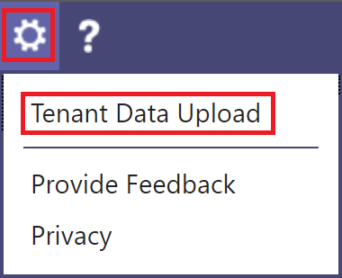

# <a name="quality-of-experience-review-guide"></a><span data-ttu-id="104c3-103">Руководство по анализу качества взаимодействия</span><span class="sxs-lookup"><span data-stu-id="104c3-103">Quality of Experience Review Guide</span></span>

<!-- Note that this link to the Word doc is intentionally NOT the aka.ms/qerquide link -->
<span data-ttu-id="104c3-104">В этом руководстве описана фаза "значение диска" для Microsoft Teams и Skype для бизнеса Online.</span><span class="sxs-lookup"><span data-stu-id="104c3-104">This guide is about the Drive Value phase for Microsoft Teams and Skype for Business Online.</span></span> <span data-ttu-id="104c3-105">Вы можете [скачать версию этого руководства в Word](https://github.com/MicrosoftDocs/OfficeDocs-SkypeForBusiness/blob/live/Teams/downloads/quality-of-experience-review-guide.docx?raw=true) .</span><span class="sxs-lookup"><span data-stu-id="104c3-105">You can [download a Word version](https://github.com/MicrosoftDocs/OfficeDocs-SkypeForBusiness/blob/live/Teams/downloads/quality-of-experience-review-guide.docx?raw=true) of this guide.</span></span>

## <a name="introduction"></a><span data-ttu-id="104c3-106">Введение</span><span class="sxs-lookup"><span data-stu-id="104c3-106">Introduction</span></span>

<span data-ttu-id="104c3-107">Чтобы повысить качество взаимодействия с пользователем, организациям нужно оператионализе основные области, показанные на приведенном ниже рисунке.</span><span class="sxs-lookup"><span data-stu-id="104c3-107">To have the greatest impact on improving the user experience, organizations need to operationalize the key areas that are shown in the following figure.</span></span> <span data-ttu-id="104c3-108">Дополнительные области включают определение рабочих задач, задание целевых объектов для метрик качества, определение целей, используемых для оценки успеха Организации, и сужение областей расследования по мере необходимости.</span><span class="sxs-lookup"><span data-stu-id="104c3-108">Additional areas include identifying operational tasks, establishing targets for quality metrics, ascertaining the metrics to use to gauge organizational success, and narrowing areas of investigation as needed.</span></span>


<span data-ttu-id="104c3-109"></span><span class="sxs-lookup"><span data-stu-id="104c3-109"></span></span>

<span data-ttu-id="104c3-110">_На рисунке 1 описываются основные рабочие области, посвященные всему руководству._</span><span class="sxs-lookup"><span data-stu-id="104c3-110">_Figure 1 - Key operational areas covered throughout this guide_</span></span>

<span data-ttu-id="104c3-111">Непрерывно оценивая и исправление области, описанные в этом руководстве, вы можете уменьшить их потенциал, чтобы негативно повлиять на качество работы пользователей.</span><span class="sxs-lookup"><span data-stu-id="104c3-111">By continually assessing and remediating the areas described in this guide, you can reduce their potential to negatively affect the quality of your users’ experience.</span></span> <span data-ttu-id="104c3-112">Большинство встречающихся в развертывании проблем с взаимодействием с пользователем можно разделить на следующие категории:</span><span class="sxs-lookup"><span data-stu-id="104c3-112">Most user-experience problems encountered in a deployment can be grouped into the following categories:</span></span>

-   <span data-ttu-id="104c3-113">Неполная настройка брандмауэра или прокси-сервера</span><span class="sxs-lookup"><span data-stu-id="104c3-113">Incomplete firewall or proxy configuration</span></span>
-   <span data-ttu-id="104c3-114">Слабый охват сети Wi-Fi</span><span class="sxs-lookup"><span data-stu-id="104c3-114">Poor Wi-Fi coverage</span></span>
-   <span data-ttu-id="104c3-115">Недостаточная пропускная способность</span><span class="sxs-lookup"><span data-stu-id="104c3-115">Insufficient bandwidth</span></span>
-   <span data-ttu-id="104c3-116">VPN;</span><span class="sxs-lookup"><span data-stu-id="104c3-116">VPN</span></span>
-   <span data-ttu-id="104c3-117">Неправильные или устаревшие клиентские версии и драйверы</span><span class="sxs-lookup"><span data-stu-id="104c3-117">Inconsistent or outdated client versions and drivers</span></span>
-   <span data-ttu-id="104c3-118">Неоптимизированные или встроенные звуковые устройства</span><span class="sxs-lookup"><span data-stu-id="104c3-118">Unoptimized or built-in audio devices</span></span>
-   <span data-ttu-id="104c3-119">Проблемы с подсетями или сетевыми устройствами</span><span class="sxs-lookup"><span data-stu-id="104c3-119">Problematic subnets or network devices</span></span>

<span data-ttu-id="104c3-120">Благодаря правильному планированию и проектированию перед развертыванием Teams или Skype для бизнеса Online вы можете уменьшить трудозатраты, необходимые для обеспечения высокого качества взаимодействия.</span><span class="sxs-lookup"><span data-stu-id="104c3-120">Through proper planning and design before deploying Teams or Skype for Business Online, you can reduce the amount of effort that will be required to maintain high-quality experiences.</span></span>

<span data-ttu-id="104c3-121">В этом руководстве рассказывается о том, как использовать панель мониторинга качества звонков (CQD) в качестве основного средства для создания отчетов и изучения каждой из них, с особым выделением звука для максимального внедрения и воздействия.</span><span class="sxs-lookup"><span data-stu-id="104c3-121">This guide focuses on using the Call Quality Dashboard (CQD) Online as the primary tool to report and investigate each area, with a special emphasis on audio to maximize adoption and impact.</span></span> <span data-ttu-id="104c3-122">Любые усовершенствования, внесенные в сеть для улучшения качества звука, также переводятся на улучшенные возможности совместного использования видео и рабочего стола.</span><span class="sxs-lookup"><span data-stu-id="104c3-122">Any improvements made to the network to improve the audio experience will also directly translate to improvements in video and desktop sharing.</span></span>

<span data-ttu-id="104c3-123">Для ускорения оценки доступны [два готовых шаблона CQD](https://aka.ms/qertemplates) : один — для управления всеми сетями, а другой — только для управляемых (внутренних) сетей.</span><span class="sxs-lookup"><span data-stu-id="104c3-123">To accelerate your assessment, [two curated CQD templates](https://aka.ms/qertemplates) are provided: one is for managing all networks and the other is filtered for managed (internal) networks only.</span></span> <span data-ttu-id="104c3-124">Несмотря на то, что отчеты с шаблоном "все сети" настроены для отображения собранных и сетевых данных, они по-прежнему могут использоваться при сборе и загрузке сведений о сборке.</span><span class="sxs-lookup"><span data-stu-id="104c3-124">Although the All Networks template reports are configured to display building and network information, they can still be used while you work toward collecting and uploading building information.</span></span> <span data-ttu-id="104c3-125">Передача данных в CQD позволяет службе усовершенствовать создание отчетов путем добавления настраиваемой сборки, сети и сведений о расположении, а также отличия внутренние данные от внешних подсетей.</span><span class="sxs-lookup"><span data-stu-id="104c3-125">Uploading building information into CQD enables the service to enhance reporting by adding custom building, network, and location information while differentiating internal from external subnets.</span></span> <span data-ttu-id="104c3-126">Дополнительные сведения можно найти в разделе [Создание сопоставления](#building-mapping) ниже в этом руководстве.</span><span class="sxs-lookup"><span data-stu-id="104c3-126">For more information, see [Building mapping](#building-mapping) later in this guide.</span></span>

### <a name="intended-audience"></a><span data-ttu-id="104c3-127">Целевая аудитория</span><span class="sxs-lookup"><span data-stu-id="104c3-127">Intended audience</span></span>

<span data-ttu-id="104c3-128">Это руководство предназначено для использования в качестве заинтересованных лиц и пользователей с такими ролями, как руководитель по совместной работе/архитектор, консультант, изменения специалистам по управлению/внедрению, сотрудникам отдела обслуживания и поддержки, а также сотрудникам сети, сотрудникам и ИТ-администраторам.</span><span class="sxs-lookup"><span data-stu-id="104c3-128">This guide is intended to be used by partner and customer stakeholders with roles such as Collaboration Lead/Architect, Consultant, Change Management/Adoption Specialist, Support/Help Desk Lead, Network Lead, Desktop Lead, and IT Admin.</span></span>

<span data-ttu-id="104c3-129">Это руководство также предназначено для использования с помощью назначенных лидера качества (-ов).</span><span class="sxs-lookup"><span data-stu-id="104c3-129">This guide is also intended to be used by the designated quality champion(s).</span></span> <span data-ttu-id="104c3-130">Дополнительные сведения можно найти [в разделе роль лидера качества](4-envision-plan-my-service-management.md#the-quality-champion-role).</span><span class="sxs-lookup"><span data-stu-id="104c3-130">For more information, see [the Quality Champion role](4-envision-plan-my-service-management.md#the-quality-champion-role).</span></span>

## <a name="assign-roles-for-accessing-cqd"></a><span data-ttu-id="104c3-131">Назначение ролей для доступа к CQD</span><span class="sxs-lookup"><span data-stu-id="104c3-131">Assign roles for accessing CQD</span></span>

<span data-ttu-id="104c3-132">Перед тем как приступить к работе с этим руководством, убедитесь в том, что у вас есть соответствующие [роли](https://docs.microsoft.com/office365/admin/add-users/about-admin-roles) клиента, и вы можете получить доступ к CQD.</span><span class="sxs-lookup"><span data-stu-id="104c3-132">Before using this guide, make sure you have the proper tenant [roles](https://docs.microsoft.com/office365/admin/add-users/about-admin-roles) assigned so that you can access CQD.</span></span>

<span data-ttu-id="104c3-133">В этой таблице показано, что может делать каждая роль в CQD:</span><span class="sxs-lookup"><span data-stu-id="104c3-133">This table shows you what each role can do in CQD:</span></span>


|  |<span data-ttu-id="104c3-134">Просмотр отчетов</span><span class="sxs-lookup"><span data-stu-id="104c3-134">View reports</span></span>  |<span data-ttu-id="104c3-135">Просмотр полей ЕУИИ</span><span class="sxs-lookup"><span data-stu-id="104c3-135">View EUII fields</span></span>  |<span data-ttu-id="104c3-136">Создание отчетов</span><span class="sxs-lookup"><span data-stu-id="104c3-136">Create reports</span></span>  |<span data-ttu-id="104c3-137">Отправка данных о сборке</span><span class="sxs-lookup"><span data-stu-id="104c3-137">Upload building data</span></span>  |
|---------|:-------:|:-------:|:-------:|:-------:|
|<span data-ttu-id="104c3-138">Глобальный администратор Office 365</span><span class="sxs-lookup"><span data-stu-id="104c3-138">Office 365 Global Administrator</span></span>     |<span data-ttu-id="104c3-139">Да </span><span class="sxs-lookup"><span data-stu-id="104c3-139">Yes</span></span>         |<span data-ttu-id="104c3-140">Да </span><span class="sxs-lookup"><span data-stu-id="104c3-140">Yes</span></span>         |<span data-ttu-id="104c3-141">Да </span><span class="sxs-lookup"><span data-stu-id="104c3-141">Yes</span></span>         |<span data-ttu-id="104c3-142">Да </span><span class="sxs-lookup"><span data-stu-id="104c3-142">Yes</span></span>         |
|<span data-ttu-id="104c3-143">Администратор служб Teams</span><span class="sxs-lookup"><span data-stu-id="104c3-143">Teams Service Administrator</span></span>     |<span data-ttu-id="104c3-144">Да </span><span class="sxs-lookup"><span data-stu-id="104c3-144">Yes</span></span>         |<span data-ttu-id="104c3-145">Да </span><span class="sxs-lookup"><span data-stu-id="104c3-145">Yes</span></span>         |<span data-ttu-id="104c3-146">Да </span><span class="sxs-lookup"><span data-stu-id="104c3-146">Yes</span></span>         |<span data-ttu-id="104c3-147">Да </span><span class="sxs-lookup"><span data-stu-id="104c3-147">Yes</span></span>         |
|<span data-ttu-id="104c3-148">Администратор коммуникаций Teams</span><span class="sxs-lookup"><span data-stu-id="104c3-148">Teams Communications Administrator</span></span>     |<span data-ttu-id="104c3-149">Да </span><span class="sxs-lookup"><span data-stu-id="104c3-149">Yes</span></span>         |<span data-ttu-id="104c3-150">Да </span><span class="sxs-lookup"><span data-stu-id="104c3-150">Yes</span></span>         |<span data-ttu-id="104c3-151">Да </span><span class="sxs-lookup"><span data-stu-id="104c3-151">Yes</span></span>         |<span data-ttu-id="104c3-152">Да </span><span class="sxs-lookup"><span data-stu-id="104c3-152">Yes</span></span>         |
|<span data-ttu-id="104c3-153">Инженер поддержки по коммуникациям Teams</span><span class="sxs-lookup"><span data-stu-id="104c3-153">Teams Communications Support Engineer</span></span>     |<span data-ttu-id="104c3-154">Да </span><span class="sxs-lookup"><span data-stu-id="104c3-154">Yes</span></span>         |<span data-ttu-id="104c3-155">Да </span><span class="sxs-lookup"><span data-stu-id="104c3-155">Yes</span></span>         |<span data-ttu-id="104c3-156">Да</span><span class="sxs-lookup"><span data-stu-id="104c3-156">Yes</span></span>         |<span data-ttu-id="104c3-157">Нет</span><span class="sxs-lookup"><span data-stu-id="104c3-157">No</span></span>         |
|<span data-ttu-id="104c3-158">Специалист по поддержке взаимодействия в Teams</span><span class="sxs-lookup"><span data-stu-id="104c3-158">Teams Communications Support Specialist</span></span>     |<span data-ttu-id="104c3-159">Да</span><span class="sxs-lookup"><span data-stu-id="104c3-159">Yes</span></span>         |<span data-ttu-id="104c3-160">Нет</span><span class="sxs-lookup"><span data-stu-id="104c3-160">No</span></span>         |<span data-ttu-id="104c3-161">Да</span><span class="sxs-lookup"><span data-stu-id="104c3-161">Yes</span></span>         |<span data-ttu-id="104c3-162">Нет</span><span class="sxs-lookup"><span data-stu-id="104c3-162">No</span></span>         |
|<span data-ttu-id="104c3-163">Администратор Skype для бизнеса</span><span class="sxs-lookup"><span data-stu-id="104c3-163">Skype for Business Administrator</span></span>     |<span data-ttu-id="104c3-164">Да </span><span class="sxs-lookup"><span data-stu-id="104c3-164">Yes</span></span>         |<span data-ttu-id="104c3-165">Да </span><span class="sxs-lookup"><span data-stu-id="104c3-165">Yes</span></span>         |<span data-ttu-id="104c3-166">Да </span><span class="sxs-lookup"><span data-stu-id="104c3-166">Yes</span></span>         |<span data-ttu-id="104c3-167">Да </span><span class="sxs-lookup"><span data-stu-id="104c3-167">Yes</span></span>         |
|<span data-ttu-id="104c3-168">Глобальный читатель Azure AD</span><span class="sxs-lookup"><span data-stu-id="104c3-168">Azure AD Global Reader</span></span> |<span data-ttu-id="104c3-169">Да </span><span class="sxs-lookup"><span data-stu-id="104c3-169">Yes</span></span>         |<span data-ttu-id="104c3-170">Да </span><span class="sxs-lookup"><span data-stu-id="104c3-170">Yes</span></span>         |<span data-ttu-id="104c3-171">Да</span><span class="sxs-lookup"><span data-stu-id="104c3-171">Yes</span></span>         |<span data-ttu-id="104c3-172">Нет</span><span class="sxs-lookup"><span data-stu-id="104c3-172">No</span></span>         |
|<span data-ttu-id="104c3-173">Office 365 сообщает читателям<sup>1</sup></span><span class="sxs-lookup"><span data-stu-id="104c3-173">Office 365 Reports Reader<sup>1</sup></span></span>     |<span data-ttu-id="104c3-174">Да</span><span class="sxs-lookup"><span data-stu-id="104c3-174">Yes</span></span>         |<span data-ttu-id="104c3-175">Нет</span><span class="sxs-lookup"><span data-stu-id="104c3-175">No</span></span>         |<span data-ttu-id="104c3-176">Да</span><span class="sxs-lookup"><span data-stu-id="104c3-176">Yes</span></span>         |<span data-ttu-id="104c3-177">Нет</span><span class="sxs-lookup"><span data-stu-id="104c3-177">No</span></span>         |

<span data-ttu-id="104c3-178"><sup>1</sup> в дополнение к ЧТЕНию CQDных отчетов Office 365 может просматривать все [отчеты об активности](https://support.office.com/article/activity-reports-0d6dfb17-8582-4172-a9a9-aed798150263) в центре администрирования и любые отчеты из пакета содержимого для оценки [внедрения Microsoft 365](https://support.office.com/article/Office-365-Adoption-content-pack-77ff780d-ab19-4553-adea-09cb65ad0f1f).</span><span class="sxs-lookup"><span data-stu-id="104c3-178"><sup>1</sup> In addition to reading CQD reports, the Office 365 Reports Reader can view all the [activity reports](https://support.office.com/article/activity-reports-0d6dfb17-8582-4172-a9a9-aed798150263) in the admin center and any reports from the [Microsoft 365 Adoption content pack](https://support.office.com/article/Office-365-Adoption-content-pack-77ff780d-ab19-4553-adea-09cb65ad0f1f).</span></span>

> [!NOTE]
> <span data-ttu-id="104c3-179">Если вы не видите ЕУИИ (сведения для конечных пользователей) и у вас есть одна из ролей, которые могут просматривать эти данные, имейте в виду, что CQD только в течение 30 дней.</span><span class="sxs-lookup"><span data-stu-id="104c3-179">If you're not seeing EUII (end-user identifiable information) and you have one of the roles that's permitted to see this information, keep in mind that CQD only keeps EUII for 30 days.</span></span> <span data-ttu-id="104c3-180">Все, более 30 дней, удаляются.</span><span class="sxs-lookup"><span data-stu-id="104c3-180">Anything older than 30 days is deleted.</span></span>

## <a name="what-is-quality"></a><span data-ttu-id="104c3-181">Что такое качество?</span><span class="sxs-lookup"><span data-stu-id="104c3-181">What is quality?</span></span>

<span data-ttu-id="104c3-182">При обсуждении качества в Teams и Skype для бизнеса важно определить термин для достижения общего понимания.</span><span class="sxs-lookup"><span data-stu-id="104c3-182">When discussing quality in Teams and Skype for Business, it’s important to define the term to achieve a common understanding.</span></span> <span data-ttu-id="104c3-183">Качество, как определено здесь, — это сочетание показателей обслуживания и взаимодействия с пользователем.</span><span class="sxs-lookup"><span data-stu-id="104c3-183">Quality, as defined here, is a combination of service metrics and user experience.</span></span>

<!-- Note: need to update graphic-->
<span data-ttu-id="104c3-184"></span><span class="sxs-lookup"><span data-stu-id="104c3-184"></span></span>

<span data-ttu-id="104c3-185">_Рисунок 2: что такое качество?_</span><span class="sxs-lookup"><span data-stu-id="104c3-185">_Figure 2 - What is quality?_</span></span>

### <a name="service-metrics"></a><span data-ttu-id="104c3-186">Метрики службы</span><span class="sxs-lookup"><span data-stu-id="104c3-186">Service metrics</span></span>

<span data-ttu-id="104c3-187">Метрики службы состоят из конкретных клиентских метрик.</span><span class="sxs-lookup"><span data-stu-id="104c3-187">Service metrics consist of specific client-based metrics.</span></span> <span data-ttu-id="104c3-188">При каждом звонке клиент собирает информацию о звонке и отправляет отчет в конце каждого вызова, к которому позже можно получить доступ с помощью CQD или [службы аналитики звонков](https://techcommunity.microsoft.com/t5/Skype-for-Business-Blog/Introducing-Call-Analytics/ba-p/57309).</span><span class="sxs-lookup"><span data-stu-id="104c3-188">During each call, the client collects telemetry information about the call and submits a report at the end of each call that can be later accessed through CQD or [Call Analytics](https://techcommunity.microsoft.com/t5/Skype-for-Business-Blog/Introducing-Call-Analytics/ba-p/57309).</span></span> <span data-ttu-id="104c3-189">Ниже перечислены эти показатели.</span><span class="sxs-lookup"><span data-stu-id="104c3-189">These metrics include:</span></span>

-   <span data-ttu-id="104c3-190">Низкая скорость потока</span><span class="sxs-lookup"><span data-stu-id="104c3-190">Poor Stream Rate</span></span>
-   <span data-ttu-id="104c3-191">Частота сбоев при установке</span><span class="sxs-lookup"><span data-stu-id="104c3-191">Setup Failure Rate</span></span>
-   <span data-ttu-id="104c3-192">Частота сбоев перетаскивания</span><span class="sxs-lookup"><span data-stu-id="104c3-192">Drop Failure Rate</span></span>


#### <a name="poor-stream-rate"></a><span data-ttu-id="104c3-193">Низкая скорость потока</span><span class="sxs-lookup"><span data-stu-id="104c3-193">Poor Stream Rate</span></span>

<span data-ttu-id="104c3-194">Низкая скорость потока (PSR) представляет процент потоков в Организации, которые имеют низкое качество.</span><span class="sxs-lookup"><span data-stu-id="104c3-194">The poor stream rate (PSR) represents the organization’s overall percentage of streams that have poor quality.</span></span> <span data-ttu-id="104c3-195">Эта метрика предназначена для выделения областей, в которых Организация может сосредоточиться на усилиях, чтобы уменьшить это значение и улучшить взаимодействие с пользователем, поэтому, благодаря чему [управляемые сети](#managed-vs-unmanaged-networks) являются основным фокусом при просмотре PSR.</span><span class="sxs-lookup"><span data-stu-id="104c3-195">This metric is meant to highlight areas where your organization can concentrate effort to have the strongest impact toward reducing this value and improving the user experience, which is why [managed networks](#managed-vs-unmanaged-networks) are the primary focus when looking at PSR.</span></span> <span data-ttu-id="104c3-196">Внешние пользователи также важны, но исследование в разных организациях отличается.</span><span class="sxs-lookup"><span data-stu-id="104c3-196">External users are important too, but investigation differs on an organizational basis.</span></span> <span data-ttu-id="104c3-197">Рассмотрите рекомендации для внешних пользователей и проанализируйте внешние звонки независимо от всей Организации.</span><span class="sxs-lookup"><span data-stu-id="104c3-197">Consider providing best practices for external users, and investigate external calls independently from the overall organization.</span></span>

<span data-ttu-id="104c3-198">Фактическое измерение в CQD зависит от рабочей нагрузки, но для целей проверки качества в основном используется _процентное значение "низкое качество звука_ ".</span><span class="sxs-lookup"><span data-stu-id="104c3-198">The actual measurement in CQD varies by workload, but for the purposes of the Quality Experience Review we focus primarily on the _Audio Poor Percentage_ measurement.</span></span> <span data-ttu-id="104c3-199">PSR состоит из пяти средних показателей сети, описанных в таблице ниже.</span><span class="sxs-lookup"><span data-stu-id="104c3-199">PSR is made up of the five network metric averages described in the following table.</span></span> <span data-ttu-id="104c3-200">Чтобы поток был классифицирован как неудовлетворительный, необходимо, чтобы только одна метрика превышала определенный порог.</span><span class="sxs-lookup"><span data-stu-id="104c3-200">For a stream to be classified as poor, only one metric needs to exceed the defined threshold.</span></span> <span data-ttu-id="104c3-201">Дополнительные сведения о процессе классификации потоков приведены в [этой статье](stream-classification-in-call-quality-dashboard.md).</span><span class="sxs-lookup"><span data-stu-id="104c3-201">For more information about the stream classification process, see [this article](stream-classification-in-call-quality-dashboard.md).</span></span>

> [!Note]
> <span data-ttu-id="104c3-202">CQD предоставляет "плохое из-за..."</span><span class="sxs-lookup"><span data-stu-id="104c3-202">CQD provides the “Poor Due To…”</span></span> <span data-ttu-id="104c3-203">измерения для лучшего понимания того, какое условие привело к тому, что поток считается низким.</span><span class="sxs-lookup"><span data-stu-id="104c3-203">measurements to better understand what condition caused the stream to be classified as poor.</span></span>


<span data-ttu-id="104c3-204">_Таблица 1 — метрики низкого качества звука_</span><span class="sxs-lookup"><span data-stu-id="104c3-204">_Table 1 - Audio poor quality metrics_</span></span>

| <span data-ttu-id="104c3-205">Средняя метрика</span><span class="sxs-lookup"><span data-stu-id="104c3-205">Metric average</span></span>     | <span data-ttu-id="104c3-206">Описание</span><span class="sxs-lookup"><span data-stu-id="104c3-206">Description</span></span>     | <span data-ttu-id="104c3-207">Взаимодействие с пользователем</span><span class="sxs-lookup"><span data-stu-id="104c3-207">User experience</span></span> |
|-------------|-----------------|-----------------|
| <span data-ttu-id="104c3-208">Колебание \>30 мс</span><span class="sxs-lookup"><span data-stu-id="104c3-208">Jitter \>30 ms</span></span>        | <span data-ttu-id="104c3-209">Это среднее значение задержки между последовательными пакетами.</span><span class="sxs-lookup"><span data-stu-id="104c3-209">This is the average change in delay between successive packets.</span></span> <span data-ttu-id="104c3-210">Группы и Skype для бизнеса могут адаптироваться к некоторым уровням колебаний с помощью буферизации.</span><span class="sxs-lookup"><span data-stu-id="104c3-210">Teams and Skype for Business can adapt to some levels of jitter through buffering.</span></span> <span data-ttu-id="104c3-211">Это возможно только в том случае, если пределы превышают размер буфера, который участник замечает на последствия колебаний.</span><span class="sxs-lookup"><span data-stu-id="104c3-211">It’s only when the jitter exceeds the buffering that a participant notices the effects of jitter.</span></span>      | <span data-ttu-id="104c3-212">Пакеты, которые поступают на разные скорости, вызывают звуковое сопровождение динамика.</span><span class="sxs-lookup"><span data-stu-id="104c3-212">The packets arriving at different speeds cause a speaker’s voice to sound robotic.</span></span>   |
| <span data-ttu-id="104c3-213">Доля \>потерь пакетов в 10% или 0,1</span><span class="sxs-lookup"><span data-stu-id="104c3-213">Packet loss rate \>10% or 0.1</span></span>        | <span data-ttu-id="104c3-214">Это часто определяется как процент потерянных пакетов.</span><span class="sxs-lookup"><span data-stu-id="104c3-214">This is often defined as a percentage of packets that are lost.</span></span> <span data-ttu-id="104c3-215">Потери пакетов прямо влияют на качество звука — от небольшого размера отдельных потерянных пакетов, которые практически не повлияют на обратные потери с обратной подходящими, что приводит к полному обрезанию звука.</span><span class="sxs-lookup"><span data-stu-id="104c3-215">Packet loss directly affects audio quality—from small, individual lost packets that have almost no impact to back-to-back burst losses that cause audio to cut out completely.</span></span>     | <span data-ttu-id="104c3-216">Пакеты отбрасываются и не поступают на их предполагаемые места назначения, что приводит к пропускам слогов и слов, а также неровности видео и совместного использования.</span><span class="sxs-lookup"><span data-stu-id="104c3-216">The packets being dropped and not arriving at their intended destination cause gaps in the media, resulting in missed syllables and words, and choppy video and sharing.</span></span> |
| <span data-ttu-id="104c3-217">Время \>кругового приема 500 мсек</span><span class="sxs-lookup"><span data-stu-id="104c3-217">Round-trip time \>500 ms</span></span>        | <span data-ttu-id="104c3-218">Это время, необходимое для получения IP-пакета от точки A до точки B и возврата к точке A. Эта задержка распространения сети связана с физическим расстоянием между двумя точками и скоростью света, а также включает дополнительные служебные данные, которые используются различными устройствами сетевого пути.</span><span class="sxs-lookup"><span data-stu-id="104c3-218">This is the time it takes to get an IP packet from point A to point B and back to point A. This network propagation delay is tied to the physical distance between the two points and the speed of light, and includes additional overhead taken by the various devices in the network path.</span></span>      | <span data-ttu-id="104c3-219">Пакеты, которые слишком долго попадают на место назначения, вызывают эффект очень-рация.</span><span class="sxs-lookup"><span data-stu-id="104c3-219">The packets taking too long to arrive at their destination cause a walkie-talkie effect.</span></span>   |
| <span data-ttu-id="104c3-220">Среднее \>нмосое замедление 1,0</span><span class="sxs-lookup"><span data-stu-id="104c3-220">NMOS degradation average \>1.0</span></span>         | <span data-ttu-id="104c3-221">Среднее значение "в сети" означает, что для потока выпадение [очков (нмос)](https://docs.microsoft.com/previous-versions/office/communications-server/bb894481(v=office.12)#network-mos) .</span><span class="sxs-lookup"><span data-stu-id="104c3-221">Average [Network Mean Opinion Score (NMOS)](https://docs.microsoft.com/previous-versions/office/communications-server/bb894481(v=office.12)#network-mos) degradation for the stream.</span></span> <span data-ttu-id="104c3-222">Обозначает степень потери сети и колебаний нарушения качества полученного звука, вызвавшего НМОСу перетаскивания более чем одной точкой.</span><span class="sxs-lookup"><span data-stu-id="104c3-222">Represents how much the network loss and jitter has affected the quality of received audio that caused the NMOS to drop by more than one point.</span></span> | <span data-ttu-id="104c3-223">Это сочетание колебаний, потерь пакетов и — в меньшую степень, чем увеличение времени кругового приема.</span><span class="sxs-lookup"><span data-stu-id="104c3-223">This is a combination of jitter, packet loss, and—to a lesser degree—increased round-trip time.</span></span> <span data-ttu-id="104c3-224">Пользователю может быть присвоена комбинация этих симптомов.</span><span class="sxs-lookup"><span data-stu-id="104c3-224">The user might be experiencing a combination of these symptoms.</span></span>   |
| <span data-ttu-id="104c3-225">Среднее соотношение количества скрытых \>образцов 7% или 0,07</span><span class="sxs-lookup"><span data-stu-id="104c3-225">Average ratio of concealed samples \>7% or 0.07</span></span> | <span data-ttu-id="104c3-226">Среднее соотношение количества звуковых кадров с видимыми выборками, созданными при воспроизведении потерь пакетов на общее количество звуковых кадров.</span><span class="sxs-lookup"><span data-stu-id="104c3-226">Average ratio of the number of audio frames with concealed samples generated by packet loss healing to the total number of audio frames.</span></span> <span data-ttu-id="104c3-227">Скрытый образец звука — это метод, который используется для сглаживания внезапного перехода, которое обычно возникает из-за разрыва сетевых пакетов.</span><span class="sxs-lookup"><span data-stu-id="104c3-227">A concealed audio sample is a technique used to smooth out the abrupt transition that would usually be caused by dropped network packets.</span></span>      | <span data-ttu-id="104c3-228">Высокие значения указывают на то, что были применены важные уровни скрытого искажения, и в результате чего теряется звук.</span><span class="sxs-lookup"><span data-stu-id="104c3-228">High values indicate that significant levels of loss concealment were applied and resulted in distorted or lost audio.</span></span>     |

#### <a name="setup-failure-rate"></a><span data-ttu-id="104c3-229">Частота сбоев при установке</span><span class="sxs-lookup"><span data-stu-id="104c3-229">Setup Failure Rate</span></span>

<span data-ttu-id="104c3-230">Частота сбоев при установке, в противном случае называемая _общим процентом сбоев настройки звонков_ в CQD, — количество потоков, в которых не удалось установить путь к носителю между конечными точками в начале звонка.</span><span class="sxs-lookup"><span data-stu-id="104c3-230">The setup failure rate, otherwise known as the _Total Call Setup Failure Percentage_ measurement in CQD, is the number of streams where the media path couldn’t be established between the endpoints at the start of the call.</span></span>

<span data-ttu-id="104c3-231">Это представляет поток мультимедиа, который не удалось установить.</span><span class="sxs-lookup"><span data-stu-id="104c3-231">This represents any media stream that couldn’t be established.</span></span> <span data-ttu-id="104c3-232">С учетом важности воздействия на работу пользователя, измеряемого здесь, цель состоит в том, чтобы уменьшить это значение как можно ближе к нулю.</span><span class="sxs-lookup"><span data-stu-id="104c3-232">Given the severity of the impact on the user experience measured here, the goal is to reduce this value to as close to zero as possible.</span></span> <span data-ttu-id="104c3-233">Высокое значение для этой метрики более распространено в новых развертываниях с неполными правилами брандмауэра, чем при преждевременном развертывании, но важно регулярно просматривать их.</span><span class="sxs-lookup"><span data-stu-id="104c3-233">A high value for this metric is more common in new deployments with incomplete firewall rules than a mature deployment, but it’s still important to watch on a regular basis.</span></span>

<span data-ttu-id="104c3-234">Эта метрика вычисляется с учетом общего количества потоков, которые не удалось настроить, на общее количество потоков, которые отправили сведения об успешном звонке (CDR).</span><span class="sxs-lookup"><span data-stu-id="104c3-234">This metric is calculated by taking the total number of streams that failed to set up divided by the total number of streams that submitted a successful call detail record (CDR):</span></span>

-   <span data-ttu-id="104c3-235">**Ошибка при установке** = общее число потоков, выполненных программой настройки: Счетчик потока/всего CDR количество доступных потоков</span><span class="sxs-lookup"><span data-stu-id="104c3-235">**Setup Failure Rate** = Total Call Setup Failed Stream Count / Total CDR Available Stream Count</span></span>

#### <a name="drop-failure-rate"></a><span data-ttu-id="104c3-236">Частота сбоев перетаскивания</span><span class="sxs-lookup"><span data-stu-id="104c3-236">Drop Failure Rate</span></span>

<span data-ttu-id="104c3-237">Процент сбоев перетаскивания, в противном случае называемый общим количеством _неудачных_ погрешностей в CQD, — доля успешно установленных потоков, в которой путь к носителю не был завершен нормально.</span><span class="sxs-lookup"><span data-stu-id="104c3-237">The drop failure rate, otherwise known as the _Total Call Dropped Failure Percentage_ measurement in CQD, is the percentage of successfully established streams where the media path didn’t terminate normally.</span></span>

<span data-ttu-id="104c3-238">Это соответствует любому потоку мультимедиа, который был неожиданно прерван.</span><span class="sxs-lookup"><span data-stu-id="104c3-238">This represents any media stream that terminated unexpectedly.</span></span> <span data-ttu-id="104c3-239">Несмотря на то, что это не так серьезно, как поток, который не удалось настроить, он негативно влияет на взаимодействие с пользователем.</span><span class="sxs-lookup"><span data-stu-id="104c3-239">Although the impact of this isn’t as severe as a stream that failed to set up, it will negatively affect the user experience.</span></span> <span data-ttu-id="104c3-240">Внезапное и частые носители не только могут значительно повлиять на взаимодействие с пользователем, они приводят к необходимости повторного подключения пользователей, что приводит к снижению производительности.</span><span class="sxs-lookup"><span data-stu-id="104c3-240">Sudden and frequent media drops not only can have a severe impact on the user experience, they result in the need for users to reconnect, resulting in a loss in productivity.</span></span>

<span data-ttu-id="104c3-241">Показатели рассчитываются путем получения общего числа удаленных потоков, разделенных на общее количество потоков, успешно настроенных.</span><span class="sxs-lookup"><span data-stu-id="104c3-241">The metric is calculated by taking the total number of dropped streams divided by the total count of streams that set up successfully:</span></span>

-   <span data-ttu-id="104c3-242">**Частота сбоев при Отсбросе** = общее число прерванных потоков при настройке общего вызова</span><span class="sxs-lookup"><span data-stu-id="104c3-242">**Drop Failure Rate** = Total Call Dropped Stream Count / Total Call Setup Succeeded Stream Count</span></span>

### <a name="define-your-target-metrics"></a><span data-ttu-id="104c3-243">Определение целевых показателей</span><span class="sxs-lookup"><span data-stu-id="104c3-243">Define your target metrics</span></span>

<span data-ttu-id="104c3-244">В этом разделе рассматриваются некоторые основные метрики службы, используемые для оценки работоспособности служб.</span><span class="sxs-lookup"><span data-stu-id="104c3-244">This section discusses some of the core service metrics that we use to assess how services experience health.</span></span> <span data-ttu-id="104c3-245">Непрерывно оценивая и наблюдая действия, чтобы сохранить эти показатели под определенными целевыми объектами, вы можете обеспечить соответствие пользователей надежным, надежному качеству связи.</span><span class="sxs-lookup"><span data-stu-id="104c3-245">By continually assessing and driving efforts to keep these metrics below their defined targets, you’ll help ensure that your users experience consistent, reliable call quality.</span></span> <span data-ttu-id="104c3-246">Чтобы приступить к работе, предоставляются следующие целевые объекты.</span><span class="sxs-lookup"><span data-stu-id="104c3-246">To get you started, the following targets are provided.</span></span>

<span data-ttu-id="104c3-247">_Таблица 2 — метрики оценки работоспособности основных целевых показателей_</span><span class="sxs-lookup"><span data-stu-id="104c3-247">_Table 2 - Core target health assessment metrics_</span></span>
<table>
<tr>
<th rowspan="2" colspan="2" valign="center"><span data-ttu-id="104c3-248">Тип сети</span><span class="sxs-lookup"><span data-stu-id="104c3-248">Network type</span></span></th><th rowspan="1"><span data-ttu-id="104c3-249">Цели качества</span><span class="sxs-lookup"><span data-stu-id="104c3-249">Quality targets</span></span></th><th colspan="2"><span data-ttu-id="104c3-250">Целевые объекты надежности</span><span class="sxs-lookup"><span data-stu-id="104c3-250">Reliability targets</span></span></th></tr>
<tr><th><span data-ttu-id="104c3-251">Низкая скорость потока звука</span><span class="sxs-lookup"><span data-stu-id="104c3-251">Audio Poor Stream Rate</span></span></th><th><span data-ttu-id="104c3-252">Частота сбоев при установке</span><span class="sxs-lookup"><span data-stu-id="104c3-252">Setup Failure Rate</span></span></th><th><span data-ttu-id="104c3-253">Частота сбоев перетаскивания</span><span class="sxs-lookup"><span data-stu-id="104c3-253">Drop Failure Rate</span></span></th></tr>
<tr><td rowspan="2"><span data-ttu-id="104c3-254"><strong>All</strong></span><span class="sxs-lookup"><span data-stu-id="104c3-254"><strong>All</strong></span></span></td><td><span data-ttu-id="104c3-255">Internal</span><span class="sxs-lookup"><span data-stu-id="104c3-255">Internal</span></span></td><td><span data-ttu-id="104c3-256">2,0%</span><span class="sxs-lookup"><span data-stu-id="104c3-256">2.0%</span></span></td><td><span data-ttu-id="104c3-257">0,5%</span><span class="sxs-lookup"><span data-stu-id="104c3-257">0.5%</span></span></td><td><span data-ttu-id="104c3-258">2,0%</span><span class="sxs-lookup"><span data-stu-id="104c3-258">2.0%</span></span></td></tr>
<tr><td><span data-ttu-id="104c3-259">Общий уровень</span><span class="sxs-lookup"><span data-stu-id="104c3-259">Overall</span></span></td><td><span data-ttu-id="104c3-260">3,0%</span><span class="sxs-lookup"><span data-stu-id="104c3-260">3.0%</span></span></td><td><span data-ttu-id="104c3-261">1,0%</span><span class="sxs-lookup"><span data-stu-id="104c3-261">1.0%</span></span></td><td><span data-ttu-id="104c3-262">3,0%</span><span class="sxs-lookup"><span data-stu-id="104c3-262">3.0%</span></span></td></tr>
<tr><td rowspan="5"><span data-ttu-id="104c3-263"><strong>Конференции</strong></span><span class="sxs-lookup"><span data-stu-id="104c3-263"><strong>Conferencing</strong></span></span></td><td><span data-ttu-id="104c3-264">Internal</span><span class="sxs-lookup"><span data-stu-id="104c3-264">Internal</span></span></td><td><span data-ttu-id="104c3-265">2,0%</span><span class="sxs-lookup"><span data-stu-id="104c3-265">2.0%</span></span></td><td><span data-ttu-id="104c3-266">0,5%</span><span class="sxs-lookup"><span data-stu-id="104c3-266">0.5%</span></span></td><td><span data-ttu-id="104c3-267">2,0%</span><span class="sxs-lookup"><span data-stu-id="104c3-267">2.0%</span></span></td></tr>
<tr><td><span data-ttu-id="104c3-268">Проводные внутренние</span><span class="sxs-lookup"><span data-stu-id="104c3-268">Wired internal</span></span></td><td><span data-ttu-id="104c3-269">1,0%</span><span class="sxs-lookup"><span data-stu-id="104c3-269">1.0%</span></span></td><td><span data-ttu-id="104c3-270">0,5%</span><span class="sxs-lookup"><span data-stu-id="104c3-270">0.5%</span></span></td><td><span data-ttu-id="104c3-271">1,0%</span><span class="sxs-lookup"><span data-stu-id="104c3-271">1.0%</span></span></td></tr>
<tr><td><span data-ttu-id="104c3-272">Внутренняя сеть Wi-Fi 5 ГГц</span><span class="sxs-lookup"><span data-stu-id="104c3-272">Wi-Fi 5 GHz internal</span></span></td><td><span data-ttu-id="104c3-273">1,0%</span><span class="sxs-lookup"><span data-stu-id="104c3-273">1.0%</span></span></td><td><span data-ttu-id="104c3-274">0,5%</span><span class="sxs-lookup"><span data-stu-id="104c3-274">0.5%</span></span></td><td><span data-ttu-id="104c3-275">1,0%</span><span class="sxs-lookup"><span data-stu-id="104c3-275">1.0%</span></span></td></tr>
<tr><td><span data-ttu-id="104c3-276">Внутренняя сеть Wi-Fi 2,4 ГГц</span><span class="sxs-lookup"><span data-stu-id="104c3-276">Wi-Fi 2.4 GHz internal</span></span></td><td><span data-ttu-id="104c3-277">2,0%</span><span class="sxs-lookup"><span data-stu-id="104c3-277">2.0%</span></span></td><td><span data-ttu-id="104c3-278">0,5%</span><span class="sxs-lookup"><span data-stu-id="104c3-278">0.5%</span></span></td><td><span data-ttu-id="104c3-279">2,0%</span><span class="sxs-lookup"><span data-stu-id="104c3-279">2.0%</span></span></td></tr>
<tr><td><span data-ttu-id="104c3-280">Общий уровень</span><span class="sxs-lookup"><span data-stu-id="104c3-280">Overall</span></span></td><td><span data-ttu-id="104c3-281">2,0%</span><span class="sxs-lookup"><span data-stu-id="104c3-281">2.0%</span></span></td><td><span data-ttu-id="104c3-282">0,5%</span><span class="sxs-lookup"><span data-stu-id="104c3-282">0.5%</span></span></td><td><span data-ttu-id="104c3-283">3,0%</span><span class="sxs-lookup"><span data-stu-id="104c3-283">3.0%</span></span></td></tr>
<tr><td rowspan="4"><span data-ttu-id="104c3-284"><strong>Peer</strong></span><span class="sxs-lookup"><span data-stu-id="104c3-284"><strong>P2P</strong></span></span></td><td><span data-ttu-id="104c3-285">Internal</span><span class="sxs-lookup"><span data-stu-id="104c3-285">Internal</span></span></td><td><span data-ttu-id="104c3-286">2,0%</span><span class="sxs-lookup"><span data-stu-id="104c3-286">2.0%</span></span></td><td><span data-ttu-id="104c3-287">0,5%</span><span class="sxs-lookup"><span data-stu-id="104c3-287">0.5%</span></span></td><td><span data-ttu-id="104c3-288">2,0%</span><span class="sxs-lookup"><span data-stu-id="104c3-288">2.0%</span></span></td></tr>
<tr><td><span data-ttu-id="104c3-289">Внутренняя проводная или Wi-Fi 5 ГГц</span><span class="sxs-lookup"><span data-stu-id="104c3-289">Wired/Wi-Fi 5 GHz internal</span></span></td><td><span data-ttu-id="104c3-290">1,0%</span><span class="sxs-lookup"><span data-stu-id="104c3-290">1.0%</span></span></td><td><span data-ttu-id="104c3-291">0,5%</span><span class="sxs-lookup"><span data-stu-id="104c3-291">0.5%</span></span></td><td><span data-ttu-id="104c3-292">1,0%</span><span class="sxs-lookup"><span data-stu-id="104c3-292">1.0%</span></span></td></tr>
<tr><td><span data-ttu-id="104c3-293">Общая проводная/Wi-Fi 5 ГГц</span><span class="sxs-lookup"><span data-stu-id="104c3-293">Wired/Wi-Fi 5 GHz overall</span></span></td><td><span data-ttu-id="104c3-294">2,0%</span><span class="sxs-lookup"><span data-stu-id="104c3-294">2.0%</span></span></td><td><span data-ttu-id="104c3-295">1,0%</span><span class="sxs-lookup"><span data-stu-id="104c3-295">1.0%</span></span></td><td><span data-ttu-id="104c3-296">1,0%</span><span class="sxs-lookup"><span data-stu-id="104c3-296">1.0%</span></span></td></tr>
<tr><td><span data-ttu-id="104c3-297">Общий уровень</span><span class="sxs-lookup"><span data-stu-id="104c3-297">Overall</span></span></td><td><span data-ttu-id="104c3-298">2,0%</span><span class="sxs-lookup"><span data-stu-id="104c3-298">2.0%</span></span></td><td><span data-ttu-id="104c3-299">1,0%</span><span class="sxs-lookup"><span data-stu-id="104c3-299">1.0%</span></span></td><td><span data-ttu-id="104c3-300">3,0%</span><span class="sxs-lookup"><span data-stu-id="104c3-300">3.0%</span></span></td></tr>
</table>


<span data-ttu-id="104c3-301">Важно обсудить и определить цели Организации в соответствии с бизнес-целями.</span><span class="sxs-lookup"><span data-stu-id="104c3-301">It's important to discuss and define your organization’s targets to meet your business objectives.</span></span>

### <a name="user-experience"></a><span data-ttu-id="104c3-302">Взаимодействие с пользователем</span><span class="sxs-lookup"><span data-stu-id="104c3-302">User experience</span></span>

<span data-ttu-id="104c3-303">Анализ взаимодействия с пользователем — это более искусство, чем наука, так как собранные показатели не всегда означают, что в сети или службе есть проблема, но они просто указывают, что пользователь понимает проблему.</span><span class="sxs-lookup"><span data-stu-id="104c3-303">Analyzing the user experience is more art than science, because the metrics gathered here don’t always mean that there’s a problem with the network or service but rather, they simply indicate that the user perceives a problem.</span></span> <span data-ttu-id="104c3-304">Microsoft — это встроенный механизм опроса, известный как оценить мой звонок (РМК), помогающий оценить общее взаимодействие с пользователями.</span><span class="sxs-lookup"><span data-stu-id="104c3-304">Microsoft offers a built-in survey mechanism—known as Rate My Call (RMC)—to help gauge overall user experience.</span></span> <span data-ttu-id="104c3-305">РМК поможет вам ответить на следующие вопросы с точки зрения пользователей:</span><span class="sxs-lookup"><span data-stu-id="104c3-305">RMC will help you answer the following questions from your users’ perspective:</span></span>

-   <span data-ttu-id="104c3-306">Знаете ли я о том, как использовать решение?</span><span class="sxs-lookup"><span data-stu-id="104c3-306">Do I know how to use the solution?</span></span>
-   <span data-ttu-id="104c3-307">Является ли решение простым в использовании и интуитивно понятным, и может ли оно поддерживать повседневные потребности в общении.</span><span class="sxs-lookup"><span data-stu-id="104c3-307">Is the solution easy to use and intuitive, and does it support my day-to-day communication needs?</span></span>
-   <span data-ttu-id="104c3-308">Помогает ли решение выполнить свою работу?</span><span class="sxs-lookup"><span data-stu-id="104c3-308">Does the solution help me get my job done?</span></span>
-   <span data-ttu-id="104c3-309">Каково общее восприятие решения?</span><span class="sxs-lookup"><span data-stu-id="104c3-309">What’s my overall perception of the solution?</span></span>
-   <span data-ttu-id="104c3-310">Можно ли использовать решение в любой момент времени, независимо от того, где я?</span><span class="sxs-lookup"><span data-stu-id="104c3-310">Can I use the solution at any point in time, regardless of where I am?</span></span>
-   <span data-ttu-id="104c3-311">Можно ли настроить и поддерживать Звонок?</span><span class="sxs-lookup"><span data-stu-id="104c3-311">Can I set up and maintain a call?</span></span>

#### <a name="rate-my-call"></a><span data-ttu-id="104c3-312">Оценить мой звонок</span><span class="sxs-lookup"><span data-stu-id="104c3-312">Rate My Call</span></span> 

<span data-ttu-id="104c3-313">Частота моего звонка (РМК) встроена в Teams и Skype для бизнеса и автоматически настраивается на отображение для участника после каждых 10 звонков или 10 процентов.</span><span class="sxs-lookup"><span data-stu-id="104c3-313">Rate My Call (RMC) is built into Teams and Skype for Business and is automatically configured to be displayed to the participant after one in every 10 calls, or 10 percent.</span></span> <span data-ttu-id="104c3-314">Этот краткий опрос предлагает пользователю оценить этот звонок и предоставить небольшой контекст, по которому может возникнуть плохое качество связи.</span><span class="sxs-lookup"><span data-stu-id="104c3-314">This brief survey asks the user to rate the call and provide a little context for why the call quality might have been poor.</span></span> <span data-ttu-id="104c3-315">Один или два рейтинга считаются низкими, от трех до четырех — хорошим, а пять — превосходной.</span><span class="sxs-lookup"><span data-stu-id="104c3-315">A one or two rating is considered poor, three to four is good, and five is excellent.</span></span> <span data-ttu-id="104c3-316">Несмотря на то, что это скорее индикатор задержкой, это является полезной метрикой для устранения проблем, которые могут пропускать показатели обслуживания.</span><span class="sxs-lookup"><span data-stu-id="104c3-316">Although it’s somewhat of a lagging indicator, this is a useful metric for uncovering issues that service metrics can miss.</span></span>

> [!Note]
> <span data-ttu-id="104c3-317">До тех пор, пока пользователи не будут отвечать на опросы РМК, предоставляя хорошую обратную связь в дополнение к плохой, ответы обычно возвращаются в бесконечное отрицательное значение.</span><span class="sxs-lookup"><span data-stu-id="104c3-317">Until users are educated to respond to RMC surveys by giving good feedback in addition to bad, responses typically come back as overwhelmingly negative.</span></span> <span data-ttu-id="104c3-318">Большинство пользователей отвечают на запросы только в том случае, если качество связи низкое.</span><span class="sxs-lookup"><span data-stu-id="104c3-318">Most users only respond when call quality is poor.</span></span> <span data-ttu-id="104c3-319">Из-за этого ваши отчеты РМК могут быть отклонены на низком этапе, даже если показатели обслуживания являются хорошими.</span><span class="sxs-lookup"><span data-stu-id="104c3-319">Because of this, your RMC reports might be skewed to the poor side even while service metrics are good.</span></span>

<span data-ttu-id="104c3-320">Вы можете использовать CQD, чтобы сообщить о ответах на РМК пользователей, а образцы отчетов — в шаблон CQD.</span><span class="sxs-lookup"><span data-stu-id="104c3-320">You can use CQD to report on RMC user responses, and sample reports are included in the CQD template.</span></span> <span data-ttu-id="104c3-321">Однако они не рассматриваются в этом руководстве подробно.</span><span class="sxs-lookup"><span data-stu-id="104c3-321">However, they aren’t discussed in detail in this guide.</span></span> <span data-ttu-id="104c3-322">Дополнительные сведения о РМК в Skype для бизнеса Online и руководство для обучения пользователей по предоставлению полезных ответов РМК можно найти в [этой записи блога](https://blogs.technet.microsoft.com/jenstr/2015/05/05/rate-my-call-in-skype-for-business-2015/).</span><span class="sxs-lookup"><span data-stu-id="104c3-322">For more information about RMC in Skype for Business Online and guidance for educating users to give useful RMC responses, see [this blog post](https://blogs.technet.microsoft.com/jenstr/2015/05/05/rate-my-call-in-skype-for-business-2015/).</span></span>

#### <a name="client-and-device-readiness"></a><span data-ttu-id="104c3-323">Готовность клиента и устройства</span><span class="sxs-lookup"><span data-stu-id="104c3-323">Client and device readiness</span></span>

<span data-ttu-id="104c3-324">Вам нужна надежная стратегия клиента и устройства, чтобы обеспечить постоянную и положительную работу пользователей.</span><span class="sxs-lookup"><span data-stu-id="104c3-324">You need a solid client and device strategy to help ensure that your users have a consistent and positive user experience.</span></span> <span data-ttu-id="104c3-325">Несколько ключевых принципов применяют каждую стратегию готовности.</span><span class="sxs-lookup"><span data-stu-id="104c3-325">A few key principles drive each readiness strategy.</span></span>

##### <a name="client-readiness"></a><span data-ttu-id="104c3-326">Готовность клиента</span><span class="sxs-lookup"><span data-stu-id="104c3-326">Client readiness</span></span>

<span data-ttu-id="104c3-327">Надежная стратегия обеспечения готовности клиентов гарантирует, что пользователи работают с самой последней версией клиента, обеспечивая максимально эффективное качество работы.</span><span class="sxs-lookup"><span data-stu-id="104c3-327">A strong client readiness strategy ensures that your users are running the most recent version of the client while enjoying the best experience possible.</span></span> <span data-ttu-id="104c3-328">Корпорация Майкрософт регулярно подменяет исправления для клиента Skype для бизнеса. обеспечение актуальности данных в вашей среде — это важно для всего успеха.</span><span class="sxs-lookup"><span data-stu-id="104c3-328">Microsoft routinely patches the Skype for Business client; ensuring that you keep it up to date in your environment is vital to your overall success.</span></span> <span data-ttu-id="104c3-329">Важно также помнить о том, как исправить сетевые и видеодрайверы, USB-и звуковые драйверы, так как они часто изменяются и могут повлиять на работу пользователя.</span><span class="sxs-lookup"><span data-stu-id="104c3-329">It’s also important to remember to patch network, video, USB, and audio drivers, because they’re often overlooked and can affect the user’s experience.</span></span> <span data-ttu-id="104c3-330">Возможно, вы можете добавить сетевые и видеодрайверы сети, Wi-Fi, видео, USB и аудио в текущий процесс управления обновлениями.</span><span class="sxs-lookup"><span data-stu-id="104c3-330">Consider adding network, Wi-Fi, video, USB, and audio drivers to your current patch management process.</span></span>

<span data-ttu-id="104c3-331">Мы рекомендуем не разрешать клиентским версиям переноситься за более шести месяцев.</span><span class="sxs-lookup"><span data-stu-id="104c3-331">We recommend that you not let your client versions fall behind by more than six months.</span></span> <span data-ttu-id="104c3-332">Если вы используете Office "нажми и работай", это значит, что служба уже обновлялась.</span><span class="sxs-lookup"><span data-stu-id="104c3-332">If you’re using Office Click-to-Run, you’re already being kept up to date by the service.</span></span> <span data-ttu-id="104c3-333">Используйте включенные [клиентские версии](#client-versions), как описано ниже в этом руководстве, чтобы помочь вам с этим процессом.</span><span class="sxs-lookup"><span data-stu-id="104c3-333">Use the included [client versions](#client-versions), as described later in this guide, to assist you with this process.</span></span> <span data-ttu-id="104c3-334">Вы также можете использовать функцию "оценить мои отчеты", чтобы улучшить стратегию готовности клиентов.</span><span class="sxs-lookup"><span data-stu-id="104c3-334">You can also leverage the Rate My Call sample reports to further enhance your client readiness strategy.</span></span>

> [!IMPORTANT]
> <span data-ttu-id="104c3-335">В настоящее время клиенты Teams распространяются и обновляются автоматически с помощью сети доставки содержимого Azure и будут храниться в актуальном состоянии службой.</span><span class="sxs-lookup"><span data-stu-id="104c3-335">Currently, Teams clients are distributed and updated automatically through the Azure Content Delivery Network and will be kept up to date by the service.</span></span> <span data-ttu-id="104c3-336">Из-за этого вы не можете изучить готовность клиентов и исследование действий, которые не относятся к Teams.</span><span class="sxs-lookup"><span data-stu-id="104c3-336">Due to this, client readiness and investigative activities aren’t applicable to Teams.</span></span>


##### <a name="device-readiness"></a><span data-ttu-id="104c3-337">Готовность устройства</span><span class="sxs-lookup"><span data-stu-id="104c3-337">Device readiness</span></span>

<span data-ttu-id="104c3-338">Ни одна из стратегий не может повлиять на работу пользователя, чем ваша стратегия готовности устройства.</span><span class="sxs-lookup"><span data-stu-id="104c3-338">No one single strategy can affect the user experience more than your device readiness strategy.</span></span> <span data-ttu-id="104c3-339">Большинству организаций требуется удалить ненужные устройства (например, стационарные телефоны или другие устройства) от пользователей, и это часто является основным деловым обоснованием для переключения на Teams или Skype для бизнеса.</span><span class="sxs-lookup"><span data-stu-id="104c3-339">Most organizations are happy to remove unnecessary devices (for example, desk phones or other dedicated audio devices) from users, and this is often a core business justification for switching to Teams or Skype for Business.</span></span> <span data-ttu-id="104c3-340">Тем не менее, такие же организации иногда не забывают предоставлять устройства для замены, даже если эти устройства менее ресурсоемки.</span><span class="sxs-lookup"><span data-stu-id="104c3-340">However, those same organizations sometimes hesitate to provide replacement devices, even if those devices are less expensive.</span></span> <span data-ttu-id="104c3-341">Современные ноутбуки и ПК, на которых установлен встроенный микрофон и динамики, не оптимизируются для передачи голоса по протоколу IP для бизнес-класса (VoIP).</span><span class="sxs-lookup"><span data-stu-id="104c3-341">Modern-day laptops and PCs, though equipped with built-in microphone and speaker, aren’t optimized for business-class voice over IP (VoIP).</span></span> <span data-ttu-id="104c3-342">Это часто приводит к плохому взаимодействию всех участников, особенно если динамики находятся в более шумных условиях.</span><span class="sxs-lookup"><span data-stu-id="104c3-342">This often creates a poor experience for all participants, especially if the speaker is in a noisy environment.</span></span> <span data-ttu-id="104c3-343">Программа для сертификации устройств Майкрософт гарантирует, что при участии пользователя в телефонном звонке с помощью любого устройства, сертифицированного для Teams или Skype для бизнеса, будет выводится впечатление, что это не сертифицированное устройство.</span><span class="sxs-lookup"><span data-stu-id="104c3-343">Microsoft’s device certification program ensures that when a user participates in a phone call by using any device certified for Teams or Skype for Business, it produces an experience that’s superior to a non-certified device.</span></span> 

<span data-ttu-id="104c3-344">Мы всегда рекомендуем пользователям Teams и Skype для бизнеса сертифицированной гарнитуры или динамика при участии в голосовых звонках с помощью настольного компьютера.</span><span class="sxs-lookup"><span data-stu-id="104c3-344">We always recommend that Teams and Skype for Business users use a certified headset or speaker when participating in a voice call through the desktop client.</span></span> <span data-ttu-id="104c3-345">Для получения дополнительных сведений об устройствах, сертифицированных корпорацией Майкрософт, ознакомьтесь с этими статьями о [программе сертификации](/SkypeForBusiness/certification/overview) и просмотрите [Каталог Solutions Partners](https://partnersolutions.skypeforbusiness.com/solutionscatalog/personal-peripherals-pcs).</span><span class="sxs-lookup"><span data-stu-id="104c3-345">For more information about Microsoft certified devices, review these articles about the [certification program](/SkypeForBusiness/certification/overview) and view the [partner solutions catalog](https://partnersolutions.skypeforbusiness.com/solutionscatalog/personal-peripherals-pcs).</span></span> <span data-ttu-id="104c3-346">С помощью [отчета "устройства](#devices)", описанного далее в этом руководстве, можно управлять устройствами.</span><span class="sxs-lookup"><span data-stu-id="104c3-346">Use the [Devices report](#devices), described later in this guide, for assistance with managing your devices.</span></span>


### <a name="categories-of-quality"></a><span data-ttu-id="104c3-347">Категории качества</span><span class="sxs-lookup"><span data-stu-id="104c3-347">Categories of quality</span></span>

<span data-ttu-id="104c3-348">Успех оператионализинг высококачественное и надежное развертывание зависит от того, в какой функциональной среде вы работали в вашем здании.</span><span class="sxs-lookup"><span data-stu-id="104c3-348">The success of operationalizing a high-quality and reliable deployment depends on your building operational rigor.</span></span> <span data-ttu-id="104c3-349">Особенно важно уделять особое внимание трем категориям, показанным на рисунке ниже. Это руководство имеет следующий фокус:</span><span class="sxs-lookup"><span data-stu-id="104c3-349">Specifically, pay special attention to the three categories illustrated in the following figure; these are the focus of this guide:</span></span>

-   <span data-ttu-id="104c3-350">**Network (сеть):** Качество звука, ориентированное на низкую пропорцию (PSR), использование TCP, проводные и беспроводные подсети, а также определение использования HTTP-прокси и VPN.</span><span class="sxs-lookup"><span data-stu-id="104c3-350">**Network:** Audio quality focused on the Poor Stream Ratio (PSR) metric, TCP usage, wired and wireless subnets, and identifying the use of HTTP proxies and VPN.</span></span>

-   <span data-ttu-id="104c3-351">**Конечные точки:** Звуковое устройство и клиентская версия (только для Skype для бизнеса).</span><span class="sxs-lookup"><span data-stu-id="104c3-351">**Endpoints:** Audio devices and client versions (Skype for Business only).</span></span>

-   <span data-ttu-id="104c3-352">**Управление услугами:** Эта категория состоит из двух разделов:</span><span class="sxs-lookup"><span data-stu-id="104c3-352">**Service Management:** This category comprises two sections:</span></span>

    -   <span data-ttu-id="104c3-353">Прежде всего, ответственность за управление службами Teams и Skype для бизнеса Online и ее обслуживание осуществляется корпорацией Майкрософт.</span><span class="sxs-lookup"><span data-stu-id="104c3-353">First is Microsoft’s responsibility to manage and maintain the Teams and Skype for Business Online services.</span></span>

    -   <span data-ttu-id="104c3-354">Вторая — это задачи, которые должны обеспечиваться вашей организацией для обеспечения надежного доступа к службе, например обновление сведений о сборке и поддержка брандмауэров для новых IP-адресов Office 365, так как инфраструктура добавляется к службе.</span><span class="sxs-lookup"><span data-stu-id="104c3-354">Second are tasks your organization must manage to ensure reliable access to the service, such as updating building information and maintaining firewalls for new Office 365 IP addresses as infrastructure is added to the service.</span></span>

<span data-ttu-id="104c3-355"></span><span class="sxs-lookup"><span data-stu-id="104c3-355"></span></span>

<span data-ttu-id="104c3-356">_Рисунок 3: критические категории для развертывания Teams и Skype для бизнеса Online_</span><span class="sxs-lookup"><span data-stu-id="104c3-356">_Figure 3 - Critical categories for Teams and Skype for Business Online deployment_</span></span>

<span data-ttu-id="104c3-357">На приведенном ниже рисунке описаны задачи, которые необходимо выполнить для каждой категории.</span><span class="sxs-lookup"><span data-stu-id="104c3-357">The following graphic outlines the tasks you must execute for each category.</span></span> <span data-ttu-id="104c3-358">Рекомендуется выполнять эти действия один раз в неделю, как минимум.</span><span class="sxs-lookup"><span data-stu-id="104c3-358">We recommend that you run these tasks once a week, at a minimum.</span></span>

<span data-ttu-id="104c3-359">При первом выполнении этих задач потребуется больше усилий, чем при последующих итерациях, так как многие из этих категорий требуют проверки конфигураций развертывания.</span><span class="sxs-lookup"><span data-stu-id="104c3-359">The first time you perform these tasks will take more effort than subsequent iterations, because many of these categories require that you validate your deployment configurations.</span></span> <span data-ttu-id="104c3-360">После того как вы получите нужное состояние, предприняв указанные вами конечные объекты, выполнение этих задач поможет вам сохранить это состояние.</span><span class="sxs-lookup"><span data-stu-id="104c3-360">After you’ve achieved the state you want by meeting the targets you’ve defined, performing these tasks will help you maintain that state.</span></span>

<!--  This is a net new graphic, never was included in the online article. OOPS! -->
<span data-ttu-id="104c3-361"></span><span class="sxs-lookup"><span data-stu-id="104c3-361"></span></span>

#### <a name="service-management-tasks"></a><span data-ttu-id="104c3-362">Задачи управления службами</span><span class="sxs-lookup"><span data-stu-id="104c3-362">Service management tasks</span></span>

<span data-ttu-id="104c3-363">В облачном мире для работы в облаке необходимо выполнить определенные задачи управления обслуживанием для обеспечения высокого качества взаимодействия с пользователем.</span><span class="sxs-lookup"><span data-stu-id="104c3-363">In a cloud-first world, you must perform certain service management tasks to maintain high-quality user experiences.</span></span> <span data-ttu-id="104c3-364">Для выполнения этих задач необходимо обеспечить достаточную пропускную способность для доступа к службе без загрузок Интернет-ссылок, проверки качества обслуживания (QoS) во всех управляемых сетевых областях и, наконец, в верхней части [диапазонов IP-адресов Office 365 на брандмауэрах](https://aka.ms/o365ips).</span><span class="sxs-lookup"><span data-stu-id="104c3-364">These tasks range from ensuring there is sufficient bandwidth to reach the service without saturating internet links, validating that quality of service (QoS) is in place on all managed network areas, and—lastly—staying on top of [Office 365 IP ranges on firewalls](https://aka.ms/o365ips).</span></span>

#### <a name="network-tasks"></a><span data-ttu-id="104c3-365">Сетевые задачи</span><span class="sxs-lookup"><span data-stu-id="104c3-365">Network tasks</span></span>

<span data-ttu-id="104c3-366">Существуют две категории сетевых задач: надежность и качество.</span><span class="sxs-lookup"><span data-stu-id="104c3-366">There are two categories of network tasks: reliability and quality.</span></span> <span data-ttu-id="104c3-367">Надежность — это оценка способности пользователей успешно звонить и оставаться на связи.</span><span class="sxs-lookup"><span data-stu-id="104c3-367">Reliability focuses on measuring the user’s ability to make calls successfully and stay connected.</span></span> <span data-ttu-id="104c3-368">Контроль качества для телеметрических данных, отправляемых в Teams и Skype для бизнеса Online клиентом пользователя во время звонка и после его завершения.</span><span class="sxs-lookup"><span data-stu-id="104c3-368">Quality focuses on the aggregated telemetry sent to Teams and Skype for Business Online by the user’s client during the call and after it has ended.</span></span> 

<span data-ttu-id="104c3-369">Принимая во внимание критическое воздействие на работу пользователей, важно начать оценку и исследование этих показателей, прежде чем углубляться в качество.</span><span class="sxs-lookup"><span data-stu-id="104c3-369">Given the critical impact that reliability has on the user experience, it’s important to begin assessing and investigating those metrics before diving into quality.</span></span> 

#### <a name="endpoints-tasks"></a><span data-ttu-id="104c3-370">Задачи для конечных точек</span><span class="sxs-lookup"><span data-stu-id="104c3-370">Endpoints tasks</span></span>

<span data-ttu-id="104c3-371">Основной задачей в этой категории является проверка того, какие клиентские версии работают со Skype для бизнеса на настольных сборках на основе последних шести месяцев, чтобы пользователи могли получить преимущества для обеспечения бесперебойной оптимизации, выполненной для настольного клиента Skype для бизнеса.</span><span class="sxs-lookup"><span data-stu-id="104c3-371">The main task in this category is validating which client versions are running Skype for Business on desktop builds from the last six months, to ensure users are getting the benefit of the continual optimizations made to the Skype for Business desktop client.</span></span> <span data-ttu-id="104c3-372">Кроме того, это упрощает общие задачи управления клиентами и обеспечивает единую работу пользователя.</span><span class="sxs-lookup"><span data-stu-id="104c3-372">Additionally, this simplifies overall client management tasks and provides a consistent user experience.</span></span>

<span data-ttu-id="104c3-373">Другая важная область — это контроль того, какие устройства предоставляли ваше развертывание и как использовать сертифицированные устройства для обеспечения оптимального взаимодействия с пользователем.</span><span class="sxs-lookup"><span data-stu-id="104c3-373">The other important area is monitoring which devices are prevalent in your deployment and driving the use of certified devices to provide the best user experience.</span></span>


> [!IMPORTANT]
> <span data-ttu-id="104c3-374">В настоящее время клиенты Teams распространяются и обновляются автоматически с помощью сети доставки содержимого Azure и будут храниться в актуальном состоянии службой.</span><span class="sxs-lookup"><span data-stu-id="104c3-374">Currently, Teams clients are distributed and updated automatically through the Azure Content Delivery Network and will be kept up to date by the service.</span></span> <span data-ttu-id="104c3-375">Готовность клиентов и исследование действий неприменимы к Teams.</span><span class="sxs-lookup"><span data-stu-id="104c3-375">Client readiness and investigative activities aren’t applicable to Teams.</span></span>

## <a name="cqd-basics"></a><span data-ttu-id="104c3-376">Основы CQD</span><span class="sxs-lookup"><span data-stu-id="104c3-376">CQD basics</span></span>

<span data-ttu-id="104c3-377">В этом разделе описаны основы работы с CQD.</span><span class="sxs-lookup"><span data-stu-id="104c3-377">This section describes the fundamentals of working with CQD.</span></span> <span data-ttu-id="104c3-378">Руководство предоставлено в следующих разделах:</span><span class="sxs-lookup"><span data-stu-id="104c3-378">Guidance is given for the following topics:</span></span>

-   <span data-ttu-id="104c3-379">Что такое CQD?</span><span class="sxs-lookup"><span data-stu-id="104c3-379">What is CQD?</span></span>
-   <span data-ttu-id="104c3-380">Ожидание с помощью CQD</span><span class="sxs-lookup"><span data-stu-id="104c3-380">Expectations using CQD</span></span>
-   <span data-ttu-id="104c3-381">Поиск идентификатора клиента</span><span class="sxs-lookup"><span data-stu-id="104c3-381">Finding your tenant ID</span></span>
-   <span data-ttu-id="104c3-382">Создание отчетов в Microsoft Teams и Skype для бизнеса</span><span class="sxs-lookup"><span data-stu-id="104c3-382">Reporting on Microsoft Teams versus Skype for Business</span></span>
-   <span data-ttu-id="104c3-383">Сравнение первых и секундных классификаций</span><span class="sxs-lookup"><span data-stu-id="104c3-383">First versus second classifications</span></span>
-   <span data-ttu-id="104c3-384">Измерения, меры и фильтры</span><span class="sxs-lookup"><span data-stu-id="104c3-384">Dimensions, measures, and filters</span></span>
-   <span data-ttu-id="104c3-385">Потоки и звонки</span><span class="sxs-lookup"><span data-stu-id="104c3-385">Streams versus calls</span></span>
-   <span data-ttu-id="104c3-386">Хорошие, слабые и Неклассифицированные звонки</span><span class="sxs-lookup"><span data-stu-id="104c3-386">Good, poor, and unclassified calls</span></span>
-   <span data-ttu-id="104c3-387">Распространенные подсети</span><span class="sxs-lookup"><span data-stu-id="104c3-387">Common subnets</span></span>

<span data-ttu-id="104c3-388">Более глубокое обучение и ресурсы можно найти в [приложении](#other-resources).</span><span class="sxs-lookup"><span data-stu-id="104c3-388">For more in-depth training and resources, see the [Appendix](#other-resources).</span></span>

### <a name="what-is-cqd"></a><span data-ttu-id="104c3-389">Что такое CQD?</span><span class="sxs-lookup"><span data-stu-id="104c3-389">What is CQD?</span></span>

<span data-ttu-id="104c3-390">Вы используете панель мониторинга качества звонков (CQD), чтобы получить информацию о качестве звонков с помощью Teams и служб Skype для бизнеса.</span><span class="sxs-lookup"><span data-stu-id="104c3-390">You use the Call Quality Dashboard (CQD) to gain insight into the quality of calls made by using Teams and Skype for Business services.</span></span> <span data-ttu-id="104c3-391">CQD предназначен для того, чтобы помочь администраторам Skype для бизнеса и Teams оптимизировать сеть и своевременно следить за качеством, надежностью и взаимодействию с пользователем.</span><span class="sxs-lookup"><span data-stu-id="104c3-391">CQD is designed to help Skype for Business and Teams admins and network engineers optimize the network and keep a close eye on quality, reliability, and the user experience.</span></span> <span data-ttu-id="104c3-392">CQD проявляет агрегатную телеметрии всей Организации, в которой общие шаблоны могут быть очевидными, позволяя сотрудникам оценивать оценки и планировать действия по устранению для максимально эффективного воздействия.</span><span class="sxs-lookup"><span data-stu-id="104c3-392">CQD looks at aggregate telemetry for an entire organization where overall patterns can become apparent, allowing staff to make informed assessments and plan remediation activities to maximize impact.</span></span> <span data-ttu-id="104c3-393">CQD предоставляет отчеты о метриках, которые обеспечивают общее представление о качестве, надежности и взаимодействию с пользователем.</span><span class="sxs-lookup"><span data-stu-id="104c3-393">CQD provides reports of metrics that provide insight into overall quality, reliability, and user experience.</span></span>

<span data-ttu-id="104c3-394">Это руководство поможет вам понять основные принципы CQD, которые помогут вам повысить качество работы пользователей с помощью Teams или Skype для бизнеса Online.</span><span class="sxs-lookup"><span data-stu-id="104c3-394">This guide will help in understanding the core concepts of CQD to help maximize the impact you can make in improving your users’ experience with Teams or Skype for Business Online.</span></span> <span data-ttu-id="104c3-395">Дополнительные ресурсы CQD можно найти в [приложении](#other-resources).</span><span class="sxs-lookup"><span data-stu-id="104c3-395">Additional CQD resources can be found in the [Appendix](#other-resources).</span></span>

### <a name="expectations-using-cqd"></a><span data-ttu-id="104c3-396">Ожидание с помощью CQD</span><span class="sxs-lookup"><span data-stu-id="104c3-396">Expectations using CQD</span></span>

<span data-ttu-id="104c3-397">CQD, хотя он полезен для анализа тенденций и подсетей, не всегда предоставляет определенную причину для определенного сценария.</span><span class="sxs-lookup"><span data-stu-id="104c3-397">CQD, although useful for analyzing trends and subnets, doesn’t always provide a specific cause for a given scenario.</span></span> <span data-ttu-id="104c3-398">Важно понимать это и устанавливать правильное предположение при использовании CQD:</span><span class="sxs-lookup"><span data-stu-id="104c3-398">It’s important to understand this and set the correct expectation when using CQD:</span></span>

-   <span data-ttu-id="104c3-399">CQD не будет предоставлять основную причину для каждого сценария.</span><span class="sxs-lookup"><span data-stu-id="104c3-399">CQD won’t provide the root cause for every scenario.</span></span>
-   <span data-ttu-id="104c3-400">CQD не будет содержать потоки для телефонной системы или голосовой конференции.</span><span class="sxs-lookup"><span data-stu-id="104c3-400">CQD won’t contain Phone System or Audio Conferencing streams.</span></span>
-   <span data-ttu-id="104c3-401">В CQD будут вызываемые области для дальнейшего исследования на основе тенденций.</span><span class="sxs-lookup"><span data-stu-id="104c3-401">CQD will call out areas for further investigation based on trends.</span></span>

### <a name="report-editions"></a><span data-ttu-id="104c3-402">Выпуски отчета</span><span class="sxs-lookup"><span data-stu-id="104c3-402">Report editions</span></span>

<span data-ttu-id="104c3-403">В CQD Online есть два выпуска отчетов: сводка и подробные сведения.</span><span class="sxs-lookup"><span data-stu-id="104c3-403">There are two report editions in CQD Online: Summary and Detailed.</span></span> <span data-ttu-id="104c3-404">С помощью раскрывающегося меню, расположенного в верхней части экрана, откройте отчет о выпуске.</span><span class="sxs-lookup"><span data-stu-id="104c3-404">Use the drop-down menu located in the bar at the top of the screen to open a report edition.</span></span> <span data-ttu-id="104c3-405">Имя выбранного выпуска отчета отображается в верхней части экрана.</span><span class="sxs-lookup"><span data-stu-id="104c3-405">The name of the selected report edition is displayed at the top of the screen.</span></span>

-   <span data-ttu-id="104c3-406">Сводные отчеты статичны и не могут быть изменены, скачаны и экспортированы.</span><span class="sxs-lookup"><span data-stu-id="104c3-406">Summary reports are static and can’t be edited, downloaded, or exported.</span></span> 
-   <span data-ttu-id="104c3-407">Подробные отчеты полностью изменяются и могут быть загружены в CSV-файл, экспортированный или клонированный.</span><span class="sxs-lookup"><span data-stu-id="104c3-407">Detailed reports are fully customizable and can be downloaded to a CSV file, exported, or cloned.</span></span>

<span data-ttu-id="104c3-408">Полное описание различий между двумя выпусками можно найти в [этой статье](turning-on-and-using-call-quality-dashboard.md).</span><span class="sxs-lookup"><span data-stu-id="104c3-408">For a full description of the difference between the two editions, see [this article](turning-on-and-using-call-quality-dashboard.md).</span></span>

<span data-ttu-id="104c3-409">Новые возможности в январе 2020: [Скачайте шаблоны запросов Power BI для CQD](https://github.com/MicrosoftDocs/OfficeDocs-SkypeForBusiness/blob/live/Teams/downloads/CQD-Power-BI-query-templates.zip?raw=true).</span><span class="sxs-lookup"><span data-stu-id="104c3-409">New in January 2020: [Download Power BI query templates for CQD](https://github.com/MicrosoftDocs/OfficeDocs-SkypeForBusiness/blob/live/Teams/downloads/CQD-Power-BI-query-templates.zip?raw=true).</span></span> <span data-ttu-id="104c3-410">Настраиваемые шаблоны Power BI, которые можно использовать для анализа и составления отчетов о CQD данных.</span><span class="sxs-lookup"><span data-stu-id="104c3-410">Customizable Power BI templates you can use to analyze and report your CQD data.</span></span>

<span data-ttu-id="104c3-411">_Рисунок 4 — категории отчета CQD_</span><span class="sxs-lookup"><span data-stu-id="104c3-411">_Figure 4 - CQD report categories_</span></span>

<span data-ttu-id="104c3-412">Сводные отчеты делятся на четыре категории:</span><span class="sxs-lookup"><span data-stu-id="104c3-412">The summary reports are divided into four categories:</span></span>

-   <span data-ttu-id="104c3-413">**Сводные отчеты** сосредоточены на анализе тенденций качества с помощью ежедневных, ежемесячных и табличных отчетов для упрощения выявления подсетей с низким качеством.</span><span class="sxs-lookup"><span data-stu-id="104c3-413">**Summary Reports** focus on analyzing quality trends with daily, monthly, and table reports to assist with identifying subnets that have poor quality.</span></span> <span data-ttu-id="104c3-414">Это Главная страница по умолчанию при первом входе в CQD в Интернете.</span><span class="sxs-lookup"><span data-stu-id="104c3-414">This is the default landing page when you first sign in to CQD Online.</span></span>
-   <span data-ttu-id="104c3-415">**Отчеты с расширенными положениями** сосредоточены на анализе тенденций качества на основе сведений о расположении.</span><span class="sxs-lookup"><span data-stu-id="104c3-415">**Location-Enhanced Reports** focus on analyzing quality trends based on location information.</span></span> <span data-ttu-id="104c3-416">Для использования этих отчетов необходимо загрузить файл здания.</span><span class="sxs-lookup"><span data-stu-id="104c3-416">To use these reports, you must have uploaded a building file.</span></span>
-   <span data-ttu-id="104c3-417">**Отчеты о надежности** сосредоточены на анализе тенденций надежности звука, видео, видео и демонстрации экрана (vBSS) и совместного использования приложений.</span><span class="sxs-lookup"><span data-stu-id="104c3-417">**Reliability Reports** focus on analyzing reliability trends for audio, video, video-based screen sharing (VBSS), and app sharing.</span></span>
-   <span data-ttu-id="104c3-418">**Отчеты качества взаимодействия** — это "слиммедная" детальные шаблоны Кер, которые сосредоточены на ключевых областях для анализа качества и надежности звука.</span><span class="sxs-lookup"><span data-stu-id="104c3-418">**Quality of Experience Reports** are a “slimmed-down” version of the detailed QER templates, focusing on key areas for analyzing audio quality and reliability.</span></span>

### <a name="report-types"></a><span data-ttu-id="104c3-419">Типы отчетов</span><span class="sxs-lookup"><span data-stu-id="104c3-419">Report types</span></span>

<span data-ttu-id="104c3-420">В CQD можно выбрать один из двух типов отчетов (в зависимости от того, как вы хотите просматривать данные).</span><span class="sxs-lookup"><span data-stu-id="104c3-420">You can choose from two types of reports in CQD, depending on how you want to view your data.</span></span> <span data-ttu-id="104c3-421">Несмотря на то, что в этом руководстве не рассматриваются особенности создания одного типа отчета, шаблоны Кер CQD предоставляют набор настраиваемых отчетов и таблиц, которые можно использовать:</span><span class="sxs-lookup"><span data-stu-id="104c3-421">Although this guide doesn’t cover the specifics of creating one type of report over another, the QER CQD templates provide a mix of customizable chart and table reports for you to use:</span></span>

-   <span data-ttu-id="104c3-422">Отчеты на диаграммах создают графические линейчатые диаграммы для представления данных в визуальном формате.</span><span class="sxs-lookup"><span data-stu-id="104c3-422">Chart reports create graphical bar charts to represent data in a visual format.</span></span> <span data-ttu-id="104c3-423">Отчеты на диаграммах лучше использовать для наглядного представления данных за определенный период времени.</span><span class="sxs-lookup"><span data-stu-id="104c3-423">Chart reports are best used to visualize data over a given time period.</span></span>
-   <span data-ttu-id="104c3-424">Отчеты о таблицах полезны для просмотра отдельных измерений и измерений при экспорте отчетов в CSV-файлы для обработки в Microsoft Excel.</span><span class="sxs-lookup"><span data-stu-id="104c3-424">Table reports are useful for looking at individual measurements and dimensions when you export the reports to CSV files for manipulation in Microsoft Excel.</span></span>

### <a name="tenant-id"></a><span data-ttu-id="104c3-425">Идентификатор клиента</span><span class="sxs-lookup"><span data-stu-id="104c3-425">Tenant ID</span></span>

<span data-ttu-id="104c3-426">Для некоторых отчетов CQD требуется включить фильтр для идентификатора клиента.</span><span class="sxs-lookup"><span data-stu-id="104c3-426">Some CQD reports require that you include a filter for your tenant ID.</span></span> <span data-ttu-id="104c3-427">Из-за того, что CQD Статистическая обработка данных, включается телеметрии федеративного участника.</span><span class="sxs-lookup"><span data-stu-id="104c3-427">Due to the way CQD aggregates data, federated participant telemetry is included.</span></span> <span data-ttu-id="104c3-428">Несмотря на то что это может оказаться полезным при анализе тенденций, в отчетах клиента и устройства требуется фильтровать данные для определенного клиента, чтобы исключить телеметрии федеративного участника.</span><span class="sxs-lookup"><span data-stu-id="104c3-428">Although this can prove valuable when analyzing trends, client and device reports require that you filter data to a specific tenant to exclude federated participant telemetry.</span></span> <span data-ttu-id="104c3-429">Если вы не знаете идентификатор клиента, его можно найти с помощью одного из следующих способов.</span><span class="sxs-lookup"><span data-stu-id="104c3-429">If you don’t know your tenant ID, you can use one of the following methods to find it.</span></span>

> [!Note]
> <span data-ttu-id="104c3-430">Для этих методов требуются следующие разрешения:</span><span class="sxs-lookup"><span data-stu-id="104c3-430">These methods require the following permissions:</span></span><ul><li><span data-ttu-id="104c3-431">Роль глобального администратора</span><span class="sxs-lookup"><span data-stu-id="104c3-431">Global Administrator Role</span></span></li><li><span data-ttu-id="104c3-432">Роль администратора Skype для бизнеса</span><span class="sxs-lookup"><span data-stu-id="104c3-432">Skype for Business Administrator Role</span></span></li></ul>

#### <a name="azure-portal"></a><span data-ttu-id="104c3-433">Портал Azure</span><span class="sxs-lookup"><span data-stu-id="104c3-433">Azure portal</span></span>

1.  <span data-ttu-id="104c3-434">Войдите на портал Microsoft Azure:<https://portal.azure.com></span><span class="sxs-lookup"><span data-stu-id="104c3-434">Sign in to the Microsoft Azure portal: <https://portal.azure.com></span></span>

2.  <span data-ttu-id="104c3-435">Выберите **Azure Active Directory**.</span><span class="sxs-lookup"><span data-stu-id="104c3-435">Select **Azure Active Directory**.</span></span>

3.  <span data-ttu-id="104c3-436">В разделе **Управление**выберите пункт **свойства**.</span><span class="sxs-lookup"><span data-stu-id="104c3-436">Under **Manage**, select **Properties**.</span></span> <span data-ttu-id="104c3-437">Идентификатор клиента отображается в поле **ИД каталога** .</span><span class="sxs-lookup"><span data-stu-id="104c3-437">The tenant ID is shown in the **Directory ID** box.</span></span>

#### <a name="azure-powershell"></a><span data-ttu-id="104c3-438">Azure PowerShell</span><span class="sxs-lookup"><span data-stu-id="104c3-438">Azure PowerShell</span></span>

1. <span data-ttu-id="104c3-439">[Установите модуль управления службой Microsoft Azure PowerShell](https://docs.microsoft.com/powershell/azure/servicemanagement/install-azure-ps?view=azuresmps-4.0.0).</span><span class="sxs-lookup"><span data-stu-id="104c3-439">[Install the Microsoft Azure PowerShell Service Management module](https://docs.microsoft.com/powershell/azure/servicemanagement/install-azure-ps?view=azuresmps-4.0.0).</span></span>

2. <span data-ttu-id="104c3-440">Откройте окно команд Azure PowerShell и выполните следующий сценарий, указав свои учетные данные Office 365 при появлении соответствующего запроса:</span><span class="sxs-lookup"><span data-stu-id="104c3-440">Open an Azure PowerShell command window and run the following script, entering your Office 365 credentials when prompted:</span></span> 

   ```PowerShell
   Login-AzureRmAccount
   ```

3. <span data-ttu-id="104c3-441">Идентификатор клиента указан в выходных данных.</span><span class="sxs-lookup"><span data-stu-id="104c3-441">The tenant ID is listed in the output.</span></span>

#### <a name="skype-for-business-online-admin-center"></a><span data-ttu-id="104c3-442">Центр администрирования Skype для бизнеса Online</span><span class="sxs-lookup"><span data-stu-id="104c3-442">Skype for Business Online Admin Center</span></span>

1.  <span data-ttu-id="104c3-443">Перейдите на сайт <https://portal.office.com>.</span><span class="sxs-lookup"><span data-stu-id="104c3-443">Go to <https://portal.office.com>.</span></span>

2.  <span data-ttu-id="104c3-444">Выполните вход с помощью учетной записи организации администратора клиента.</span><span class="sxs-lookup"><span data-stu-id="104c3-444">Sign in with your tenant administrator organizational account.</span></span>

3.  <span data-ttu-id="104c3-445">В разделе **центры администрирования**выберите **Skype для бизнеса** .</span><span class="sxs-lookup"><span data-stu-id="104c3-445">Select **Skype for Business** under **Admin Centers**.</span></span>

4.  <span data-ttu-id="104c3-446">Идентификатор клиента указан на странице приветствия как **идентификатор организации** .</span><span class="sxs-lookup"><span data-stu-id="104c3-446">The tenant ID is listed as **Organization ID** on the Welcome page.</span></span>

#### <a name="skype-for-business-online-using-powershell"></a><span data-ttu-id="104c3-447">Skype для бизнеса Online с помощью PowerShell</span><span class="sxs-lookup"><span data-stu-id="104c3-447">Skype for Business Online using PowerShell</span></span>

1. <span data-ttu-id="104c3-448">[Настройка компьютера для Windows PowerShell](/SkypeForBusiness/set-up-your-computer-for-windows-powershell/set-up-your-computer-for-windows-powershell).</span><span class="sxs-lookup"><span data-stu-id="104c3-448">[Set up your computer for Windows PowerShell](/SkypeForBusiness/set-up-your-computer-for-windows-powershell/set-up-your-computer-for-windows-powershell).</span></span>

2. <span data-ttu-id="104c3-449">Выполните следующую команду.</span><span class="sxs-lookup"><span data-stu-id="104c3-449">Run the following command:</span></span>

   ```PowerShell
   (Get-cstenant).tenantid
   ```

3. <span data-ttu-id="104c3-450">Идентификатор клиента отображается как GUID.</span><span class="sxs-lookup"><span data-stu-id="104c3-450">The tenant ID is displayed as a GUID.</span></span>

### <a name="teams-vs-skype-for-business"></a><span data-ttu-id="104c3-451">Teams и Skype для бизнеса</span><span class="sxs-lookup"><span data-stu-id="104c3-451">Teams vs. Skype for Business</span></span>

<span data-ttu-id="104c3-452">CQD может сообщать о телеметрии в Teams и Skype для бизнеса.</span><span class="sxs-lookup"><span data-stu-id="104c3-452">CQD can report on both Teams and Skype for Business telemetry.</span></span> <span data-ttu-id="104c3-453">Тем не менее, иногда требуется разработать отчет для просмотра телеметрии групп, отделенного от Skype для бизнеса.</span><span class="sxs-lookup"><span data-stu-id="104c3-453">However, there might be times when you want to develop a report to look at Teams telemetry separate from Skype for Business.</span></span>

#### <a name="summary-reports"></a><span data-ttu-id="104c3-454">Сводные отчеты</span><span class="sxs-lookup"><span data-stu-id="104c3-454">Summary reports</span></span>

<span data-ttu-id="104c3-455">Чтобы изменить страницу сводные отчеты для просмотра только в Teams или Skype для бизнеса, откройте раскрывающееся меню **Фильтр продуктов** в верхней части экрана, а затем выберите нужный продукт.</span><span class="sxs-lookup"><span data-stu-id="104c3-455">To modify the summary reports page to look at only Teams or Skype for Business, select the **Product Filter** drop-down menu from the top of the screen, and then select the product you want.</span></span>


<span data-ttu-id="104c3-457">_Рисунок 5: выбор фильтра товара_</span><span class="sxs-lookup"><span data-stu-id="104c3-457">_Figure 5 - Select a Product Filter_</span></span>

#### <a name="detailed-reports"></a><span data-ttu-id="104c3-458">Подробные отчеты</span><span class="sxs-lookup"><span data-stu-id="104c3-458">Detailed reports</span></span>

<span data-ttu-id="104c3-459">Чтобы отфильтровать все детализированные отчеты, на панели браузера добавьте в конец URL-адреса следующее:</span><span class="sxs-lookup"><span data-stu-id="104c3-459">To filter all detailed reports, in the browser bar, append the following to the end of the URL:</span></span>

```PowerShell
/filter/[AllStreams].[Is Teams]|[FALSE]
```

<span data-ttu-id="104c3-460">**Образом**</span><span class="sxs-lookup"><span data-stu-id="104c3-460">**Example:**</span></span>

```https://cqd.teams.microsoft.com/cqd/#/1234567/2018-5/filter/[AllStreams].[Is Teams]|[FALSE]```

<span data-ttu-id="104c3-461">Дополнительные сведения о фильтрах URL-адресов можно найти в разделе [Фильтрация отчетов](#filtering-reports) ниже.</span><span class="sxs-lookup"><span data-stu-id="104c3-461">For more information about URL filters, see [Filtering reports](#filtering-reports) later in this section.</span></span>

<span data-ttu-id="104c3-462">Чтобы отфильтровать отдельный подробный отчет, добавьте ``Is Teams`` в отчет фильтр и задайте для него значение истина или ложь.</span><span class="sxs-lookup"><span data-stu-id="104c3-462">To filter an individual detailed report, add the filter ``Is Teams`` to the report and set it to True or False.</span></span> <span data-ttu-id="104c3-463">Дополнительные сведения можно найти в разделе [изменение отчетов](#editing-reports) ниже.</span><span class="sxs-lookup"><span data-stu-id="104c3-463">For more information, see [Editing reports](#editing-reports) later in this section.</span></span>


<span data-ttu-id="104c3-465">_Рисунок 6: Добавление фильтра Microsoft Teams в отчет_</span><span class="sxs-lookup"><span data-stu-id="104c3-465">_Figure 6 - Adding a Microsoft Teams filter to a report_</span></span>


### <a name="managed-vs-unmanaged-networks"></a><span data-ttu-id="104c3-466">Управляемая и неуправляемая сети</span><span class="sxs-lookup"><span data-stu-id="104c3-466">Managed vs. unmanaged networks</span></span>

<span data-ttu-id="104c3-467">По умолчанию все конечные точки в CQD классифицируются как внешние.</span><span class="sxs-lookup"><span data-stu-id="104c3-467">By default, all endpoints in CQD are classified as external.</span></span> <span data-ttu-id="104c3-468">После того как вы начнете создание файла здания, мы сможем ознакомиться с управляемыми данными конечной точки.</span><span class="sxs-lookup"><span data-stu-id="104c3-468">As soon as a building file is introduced, we can begin to look at managed endpoint data.</span></span> <span data-ttu-id="104c3-469">Как обсуждалось ранее, сети в CQD определяются следующим образом:</span><span class="sxs-lookup"><span data-stu-id="104c3-469">As previously discussed, networks in CQD are defined as:</span></span>

-   <span data-ttu-id="104c3-470">_Управляемая сеть_, часто называемая внутренним или внутренней, может повлиять на работу Организации и управлять ей.</span><span class="sxs-lookup"><span data-stu-id="104c3-470">A _managed network_, often referred to as internal or inside, can be influenced and controlled by the organization.</span></span> <span data-ttu-id="104c3-471">Сюда входят внутренняя локальная сеть, удаленная Глобальная сеть и VPN.</span><span class="sxs-lookup"><span data-stu-id="104c3-471">This includes the internal LAN, the remote WAN, and VPN.</span></span>
-   <span data-ttu-id="104c3-472">_Неуправляемая сеть_, часто называемая внешней или внешней, не может влиять на работу Организации или управлять ею.</span><span class="sxs-lookup"><span data-stu-id="104c3-472">An _unmanaged network_, often referred to as external or outside, can’t be influenced or controlled by the organization.</span></span> <span data-ttu-id="104c3-473">Примером неуправляемой сети может быть сеть Гостиницы или аэропорт.</span><span class="sxs-lookup"><span data-stu-id="104c3-473">An example of an unmanaged network is a hotel or airport network.</span></span>

### <a name="dimensions-measures-and-filters"></a><span data-ttu-id="104c3-474">Измерения, меры и фильтры</span><span class="sxs-lookup"><span data-stu-id="104c3-474">Dimensions, measures, and filters</span></span>

<span data-ttu-id="104c3-475">Запрос с правильным форматом CQD включает в себя все три указанных ниже параметра.</span><span class="sxs-lookup"><span data-stu-id="104c3-475">A well-formed CQD query contains all three of the following parameters:</span></span>

-   <span data-ttu-id="104c3-476">**Dimension (измерение):** Способ свертывания данных</span><span class="sxs-lookup"><span data-stu-id="104c3-476">**Dimension:** How I want to pivot on the data.</span></span>

-   <span data-ttu-id="104c3-477">**Мера:** Что мне нужно сообщить.</span><span class="sxs-lookup"><span data-stu-id="104c3-477">**Measure:** What I want to report on.</span></span>

-   <span data-ttu-id="104c3-478">**Фильтр:** Что нужно сделать, чтобы уменьшить набор данных, возвращаемый запросом.</span><span class="sxs-lookup"><span data-stu-id="104c3-478">**Filter:** How I want to reduce the dataset the query returns.</span></span>

<span data-ttu-id="104c3-479">Еще один способ узнать, что _измерение_ — это функция группирования, _мера_ — это интересующие вас данные, а _Фильтр_ — это способ сузить результаты до тех, которые связаны с запросом.</span><span class="sxs-lookup"><span data-stu-id="104c3-479">Another way to look at this is that a _dimension_ is the grouping function, a _measure_ is the data I’m interested in, and a _filter_ is how I want to narrow down the results to those that are relevant to my query.</span></span>

<span data-ttu-id="104c3-480">В качестве примера правильного запроса **отображаются некачественные потоки [мера] по подсети [dimension] для построения 6 [Filter]**.</span><span class="sxs-lookup"><span data-stu-id="104c3-480">An example of a well-formed query is **Show me Poor Streams [Measure] by Subnet [Dimension] for Building 6 [Filter]**.</span></span> <span data-ttu-id="104c3-481">Дополнительные сведения можно найти [в разделе измерения и меры, доступные в CQD](https://aka.ms/cqd-dm).</span><span class="sxs-lookup"><span data-stu-id="104c3-481">For more information, see [Dimensions and measures available in CQD](https://aka.ms/cqd-dm).</span></span>

### <a name="first-vs-second"></a><span data-ttu-id="104c3-482">Первые и секунды</span><span class="sxs-lookup"><span data-stu-id="104c3-482">First vs. second</span></span> 

<span data-ttu-id="104c3-483">Многие измерения и меры в CQD классифицируются как первые или за секунду.</span><span class="sxs-lookup"><span data-stu-id="104c3-483">Many of the dimensions and measures in CQD are classified as first or second.</span></span> <span data-ttu-id="104c3-484">CQD не использует поля вызывающего/вызываемого абонента — они были переименованы в _первый_ и _второй_ , так как между вызывающим и вызываемым объектами есть промежуточные этапы.</span><span class="sxs-lookup"><span data-stu-id="104c3-484">CQD doesn’t use caller/callee fields—these have been renamed _first_ and _second_ because there are intervening steps between the caller and callee.</span></span> <span data-ttu-id="104c3-485">Следующая логика определяет, какая конечная точка вовлечена в первую очередь:</span><span class="sxs-lookup"><span data-stu-id="104c3-485">The following logic determines which endpoint involved is labeled as first:</span></span>

-   <span data-ttu-id="104c3-486">**Первым** всегда будет конечная точка сервера (сервер конференции, сервер-посредник и т. д.), если сервер участвует в потоке или вызове.</span><span class="sxs-lookup"><span data-stu-id="104c3-486">**First** will always be a server endpoint (Conference Server, Mediation Server, and so on) if a server is involved in the stream or call.</span></span>

-   <span data-ttu-id="104c3-487">Если поток не находится между двумя конечными точками сервера, то **во втором** случае всегда будет конечная точка клиента.</span><span class="sxs-lookup"><span data-stu-id="104c3-487">**Second** will always be a client endpoint unless the stream is between two server endpoints.</span></span>

-   <span data-ttu-id="104c3-488">Если обе конечные точки имеют один и тот же тип, выбор первого основывается на внутреннем упорядочении категории агента пользователя.</span><span class="sxs-lookup"><span data-stu-id="104c3-488">If both endpoints are the same type, the choice of which is first is based on internal ordering of the user agent category.</span></span> <span data-ttu-id="104c3-489">Такой подход обеспечивает согласованность.</span><span class="sxs-lookup"><span data-stu-id="104c3-489">This ensures the ordering is consistent.</span></span>

<span data-ttu-id="104c3-490">Дополнительные сведения о том, как определить первую или вторую конечную точку, можно найти в разделе [измерения и меры, доступные в CQD](https://aka.ms/cqd-dm).</span><span class="sxs-lookup"><span data-stu-id="104c3-490">For more information about determining the first or second endpoint when they’re both the same, see [Dimensions and measures available in CQD](https://aka.ms/cqd-dm).</span></span>

### <a name="stream-vs-call"></a><span data-ttu-id="104c3-491">Потоковая передача и вызов</span><span class="sxs-lookup"><span data-stu-id="104c3-491">Stream vs. call</span></span>

<span data-ttu-id="104c3-492">Вы должны понимать разницу между вызовом и потоком, чтобы правильно выбирать измерения или меры, которые будут рассматриваться в CQD.</span><span class="sxs-lookup"><span data-stu-id="104c3-492">You need to understand the difference between a call and a stream to properly choose which dimensions or measures you’ll be looking at in CQD.</span></span> <span data-ttu-id="104c3-493">Несмотря на то, что основное фокусирование CQD — это потоки, также доступны измерения на основе вызовов.</span><span class="sxs-lookup"><span data-stu-id="104c3-493">Although CQD’s primary focus is on streams, call-based measurements are also available.</span></span>

-   <span data-ttu-id="104c3-494">**Поток:** _Поток_ существует между двумя конечными точками.</span><span class="sxs-lookup"><span data-stu-id="104c3-494">**Stream:** A _stream_ exists between only two endpoints.</span></span> <span data-ttu-id="104c3-495">Для каждого направления существует только один поток, и для связи требуются два потока.</span><span class="sxs-lookup"><span data-stu-id="104c3-495">There is only one stream for each direction, and two streams are required for communication.</span></span> <span data-ttu-id="104c3-496">Потоки полезны для исследования зданий, сетей или подсетей.</span><span class="sxs-lookup"><span data-stu-id="104c3-496">Streams are useful for investigating buildings, networks, or subnets.</span></span> <span data-ttu-id="104c3-497">В некоторых случаях и метод Call, и поток используются в имени измерения (например, поток настройки или вызов удаленного потока).</span><span class="sxs-lookup"><span data-stu-id="104c3-497">In some cases, both call and stream are used in the measurement’s name (for example, Call Setup Stream or Call Dropped Stream).</span></span> <span data-ttu-id="104c3-498">Они по-прежнему классифицируются как потоки.</span><span class="sxs-lookup"><span data-stu-id="104c3-498">These are still classified as streams.</span></span>

-   <span data-ttu-id="104c3-499">**Звонок:** _Вызов_ — это группировка всех потоков всех участников.</span><span class="sxs-lookup"><span data-stu-id="104c3-499">**Call:** A _call_ is a grouping of all streams from all participants.</span></span> <span data-ttu-id="104c3-500">Вызов состоит из двух потоков (минимум).</span><span class="sxs-lookup"><span data-stu-id="104c3-500">A call consists of—at minimum—two streams.</span></span> <span data-ttu-id="104c3-501">У одного звонка может быть не менее двух конечных точек, каждый из которых имеет минимум один поток.</span><span class="sxs-lookup"><span data-stu-id="104c3-501">A single call will have at least two endpoints, each with a minimum of one stream.</span></span>

<span data-ttu-id="104c3-502">Дополнительные сведения о том, что измерение или мера ссылаются на вызов или поток, приведены [в статье измерения и меры, доступные в CQD](https://aka.ms/cqd-dm)</span><span class="sxs-lookup"><span data-stu-id="104c3-502">For additional guidance on whether the dimension or measure is referring to a call or a stream, see [Dimensions and measures available in CQD](https://aka.ms/cqd-dm)</span></span>

### <a name="good-poor-and-unclassified-calls"></a><span data-ttu-id="104c3-503">Хорошие, слабые и Неклассифицированные звонки</span><span class="sxs-lookup"><span data-stu-id="104c3-503">Good, poor, and unclassified calls</span></span>

<span data-ttu-id="104c3-504">Звонок разносится в категорию как качественный, плохой или неклассифицированный.</span><span class="sxs-lookup"><span data-stu-id="104c3-504">A call is categorized either as good, poor, or unclassified.</span></span> <span data-ttu-id="104c3-505">Давайте немного поговорим о каждом из них.</span><span class="sxs-lookup"><span data-stu-id="104c3-505">Let’s take a moment to talk about each one in more detail.</span></span>

-   <span data-ttu-id="104c3-506">**Хорошие и плохие:** Хороший или плохой звонок состоит из звонка, содержащего полный набор метрик служб, для которых был создан и получен полный отчет QoE.</span><span class="sxs-lookup"><span data-stu-id="104c3-506">**Good or poor:** A good or poor call consists of a call that contains a complete set of service metrics, for which a full QoE report was generated and received by the service.</span></span> <span data-ttu-id="104c3-507">Определение того, является ли поток хорошим или низким, описано [ранее в этом руководстве](#poor-stream-rate).</span><span class="sxs-lookup"><span data-stu-id="104c3-507">Determining whether a stream is good or poor is described [earlier in this guide](#poor-stream-rate).</span></span>

-   <span data-ttu-id="104c3-508">**Неклассифицированные:** Неклассифицированный поток не содержит полный набор метрик служб.</span><span class="sxs-lookup"><span data-stu-id="104c3-508">**Unclassified:** An unclassified stream doesn’t contain a full set of service metrics.</span></span> <span data-ttu-id="104c3-509">Это может быть короткий вызов (обычно менее 60 секунд), где средние значения не могут быть вычислены, а отчет о QoE не создавался.</span><span class="sxs-lookup"><span data-stu-id="104c3-509">These can be short calls—usually less than 60 seconds—where averages couldn’t be computed and a QoE report wasn’t generated.</span></span> <span data-ttu-id="104c3-510">Наиболее распространенная причина неклассифицированных звонков — это немалое количество использованных пакетов.</span><span class="sxs-lookup"><span data-stu-id="104c3-510">The most common reason for calls to be unclassified is that there was little to no packet utilization.</span></span> <span data-ttu-id="104c3-511">Примером этого может стать участник, который присоединяется к собранию на выключение и никогда не говорит.</span><span class="sxs-lookup"><span data-stu-id="104c3-511">An example of this would be a participant who joins a meeting on mute and never speaks.</span></span> <span data-ttu-id="104c3-512">Участники получают (но не передающие) мультимедиа.</span><span class="sxs-lookup"><span data-stu-id="104c3-512">The participant is receiving, but not transmitting, media.</span></span> <span data-ttu-id="104c3-513">Без передачи мультимедиа никакие метрики, доступные для CQD, не будут доступны для классификации исходящего потока мультимедиа конечной точки.</span><span class="sxs-lookup"><span data-stu-id="104c3-513">Without media being transmitted, there won’t be any metrics available for CQD to use to classify the endpoint’s outbound media stream.</span></span>

<span data-ttu-id="104c3-514">Дополнительные сведения о процессе классификации потоков приведены в [этой статье](stream-classification-in-call-quality-dashboard.md).</span><span class="sxs-lookup"><span data-stu-id="104c3-514">For more information about the stream classification process, see [this article](stream-classification-in-call-quality-dashboard.md).</span></span>

### <a name="common-subnets"></a><span data-ttu-id="104c3-515">Распространенные подсети</span><span class="sxs-lookup"><span data-stu-id="104c3-515">Common subnets</span></span>

<span data-ttu-id="104c3-516">Распространенные подсети — это конкретные частные подсети, которые используются в гостиницах, домашних сетях, хот-спотах и аналогичных областях.</span><span class="sxs-lookup"><span data-stu-id="104c3-516">Common subnets are specific private subnets that are used by hotels, home networks, hotspots, and similar areas.</span></span> <span data-ttu-id="104c3-517">Такие подсети трудны для рассмотрения из-за широкого использования.</span><span class="sxs-lookup"><span data-stu-id="104c3-517">These subnets are difficult to triage due to their widespread use.</span></span> <span data-ttu-id="104c3-518">Если в вашей организации используется одна из распространенных подсетей, мы рекомендуем вам переместить эту сеть в другую подсеть.</span><span class="sxs-lookup"><span data-stu-id="104c3-518">If your organization uses one of these common subnets, we recommend that you move that network to another subnet.</span></span> <span data-ttu-id="104c3-519">Благодаря этому вы сможете легко создавать отчеты в CQD.</span><span class="sxs-lookup"><span data-stu-id="104c3-519">This will make reporting easier in CQD.</span></span> <span data-ttu-id="104c3-520">Когда отмечено, отчеты в шаблоне "все сети" будут исключены из-за того, что эти подсети не будут изменяться в качестве источника низкого качества.</span><span class="sxs-lookup"><span data-stu-id="104c3-520">When noted, reports in the All Networks template have been configured to exclude these subnets to eliminate them as a source of poor quality.</span></span> <span data-ttu-id="104c3-521">Ниже описаны распространенные подсети. их влияние зависит от Организации.</span><span class="sxs-lookup"><span data-stu-id="104c3-521">Common subnets are defined below; their impact will vary by organization.</span></span>

-   <span data-ttu-id="104c3-522">10.0.0.0/24</span><span class="sxs-lookup"><span data-stu-id="104c3-522">10.0.0.0/24</span></span>
-   <span data-ttu-id="104c3-523">192.168.0.0/24</span><span class="sxs-lookup"><span data-stu-id="104c3-523">192.168.0.0/24</span></span>
-   <span data-ttu-id="104c3-524">192.168.1.0/24</span><span class="sxs-lookup"><span data-stu-id="104c3-524">192.168.1.0/24</span></span>
-   <span data-ttu-id="104c3-525">192.168.2.0/24</span><span class="sxs-lookup"><span data-stu-id="104c3-525">192.168.2.0/24</span></span>
-   <span data-ttu-id="104c3-526">172.20.10.0/24</span><span class="sxs-lookup"><span data-stu-id="104c3-526">172.20.10.0/24</span></span>
-   <span data-ttu-id="104c3-527">192.168.43.0/24</span><span class="sxs-lookup"><span data-stu-id="104c3-527">192.168.43.0/24</span></span>

<span data-ttu-id="104c3-528">При исследовании управляемой сети, в которой используется общая подсеть, для групповых подсетей необходимо использовать второе значение в поле "местная IP-аналитика".</span><span class="sxs-lookup"><span data-stu-id="104c3-528">When investigating a managed network that uses a common subnet, you’ll need to use the Second Reflexive Local IP dimension to group subnets.</span></span> <span data-ttu-id="104c3-529">Это измерение включает общедоступный IP-адрес конечной точки.</span><span class="sxs-lookup"><span data-stu-id="104c3-529">This dimension contains the endpoint’s public IP address.</span></span>

## <a name="cqd-online"></a><span data-ttu-id="104c3-530">CQD Online</span><span class="sxs-lookup"><span data-stu-id="104c3-530">CQD Online</span></span>

<span data-ttu-id="104c3-531">В этом разделе описаны основы доступа к CQD.</span><span class="sxs-lookup"><span data-stu-id="104c3-531">This section describes the fundamentals of accessing CQD.</span></span> <span data-ttu-id="104c3-532">Руководство предоставлено в следующих разделах:</span><span class="sxs-lookup"><span data-stu-id="104c3-532">Guidance is given for the following topics:</span></span>

-   <span data-ttu-id="104c3-533">Доступ к CQD Online</span><span class="sxs-lookup"><span data-stu-id="104c3-533">Accessing CQD online</span></span>
-   <span data-ttu-id="104c3-534">Начало работы с CQD</span><span class="sxs-lookup"><span data-stu-id="104c3-534">Getting started with CQD</span></span>
-   <span data-ttu-id="104c3-535">Редактирование отчетов в CQD</span><span class="sxs-lookup"><span data-stu-id="104c3-535">Editing reports in CQD</span></span>
-   <span data-ttu-id="104c3-536">Фильтрация отчетов в CQD</span><span class="sxs-lookup"><span data-stu-id="104c3-536">Filtering reports in CQD</span></span>
-   <span data-ttu-id="104c3-537">Импорт отчетов в CQD</span><span class="sxs-lookup"><span data-stu-id="104c3-537">Importing reports in CQD</span></span>

<span data-ttu-id="104c3-538">Более глубокое обучение и ресурсы можно найти в [приложении](#other-resources).</span><span class="sxs-lookup"><span data-stu-id="104c3-538">For more in-depth training and resources, see the [Appendix](#other-resources).</span></span>

### <a name="access-cqd-online"></a><span data-ttu-id="104c3-539">Получить доступ к CQD через Интернет</span><span class="sxs-lookup"><span data-stu-id="104c3-539">Access CQD Online</span></span>

<span data-ttu-id="104c3-540">Вы можете получить доступ к CQD одним из трех указанных ниже способов.</span><span class="sxs-lookup"><span data-stu-id="104c3-540">You can access CQD one of three ways:</span></span>

-   <span data-ttu-id="104c3-541">Перейдите на сайт <https://cqd.teams.microsoft.com>.</span><span class="sxs-lookup"><span data-stu-id="104c3-541">Go to <https://cqd.teams.microsoft.com>.</span></span>

-   <span data-ttu-id="104c3-542">Перейдите в **центр администрирования Microsoft Teams** и выберите ссылку на CQD, как показано на приведенном ниже рисунке.</span><span class="sxs-lookup"><span data-stu-id="104c3-542">Go to **Microsoft Teams admin center** and select the link to CQD, as shown in the following illustration.</span></span>

<span data-ttu-id="104c3-543"></span><span class="sxs-lookup"><span data-stu-id="104c3-543"></span></span>

<span data-ttu-id="104c3-544">_Рисунок 7: доступ к CQD через центр администрирования Microsoft Teams_</span><span class="sxs-lookup"><span data-stu-id="104c3-544">_Figure 7 – Accessing CQD through the Microsoft Teams admin center_</span></span>

-   <span data-ttu-id="104c3-545">Перейдите к разделу устаревшие > **средства** **центра администрирования Skype для бизнеса**и выберите ссылку на CQD, как показано на рисунке ниже.</span><span class="sxs-lookup"><span data-stu-id="104c3-545">Go to the legacy **Skype for Business admin center** > **tools**, and select the link to CQD, as shown in the following illustration.</span></span>

<span data-ttu-id="104c3-546"></span><span class="sxs-lookup"><span data-stu-id="104c3-546"></span></span>

<span data-ttu-id="104c3-547">_Рисунок 8: доступ к CQD через центр администрирования Skype для бизнеса_</span><span class="sxs-lookup"><span data-stu-id="104c3-547">_Figure 8 - Accessing CQD through the Skype for Business admin center_</span></span>


### <a name="getting-started"></a><span data-ttu-id="104c3-548">Начало работы</span><span class="sxs-lookup"><span data-stu-id="104c3-548">Getting started</span></span>

<span data-ttu-id="104c3-549">При первом переходе к CQD отображается страница сводные отчеты.</span><span class="sxs-lookup"><span data-stu-id="104c3-549">When you first browse to CQD, you’ll see the Summary Reports page.</span></span> <span data-ttu-id="104c3-550">Большинство отчетов, описанных в этом руководстве, представляют собой пользовательские подробные отчеты.</span><span class="sxs-lookup"><span data-stu-id="104c3-550">Most of the reports described in this guide are custom detailed reports.</span></span> <span data-ttu-id="104c3-551">Чтобы приступить к работе с подробными отчетами, выберите **Сводные отчеты** в верхней части страницы, а затем выберите **подробные отчеты**.</span><span class="sxs-lookup"><span data-stu-id="104c3-551">To get started using the detailed reports, select **Summary Reports** at the top of the page, and then choose **Detailed Reports**.</span></span>


<span data-ttu-id="104c3-553">_Рисунок 9: переход к детальным отчетам_</span><span class="sxs-lookup"><span data-stu-id="104c3-553">_Figure 9 - Navigating to Detailed Reports_</span></span>

<span data-ttu-id="104c3-554">Страница подробных отчетов в CQD выглядит так, как показано на приведенном ниже рисунке.</span><span class="sxs-lookup"><span data-stu-id="104c3-554">The Detailed Reports page in CQD looks like the following illustration.</span></span>


|             |           |
| ------------|-----------|
| <span data-ttu-id="104c3-556"></span><span class="sxs-lookup"><span data-stu-id="104c3-556"></span></span> | <span data-ttu-id="104c3-557">В области "Сводка" показан контекст для представленного справа отчета.</span><span class="sxs-lookup"><span data-stu-id="104c3-557">The summary pane shows context for the report set that appears to the right.</span></span> |
| <span data-ttu-id="104c3-558"></span><span class="sxs-lookup"><span data-stu-id="104c3-558"></span></span> | <span data-ttu-id="104c3-559">Вы можете выбрать команду **изменить** в области Сводка, чтобы настроить свойства отчета (включая высоту оси y) и импортировать новые шаблоны.</span><span class="sxs-lookup"><span data-stu-id="104c3-559">You can select **Edit** in the summary pane to set report–level properties (including y-axis height) and to import new templates.</span></span> |
| <span data-ttu-id="104c3-560"></span><span class="sxs-lookup"><span data-stu-id="104c3-560"></span></span> | <span data-ttu-id="104c3-561">Навигатор помогает пользователям определить текущее расположение в иерархии наборов отчетов.</span><span class="sxs-lookup"><span data-stu-id="104c3-561">The breadcrumb helps users identify their current location in the report set hierarchy.</span></span> |
| <span data-ttu-id="104c3-562"></span><span class="sxs-lookup"><span data-stu-id="104c3-562"></span></span> | <span data-ttu-id="104c3-563">Отчеты с дочерними отчетами отображаются с помощью синей ссылки.</span><span class="sxs-lookup"><span data-stu-id="104c3-563">Reports that have child reports are shown with a blue link.</span></span> <span data-ttu-id="104c3-564">Выбрав ссылку, вы можете детализировать дочерние отчеты.</span><span class="sxs-lookup"><span data-stu-id="104c3-564">By selecting the link, you can drill down to the child reports.</span></span> |

<span data-ttu-id="104c3-565">_Рисунок 10: страница подробных отчетов_</span><span class="sxs-lookup"><span data-stu-id="104c3-565">_Figure 10 - Detailed Reports page_</span></span>

<span data-ttu-id="104c3-566">Наведите указатель на пункт линейчатые диаграммы и линии тренда в отчете для отображения подробных значений.</span><span class="sxs-lookup"><span data-stu-id="104c3-566">Point to bar charts and trend lines in the report to display detailed values.</span></span> <span data-ttu-id="104c3-567">В отчете, в котором установлен фокус, отображается меню "действия": **Редактирование**, **клонирование**, **Удаление**, **Загрузка**и **Экспорт дерева отчета**.</span><span class="sxs-lookup"><span data-stu-id="104c3-567">The report that has focus will show the action menu: **Edit**, **Clone**, **Delete**, **Download**, and **Export Report Tree**.</span></span>

### <a name="editing-reports"></a><span data-ttu-id="104c3-568">Редактирование отчетов</span><span class="sxs-lookup"><span data-stu-id="104c3-568">Editing reports</span></span>

<span data-ttu-id="104c3-569">Если в меню действия отчета выбрать команду **изменить** , откроется редактор запросов.</span><span class="sxs-lookup"><span data-stu-id="104c3-569">When you select **Edit** on the action menu of a report, you’ll open Query Editor.</span></span> <span data-ttu-id="104c3-570">Каждый отчет создается запросом на CQD.</span><span class="sxs-lookup"><span data-stu-id="104c3-570">Each report is backed by a query to CQD.</span></span> <span data-ttu-id="104c3-571">В отчете наглядно представлены данные, возвращенные в результате запроса.</span><span class="sxs-lookup"><span data-stu-id="104c3-571">A report is a visualization of the data returned by its query.</span></span> <span data-ttu-id="104c3-572">Редактор запросов — это пользовательский интерфейс для редактирования этих запросов в дополнение к параметрам отображения отчета, как показано на приведенном ниже рисунке.</span><span class="sxs-lookup"><span data-stu-id="104c3-572">The Query Editor is a UI for editing these queries in addition to the display options for the report, as illustrated in the following figure.</span></span>


|             |           |
| ------------|-----------|
| <span data-ttu-id="104c3-574"></span><span class="sxs-lookup"><span data-stu-id="104c3-574"></span></span> | <span data-ttu-id="104c3-575">В левой области вы выбираете измерения, меры и фильтры.</span><span class="sxs-lookup"><span data-stu-id="104c3-575">You choose dimensions, measures, and filters from the left pane.</span></span> <span data-ttu-id="104c3-576">При наведении указателя мыши на существующее значение отображается кнопка "Закрыть" (**X**). Вы можете удалить значение.</span><span class="sxs-lookup"><span data-stu-id="104c3-576">Pointing to an existing value displays a close button (**X**) you can select to remove the value.</span></span><ul><li><span data-ttu-id="104c3-577">Выбрав измерение или величину, вы можете изменить название, изменив поле **Title (название** ).</span><span class="sxs-lookup"><span data-stu-id="104c3-577">By selecting the dimension or measure, you can change the title by editing the **Title** field.</span></span> <span data-ttu-id="104c3-578">Вы также можете изменить порядок, выбирая синие стрелки вверх или вниз в верхней области.</span><span class="sxs-lookup"><span data-stu-id="104c3-578">You can also change the order by selecting the blue Up or Down arrows in the top pane.</span></span></li><li><span data-ttu-id="104c3-579">При нажатии кнопки (**+**) рядом с заголовком открывается диалоговое окно, в котором можно добавить новое измерение, меру или фильтр.</span><span class="sxs-lookup"><span data-stu-id="104c3-579">Selecting (**+**) next to a heading opens the dialog box for adding a new dimension, measure, or filter.</span></span></li><li><span data-ttu-id="104c3-580">Введите первые несколько букв измерения, единицы измерения или фильтра в поле **найти** , чтобы отфильтровать список для упрощения поиска.</span><span class="sxs-lookup"><span data-stu-id="104c3-580">Enter the first few letters of the dimension, measure, or filter in the **Find a** field to filter the list for easier searching.</span></span></li></ul> |
| <span data-ttu-id="104c3-581"></span><span class="sxs-lookup"><span data-stu-id="104c3-581"></span></span> | <span data-ttu-id="104c3-582">В верхней области отображаются параметры настройки диаграммы.</span><span class="sxs-lookup"><span data-stu-id="104c3-582">The top pane shows options for chart customization.</span></span> |
| <span data-ttu-id="104c3-583"></span><span class="sxs-lookup"><span data-stu-id="104c3-583"></span></span> | <span data-ttu-id="104c3-584">В редакторе запросов показан предварительный просмотр отчета.</span><span class="sxs-lookup"><span data-stu-id="104c3-584">The Query Editor shows a preview of the report.</span></span> |
| <span data-ttu-id="104c3-585"></span><span class="sxs-lookup"><span data-stu-id="104c3-585"></span></span> | <span data-ttu-id="104c3-586">Для создания и изменения подробного описания отчета используйте поле **редактирования** в нижней части экрана.</span><span class="sxs-lookup"><span data-stu-id="104c3-586">Use the **Edit** box at the bottom of the screen to create or edit a detailed description of the report.</span></span> |

<span data-ttu-id="104c3-587">_Рисунок 11-редактор запросов_</span><span class="sxs-lookup"><span data-stu-id="104c3-587">_Figure 11 - Query Editor_</span></span>

### <a name="filtering-reports"></a><span data-ttu-id="104c3-588">Фильтрация отчетов</span><span class="sxs-lookup"><span data-stu-id="104c3-588">Filtering reports</span></span>

<span data-ttu-id="104c3-589">Доступные шаблоны включают несколько встроенных запросов и фильтров отчетов.</span><span class="sxs-lookup"><span data-stu-id="104c3-589">The templates provided include several built-in queries and report filters.</span></span> <span data-ttu-id="104c3-590">В следующих разделах описаны наиболее распространенные фильтры, используемые во всех шаблонах.</span><span class="sxs-lookup"><span data-stu-id="104c3-590">The following sections describe the most common filters used throughout the templates.</span></span>

#### <a name="url-filter"></a><span data-ttu-id="104c3-591">Фильтр URL-адреса</span><span class="sxs-lookup"><span data-stu-id="104c3-591">URL filter</span></span>

<span data-ttu-id="104c3-592">Вы можете использовать фильтр URL-адресов, чтобы отфильтровать все отчеты для определенного измерения.</span><span class="sxs-lookup"><span data-stu-id="104c3-592">You can use a URL filter to filter every report for a specific dimension.</span></span> <span data-ttu-id="104c3-593">Наиболее распространенные фильтры URL используются для фильтрации отчетов, чтобы исключить телеметрии федеративного участника или сосредоточиться на Teams или Skype для бизнеса Online.</span><span class="sxs-lookup"><span data-stu-id="104c3-593">The most common URL filters are used to filter reports to exclude federated participant telemetry, or focus on Teams or Skype for Business Online.</span></span> <span data-ttu-id="104c3-594">При использовании фильтров мы рекомендуем использовать их для упрощения справки.</span><span class="sxs-lookup"><span data-stu-id="104c3-594">We recommend that when using filters, you bookmark them for easy reference.</span></span> 

<span data-ttu-id="104c3-595">Исключение федеративных данных из отчетов CQD полезно, если вы исправление управляемые строения или сети, где Федеративные конечные точки могут повлиять на отчеты.</span><span class="sxs-lookup"><span data-stu-id="104c3-595">Excluding federated data from CQD reports is useful when you’re remediating managed buildings or networks where federated endpoints might influence your reports.</span></span>

<span data-ttu-id="104c3-596">Чтобы внедрить фильтр URL-адресов, в адресную строку браузера добавьте следующий элемент в конец URL-адреса:</span><span class="sxs-lookup"><span data-stu-id="104c3-596">To implement a URL filter, in the browser address bar, append the following to the end of the URL:</span></span>

```PowerShell
/filter/[AllStreams].[Second Tenant Id]\|[YOUR TENANT ID HERE]
```

<span data-ttu-id="104c3-597">Образом</span><span class="sxs-lookup"><span data-stu-id="104c3-597">Example:</span></span>  

```https://cqd.teams.microsoft.com/cqd/#/1234567/2018-08/filter/[AllStreams].[Second Tenant Id]|[TENANTID]```

<span data-ttu-id="104c3-598">Чтобы отфильтровать отчеты для Teams или Skype для бизнеса, добавьте в конец URL-адреса следующее:</span><span class="sxs-lookup"><span data-stu-id="104c3-598">To filter the reports for Teams or Skype for Business, append the following to the end of the URL:</span></span>

```PowerShell
/filter/[AllStreams].[Is Teams]|[TRUE | FALSE]
```

<span data-ttu-id="104c3-599">Образом</span><span class="sxs-lookup"><span data-stu-id="104c3-599">Example:</span></span>

```https://cqd.teams.microsoft.com/cqd/#/1234567/2018-08/filter/[AllStreams].[Is Teams]|[TRUE]```


> [!NOTE]
> <span data-ttu-id="104c3-600">Примеры URL-адресов выше предназначены только для наглядного представления.</span><span class="sxs-lookup"><span data-stu-id="104c3-600">The URL examples above are for visual representation only.</span></span> <span data-ttu-id="104c3-601">Пожалуйста, используйте ссылку по умолчанию <https://cqd.teams.microsoft.com>для CQD.</span><span class="sxs-lookup"><span data-stu-id="104c3-601">Please use the default CQD link of <https://cqd.teams.microsoft.com>.</span></span>


#### <a name="query-filters"></a><span data-ttu-id="104c3-602">Фильтры запросов</span><span class="sxs-lookup"><span data-stu-id="104c3-602">Query filters</span></span>

<span data-ttu-id="104c3-603">Фильтры запросов реализуются с помощью редактора запросов в CQD.</span><span class="sxs-lookup"><span data-stu-id="104c3-603">Query filters are implemented by using the Query Editor in CQD.</span></span> <span data-ttu-id="104c3-604">Эти фильтры используются для уменьшения количества записей, возвращаемых функцией CQD, таким образом уменьшая общий размер отчета и значения его запроса.</span><span class="sxs-lookup"><span data-stu-id="104c3-604">These filters are used to reduce the number of records returned by CQD, thus minimizing the report’s overall size and query times.</span></span> <span data-ttu-id="104c3-605">Это особенно полезно для фильтрации неуправляемых сетей.</span><span class="sxs-lookup"><span data-stu-id="104c3-605">This is especially useful for filtering out unmanaged networks.</span></span> <span data-ttu-id="104c3-606">Фильтры, указанные в приведенной ниже таблице, используют регулярные выражения (RegEx).</span><span class="sxs-lookup"><span data-stu-id="104c3-606">The filters listed in the following table use regular expressions (RegEx).</span></span>

<span data-ttu-id="104c3-607">_Таблица 3: фильтры запросов_</span><span class="sxs-lookup"><span data-stu-id="104c3-607">_Table 3 - Query filters_</span></span>

| <span data-ttu-id="104c3-608">Filter.</span><span class="sxs-lookup"><span data-stu-id="104c3-608">Filter</span></span>         | <span data-ttu-id="104c3-609">Описание</span><span class="sxs-lookup"><span data-stu-id="104c3-609">Description</span></span>          | <span data-ttu-id="104c3-610">Пример фильтра запроса CQD</span><span class="sxs-lookup"><span data-stu-id="104c3-610">CQD query filter example</span></span>      |
|----------------|----------------------|-------------------------------|
| <span data-ttu-id="104c3-611">Нет пустых значений</span><span class="sxs-lookup"><span data-stu-id="104c3-611">No blank values</span></span>   | <span data-ttu-id="104c3-612">У некоторых фильтров нет возможности отфильтровать пустые значения.</span><span class="sxs-lookup"><span data-stu-id="104c3-612">Some filters don’t have the option to filter for blank values.</span></span> <span data-ttu-id="104c3-613">Для ручного отбора пустых значений используйте пустое выражение и установите для фильтра значение равно или не равно, в зависимости от потребностей.</span><span class="sxs-lookup"><span data-stu-id="104c3-613">To filter blank values manually, use the blank expression and set the filter to Equals or Not Equals, depending on your needs.</span></span>      | <span data-ttu-id="104c3-614">Второе \< \> \^название \\(с)\*\$</span><span class="sxs-lookup"><span data-stu-id="104c3-614">Second Building Name \<\> \^\\s\*\$</span></span>                       |
| <span data-ttu-id="104c3-615">Исключение распространенных подсетей</span><span class="sxs-lookup"><span data-stu-id="104c3-615">Exclude common subnets</span></span> | <span data-ttu-id="104c3-616">При отсутствии действительного файла здания для разделения управляемого кода из неуправляемых сетей в отчеты будут включены домашние сети.</span><span class="sxs-lookup"><span data-stu-id="104c3-616">Without a valid building file to separate managed from unmanaged networks, home networks will be included in the reports.</span></span> <span data-ttu-id="104c3-617">Эти домашние подсети находятся за пределами области элемента управления и могут быть быстро исключены из отчета.</span><span class="sxs-lookup"><span data-stu-id="104c3-617">These home subnets are outside the scope of IT’s control and can be quickly excluded from a report.</span></span> <span data-ttu-id="104c3-618">Наиболее распространенными подсетями, определенными в данном руководстве, являются 10.0.0.0, 192.168.1.0 и 192.168.0.0.</span><span class="sxs-lookup"><span data-stu-id="104c3-618">Common subnets, as defined in this guide, are 10.0.0.0, 192.168.1.0 and 192.168.0.0.</span></span> | <span data-ttu-id="104c3-619">Вторая \< \> подсеть \| 10.0.0.0 \| 192.168.0.0, 192.168.1.0</span><span class="sxs-lookup"><span data-stu-id="104c3-619">Second Subnet \<\> 10.0.0.0 \| 192.168.0.0 \| 192.168.1.0</span></span> |
| <span data-ttu-id="104c3-620">Просмотр только внутри</span><span class="sxs-lookup"><span data-stu-id="104c3-620">View inside only</span></span>  | <span data-ttu-id="104c3-621">Используется для фильтрации отчета на управляемый (внутренний) или неуправляемый (за пределами).</span><span class="sxs-lookup"><span data-stu-id="104c3-621">Used to filter a report for managed (inside) or unmanaged (outside).</span></span> <span data-ttu-id="104c3-622">С помощью этих фильтров уже можно настроить управляемый шаблон CQD.</span><span class="sxs-lookup"><span data-stu-id="104c3-622">The managed CQD template is already preconfigured with these filters.</span></span>       | <span data-ttu-id="104c3-623">Вторая часть в Corp = внутри</span><span class="sxs-lookup"><span data-stu-id="104c3-623">Second Inside Corp = Inside</span></span>        |

#### <a name="report-filters"></a><span data-ttu-id="104c3-624">Фильтры отчета</span><span class="sxs-lookup"><span data-stu-id="104c3-624">Report filters</span></span>

<span data-ttu-id="104c3-625">Фильтры отчета реализуются путем добавления фильтра к отчету для просмотра либо в редакторе запросов, либо непосредственно в отчете.</span><span class="sxs-lookup"><span data-stu-id="104c3-625">Report filters are implemented by adding a filter to the rendered report either in the Query Editor or directly to the report.</span></span> <span data-ttu-id="104c3-626">На протяжении всего шаблона используются следующие фильтры отчетов.</span><span class="sxs-lookup"><span data-stu-id="104c3-626">The following report filters are used throughout the template.</span></span>

<span data-ttu-id="104c3-627">_Таблица 4 — фильтры отчета_</span><span class="sxs-lookup"><span data-stu-id="104c3-627">_Table 4 - Report filters_</span></span>

| <span data-ttu-id="104c3-628">Filter.</span><span class="sxs-lookup"><span data-stu-id="104c3-628">Filter</span></span>     | <span data-ttu-id="104c3-629">Описание</span><span class="sxs-lookup"><span data-stu-id="104c3-629">Description</span></span>                            | <span data-ttu-id="104c3-630">Пример фильтра отчета CQD</span><span class="sxs-lookup"><span data-stu-id="104c3-630">CQD report filter example</span></span>         |
|------------|----------------------------------------|-----------------------------------|
| <span data-ttu-id="104c3-631">Month</span><span class="sxs-lookup"><span data-stu-id="104c3-631">Month</span></span>      | <span data-ttu-id="104c3-632">Сначала начните с года, а затем месяца.</span><span class="sxs-lookup"><span data-stu-id="104c3-632">Start with the year first, then month.</span></span> | <span data-ttu-id="104c3-633">2017-10</span><span class="sxs-lookup"><span data-stu-id="104c3-633">2017-10</span></span>                           |
| <span data-ttu-id="104c3-634">По алфавиту</span><span class="sxs-lookup"><span data-stu-id="104c3-634">Alphabetic</span></span> | <span data-ttu-id="104c3-635">Фильтры для любых алфавитных знаков.</span><span class="sxs-lookup"><span data-stu-id="104c3-635">Filters for any alphabetic characters.</span></span> | <span data-ttu-id="104c3-636">[a-z]</span><span class="sxs-lookup"><span data-stu-id="104c3-636">[a-z]</span></span>                             |
| <span data-ttu-id="104c3-637">Цифровая</span><span class="sxs-lookup"><span data-stu-id="104c3-637">Numeric</span></span>    | <span data-ttu-id="104c3-638">Фильтры для числовых знаков.</span><span class="sxs-lookup"><span data-stu-id="104c3-638">Filters for any numeric characters.</span></span>    | <span data-ttu-id="104c3-639">[0-9]</span><span class="sxs-lookup"><span data-stu-id="104c3-639">[0-9]</span></span>                             |
| <span data-ttu-id="104c3-640">Процент</span><span class="sxs-lookup"><span data-stu-id="104c3-640">Percentage</span></span> | <span data-ttu-id="104c3-641">Фильтры в процентах.</span><span class="sxs-lookup"><span data-stu-id="104c3-641">Filters for a percentage.</span></span>              | <span data-ttu-id="104c3-642">([3-9]\\.) \|([3-9])\|([1-9] [0-9])</span><span class="sxs-lookup"><span data-stu-id="104c3-642">([3-9]\\.)\|([3-9])\|([1-9][0-9])</span></span> |

## <a name="import-the-cqd-templates"></a><span data-ttu-id="104c3-643">Импорт шаблонов CQD</span><span class="sxs-lookup"><span data-stu-id="104c3-643">Import the CQD templates</span></span>

<span data-ttu-id="104c3-644">В этом руководстве содержатся [два проверенных шаблона CQD](https://aka.ms/qertemplates).</span><span class="sxs-lookup"><span data-stu-id="104c3-644">This guide includes [two curated CQD templates](https://aka.ms/qertemplates).</span></span> <span data-ttu-id="104c3-645">Эти шаблоны ускоряют использование CQD и предоставляют вам возможность быстро использовать возможности CQD, чтобы повлиять на работу пользователей в Teams или Skype для бизнеса.</span><span class="sxs-lookup"><span data-stu-id="104c3-645">These templates accelerate your usage of CQD and provide you an opportunity to quickly leverage CQD’s capabilities to make an impact on your users’ Teams or Skype for Business experience.</span></span> <span data-ttu-id="104c3-646">Шаблон "все сети", оптимизированный для работы с файлом данных здания, можно использовать при сборе и загрузке данных в CQD, как описано в следующем разделе.</span><span class="sxs-lookup"><span data-stu-id="104c3-646">The All Networks template, though optimized to work with a building data file, can be used while you work toward collecting and uploading building information into CQD, as described in the next section.</span></span>

<span data-ttu-id="104c3-647">**Импорт шаблонов (. ККДКС) в CQD Online**</span><span class="sxs-lookup"><span data-stu-id="104c3-647">**To import the templates (.CQDX) into CQD Online**</span></span>

1. <span data-ttu-id="104c3-648">Перейдите на сайт <https://cqd.teams.microsoft.com>.</span><span class="sxs-lookup"><span data-stu-id="104c3-648">Go to <https://cqd.teams.microsoft.com>.</span></span>

2. <span data-ttu-id="104c3-649">Проверка подлинности с помощью учетных данных администратора Office 365.</span><span class="sxs-lookup"><span data-stu-id="104c3-649">Authenticate by using your Office 365 Administrative credentials.</span></span>

   > [!NOTE]
   > <span data-ttu-id="104c3-650">Для доступа к CQD у вас должен быть глобальный администратор Office 365, администратор Skype для бизнеса или роль читателей отчетов.</span><span class="sxs-lookup"><span data-stu-id="104c3-650">You must have the Office 365 Global Administrator, Skype for Business Administrator, or Report Readers role to access CQD.</span></span> 

3. <span data-ttu-id="104c3-651">В верхней части страницы выберите меню « **Сводные отчеты** », а затем выберите пункт **подробные отчеты**.</span><span class="sxs-lookup"><span data-stu-id="104c3-651">Select the **Summary Reports** menu at the top of the page, and then choose **Detailed Reports**.</span></span>

4. <span data-ttu-id="104c3-652">На панели сводки нажмите кнопку **Импорт**.</span><span class="sxs-lookup"><span data-stu-id="104c3-652">On the summary pane, select **Import**.</span></span> <span data-ttu-id="104c3-653">Перейдите к сохраненному расположению ККДКС, выберите шаблон ККДКС и нажмите кнопку **Открыть**.</span><span class="sxs-lookup"><span data-stu-id="104c3-653">Go to the CQDX saved location, select the CQDX template, and then select **Open**.</span></span>

5. <span data-ttu-id="104c3-654">После отправки шаблона во всплывающем окне будет отображено сообщение "Импорт отчета успешно завершен".</span><span class="sxs-lookup"><span data-stu-id="104c3-654">After the template is uploaded, a pop-up window will display the message “Report import was successful.”</span></span> <span data-ttu-id="104c3-655">Нажмите кнопку **ОК.**</span><span class="sxs-lookup"><span data-stu-id="104c3-655">Select **OK.**</span></span>

   <span data-ttu-id="104c3-656"></span><span class="sxs-lookup"><span data-stu-id="104c3-656"></span></span>

6. <span data-ttu-id="104c3-657">Повторите действия 4 и 5 для второго шаблона CQD.</span><span class="sxs-lookup"><span data-stu-id="104c3-657">Repeat steps 4 and 5 for the second CQD template.</span></span>

> [!NOTE]
> <span data-ttu-id="104c3-658">Шаблоны CQD будут импортированы для каждого пользователя.</span><span class="sxs-lookup"><span data-stu-id="104c3-658">The CQD templates are imported per user.</span></span> <span data-ttu-id="104c3-659">Если необходимо, чтобы другие пользователи могли использовать отчет, они должны войти в службу и импортировать их в экземпляр CQD.</span><span class="sxs-lookup"><span data-stu-id="104c3-659">If additional users need to use the report, they must sign in and import the templates into their CQD instance.</span></span> 


## <a name="building-mapping"></a><span data-ttu-id="104c3-660">Создание сопоставления</span><span class="sxs-lookup"><span data-stu-id="104c3-660">Building mapping</span></span>

<span data-ttu-id="104c3-661">В развертывании Teams или Skype для бизнеса Online все клиенты являются внешними.</span><span class="sxs-lookup"><span data-stu-id="104c3-661">In a Teams or Skype for Business Online deployment, all clients are external.</span></span> <span data-ttu-id="104c3-662">, В результате которого по умолчанию выводится сообщение о том, что все клиенты находятся вне CQD Online, независимо от того, подключен ли клиент к внутренней корпоративной сети.</span><span class="sxs-lookup"><span data-stu-id="104c3-662">That has the implication that by default, all clients are reported as outside in CQD Online, regardless of whether the client was connected on an internal corporate network.</span></span>

<span data-ttu-id="104c3-663">При работе с CQD необходимо знать расположение конечной точки и определить, подключено ли оно к сети, которую можно управлять и которыми вы не можете управлять, — допущено, что вы можете только улучшить сетевые сети, которыми вы можете управлять.</span><span class="sxs-lookup"><span data-stu-id="104c3-663">When you work with CQD, you need to know the location of an endpoint and whether it was connected to a network you can manage or a network you can’t manage—the assumption being that you can only improve networks you can manage.</span></span> <span data-ttu-id="104c3-664">Отправив подсеть и создавайте информацию в CQD Online, вы включите CQD, чтобы определить, была ли конечная точка подключена к внутренней или управляемой сети или к внешней/неуправляемой сети.</span><span class="sxs-lookup"><span data-stu-id="104c3-664">By uploading subnet and building information to CQD Online, you enable CQD to determine whether the endpoint was connected to an internal corporate/managed network or to an external/unmanaged network.</span></span>

### <a name="building-data-file-structure"></a><span data-ttu-id="104c3-665">Создание структуры файла данных</span><span class="sxs-lookup"><span data-stu-id="104c3-665">Building data file structure</span></span>

<span data-ttu-id="104c3-666">Формат загружаемого файла данных должен соответствовать следующим требованиям для прохождения проверки перед отправкой.</span><span class="sxs-lookup"><span data-stu-id="104c3-666">The format of the data file you upload must meet the following requirements to pass the validation check before uploading.</span></span>

-   <span data-ttu-id="104c3-667">Файл должен быть либо TSV-файлом, что означает, что для каждой строки каждый столбец отделяется символом табуляции или CSV-файлом, в котором каждый столбец отделяется запятыми.</span><span class="sxs-lookup"><span data-stu-id="104c3-667">The file must be either a TSV file—which means that for each row, each column is separated by a Tab character—or a CSV file in which each column is separated by a comma.</span></span>

-   <span data-ttu-id="104c3-668">Размер файла не может превышать 50 МБ.</span><span class="sxs-lookup"><span data-stu-id="104c3-668">The file can’t be larger than 50 MB.</span></span>

-   <span data-ttu-id="104c3-669">Содержимое файла данных *не должно включать заголовки таблиц*.</span><span class="sxs-lookup"><span data-stu-id="104c3-669">The content of the data file *must not include table headers*.</span></span> <span data-ttu-id="104c3-670">Другими словами, первой строкой файла данных должны быть реальные данные, а не заголовки столбцов, например "сеть".</span><span class="sxs-lookup"><span data-stu-id="104c3-670">In other words, the first line of the data file must be real data, not column headings such as “Network.”</span></span>

-   <span data-ttu-id="104c3-671">Для каждого столбца тип данных может быть только строкой, числом или bool.</span><span class="sxs-lookup"><span data-stu-id="104c3-671">For each column, the data type can only be String, Number, or Bool.</span></span> <span data-ttu-id="104c3-672">Если тип данных — число, это значение должно быть числовым значением. Если это значение является логическим, оно должно быть равно 0 или 1.</span><span class="sxs-lookup"><span data-stu-id="104c3-672">If the data type is Number, the value must be a numeric value; if it’s Bool, the value must be either 0 or 1.</span></span>

-   <span data-ttu-id="104c3-673">Для каждого столбца, если тип данных — String, данные могут быть пустыми (но по-прежнему должны разделяться подходящим разделителем — символом табуляции или запятыми).</span><span class="sxs-lookup"><span data-stu-id="104c3-673">For each column, if the data type is String, the data can be empty (but still must be separated by an appropriate delimiter—that is, a Tab character or comma).</span></span> <span data-ttu-id="104c3-674">Это просто назначает это поле пустым строковым значением.</span><span class="sxs-lookup"><span data-stu-id="104c3-674">This just assigns that field an empty string value.</span></span>

-   <span data-ttu-id="104c3-675">Для каждой строки должно быть 14 столбцов.</span><span class="sxs-lookup"><span data-stu-id="104c3-675">There must be 14 columns for each row.</span></span> <span data-ttu-id="104c3-676">Каждый столбец должен содержать тип данных, описанный в приведенной ниже таблице, а столбцы должны быть в том порядке, в котором они указаны в таблице.</span><span class="sxs-lookup"><span data-stu-id="104c3-676">Each column must have the data type described in the following table, and the columns must be in the order listed in the table.</span></span>

<span data-ttu-id="104c3-677">_Таблица 5: создание структуры файла_</span><span class="sxs-lookup"><span data-stu-id="104c3-677">_Table 5 - Building file structure_</span></span>

| <span data-ttu-id="104c3-678">Имя столбца</span><span class="sxs-lookup"><span data-stu-id="104c3-678">Column name</span></span>        | <span data-ttu-id="104c3-679">Тип данных</span><span class="sxs-lookup"><span data-stu-id="104c3-679">Data type</span></span> | <span data-ttu-id="104c3-680">Пример</span><span class="sxs-lookup"><span data-stu-id="104c3-680">Example</span></span>                   | <span data-ttu-id="104c3-681">Рекомендации</span><span class="sxs-lookup"><span data-stu-id="104c3-681">Guidance</span></span>    |
|--------------------|-----------|---------------------------|-------------|
| <span data-ttu-id="104c3-682">Сеть</span><span class="sxs-lookup"><span data-stu-id="104c3-682">Network</span></span>            | <span data-ttu-id="104c3-683">String</span><span class="sxs-lookup"><span data-stu-id="104c3-683">String</span></span>    | <span data-ttu-id="104c3-684">192.168.1.0</span><span class="sxs-lookup"><span data-stu-id="104c3-684">192.168.1.0</span></span>               | <span data-ttu-id="104c3-685">Обязательный</span><span class="sxs-lookup"><span data-stu-id="104c3-685">Required</span></span>    |
| <span data-ttu-id="104c3-686">нетворкнаме</span><span class="sxs-lookup"><span data-stu-id="104c3-686">NetworkName</span></span>        | <span data-ttu-id="104c3-687">String</span><span class="sxs-lookup"><span data-stu-id="104c3-687">String</span></span>    | <span data-ttu-id="104c3-688">США/Сиэтл/Сиэтл (SEA-1)</span><span class="sxs-lookup"><span data-stu-id="104c3-688">USA/Seattle/SEATTLE-SEA-1</span></span> | <span data-ttu-id="104c3-689">Обязательный\*</span><span class="sxs-lookup"><span data-stu-id="104c3-689">Required\*</span></span>  |
| <span data-ttu-id="104c3-690">NetworkRange</span><span class="sxs-lookup"><span data-stu-id="104c3-690">NetworkRange</span></span>       | <span data-ttu-id="104c3-691">Число</span><span class="sxs-lookup"><span data-stu-id="104c3-691">Number</span></span>    | <span data-ttu-id="104c3-692">26</span><span class="sxs-lookup"><span data-stu-id="104c3-692">26</span></span>                        | <span data-ttu-id="104c3-693">Обязательный</span><span class="sxs-lookup"><span data-stu-id="104c3-693">Required</span></span>    |
| <span data-ttu-id="104c3-694">BuildingName</span><span class="sxs-lookup"><span data-stu-id="104c3-694">BuildingName</span></span>       | <span data-ttu-id="104c3-695">String</span><span class="sxs-lookup"><span data-stu-id="104c3-695">String</span></span>    | <span data-ttu-id="104c3-696">СИЭТЛ — МОРСКОЙ ВОЛНЫ (1 – 7)</span><span class="sxs-lookup"><span data-stu-id="104c3-696">SEATTLE-SEA-1</span></span>             | <span data-ttu-id="104c3-697">Обязательный\*</span><span class="sxs-lookup"><span data-stu-id="104c3-697">Required\*</span></span>  |
| <span data-ttu-id="104c3-698">овнершиптипе</span><span class="sxs-lookup"><span data-stu-id="104c3-698">OwnershipType</span></span>      | <span data-ttu-id="104c3-699">String</span><span class="sxs-lookup"><span data-stu-id="104c3-699">String</span></span>    | <span data-ttu-id="104c3-700">Contoso</span><span class="sxs-lookup"><span data-stu-id="104c3-700">Contoso</span></span>                   | <span data-ttu-id="104c3-701">Необязательно </span><span class="sxs-lookup"><span data-stu-id="104c3-701">Optional</span></span>    |
| <span data-ttu-id="104c3-702">буилдингтипе</span><span class="sxs-lookup"><span data-stu-id="104c3-702">BuildingType</span></span>       | <span data-ttu-id="104c3-703">String</span><span class="sxs-lookup"><span data-stu-id="104c3-703">String</span></span>    | <span data-ttu-id="104c3-704">Прекращение ИТ</span><span class="sxs-lookup"><span data-stu-id="104c3-704">IT Termination</span></span>            | <span data-ttu-id="104c3-705">Необязательно </span><span class="sxs-lookup"><span data-stu-id="104c3-705">Optional</span></span>    |
| <span data-ttu-id="104c3-706">BuildingOfficeType</span><span class="sxs-lookup"><span data-stu-id="104c3-706">BuildingOfficeType</span></span> | <span data-ttu-id="104c3-707">String</span><span class="sxs-lookup"><span data-stu-id="104c3-707">String</span></span>    | <span data-ttu-id="104c3-708">Техника</span><span class="sxs-lookup"><span data-stu-id="104c3-708">Engineering</span></span>               | <span data-ttu-id="104c3-709">Необязательно </span><span class="sxs-lookup"><span data-stu-id="104c3-709">Optional</span></span>    |
| <span data-ttu-id="104c3-710">City</span><span class="sxs-lookup"><span data-stu-id="104c3-710">City</span></span>               | <span data-ttu-id="104c3-711">String</span><span class="sxs-lookup"><span data-stu-id="104c3-711">String</span></span>    | <span data-ttu-id="104c3-712">Сиэтл</span><span class="sxs-lookup"><span data-stu-id="104c3-712">Seattle</span></span>                   | <span data-ttu-id="104c3-713">Рекомендуется</span><span class="sxs-lookup"><span data-stu-id="104c3-713">Recommended</span></span> |
| <span data-ttu-id="104c3-714">ZipCode</span><span class="sxs-lookup"><span data-stu-id="104c3-714">ZipCode</span></span>            | <span data-ttu-id="104c3-715">String</span><span class="sxs-lookup"><span data-stu-id="104c3-715">String</span></span>    | <span data-ttu-id="104c3-716">98001</span><span class="sxs-lookup"><span data-stu-id="104c3-716">98001</span></span>                     | <span data-ttu-id="104c3-717">Рекомендуется</span><span class="sxs-lookup"><span data-stu-id="104c3-717">Recommended</span></span> |
| <span data-ttu-id="104c3-718">Страну</span><span class="sxs-lookup"><span data-stu-id="104c3-718">Country</span></span>            | <span data-ttu-id="104c3-719">String</span><span class="sxs-lookup"><span data-stu-id="104c3-719">String</span></span>    | <span data-ttu-id="104c3-720">Американские</span><span class="sxs-lookup"><span data-stu-id="104c3-720">US</span></span>                        | <span data-ttu-id="104c3-721">Рекомендуется</span><span class="sxs-lookup"><span data-stu-id="104c3-721">Recommended</span></span> |
| <span data-ttu-id="104c3-722">State</span><span class="sxs-lookup"><span data-stu-id="104c3-722">State</span></span>              | <span data-ttu-id="104c3-723">String</span><span class="sxs-lookup"><span data-stu-id="104c3-723">String</span></span>    | <span data-ttu-id="104c3-724">Красноярский край</span><span class="sxs-lookup"><span data-stu-id="104c3-724">WA</span></span>                        | <span data-ttu-id="104c3-725">Рекомендуется</span><span class="sxs-lookup"><span data-stu-id="104c3-725">Recommended</span></span> |
| <span data-ttu-id="104c3-726">Region</span><span class="sxs-lookup"><span data-stu-id="104c3-726">Region</span></span>             | <span data-ttu-id="104c3-727">String</span><span class="sxs-lookup"><span data-stu-id="104c3-727">String</span></span>    | <span data-ttu-id="104c3-728">мсус</span><span class="sxs-lookup"><span data-stu-id="104c3-728">MSUS</span></span>                      | <span data-ttu-id="104c3-729">Рекомендуется</span><span class="sxs-lookup"><span data-stu-id="104c3-729">Recommended</span></span> |
| <span data-ttu-id="104c3-730">InsideCorp</span><span class="sxs-lookup"><span data-stu-id="104c3-730">InsideCorp</span></span>         | <span data-ttu-id="104c3-731">Bool</span><span class="sxs-lookup"><span data-stu-id="104c3-731">Bool</span></span>      | <span data-ttu-id="104c3-732">1</span><span class="sxs-lookup"><span data-stu-id="104c3-732">1</span></span>                         | <span data-ttu-id="104c3-733">Обязательный</span><span class="sxs-lookup"><span data-stu-id="104c3-733">Required</span></span>    |
| <span data-ttu-id="104c3-734">ExpressRoute</span><span class="sxs-lookup"><span data-stu-id="104c3-734">ExpressRoute</span></span>       | <span data-ttu-id="104c3-735">Bool</span><span class="sxs-lookup"><span data-stu-id="104c3-735">Bool</span></span>      | <span data-ttu-id="104c3-736">до</span><span class="sxs-lookup"><span data-stu-id="104c3-736">0</span></span>                         | <span data-ttu-id="104c3-737">Обязательный</span><span class="sxs-lookup"><span data-stu-id="104c3-737">Required</span></span>    |
| <span data-ttu-id="104c3-738">VPN;</span><span class="sxs-lookup"><span data-stu-id="104c3-738">VPN</span></span>                | <span data-ttu-id="104c3-739">Bool</span><span class="sxs-lookup"><span data-stu-id="104c3-739">Bool</span></span>      | <span data-ttu-id="104c3-740">до</span><span class="sxs-lookup"><span data-stu-id="104c3-740">0</span></span>                         | <span data-ttu-id="104c3-741">Необязательно </span><span class="sxs-lookup"><span data-stu-id="104c3-741">Optional</span></span>    |

<span data-ttu-id="104c3-742">\*Шаблоны, не требующиеся для CQD, настроены для отображения здания и сетевого имени.</span><span class="sxs-lookup"><span data-stu-id="104c3-742">\*While not required by CQD, the templates are configured to display Building and Network name.</span></span>

#### <a name="supernetting"></a><span data-ttu-id="104c3-743">Компенсация</span><span class="sxs-lookup"><span data-stu-id="104c3-743">Supernetting</span></span>

<span data-ttu-id="104c3-744">Вы можете использовать в качестве подсети подсеть, которая обычно называется междоменной маршрутизацией (CIDR) вместо определения каждой из них.</span><span class="sxs-lookup"><span data-stu-id="104c3-744">You can use supernetting, commonly called Classless Inter-Domain Routing (CIDR,) in place of defining each subnet.</span></span> <span data-ttu-id="104c3-745">*Супернет* — это сочетание нескольких подсетей, использующих один префикс маршрутизации.</span><span class="sxs-lookup"><span data-stu-id="104c3-745">A *supernet* is a combination of several subnets that share a single routing prefix.</span></span> <span data-ttu-id="104c3-746">Вместо добавления записи для каждой подсети вы можете использовать этот адрес.</span><span class="sxs-lookup"><span data-stu-id="104c3-746">Instead of adding an entry for each subnet, you can use the supernetted address.</span></span> <span data-ttu-id="104c3-747">Поддерживая подсетей, но мы не рекомендуем использовать ее.</span><span class="sxs-lookup"><span data-stu-id="104c3-747">Supernetting is supported, but we don’t recommend using it.</span></span>

<span data-ttu-id="104c3-748">Например, маркетинг здания компании Contoso состоит из подсетей, указанных ниже.</span><span class="sxs-lookup"><span data-stu-id="104c3-748">For example, Contoso’s marketing building is made up of the subnets below:</span></span>

-   <span data-ttu-id="104c3-749">10.1.0.0/24 — Первый этаж</span><span class="sxs-lookup"><span data-stu-id="104c3-749">10.1.0.0/24—first floor</span></span>
-   <span data-ttu-id="104c3-750">10.1.1.0/24 — второй этаж</span><span class="sxs-lookup"><span data-stu-id="104c3-750">10.1.1.0/24—second floor</span></span>
-   <span data-ttu-id="104c3-751">10.1.2.0/24 — третье основание</span><span class="sxs-lookup"><span data-stu-id="104c3-751">10.1.2.0/24—third floor</span></span>
-   <span data-ttu-id="104c3-752">10.1.3.0/24 — четвертый этаж</span><span class="sxs-lookup"><span data-stu-id="104c3-752">10.1.3.0/24—fourth floor</span></span>

<span data-ttu-id="104c3-753">Вместо того чтобы добавлять записи для каждой подсети, вы можете использовать ее в качестве адреса в этом примере: 10.1.0.0/22.</span><span class="sxs-lookup"><span data-stu-id="104c3-753">Instead of adding an entry for each subnet, you can use the supernetted address—in this example, 10.1.0.0/22.</span></span>

-   <span data-ttu-id="104c3-754">Network = 10.1.0.0</span><span class="sxs-lookup"><span data-stu-id="104c3-754">Network = 10.1.0.0</span></span>
-   <span data-ttu-id="104c3-755">Диапазон сети = 22</span><span class="sxs-lookup"><span data-stu-id="104c3-755">Network Range = 22</span></span>

<span data-ttu-id="104c3-756">Ниже приведены некоторые рекомендации, которые необходимо выполнить перед реализацией бесвзаимных сетей.</span><span class="sxs-lookup"><span data-stu-id="104c3-756">Here are a few things to consider before you implement supernetting:</span></span>

-   <span data-ttu-id="104c3-757">Подсеть может использоваться только в сопоставлении подсети с 8-битным и 28-битным масками.</span><span class="sxs-lookup"><span data-stu-id="104c3-757">Supernetting can only be used in a subnet mapping with 8-bit to 28-bit mask.</span></span>

-   <span data-ttu-id="104c3-758">Для подсети требуется меньше времени, но за счет снижения богатости ваших данных.</span><span class="sxs-lookup"><span data-stu-id="104c3-758">Supernetting takes less time up front, but it comes at the cost of reducing the richness of your data.</span></span> <span data-ttu-id="104c3-759">Допустим, у вас возникла проблема, связанная с качеством, в которой используется подсеть 200.1.2.0.</span><span class="sxs-lookup"><span data-stu-id="104c3-759">Let’s say there’s a quality problem involving subnet 200.1.2.0.</span></span> <span data-ttu-id="104c3-760">Если вы реализовали подсеть, вы не знаете, где находится сборка подсети или какой тип сети (например, лаборатория).</span><span class="sxs-lookup"><span data-stu-id="104c3-760">If you implemented supernetting, you won’t know where in the building the subnet is located or what type of network it is (for example, a lab).</span></span> <span data-ttu-id="104c3-761">Если вы определили все подсети для создания и отправки сведений о расположении этажей, вы сможете увидеть это отличие.</span><span class="sxs-lookup"><span data-stu-id="104c3-761">If you’d defined all the subnets for a building and uploaded floor location information, you’d be able to see that distinction.</span></span>

-   <span data-ttu-id="104c3-762">Важно удостовериться в том, что адрес является правильным и не может перехватывать ненужные подсети.</span><span class="sxs-lookup"><span data-stu-id="104c3-762">It’s important to ensure that the supernetted address is correct and isn’t catching unwanted subnets.</span></span>

-   <span data-ttu-id="104c3-763">Найти 192.168.0.0 в данных очень часто.</span><span class="sxs-lookup"><span data-stu-id="104c3-763">It’s quite common to find 192.168.0.0 in data.</span></span> <span data-ttu-id="104c3-764">Для многих организаций это указывает на то, что пользователь находится дома.</span><span class="sxs-lookup"><span data-stu-id="104c3-764">For many organizations, this indicates that the user is at home.</span></span> <span data-ttu-id="104c3-765">Для других пользователей это схема IP-адреса для сопутствующего офиса.</span><span class="sxs-lookup"><span data-stu-id="104c3-765">For others, this is the IP address scheme for a satellite office.</span></span> <span data-ttu-id="104c3-766">Если в вашей организации есть офисы, использующие такую конфигурацию, не включайте их в файл здания, так как вы не сможете отличать домашние и внутренние сети с помощью обычных подсетей.</span><span class="sxs-lookup"><span data-stu-id="104c3-766">If your organization does have offices that use this configuration, don’t include it in your building file because it’s difficult to distinguish between home and internal networks by using common subnets.</span></span> <span data-ttu-id="104c3-767">Ознакомьтесь с разделом [Типичные подсети](#common-subnets), ранее описанные в этом руководстве.</span><span class="sxs-lookup"><span data-stu-id="104c3-767">See the section about [common subnets](#common-subnets), earlier in this guide.</span></span>

> [!IMPORTANT]
> <span data-ttu-id="104c3-768">Диапазон сети можно использовать для представления Супернет.</span><span class="sxs-lookup"><span data-stu-id="104c3-768">The network range can be used to represent a supernet.</span></span> <span data-ttu-id="104c3-769">Все новые загружаемые файлы данных будут проверяться на наличие перекрывающихся диапазонов.</span><span class="sxs-lookup"><span data-stu-id="104c3-769">All new building data file uploads will be checked for any overlapping ranges.</span></span> <span data-ttu-id="104c3-770">Если вы ранее загрузили стандартный файл, вы должны скачать текущий файл и отправить его повторно, чтобы определить перекрытие и устранить проблему.</span><span class="sxs-lookup"><span data-stu-id="104c3-770">If you’ve previously uploaded a building file, you should download the current file and upload it again to identify any overlaps and fix the issue.</span></span> <span data-ttu-id="104c3-771">Перекрытие в ранее загруженных файлах может привести к неправильному сопоставлению подсетей для зданий в отчетах.</span><span class="sxs-lookup"><span data-stu-id="104c3-771">Any overlap in previously uploaded files might result in the wrong mappings of subnets to buildings in the reports.</span></span>

#### <a name="vpn"></a><span data-ttu-id="104c3-772">VPN;</span><span class="sxs-lookup"><span data-stu-id="104c3-772">VPN</span></span>

<span data-ttu-id="104c3-773">Данные качества взаимодействия (QoE), которые клиенты отправляют в Office 365, в которых источник данных CQD, включают флаг VPN.</span><span class="sxs-lookup"><span data-stu-id="104c3-773">The quality of experience (QoE) data that clients send to Office 365—which is where CQD data is sourced from—includes a VPN flag.</span></span> <span data-ttu-id="104c3-774">CQD увидят это в качестве первого VPN-и второго VPN-измерения.</span><span class="sxs-lookup"><span data-stu-id="104c3-774">CQD will see this as the First VPN and Second VPN dimensions.</span></span> <span data-ttu-id="104c3-775">Тем не менее, этот флаг полагается на то, что в Windows для поставщика услуг VPN указана служба адаптера удаленного доступа.</span><span class="sxs-lookup"><span data-stu-id="104c3-775">However, this flag relies on VPN vendors’ reporting to Windows that the VPN network adapter registered is a Remote Access adapter.</span></span> <span data-ttu-id="104c3-776">Не все поставщики услуг VPN правильно регистрируют адаптеры удаленного доступа.</span><span class="sxs-lookup"><span data-stu-id="104c3-776">Not all VPN vendors properly register Remote Access adapters.</span></span> <span data-ttu-id="104c3-777">Из-за этого вы, возможно, не сможете использовать встроенные фильтры запросов VPN.</span><span class="sxs-lookup"><span data-stu-id="104c3-777">Because of this, you might not be able to use the built-in VPN query filters.</span></span> <span data-ttu-id="104c3-778">Существует два подхода к размещению подсетей VPN в файле сведений о сборке.</span><span class="sxs-lookup"><span data-stu-id="104c3-778">There are two approaches to accommodating VPN subnets in the building information file:</span></span>

- <span data-ttu-id="104c3-779">Укажите **Сетевое имя** , используя текст "VPN" в этом поле для подсетей VPN.</span><span class="sxs-lookup"><span data-stu-id="104c3-779">Define a **Network Name** by using the text “VPN” in this field for VPN subnets.</span></span>

  

  <span data-ttu-id="104c3-781">_Рисунок 12 — VPN с использованием сетевого имени_</span><span class="sxs-lookup"><span data-stu-id="104c3-781">_Figure 12 - VPN using network name_</span></span>

- <span data-ttu-id="104c3-782">Определите **имя здания** , указав в этом поле текст "VPN" для подсетей VPN.</span><span class="sxs-lookup"><span data-stu-id="104c3-782">Define a **Building Name** by using the text “VPN” in this field for VPN subnets.</span></span>

  

  <span data-ttu-id="104c3-784">_Рис. 13-VPN с именем здания_</span><span class="sxs-lookup"><span data-stu-id="104c3-784">_Figure 13 - VPN using building name_</span></span>

> [!IMPORTANT]
> <span data-ttu-id="104c3-785">Некоторые реализации VPN не сообщают информацию о подсети.</span><span class="sxs-lookup"><span data-stu-id="104c3-785">Certain VPN implementations don’t accurately report subnet information.</span></span> <span data-ttu-id="104c3-786">Это связано с тем, что VPN-клиент предоставляется в 32-разрядной подсети.</span><span class="sxs-lookup"><span data-stu-id="104c3-786">This is because the VPN client is provided with a 32-bit subnet.</span></span>  <span data-ttu-id="104c3-787">Как уже упоминалось в предыдущем разделе, CQD не может правильно определить 32-разрядную подсеть.</span><span class="sxs-lookup"><span data-stu-id="104c3-787">As mentioned in the previous section, CQD is unable to properly identify a 32-bit subnet.</span></span>  <span data-ttu-id="104c3-788">Чтобы точно определить подсеть VPN в CQD, установите для поля VPN значение 1 в файле здания.</span><span class="sxs-lookup"><span data-stu-id="104c3-788">To accurately identify a VPN subnet in CQD set the VPN field to 1 in the building file.</span></span>


> [!NOTE]
> <span data-ttu-id="104c3-789">VPN-подключениям известно, что сетевое подключение может быть недоступно, если подключение к Интернету является беспроводным.</span><span class="sxs-lookup"><span data-stu-id="104c3-789">VPN connections have been known to misidentify the network connection as wired when the underlying internet connection is wireless.</span></span> <span data-ttu-id="104c3-790">При просмотре качества по сравнению с VPN-подключением вы не можете предположить, что тип соединения определен точно.</span><span class="sxs-lookup"><span data-stu-id="104c3-790">When looking at quality over VPN connections, you can’t assume that the connection type has been accurately identified.</span></span>

### <a name="uploading-building-information"></a><span data-ttu-id="104c3-791">Передача сведений о сборке</span><span class="sxs-lookup"><span data-stu-id="104c3-791">Uploading building information</span></span>

<span data-ttu-id="104c3-792">Информационная панель CQD Summary Reports включает страницу **отправки данных клиента** , доступ к которой можно получить, щелкнув в правом верхнем углу тег ссылки для **отправки данных клиента** (найдите значок шестеренки).</span><span class="sxs-lookup"><span data-stu-id="104c3-792">The CQD Summary Reports dashboard includes a **Tenant Data Upload** page, accessed by selecting the **Tenant Data Upload** link tag in the upper-right corner (look for the gear icon).</span></span> <span data-ttu-id="104c3-793">Эта страница используется для администраторов для передачи собственной информации, такой как сопоставление IP-адреса и географических данных, сопоставление каждой точки доступа к беспроводной сети и ее MAC-адреса, и т. д.</span><span class="sxs-lookup"><span data-stu-id="104c3-793">This page is used for admins to upload their own information, such as mapping of IP address and geographical information, mapping each wireless access point and its MAC address, and so on.</span></span>

1. <span data-ttu-id="104c3-794">Перейдите в CQD Online, перейдя <https://cqd.teams.microsoft.com>по адресу.</span><span class="sxs-lookup"><span data-stu-id="104c3-794">Go to CQD Online by browsing to <https://cqd.teams.microsoft.com>.</span></span>

2. <span data-ttu-id="104c3-795">Щелкните значок шестеренки в правом верхнем углу и выберите **отправить данные клиента** на странице **Сводные отчеты** .</span><span class="sxs-lookup"><span data-stu-id="104c3-795">Select the gear icon in the upper-right corner, and choose **Tenant Data Upload** from the **Summary Reports** page.</span></span>

   

   <span data-ttu-id="104c3-797">_Рисунок 14. меню отправки данных клиента_</span><span class="sxs-lookup"><span data-stu-id="104c3-797">_Figure 14 - Tenant Data Upload menu_</span></span>

3. <span data-ttu-id="104c3-798">Кроме того, если вы впервые посещаете CQD, вам будет предложено отправить данные о сборке.</span><span class="sxs-lookup"><span data-stu-id="104c3-798">Alternatively, if this is your first time visiting CQD, you’ll be asked to upload building data.</span></span> <span data-ttu-id="104c3-799">Чтобы быстро перейти на страницу **отправки данных клиента** , можно нажать кнопку **Отправить** .</span><span class="sxs-lookup"><span data-stu-id="104c3-799">You can select **Upload Now** to quickly navigate to the **Tenant Data Upload** page.</span></span>

   

   <span data-ttu-id="104c3-801">_Рисунок 15: Создание заголовка для загрузки данных_</span><span class="sxs-lookup"><span data-stu-id="104c3-801">_Figure 15 - Building data upload banner_</span></span>

4. <span data-ttu-id="104c3-802">На странице **Отправка данных клиента** нажмите кнопку **Обзор** , чтобы выбрать файл данных.</span><span class="sxs-lookup"><span data-stu-id="104c3-802">On the **Tenant Data Upload** page, select **Browse** to choose a data file.</span></span>

5. <span data-ttu-id="104c3-803">После выбора файла данных укажите **дату начала** и, при необходимости, укажите дату окончания.</span><span class="sxs-lookup"><span data-stu-id="104c3-803">After selecting a data file, specify **Start date** and, optionally, specify an end date.</span></span>

6. <span data-ttu-id="104c3-804">После выбора **даты начала**нажмите кнопку **Отправить** , чтобы отправить файл в CQD.</span><span class="sxs-lookup"><span data-stu-id="104c3-804">After selecting **Start date**, select **Upload** to upload the file to CQD.</span></span> <br><br><span data-ttu-id="104c3-805">Перед передачей файла он проверяется.</span><span class="sxs-lookup"><span data-stu-id="104c3-805">Before the file is uploaded, it’s validated.</span></span> <span data-ttu-id="104c3-806">Если проверка завершится сбоем, отобразится сообщение об ошибке с запросом на исправление файла.</span><span class="sxs-lookup"><span data-stu-id="104c3-806">If validation fails, an error message is displayed requesting that you correct the file.</span></span> <span data-ttu-id="104c3-807">На приведенном ниже рисунке показана ошибка, возникающая при неправильном числе столбцов в файле данных.</span><span class="sxs-lookup"><span data-stu-id="104c3-807">The following figure shows an error occurring when the number of columns in the data file is incorrect.</span></span>

   
 
   <span data-ttu-id="104c3-809">_Рисунок 16: ошибка при загрузке данных_</span><span class="sxs-lookup"><span data-stu-id="104c3-809">_Figure 16 - Building data upload error_</span></span>

7. <span data-ttu-id="104c3-810">Если во время проверки появления ошибок не возникло, Отправка файла будет выполнена успешно.</span><span class="sxs-lookup"><span data-stu-id="104c3-810">If no errors occur during validation, the file upload will succeed.</span></span> <span data-ttu-id="104c3-811">Затем вы можете просмотреть загруженный файл данных в таблице **Мои отправленные** данные, в которой показан полный список всех загруженных файлов для текущего клиента в нижней части страницы.</span><span class="sxs-lookup"><span data-stu-id="104c3-811">You can then see the uploaded data file in the **My uploads** table, which shows the full list of all uploaded files for the current tenant at the bottom of that page.</span></span>

> [!NOTE]
> <span data-ttu-id="104c3-812">Для завершения обработки файла здания может потребоваться до четырех часов.</span><span class="sxs-lookup"><span data-stu-id="104c3-812">It can take up to four hours to finish processing the building file.</span></span> <br><br> <span data-ttu-id="104c3-813">Если вы уже загрузили файл здания и вам нужно добавить подсети, которые могут быть пропущены или исключены, измените исходный файл, добавив в него новую подсеть, удалите текущий файл и повторно добавьте новый измененный файл.</span><span class="sxs-lookup"><span data-stu-id="104c3-813">If you’ve already uploaded a building file and need to add subnets that might have been missed or excluded, modify the original file by adding the new subnets, remove the current file, and re-upload the newly edited file.</span></span> <span data-ttu-id="104c3-814">В CQD может быть только один активный файл данных здания.</span><span class="sxs-lookup"><span data-stu-id="104c3-814">There can be only one active building data file in CQD.</span></span> 


### <a name="updating-a-building-file"></a><span data-ttu-id="104c3-815">Обновление файла здания</span><span class="sxs-lookup"><span data-stu-id="104c3-815">Updating a building file</span></span>

<span data-ttu-id="104c3-816">При сборе сведений о сборке и подсети администраторы часто загружают файл здания в несколько итераций с течением времени, добавляя новые подсети и сведения о собрании, так как они станут доступны.</span><span class="sxs-lookup"><span data-stu-id="104c3-816">While gathering building and subnet information, administrators will often upload the building file in multiple iterations over time, adding new subnets and their building information as it becomes available.</span></span> <span data-ttu-id="104c3-817">В этом случае вам потребуется заново загрузить файл здания.</span><span class="sxs-lookup"><span data-stu-id="104c3-817">When this occurs, you’ll need to re-upload your building file.</span></span> <span data-ttu-id="104c3-818">Этот процесс похож на начальную отправку, описанную в предыдущем разделе, с некоторыми исключениями, как указано в следующем разделе.</span><span class="sxs-lookup"><span data-stu-id="104c3-818">This process is like the initial upload as described in the previous section, with a few exceptions as noted in the following section.</span></span>

> [!Important]
> <span data-ttu-id="104c3-819">В каждый момент времени активным может быть только один файл здания.</span><span class="sxs-lookup"><span data-stu-id="104c3-819">Only one building file can be active at a time.</span></span> <span data-ttu-id="104c3-820">Несколько файлов здания не являются совокупными.</span><span class="sxs-lookup"><span data-stu-id="104c3-820">Multiple building files aren’t cumulative.</span></span>

#### <a name="adding-net-new-subnets"></a><span data-ttu-id="104c3-821">Добавление новых подсетей в сети</span><span class="sxs-lookup"><span data-stu-id="104c3-821">Adding net new subnets</span></span>

<span data-ttu-id="104c3-822">Иногда вам потребуется добавить новые подсети в CQD, которые не были первоначально включены в топологию сети.</span><span class="sxs-lookup"><span data-stu-id="104c3-822">There are times when you’ll need to add net new subnets to CQD that weren’t originally part of your network topology.</span></span> <span data-ttu-id="104c3-823">Чтобы добавить новую подсеть, выполните указанные ниже действия на портале отправки данных клиента CQD.</span><span class="sxs-lookup"><span data-stu-id="104c3-823">To add net new subnets, do the following in the CQD Tenant Data Upload portal:</span></span>

1.  <span data-ttu-id="104c3-824">Измените первоначальный файл здания и укажите дату окончания, которая приходится на один день до того, как были получены новые подсети.</span><span class="sxs-lookup"><span data-stu-id="104c3-824">Edit the original building file and provide an end date that occurs at least one day before the net new subnets were acquired.</span></span>
2.  <span data-ttu-id="104c3-825">Скачайте исходный файл, если у вас еще нет актуальной копии.</span><span class="sxs-lookup"><span data-stu-id="104c3-825">Download the original file, if you don’t already have an up-to-date copy.</span></span>
3.  <span data-ttu-id="104c3-826">Добавляйте новые подсети к исходному стандартному файлу.</span><span class="sxs-lookup"><span data-stu-id="104c3-826">Append the net new subnets to the original building file.</span></span>
4.  <span data-ttu-id="104c3-827">Загрузите обновленный файл здания, описанный в том же процессе, что и в описанной выше процедуре, и установите дату начала в течение одного дня после завершения предыдущего здания.</span><span class="sxs-lookup"><span data-stu-id="104c3-827">Upload the newly modified building file following the same process as above, and set the start date for one day after the previous building file ends.</span></span>

#### <a name="updating-the-current-building-file"></a><span data-ttu-id="104c3-828">Обновление текущего файла здания</span><span class="sxs-lookup"><span data-stu-id="104c3-828">Updating the current building file</span></span>

<span data-ttu-id="104c3-829">Если файл здания уже загружен, но вам нужно добавить недостающие подсети, выполните указанные ниже действия на портале отправки данных клиента CQD.</span><span class="sxs-lookup"><span data-stu-id="104c3-829">If a building file is already uploaded but you need to add missing subnets, do the following in the CQD Tenant Data Upload portal:</span></span>

1.  <span data-ttu-id="104c3-830">Скачайте исходный файл, если у вас еще нет актуальной копии.</span><span class="sxs-lookup"><span data-stu-id="104c3-830">Download the original file, if you don’t already have an up-to-date copy.</span></span>
2.  <span data-ttu-id="104c3-831">Удаление текущего файла в CQD.</span><span class="sxs-lookup"><span data-stu-id="104c3-831">Remove the current file in CQD.</span></span>
3.  <span data-ttu-id="104c3-832">Добавляйте новые подсети в исходный файл.</span><span class="sxs-lookup"><span data-stu-id="104c3-832">Append the new subnets to the original file.</span></span>
4.  <span data-ttu-id="104c3-833">Добавьте файл здания.</span><span class="sxs-lookup"><span data-stu-id="104c3-833">Upload the building file.</span></span> <span data-ttu-id="104c3-834">Не забудьте установить дату начала по крайней мере на восемь месяцев, прежде чем CQD будет обрабатывать исторические данные.</span><span class="sxs-lookup"><span data-stu-id="104c3-834">Be sure to set the start date to at least eight months prior so that CQD will process historical data.</span></span>

### <a name="missing-subnets"></a><span data-ttu-id="104c3-835">Отсутствующие подсети</span><span class="sxs-lookup"><span data-stu-id="104c3-835">Missing subnets</span></span>

<span data-ttu-id="104c3-836">После отправки сведений о сборках для управляемых сетей все управляемые сети должны иметь ассоциацию здания.</span><span class="sxs-lookup"><span data-stu-id="104c3-836">After you upload building information for managed networks, every managed network should have a building association.</span></span> <span data-ttu-id="104c3-837">Однако это не всегда так. как правило, пропущено несколько подсетей.</span><span class="sxs-lookup"><span data-stu-id="104c3-837">However, this won’t always be the case; typically, a few subnets are missed.</span></span> <span data-ttu-id="104c3-838">В этом разделе рассказывается, как проверить эти отсутствующие сети.</span><span class="sxs-lookup"><span data-stu-id="104c3-838">This section covers how to validate those missing networks.</span></span>

<span data-ttu-id="104c3-839">Переход на страницу **подробных отчетов** в CQD Online и переход к **отсутствующему отчету о подсети** , включенному в шаблоны CQD.</span><span class="sxs-lookup"><span data-stu-id="104c3-839">Browse to the **Detailed Reports** page in CQD Online and navigate to the **Missing Subnet Report** included in the CQD templates.</span></span> <span data-ttu-id="104c3-840">Это представляет все подсети с 10 или более, не определенными в файле данных здания, и помечены как внешние.</span><span class="sxs-lookup"><span data-stu-id="104c3-840">This presents all the subnets with 10 or more audio streams that aren’t defined in the building data file and are being marked as outside.</span></span> <span data-ttu-id="104c3-841">Убедитесь в том, что в этом списке нет управляемых сетей.</span><span class="sxs-lookup"><span data-stu-id="104c3-841">Ensure that there are no managed networks in this list.</span></span> <span data-ttu-id="104c3-842">Если у вас нет подсетей, обновите исходный файл данных и заново добавьте его в CQD.</span><span class="sxs-lookup"><span data-stu-id="104c3-842">If subnets are missing, update the original building data file and re-upload it to CQD.</span></span>

> [!IMPORTANT]
> <span data-ttu-id="104c3-843">Вам потребуется добавить идентификатор клиента в фильтр запроса для **второго идентификатора клиента** в этот отчет, чтобы отфильтровать отчет, чтобы просмотреть только данные клиента своей организации.</span><span class="sxs-lookup"><span data-stu-id="104c3-843">You’ll need to add your tenant ID as a query filter for **Second Tenant ID** to this report to filter the report to view only your organization’s tenant data.</span></span> <span data-ttu-id="104c3-844">В противном случае в отчете будут показаны Федеративные подсети.</span><span class="sxs-lookup"><span data-stu-id="104c3-844">Otherwise, the report will show federated subnets.</span></span>

> [!NOTE] 
> <span data-ttu-id="104c3-845">Не забудьте настроить фильтр отчета "месячный год" на текущий месяц.</span><span class="sxs-lookup"><span data-stu-id="104c3-845">Be sure to adjust the Month Year report filter to the current month.</span></span> <span data-ttu-id="104c3-846">Выберите **изменить**и настройте фильтр отчета " **месяц года** ", чтобы сохранить новый месяц по умолчанию.</span><span class="sxs-lookup"><span data-stu-id="104c3-846">Select **Edit**, and adjust the **Month Year** report filter to save the new default month.</span></span>


<span data-ttu-id="104c3-848">_Рисунок 17. отчет о сборке отсутствует_</span><span class="sxs-lookup"><span data-stu-id="104c3-848">_Figure 17 - Missing Building Report_</span></span>

### <a name="building-mapping-tools"></a><span data-ttu-id="104c3-849">Средства сопоставления в зданиях</span><span class="sxs-lookup"><span data-stu-id="104c3-849">Building mapping tools</span></span>

<span data-ttu-id="104c3-850">Давайте добавим подсети в своей организации, и это может быть сложно.</span><span class="sxs-lookup"><span data-stu-id="104c3-850">Let’s face it, mapping out subnets in your organization can be difficult.</span></span> <span data-ttu-id="104c3-851">Большие глобальные сети очень сложны, но различные команды управляют соответствующими областями, и для топологии сети может быть не один источник истинности.</span><span class="sxs-lookup"><span data-stu-id="104c3-851">Large global networks are very complex, with different teams managing their respective regions, and there might be no single source of truth for the network topology.</span></span> <span data-ttu-id="104c3-852">Существует два средства, которые помогут вам начать упражнение по сопоставлению здания, описанное в следующих разделах.</span><span class="sxs-lookup"><span data-stu-id="104c3-852">There are two tools available to assist with starting the building mapping exercise, described in the following sections.</span></span>

#### <a name="cqd-tools"></a><span data-ttu-id="104c3-853">Средства CQD</span><span class="sxs-lookup"><span data-stu-id="104c3-853">CQD tools</span></span>

<span data-ttu-id="104c3-854">Эти средства основываются на PowerShell и могут использовать сайты и службы Active Directory (AD) и службы DHCP для подготовки к заполнению файла здания.</span><span class="sxs-lookup"><span data-stu-id="104c3-854">These tools are based on PowerShell and can leverage Active Directory (AD) Sites and Services and Microsoft DHCP services to help pre-populate your building file.</span></span>  <span data-ttu-id="104c3-855">Эти средства помогут вам решить следующие задачи:</span><span class="sxs-lookup"><span data-stu-id="104c3-855">These tools will help with the following tasks:</span></span>

1.  <span data-ttu-id="104c3-856">Запрашивать сайты и службы Active Directory, а также создавать файлы здания на основе данных, содержащихся в.</span><span class="sxs-lookup"><span data-stu-id="104c3-856">Query AD Sites and Services, and create a building file based on the information contained within.</span></span>
2.  <span data-ttu-id="104c3-857">Запросите сервер или серверы Microsoft, чтобы получить сведения о подсети и автоматически создать файл здания.</span><span class="sxs-lookup"><span data-stu-id="104c3-857">Query a Microsoft DHCP server or servers to pull subnet information and automatically create a building file.</span></span>
3.  <span data-ttu-id="104c3-858">Проверка существующего стандартного файла с поиском повторений и перекрытий.</span><span class="sxs-lookup"><span data-stu-id="104c3-858">Validate an existing building file, checking for duplicates and overlaps.</span></span>
4.  <span data-ttu-id="104c3-859">Поиск несопоставленных подсетей в CQD.</span><span class="sxs-lookup"><span data-stu-id="104c3-859">Find unmapped subnets in CQD.</span></span>

<span data-ttu-id="104c3-860">Дополнительные сведения об этом средстве можно найти в [этой записи блога](https://aka.ms/cqdtools).</span><span class="sxs-lookup"><span data-stu-id="104c3-860">For more information about this tool, see [this blog post](https://aka.ms/cqdtools).</span></span>

#### <a name="network-planner"></a><span data-ttu-id="104c3-861">Планировщик сети</span><span class="sxs-lookup"><span data-stu-id="104c3-861">Network Planner</span></span>

<span data-ttu-id="104c3-862">Планировщик сети определяет и упорядочивает сетевые требования для развертывания облачной голосовой связи несколькими простыми действиями.</span><span class="sxs-lookup"><span data-stu-id="104c3-862">The Network Planner determines and organizes your network requirements for your Cloud Voice deployment in just a few simple steps.</span></span> <span data-ttu-id="104c3-863">Предоставив сведения о сети организации и использование облачного голосовой связи, вы можете получить приблизительный расчет требований к сети для развертывания облачного голоса, а также управлять этими данными и просматривать области для дальнейшего исследования. и дальнейших действий.</span><span class="sxs-lookup"><span data-stu-id="104c3-863">By providing your organization's networking details and Cloud Voice usage, you can get an approximate calculation of the network requirements for your Cloud Voice deployment, manage and export these details for reporting, and view areas for further investigation and next steps.</span></span>

<span data-ttu-id="104c3-864">Несмотря на то, что планировщик сети не автоматизирует процесс сопоставления в здании целиком, после того, как сетевая информация указана в планировщике сети, он может экспортироваться в файл, готовый для отправки.</span><span class="sxs-lookup"><span data-stu-id="104c3-864">Although the Network Planner doesn’t automate the building mapping process entirely, after network information is entered into the Network Planner it can then be exported to a building file ready for upload.</span></span>

## <a name="reliability-investigations"></a><span data-ttu-id="104c3-865">Расследования на надежность</span><span class="sxs-lookup"><span data-stu-id="104c3-865">Reliability investigations</span></span>

<span data-ttu-id="104c3-866">Первый шаг к улучшению качества — Оценка состояния надежности в масштабах Организации.</span><span class="sxs-lookup"><span data-stu-id="104c3-866">The first step to improving quality is to assess the state of reliability across the organization.</span></span> <span data-ttu-id="104c3-867">Поскольку надежность важна для положительного взаимодействия с пользователем, мы начнем с двух компонентов, которые измеряют надежность.</span><span class="sxs-lookup"><span data-stu-id="104c3-867">Because reliability is vital to a positive user experience, we start with the two components that measure reliability:</span></span>

1.  <span data-ttu-id="104c3-868">**Ошибки при установке:** Не удалось установить звонок.</span><span class="sxs-lookup"><span data-stu-id="104c3-868">**Setup failures:** The call couldn’t be established.</span></span>

2.  <span data-ttu-id="104c3-869">**Ошибок перетаскивания:** Звонок был установлен и неожиданно прерван.</span><span class="sxs-lookup"><span data-stu-id="104c3-869">**Drop failures:** The call was established and unexpectedly terminated.</span></span>

<span data-ttu-id="104c3-870">В этом разделе рассматриваются методы изучения обоих областей.</span><span class="sxs-lookup"><span data-stu-id="104c3-870">Throughout this section, we’ll cover methods to investigate both areas.</span></span>

> [!NOTE]
> <span data-ttu-id="104c3-871">Не все отчеты, включенные в шаблоны, рассматриваются в этом руководстве.</span><span class="sxs-lookup"><span data-stu-id="104c3-871">Not all reports included in the templates are covered in this guide.</span></span>  <span data-ttu-id="104c3-872">Однако методы исследования, описанные ниже, по-прежнему применимы.</span><span class="sxs-lookup"><span data-stu-id="104c3-872">However, the methods of investigation explained below still apply.</span></span> <span data-ttu-id="104c3-873">Дополнительные сведения можно найти в описании отдельного отчета.</span><span class="sxs-lookup"><span data-stu-id="104c3-873">Please refer to the individual report description for more information.</span></span>


### <a name="setup-failures"></a><span data-ttu-id="104c3-874">Ошибки при установке</span><span class="sxs-lookup"><span data-stu-id="104c3-874">Setup failures</span></span>

<span data-ttu-id="104c3-875">В этой области сначала следует установить приоритетные ошибки настройки исправление, так как эти ошибки значительно отрицательно влияют на взаимодействие с пользователем.</span><span class="sxs-lookup"><span data-stu-id="104c3-875">Prioritize remediating setup failures in this area first, because these failures have a significant negative impact on the user experience.</span></span>

<span data-ttu-id="104c3-876">Начните исследование, изменяя процент общих сбоев при настройке для Организации, а затем настраивая приоритеты для областей расследования на основе более высокого процентной доли здания или сети.</span><span class="sxs-lookup"><span data-stu-id="104c3-876">Begin your investigation by assessing the percentage of overall setup failures for the organization, and then prioritize areas of investigation based on the highest percentage by building or network.</span></span> 

#### <a name="setup-failure-trend-analysis"></a><span data-ttu-id="104c3-877">Анализ тенденций сбоя настройки</span><span class="sxs-lookup"><span data-stu-id="104c3-877">Setup failure trend analysis</span></span>

<span data-ttu-id="104c3-878">В этом отчете представлено общее количество потоков, сбоев настройки потока и частота сбоев настройки потока.</span><span class="sxs-lookup"><span data-stu-id="104c3-878">This report displays the total amount of streams, stream setup failures, and the stream setup failure rate.</span></span> <span data-ttu-id="104c3-879">Наведите указатель мыши на один из столбцов, чтобы отобразить отдельные значения, как показано на рисунке ниже.</span><span class="sxs-lookup"><span data-stu-id="104c3-879">Point to any one of the columns to display its individual values, as shown in the following figure.</span></span> 


<span data-ttu-id="104c3-881">_Рисунок 19 — надежность звука — ошибки при настройке потока_</span><span class="sxs-lookup"><span data-stu-id="104c3-881">_Figure 19 - Audio Reliability - Stream Setup Failures_</span></span>

##### <a name="analysis"></a><span data-ttu-id="104c3-882">Следующего</span><span class="sxs-lookup"><span data-stu-id="104c3-882">Analysis</span></span>

<span data-ttu-id="104c3-883">С помощью этого отчета вы можете ответить на следующие вопросы и определить следующий курс действий:</span><span class="sxs-lookup"><span data-stu-id="104c3-883">By using this report, you can answer the following questions and determine your next course of action:</span></span>

-   <span data-ttu-id="104c3-884">Что такое общий процент сбоев настройки звонков для текущего месяца?</span><span class="sxs-lookup"><span data-stu-id="104c3-884">What is the total call setup failure percentage for the current month?</span></span>

-   <span data-ttu-id="104c3-885">Процент ошибки настройки общего вызова ниже или выше определенной целевой метрики?</span><span class="sxs-lookup"><span data-stu-id="104c3-885">Is the total call setup failure percentage below or above the defined target metric?</span></span>

-   <span data-ttu-id="104c3-886">Может ли тенденция сбоя быть хуже или выше предыдущего месяца?</span><span class="sxs-lookup"><span data-stu-id="104c3-886">Is the failure trend worse or better than the previous month?</span></span>

-   <span data-ttu-id="104c3-887">Увеличиваются, устойчивы или уменьшаются тенденции сбоев?</span><span class="sxs-lookup"><span data-stu-id="104c3-887">Is the failure trend increasing, steady, or decreasing?</span></span>

<span data-ttu-id="104c3-888">Независимо от предыдущих ответов, изучите дополнительные сведения с помощью сопутствующих подотчетов для поиска отдельных зданий или подсетей, которые могут потребовать исправления.</span><span class="sxs-lookup"><span data-stu-id="104c3-888">Irrespective of the previous answers, take the time to investigate further by using the companion sub-reports to look for any individual buildings or subnets that might need remediation.</span></span> <span data-ttu-id="104c3-889">Несмотря на то, что общая частота сбоев может быть ниже целевой метрики, тарифы на сбои для одной или нескольких зданий или сетей может быть выше целевой метрики и требуется исследование.</span><span class="sxs-lookup"><span data-stu-id="104c3-889">Although the overall failure rate might be below the target metric, the failure rates for one or more buildings or networks might be above the target metric and need investigation.</span></span>

#### <a name="setup-failure-investigations"></a><span data-ttu-id="104c3-890">Настройка неудачи</span><span class="sxs-lookup"><span data-stu-id="104c3-890">Setup failure investigations</span></span> 

<span data-ttu-id="104c3-891">Этот сводный отчет используется для обнаружения и изоляции зданий или сетей, которые могут потребовать исправления.</span><span class="sxs-lookup"><span data-stu-id="104c3-891">This summary report is used to discover and isolate any buildings or networks that might need remediation.</span></span>

> [!NOTE]
> <span data-ttu-id="104c3-892">Не забудьте настроить фильтр отчета "месячный год" на текущий месяц.</span><span class="sxs-lookup"><span data-stu-id="104c3-892">Be sure to adjust the Month Year report filter to the current month.</span></span> <span data-ttu-id="104c3-893">Выберите **изменить**и настройте фильтр отчета " **месяц года** ", чтобы сохранить новый месяц по умолчанию.</span><span class="sxs-lookup"><span data-stu-id="104c3-893">Select **Edit**, and adjust the **Month Year** report filter to save the new default month.</span></span>


<span data-ttu-id="104c3-895">_Рис. 20. ошибки настройки звука в подсети_</span><span class="sxs-lookup"><span data-stu-id="104c3-895">_Figure 20 - Audio Setup Failures by Subnet_</span></span>

##### <a name="remediation"></a><span data-ttu-id="104c3-896">Исправления</span><span class="sxs-lookup"><span data-stu-id="104c3-896">Remediation</span></span> 

<span data-ttu-id="104c3-897">Сосредоточьтесь на ваших первых исправлениях в зданиях или подсетях с наибольшим объемом сбоев.</span><span class="sxs-lookup"><span data-stu-id="104c3-897">Focus your first remediation efforts on buildings or subnets that have the largest volume of failures.</span></span> <span data-ttu-id="104c3-898">Это обеспечит максимальное влияние на взаимодействие с пользователем и помогает быстро снизить частоту сбоев при настройке звонков.</span><span class="sxs-lookup"><span data-stu-id="104c3-898">This will maximize impact on the user experience and help to quickly reduce the rate of organizational call setup failures.</span></span> <span data-ttu-id="104c3-899">В приведенной ниже таблице перечислены две причины, по которым не удается установить ошибки настройки, указанные в CQD.</span><span class="sxs-lookup"><span data-stu-id="104c3-899">The following table lists the two reasons for setup failures as reported by CQD.</span></span>

<span data-ttu-id="104c3-900">_Таблица 7 — причины сбоев при настройке звонков_</span><span class="sxs-lookup"><span data-stu-id="104c3-900">_Table 7 – Reasons for Call Setup Failures_</span></span>

| <span data-ttu-id="104c3-901">Причина сбоя при настройке звонков</span><span class="sxs-lookup"><span data-stu-id="104c3-901">Call Setup Failures reason</span></span>       | <span data-ttu-id="104c3-902">Типичная причина</span><span class="sxs-lookup"><span data-stu-id="104c3-902">Typical cause</span></span>                    |
|----------------------------------|----------------------------------|
| <span data-ttu-id="104c3-903">Отсутствует правило освобождения для проверки глубоких пакетов для FW</span><span class="sxs-lookup"><span data-stu-id="104c3-903">Missing FW Deep Packet Inspection Exemption Rule</span></span> | <span data-ttu-id="104c3-904">Указывает на то, что сетевое оборудование в пути не позволило установить путь к носителю из-за детальных правил проверки пакетов.</span><span class="sxs-lookup"><span data-stu-id="104c3-904">Indicates that network equipment along the path prevented the media path from being established due to deep packet inspection rules.</span></span> <span data-ttu-id="104c3-905">Это может быть вызвано неправильной конфигурацией правил брандмауэра.</span><span class="sxs-lookup"><span data-stu-id="104c3-905">This is likely due to firewall rules not being correctly configured.</span></span> <span data-ttu-id="104c3-906">В этом случае подтверждение TCP прошло успешно, но подтверждение SSL не было.</span><span class="sxs-lookup"><span data-stu-id="104c3-906">In this scenario, the TCP handshake succeeded but the SSL handshake didn’t.</span></span>      |
| <span data-ttu-id="104c3-907">Отсутствует правило исключения блокировки IP-адресов для FW</span><span class="sxs-lookup"><span data-stu-id="104c3-907">Missing FW IP Block Exception Rule</span></span>      | <span data-ttu-id="104c3-908">Указывает на то, что сетевое оборудование в пути не позволило установить путь к носителю Office 365 в сети.</span><span class="sxs-lookup"><span data-stu-id="104c3-908">Indicates that network equipment along the path prevented the media path from being established to the Office 365 network.</span></span> <span data-ttu-id="104c3-909">Это может быть вызвано тем, что правила прокси-сервера и брандмауэра не настроены надлежащим образом для разрешения доступа к IP-адресам и портам, используемым для трафика Teams и Skype для бизнеса.</span><span class="sxs-lookup"><span data-stu-id="104c3-909">This might be due to proxy or firewall rules not being correctly configured to allow access to IP addresses and ports used for Teams and Skype for Business traffic.</span></span> |

<span data-ttu-id="104c3-910">После того как вы начнете свое исправление, вы можете сосредоточиться на работе в определенном здании или подсети.</span><span class="sxs-lookup"><span data-stu-id="104c3-910">Now as you begin your remediation, you can focus your efforts on a particular building or subnet.</span></span> <span data-ttu-id="104c3-911">Как показано в предыдущей таблице, эти проблемы вызваны конфигурацией брандмауэра или прокси-сервера.</span><span class="sxs-lookup"><span data-stu-id="104c3-911">As the preceding table shows, these issues are due to firewall or proxy configurations.</span></span> <span data-ttu-id="104c3-912">Ознакомьтесь с параметрами, приведенными в таблице ниже, для действий по исправлению.</span><span class="sxs-lookup"><span data-stu-id="104c3-912">Review the options in the following table for remediation actions.</span></span>

<span data-ttu-id="104c3-913">_Таблица 8 — дальнейшие действия по устранению сбоев при настройке звонков_</span><span class="sxs-lookup"><span data-stu-id="104c3-913">_Table 8 - Next Steps for Call Setup Failure Remediation_</span></span>


|      <span data-ttu-id="104c3-914">Исправления</span><span class="sxs-lookup"><span data-stu-id="104c3-914">Remediation</span></span>      |                                                                                                                                                                                                                                                                                                                                                                   <span data-ttu-id="104c3-915">Рекомендации</span><span class="sxs-lookup"><span data-stu-id="104c3-915">Guidance</span></span>                                                                                                                                                                                                                                                                                                                                                                   |
|-----------------------|----------------------------------------------------------------------------------------------------------------------------------------------------------------------------------------------------------------------------------------------------------------------------------------------------------------------------------------------------------------------------------------------------------------------------------------------------------------------------------------------------------------------------------------------------------------------------------------------------------------------------------------------------------------------------------------------------------------------------------------------|
| <span data-ttu-id="104c3-916">Настройка брандмауэра (-ов)</span><span class="sxs-lookup"><span data-stu-id="104c3-916">Configure firewall(s)</span></span> | <span data-ttu-id="104c3-917">Работайте с командой сети и проверяйте конфигурацию брандмауэра [на соответствие списку IP-адресов Office 365](https://aka.ms/o365ips).</span><span class="sxs-lookup"><span data-stu-id="104c3-917">Work with your network team and verify your firewall(s) configuration against [the Office 365 IP address list](https://aka.ms/o365ips).</span></span><br><br><span data-ttu-id="104c3-918">Убедитесь в том, что [подсети](https://support.office.com/article/Office-365-URLs-and-IP-address-ranges-8548a211-3fe7-47cb-abb1-355ea5aa88a2#bkmk_teams) и порты мультимедиа включены в правила брандмауэра.</span><span class="sxs-lookup"><span data-stu-id="104c3-918">Verify that the [media subnets](https://support.office.com/article/Office-365-URLs-and-IP-address-ranges-8548a211-3fe7-47cb-abb1-355ea5aa88a2#bkmk_teams) and ports are included in the firewall rules.</span></span> <br><br><span data-ttu-id="104c3-919">Убедитесь в том, что необходимые порты (указанные ниже) открыты в брандмауэре.</span><span class="sxs-lookup"><span data-stu-id="104c3-919">Verify that the necessary ports (listed below) are opened in the firewall.</span></span> <span data-ttu-id="104c3-920">UDP должен иметь приоритет, так как протокол TCP считается протоколом восстановления для голосовой, видеосвязи и демонстрации экрана, а также его использование влияет на качество звонка.</span><span class="sxs-lookup"><span data-stu-id="104c3-920">UDP should be given priority because TCP is considered a failback protocol for audio, video, and video-based screen sharing, and its use will affect the quality of the call.</span></span> <span data-ttu-id="104c3-921">В устаревшем общем доступе к приложениям RDP используется протокол TCP.</span><span class="sxs-lookup"><span data-stu-id="104c3-921">Legacy RDP application sharing uses TCP only.</span></span><br><ul><li><span data-ttu-id="104c3-922">**TCP:** порт 443</span><span class="sxs-lookup"><span data-stu-id="104c3-922">**TCP:** port 443</span></span></li><li><span data-ttu-id="104c3-923">**UDP:** порты 3478 – 3481</span><span class="sxs-lookup"><span data-stu-id="104c3-923">**UDP:** ports 3478–3481</span></span></li><ul> |
|        <span data-ttu-id="104c3-924">Подтвержда</span><span class="sxs-lookup"><span data-stu-id="104c3-924">Verify</span></span>         |                                                                                                                                                                                                                                                                 <span data-ttu-id="104c3-925">Используйте [средство оценки сети Microsoft](https://www.microsoft.com/download/details.aspx?id=53885) для проверки подключения из соответствующего здания или подсети с помощью функции проверки подключения.</span><span class="sxs-lookup"><span data-stu-id="104c3-925">Use the [Microsoft Network Assessment Tool](https://www.microsoft.com/download/details.aspx?id=53885) to verify connectivity from the affected building or subnet by using the connectivity check function.</span></span>                                                                                                                                                                                                                                                                  |

### <a name="drop-failures"></a><span data-ttu-id="104c3-926">Ошибок перетаскивания</span><span class="sxs-lookup"><span data-stu-id="104c3-926">Drop failures</span></span>

<span data-ttu-id="104c3-927">В отличие от кодов ошибок установки КДК не содержит кода ошибки удаления, указывающий на причины сбоя удаления, что затрудняет изоляцию определенной корневой причины.</span><span class="sxs-lookup"><span data-stu-id="104c3-927">Unlike setup failure codes, CDQ has no drop failure code to indicate why drop failures occur, which makes it difficult to isolate a specific root cause.</span></span> <span data-ttu-id="104c3-928">Для лучшего рассмотрения сбоев при отперетаскивании используйте выводимый подход.</span><span class="sxs-lookup"><span data-stu-id="104c3-928">To better triage drop failures, use an inferred approach.</span></span> <span data-ttu-id="104c3-929">Исправление любые интересующие вас области, изменяя клиенты и драйверы и наблюдая условия использования сертифицированных устройств для Teams и Skype для бизнеса, вы можете ожидать отказа от удаления.</span><span class="sxs-lookup"><span data-stu-id="104c3-929">By remediating any areas of interest for media, patching clients and drivers, and driving usage of certified devices for Teams and Skype for Business, you can expect drop failures to decline.</span></span>

#### <a name="drop-failure-trend-analysis"></a><span data-ttu-id="104c3-930">Анализ тенденций сбоя удаления</span><span class="sxs-lookup"><span data-stu-id="104c3-930">Drop failure trend analysis</span></span>

<span data-ttu-id="104c3-931">В этом отчете представлено общее количество звуковых потоков, общее количество сбоев удаления и частота отказов.</span><span class="sxs-lookup"><span data-stu-id="104c3-931">This report displays the total amount of audio streams, total drop failures, and the drop failure rate.</span></span> <span data-ttu-id="104c3-932">Наведите указатель мыши на один из столбцов, чтобы отобразить его значения, как показано на рисунке ниже.</span><span class="sxs-lookup"><span data-stu-id="104c3-932">Point to any one of the columns to display its values, as shown in the following figure.</span></span> 


<span data-ttu-id="104c3-934">_На рисунке 21 показана частота пробрасывания потоков_</span><span class="sxs-lookup"><span data-stu-id="104c3-934">_Figure 21 - Dropped stream rate_</span></span>

##### <a name="analysis"></a><span data-ttu-id="104c3-935">Следующего</span><span class="sxs-lookup"><span data-stu-id="104c3-935">Analysis</span></span>

<span data-ttu-id="104c3-936">Используя этот тип отчета, вы можете ответить на следующие вопросы:</span><span class="sxs-lookup"><span data-stu-id="104c3-936">By using this type of report, you can answer the following questions:</span></span>

-   <span data-ttu-id="104c3-937">Что такое Текущая частота отказов на удаление?</span><span class="sxs-lookup"><span data-stu-id="104c3-937">What is the current drop failure rate?</span></span>
-   <span data-ttu-id="104c3-938">Частота отказов при отперетаскивании ниже определенной целевой метрики?</span><span class="sxs-lookup"><span data-stu-id="104c3-938">Is the drop failure rate below the defined target metric?</span></span>
-   <span data-ttu-id="104c3-939">Может ли тенденция сбоя быть хуже или выше предыдущего месяца?</span><span class="sxs-lookup"><span data-stu-id="104c3-939">Is the failure trend worse or better than the previous month?</span></span>
-   <span data-ttu-id="104c3-940">Увеличиваются, устойчивы или уменьшаются тенденции сбоев?</span><span class="sxs-lookup"><span data-stu-id="104c3-940">Is the failure trend increasing, steady, or decreasing?</span></span>

<span data-ttu-id="104c3-941">Не открывайте ответы на вопросы, описанные выше, изучите использование подчиненных отчетов для поиска зданий или сетей, для которых может потребоваться исправление.</span><span class="sxs-lookup"><span data-stu-id="104c3-941">Irrespective of the answers to the questions above, take the time to investigate using the sub-reports to look for any buildings or networks that might need remediation.</span></span> <span data-ttu-id="104c3-942">Несмотря на то, что Общий тариф на отправку может быть ниже целевой метрики, скорость отпускания для одной или нескольких зданий или сетей может быть выше целевой метрики и требуется исследование.</span><span class="sxs-lookup"><span data-stu-id="104c3-942">Although the overall drop failure rate might be below the target metric, the drop failure rate for one or more buildings or networks might be above the target metric and need investigation.</span></span>

#### <a name="drop-failure-investigations"></a><span data-ttu-id="104c3-943">Удаление расследований отказов</span><span class="sxs-lookup"><span data-stu-id="104c3-943">Drop failure investigations</span></span>

<span data-ttu-id="104c3-944">Ошибки, о которых сообщили, указывают на то, что вызов был неожиданно удален и привел к негативному взаимодействию с пользователем.</span><span class="sxs-lookup"><span data-stu-id="104c3-944">Failures reported here indicate that the call was dropped unexpectedly and resulted in a negative user experience.</span></span> <span data-ttu-id="104c3-945">В отличие от отчетов о тенденциях, эти отчеты обеспечивают дополнительные аналитические данные в конкретных подсетях, требующих дальнейшего изучения.</span><span class="sxs-lookup"><span data-stu-id="104c3-945">Unlike the trending reports, these reports provide additional insights into specific subnets that need further investigation.</span></span>

> [!NOTE]
> <span data-ttu-id="104c3-946">Не забудьте настроить фильтр месяца года на текущий месяц.</span><span class="sxs-lookup"><span data-stu-id="104c3-946">Be sure to adjust the Month Year filter to the current month.</span></span> <span data-ttu-id="104c3-947">Выберите **изменить**и настройте **месяц год** , чтобы сохранить новый месяц по умолчанию.</span><span class="sxs-lookup"><span data-stu-id="104c3-947">Select **Edit**, and adjust **Month Year** to save the new default month.</span></span>


<span data-ttu-id="104c3-949">_Рис. 22 — отказы при отсбросе подсетью_</span><span class="sxs-lookup"><span data-stu-id="104c3-949">_Figure 22 – Drop failures by subnet_</span></span>

##### <a name="remediation"></a><span data-ttu-id="104c3-950">Исправления</span><span class="sxs-lookup"><span data-stu-id="104c3-950">Remediation</span></span>

<span data-ttu-id="104c3-951">С помощью отчетов, включенных в таблицу, вы можете изолировать проблемные области в сети, в которых скорость перетаскивания превышает определенную целевую метрику.</span><span class="sxs-lookup"><span data-stu-id="104c3-951">Using the included table reports, you can isolate problem areas in the network where the drop rate is above the target metric you’ve defined.</span></span> <span data-ttu-id="104c3-952">Вы можете сосредоточиться на первых действиях по исправлению для зданий или подсетей с наибольшим общим количеством потоков, чтобы придать наибольшему результату.</span><span class="sxs-lookup"><span data-stu-id="104c3-952">Focus your first remediation efforts on buildings or subnets that have the highest total stream count, to make the biggest impact.</span></span>

<span data-ttu-id="104c3-953">Распространенные причины выпадения звонка:</span><span class="sxs-lookup"><span data-stu-id="104c3-953">Common causes of call drops:</span></span>

-   <span data-ttu-id="104c3-954">Подготовка сети или выхода из Интернета</span><span class="sxs-lookup"><span data-stu-id="104c3-954">Under-provisioned network or internet egress</span></span>
-   <span data-ttu-id="104c3-955">В ограниченных сетях не настроена служба QoS</span><span class="sxs-lookup"><span data-stu-id="104c3-955">No QoS configured on constrained networks</span></span>
-   <span data-ttu-id="104c3-956">Более старые версии клиента</span><span class="sxs-lookup"><span data-stu-id="104c3-956">Older client versions</span></span>
-   <span data-ttu-id="104c3-957">Поведение пользователя</span><span class="sxs-lookup"><span data-stu-id="104c3-957">User behavior</span></span>

<span data-ttu-id="104c3-958">После того как вы обнаружите проблемные области, вы можете использовать средство [аналитики звонков](https://techcommunity.microsoft.com/t5/Skype-for-Business-Blog/Introducing-Call-Analytics/ba-p/57309) для дальнейшего рассмотрения пользователей в этой сборке на предмет определенных проблем.</span><span class="sxs-lookup"><span data-stu-id="104c3-958">After you discover your problem areas, you can use [Call Analytics](https://techcommunity.microsoft.com/t5/Skype-for-Business-Blog/Introducing-Call-Analytics/ba-p/57309) to further review users in that building for specific issues.</span></span> <span data-ttu-id="104c3-959">Средство аналитики звонков включает в себя дополнительные персональные данные, которые могут быть полезны для выявления возможных причин отказа в процессе перетаскивания.</span><span class="sxs-lookup"><span data-stu-id="104c3-959">Call Analytics contains additional PII data and can be useful for further isolating potential reasons for the drop failures.</span></span>

<span data-ttu-id="104c3-960">Вне зависимости от того, как вы переводите на следующий шаг, рекомендуется сообщить службе поддержки о том, что обнаружена неполадка с определенными зданиями или подсетями.</span><span class="sxs-lookup"><span data-stu-id="104c3-960">Regardless of your next step, it’s a good practice to notify the helpdesk that an issue has been discovered with specific buildings or subnets.</span></span> <span data-ttu-id="104c3-961">Таким образом, они могут быстро реагировать на входящие звонки и выполнять рассмотрение пользователей более эффективно.</span><span class="sxs-lookup"><span data-stu-id="104c3-961">This way, they can quickly respond to incoming calls and triage users more efficiently.</span></span> <span data-ttu-id="104c3-962">Помеченные Пользователи могут затем быть возвращены в командную группу для дальнейшего изучения.</span><span class="sxs-lookup"><span data-stu-id="104c3-962">Flagged users can then be reported back to the engineering team for further investigation.</span></span>

<span data-ttu-id="104c3-963">В следующей таблице перечислены некоторые распространенные методы для управления и устранения сбоев перетаскивания.</span><span class="sxs-lookup"><span data-stu-id="104c3-963">The following table lists some common methods to manage and remediate drop failures.</span></span>

<span data-ttu-id="104c3-964">_Таблица 9 — дальнейшие действия по устранению проблем с удаленным звонком_</span><span class="sxs-lookup"><span data-stu-id="104c3-964">_Table 9 - Next steps for call drop remediation_</span></span>

| <span data-ttu-id="104c3-965">Исправления</span><span class="sxs-lookup"><span data-stu-id="104c3-965">Remediation</span></span>                              | <span data-ttu-id="104c3-966">Рекомендации</span><span class="sxs-lookup"><span data-stu-id="104c3-966">Guidance</span></span>                      |
|------------------------------------------|-------------------------------|
| <span data-ttu-id="104c3-967">**Сеть и Интернет**</span><span class="sxs-lookup"><span data-stu-id="104c3-967">**Network/internet**</span></span>                         | <span data-ttu-id="104c3-968">**Перегрузка**: работа с командой сети для отслеживания пропускной способности в определенных зданиях и подсетях для подтверждения наличия проблем с чрезмерным использованием.</span><span class="sxs-lookup"><span data-stu-id="104c3-968">**Congestion**: Work with your network team to monitor bandwidth at specific buildings/subnets to confirm that there are issues with overutilization.</span></span> <span data-ttu-id="104c3-969">Если вы убедитесь в том, что у вас есть перегрузка сети, рассматривайте пропускную способность до этой сборки или применяйте качество обслуживания.</span><span class="sxs-lookup"><span data-stu-id="104c3-969">If you do confirm that there is network congestion, consider increasing bandwidth to that building or applying QoS.</span></span> <span data-ttu-id="104c3-970">Используйте включенные [подотчетные обобщенные сводные данные](#quality-investigations) для просмотра проблемных подсетей, возникающих при проблемах с нарушением, задержкой и потерей пакетов, так как они часто предшествуют удаленному потоку.</span><span class="sxs-lookup"><span data-stu-id="104c3-970">Use the included [Quality Poor Stream summary reports](#quality-investigations) to review the problem subnets for issues with jitter, latency, and packet loss, because these will often precede a dropped stream.</span></span><br><br><span data-ttu-id="104c3-971">**Качество обслуживания**: если увеличение пропускной способности является нецелесообразным или не является приемлемым, рекомендуется реализовать качество обслуживания.</span><span class="sxs-lookup"><span data-stu-id="104c3-971">**QoS**: If increasing bandwidth is impractical or cost-prohibitive, consider implementing QoS.</span></span> <span data-ttu-id="104c3-972">Это средство очень эффективно для управления перегруженным трафиком и может гарантировать, что пакеты мультимедиа в управляемой сети будут определяться с учетом приоритетов для трафика, не являющегося носителем.</span><span class="sxs-lookup"><span data-stu-id="104c3-972">This tool is very effective at managing congested traffic and can guarantee that media packets on the managed network are prioritized above non-media traffic.</span></span> <span data-ttu-id="104c3-973">Кроме того, если у вас нет четких доказательств о том, что пропускная способность является виновником, рассматривайте следующие решения.</span><span class="sxs-lookup"><span data-stu-id="104c3-973">Alternatively, if there’s no clear evidence that bandwidth is the culprit, consider these solutions:</span></span><ul><li>[<span data-ttu-id="104c3-974">Руководство по QoS для Microsoft Teams</span><span class="sxs-lookup"><span data-stu-id="104c3-974">Microsoft Teams QoS guidance</span></span>](qos-in-teams.md)</li></ul><br><span data-ttu-id="104c3-975">**Оценка готовности сети**: Оценка сети содержит подробные сведения об использовании пропускной способности, о том, как справиться с пропускной способностью и изменениями в сети, и рекомендуемыми сетевыми рекомендациями для Teams и Skype для бизнеса.</span><span class="sxs-lookup"><span data-stu-id="104c3-975">**Perform a network readiness assessment**: A network assessment provides details about expected bandwidth usage, how to cope with bandwidth and network changes, and recommended networking practices for Teams and Skype for Business.</span></span> <span data-ttu-id="104c3-976">С помощью предыдущей таблицы в качестве источника вы получили список зданий или подсетей, которые являются отличными кандидатами для оценки.</span><span class="sxs-lookup"><span data-stu-id="104c3-976">Using the preceding table as your source, you have a list of buildings or subnets that are excellent candidates for an assessment.</span></span><ul><li>[<span data-ttu-id="104c3-977">Оценка готовности сети Microsoft Teams</span><span class="sxs-lookup"><span data-stu-id="104c3-977">Microsoft Teams Network Readiness Assessment</span></span>](3-envision-evaluate-my-environment.md#test-the-network)</li></ul><br><span data-ttu-id="104c3-978">**Средство оценки сети Microsoft:** Используйте это средство для простого тестирования производительности сети, чтобы определить, насколько надежно сеть будет выполняться для звонков в Teams и Skype для бизнеса Online.</span><span class="sxs-lookup"><span data-stu-id="104c3-978">**Microsoft Network Assessment Tool:** Use this tool for a simple test of network performance to determine how well the network would perform for a Teams or Skype for Business Online call.</span></span> <span data-ttu-id="104c3-979">С помощью этого средства вы можете оценить производительность подсети и проверить готовность сети относительно [требований](https://aka.ms/performancerequirements)производительности Microsoft.</span><span class="sxs-lookup"><span data-stu-id="104c3-979">The tool helps you assess the performance of a subnet and validate the readiness of the network against Microsoft performance [requirements](https://aka.ms/performancerequirements).</span></span><ul><li>[<span data-ttu-id="104c3-980">Скачать средство оценки сети</span><span class="sxs-lookup"><span data-stu-id="104c3-980">Download the Network Assessment Tool</span></span>](https://www.microsoft.com/download/details.aspx?id=53885)</li></ul> |
| <span data-ttu-id="104c3-981">**Клиенты (только Skype для бизнеса Online)**</span><span class="sxs-lookup"><span data-stu-id="104c3-981">**Clients (Skype for Business Online only)**</span></span> | <span data-ttu-id="104c3-982">Некоторые старые клиенты известны как известные проблемы с надежностью мультимедиа.</span><span class="sxs-lookup"><span data-stu-id="104c3-982">Some older clients have known, documented issues with media reliability.</span></span> <span data-ttu-id="104c3-983">Просмотр отчетов по анализу звонков для нескольких затронутых пользователей или создание настраиваемого отчета по таблице клиентской версии в CQD, отфильтрованном по определенным зданиям или подсетям с недопустимым показателем "не удалось пропустилась".</span><span class="sxs-lookup"><span data-stu-id="104c3-983">Review the Call Analytics reports from multiple affected users, or create a custom Client Version table report in CQD filtered to specific buildings or subnets with Total Call Dropped Failure % measure.</span></span> <span data-ttu-id="104c3-984">Эти сведения помогут вам понять, существует ли связь между удалением вызовов в этой сборке и определенной версией клиента.</span><span class="sxs-lookup"><span data-stu-id="104c3-984">This information will help you understand whether a relationship exists between call drops in that specific building and a specific version of the client.</span></span>     |
| <span data-ttu-id="104c3-985">**Devices**</span><span class="sxs-lookup"><span data-stu-id="104c3-985">**Devices**</span></span>                                  | <span data-ttu-id="104c3-986">Корпорация Майкрософт рекомендует всем пользователям, у которых возникли проблемы с вызовами, или неудовлетворительными вызовами, а также использовать интегрированные устройства для подготовки надежной [гарнитуры или громкоговорителя](https://partnersolutions.skypeforbusiness.com/solutionscatalog/personal-peripherals-pcs) , чтобы исключить ее из-за некачественного источника низкого качества и надежности.</span><span class="sxs-lookup"><span data-stu-id="104c3-986">We recommend that any users who are experiencing call drops—or poor calls in general—and are using integrated devices should be provisioned a [certified headset or speakerphone](https://partnersolutions.skypeforbusiness.com/solutionscatalog/personal-peripherals-pcs)  to eliminate this as a potential source of poor quality and reliability.</span></span> |
| <span data-ttu-id="104c3-987">**Поведение пользователя**</span><span class="sxs-lookup"><span data-stu-id="104c3-987">**User behavior**</span></span>                            | <span data-ttu-id="104c3-988">Если вы решите, что неполадки не связаны с сетью, устройствами или клиентами, рассмотрите возможность создания стратегии внедрения пользователей, чтобы научить пользователей лучше присоединяться к собраниям и выходить из них.</span><span class="sxs-lookup"><span data-stu-id="104c3-988">If you determine that neither network, devices, or clients are the issue, consider developing a user adoption strategy to educate users how to best join and exit meetings.</span></span> <span data-ttu-id="104c3-989">Пользователи Teams и Skype для бизнеса смогут улучшить взаимодействие с пользователем для всех участников собрания.</span><span class="sxs-lookup"><span data-stu-id="104c3-989">A smarter Teams and Skype for Business user will produce a better user experience for all participants in the meeting.</span></span> <span data-ttu-id="104c3-990">Пользователь, который помещает ноутбук в спящий режим (закрыв крышку), не выполняя собрание, будет классифицировано как неожиданный сброс звонка.</span><span class="sxs-lookup"><span data-stu-id="104c3-990">A user who puts their laptop to sleep (by closing the lid) without exiting the meeting will be classified as an unexpected call drop.</span></span>   |

## <a name="quality-investigations"></a><span data-ttu-id="104c3-991">Исследования качества</span><span class="sxs-lookup"><span data-stu-id="104c3-991">Quality investigations</span></span>

<span data-ttu-id="104c3-992">Следующим шагом для оценки состояния качества звука в Организации является анализ низкой частоты потоков (PSR), TCP и использования прокси-сервера.</span><span class="sxs-lookup"><span data-stu-id="104c3-992">The next step to assess the state of audio quality across the organization is to investigate Poor Stream Rate (PSR), TCP, and proxy usage.</span></span> <span data-ttu-id="104c3-993">Важно помнить, что данные CQD не предоставляют определенного корневого элемента, но вместо этого предоставляют проблемы с проблемами для начала совместной работы с соответствующими специалистами для действий по устранению проблем.</span><span class="sxs-lookup"><span data-stu-id="104c3-993">It’s important to remember that CQD data doesn’t provide you a specific root cause, but instead provides you with likely problem areas to begin a collaborative conversation with the appropriate teams for remediation activities.</span></span> 

> [!NOTE]
> <span data-ttu-id="104c3-994">В этом руководстве рассматриваются не все отчеты, включенные в шаблоны. Тем не менее, описанные ниже методы изучения будут применены для этих отчетов.</span><span class="sxs-lookup"><span data-stu-id="104c3-994">Not all reports included in the templates are covered in this guide; however, the methods of investigation explained below will still apply for those reports.</span></span> <span data-ttu-id="104c3-995">Дополнительные сведения можно найти в описании отдельного отчета.</span><span class="sxs-lookup"><span data-stu-id="104c3-995">Refer to the individual report description for more information.</span></span> 

### <a name="quality"></a><span data-ttu-id="104c3-996">Контроля</span><span class="sxs-lookup"><span data-stu-id="104c3-996">Quality</span></span>

<span data-ttu-id="104c3-997">Проценты PSR используются для обозначения того, определены ли в Организации целевые метрики для заданной области фокуса.</span><span class="sxs-lookup"><span data-stu-id="104c3-997">The PSR percentages are used to indicate whether the organization is meeting defined metric targets for a given focus area.</span></span> <span data-ttu-id="104c3-998">Важно отметить, что даже если процент более высокого уровня находятся внутри определенного целевого объекта, отдельные подсети или строения могут не соответствовать определенным конечным объектам и, следовательно, потребуют дальнейшего исследования.</span><span class="sxs-lookup"><span data-stu-id="104c3-998">It’s important to note that even if the high-level percentages are within the defined target, individual subnets or buildings might not meet the defined targets and, therefore, need further investigation.</span></span> <span data-ttu-id="104c3-999">Например, если общий процент PSR в апреле равен 2 процентам, что соответствует образцу, то индивидуальные здания и подсети могут по-прежнему работать в зависимости от общего распределения этого 2 процента.</span><span class="sxs-lookup"><span data-stu-id="104c3-999">For example, if the overall audio PSR percentage is 2 percent in April, which meets the sample target, individual buildings and subnets might still be having poor experiences, depending on the overall distribution of that 2 percent.</span></span> 

<span data-ttu-id="104c3-1000">Чтобы оценить процент некачественных потоков, используйте отчеты о контроле качества.</span><span class="sxs-lookup"><span data-stu-id="104c3-1000">To assess the percentage of poor streams, use the quality reports.</span></span> <span data-ttu-id="104c3-1001">Для просмотра метрик для общих абонентов, подключений, VPN и комнат для собраний используются различные отчеты о качествах.</span><span class="sxs-lookup"><span data-stu-id="104c3-1001">Various quality reports are provided to review metrics for overall, conferencing, two-party, PSTN calling, VPN, and meeting rooms.</span></span> <span data-ttu-id="104c3-1002">Ежемесячные, еженедельные и ежедневные отчеты предоставляются для упрощения этого процесса.</span><span class="sxs-lookup"><span data-stu-id="104c3-1002">Monthly, weekly, and daily reports are provided to assist in this process.</span></span> <span data-ttu-id="104c3-1003">Еженедельные и ежедневные отчеты ограничиваются шаблоном Managed Networks, чтобы повысить эффективность и уменьшить шум.</span><span class="sxs-lookup"><span data-stu-id="104c3-1003">Weekly and daily reports are limited to the Managed Networks template to increase their effectiveness and reduce noise.</span></span> 

#### <a name="quality-trend-analysis"></a><span data-ttu-id="104c3-1004">Анализ тенденций качества</span><span class="sxs-lookup"><span data-stu-id="104c3-1004">Quality trend analysis</span></span>

<span data-ttu-id="104c3-1005">Отчеты о тенденциях отображают сведения о качестве значения качества с течением времени и используются для выявления и понимания тенденций качества в каждой области.</span><span class="sxs-lookup"><span data-stu-id="104c3-1005">Trending reports display quality information over time and are used to help identify and understand quality trends within each area of interest.</span></span> <span data-ttu-id="104c3-1006">Как указано выше, в шаблонах для исследования качества используются деревья отчетов. Конференции, двухстороннее подключение, VPN и комнаты для собраний.</span><span class="sxs-lookup"><span data-stu-id="104c3-1006">As noted above, there are report trees included in the templates for investigating quality; conferencing, two-party, PSTN calling, VPN, and meeting rooms.</span></span> <span data-ttu-id="104c3-1007">Для целей анализа качества процесс исследования одинаков.</span><span class="sxs-lookup"><span data-stu-id="104c3-1007">For the purposes of analyzing quality, the investigative process is the same.</span></span> <span data-ttu-id="104c3-1008">Однако рекомендуется сначала начать с конференции, так как все улучшения качества конференции будут также негативно повлиять на все остальные области.</span><span class="sxs-lookup"><span data-stu-id="104c3-1008">However, we recommend that you start with conferencing first, because any improvements in conference quality will also positively affect all other areas.</span></span> 

> [!Note]
> <span data-ttu-id="104c3-1009">Исследование двух сторон, КОММУТИРУЕМых звонков и комнат собраний похоже на исследование конференций.</span><span class="sxs-lookup"><span data-stu-id="104c3-1009">Investigating two-party, PSTN calling, and meeting rooms are similar to investigating conferencing.</span></span> <span data-ttu-id="104c3-1010">Фокус заключается в том, чтобы ислоате здания или подсети, которые имеют Наихудшее качество и определяют причину плохого качества.</span><span class="sxs-lookup"><span data-stu-id="104c3-1010">The focus is to isloate buildings or subnets that have the worst quality and identify the reason for the poor quality.</span></span>

> [!Important]
> <span data-ttu-id="104c3-1011">Отчеты на основе VPN фильтруются с использованием второго измерения VPN.</span><span class="sxs-lookup"><span data-stu-id="104c3-1011">VPN-based reports are filtered by using the Second VPN dimension.</span></span> <span data-ttu-id="104c3-1012">Для этого измерения необходимо, чтобы сетевой адаптер VPN был правильно зарегистрирован как адаптер удаленного доступа.</span><span class="sxs-lookup"><span data-stu-id="104c3-1012">This dimension requires that the VPN network adapter be properly registered as a Remote Access Adapter.</span></span> <span data-ttu-id="104c3-1013">Поставщики услуг VPN не используют этот флажок, а расстояние на вашем расстоянии варьируется в зависимости от поставщика услуг VPN, развернутого в вашей организации.</span><span class="sxs-lookup"><span data-stu-id="104c3-1013">VPN vendors don’t reliably use this flag, and your mileage will vary depending on the VPN vendor deployed at your organization.</span></span> <span data-ttu-id="104c3-1014">Следуйте рекомендациям, описанным [выше в этом руководстве](#vpn) , для изменения отчетов VPN при необходимости с помощью здания или сетевого имени.</span><span class="sxs-lookup"><span data-stu-id="104c3-1014">Follow the guidance outlined [earlier in this guide](#vpn) for modifying the VPN reports if needed by using the building or network name.</span></span>


<span data-ttu-id="104c3-1016">_Рисунок 23: качество звука – конференц-связь_</span><span class="sxs-lookup"><span data-stu-id="104c3-1016">_Figure 23 – Audio Quality - Conferencing_</span></span>

##### <a name="investigation"></a><span data-ttu-id="104c3-1017">Изучения</span><span class="sxs-lookup"><span data-stu-id="104c3-1017">Investigation</span></span>

<span data-ttu-id="104c3-1018">С помощью этих отчетов вы можете ответить на следующие вопросы:</span><span class="sxs-lookup"><span data-stu-id="104c3-1018">By using these reports, you can answer the following questions:</span></span>

-   <span data-ttu-id="104c3-1019">Каковы общие PSR для текущего месяца?</span><span class="sxs-lookup"><span data-stu-id="104c3-1019">What is the total PSR for the current month?</span></span>
-   <span data-ttu-id="104c3-1020">Является ли PSR ниже определенной целевой метрики?</span><span class="sxs-lookup"><span data-stu-id="104c3-1020">Is the PSR below the defined target metric?</span></span>
-   <span data-ttu-id="104c3-1021">PSR хуже или выше предыдущего месяца?</span><span class="sxs-lookup"><span data-stu-id="104c3-1021">Is PSR worse or better than the previous month?</span></span>
-   <span data-ttu-id="104c3-1022">Растет ли PSR, устойчивая или уменьшенная тенденция?</span><span class="sxs-lookup"><span data-stu-id="104c3-1022">Is the PSR trend increasing, steady, or decreasing?</span></span>

<span data-ttu-id="104c3-1023">Не открывайте ответы на вопросы, описанные выше, изучите время с помощью подчиненных отчетов для поиска зданий или подсетей, которые могут потребоваться исследовать.</span><span class="sxs-lookup"><span data-stu-id="104c3-1023">Irrespective of the answers to the questions above, take the time to investigate by using the sub-reports to look for any buildings or subnets that might need investigation.</span></span> <span data-ttu-id="104c3-1024">Несмотря на то, что общая PSR может быть ниже целевой метрики, часто PSR для одной или нескольких зданий или сетей находится выше метрики и нуждаются в исправлениях.</span><span class="sxs-lookup"><span data-stu-id="104c3-1024">Although the overall PSR might be below the target metric, often the PSR for one or more buildings or networks is above the metric and needs remediation.</span></span>

#### <a name="quality-investigations"></a><span data-ttu-id="104c3-1025">Исследования качества</span><span class="sxs-lookup"><span data-stu-id="104c3-1025">Quality investigations</span></span>

<span data-ttu-id="104c3-1026">Отчеты с подробными сведениями о качестве качества позволяют более подробно разобраться в том, что было признано неудовлетворительным для потоков, и помогает изолировать проблемные области в управляемой сети.</span><span class="sxs-lookup"><span data-stu-id="104c3-1026">The quality summary reports give you deeper insight into what contributed to the streams’ being classified as poor and helps to isolate problem areas in the managed network.</span></span>

<span data-ttu-id="104c3-1027">Несмотря на то, что используемые измерения могут незначительно отличаться между отчетами, в каждый отчет будут включены меры для всего потоков, общее количество некачественных потоков, PSR и плохое качество связи.</span><span class="sxs-lookup"><span data-stu-id="104c3-1027">Although the dimensions used might differ slightly between report, each report will include measures for total streams, total poor streams, PSR, and poor quality due to.</span></span> <span data-ttu-id="104c3-1028">Для каждой нужной вам области были созданы отчеты: Конференции, две стороны, телефонные звонки, VPN и комнаты для собраний.</span><span class="sxs-lookup"><span data-stu-id="104c3-1028">Reports have been created for each area of interest: conferencing, two-party, PSTN calling, VPN, and meeting rooms.</span></span> <span data-ttu-id="104c3-1029">В шаблоне управляемых сетей есть дополнительные отчеты, с помощью которых можно использовать сведения о расположении, отправленные с использованием файла здания.</span><span class="sxs-lookup"><span data-stu-id="104c3-1029">The Managed Network template includes additional reports to take advantage of the location information uploaded via the building file.</span></span>

> [!NOTE]
> <span data-ttu-id="104c3-1030">Не забудьте настроить фильтр месяца года на текущий месяц.</span><span class="sxs-lookup"><span data-stu-id="104c3-1030">Be sure to adjust the Month Year filter to the current month.</span></span> <span data-ttu-id="104c3-1031">Выберите **изменить**и настройте **месяц год** , чтобы сохранить новый месяц по умолчанию.</span><span class="sxs-lookup"><span data-stu-id="104c3-1031">Select **Edit**, and adjust **Month Year** to save the new default month.</span></span>

> [!Note]
> <span data-ttu-id="104c3-1032">Наиболее распространенные подсети трудно рассмотреть из-за широкого использования.</span><span class="sxs-lookup"><span data-stu-id="104c3-1032">Common subnets are difficult to triage due to their widespread use.</span></span> <span data-ttu-id="104c3-1033">Для работы с исправление офисами, использующими общие сети, в шаблон "все сети" добавлен отдельный отчет, который содержит общедоступный IP-адрес клиента (второй Reflex-адрес).</span><span class="sxs-lookup"><span data-stu-id="104c3-1033">A separate report that displays the client’s public IP (Second Reflexive Local IP) has been added to the All Networks template to assist with remediating offices that use common networks.</span></span>


<span data-ttu-id="104c3-1035">_Рисунок 24 — неудовлетворительная сводка по звуковым потокам за счет создания и конференции подсети._</span><span class="sxs-lookup"><span data-stu-id="104c3-1035">_Figure 24 – Poor Audio Stream Summary by Building and Subnet - Conferencing_</span></span>

##### <a name="remediation"></a><span data-ttu-id="104c3-1036">Исправления</span><span class="sxs-lookup"><span data-stu-id="104c3-1036">Remediation</span></span>

<span data-ttu-id="104c3-1037">Сосредоточьтесь на ваших решениях в зданиях или подсетях с наибольшим объемом потоков, так как это повысит производительность и поможет вам быстро улучшить взаимодействие с пользователем.</span><span class="sxs-lookup"><span data-stu-id="104c3-1037">Focus your remediation efforts on buildings or subnets that have the largest volume of streams, because this will maximize impact and help to improve the user experience quickly.</span></span> <span data-ttu-id="104c3-1038">Используйте измерения "нарушение срока действия", "потеря пакета" и "время приема-передачи" (RTT) для понимания того, что нужно для низкого качества (возможно, у вас есть несколько проблем):</span><span class="sxs-lookup"><span data-stu-id="104c3-1038">Use the jitter, packet loss, and round-trip time (RTT) measurements to understand what’s contributing to the poor quality (it’s possible for there to be more than one problem):</span></span>

-   <span data-ttu-id="104c3-1039">**Колебание**: пакеты мультимедиа поступают на разные скорости, что приводит к автоматическому звуковому сигналу динамика.</span><span class="sxs-lookup"><span data-stu-id="104c3-1039">**Jitter**: Media packets are arriving at different speeds, which causes a speaker to sound robotic.</span></span>
-   <span data-ttu-id="104c3-1040">**Потеря пакетов**: отбрасываются пакеты мультимедиа, что создает эффект от пропущенных слов или слогов.</span><span class="sxs-lookup"><span data-stu-id="104c3-1040">**Packet loss**: Media packets are being dropped, which creates the effect of missing words or syllables.</span></span>
-   <span data-ttu-id="104c3-1041">**RTT**: пакеты мультимедиа занимают много времени, создавая эффект очень-рация.</span><span class="sxs-lookup"><span data-stu-id="104c3-1041">**RTT**: Media packets are taking a long time to get to their destination, which creates a walkie-talkie effect.</span></span>

<span data-ttu-id="104c3-1042">Чтобы помочь вам исследовать вопросы качества, вы можете использовать средство [аналитики звонков](https://techcommunity.microsoft.com/t5/Skype-for-Business-Blog/Introducing-Call-Analytics/ba-p/57309).</span><span class="sxs-lookup"><span data-stu-id="104c3-1042">To assist your investigation into quality issues, you can leverage [Call Analytics](https://techcommunity.microsoft.com/t5/Skype-for-Business-Blog/Introducing-Call-Analytics/ba-p/57309).</span></span> <span data-ttu-id="104c3-1043">С помощью средства аналитики звонков вы можете просматривать подробный отчет о вызовах конкретных конференций или пользователей.</span><span class="sxs-lookup"><span data-stu-id="104c3-1043">With Call Analytics, you can look at a specific conference or users’ detailed call report.</span></span> <span data-ttu-id="104c3-1044">Этот отчет будет содержать данные PII и полезен при поиске причины сбоя.</span><span class="sxs-lookup"><span data-stu-id="104c3-1044">This report will contain PII data and is useful when you’re looking for the cause of a failure.</span></span> <span data-ttu-id="104c3-1045">После того как вы узнаете, какая сборка затрагивается, она должна быть простой для отслеживания пользователей в этом здании.</span><span class="sxs-lookup"><span data-stu-id="104c3-1045">After you know which building is affected, it should be straightforward to track down users in that building.</span></span> 

<span data-ttu-id="104c3-1046">Не забудьте сообщить службе поддержки о том, что эти сети сталкиваются с проблемами качества, чтобы они могли быстро находить входящие звонки и отвечать на них.</span><span class="sxs-lookup"><span data-stu-id="104c3-1046">Don’t forget to let the helpdesk know that these networks are experiencing quality issues, so they can quickly triage and respond to incoming calls.</span></span>

<span data-ttu-id="104c3-1047">_Таблица 10-часто используемые авторы в высокой PSR_</span><span class="sxs-lookup"><span data-stu-id="104c3-1047">_Table 10 - Common contributors to high PSR_</span></span>

| <span data-ttu-id="104c3-1048">Исправления</span><span class="sxs-lookup"><span data-stu-id="104c3-1048">Remediation</span></span>                              | <span data-ttu-id="104c3-1049">Рекомендации</span><span class="sxs-lookup"><span data-stu-id="104c3-1049">Guidance</span></span>                         |
|------------------------------------------|----------------------------------|
| <span data-ttu-id="104c3-1050">**Окружен**</span><span class="sxs-lookup"><span data-stu-id="104c3-1050">**Networks**</span></span>                                 | <span data-ttu-id="104c3-1051">**Перегрузка**: использование или недопоставленные сети могут привести к проблемам с качеством мультимедиа.</span><span class="sxs-lookup"><span data-stu-id="104c3-1051">**Congestion**: An overused or under-provisioned network can cause issues with media quality.</span></span> <span data-ttu-id="104c3-1052">Обработайте с командой сети, чтобы определить, достаточно ли пропускной способности сетевого соединения от пользователя к точке выхода в Интернете для поддержки мультимедиа.</span><span class="sxs-lookup"><span data-stu-id="104c3-1052">Work with the network team to determine whether the network connections from the user to the internet egress point has enough bandwidth to support media.</span></span> <br><br><span data-ttu-id="104c3-1053">**Оценка готовности сети**: Оценка сети содержит подробные сведения об использовании пропускной способности, о том, как справиться с пропускной способностью и изменениями в сети, и рекомендуемыми сетевыми рекомендациями для Teams и Skype для бизнеса.</span><span class="sxs-lookup"><span data-stu-id="104c3-1053">**Perform a network readiness assessment**: A network assessment provides details about expected bandwidth usage, how to cope with bandwidth and network changes, and recommended networking practices for Teams and Skype for Business.</span></span> <span data-ttu-id="104c3-1054">С помощью предыдущей таблицы в качестве источника вы получили список зданий или подсетей, которые являются отличными кандидатами для оценки.</span><span class="sxs-lookup"><span data-stu-id="104c3-1054">Using the preceding table as your source, you have a list of buildings or subnets that are excellent candidates for an assessment.</span></span><ul><li>[<span data-ttu-id="104c3-1055">Оценка готовности сети Microsoft Teams</span><span class="sxs-lookup"><span data-stu-id="104c3-1055">Microsoft Teams Network Readiness Assessment</span></span>](3-envision-evaluate-my-environment.md#test-the-network)</li></ul><br><span data-ttu-id="104c3-1056">**Средство оценки сети Microsoft:** Используйте это средство для простого тестирования производительности сети, чтобы определить, насколько надежно сеть будет выполняться для звонков в Teams и Skype для бизнеса Online.</span><span class="sxs-lookup"><span data-stu-id="104c3-1056">**Microsoft Network Assessment Tool:** Use this tool for a simple test of network performance to determine how well the network would perform for a Teams or Skype for Business Online call.</span></span> <span data-ttu-id="104c3-1057">С помощью этого средства вы можете оценить производительность подсети и проверить готовность сети относительно [требований](https://aka.ms/performancerequirements)производительности Microsoft.</span><span class="sxs-lookup"><span data-stu-id="104c3-1057">The tool helps you assess the performance of a subnet and validate the readiness of the network against Microsoft performance [requirements](https://aka.ms/performancerequirements).</span></span><ul><li>[<span data-ttu-id="104c3-1058">Скачать средство оценки сети</span><span class="sxs-lookup"><span data-stu-id="104c3-1058">Download the Network Assessment Tool</span></span>](https://www.microsoft.com/download/details.aspx?id=53885)</li></ul><br> |
| <span data-ttu-id="104c3-1059">**Качество обслуживания (QoS)**</span><span class="sxs-lookup"><span data-stu-id="104c3-1059">**Quality of Service (QoS)**</span></span>  | <span data-ttu-id="104c3-1060">Качество обслуживания — это проверенный инструмент, который помогает расположить пакеты в перегруженной сети, чтобы убедиться, что они будут доставлены в неизменном месте и время от времени.</span><span class="sxs-lookup"><span data-stu-id="104c3-1060">QoS is a proven tool to help prioritize packets on a congested network to ensure they arrive at their destination intact and on time.</span></span> <span data-ttu-id="104c3-1061">Рекомендуется реализовать качество обслуживания в Организации, чтобы максимально увеличить качество взаимодействия пользователя с ограниченным доступом к пропускной способности.</span><span class="sxs-lookup"><span data-stu-id="104c3-1061">Consider implementing QoS across your organization to maximize the quality of the user experience where bandwidth is constrained.</span></span> <span data-ttu-id="104c3-1062">Качество обслуживания поможет решить проблемы с высоким уровнем потери пакетов и — в более меньшую сторону — время, в течение которого происходит нарушение синхронизации.</span><span class="sxs-lookup"><span data-stu-id="104c3-1062">QoS will help solve issues typically associated with high levels of packet loss, and—to a lesser degree—jitter and round-trip times.</span></span><ul><li>[<span data-ttu-id="104c3-1063">Руководство по QoS для Microsoft Teams</span><span class="sxs-lookup"><span data-stu-id="104c3-1063">Microsoft Teams QoS guidance</span></span>](qos-in-teams.md)</li></ul> |
| <span data-ttu-id="104c3-1064">**Wi-Fi**</span><span class="sxs-lookup"><span data-stu-id="104c3-1064">**Wi-Fi**</span></span>               | <span data-ttu-id="104c3-1065">Wi-Fi может значительно повлиять на качество связи.</span><span class="sxs-lookup"><span data-stu-id="104c3-1065">Wi-Fi can have a significant impact on call quality.</span></span> <span data-ttu-id="104c3-1066">Развертывание сетей Wi-Fi обычно не учитывает требования к сети для служб VoIP и зачастую является источником слабого качества.</span><span class="sxs-lookup"><span data-stu-id="104c3-1066">Wi-Fi deployments don’t typically take into consideration the network requirements for VoIP services and are often a source of poor quality.</span></span> <span data-ttu-id="104c3-1067">Дополнительные сведения об оптимизации инфраструктуры Wi-Fi можно найти в [этой статье о планировании сетей Wi-Fi](/skypeforbusiness/certification/plan-wifi).</span><span class="sxs-lookup"><span data-stu-id="104c3-1067">For more information about optimizing your Wi-Fi infrastructure, see [this article about Wi-Fi planning](/skypeforbusiness/certification/plan-wifi).</span></span><br><br><span data-ttu-id="104c3-1068">**Драйвер беспроводной связи**: Убедитесь в том, что беспроводные драйверы обновлены.</span><span class="sxs-lookup"><span data-stu-id="104c3-1068">**Wireless driver**: Ensure that wireless drivers are up to date.</span></span> <span data-ttu-id="104c3-1069">Это поможет устранить неполадки, связанные с устаревшими драйверами пользователей.</span><span class="sxs-lookup"><span data-stu-id="104c3-1069">This will help mitigate any poor user experience related to an outdated driver.</span></span> <span data-ttu-id="104c3-1070">Во многих организациях не включаются беспроводные драйверы в циклах исправлений, и эти драйверы могут быть неисправлены в течение лет.</span><span class="sxs-lookup"><span data-stu-id="104c3-1070">Many organizations don’t include wireless drivers in their patch cycles, and these drivers can go unpatched for years.</span></span> <span data-ttu-id="104c3-1071">Многие проблемы, связанные с беспроводными драйверами, устранены в актуальном состоянии.</span><span class="sxs-lookup"><span data-stu-id="104c3-1071">Many wireless issues are solved by ensuring the wireless drivers are up to date.</span></span><br><br><span data-ttu-id="104c3-1072">Беспроводные мультимедийные расширения **WMM**(WMM), также известные как Wi-Fi, предоставляют базовые функции QoS для беспроводных сетей.</span><span class="sxs-lookup"><span data-stu-id="104c3-1072">**WMM**: Wireless Multimedia Extensions (WMM), also known as Wi-Fi Multimedia, provides basic QoS features to wireless networks.</span></span> <span data-ttu-id="104c3-1073">Современные беспроводные сети должны поддерживать большое количество устройств.</span><span class="sxs-lookup"><span data-stu-id="104c3-1073">Modern wireless networks must support many devices.</span></span> <span data-ttu-id="104c3-1074">Эти устройства конкурируют за пропускную способность и могут привести к проблемам качества для служб VoIP, где скорость и задержка очень важны.</span><span class="sxs-lookup"><span data-stu-id="104c3-1074">These devices compete for bandwidth and can lead to quality issues for VoIP services, where speed and latency are vital.</span></span> <span data-ttu-id="104c3-1075">Обратитесь к своему поставщику беспроводных сетей за дополнительными сведениями о том, как использовать беспроводную сеть, чтобы расставить приоритеты в Skype для бизнеса и рабочих групп.</span><span class="sxs-lookup"><span data-stu-id="104c3-1075">Consult your wireless vendor for specifics and consider implementing WMM on your wireless network to prioritize Skype for Business and Teams media.</span></span><br><br><span data-ttu-id="104c3-1076">**Плотность точки доступа**. возможно, точки доступа слишком далеко друг от друга или не находятся в идеальном месте.</span><span class="sxs-lookup"><span data-stu-id="104c3-1076">**Access point density**: Access points might be too far apart or not in an ideal location.</span></span> <span data-ttu-id="104c3-1077">Чтобы свести к минимуму количество возможных помех, разместите дополнительные точки доступа в конференц-залах и в расположениях, не мешающих стенам и другим объектам, в которых сигнал Wi-Fi слабый.</span><span class="sxs-lookup"><span data-stu-id="104c3-1077">To minimize potential interference, place extra access points in conference rooms and in locations that aren’t obstructed by walls or other objects where the Wi-Fi signal is weak.</span></span><br><br><span data-ttu-id="104c3-1078">**2,4 ГГц и 5 ГГц**: 5 ГГц обеспечивает меньшее влияние на фоновый режим и более высокие частоты, и их приоритет при развертывании VoIP по Wi-Fi.</span><span class="sxs-lookup"><span data-stu-id="104c3-1078">**2.4 GHz versus 5 GHz**: 5 GHz provides less background interference and higher speeds, and should be prioritized when deploying VoIP over Wi-Fi.</span></span> <span data-ttu-id="104c3-1079">Тем не менее, 5 ГГц не так сильно, как 2,4 ГГц, и не пенетрате стены с легкостью.</span><span class="sxs-lookup"><span data-stu-id="104c3-1079">However, 5 GHz isn’t as strong as 2.4 GHz and doesn’t penetrate walls as easily.</span></span> <span data-ttu-id="104c3-1080">Ознакомьтесь с макетом на странице, чтобы определить частоту, с которой вы можете подстраивать наилучшее соединение.</span><span class="sxs-lookup"><span data-stu-id="104c3-1080">Review your building layout to determine which frequency you can rely on for the best connection.</span></span> |
|<span data-ttu-id="104c3-1081">**Сетевое устройство**</span><span class="sxs-lookup"><span data-stu-id="104c3-1081">**Network device**</span></span> | <span data-ttu-id="104c3-1082">В крупных организациях могут быть распределены сотни устройств по сети.</span><span class="sxs-lookup"><span data-stu-id="104c3-1082">Larger organizations might have hundreds of devices spread out across the network.</span></span> <span data-ttu-id="104c3-1083">Работа с вашей командой сети для гарантии того, что сетевые устройства от пользователя к Интернету поддерживаются и актуальны.</span><span class="sxs-lookup"><span data-stu-id="104c3-1083">Work with your network team to ensure that the network devices from the user to the internet are maintained and up to date.</span></span> |
| <span data-ttu-id="104c3-1084">**VPN**</span><span class="sxs-lookup"><span data-stu-id="104c3-1084">**VPN**</span></span>  | <span data-ttu-id="104c3-1085">Устройства VPN обычно не предназначены для обработки рабочих нагрузок в реальном времени.</span><span class="sxs-lookup"><span data-stu-id="104c3-1085">VPN appliances aren’t traditionally designed to handle real-time media workloads.</span></span> <span data-ttu-id="104c3-1086">Некоторые конфигурации VPN запрещают использование UDP (предпочтительный для мультимедиа протокол) и используют только протокол TCP.</span><span class="sxs-lookup"><span data-stu-id="104c3-1086">Some VPN configurations prohibit the use of UDP (which is the preferred protocol for media) and rely on TCP only.</span></span> <span data-ttu-id="104c3-1087">Вы можете использовать решение с разделением VPN, чтобы уменьшить качество VPN в качестве источника низкого качества.</span><span class="sxs-lookup"><span data-stu-id="104c3-1087">Consider implementing a VPN split-tunnel solution to help reduce VPN as a source of poor quality.</span></span> |
| <span data-ttu-id="104c3-1088">**Клиенты**</span><span class="sxs-lookup"><span data-stu-id="104c3-1088">**Clients**</span></span> <br><span data-ttu-id="104c3-1089">(Только для Skype для бизнеса Online)</span><span class="sxs-lookup"><span data-stu-id="104c3-1089">(Skype for Business Online only)</span></span> | <span data-ttu-id="104c3-1090">Убедитесь, что все клиенты регулярно обновляются.</span><span class="sxs-lookup"><span data-stu-id="104c3-1090">Ensure all clients are being regularly updated.</span></span> |
| <span data-ttu-id="104c3-1091">**Devices**</span><span class="sxs-lookup"><span data-stu-id="104c3-1091">**Devices**</span></span> | <span data-ttu-id="104c3-1092">Использование [оптимизированных устройств](https://partnersolutions.skypeforbusiness.com/solutionscatalog) поможет значительно улучшить взаимодействие с пользователем.</span><span class="sxs-lookup"><span data-stu-id="104c3-1092">The use of [optimized devices](https://partnersolutions.skypeforbusiness.com/solutionscatalog) can help to significantly improve the user experience.</span></span> <span data-ttu-id="104c3-1093">Если все равно, оптимизированные устройства разработаны для максимального удобства работы пользователей с Teams и Skype для бизнеса, а также для получения высочайшего качества.</span><span class="sxs-lookup"><span data-stu-id="104c3-1093">With all things being equal, optimized devices are designed to maximize the user experience with Teams and Skype for Business, and produce superior quality.</span></span> |
| <span data-ttu-id="104c3-1094">**Дисков**</span><span class="sxs-lookup"><span data-stu-id="104c3-1094">**Drivers**</span></span> | <span data-ttu-id="104c3-1095">Сеть исправлений (Ethernet и Wi-Fi), аудио, видео и драйверы USB должны быть частью общей стратегии управления исправлениями.</span><span class="sxs-lookup"><span data-stu-id="104c3-1095">Patching network (Ethernet and Wi-Fi), audio, video, and USB drivers should be part of your overall patch management strategy.</span></span> <span data-ttu-id="104c3-1096">Большое количество проблем с качеством устранено с помощью обновления драйверов.</span><span class="sxs-lookup"><span data-stu-id="104c3-1096">Many quality issues are solved by updating drivers.</span></span> |
| <span data-ttu-id="104c3-1097">**Комнаты для собраний по Wi-Fi**</span><span class="sxs-lookup"><span data-stu-id="104c3-1097">**Meeting rooms on Wi-Fi**</span></span> | <span data-ttu-id="104c3-1098">Настоятельно рекомендуется подключаться к сети с помощью устройств для проведения собраний с подключением по крайней мере 1 Гбит/с.</span><span class="sxs-lookup"><span data-stu-id="104c3-1098">We highly recommend that meeting room devices be connected to the network by using at least a 1-Gbps Ethernet connection.</span></span> <span data-ttu-id="104c3-1099">Устройства из комнаты для собраний обычно включают несколько звуковых и видеопотоков, а также содержимое собрания, например демонстрацию экрана, и более высокие требования к сети, чем другие команды или конечные точки Skype для бизнеса.</span><span class="sxs-lookup"><span data-stu-id="104c3-1099">Meeting room devices typically include multiple audio and video streams, along with meeting content such as screen sharing, and have higher network requirements than other Teams or Skype for Business endpoints.</span></span> <span data-ttu-id="104c3-1100">Комнаты собраний — это, по определению, стационарные устройства, в которых Wi-Fi предоставляет преимущества только во время установки.</span><span class="sxs-lookup"><span data-stu-id="104c3-1100">Meeting rooms are, by definition, stationary devices where Wi-Fi affords a benefit only during installation.</span></span><br><br><span data-ttu-id="104c3-1101">В помещениях для собраний необходимо уделять особое внимание, чтобы убедиться в том, что использование этих устройств является собранием или предельным ожиданием.</span><span class="sxs-lookup"><span data-stu-id="104c3-1101">Meeting rooms need to be treated with extra care and attention to ensure that the experience using these devices is meeting or exceeding expectations.</span></span> <span data-ttu-id="104c3-1102">Проблемы с качеством в помещениях для собраний обычно загружаются быстро, так как они часто используются сотрудниками высшего уровня.</span><span class="sxs-lookup"><span data-stu-id="104c3-1102">Quality issues with meeting rooms are usually going to be escalated quickly, because they’re often used by senior-level staff.</span></span><br><br><span data-ttu-id="104c3-1103">Если все элементы равны (за вычетом удобства), производительность Wi-Fi часто снижается по сравнению с проводным подключением.</span><span class="sxs-lookup"><span data-stu-id="104c3-1103">With all things being equal (apart from convenience), Wi-Fi performance is often less than a wired connection.</span></span> <span data-ttu-id="104c3-1104">При использовании политик "приведение собственного устройства" и распространении переносных компьютеров часто используются точки доступа Wi-Fi.</span><span class="sxs-lookup"><span data-stu-id="104c3-1104">With the rise of “bring your own device” policies and the proliferation of laptops, Wi-Fi access points are often over-utilized.</span></span> <span data-ttu-id="104c3-1105">Носители в реальном времени могут не иметь приоритетов в сетях Wi-Fi, что может привести к проблемам качества при пиковом использовании времени.</span><span class="sxs-lookup"><span data-stu-id="104c3-1105">Real-time media might not be prioritized on Wi-Fi networks, which can lead to quality issues during peak use times.</span></span> <span data-ttu-id="104c3-1106">Это может привести к тому, что на собрании может быть не более десятка человек, каждый со своим ноутбуком и смартфоном, подключенными к одной и той же точке доступа Wi-Fi, как и на устройстве, где находится комната для собраний.</span><span class="sxs-lookup"><span data-stu-id="104c3-1106">This heavy usage can coincide with a meeting where there might be a dozen people in attendance, each with their own laptop and smartphone, all connected to the same Wi-Fi access point as the meeting room device.</span></span><br><br><span data-ttu-id="104c3-1107">Wi-Fi следует рассматривать только как временное решение, для установки на мобильном устройстве или когда сеть Wi-Fi правильно настроена для поддержки мультимедиа на основе реального времени.</span><span class="sxs-lookup"><span data-stu-id="104c3-1107">Wi-Fi should only be considered as a temporary solution, for a mobile installation, or when Wi-Fi has been properly provisioned to support business-class, real-time–based media.</span></span> |


### <a name="tcp"></a><span data-ttu-id="104c3-1108">TCP</span><span class="sxs-lookup"><span data-stu-id="104c3-1108">TCP</span></span>

<span data-ttu-id="104c3-1109">Протокол TCP считается транспортировкой восстановления размещения, а не основным транспортом, который вы хотите использовать для мультимедиа в реальном времени.</span><span class="sxs-lookup"><span data-stu-id="104c3-1109">TCP is considered a failback transport and not the primary transport you want for real-time media.</span></span> <span data-ttu-id="104c3-1110">Причина, по которой это является транспортировкой восстановления, обусловлена тем, что он имеет состояние TCP.</span><span class="sxs-lookup"><span data-stu-id="104c3-1110">The reason it’s a failback transport is due to the stateful nature of TCP.</span></span> <span data-ttu-id="104c3-1111">Например, если во время звонка на скрытые сети и пакеты мультимедиа задерживается, то пакеты из нескольких секунд назад, которые больше не нужны, приводят к пропускной способности, которые пригодятся получателю, и это может ухудшить ситуацию.</span><span class="sxs-lookup"><span data-stu-id="104c3-1111">For example, if a call is made on a latent network and media packets are delayed, then packets from a few seconds ago—which are no longer useful—compete for bandwidth to get to the receiver, which can make a bad situation worse.</span></span> <span data-ttu-id="104c3-1112">Это делает звуковой и растянутый звук в воспроизведении звуковых данных, что приводит к воспроизведению звуков, но часто в форме колебаний.</span><span class="sxs-lookup"><span data-stu-id="104c3-1112">This makes the audio healer stitch and stretch audio, resulting in audible artifacts, often in the form of jitter.</span></span>

<span data-ttu-id="104c3-1113">Отчеты в этом разделе не различаются между качественными и низкими потоками.</span><span class="sxs-lookup"><span data-stu-id="104c3-1113">The reports in this section don’t make a distinction between good and poor streams.</span></span> <span data-ttu-id="104c3-1114">С учетом того, что UDP является предпочтительным, в отчетах используется протокол TCP для звуковых файлов, видеороликов и демонстрации экрана (VBSS).</span><span class="sxs-lookup"><span data-stu-id="104c3-1114">Given that UDP is preferred, the reports look for the use of TCP for audio, video, and video-based screen sharing (VBSS).</span></span> <span data-ttu-id="104c3-1115">Низкая скорость потока обеспечивается для сравнения качества связи по протоколу UDP и TCP, так что вы можете сосредоточиться на том, в чем это повлияет.</span><span class="sxs-lookup"><span data-stu-id="104c3-1115">Poor stream rates are provided to help compare UDP quality versus TCP quality so that you can focus your efforts where the impact is the greatest.</span></span> <span data-ttu-id="104c3-1116">Использование TCP в основном вызвано неполными правилами брандмауэра.</span><span class="sxs-lookup"><span data-stu-id="104c3-1116">TCP usage is primarily caused by incomplete firewall rules.</span></span> <span data-ttu-id="104c3-1117">Дополнительные сведения о правилах брандмауэра для Teams и Skype для бизнеса Online можно найти в разделе [URL-адреса и диапазоны IP-адресов Office 365](https://aka.ms/o365ips).</span><span class="sxs-lookup"><span data-stu-id="104c3-1117">For more information about firewall rules for Teams and Skype for Business Online, see [Office 365 URLs and IP address ranges](https://aka.ms/o365ips).</span></span>

> [!Important]
> <span data-ttu-id="104c3-1118">Настоятельно рекомендуется использовать загруженный [файл для сборки](#building-mapping) , чтобы можно было быстро отличать внешние потоки при поиске использования TCP.</span><span class="sxs-lookup"><span data-stu-id="104c3-1118">Having a [valid building file](#building-mapping) uploaded is highly recommended so you can quickly distinguish inside from outside streams when looking at TCP usage.</span></span>

> [!Note]
> <span data-ttu-id="104c3-1119">Звук, видео и VBSS все предпочитают использовать UDP в качестве основного транспорта.</span><span class="sxs-lookup"><span data-stu-id="104c3-1119">Audio, video, and VBSS all prefer UDP as their primary transport.</span></span> <span data-ttu-id="104c3-1120">Устаревшая Рабочая нагрузка на RDP-приложение использует только TCP.</span><span class="sxs-lookup"><span data-stu-id="104c3-1120">The legacy RDP Application Sharing workload only uses TCP.</span></span>

#### <a name="tcp-usage"></a><span data-ttu-id="104c3-1121">Использование TCP</span><span class="sxs-lookup"><span data-stu-id="104c3-1121">TCP usage</span></span>

<span data-ttu-id="104c3-1122">Отчеты TCP обозначают общее использование TCP за последние семь месяцев.</span><span class="sxs-lookup"><span data-stu-id="104c3-1122">TCP reports indicates the overall TCP usage over the last seven months.</span></span> <span data-ttu-id="104c3-1123">Все дальнейшие отчеты в этом разделе посвящены сужению конкретных зданий и подсетей, где чаще всего используется протокол TCP.</span><span class="sxs-lookup"><span data-stu-id="104c3-1123">All further reports in this section will focus on narrowing down specific buildings and subnets where TCP is most commonly used.</span></span> <span data-ttu-id="104c3-1124">Для конференций и двусторонних потоков доступны отдельные отчеты.</span><span class="sxs-lookup"><span data-stu-id="104c3-1124">Separate reports are available for both conferencing and two-party streams.</span></span>

<span data-ttu-id="104c3-1125">
 _-порт 25 — звуковые потоки с использованием TCP_</span><span class="sxs-lookup"><span data-stu-id="104c3-1125">
_Figure 25 – Audio Streams with TCP Usage_</span></span>


##### <a name="investigation"></a><span data-ttu-id="104c3-1126">Изучения</span><span class="sxs-lookup"><span data-stu-id="104c3-1126">Investigation</span></span>

<span data-ttu-id="104c3-1127">С помощью этого отчета вы можете ответить на следующие вопросы:</span><span class="sxs-lookup"><span data-stu-id="104c3-1127">By using this report, you can answer the following questions:</span></span>

-   <span data-ttu-id="104c3-1128">Каков общий объем потоков TCP за текущий месяц?</span><span class="sxs-lookup"><span data-stu-id="104c3-1128">What is the total volume of TCP streams for the current month?</span></span>
-   <span data-ttu-id="104c3-1129">Это хуже или лучше, чем предыдущий месяц?</span><span class="sxs-lookup"><span data-stu-id="104c3-1129">Is it worse or better than the previous month?</span></span>
-   <span data-ttu-id="104c3-1130">Увеличивается ли, устойчиво или уменьшается тенденция использования TCP?</span><span class="sxs-lookup"><span data-stu-id="104c3-1130">Is the TCP usage trend increasing, steady, or decreasing?</span></span>
-   <span data-ttu-id="104c3-1131">Является ли TCP PSR таким же, как общая PSR?</span><span class="sxs-lookup"><span data-stu-id="104c3-1131">Is the TCP PSR the same as my overall PSR?</span></span>

<span data-ttu-id="104c3-1132">Если вы заметили, что тенденция использования TCP увеличивается или превышает обычное ежемесячное использование, изучите время с помощью подчиненных отчетов для поиска зданий или сетей, которые могут потребовать исправления.</span><span class="sxs-lookup"><span data-stu-id="104c3-1132">If you notice that the TCP usage trend is increasing or above normal monthly usage, take the time to investigate by using the sub-reports to look for any buildings or networks that might need remediation.</span></span> <span data-ttu-id="104c3-1133">В идеале вы хотите, чтобы в управляемой сети были как можно меньше сеансов голосовой связи с помощью TCP.</span><span class="sxs-lookup"><span data-stu-id="104c3-1133">Ideally, you want as few TCP-based audio sessions as possible on the managed network.</span></span>

#### <a name="tcp-vs-udp"></a><span data-ttu-id="104c3-1134">TCP и UDP</span><span class="sxs-lookup"><span data-stu-id="104c3-1134">TCP vs. UDP</span></span>

<span data-ttu-id="104c3-1135">Этот отчет определяет объем данных по использованию TCP и UDP на основе последнего месяца для звуковых, видеофайлов и демонстрации экрана с видеофайлом (VBSS).</span><span class="sxs-lookup"><span data-stu-id="104c3-1135">This report identifies the volume of TCP versus UDP usage reporting on the latest month for audio, video, and video-based screen sharing (VBSS).</span></span> 


<span data-ttu-id="104c3-1137">_Рис. 26 – TCP и UDP-конференции_</span><span class="sxs-lookup"><span data-stu-id="104c3-1137">_Figure 26 – TCP vs. UDP - Conferencing_</span></span>

##### <a name="analysis"></a><span data-ttu-id="104c3-1138">Следующего</span><span class="sxs-lookup"><span data-stu-id="104c3-1138">Analysis</span></span>

<span data-ttu-id="104c3-1139">Несмотря на то, что использование TCP должно быть как можно более низким, вы можете столкнуться с использованием TCP в других случаях.</span><span class="sxs-lookup"><span data-stu-id="104c3-1139">Although you want TCP usage to be as low as possible, you might see a bit of TCP usage in an otherwise healthy deployment.</span></span> <span data-ttu-id="104c3-1140">TCP сам по себе не повлияет на некачественный звонок, поэтому для определения того, является ли использование TCP сотрудником низкого качества, вы можете получить тарифы на поток.</span><span class="sxs-lookup"><span data-stu-id="104c3-1140">TCP by itself won’t contribute to a poor call, so stream rates are provided to help identify whether TCP usage is a contributor to poor quality.</span></span> 

#### <a name="tcp-investigations"></a><span data-ttu-id="104c3-1141">Исследования TCP</span><span class="sxs-lookup"><span data-stu-id="104c3-1141">TCP investigations</span></span>

<span data-ttu-id="104c3-1142">В предоставленных шаблонах CQD с помощью шаблона "управляемые сети" или "все сети" перейдите в раздел "потоки TCP".</span><span class="sxs-lookup"><span data-stu-id="104c3-1142">In the provided CQD templates, navigate to the TCP Streams by Building and Subnet reports by using either the Managed Networks or All Networks template.</span></span> <span data-ttu-id="104c3-1143">В целях изучения использования TCP процесс одинаков, поэтому мы рассмотрим обсуждение на Конференции.</span><span class="sxs-lookup"><span data-stu-id="104c3-1143">For the purpose of investigating TCP usage, the process is the same, so we’ll focus the discussion here on conferencing.</span></span>

> [!IMPORTANT]
> <span data-ttu-id="104c3-1144">Рекомендуется загрузить допустимый [файл сборки](#building-mapping) , чтобы можно было быстро отличать внешние потоки при поиске использования TCP.</span><span class="sxs-lookup"><span data-stu-id="104c3-1144">Having a valid [building file](#building-mapping) uploaded is recommended so you can quickly distinguish inside from outside streams when looking at TCP usage.</span></span> 

> [!NOTE]
> <span data-ttu-id="104c3-1145">Не забудьте настроить фильтр месяца года на текущий месяц.</span><span class="sxs-lookup"><span data-stu-id="104c3-1145">Be sure to adjust the Month Year filter to the current month.</span></span> <span data-ttu-id="104c3-1146">Выберите **изменить**и настройте **месяц год** , чтобы сохранить новый месяц по умолчанию.</span><span class="sxs-lookup"><span data-stu-id="104c3-1146">Select **Edit**, and adjust **Month Year** to save the new default month.</span></span>                                  |


<span data-ttu-id="104c3-1148">_Рисунок 27 – потоки TCP за счет создания и подсети конференции_</span><span class="sxs-lookup"><span data-stu-id="104c3-1148">_Figure 27 – TCP Streams by Building and Subnet - Conferencing_</span></span>

##### <a name="remediation"></a><span data-ttu-id="104c3-1149">Исправления</span><span class="sxs-lookup"><span data-stu-id="104c3-1149">Remediation</span></span>

<span data-ttu-id="104c3-1150">Этот отчет определяет конкретные здания и подсети, которые вносят вклад в объем использования TCP.</span><span class="sxs-lookup"><span data-stu-id="104c3-1150">This report identifies specific buildings and subnets that are contributing to the volume of TCP usage.</span></span> <span data-ttu-id="104c3-1151">Кроме того, дополнительный отчет включает IP-адрес Microsoft Relay, который использовался в вызове для выявления отсутствующих правил брандмауэра.</span><span class="sxs-lookup"><span data-stu-id="104c3-1151">An additional report is also included to identify the Microsoft Relay IP that was used in the call to help isolate missing firewall rules.</span></span> <span data-ttu-id="104c3-1152">Сосредоточьтесь на ваших зданиях, которые имеют самый высокий объем потоков TCP, чтобы максимально эффективно использовать их.</span><span class="sxs-lookup"><span data-stu-id="104c3-1152">Focus your remediation efforts on those buildings that have the highest volume of TCP streams to maximize impact.</span></span>

<span data-ttu-id="104c3-1153">Наиболее распространенная причина использования TCP — отсутствие правил исключений в брандмауэрах и прокси.</span><span class="sxs-lookup"><span data-stu-id="104c3-1153">The most common cause of TCP usage is missing exception rules in firewalls or proxies.</span></span> <span data-ttu-id="104c3-1154">Мы будем говорить о прокси-серверах в следующем разделе, чтобы теперь сосредоточиться на использовании брандмауэров.</span><span class="sxs-lookup"><span data-stu-id="104c3-1154">We’ll be talking about proxies in the next section, so for now focus your efforts on the firewalls.</span></span> <span data-ttu-id="104c3-1155">С помощью предоставленных вами зданий или подсетей вы можете определить, какой межсетевой экран нужно обновить.</span><span class="sxs-lookup"><span data-stu-id="104c3-1155">By using the building or subnet provided, you can determine which firewall needs to be updated.</span></span>


<span data-ttu-id="104c3-1156">_Таблица 11 — Руководство по устранению неполадок для потоков TCP по сборкам и подсетям_</span><span class="sxs-lookup"><span data-stu-id="104c3-1156">_Table 11 - Remediation guidance for TCP streams by building and subnet_</span></span>

| <span data-ttu-id="104c3-1157">Исправления</span><span class="sxs-lookup"><span data-stu-id="104c3-1157">Remediation</span></span>        | <span data-ttu-id="104c3-1158">Рекомендации</span><span class="sxs-lookup"><span data-stu-id="104c3-1158">Guidance</span></span>     |
|--------------------|--------------------------------------|
| <span data-ttu-id="104c3-1159">Настройка брандмауэра</span><span class="sxs-lookup"><span data-stu-id="104c3-1159">Configure firewall</span></span> | <span data-ttu-id="104c3-1160">Убедитесь в том, что [IP-порты и адреса Office 365](https://aka.ms/o365ips) исключаются из брандмауэра.</span><span class="sxs-lookup"><span data-stu-id="104c3-1160">Verify that [Office 365 IP ports and addresses](https://aka.ms/o365ips) are excluded from your firewall.</span></span> <span data-ttu-id="104c3-1161">Для проблем TCP, связанных с работой с мультимедиа, сосредоточьтесь на следующих начальных действиях.</span><span class="sxs-lookup"><span data-stu-id="104c3-1161">For media-related TCP issues, focus your initial efforts on the following:</span></span><ul><li><span data-ttu-id="104c3-1162">Убедитесь, что подсети мультимедиа клиента 13.107.64.0/18 и 52.112.0.0/14 находятся в правилах брандмауэра.</span><span class="sxs-lookup"><span data-stu-id="104c3-1162">Verify that the client media subnets 13.107.64.0/18 and 52.112.0.0/14 are in your firewall rules.</span></span></li><li><span data-ttu-id="104c3-1163">Порты UDP 3478 – 3481 являются обязательными портами мультимедиа и должны быть открыты, в противном случае клиент перейдет на TCP-порт 443.</span><span class="sxs-lookup"><span data-stu-id="104c3-1163">UDP ports 3478–3481 are the required media ports and must be opened, otherwise the client will fail back to TCP port 443.</span></span></li></ul> |
| <span data-ttu-id="104c3-1164">Подтвержда</span><span class="sxs-lookup"><span data-stu-id="104c3-1164">Verify</span></span>             | <span data-ttu-id="104c3-1165">Используйте [средство оценки сети Microsoft](https://www.microsoft.com/download/details.aspx?id=53885) для поиска проблем с подключением к определенным IP-адресам Office 365 и портам из соответствующего здания или подсети.</span><span class="sxs-lookup"><span data-stu-id="104c3-1165">Use the [Microsoft Network Assessment Tool](https://www.microsoft.com/download/details.aspx?id=53885) to check for issues with connectivity to specific Office 365 IP addresses and ports from the affected building or subnet.</span></span>    |

### <a name="http-proxy"></a><span data-ttu-id="104c3-1166">Прокси-сервер HTTP</span><span class="sxs-lookup"><span data-stu-id="104c3-1166">HTTP proxy</span></span>

<span data-ttu-id="104c3-1167">Прокси-серверы HTTP не являются предпочтительным путем для установления сеансов мультимедиа по ряду причин.</span><span class="sxs-lookup"><span data-stu-id="104c3-1167">HTTP proxies aren’t the preferred path for establishing media sessions, for a multitude of reasons.</span></span> <span data-ttu-id="104c3-1168">Многие содержат функции глубокой проверки пакетов, которые могут помешать выполнению подключений к службе и вызвать перерывы.</span><span class="sxs-lookup"><span data-stu-id="104c3-1168">Many contain deep packet inspection features that can prevent connections to the service from being completed and introduce disruptions.</span></span> <span data-ttu-id="104c3-1169">Кроме того, почти все прокси-серверы принудительно заставляют TCP, а не разрешать UDP, что рекомендуется для оптимального качества звука.</span><span class="sxs-lookup"><span data-stu-id="104c3-1169">Additionally, almost all proxies force TCP as opposed to allowing UDP, which is recommended for optimal audio quality.</span></span>

<span data-ttu-id="104c3-1170">Мы всегда рекомендуем настроить клиент для прямого подключения к службам Teams и Skype для бизнеса.</span><span class="sxs-lookup"><span data-stu-id="104c3-1170">We always recommend that you configure the client to directly connect to Teams and Skype for Business services.</span></span> <span data-ttu-id="104c3-1171">Это особенно важно для трафика на основе мультимедиа.</span><span class="sxs-lookup"><span data-stu-id="104c3-1171">This is especially important for media-based traffic.</span></span>


> [!IMPORTANT]
> <span data-ttu-id="104c3-1172">При использовании допустимого файла, загруженного в процессе [сборки](#building-mapping) , можно легко различать внешние потоки при анализе использования прокси-сервера.</span><span class="sxs-lookup"><span data-stu-id="104c3-1172">Having a valid [building file](#building-mapping) uploaded makes it easy to properly distinguish inside from outside audio streams when analyzing proxy usage.</span></span> 


#### <a name="http-proxy-usage"></a><span data-ttu-id="104c3-1173">Использование прокси-сервера HTTP</span><span class="sxs-lookup"><span data-stu-id="104c3-1173">HTTP proxy usage</span></span>

<span data-ttu-id="104c3-1174">Отчет о потоке прокси-сервера HTTP в этом разделе шаблона очень похож на TCP-отчеты.</span><span class="sxs-lookup"><span data-stu-id="104c3-1174">The HTTP proxy stream report in this section of the template is much like the TCP reports.</span></span> <span data-ttu-id="104c3-1175">Это не так, как вызовет слабый или качественный Звонок по протоколу HTTP.</span><span class="sxs-lookup"><span data-stu-id="104c3-1175">It doesn’t look at whether calls are poor or good, but whether the call is connected over HTTP.</span></span>


<span data-ttu-id="104c3-1177">_Рисунок 28 – звуковые потоки с использованием HTTP-прокси_</span><span class="sxs-lookup"><span data-stu-id="104c3-1177">_Figure 28 – Audio Streams with HTTP Proxy Usage_</span></span>

##### <a name="analysis"></a><span data-ttu-id="104c3-1178">Следующего</span><span class="sxs-lookup"><span data-stu-id="104c3-1178">Analysis</span></span>

<span data-ttu-id="104c3-1179">Вы хотите отобразить как можно меньше потоков HTTP-мультимедиа.</span><span class="sxs-lookup"><span data-stu-id="104c3-1179">You want to see as little HTTP media streams as possible.</span></span> <span data-ttu-id="104c3-1180">Если вы просматриваете свой прокси-сервер, ознакомьтесь с его командой, чтобы убедиться в том, что вы правильно подключаются к подсетям для пользователей Teams или Skype для бизнеса Online.</span><span class="sxs-lookup"><span data-stu-id="104c3-1180">If you have streams traversing your proxy, consult your networking team to ensure that the proper exclusions are in place so that clients are directly routing to Teams or Skype for Business Online media subnets.</span></span>

<span data-ttu-id="104c3-1181">Если в вашей организации только один Интернет-прокси, проверьте правильность [URL-адресов Office 365 и диапазонов IP-адресов](https://aka.ms/o365ips).</span><span class="sxs-lookup"><span data-stu-id="104c3-1181">If you have only one internet proxy in your organization, verify the proper [Office 365 URLs and IP address range exclusions](https://aka.ms/o365ips).</span></span> <span data-ttu-id="104c3-1182">Если в вашей организации настроено несколько прокси-служб Интернета, используйте подчиненный отчет HTTP, чтобы изолировать, какая именно сборка или подсеть задействована.</span><span class="sxs-lookup"><span data-stu-id="104c3-1182">If more than one internet proxy is configured in your organization, use the HTTP sub-report to isolate which building or subnet is affected.</span></span>

<span data-ttu-id="104c3-1183">Для организаций, которые не могут обходить прокси-сервер, убедитесь, что клиент Skype для бизнеса настроен таким образом, что он должен правильно входить, если он расположен за прокси-сервером, как описано в статье [использование прокси-сервера для входа в Skype для бизнеса Вместо прямого подключения](https://support.microsoft.com/help/3207112/skype-for-business-should-use-proxy-server-to-sign-in-instead-of-tryin).</span><span class="sxs-lookup"><span data-stu-id="104c3-1183">For organizations that can’t bypass the proxy, ensure that the Skype for Business client is configured to sign in properly when it’s located behind a proxy, as outlined in the article [Skype for Business should use proxy server to sign in instead of trying direct connection](https://support.microsoft.com/help/3207112/skype-for-business-should-use-proxy-server-to-sign-in-instead-of-tryin).</span></span> 


#### <a name="http-proxy-investigations"></a><span data-ttu-id="104c3-1184">Расследования HTTP-прокси</span><span class="sxs-lookup"><span data-stu-id="104c3-1184">HTTP proxy investigations</span></span>

<span data-ttu-id="104c3-1185">Этот отчет определяет конкретные здания и подсети, которые вносят вклад в использование HTTP.</span><span class="sxs-lookup"><span data-stu-id="104c3-1185">This report identifies specific buildings and subnets that are contributing to HTTP usage.</span></span>

> [!IMPORTANT]
> <span data-ttu-id="104c3-1186">При использовании допустимого файла, загруженного в процессе [сборки](#building-mapping) , можно легко различать внешние потоки при анализе использования прокси-сервера.</span><span class="sxs-lookup"><span data-stu-id="104c3-1186">Having a valid [building file](#building-mapping) uploaded makes it easy to properly distinguish inside from outside audio streams when analyzing proxy usage.</span></span>

> [!NOTE]
> <span data-ttu-id="104c3-1187">Не забудьте настроить фильтр месяца года на текущий месяц.</span><span class="sxs-lookup"><span data-stu-id="104c3-1187">Be sure to adjust the Month Year filter to the current month.</span></span> <span data-ttu-id="104c3-1188">Выберите **изменить**и настройте **месяц год** , чтобы сохранить новый месяц по умолчанию.</span><span class="sxs-lookup"><span data-stu-id="104c3-1188">Select **Edit**, and adjust **Month Year** to save the new default month.</span></span>


<span data-ttu-id="104c3-1190">_Рисунок 29: использование HTTP-прокси в здании и подсети_</span><span class="sxs-lookup"><span data-stu-id="104c3-1190">_Figure 29 – HTTP Proxy Usage by Building and Subnet_</span></span>

##### <a name="remediation"></a><span data-ttu-id="104c3-1191">Исправления</span><span class="sxs-lookup"><span data-stu-id="104c3-1191">Remediation</span></span>

<span data-ttu-id="104c3-1192">Мы [рекомендуем](proxy-servers-for-skype-for-business-online.md) всегда обходить прокси-серверы в Skype для бизнеса и рабочих групп, особенно трафике мультимедиа.</span><span class="sxs-lookup"><span data-stu-id="104c3-1192">We [recommend](proxy-servers-for-skype-for-business-online.md) that you always bypass proxies for Skype for Business and Teams, especially media traffic.</span></span> <span data-ttu-id="104c3-1193">Прокси-серверы не делают Skype для бизнеса более безопасным, так как его трафик уже зашифрован.</span><span class="sxs-lookup"><span data-stu-id="104c3-1193">Proxies don't make Skype for Business more secure, because its traffic is already encrypted.</span></span> <span data-ttu-id="104c3-1194">Проблемы, связанные с производительностью, могут быть введены в среду с помощью задержки и потери пакетов.</span><span class="sxs-lookup"><span data-stu-id="104c3-1194">Performance-related problems can be introduced to the environment through latency and packet loss.</span></span> <span data-ttu-id="104c3-1195">Такие проблемы могут привести к тому, что при работе со звуком, видео и демонстрацией экрана очень важны потоки в режиме реального времени.</span><span class="sxs-lookup"><span data-stu-id="104c3-1195">Issues such as these will result in a negative experience with audio, video and screen sharing, where real-time streams are essential.</span></span>

<span data-ttu-id="104c3-1196">Наиболее распространенная причина использования HTTP в том, что в прокси-серверах отсутствуют правила исключений.</span><span class="sxs-lookup"><span data-stu-id="104c3-1196">The most common cause of HTTP usage is missing exception rules in proxies.</span></span> <span data-ttu-id="104c3-1197">Используя предоставленные вами здания или подсети, вы можете быстро определить, какой прокси-сервер нужно настроить для обхода мультимедиа.</span><span class="sxs-lookup"><span data-stu-id="104c3-1197">By using the building or subnet provided, you can quickly determine which proxy needs to be configured for media bypass.</span></span>

<span data-ttu-id="104c3-1198">Убедитесь в том, что необходимые [полные доменные имена Office 365](https://aka.ms/o365ips) список разрешений на прокси-сервере.</span><span class="sxs-lookup"><span data-stu-id="104c3-1198">Verify that the required [Office 365 FQDNs](https://aka.ms/o365ips) are whitelisted in your proxy.</span></span>

## <a name="endpoint-investigations"></a><span data-ttu-id="104c3-1199">Расследования конечных точек</span><span class="sxs-lookup"><span data-stu-id="104c3-1199">Endpoint investigations</span></span>

<span data-ttu-id="104c3-1200">Этот раздел содержит сведения о задачах для составления отчетов о версиях клиентов и использовании сертифицированных устройств.</span><span class="sxs-lookup"><span data-stu-id="104c3-1200">This section is focused on the tasks for reporting on client versions and the use of certified devices.</span></span> <span data-ttu-id="104c3-1201">Отчеты доступны для использования в качестве структуры для клиентских версий, типа клиента, устройств съемки и драйверов (микрофон), устройств захвата видео, а затем поставщиков и версий драйверов Wi-Fi.</span><span class="sxs-lookup"><span data-stu-id="104c3-1201">Reports are available to outline usage for client versions, client type, capture devices and drivers (microphone), video capture devices, and Wi-Fi vendor and driver versions.</span></span>

> [!NOTE]
> <span data-ttu-id="104c3-1202">В этом руководстве рассматриваются не все отчеты, включенные в шаблоны. Однако методы исследования, описанные ниже, по-прежнему применимы.</span><span class="sxs-lookup"><span data-stu-id="104c3-1202">Not all reports included in the templates are covered in this guide; however, the methods of investigation explained below still apply.</span></span> <span data-ttu-id="104c3-1203">Дополнительные сведения можно найти в описании отдельного отчета.</span><span class="sxs-lookup"><span data-stu-id="104c3-1203">Refer to the individual report description for more information.</span></span>

### <a name="client-versions"></a><span data-ttu-id="104c3-1204">Клиентские версии</span><span class="sxs-lookup"><span data-stu-id="104c3-1204">Client versions</span></span>

<span data-ttu-id="104c3-1205">Отчеты в этом разделе относятся к тому, чтобы идентифицировать используемые клиентские версии Skype для бизнеса и их относительный том в среде.</span><span class="sxs-lookup"><span data-stu-id="104c3-1205">The reports in this space focus on identifying Skype for Business client versions in use and their relative volume in the environment.</span></span>

> [!IMPORTANT]
> <span data-ttu-id="104c3-1206">В настоящее время клиенты Teams распространяются и обновляются автоматически с помощью сети доставки содержимого Azure и будут храниться в актуальном состоянии службой.</span><span class="sxs-lookup"><span data-stu-id="104c3-1206">Currently, Teams clients are distributed and updated automatically through the Azure Content Delivery Network and will be kept up to date by the service.</span></span> <span data-ttu-id="104c3-1207">Готовность клиентов и исследование действий неприменимы к Teams.</span><span class="sxs-lookup"><span data-stu-id="104c3-1207">Client readiness and investigative activities aren’t applicable to Teams.</span></span>

> [!Important]
> <span data-ttu-id="104c3-1208">Если вы не исключите данные федеративного участника, эти отчеты будут включать телеметрию клиента из федеративных конечных точек.</span><span class="sxs-lookup"><span data-stu-id="104c3-1208">Unless you exclude federated participant data, these reports will include client telemetry from federated endpoints.</span></span> <span data-ttu-id="104c3-1209">Чтобы исключить Федеративные конечные точки, необходимо добавить [фильтр запросов](#query-filters) для второго идентификатора клиента, установленного в [идентификатор клиента](#tenant-id)вашей организации.</span><span class="sxs-lookup"><span data-stu-id="104c3-1209">To exclude federated endpoints, you must add a [query filter](#query-filters) for Second Tenant ID set to your organization’s [tenant ID](#tenant-id).</span></span> <span data-ttu-id="104c3-1210">Кроме того, вы можете использовать [Фильтр URL-адресов](#url-filter) , чтобы исключить телеметрии федеративного участника.</span><span class="sxs-lookup"><span data-stu-id="104c3-1210">Alternatively, you can use a [URL filter](#url-filter) to exclude federated participant telemetry.</span></span>

> [!NOTE]
> <span data-ttu-id="104c3-1211">Не забудьте настроить фильтр месяца года на текущий месяц.</span><span class="sxs-lookup"><span data-stu-id="104c3-1211">Be sure to adjust the Month Year filter to the current month.</span></span> <span data-ttu-id="104c3-1212">Выберите **изменить**и настройте **месяц год** , чтобы сохранить новый месяц по умолчанию.</span><span class="sxs-lookup"><span data-stu-id="104c3-1212">Select **Edit**, and adjust **Month Year** to save the new default month.</span></span>


<span data-ttu-id="104c3-1214">_Рис. 30 — отчет о версии клиента_</span><span class="sxs-lookup"><span data-stu-id="104c3-1214">_Figure 30 - Client version report_</span></span>

#### <a name="remediation"></a><span data-ttu-id="104c3-1215">Исправления</span><span class="sxs-lookup"><span data-stu-id="104c3-1215">Remediation</span></span>

<span data-ttu-id="104c3-1216">Важной частью управления высококачественным пользовательским интерфейсом является проверка того, что управляемые клиенты работают с актуальными версиями Skype для бизнеса, а также для обеспечения актуальности поддержки звука, видео, сети и драйверов USB.</span><span class="sxs-lookup"><span data-stu-id="104c3-1216">A critical part of driving high-quality user experiences is ensuring that managed clients are running up-to-date versions of Skype for Business, in addition to ensuring the supporting audio, video, network, and USB drivers are up to date.</span></span> <span data-ttu-id="104c3-1217">Это дает вам несколько преимуществ, среди прочего:</span><span class="sxs-lookup"><span data-stu-id="104c3-1217">This provides several benefits, among them:</span></span> 

-   <span data-ttu-id="104c3-1218">Управлять несколькими версиями и многими версиями проще.</span><span class="sxs-lookup"><span data-stu-id="104c3-1218">It’s easier to manage a few versions versus many versions.</span></span>
-   <span data-ttu-id="104c3-1219">Она обеспечивает уровень согласованности интерфейса.</span><span class="sxs-lookup"><span data-stu-id="104c3-1219">It provides a level of consistency of experience.</span></span>
-   <span data-ttu-id="104c3-1220">Это упрощает устранение неполадок, связанных с качеством связи и удобством использования.</span><span class="sxs-lookup"><span data-stu-id="104c3-1220">It makes it easier to troubleshoot problems with call quality and usability.</span></span>
-   <span data-ttu-id="104c3-1221">Корпорация Майкрософт постоянно вносит общие улучшения и оптимизации в рамках продукта.</span><span class="sxs-lookup"><span data-stu-id="104c3-1221">Microsoft continually makes general improvements and optimizations across the product.</span></span> <span data-ttu-id="104c3-1222">Гарантируя, что пользователи получат эти обновления, вы уменьшаете риск возникновения проблем, которые уже были решены.</span><span class="sxs-lookup"><span data-stu-id="104c3-1222">Ensuring that users receive these updates reduces their risk of running into a problem that has already been solved.</span></span>

<span data-ttu-id="104c3-1223">Ограничение развертывания на клиентские версии, которые менее шести месяцев устарело, улучшит общее взаимодействие с пользователем и улучшит управляемость, уменьшая количество версий, которые должны поддерживаться.</span><span class="sxs-lookup"><span data-stu-id="104c3-1223">Limiting your deployment to client versions that are less than six months old will improve the overall user experience and improve manageability by reducing the number of versions that need to be supported.</span></span>

<span data-ttu-id="104c3-1224">Если вы используете только Office "нажми и работай", вы автоматически будете в окне "шесть месяцев".</span><span class="sxs-lookup"><span data-stu-id="104c3-1224">If you’re using only Office Click-to-Run, you’ll automatically be within the six-month window.</span></span> <span data-ttu-id="104c3-1225">Дальнейших действий не требуется.</span><span class="sxs-lookup"><span data-stu-id="104c3-1225">No further action is required.</span></span>

<span data-ttu-id="104c3-1226">Если вы используете пакеты установщика "нажми и работай" (MSI), вы можете использовать отчет, чтобы убедиться, что клиенты MSI регулярно обновляются.</span><span class="sxs-lookup"><span data-stu-id="104c3-1226">If you have a mix of Click-to-Run and installer packages (MSI), you can use the report to verify that the MSI clients are being updated regularly.</span></span> <span data-ttu-id="104c3-1227">Если вы видите, что клиенты находятся за пределами, поработайте с группой, которая отвечает за управление обновлениями Office, и убедитесь, что они регулярно пропадают и развертывают исправления клиентов.</span><span class="sxs-lookup"><span data-stu-id="104c3-1227">If you notice clients are falling behind, work with the team responsible for managing Office updates and ensure that they’re approving and deploying client patches regularly.</span></span>

<span data-ttu-id="104c3-1228">Кроме того, следует учитывать, что вы также можете проверить, правильно ли подписываются драйверы сети, видео, USB и аудио.</span><span class="sxs-lookup"><span data-stu-id="104c3-1228">It’s also important to consider and ensure that the network, video, USB, and audio drivers are being patched as well.</span></span> <span data-ttu-id="104c3-1229">Вы можете легко заметить эти драйверы, но не включать их в стратегию управления исправлениями.</span><span class="sxs-lookup"><span data-stu-id="104c3-1229">It can be easy to overlook these drivers and not include them in your patch management strategy.</span></span>

<span data-ttu-id="104c3-1230">Номера версий для Skype для бизнеса можно найти по следующим ссылкам:</span><span class="sxs-lookup"><span data-stu-id="104c3-1230">Version numbers for Skype for Business can be found via the links below:</span></span>

-   [<span data-ttu-id="104c3-1231">Сведения об обновлениях Office профессиональный плюс</span><span class="sxs-lookup"><span data-stu-id="104c3-1231">Release information for updates to Office ProPlus</span></span>](https://docs.microsoft.com/officeupdates/release-notes-office365-proplus)
-   [<span data-ttu-id="104c3-1232">Журнал обновлений для Office 365 профессиональный плюс</span><span class="sxs-lookup"><span data-stu-id="104c3-1232">Update history for Office 365 ProPlus</span></span>](https://docs.microsoft.com/officeupdates/update-history-office365-proplus-by-date)
-   [<span data-ttu-id="104c3-1233">Загрузки и обновления Skype для бизнеса</span><span class="sxs-lookup"><span data-stu-id="104c3-1233">Skype for Business downloads and updates</span></span>](/SkypeForBusiness/software-updates)

### <a name="devices"></a><span data-ttu-id="104c3-1234">Устройства</span><span class="sxs-lookup"><span data-stu-id="104c3-1234">Devices</span></span>

<span data-ttu-id="104c3-1235">Чтобы использовать отчет о микрофонах, необходимо понять смысл очков за обмнение (MOS).</span><span class="sxs-lookup"><span data-stu-id="104c3-1235">To make use of the microphone device report, we need to understand the concept of the mean opinion score (MOS).</span></span> <span data-ttu-id="104c3-1236">MOS — это золотисто-стандартное измерение для оценки восприятия качества звука.</span><span class="sxs-lookup"><span data-stu-id="104c3-1236">MOS is the gold-standard measurement to gauge the perceived audio quality.</span></span> <span data-ttu-id="104c3-1237">Оно представлено в виде целочисленной оценки от 0 до 5.</span><span class="sxs-lookup"><span data-stu-id="104c3-1237">It’s represented as an integer rating from 0 to 5.</span></span>

<span data-ttu-id="104c3-1238">Основой всех показателей качества голоса является способ, с помощью которого люди расповоспринимают качество речи.</span><span class="sxs-lookup"><span data-stu-id="104c3-1238">The basis of all measures of voice quality is how a person perceives the quality of speech.</span></span> <span data-ttu-id="104c3-1239">Так как это затронуло человеческим человеком, оно по сути является более подлежащим.</span><span class="sxs-lookup"><span data-stu-id="104c3-1239">Because it’s affected by human perception, it’s inherently subjective.</span></span> <span data-ttu-id="104c3-1240">Есть несколько разных методологий, которые можно проверить на предмет соответствия условиям.</span><span class="sxs-lookup"><span data-stu-id="104c3-1240">There are several different methodologies for subjective testing.</span></span> <span data-ttu-id="104c3-1241">Большинство показателей качества голоса основаны на шкале (запись контроля доступа абсолютной классификации).</span><span class="sxs-lookup"><span data-stu-id="104c3-1241">Most voice quality measures are based on an absolute categorization rating (ACR) scale.</span></span>

<span data-ttu-id="104c3-1242">В отношении проверки контрольных записей контроля учетной записи существенное количество пользователей оценивает качество взаимодействия с масштабом от 1 (плохо) до 5 (отлично).</span><span class="sxs-lookup"><span data-stu-id="104c3-1242">In an ACR subjective test, a statistically significant number of people rate their quality of experience on a scale of 1 (bad) to 5 (excellent).</span></span> <span data-ttu-id="104c3-1243">Среднее арифметическое результатов — MOS.</span><span class="sxs-lookup"><span data-stu-id="104c3-1243">The average of the scores is the MOS.</span></span> <span data-ttu-id="104c3-1244">Результирующий MOS зависит от того, какие возможности были предоставлены группе и в какой тип опыта.</span><span class="sxs-lookup"><span data-stu-id="104c3-1244">The resulting MOS depends on the range of experiences that were exposed to the group and to the type of experience being rated.</span></span>

<span data-ttu-id="104c3-1245">Поскольку нецелесообразно проводить побочные тесты качества голоса для интерактивной системы связи, Microsoft Teams и Skype для бизнеса создают значения MOS с помощью расширенных алгоритмов для прогнозирования результатов предметной проверки.</span><span class="sxs-lookup"><span data-stu-id="104c3-1245">Because it’s impractical to conduct subjective tests of voice quality for a live communication system, Microsoft Teams and Skype for Business generate MOS values by using advanced algorithms to objectively predict the results of a subjective test.</span></span>

<span data-ttu-id="104c3-1246">Набор MOS и связанных с ними метрик предоставляют представление качества взаимодействия с пользователями на звуковом устройстве.</span><span class="sxs-lookup"><span data-stu-id="104c3-1246">The available set of MOS and associated metrics provide a view into the quality of the experience being delivered to the users by an audio device.</span></span> 

<span data-ttu-id="104c3-1247">Выполняя для пользователей устройства, сертифицированные для Teams и Skype для бизнеса, вы уменьшаете вероятность возникновения негативных проблем, вызванных самим устройством (например, с помощью встроенных динамиков ноутбука и микрофона).</span><span class="sxs-lookup"><span data-stu-id="104c3-1247">By supplying users with devices certified for Teams and Skype for Business, you reduce the likelihood of encountering negative experiences due to the device itself (which is more likely, for example, with built-in laptop speakers and microphones).</span></span> <span data-ttu-id="104c3-1248">Для получения дополнительных сведений ознакомьтесь с этими статьями в [программе сертификации](/SkypeForBusiness/certification/overview) и [каталоге решений для партнеров](https://partnersolutions.skypeforbusiness.com/solutionscatalog/personal-peripherals-pcs).</span><span class="sxs-lookup"><span data-stu-id="104c3-1248">For more information, see these articles on the [certification program](/SkypeForBusiness/certification/overview) and the [partner solutions catalog](https://partnersolutions.skypeforbusiness.com/solutionscatalog/personal-peripherals-pcs).</span></span>

<span data-ttu-id="104c3-1249">Отчеты на устройстве используются для оценки использования устройства по объему и MOS (только для звука) и находятся в сопроводительных шаблонах на клиентах & устройствами.</span><span class="sxs-lookup"><span data-stu-id="104c3-1249">The device reports are used to assess device usage by volume and MOS score (audio only), and can be found in the accompanying templates under Clients & Devices.</span></span> 

> [!IMPORTANT]
> <span data-ttu-id="104c3-1250">Если вы не исключите данные федеративного участника, эти отчеты будут включать телеметрию клиента из федеративных конечных точек.</span><span class="sxs-lookup"><span data-stu-id="104c3-1250">Unless you exclude federated participant data, these reports will include client telemetry from federated endpoints.</span></span> <span data-ttu-id="104c3-1251">Чтобы исключить Федеративные конечные точки, необходимо добавить фильтр запросов для **второго идентификатора клиента** , установленного в [идентификатор клиента](#tenant-id)вашей организации.</span><span class="sxs-lookup"><span data-stu-id="104c3-1251">To exclude federated endpoints, you must add a query filter for **Second Tenant ID** set to your organization’s [tenant ID](#tenant-id).</span></span> <span data-ttu-id="104c3-1252">Кроме того, вы можете использовать [Фильтр URL-адресов](#url-filter) , чтобы исключить телеметрии федеративного участника.</span><span class="sxs-lookup"><span data-stu-id="104c3-1252">ALternatively, you can use a [URL filter](#url-filter) to exclude federated participant telemetry.</span></span>

> [!NOTE] 
> <span data-ttu-id="104c3-1253">Не забудьте настроить фильтр месяца года на текущий месяц.</span><span class="sxs-lookup"><span data-stu-id="104c3-1253">Be sure to adjust the Month Year filter to the current month.</span></span> <span data-ttu-id="104c3-1254">Выберите **изменить**и настройте **месяц год** , чтобы сохранить новый месяц по умолчанию.</span><span class="sxs-lookup"><span data-stu-id="104c3-1254">Select **Edit**, and adjust **Month Year** to save the new default month.</span></span>

> [!Note]
> <span data-ttu-id="104c3-1255">Вы можете заметить, что при просмотре этого отчета вы видите одно и то же устройство несколько значений.</span><span class="sxs-lookup"><span data-stu-id="104c3-1255">You might notice when viewing this report that you see the same device reported multiple times.</span></span> <span data-ttu-id="104c3-1256">Это происходит из-за того, что в CQD сообщается о том, как сообщить о нем.</span><span class="sxs-lookup"><span data-stu-id="104c3-1256">This is due to the way the device is reported being reported to CQD.</span></span> <span data-ttu-id="104c3-1257">Различия в национальной настройке оборудования и операционной системы приводят к различиям в том, как сообщаются данные устройства.</span><span class="sxs-lookup"><span data-stu-id="104c3-1257">Differences in hardware and OS locale cause differences in how device data is reported.</span></span>


<span data-ttu-id="104c3-1259">_Рисунок 31 — отчет об устройствах (микрофон)_</span><span class="sxs-lookup"><span data-stu-id="104c3-1259">_Figure 31 - Devices (Microphone) Report_</span></span>

##### <a name="remediation"></a><span data-ttu-id="104c3-1260">Исправления</span><span class="sxs-lookup"><span data-stu-id="104c3-1260">Remediation</span></span>

<span data-ttu-id="104c3-1261">Как правило, вам нужно будет найти и поэтапировать несертифицированные устройства и заменить их на сертифицированные устройства.</span><span class="sxs-lookup"><span data-stu-id="104c3-1261">Typically, you’ll need to discover and phase out non-certified devices and replace them with certified devices.</span></span> <span data-ttu-id="104c3-1262">Ниже приведены некоторые моменты, которые необходимо учитывать при просмотре отчетов устройства.</span><span class="sxs-lookup"><span data-stu-id="104c3-1262">Some considerations when reviewing the device reports include:</span></span>

-   <span data-ttu-id="104c3-1263">Используются ли сертифицированные вами устройства для Teams и Skype для бизнеса?</span><span class="sxs-lookup"><span data-stu-id="104c3-1263">Are the devices in use certified for Teams and Skype for Business?</span></span> 
-   <span data-ttu-id="104c3-1264">Вы можете идентифицировать пользователей определенного устройства с помощью средства [аналитики звонков](https://techcommunity.microsoft.com/t5/Skype-for-Business-Blog/Introducing-Call-Analytics/ba-p/57309).</span><span class="sxs-lookup"><span data-stu-id="104c3-1264">You can identify users of a specific device through [Call Analytics](https://techcommunity.microsoft.com/t5/Skype-for-Business-Blog/Introducing-Call-Analytics/ba-p/57309).</span></span> <span data-ttu-id="104c3-1265">Убедитесь в том, что у них установлены последние версии драйверов устройств и что их устройства не подключены через USB-концентратор или стыковочный стыковочный элемент.</span><span class="sxs-lookup"><span data-stu-id="104c3-1265">Check to make sure they have the latest device drivers and that their device isn’t connected through a USB hub or docking station.</span></span> 
-   <span data-ttu-id="104c3-1266">Сколько версий разных драйверов используется?</span><span class="sxs-lookup"><span data-stu-id="104c3-1266">How many different versions of various drivers are in use?</span></span> <span data-ttu-id="104c3-1267">Регулярно ли они исправлены?</span><span class="sxs-lookup"><span data-stu-id="104c3-1267">Are they being patched regularly?</span></span> <span data-ttu-id="104c3-1268">Проверка того, что звуковые, видеофайлы и драйверы Wi-Fi регулярно исправлены. это поможет устранить проблемы, связанные с качеством, и сделать более предсказуемым и устойчивым работу пользователей.</span><span class="sxs-lookup"><span data-stu-id="104c3-1268">Ensuring that audio, video, and Wi-Fi drivers are being patched regularly will help eliminate these as a source of quality issues and make the user experience more predictable and consistent.</span></span>

##### <a name="audio"></a><span data-ttu-id="104c3-1269">Голосовая связь</span><span class="sxs-lookup"><span data-stu-id="104c3-1269">Audio</span></span>

<span data-ttu-id="104c3-1270">Следующая задача — определение общего использования [сертифицированных звуковых устройств](https://partnersolutions.skypeforbusiness.com/solutionscatalog/personal-peripherals-pcs).</span><span class="sxs-lookup"><span data-stu-id="104c3-1270">The next task is to determine the overall usage of [certified audio devices](https://partnersolutions.skypeforbusiness.com/solutionscatalog/personal-peripherals-pcs).</span></span> <span data-ttu-id="104c3-1271">Мы рекомендуем не менее 80 процентов всех звуковых потоков, использующих сертифицированное звуковое устройство.</span><span class="sxs-lookup"><span data-stu-id="104c3-1271">We recommend that at least 80 percent of all audio streams use a certified audio device.</span></span> <span data-ttu-id="104c3-1272">Это лучше всего сделать, экспортировав отчет "микрофонные устройства" в Excel, чтобы вычислить использование сертифицированных или утвержденных устройств.</span><span class="sxs-lookup"><span data-stu-id="104c3-1272">This is best accomplished by exporting the microphone devices report to Excel to calculate the usage of certified or approved devices.</span></span> <span data-ttu-id="104c3-1273">Организации обычно заставляют список всех утвержденных устройств, поэтому фильтрация и сортировка данных должны быть простыми.</span><span class="sxs-lookup"><span data-stu-id="104c3-1273">Organizations typically keep a list of all approved devices, so filtering and sorting the data should be straightforward.</span></span>

##### <a name="video"></a><span data-ttu-id="104c3-1274">Видео</span><span class="sxs-lookup"><span data-stu-id="104c3-1274">Video</span></span>

<span data-ttu-id="104c3-1275">Драйверы видео также важны для обновления.</span><span class="sxs-lookup"><span data-stu-id="104c3-1275">Video drivers are important to keep updated as well.</span></span> <span data-ttu-id="104c3-1276">Обеспечение регулярного исправления видеоадаптеров поможет исключить драйверы видеосвязи в качестве источника низкого качества для видеопотоков.</span><span class="sxs-lookup"><span data-stu-id="104c3-1276">Ensuring that video cards are being regularly patched will help exclude video drivers as a source of poor quality for video streams.</span></span> <span data-ttu-id="104c3-1277">Использование [сертифицированных видеоустройств](https://partnersolutions.skypeforbusiness.com/solutionscatalog/personal-peripherals-pcs) поможет вам обеспечить гладкое и качественное взаимодействие с пользователями.</span><span class="sxs-lookup"><span data-stu-id="104c3-1277">Using [certified video devices](https://partnersolutions.skypeforbusiness.com/solutionscatalog/personal-peripherals-pcs) will help ensure a smooth and high-quality user experience.</span></span> <span data-ttu-id="104c3-1278">Видеоустройства, поддерживающие собственную кодировку H. 264, являются предпочтительными, чтобы снизить загрузку ЦП во время видеоконференций.</span><span class="sxs-lookup"><span data-stu-id="104c3-1278">Video devices that support H.264 native encoding are preferred, to reduce CPU usage during video conferencing.</span></span>

##### <a name="wi-fi"></a><span data-ttu-id="104c3-1279">Wi-Fi</span><span class="sxs-lookup"><span data-stu-id="104c3-1279">Wi-Fi</span></span>

<span data-ttu-id="104c3-1280">Драйверы Wi-Fi также нуждаются в постоянном частоте, а также должны включаться в стратегию управления исправлениями.</span><span class="sxs-lookup"><span data-stu-id="104c3-1280">Wi-Fi drivers also need to be patched on a regular cadence as well and should be included in your patch management strategy.</span></span> <span data-ttu-id="104c3-1281">Множество проблем качества можно устранить, поддерживая обновленные драйверы Wi-Fi.</span><span class="sxs-lookup"><span data-stu-id="104c3-1281">Many quality issues can be corrected by maintaining up-to-date Wi-Fi drivers.</span></span> <span data-ttu-id="104c3-1282">Дополнительные сведения об оптимизации инфраструктуры Wi-Fi можно найти в [этой статье о планировании сетей Wi-Fi](/skypeforbusiness/certification/networking-wifi).</span><span class="sxs-lookup"><span data-stu-id="104c3-1282">For more information about optimizing your Wi-Fi infrastructure, see [this article about Wi-Fi planning](/skypeforbusiness/certification/networking-wifi).</span></span>

## <a name="appendix"></a><span data-ttu-id="104c3-1283">Приложений</span><span class="sxs-lookup"><span data-stu-id="104c3-1283">Appendix</span></span> 

### <a name="office-365-network-connectivity-principles"></a><span data-ttu-id="104c3-1284">Принципы подключения к сети в Office 365</span><span class="sxs-lookup"><span data-stu-id="104c3-1284">Office 365 network connectivity principles</span></span>

<span data-ttu-id="104c3-1285">Прежде чем приступить к планированию сети для подключения к сети Office 365, важно ознакомиться с принципами подключения, чтобы безопасно управлять трафиком Office 365 и получать максимально возможную производительность.</span><span class="sxs-lookup"><span data-stu-id="104c3-1285">Before you begin planning your network for Office 365 network connectivity, it’s important to understand the connectivity principles for securely managing Office 365 traffic and getting the best possible performance.</span></span> <span data-ttu-id="104c3-1286">В этой статье вы узнаете, как получить последние рекомендации по безопасной оптимизации подключения к сети в Office 365.</span><span class="sxs-lookup"><span data-stu-id="104c3-1286">The following article will help you understand the most recent guidance for securely optimizing Office 365 network connectivity:</span></span>

[<span data-ttu-id="104c3-1287">Принципы подключения к сети в Office 365</span><span class="sxs-lookup"><span data-stu-id="104c3-1287">Office 365 Network Connectivity Principles</span></span>](https://aka.ms/pnc)

### <a name="planning-for-wi-fi"></a><span data-ttu-id="104c3-1288">Планирование сетей Wi-Fi</span><span class="sxs-lookup"><span data-stu-id="104c3-1288">Planning for Wi-Fi</span></span>

<span data-ttu-id="104c3-1289">Подход корпорации Майкрософт к беспроводным сетям и их динамичность состоит из трех частей: комплексное планирование, рекомендации по развертыванию и профилактическое обслуживание и эксплуатация.</span><span class="sxs-lookup"><span data-stu-id="104c3-1289">Microsoft’s approach to drive quality and agility into the wireless networks comes in three parts: end to end planning, best practices in deployment, and proactive maintenance and operations.</span></span> <span data-ttu-id="104c3-1290">Это решение поможет вам выполнить эту процедуру, чтобы обеспечить взаимодействие с Skype для бизнеса в корпоративной среде.</span><span class="sxs-lookup"><span data-stu-id="104c3-1290">This solution brief walks you through this process to ensure an enterprise-class wireless Skype for Business experience:</span></span>

[<span data-ttu-id="104c3-1291">Обеспечение взаимодействия Skype для бизнеса с корпоративным классом</span><span class="sxs-lookup"><span data-stu-id="104c3-1291">Ensuring an Enterprise Class Wireless Skype for Business Experience</span></span>](https://www.microsoft.com/download/details.aspx?id=47257)

### <a name="lync-networking-guide"></a><span data-ttu-id="104c3-1292">Руководство по работе с сетями Lync</span><span class="sxs-lookup"><span data-stu-id="104c3-1292">Lync Networking Guide</span></span>

<span data-ttu-id="104c3-1293">Чтобы получить дополнительные сведения о работе в сети Teams и Skype для бизнеса и обрационально их важность для качества, по-прежнему применимо [сетевое руководство по Lync Server 2013](https://blogs.technet.microsoft.com/nexthop/2013/06/03/lync-server-2013-networking-guide-network-planning-monitoring-and-troubleshooting-with-microsoft-lync-server/) .</span><span class="sxs-lookup"><span data-stu-id="104c3-1293">For more background on the Teams and Skype for Business networking concepts and rationale behind their importance to quality, the [Lync Server 2013 Networking Guide](https://blogs.technet.microsoft.com/nexthop/2013/06/03/lync-server-2013-networking-guide-network-planning-monitoring-and-troubleshooting-with-microsoft-lync-server/) is still applicable.</span></span>

### <a name="network-performance-requirements"></a><span data-ttu-id="104c3-1294">Требования к производительности сети</span><span class="sxs-lookup"><span data-stu-id="104c3-1294">Network performance requirements</span></span>

<span data-ttu-id="104c3-1295">Качество мультимедиа в режиме реального времени (передача звука, видео и общего доступа к приложениям) на уровне IP существенно влияет на качество подключения к сети.</span><span class="sxs-lookup"><span data-stu-id="104c3-1295">The quality of real-time media (audio, video, and application sharing) over IP is greatly affected by the quality of end-to-end network connectivity.</span></span> <span data-ttu-id="104c3-1296">Для оптимального качества мультимедиа в Teams или Skype для бизнеса в сети должны выполняться следующие метрики производительности сети.</span><span class="sxs-lookup"><span data-stu-id="104c3-1296">For optimal Teams or Skype for Business media quality, your network must meet the following network performance metrics.</span></span>

<span data-ttu-id="104c3-1297">_Таблица 12 — требования к производительности сети_</span><span class="sxs-lookup"><span data-stu-id="104c3-1297">_Table 12 - Network performance requirements_</span></span>

| <span data-ttu-id="104c3-1298">Показатель</span><span class="sxs-lookup"><span data-stu-id="104c3-1298">Metric</span></span>                            | <span data-ttu-id="104c3-1299">Клиент в Microsoft Edge</span><span class="sxs-lookup"><span data-stu-id="104c3-1299">Client to Microsoft Edge</span></span>           | <span data-ttu-id="104c3-1300">Клиент EDGE в Microsoft Edge</span><span class="sxs-lookup"><span data-stu-id="104c3-1300">Customer Edge to Microsoft Edge</span></span>    |
|-----------------------------------|------------------------------------|------------------------------------|
| <span data-ttu-id="104c3-1301">Задержка (один из способов)</span><span class="sxs-lookup"><span data-stu-id="104c3-1301">Latency (one way)</span></span>                 | <span data-ttu-id="104c3-1302">\<50 мсек</span><span class="sxs-lookup"><span data-stu-id="104c3-1302">\<50 ms</span></span>                            | <span data-ttu-id="104c3-1303">\<30 мсек</span><span class="sxs-lookup"><span data-stu-id="104c3-1303">\<30 ms</span></span>                            |
| <span data-ttu-id="104c3-1304">Задержка (RTT или время приема-передачи)</span><span class="sxs-lookup"><span data-stu-id="104c3-1304">Latency (RTT, or round-trip time)</span></span> | <span data-ttu-id="104c3-1305">\<100 мсек</span><span class="sxs-lookup"><span data-stu-id="104c3-1305">\<100 ms</span></span>                           | <span data-ttu-id="104c3-1306">\<60 мсек</span><span class="sxs-lookup"><span data-stu-id="104c3-1306">\<60 ms</span></span>                            |
| <span data-ttu-id="104c3-1307">Пакетная потеря пакетов</span><span class="sxs-lookup"><span data-stu-id="104c3-1307">Burst packet loss</span></span>                 | <span data-ttu-id="104c3-1308">\<10% во время любого 200-MS Interval</span><span class="sxs-lookup"><span data-stu-id="104c3-1308">\<10% during any 200-ms interval</span></span>   | <span data-ttu-id="104c3-1309">\<1% на любой 200-мсек.</span><span class="sxs-lookup"><span data-stu-id="104c3-1309">\<1% during any 200-ms interval</span></span>    |
| <span data-ttu-id="104c3-1310">Потеря пакетов</span><span class="sxs-lookup"><span data-stu-id="104c3-1310">Packet loss</span></span>                       | <span data-ttu-id="104c3-1311">\<1% в течение любого 15-секундного интервала</span><span class="sxs-lookup"><span data-stu-id="104c3-1311">\<1% during any 15-sec interval</span></span>    | <span data-ttu-id="104c3-1312">\<0,1% в течение любого 15-секундного интервала</span><span class="sxs-lookup"><span data-stu-id="104c3-1312">\<0.1% during any 15-sec interval</span></span>  |
| <span data-ttu-id="104c3-1313">Нарушение связей между поступлением пакетов</span><span class="sxs-lookup"><span data-stu-id="104c3-1313">Packet inter-arrival Jitter</span></span>       | <span data-ttu-id="104c3-1314">\<30 мс в течение любого 15-секундного интервала</span><span class="sxs-lookup"><span data-stu-id="104c3-1314">\<30 ms during any 15-sec interval</span></span> | <span data-ttu-id="104c3-1315">\<15 мс в течение любого 15-секундного интервала</span><span class="sxs-lookup"><span data-stu-id="104c3-1315">\<15 ms during any 15-sec interval</span></span> |
| <span data-ttu-id="104c3-1316">Изменение порядка пакетов</span><span class="sxs-lookup"><span data-stu-id="104c3-1316">Packet reorder</span></span>                    | <span data-ttu-id="104c3-1317">\<пакеты, выходящие за заказ 0,05%</span><span class="sxs-lookup"><span data-stu-id="104c3-1317">\<0.05% out-of-order packets</span></span>       | <span data-ttu-id="104c3-1318">\<пакеты, выходящие за заказ 0,01%</span><span class="sxs-lookup"><span data-stu-id="104c3-1318">\< 0.01% out-of-order packets</span></span>      |

<span data-ttu-id="104c3-1319">Для получения дополнительных сведений ознакомьтесь [со статьей сведения о качестве мультимедиа и производительности сети](https://aka.ms/performancerequirements) для Teams и Skype для бизнеса Online.</span><span class="sxs-lookup"><span data-stu-id="104c3-1319">For more information, see [this article about media quality and network performance](https://aka.ms/performancerequirements) for Teams and Skype for Business Online.</span></span>

### <a name="other-resources"></a><span data-ttu-id="104c3-1320">Другие ресурсы</span><span class="sxs-lookup"><span data-stu-id="104c3-1320">Other resources</span></span>

#### <a name="building-data-file"></a><span data-ttu-id="104c3-1321">Создание файла данных</span><span class="sxs-lookup"><span data-stu-id="104c3-1321">Building data file</span></span>

-   [<span data-ttu-id="104c3-1322">Включение и использование панели мониторинга качества звонков для Microsoft Teams и Skype для бизнеса Online</span><span class="sxs-lookup"><span data-stu-id="104c3-1322">Turning on and using Call Quality Dashboard for Microsoft Teams and Skype for Business Online</span></span>](turning-on-and-using-call-quality-dashboard.md)

#### <a name="cqd-training"></a><span data-ttu-id="104c3-1323">Обучение CQD</span><span class="sxs-lookup"><span data-stu-id="104c3-1323">CQD training</span></span>

-   <https://aka.ms/sof-cqd>

-   <span data-ttu-id="104c3-1324">Начало [работы с CQD](https://www.skypeoperationsframework.com/Academy?SOFTrainings=Configuring%20Call%20Quality%20Dashboard%20to%20monitor%20your%20Skype%20for%20Business%20Online%20Environment) Guide и семинаром</span><span class="sxs-lookup"><span data-stu-id="104c3-1324">[Getting started with CQD](https://www.skypeoperationsframework.com/Academy?SOFTrainings=Configuring%20Call%20Quality%20Dashboard%20to%20monitor%20your%20Skype%20for%20Business%20Online%20Environment) guide and workshop</span></span>

-   [<span data-ttu-id="104c3-1325">Измерения и меры на панели мониторинга качества звонков</span><span class="sxs-lookup"><span data-stu-id="104c3-1325">Dimensions and measures available in Call Quality Dashboard</span></span>](https://aka.ms/cqd-dm)

### <a name="call-analytics-training"></a><span data-ttu-id="104c3-1326">Обучение работе с аналитическим звонком</span><span class="sxs-lookup"><span data-stu-id="104c3-1326">Call Analytics training</span></span>

-   [<span data-ttu-id="104c3-1327">Знакомство с аналитическим вызовом</span><span class="sxs-lookup"><span data-stu-id="104c3-1327">Introducing Call Analytics</span></span>](https://techcommunity.microsoft.com/t5/Skype-for-Business-Blog/Introducing-Call-Analytics/ba-p/57309)

-   [<span data-ttu-id="104c3-1328">Настройка аналитики звонков</span><span class="sxs-lookup"><span data-stu-id="104c3-1328">Set up Call Analytics</span></span>](set-up-call-analytics.md)

-   [<span data-ttu-id="104c3-1329">В чем разница между средством аналитики звонков и панелью мониторинга качества звонков?</span><span class="sxs-lookup"><span data-stu-id="104c3-1329">What's the difference between Call Analytics and Call Quality Dashboard?</span></span>](difference-between-call-analytics-and-call-quality-dashboard.md)

-   [<span data-ttu-id="104c3-1330">Использование аналитики звонков для устранения проблем с качеством звонка</span><span class="sxs-lookup"><span data-stu-id="104c3-1330">Use Call Analytics to troubleshoot poor call quality</span></span>](use-call-analytics-to-troubleshoot-poor-call-quality.md)

### <a name="call-analytics-support"></a><span data-ttu-id="104c3-1331">Поддержка средств аналитики звонков</span><span class="sxs-lookup"><span data-stu-id="104c3-1331">Call Analytics support</span></span>

-   <span data-ttu-id="104c3-1332">Сообщество: [программа предварительной версии Skype для бизнеса](https://techcommunity.microsoft.com/t5/Skype-for-Business-Preview/bd-p/SkypeforBusinessPreviewProgram)</span><span class="sxs-lookup"><span data-stu-id="104c3-1332">Community: [Skype for Business Preview Program](https://techcommunity.microsoft.com/t5/Skype-for-Business-Preview/bd-p/SkypeforBusinessPreviewProgram)</span></span>

### <a name="devices"></a><span data-ttu-id="104c3-1333">Устройства</span><span class="sxs-lookup"><span data-stu-id="104c3-1333">Devices</span></span>

-   [<span data-ttu-id="104c3-1334">Личные периферийные устройства в каталоге решений Skype для бизнеса & ПК</span><span class="sxs-lookup"><span data-stu-id="104c3-1334">Skype for Business Solutions Catalog Personal Peripherals & PCs</span></span>](http://partnersolutions.skypeforbusiness.com/solutionscatalog/personal-peripherals-pcs)

### <a name="tenant-reporting"></a><span data-ttu-id="104c3-1335">Создание отчетов о клиентах</span><span class="sxs-lookup"><span data-stu-id="104c3-1335">Tenant reporting</span></span>

-   [<span data-ttu-id="104c3-1336">Пакет содержимого для оценки внедрения Office 365</span><span class="sxs-lookup"><span data-stu-id="104c3-1336">Office 365 Adoption Content Pack</span></span>](https://www.microsoft.com/microsoft-365/blog/2017/05/22/announcing-the-public-preview-of-the-office-365-adoption-content-pack-in-powerbi/)

-   [<span data-ttu-id="104c3-1337">Аналитика использования Microsoft 365</span><span class="sxs-lookup"><span data-stu-id="104c3-1337">Microsoft 365 usage analytics</span></span>](https://support.office.com/article/Microsoft-365-usage-analytics-77ff780d-ab19-4553-adea-09cb65ad0f1f)

-   [<span data-ttu-id="104c3-1338">Отчетность Skype для бизнеса Online</span><span class="sxs-lookup"><span data-stu-id="104c3-1338">Skype for Business Online reporting</span></span>](/SkypeForBusiness/skype-for-business-online-reporting/skype-for-business-online-reporting)

-   [<span data-ttu-id="104c3-1339">Отчеты Microsoft Teams</span><span class="sxs-lookup"><span data-stu-id="104c3-1339">Microsoft Teams reporting</span></span>](https://techcommunity.microsoft.com/t5/Microsoft-Teams-Blog/New-usage-reports-for-Microsoft-Teams/ba-p/132614)
 
