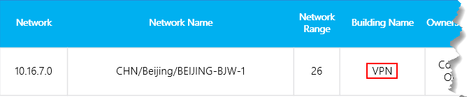

# <a name="quality-of-experience-review-guide"></a>Руководство по анализу качества взаимодействия

<!-- Note that this link to the Word doc is intentionally NOT the aka.ms/qerquide link -->
В этом руководстве — об этапе диска значение для групп Майкрософт и Скайп для бизнеса в Интернет. Вы можете [загрузить версию Word](https://github.com/MicrosoftDocs/OfficeDocs-SkypeForBusiness/blob/live/Teams/downloads/quality-of-experience-review-guide.docx?raw=true) этого руководства.

## <a name="introduction"></a>Введение

Чтобы наибольшее влияние на улучшение взаимодействия с пользователем, организациям необходимо вводят в действие ключевые области, показанные на следующем рисунке. Дополнительные области включают определение рабочих задачах, создав целевых показателей качества, проверка показатели для оценки организационной успеха и сужение области исследования, при необходимости.


![Области ключ для качества взаимодействия с пользователем: аудио, надежности, опросов пользователей, устройств и клиентами.] (media/qerguide-image-keyareas.png "Области ключ для качества взаимодействия с пользователем: аудио, надежности, опросов пользователей, устройств и клиентами.")

_На рисунке 1 - ключ операционных областях, описанных в этом руководстве_

Постоянно вызов и устранению области, описанные в этом руководстве, позволит сократить их потенциально может отрицательно сказаться на высокое качество работы пользователей. Большинство встречающихся в развертывании проблем с взаимодействием с пользователем можно разделить на следующие категории:

-   Неполная настройка брандмауэра или прокси-сервера
-   Слабый охват сети Wi-Fi
-   Недостаточная пропускная способность
-   VPN;
-   Несогласованные или устаревшие клиентские версии и драйверы
-   Неоптимизированном или встроенных звуковых устройств
-   Проблемы с подсетями или сетевыми устройствами

Через тщательного планирования и проектирования перед развертыванием группы или Скайп для бизнеса в Интернет позволит сократить объем усилий, должны поддерживать высококачественной среды взаимодействия с пользователем.

В этом руководстве основное внимание уделяется использование Online вызова панели мониторинга качества (CQD) в качестве основного средства для регистрации и исследовать каждой области, в первую очередь на аудио для обеспечения максимальной воздействия и внедрения. Любой улучшениях в сети для улучшения качества звука также непосредственно преобразует для улучшения в общий доступ к рабочему столу и видео.

Для ускорения оценку, предоставляются [два curated шаблоны CQD](https://aka.ms/qertemplates) : один — для управления всех сетей и другое фильтруется для управляемых (внутренний) сеть только. Хотя отчеты шаблон всех сетей настроены для отображения построения и сведения о сети, они по-прежнему используется во время работы направить сбор и отправка информации построения. Отправка построение информацию в CQD позволяет службе для улучшения отчетов путем добавления настраиваемого построения, сети и сведения о расположении при делая различий внутренних из внешней подсети. Для получения дополнительных сведений см [сопоставления построения](#building-mapping) позже в этом руководстве.

### <a name="intended-audience"></a>Предполагаемая аудитория

Это руководство предназначено для использования с заинтересованными лицами партнеров и клиентов с ролями, такие как ведущий сотрудник/архитектор совместной работы, консультант, специалист по управлению/внедрения изменений, привести/справки службы поддержки, привести сети, привести рабочего стола и администрирование ИТ.

В этом руководстве также предназначен для использования с champion(s) назначенного качества. Для получения дополнительных сведений см [известный качества](4-envision-plan-my-service-management.md#the-quality-champion-role).

## <a name="prerequisites"></a>Необходимые компоненты

Перед использованием в этом руководстве, убедитесь, что у вас есть соответствующие клиента [роли](https://docs.microsoft.com/office365/admin/add-users/about-admin-roles) , назначенные, чтобы получить доступ к CQD.

-   **Роль глобального администратора Office 365** 

-   **Скайп для роли администратора предприятия** 

-   **Роль администратора службы групп** 

-   **Сотрудник службы поддержки Communications роль групп** 

-   **Роль специалисту службы поддержки Communications групп** 

Кроме того можно назначить следующие роли учетной записи пользователя в Office 365 для доступа к функций отчетности.

-   **Отчетов чтения:** Можно просмотреть все [отчеты об активности](https://support.office.com/article/activity-reports-0d6dfb17-8582-4172-a9a9-aed798150263) в центр администрирования Office 365, любой отчетов из [содержимого пакета Microsoft 365 внедрения](https://support.office.com/article/Office-365-Adoption-content-pack-77ff780d-ab19-4553-adea-09cb65ad0f1f)и CQD отчеты.

## <a name="what-is-quality"></a>Что такое качества?

При обсуждении качества в группы и Скайп для бизнеса важно для определения терминов для достижения распространенных общее представление о. Качества, как указано ниже, состоит из службы показатели и возможности пользователя.

<!-- Note: need to update graphic-->
Метрики ![службы состоят из низкого уровня потока соотношение, надежности, конечные точки и устройствах и версий клиентов. Взаимодействие с пользователем включает в себя пользователя с точки зрения качества обслуживания.] Метрики (media/qerguide-image-whatisquality.png "службы состоят из низкого уровня потока соотношение, надежности, конечные точки и устройствах и версий клиентов. Взаимодействие с пользователем включает в себя пользователя с точки зрения качества обслуживания.")

_На рисунке 2 - качества?_

### <a name="service-metrics"></a>Метрики службы

Метрики службы состоят из определенные показатели на стороне клиента. Во время каждого звонка клиент собирает сведения о телеметрии о звонке и отправляет данные отчета в конце каждого вызова, которая может осуществляться позднее через CQD или [Вызвать аналитики](https://techcommunity.microsoft.com/t5/Skype-for-Business-Blog/Introducing-Call-Analytics/ba-p/57309). Включают следующие показатели:

-   Частота низкого уровня потока
-   Уровень сбоев программы установки
-   Уровень сбоев размещения сообщений


#### <a name="poor-stream-rate"></a>Частота низкого уровня потока

Скорость потока низкого уровня (PSR) представляет общий процент потоки с плохим качеством в организации. Этот показатель предназначен для выделения области, где уделить основное меры по сказывается надежную направить уменьшение это значение и улучшение взаимодействия с пользователем, поэтому для вашей организации [управляемых сетях](#managed-vs-unmanaged-networks) являются основным фокус при просмотре PSR. Внешние пользователи важное значение имеют слишком, но расследования отличается на основе организационной. Возможность предоставления советы и рекомендации для внешних пользователей и изучить внешние вызовы независимо от общей организации.

Фактический размер в CQD зависит от рабочей нагрузки, но в целях анализа качества взаимодействия внимание в первую очередь на _звук низкого уровня_ процентах. PSR состоит из пяти сети метрики средние значения описаны в следующей таблице. Для поток, в который следует рассматривать как низкого уровня только один показатель должно превышать порогового значения. Дополнительные сведения о процессе классификации потока можно [в этой статье](stream-classification-in-call-quality-dashboard.md).

> [!Note]
> CQD предоставляет «плохого вызванные...» значения, чтобы лучше понять, какие условия, возникающие поток, который следует рассматривать как низкого качества.


_В таблице 1 - показатели плохого качества звука_

| Среднее значение метрики     | Описание     | Взаимодействие с пользователем |
|-------------|-----------------|-----------------|
| Дрожание \>30 мс        | Это изменение среднее в задержки между последовательными пакетов. Группы и Скайп для бизнеса адаптируются к некоторые уровни дрожание через буферизация. Это, только если дрожание превышает буферизация обнаруживает, что участник эффекты дрожания.      | Пакеты, поступающие на разные скорости вызвать голосовую динамик для воспроизведения автоматической.   |
| Коэффициент потерь пакетов \>10% или 0,1        | Часто это определяется в процентном соотношении от пакетов, которые не сохраняются. Потеря пакетов непосредственно влияет на качество звука — с небольшим, отдельных потери пакетов, практически не влияют на потери пакетов с двумя межсетевыми экранами аудио причина для вырезания полностью.     | Пакетов, отброшенных и не прибывающих на их место назначения вызвать перерывов в работе в мультимедиа, полученные в пропущенные слоги и слова и Прерывистое видео и общего доступа. |
| Время приема-передачи \>500 мс        | Это время, необходимое для получения IP-пакет с точка A для точка B и вернуться к точке A. В этом задержки сетевого распространения связана с физического расстояния между двумя точками и скорость света и включает в себя дополнительную нагрузку, занимаемых различных устройств в поле сетевой путь.      | Пакеты, требуется слишком много времени к месту назначения вызвать эффект walkie-talkie.   |
| Среднее значение NMOS снижение \>1.0         | Средний [Показатель имели в виду мнение сети (NMOS)](https://docs.microsoft.com/previous-versions/office/communications-server/bb894481(v=office.12)#network-mos) снижение экспертной оценки качества для потока. Представляет, насколько потери сети и дрожание влияет на качество полученных, в которой обнаружен Замедление для сброса с более чем одной точки. | Это сочетание дрожание, потеря пакетов и — меньшей степени — увеличивается время приема-передачи. Пользователь может освоение комбинацию этих проблем.   |
| Среднее отношение числа скрытых образцов \>7% или 0.07 | Среднее отношение числа звука кадров с скрытых образцов, созданных функцией восстановления, общее количество кадров, звуковых потери пакетов. Скрытых звука пример — это прием, используемый для сгладить плавность перехода, который может быть вызвана обычно добавленном сетевых пакетов.      | Высокая, то это означает, что значительные уровни потери сокрытия были применены и вызвал искаженные или потере звука.     |

#### <a name="setup-failure-rate"></a>Уровень сбоев программы установки

Уровень сбоев программы установки, в противном случае называется измерения _Общий процент сбоев установки звонков_ в CQD, — это число потоков, где не удается установить пути передачи данных между конечными точками в начале вызова.

Представляет любой поток данных, который не удается установить. Учитывая степени влияния на работу пользователя, заданную здесь, цель — чтобы уменьшить это значение, чтобы как можно ближе к нулю. Высокое значение для этой метрики наиболее распространенных новые развертывания с помощью правил неполный брандмауэра, чем устаревшие развертывания, но по-прежнему важно посмотрите на регулярной основе.

Этот показатель рассчитывается, используя общее число потоков, которые не удалось настроить разделить общее число потоков, которые отправлены записи сведений о успешного вызова (CDR):

-   **Настройка уровень сбоев** = общего числа Настройка число неудачных потока / CDR всего доступны в потоковом режиме Count

#### <a name="drop-failure-rate"></a>Уровень сбоев размещения сообщений

Уровень сбоев размещения сообщений, в противном случае называется измерения _Общее вызова удаленной Процент отказов_ в CQD, определяется как доля успешно установленных потоков, где пути передачи данных не завершается.

Представляет любой потока мультимедиа, который был неожиданно завершен. Несмотря на то, что результаты не находится в очень неблагоприятных как поток, который не удается установить, его отрицательно повлияет на работу пользователей. Удаляет непредвиденные и часто используемые мультимедиа не только может иметь серьезное влияние на взаимодействие с пользователем, они приводят к необходимости для пользователей восстановить подключение, что приводит к потере производительности.

Метрики рассчитывается, используя общее количество удаленных потоки, разделенные на общее число потоков, которые настроены успешно:

-   **Поместите уровень сбоев** = общего числа добавленной Count потока аудио- и общего числа Установка успешно завершена Count потока

### <a name="define-your-target-metrics"></a>Определение целевой показатели

В этом разделе рассматриваются некоторые из основных показателей службы, которая используется для оценки как служб взаимодействия работоспособности. Постоянно оценку и управляет усилия, чтобы сохранить эти показатели под своим заданных целевых значений, можно упростить убедитесь, что пользователи качество последовательные и надежные звонок. Для начала, предоставляются следующие цели.

_В таблице 2 - показатели оценки работоспособности конечного ядра_
<table>
<tr>
<th rowspan="2" colspan="2" valign="center">Тип сети</th><th rowspan="1">Целевых показателей качества</th><th colspan="2">Целевых показателей надежности</th></tr>
<tr><th>Скорость аудиопотока низкого уровня</th><th>Уровень сбоев программы установки</th><th>Уровень сбоев размещения сообщений</th></tr>
<tr><td rowspan="2"><strong>All</strong></td><td>Internal</td><td>% 2.0 (en)</td><td>0,5%</td><td>% 2.0 (en)</td></tr>
<tr><td>Общий уровень</td><td>3.0%</td><td>1,0%</td><td>3.0%</td></tr>
<tr><td rowspan="5"><strong>Конференции</strong></td><td>Internal</td><td>% 2.0 (en)</td><td>0,5%</td><td>% 2.0 (en)</td></tr>
<tr><td>Проводное внутренний</td><td>1,0%</td><td>0,5%</td><td>1,0%</td></tr>
<tr><td>Внутренний ГГц 5 Wi-Fi</td><td>1,0%</td><td>0,5%</td><td>1,0%</td></tr>
<tr><td>Внутренний Wi-Fi 2,4 ГГц</td><td>% 2.0 (en)</td><td>0,5%</td><td>% 2.0 (en)</td></tr>
<tr><td>Общий уровень</td><td>% 2.0 (en)</td><td>0,5%</td><td>3.0%</td></tr>
<tr><td rowspan="4"><strong>P2P</strong></td><td>Internal</td><td>% 2.0 (en)</td><td>0,5%</td><td>% 2.0 (en)</td></tr>
<tr><td>Внутренний ГГц 5 проводное/Wi-Fi</td><td>1,0%</td><td>0,5%</td><td>1,0%</td></tr>
<tr><td>Общий ГГц 5 проводное/Wi-Fi</td><td>% 2.0 (en)</td><td>1,0%</td><td>1,0%</td></tr>
<tr><td>Общий уровень</td><td>% 2.0 (en)</td><td>1,0%</td><td>3.0%</td></tr>
</table>


Важно рассмотреть и определение целевых показателей вашей организации в соответствии с бизнес-целей.

### <a name="user-experience"></a>Взаимодействие с пользователем

Анализ удобство работы пользователей является более чем науки, здесь собранная показатели не всегда означает, что проблемы в сети или службы, но вместо этого они просто указать, что пользователь понимает проблем. Корпорация Майкрософт предлагает механизма встроенных опроса, известных как скорость личных вызова (RMC) — для оценки Общее взаимодействие с пользователем. RMC помогут ответить на следующие вопросы с точки зрения пользователей.

-   Узнать, как использовать решение?
-   Решение удобных и интуитивно и поддержки повседневной связи необходимы?
-   Решение помогает ли мне Мои задачи?
-   Что такое моя общая с точки зрения решения?
-   Можно ли использовать решение в любой момент времени, независимо от того, где я?
-   Можно ли установить и настроить звонка?

#### <a name="rate-my-call"></a>Оцените Мои звонка 

Частота личных вызова (RMC) встроен в группы и Скайп для бизнеса и автоматически настраивается для отображения участнику после его в каждые 10 вызовов или 10 процентов. Этот краткий опрос запрашивает у пользователя получил вызов и предоставить маленьким контекста для почему качества звонок был низкого уровня. Один или два оценки считается низкого уровня, рассчитан три или четыре и пять отлично. Что-то вроде запаздывания индикатор, но это полезно метрики за Нахождение проблем, которые могут быть пропущены, показатели службы.

> [!Note]
> Пока пользователи были полностью осведомлены реагировать на RMC опросы, предоставляя ее хороший свои отзывы и предложения в дополнение к неправильное, ответов на отчеты обычно возвращаться чрезвычайно отрицательным. Большинство пользователей только ответ при плохого качества звонка. Таким образом RMC отчетов может быть бывает низкого уровня со стороны, даже в том случае, когда служба метрики подходят для создания.

CQD можно использовать для создания отчетов о RMC пользователя ответы и образцов отчетов включены в шаблоне CQD. Тем не менее они не рассмотрены в этом руководстве. Дополнительные сведения о RMC в Скайп для бизнеса в Интернет и рекомендации для обучения пользователей, получающих полезные RMC ответов в разделе [этой записи блога](https://blogs.technet.microsoft.com/jenstr/2015/05/05/rate-my-call-in-skype-for-business-2015/).

#### <a name="client-and-device-readiness"></a>Подготовка клиентов и устройств

Необходимо сплошной стратегии клиентов и устройств для справки убедитесь, что пользователи имеют согласованную и положительное пользовательского интерфейса. Несколько основных принципах диск каждой стратегии готовности.

##### <a name="client-readiness"></a>Подготовка клиентов

Стратегии проверки готовности к строгое клиентов гарантирует, что пользователи работают наиболее поздней версии клиента во время просмотра максимального качества. Корпорация Майкрософт регулярно исправления Скайп для бизнеса клиента; Проверка того, что вы обновлять его в вашей среде важна для общего успеха. Также важно помнить сети исправлений, видео, USB и драйверы звуковых устройств, так как они в случае важная и могут влиять на взаимодействие с пользователем. Рассмотрите возможность добавления сети Wi-Fi, видео, USB и драйверы звуковых устройств для вашей текущей управления обновлениями.

Мы рекомендуем не позволит вашей версии клиента Запаздывание с более шести месяцев. Если вы используете Office Click-to-Run, вы будете уже сохранена в актуальном состоянии службой. Используйте включены [версий клиентов](#client-versions), как описано далее в этом руководстве для этой процедуры. Также можно использовать образцы отчетов скорость личных звонков для дальнейшего улучшения стратегии проверки готовности к клиента.

> [!IMPORTANT]
> В настоящее время, распределенных и автоматически обновляются посредством сети доставки содержимого Azure групп клиентов и будет храниться в актуальном состоянии службы. Из-за этого Подготовка клиентов и изучение действия не применимы к группам.


##### <a name="device-readiness"></a>Подготовка устройства

Нет одной одного стратегии могут влиять на удобство работы пользователей с более чем стратегии проверки готовности к устройства. Большинство организаций рады удаление ненужных устройства (например, стационарные телефоны или другие выделенного звукового устройства) от пользователей и часто это основных деловое обоснование для переключения и группы или Скайп для бизнеса. Тем не менее те же организаций колебаний в некоторых случаях для обеспечения замены устройств, даже если эти устройства не менее дорогих. Ноутбуки современного и ПК, однако оборудованных встроенные микрофон и динамик, не оптимизирован для бизнес класса голосовой связи по протоколу IP (VoIP). Это часто создает низкого уровня качества для всех участников, особенно если динамик в помехами. Программа сертификации устройства корпорации Майкрософт гарантирует, когда пользователь входит в телефонный звонок с помощью любого устройства, сертифицированном для группы или Скайп для бизнеса, будут получены обеспечения взаимодействия, лучше, чем-сертифицированный устройства. 

Всегда рекомендуется рабочих групп и Скайп для бизнес-пользователи использовать сертифицированного гарнитуры или динамика при участии в голосовой звонок через клиента рабочего стола. Дополнительные сведения о Microsoft certified устройств просмотрите следующие статьи, посвященные [Программа сертификации](/SkypeForBusiness/certification/overview) и просматривать [каталог решений партнеров](https://partnersolutions.skypeforbusiness.com/solutionscatalog/personal-peripherals-pcs). Используйте [отчет устройствах](#devices), описанных далее в этом руководстве по управлению устройство.


### <a name="categories-of-quality"></a>Категории качества

Успех операционализации высокое качество и надежности развертывания зависит от вашего построения обладать достаточной надежностью работы. В частности Обратите внимание на три категории, показано на следующем рисунке; Далее представлены фокус в этом руководстве:

-   **Сети:** Качество звука, ориентированный на метрику низкого уровня потока соотношение (PSR), об использовании TCP, проводные и беспроводные подсети, а также определение использование HTTP прокси-серверов и VPN.

-   **Конечными точками:** Звуковых устройств и версий клиентов (Скайп для бизнеса только).

-   **Управление службой:** Эта категория включает в себя два раздела:

    -   Сначала возлагается корпорации Майкрософт по управлению и обслуживанию групп и Скайп для бизнеса Интернет-служб.

    -   Во-вторых, задачи, необходимо управлять вашей организации для обеспечения надежный доступ к службе, такие как обновление информации построения и обслуживание брандмауэров для новых адресов IP-адресов для Office 365, как инфраструктура будет добавлена в службу.

![Категории качества в организации: службы управления, конечные точки и сетевой.] (media/qerguide-image-categories.png "Категории качества в организации: службы управления, конечные точки и сетевой.")

_На рисунке 3 - критические категорий для групп и Скайп для бизнеса в Интернет развертывания_

Следующий график описывает задачи, которые необходимо выполнить для каждой категории. Рекомендуется выполнить эти задачи один раз в неделю, по крайней мере.

В первый раз выполнить эти задачи потребуется больше усилий, чем последующие итерации, так как многие из этих категорий требуют проверки конфигурации развертывания. После полученные результаты состояние, в котором требуется целевых значений, который был определен на собрания, для выполнения этих задач позволяет обеспечить это состояние.

<!--  This is a net new graphic, never was included in the online article. OOPS! -->
![Список задач, еженедельно по категориям качества] (media/qerguide-image-tasks.png "Список задач, еженедельно по категориям качества")

#### <a name="service-management-tasks"></a>Задачи управления службы

В облаке первоначального мира необходимо выполнить ряд задач по управлению службы для поддержки высокого качества взаимодействия с пользователем. Эти задачи в диапазоне от обеспечения недостаточно пропускной способности для доступа к службе без загружая Интернет-ссылок, проверка, качество обслуживания (QoS) будет готова для всех областей управляемой сети и — и, наконец, четкая [Office 365 IP-диапазонов на брандмауэры](https://aka.ms/o365ips).

#### <a name="network-tasks"></a>Задачи сети

Существует два типа задачи сети: надежности и качества. Надежность основное внимание уделяется измерение пользователя возможность успешно выполнять вызовы и оставайтесь на связи. Качество основное внимание уделяется сводный телеметрии, отправленные для групп и Скайп для бизнеса в Интернет с клиент пользователя во время вызова и после его завершения. 

Учитывая критические влияние надежности на взаимодействие с пользователем, не важно, чтобы приступить к оценке и исследование эти показатели перед освоение качества. 

#### <a name="endpoints-tasks"></a>Задачи конечных точек

Основные задачи в этой категории — это проверка, какие версии клиента установлены Скайп для бизнеса на построения рабочего стола из последние шесть месяцев, чтобы убедиться, что пользователи получают преимущество постоянные оптимизация, внесенные Скайп для настольных компьютеров клиента Business. Кроме того это упрощает общие задачи управления клиента и предоставляет единого пользовательского интерфейса.

Другие важные области мониторинга устройств, которые являются распространенными в развертывании и управляет сертифицированного оборудования для обеспечения работы пользователей.


> [!IMPORTANT]
> В настоящее время, распределенных и автоматически обновляются посредством сети доставки содержимого Azure групп клиентов и будет храниться в актуальном состоянии службы. Подготовка клиентов и изучение действия не применимы к группам.

## <a name="cqd-basics"></a>Основные сведения о CQD

В этом разделе описываются основные принципы работы с CQD. Руководство по он получает следующие разделы:

-   Что такое CQD?
-   С помощью CQD ожидания
-   Поиск идентификатора клиента
-   Создание отчетов о группами Майкрософт и Скайп для бизнеса
-   Первый и второй классификации строк
-   Измерения, показатели и фильтры
-   Потоки и вызовы
-   Хороший, плохой и Неклассифицированные звонков
-   Распространенные подсетей

Более подробное обучение и ресурсы содержатся в [приложении](#other-resources).

### <a name="what-is-cqd"></a>Что такое CQD?

Вызов качества панели мониторинга (CQD) позволяет получить представление о качестве вызовов, сделанных с помощью групп и Скайп для бизнес-служб. CQD призвана помочь Скайп для бизнеса и группы "Администраторы" и сетевых инженеров оптимизации сети и непрерывно следить на качества, надежности и взаимодействие с пользователем. CQD выглядит по сбору статистических данных телеметрии для всей организации где Общие шаблоны может возникнуть, позволяя персонала обоснованных оценить и планирование мероприятий исправлению для обеспечения максимальной влияния. CQD предоставляет отчеты метрик, которые дают понимание общего качества, надежности и взаимодействие с пользователем.

> [!Note]
> CQD не содержит какие-либо персональные сведения (PII). PII — это сведения, которые можно использовать на свой собственный или другие сведения для идентификации, контактов или найдите одного человека или для идентификации пользователя в контексте.

Это руководство поможет лучше понять основные понятия CQD для улучшения воздействия, внесенные в улучшение взаимодействия пользователей с группами или Скайп для бизнеса в Интернет. Дополнительные ресурсы CQD можно найти в [приложении](#other-resources).

### <a name="expectations-using-cqd"></a>С помощью CQD ожидания

CQD, хотя можно использовать при анализе тенденции и подсети, не всегда дает определенным причина для данного сценария. Важно понимать это и задать правильные ожидания при использовании CQD:

-   CQD не предоставляется причину, для каждого сценария.
-   CQD не будет содержать телефонной системой или аудиоконференции потоков.
-   CQD выполняется звонок областей для дальнейшего изучения на основании тенденций.
-   CQD не содержит любые личные сведения.

### <a name="report-editions"></a>Выпуски отчета

Существует два отчета выпуски в CQD Online: Обзор и Detailed. Используйте раскрывающееся меню, расположенный в строке синий в верхней части экрана, чтобы открыть отчет о edition. Название выпуска выбранный отчет отображается в верхней части экрана.

-   Сводные отчеты о являются статическими и не может быть изменен, загруженного или экспортированного. 
-   Подробные отчеты о полностью настраиваемым и может быть загружена в CSV-файл, экспортировать или клонировании.

[Полное описание разности двух выпусков см.](turning-on-and-using-call-quality-dashboard.md)


_На рисунке 4 - CQD категории отчетов_

Сводные отчеты о делятся на четыре категории:

-   Фокус **Сводка отчетов** по анализу тенденций качества с ежедневно, ежемесячно и отчеты о таблице для облегчения идентификации подсетей с плохим качеством. Это главная страница по умолчанию при первом входе в CQD Online.
-   Фокус **Location-Enhanced отчетов** по анализу тенденций качества на основании сведений о расположении. Для использования этих отчетов необходимо отправить файл построения.
-   Фокус **Надежности отчетов** по анализу временные характеристики надежности (VBSS) совместное использование аудио, видео, видео based рабочего стола и совместный доступ к приложениям.
-   **Отчеты качества взаимодействия** являются версии «облегченных» подробные QER шаблонов, посвященных ключевые области для анализа качество звука и надежности.

### <a name="report-types"></a>Типы отчетов

Можно выбрать один из двух типах отчетов в CQD, в зависимости от того, как вы хотите просмотреть данные. Хотя в этом руководстве не представлены особенности создание одного типа отчета по сравнению с другим, QER CQD шаблоны обеспечивают сочетание настраиваемых отчетов диаграмма и таблица для использования:

-   Диаграмма отчеты создание графического линейчатых диаграмм, для представления данных в виде visual. Диаграмма отчеты лучше всего использовать для визуализации данных за определенный период времени.
-   Отчеты в таблице полезны для просмотра отдельных измерения и измерения при экспорте отчетов в CSV-файлов для обработки в Microsoft Excel.

### <a name="tenant-id"></a>ИД клиента

Некоторые отчеты CQD требуется включить фильтр для удостоверения клиента. Из-за того, CQD сводит воедино данные федеративных участников телеметрии включен. Несмотря на то, что это может оказаться ценных при анализе тенденций, отчеты клиентов и устройств требуется фильтрации данных для определенного клиента следует исключить федеративных участников телеметрии. Если вы не знаете код клиента, можно использовать один из следующих методов для его найти.

> [!Note]
> Эти методы требуются следующие разрешения:<ul><li>Роль глобального администратора</li><li>Скайп для роли администратора предприятия</li></ul>

#### <a name="azure-portal"></a>Портал Azure

1.  Вход в портал Microsoft Azure.<https://portal.azure.com>

2.  Выберите **Azure Active Directory**.

3.  В разделе **Управление**выберите пункт **Свойства**. ИД клиента отображается в поле **Код каталога** .

#### <a name="azure-powershell"></a>Azure PowerShell

1. [Установка модуля Microsoft Azure PowerShell службы управления](https://docs.microsoft.com/powershell/azure/servicemanagement/install-azure-ps?view=azuresmps-4.0.0).

2. Откройте в командной строке Windows Azure PowerShell и выполните следующий скрипт, введя учетные данные Office 365 при появлении запроса: 

   ```
   Login-AzureRmAccount
   ```

3. Идентификатор клиента отображается в выходных данных.

#### <a name="skype-for-business-online-admin-center"></a>Скайп по центру администрирования Online бизнеса

1.  Последовательно выберите пункты <https://portal.office.com>.

2.  Вход с помощью вашей организации учетной записи администратора.

3.  Выберите **Скайп для бизнеса** в разделе **Центры администрирования**.

4.  Идентификатор клиента отображается как **Идентификатор организации** на странице приветствия.

#### <a name="skype-for-business-online-using-powershell"></a>Скайп для бизнеса в Интернет с помощью PowerShell

1. [Настройка компьютера для Windows PowerShell](/SkypeForBusiness/set-up-your-computer-for-windows-powershell/set-up-your-computer-for-windows-powershell).

2. Выполните следующую команду.

   ```
   (Get-cstenant).tenantid
   ```

3. ИД клиента отображается как код GUID.

### <a name="teams-vs-skype-for-business"></a>Команды и Скайп для бизнеса

CQD можно отчетов по группам и Скайп для бизнеса телеметрии. Тем не менее может возникнуть при необходимости разработать отчет рассмотрение телеметрии групп отдельно от Скайп для бизнеса.

#### <a name="summary-reports"></a>Сводные отчеты о

Чтобы изменить сводные отчеты о страницы, чтобы просмотреть только группы или Скайп для бизнеса, выберите раскрывающееся меню **Фильтра продукта** в верхней части экрана и выберите продукт, который будет.


_На рисунке 5 - выберите фильтр продукта_

#### <a name="detailed-reports"></a>Подробные отчеты

Для фильтрации всех подробных отчетов в строке браузера добавьте следующее в конец URL-адрес:

```
/filter/[AllStreams].[Is Teams]|[FALSE]
```

**Пример:**

```https://cqd.lync.com/cqd/#/1234567/2018-5/filter/[AllStreams].[Is Teams]|[FALSE]```

Дополнительные сведения о фильтрах URL-адрес разделе [Фильтрация отчетов](#filtering-reports) этого раздела.

Чтобы отфильтровать отдельных подробный отчет, добавить фильтр ``Is Teams`` к отчету и назначьте его значение True или False. Для получения дополнительных сведений см [отчеты при редактировании](#editing-reports) этого раздела.


_На рисунке 6 - Добавление фильтра группами Майкрософт в отчет_


### <a name="managed-vs-unmanaged-networks"></a>Управляемые и неуправляемые сетей

По умолчанию все конечные точки в CQD классифицируются как внешние. Как только введена построение файла, мы можем приступить к просматривать данные управляемых конечной точки. Как было сказано ранее, сетей в CQD определены как:

-   _Управляемой сети_, часто делается ссылка как внутренние или внутри, может быть влияют и под управлением организации. Это включает в себя внутренней локальной сети, удаленного глобальной сети и VPN.
-   _Неуправляемые сети_, часто делается ссылка как внешние или за пределами, не может быть влияют или под управлением организации. Пример неуправляемые сети — это сети гостиницах или аэропорта.

### <a name="dimensions-measures-and-filters"></a>Измерения, показатели и фильтры

Корректный запрос CQD содержит все три следующие параметры:

-   **Измерений:** Как я хочу сводить данные.

-   **Мер:** Что требуется создание отчетов по.

-   **Фильтра:** Чтобы уменьшить набора данных запрос возвращает.

Другим способом на это является _измерения_ — это функция группировки, _мер_ является данных, которые интересует и _Фильтр_ — Чтобы сузить результаты, которые относятся к запросу.

Пример имеющийся запроса — **Показать низкого уровня потоки [измерения] с подсети [измерение] для построения 6 [фильтра]**. Для получения дополнительных сведений см [измерения и меры, доступные в CQD](https://aka.ms/cqd-dm).

### <a name="first-vs-second"></a>Первый и второй 

Многие из измерения и меры в CQD классифицируются как первого или второго. CQD не использует поля вызывающего и вызываемого — они были переименованной _сначала_ и _второй_ из-за промежуточных этапов между вызывающего и вызываемого абонента. Следующие логики определяет, какие связанные конечной помечается как первый:

-   **Первой** всегда будет конечной точки сервера (сервера конференц-связи, сервер-посредник и т.д.) Если сервер участвует в поток или звонок.

-   **Второй** всегда будет конечная точка клиента Если поток находится в пределах две конечные точки сервера.

-   Если обе конечные точки того же типа, первый вариант из которых основано на внутренний порядок использования категории агента пользователя. Такой подход обеспечивает согласованность.

Дополнительные сведения об определении конечной точки первого или второго, когда они оба же можно [измерения и меры, доступные в CQD](https://aka.ms/cqd-dm).

### <a name="stream-vs-call"></a>Поток в сравнении с звонка

Необходимо понимать разницу между звонка, а потока правильно выбрать какой измерений или показателей, вы будете посмотрев в CQD. Несмотря на то, что CQD в основной фокус находится на потоки, измерения на основе вызовов, также доступны.

-   **Потока:** _Поток_ существует только две конечные точки. Существует только один поток для каждого направления и два потока необходимы для обмена данными. Потоки можно использовать для изучения зданий, сети или подсети. В некоторых случаях вызова и потока используются в поле имя измерения (поток вызовов программы установки или потеряно поток вызовов). Они по-прежнему рассматривать как потоков.

-   **Вызова:** _Вызов_ — Сгруппированный список всех потоков из всех участников. Вызов состоит из — как минимум — два потока. Один вызов будет иметь по крайней мере две конечные точки, каждый из которых как минимум один поток.

Дополнительные инструкции по ли измерений и мер ссылается звонка или потока в разделе [измерения и меры, доступные в CQD](https://aka.ms/cqd-dm)

### <a name="good-poor-and-unclassified-calls"></a>Хороший, плохой и Неклассифицированные звонков

Вызов делятся на категории как хороший, низкого уровня либо Неклассифицированные. Давайте немного говорить о каждой из них более подробно.

-   **Хороший или низкого уровня:** Хороший или плохой вызов состоит из вызова, которая содержит полный набор показателей службы, для которого созданным и полученных службой полного отчета о качестве взаимодействия. Определить, является ли потока хороший или низкого уровня — это описано [ранее в этом руководстве](#poor-stream-rate).

-   **Неклассифицированные:** Неклассифицированные потока не содержит полный набор показателей службы. Они могут быть короткий звонки — обычно не превышает 60 секунд, где не удалось вычисленные средние значения, а не был создан отчет о качестве взаимодействия. Наиболее распространенные причины для вызовов быть Неклассифицированные — это, что было практически не использование пакетов. В качестве примера будет участник, который подключается к сеансу на отключить звук и никогда не говорит. Участник принимать, но не передачи мультимедиа. Без передачи мультимедиа не будет каких-либо метрик для CQD использовать для классификации поток исходящих данных конечной точки.

Дополнительные сведения о процессе классификации потока можно [в этой статье](stream-classification-in-call-quality-dashboard.md).

### <a name="common-subnets"></a>Распространенные подсетей

Распространенные подсети, определенных частной подсети, используемых в гостиницах, домашней сети, точки беспроводного доступа и аналогичные областей. Эти подсети трудно рассмотрения из-за их широко используются. Если организация использует один из следующих распространенных подсети, рекомендуется переместить этой сети к другой подсети. Это приведет к тому, составление отчетов в CQD. Если указано, отчеты в шаблоне всех сетей были настроены на исключать эти подсети, чтобы избежать их как источник плохого качества. Распространенные подсетей определяются под; их влияние будут зависеть от организации.

-   10.0.0.0/24
-   192.168.0.0/24
-   192.168.1.0/24
-   192.168.2.0/24
-   172.20.10.0/24
-   192.168.43.0/24

При исследовании корпоративной сети, которая использует общие подсети, вам потребуются для использования измерения второй рефлексивное локальный IP-адресов для подсетей группы. Это измерение содержит общий IP-адрес конечной точки.

## <a name="cqd-online"></a>CQD Интернет-версия

В этом разделе описываются основные принципы доступ к CQD. Руководство по он получает следующие разделы:

-   Доступ к CQD Интернет-версия
-   Приступая к работе с CQD
-   Редактирование отчеты в CQD
-   Фильтрация отчеты в CQD
-   Импорт отчетов в CQD

Более подробное обучение и ресурсы содержатся в [приложении](#other-resources).

### <a name="access-cqd-online"></a>Access CQD Интернет-версия

Можно получить доступ к CQD одним из трех способов:

-   Последовательно выберите пункты <https://cqd.lync.com>.

-   Перейдите в **Центр администрирования группами Майкрософт** и выберите ссылку на CQD, как показано на следующем рисунке.

![На левой панели навигации слева выбран ссылка на панели мониторинга качества звонков.] (media/qerguide-image-mopo.png "На левой панели навигации слева выбран ссылка на панели мониторинга качества звонков.")

_На рисунке 7 – доступ к CQD через Центр администрирования группами Майкрософт_

-   Последовательно выберите пункты прежних версий **Скайп по центру администрирования Business** > **средств**, а затем выберите ссылку на CQD, как показано на следующем рисунке.

![Средства выбора на левой панели навигации слева, а ссылки на CQD установлен в главной области.] (media/qerguide-image-legacyui.png "Средства выбора на левой панели навигации слева, а ссылки на CQD установлен в главной области.")

_На рисунке 8 - доступ к CQD с помощью Скайп по центру администрирования бизнеса_


### <a name="getting-started"></a>Начало работы

При первом просмотре CQD, вы увидите страницу Сводка отчеты. Большинство отчетов, описанных в этом руководстве, настраиваемые подробных отчетов. Чтобы начать работу с помощью подробных отчетов, выберите **Отчеты Сводка** в верхней части страницы и выберите **Подробных отчетов**.


_На рисунке 9 - переход к подробных отчетов_

Страница подробных отчетов в CQD выглядит как на следующем рисунке.


|             |           |
| ------------|-----------|
| ![один] (media/qerguide-image-callout1.png "один") | Области сводки показывает контекст для набора отчета, который отображается справа. |
| ![два] (media/qerguide-image-callout2.png "два") | В области сводки для установки свойств отчета уровне (в том числе высота оси y) и импортировать новые шаблоны, которые можно выбрать **Изменение** . |
| ![три] (media/qerguide-image-callout3.png "три") | Иерархическая поможет пользователям определить их текущее расположение в иерархии набор отчетов. |
| ![четыре] (media/qerguide-image-callout4.png "четыре") | Показаны отчетами, содержащими дочерние отчеты со ссылкой на синий. Выбрав ссылку, можно перейти в отчетах дочерних. |

_На рисунке 10 - страница подробных отчетов_

Укажите линейчатых диаграмм и линии тренда в отчет для отображения подробных значений. Отчет, который имеет фокус будет показывать в меню Действие: **Редактирование**, **клонированной**, **Удаление**, **Загрузите**и **Экспортировать отчет дерева**.

### <a name="editing-reports"></a>Изменение отчетов

Когда отчета в меню Действие выберите команду **Изменить** , будет откройте редактор запросов. Каждого отчета содержится в запросе для CQD. В отчете наглядно представлены данные, возвращенные в результате запроса. Редактор запросов — это пользовательский Интерфейс для редактирования эти запросы, кроме параметров отображения для отчета, как показано на следующем рисунке.


|             |           |
| ------------|-----------|
| ![один] (media/qerguide-image-callout1.png "один") | В левой области выберите измерения, показатели и фильтры. Сопоставление существующее значение отображает кнопку Закрыть (**X**) можно выбрать для удаления значения.<ul><li>Выбрав измерений и мер, можно изменить заголовок посредством изменения поля **Название** . Кроме того, можно изменить порядок, выбрав синий вверх или стрелку вниз в верхней области.</li><li>Выбор (**+**) рядом с заголовком открывает диалоговое окно добавления нового измерения, измерения или фильтра.</li><li>Введите первые несколько букв измерения, измерения или фильтр в **Найти** поля для фильтрации списка для упрощения поиска.</li></ul> |
| ![два] (media/qerguide-image-callout2.png "два") | Верхней области показаны параметры для настройки диаграммы. |
| ![три] (media/qerguide-image-callout3.png "три") | Редактор запросов показан образец отчета. |
| ![четыре] (media/qerguide-image-callout4.png "четыре") | Используйте поле **Изменение** в нижней части экрана для создания или редактирования подробное описание отчета. |

_На рисунке 11 - редактор запросов_

### <a name="filtering-reports"></a>Фильтрация отчетов

Шаблоны включают несколько встроенных запросов и фильтры отчета. В следующих разделах наиболее распространенные фильтры, используемые во всех шаблонах.

#### <a name="url-filter"></a>Фильтр URL-адресов

Можно использовать URL-адрес фильтр каждого отчета для конкретной аналитики. Наиболее распространенные фильтры URL-адреса используются для фильтрации отчетов, чтобы исключить федеративных участников телеметрии, или сосредоточиться на группы или Скайп для бизнеса в Интернет. Мы рекомендуем, что при использовании фильтров, вы закладок для справки. 

Исключение федеративных данные из отчетов CQD полезен в том случае, когда устранению управляемых здания или сетей, где федеративных конечных точках может повлиять отчетов.

Для реализации фильтр URL-адрес в адресной строке браузера, добавьте следующее в конец URL-адреса:

```
/filter/[AllStreams].[Second Tenant Id]\|[YOUR TENANT ID HERE]
```

Пример:  

```https://cqd.lync.com/cqd/#/1234567/2018-08/filter/[AllStreams].[Second Tenant Id]|[TENANTID]```

Для фильтрации отчетов для группы или Скайп для бизнеса, добавьте следующее в конец URL-адреса:

```
/filter/[AllStreams].[Is Teams]|[TRUE | FALSE]
```

Пример:

```https://cqd.lync.com/cqd/#/1234567/2018-08/filter/[AllStreams].[Is Teams]|[TRUE]```


> [!NOTE]
> URL-адрес примера используются только визуальное представление. Используйте ссылку по умолчанию CQD <https://cqd.lync.com>.


#### <a name="query-filters"></a>Фильтры запроса

Фильтры запроса реализуются с помощью редактора запросов в CQD. Эти фильтры позволяют сократить число записей, возвращенных по CQD, таким образом минимизировать общий размер и время запроса отчета. Это особенно полезен для фильтрации неуправляемые сетей. Фильтры перечислены в следующей таблице использование регулярных выражений (RegEx).

_В таблице 3 - фильтров запросов_

| Filter.         | Описание          | Пример фильтра запроса CQD      |
|----------------|----------------------|-------------------------------|
| Нет пустых значений   | Некоторые фильтры не имеют возможность фильтрации для пустые значения. Чтобы отфильтровать пустые значения вручную, используйте пустой выражение и установите фильтра равно или не равно, в зависимости от потребностей.      | Имя второго построения \< \> \^ \\s\*\$                       |
| Исключить распространенных подсетей | Без допустимого building файла для разделения управляемых из неуправляемых сетей домашних сетей будут включены в отчеты. Эти Домашняя страница подсети выходят за рамки элемента управления и быстро исключить из отчета. Распространенные подсети, определенных в этом руководстве, 10.0.0.0, 192.168.1.0 и 192.168.0.0. | Второе подсети \< \> 10.0.0.0 \| 192.168.0.0 \| 192.168.1.0 |
| Только просмотр внутри  | Используется для фильтрации отчетов для (внутри) управляемом и неуправляемом (за пределами). Управляемые шаблон CQD уже предварительно настроенный с эти фильтры.       | Во-вторых внутри Corp = внутри        |

#### <a name="report-filters"></a>Фильтры отчета

Фильтры отчета реализуются посредством добавления фильтра для просмотра отчет либо в редакторе запросов или непосредственно в отчете. Следующие фильтры отчета используются в шаблоне.

_В таблице 4 - фильтры отчета_

| Filter.     | Описание                            | Пример фильтра CQD отчета         |
|------------|----------------------------------------|-----------------------------------|
| Month      | Начать с года первого, а затем месяц. | 2017 10                           |
| К буквам и цифрам | Фильтры для любые буквы. | [a-z]                             |
| Числовой    | Фильтры для любого цифр.    | [0-9]                             |
| Процент | Фильтры для процент.              | ([3-9]\\.) \|([3-9])\|([1-9][0-9]) |

## <a name="import-the-cqd-templates"></a>Импорт шаблонов CQD

Данное руководство содержит [два curated CQD шаблонов](https://aka.ms/qertemplates). Эти шаблоны ускорения использования CQD и дают возможность быстро используют возможности CQD чтобы повлиять на группы пользователей или Скайп для бизнеса программой. Тем не менее шаблон всех сетей, оптимизированные для работы с здания файл данных можно использовать во время работы над сбор и отправка данных построения в CQD, как описано в следующем разделе.

**Для импорта шаблонов (. CQDX) в CQD Интернет-версия**

1. Последовательно выберите пункты <https://cqd.lync.com>.

2. Проверка подлинности с помощью учетных данных администратора Office 365.

   > [!NOTE]
   > Необходимо иметь Office 365 глобального администратора, Скайп для администратора предприятия или роль читатели отчета для доступа к CQD. 

3. Выберите меню « **Сводка отчетов** » в верхней части страницы, а затем выберите **Подробных отчетов**.

4. В области сводки выберите **Импорт**. Перейдите к CQDX, сохранения расположения, выберите шаблон CQDX и выберите **Открыть**.

5. После загрузки шаблона всплывающего окна отображается сообщение «отчет о Импорт успешно». Выберите **OK.**

   ![Уведомление о том, что шаблон был успешно импортирована] (media/qerguide-image-importmessage.png "Уведомление о том, что шаблон был успешно импортирована")

6. Повторите шаги 4 и 5 для второго шаблона CQD.

> [!NOTE]
> Шаблоны CQD импортируются на одного пользователя. Если дополнительных пользователей необходимо использовать в отчете, необходимо войти в и импорт шаблонов в их экземпляр CQD. 


## <a name="building-mapping"></a>Создание сопоставления

В группах или Скайп для бизнеса в Интернет развертывания все клиенты являются внешними. Который имеет смысл, что по умолчанию все клиенты, переданные как за пределами в Интернете CQD, вне зависимости от ли клиент был подключен во внутренней сети организации.

При работе с CQD необходимо знать расположение конечную точку и является ли он был подключен к сети, могут управлять или сети не может управлять — предполагается, что можно увеличить только сетей можно управлять. Путем передачи подсети и стандартные сведения на CQD Online, включите CQD для определения ли конечная точка была подключена к внутренней сети организации и управляемым или к сети и неуправляемого внешний.

### <a name="building-data-file-structure"></a>Структура файла данных построения

Формат файла данных, загружаемых должен отвечать следующим требованиям, проходит проверку до отправки.

-   Файл должен находиться файл TSV — это означает, что для каждой строки, столбцы разделены символ табуляции — или CSV-файла, в котором каждый столбец разделенных запятыми.

-   Файл не должен превышать 50 МБ.

-   Содержимое данных файлов, *не должны содержать заголовки таблицы*. Другими словами первая строка файла данных должен быть реальные данные, не заголовки столбцов, такие как «Сеть».

-   Для каждого столбца в тип данных можно только строка, число или Bool. Если тип данных — номер, значение должно быть числовое значение; Если это логическое значение должно быть 0 или 1.

-   Для каждого столбца, если тип данных String, данных может быть пустым (, но по-прежнему должны быть разделены соответствующий разделитель, то есть символ табуляции или запятыми). Это просто присваивает значение пустое строковое значение.

-   Должен быть 14 столбцов для каждой строки. Каждый столбец должен иметь тип данных, описанные в следующей таблице и столбцы должны быть в том порядке, перечисленных в таблице.

_В таблице 5 - построение структура файлов_

| Имя столбца        | Тип данных | Пример                   | Рекомендации    |
|--------------------|-----------|---------------------------|-------------|
| Сеть            | String    | 192.168.1.0               | Обязательно    |
| NetworkName        | String    | США/Сиэтл/СИЭТЛ SEA-1 | Обязательно\*  |
| NetworkRange       | Число    | 26                        | Обязательно    |
| BuildingName       | String    | СИЭТЛ SEA-1             | Обязательно\*  |
| OwnershipType      | String    | Contoso                   | Необязательно     |
| BuildingType       | String    | Завершение ИТ            | Необязательно     |
| BuildingOfficeType | String    | Проектирование               | Необязательно     |
| City               | String    | Сиэтл                   | Рекомендуется |
| ZipCode            | String    | 98001                     | Рекомендуется |
| Страна            | String    | "МНЕ НРАВИТСЯ"                        | Рекомендуется |
| State              | String    | Красноярский край                        | Рекомендуется |
| Region             | String    | MSUS                      | Рекомендуется |
| InsideCorp         | Bool      | 1                         | Обязательно    |
| ExpressRoute       | Bool      | 0                         | Обязательно    |

\*Не обязательно с CQD, шаблоны настраиваются для отображения построения и сетевого имени.

#### <a name="supernetting"></a>Объединенные подсети

Объединенные подсети, обычно называется Бесклассовая междоменная маршрутизация (CIDR), можно использовать вместо определение каждой подсети. *Supernet* состоит из нескольких подсетей, совместно использующих один префикс маршрутизации. Вместо добавления записи для каждой подсети, можно использовать адрес supernetted. Объединенные подсети поддерживается, но не рекомендуется использовать его.

Например Contoso marketing построения состоит из ниже подсети:

-   10.1.0.0/24—First этаж
-   10.1.1.0/24—Second этаж
-   10.1.2.0/24—Third этаж
-   10.1.3.0/24—Fourth этаж

Вместо добавления записи для каждой подсети, можно использовать адреса supernetted — в этом примере 10.1.0.0/22.

-   Сети = 10.1.0.0
-   Диапазон сети = 22

Вот несколько вещей, которые следует учесть перед реализацией объединенные подсети.

-   Объединенные подсети можно использовать только в сопоставлении с 8 бит на 28 маска подсети.

-   Объединенные подсети заранее занимает меньше времени, но его достигается за счет сокращения набора данных. Предположим, что существует подсети с использованием проблемы качества 200.1.2.0. Если реализован объединенные подсети, не будут знать, где расположена подсети в процесс создания или тип сети, это (например, лаборатории). Если определены все подсети для построения и загружаться сведения о расположении этажа, будет видеть, различие.

-   Важно, чтобы правильный адрес supernetted, а не перехват ненужные подсети.

-   Это довольно часто можно найти 192.168.0.0 в данных. Для многих организаций это означает, что пользователь дома. Для других пользователей это схемы IP-адресов для вспомогательных office. Если ваша организация офисов, использующие эту конфигурацию, не добавляйте его в файле построения затруднен для различения домашнего и внутренней сети с помощью общих подсети. В разделе о [распространенных подсети](#common-subnets), ранее в этом руководстве.

> [!IMPORTANT]
> Диапазон сети можно использовать для представления supernet. Все новые построение передача файлов данных будет выполняться проверка любые перекрывающиеся диапазоны. Если ранее отправленное построение файла, необходимо загрузить текущий файл и загрузить его еще раз, чтобы определить любой перекрытия и устранить проблему. Любой перекрытия в ранее загруженные файлы может привести к неправильной сопоставления подсетей зданий в отчетах.

#### <a name="vpn"></a>VPN;

Качества взаимодействия (QoE) данные, клиенты передают в Office 365 — которого является, где CQD данные, полученные из — включает флаг VPN. CQD будут видеть это как измерения VPN первый и второй VPN. Тем не менее этот флаг полагается на VPN поставщиков отчетов для Windows, что зарегистрирована адаптера виртуальной Частной сети — это адаптер удаленного доступа. Не все поставщики VPN правильно зарегистрировать адаптеры удаленного доступа. Таким образом может не иметь возможность использовать встроенные фильтры запроса VPN. Существует два подхода к адаптация VPN подсети в процесс создания файла сведения:

- Определите **Сетевое имя** , используя текст «VPN» в этом поле для подсетей VPN.

  

  _На рисунке 12 - виртуальной частной сети с помощью сетевого имени_

- Определение **Имени построения** с помощью текста «VPN» в этом поле для подсетей VPN.

  

  _На рисунке 13 - виртуальной частной сети с помощью имени построения_

> [!IMPORTANT]
> Некоторые реализации VPN не определять сведений о подсети. В этом случае в вашей отчетность рекомендуется, чтобы при добавлении VPN подсети в файле построения вместо одной записи для подсети, добавьте в качестве отдельной сети 32-разрядная версия отдельные записи для каждого адреса в подсети сети VPN. Каждая строка может иметь стандартные метаданные. Например вместо одной строке для 172.16.18.0/24 у вас есть 253 строк, по одной строке для каждого адреса из 172.16.18.1/32 через 172.16.18.254/32 включительно.


> [!NOTE]
> Известны VPN-подключение к неверно идентифицировать сетевое подключение, как проводное при является базовым подключение к Интернету беспроводной связи. При просмотре качества через VPN-подключение, не могут предполагается точно определить тип подключения.

### <a name="uploading-building-information"></a>Отправка информации построения

Панель мониторинга отчетов Сводка CQD включает в себя на страницу **Загрузки данных клиента** , доступного, выбрав тег ссылку **Отправить данные клиента** в верхнем правом углу (найдите значок шестеренки). На этой странице позволяет администраторам отправить их собственные сведения, такие как сопоставление IP-адреса и сведения о местоположении, сопоставление каждой точки беспроводного доступа и его MAC-адрес и т. д.

1. Последовательно выберите пункты CQD Online, перейдя <https://cqd.lync.com>.

2. Выберите значок шестеренки в правом верхнем углу и выберите **Отправить данные клиента** на странице **Сводка отчеты** .

   

   _На рисунке 14, меню отправка данных клиента_

3. Кроме того Если это первый раз посетив CQD, будет предложено данные телеметрии построения. Вы можете выбрать **Отправить сейчас** , чтобы быстро перейти к странице **Загрузки данных клиента** .

   

   _Рисунок 15 - построение баннер отправляемых данных_

4. На странице **Отправка данных клиента** выберите пункт **Обзор** , чтобы выбрать файл данных.

5. После выбора файла данных, укажите **дату начала** и при необходимости укажите дату окончания.

6. После выбора, **Дата начала**, выберите **Отправить** Отправка файла CQD. <br><br>Прежде чем отправить файл проверки. Если происходит сбой проверки, сообщение об ошибке отображается разрешения на запрос, что вы правильно файл. На следующем рисунке показана ошибка во время количество столбцов в файле данных неверны.

   
 
   _На рисунке 16 - построение Ошибка передачи данных_

7. Если не происходит ошибки во время проверки, отправка файла будет успешно. Может появиться файл загруженные данные в таблицу **Мои передача** , в которой показан полный список всех загружаемых файлов для текущего клиента в нижней части страницы.

> [!NOTE]
> Может потребоваться до четырех часов окончания обработки построение файла. <br><br> Если вы уже был отправлен построение файла и Добавление подсети, может пропущенные или исключены, изменить исходный файл путем добавления новых подсетей, удалите текущий файл и повторно отправить недавно измененный файл. Может быть только один активный построения файла данных в CQD. 


### <a name="updating-a-building-file"></a>Обновление файла построения

Во время сбора построения и сведений о подсети, Администраторы часто отправить файл построения в нескольких итераций со временем, добавление новых подсетей и сведения об их построения как она становится доступной. В этом случае вам потребуется заново загрузите построение файла. Этот процесс является как начальной загрузки как описано в предыдущем разделе, с некоторыми исключениями, как было указано в следующем разделе.

> [!Important]
> Построение только один файл может быть активной за раз. Несколько файлов построения не накопительный пакет.

#### <a name="adding-net-new-subnets"></a>Добавление net новых подсетей

Бывают ситуации, когда вам потребуется добавить net новых подсетей CQD, который изначально не были частью топологии сети. Чтобы добавить net новых подсетей, выполните следующие действия на портале отправка данных CQD клиента.

1.  Изменение исходного файла построения и укажите дату, возникает по крайней мере один день до нового net, приобретенных подсети.
2.  Загрузите исходного файла, если у вас нет уже предоставляются самые последние копии.
3.  Добавьте net новых подсетей на исходный файл построения.
4.  Передача файла измененные построения выполнив тот же самый процесс, как описано выше и задайте дату начала для одного дня после завершения предыдущих построение файла.

#### <a name="updating-the-current-building-file"></a>Обновление текущего файла построения

Если файл построения уже отправлен, но необходимо добавить отсутствующие подсети, выполните следующие действия на портале отправка данных CQD клиента.

1.  Загрузите исходного файла, если у вас нет уже предоставляются самые последние копии.
2.  Удаление текущего файла в CQD.
3.  Добавление новых подсетей на исходный файл.
4.  Отправка файла построения. Убедитесь, что значение Дата начала по крайней мере восемь месяцев предыдущего, чтобы CQD будет обрабатывать статистические данные.

### <a name="missing-subnets"></a>Отсутствующие подсетей

После отправки стандартные сведения о управляемых сетей каждые управляемой сети должен иметь связь построения. Однако это не всегда выполняться. как правило пропущенные несколько подсетей. В этом разделе рассматривается, как проверка этих отсутствующих сетей.

Перейдите на страницу **Подробных отчетов** в документации по CQD и перейдите к **Отсутствует отчет о подсети** , включенные в шаблонах CQD. Это представляет все подсети с 10 или более звуковых потоков, которые не определены в создание данных файлов и которые помечены как за пределами. Убедитесь, что в этом списке нет управляемых сетей. Если подсети не указаны, обновите исходного построения файлов данных и повторно отправить его CQD.

> [!IMPORTANT]
> Необходимо добавить код клиента в качестве фильтра запроса для **Второй ИД клиента** этот отчет для фильтрации отчетов для просмотра только данные клиента вашей организации. В противном случае в отчете будет отражено федеративных подсети.

> [!NOTE] 
> Не забудьте изменить фильтр отчета месяц года для текущего месяца. Выберите команду **Изменить**и настройте фильтр отчета **Месяц года** и сохраните новый месяц по умолчанию.


_На рисунке 17 - отсутствует стандартный отчет_

### <a name="building-mapping-tools"></a>Стандартные средства сопоставления

Давайте которыми сталкиваются, планирования подсети в вашей организации могут возникнуть проблемы. Большие глобальной сети очень сложной с разными группами, управление их соответствующих областей и может быть не единый источник достоверную топологии сети. Существует два средства, доступные для помощи при запуске упражнения построения сопоставления, описанные в следующих разделах.

#### <a name="cqd-tools"></a>Средства CQD

Эти средства на основании PowerShell и могут с пользой применить сайты Active Directory (AD) и служб и служб Microsoft DHCP для заполнения построение файла.  Эти средства поможет выполнить следующие задачи:

1.  Запросов AD — сайты и службы и создайте файл построение на основе сведений, содержащихся в.
2.  Запросов Microsoft DHCP-сервер или серверы сведений о подсети и автоматически создать файл построения.
3.  Проверка существующего файла построения, проверка дубликатов и перекрытия.
4.  Найдите несопоставленных подсети в CQD.

Дополнительные сведения об этом средстве можно в [этой записи блога](https://aka.ms/cqdtools).

#### <a name="network-planner"></a>Планировщик сети

Планировщик работы сети определяет и упорядочивает требований к сети для развертывания облака голосовой связи в всего за несколько простых шагов. С помощью сетевых вашей организации сведения и использовании облачных голосовой связи, можно получить приблизительно, например расчет требований к сети для развертывания облака голосовой связи, управлять и экспортировать эти сведения для создания отчетов и Просмотр областей дальнейшего исследования и последующие действия.

Несмотря на то, что планировщик работы сети не полностью, автоматизировать процесс построения сопоставления, после ввода данных сети с планировщик работы сети его можно экспортировать нажмите Готово для отправки в построение файл.

Мы настоятельно рекомендуем использовать планировщик работы сети при развертывании рабочих нагрузок мультимедиа в сети, чтобы оценить влияние на общую. Дополнительные сведения о сети посетите [MyAdvisor](https://myadvisor.fasttrack.microsoft.com/CloudVoice/NetworkPlanner).


## <a name="diagnostic-alerts"></a>Диагностические оповещений

Microsoft упреждающий мониторинг CQD телеметрии для создания диагностики оповещения об известных проблемах, которые отрицательно повлиять на работу пользователя. Эти оповещения, затем автоматически отправляются администратор службы с помощью центра сообщений. В следующей таблице описываются диагностики оповещения, которые отображаются в центре сообщений, а также ссылки на дополнительные сведения.

_В таблице 6 - диагностики оповещений_

| Предупреждения                                                                | Дополнительные сведения             |
|----------------------------------------------------------------------|------------------------------|
| Известные плохо для выполнения версий клиентов, используются                   | [Клиентские версии](#client-versions)              |
| Драйверы звуковых устройств, вызывает ошибку падения звонка                                 | [Devices](#devices)                      |
| Ограничения в брандмауэре, вызывает ошибку установки сбоями вызовов         | [Сбой установки исследования](#setup-failure-investigations) |
| Проверка глубокой пакетов сбою вызова программы установки                | [Сбой установки исследования](#setup-failure-investigations) |
| Собрания помещения в сети Wi-Fi являются причиной вызовов плохого качества | [Качество исследования](#quality-investigations)       |
| Ограничена UDP-трафик, что приводит вызовов плохого качества         | [TCP](#tcp)                          |
| Об использовании VPN влияет на качество звонка                                  | [Качество исследования](#quality-investigations)       |


### <a name="message-center"></a>Центр сообщений

Центр сообщений с оповещением о новых обновлений, функции и проблем. Центр сообщений доступна в центре администрирования Microsoft 365 для администраторов служб. Публикация в каждом общий обзор того, как обновление, функция или проблема влияет на пользователей и предоставляет ссылки на более подробные сведения.

Чтобы открыть центр сообщений в центре администрирования Microsoft 365, перейдите к **работоспособности** > **Центр сообщений**или выберите карточки центр сообщений в **Домашняя страница** панели мониторинга. Панель мониторинга отображает три последних сообщений, которые были учтены, а также ссылки на страницу центра полное сообщение.
 


_На рисунке 18 - карточки центр сообщений_

Также можно использовать [приложение администрирования Office 365](https://go.microsoft.com/fwlink/p/?linkid=627216) на мобильном устройстве для просмотра в центр сообщений — это отличный способ оставаться на связи с push-уведомлений. [Для получения дополнительных сведений см.](https://support.office.com/article/Message-center-in-Office-365-38FB3333-BFCC-4340-A37B-DEDA509C2093)

## <a name="reliability-investigations"></a>Надежность исследования

— Это первый шаг к улучшению качества для оценки состояния надежности в организации. Поскольку надежности является важной положительное пользовательского интерфейса, начнем с двух компонентов, отвечающие за измерение надежности:

1.  **Setup ошибки:** Не удается установить вызова.

2.  **Удалить ошибки:** Вызов было установлено и неожиданно завершен.

В этом разделе мы рассмотрим методы для изучения обеих областях.

> [!NOTE]
> В этом руководстве рассматриваются не все отчеты, включенные в шаблонах.  Тем не менее методы расследования объясняется ниже по-прежнему применяются. Описание отдельного отчета для получения дополнительных сведений см.


### <a name="setup-failures"></a>Ошибки установки

Во-первых, определять приоритеты для Устранение неполадок в этой области, так как эти ошибки значительные негативно сказывается на взаимодействие с пользователем.

Начните изучение с оценки процент общей программа установки ошибки для организации, а затем определите приоритеты областях расследования на основании максимальный процент по построению или сети. 

#### <a name="setup-failure-trend-analysis"></a>Настройка анализа трендов сбоя

В этом отчете отображается общий объем потоков, ошибок программы установки потока и уровень сбоев потока программы установки. Выберите любой из столбцов для отображения его отдельных значений, как показано на следующем рисунке. 


_На рисунке 19 - надежность звукового канала - потока неполадок_

##### <a name="analysis"></a>Анализ

С помощью этого отчета можно ответить на следующие вопросы и определите дальнейших действий:

-   Каков процент сбоев общего числа программы установки для текущего месяца?

-   — Это процент сбоев установки общего числа вниз или вверх метрику определенная?

-   — В настоящее время сбоя худшему или превышающей предыдущего месяца?

-   В настоящее время сбоя увеличивается, steady, или уменьшается?

Irrespective предыдущие вопросы занять время для изучения дальнейший с использованием вложенных отчетов companion следует искать все отдельные здания или подсети, которым могут понадобиться исправлению. Несмотря на то, что общий уровень сбоев может быть ниже метрики целевого значения, сбоев для одного или нескольких зданий или сетей может быть больше метрики целевого значения и необходимые расследования.

#### <a name="setup-failure-investigations"></a>Сбой установки исследования 

Этот отчет используется для обнаружения и выявить любые зданий или сетей, которые может потребоваться исправление.

> [!NOTE]
> Не забудьте изменить фильтр отчета месяц года для текущего месяца. Выберите команду **Изменить**и настройте фильтр отчета **Месяц года** и сохраните новый месяц по умолчанию.


_На рисунке 20 - звука неполадок с подсети_

##### <a name="diagnostic-alert"></a>Оповещение о диагностики

Если вы получили диагностики оповещение «Ограничения в брандмауэре, вызывает ошибку сбоями вызовов программы установки» или «проверка глубокой пакетов сбою вызова программы установки,» фокусируется на усилия по устранению проблем на сначала помечаются подсети. Оповещение определила подсетей, негативного влияния на надежности звонок. Можно использовать отчеты ошибок программы установки, приведенной в разделе надежности для помощи при устранении.

##### <a name="remediation"></a>Исправление 

Акцентируйте вашего первого усилия по устранению проблем на здания или подсети, которые имеют наибольшее тома сбоев. Это максимальная влияние на взаимодействие с пользователем и позволяют быстро снизить скорость сбоями установки организационной вызовов. В следующей таблице приведены две причины неполадок согласно CQD.

_В таблице 7 – причин для установки сбоями вызовов_

| Вызов причиной ошибок программы установки       | Типичная причина                    |
|----------------------------------|----------------------------------|
| Отсутствует правила исключения из проверки глубокой пакета встроенного по | Указывает, что сетевое оборудование пути запрещен пути к мультимедиа созданию из-за правил проверки глубокой пакетов. Это вызвано правила брандмауэра, не настроен правильно. В этом сценарии подтверждение TCP выполнено успешно, но не SSL-подтверждения.      |
| Отсутствует правило исключений блока встроенного по IP-адресов      | Указывает, что сетевое оборудование пути запрещен пути к мультимедиа установленные для сети Office 365. Это может быть из-за правил брандмауэр или прокси-сервер не настроен неправильно для доступа к IP-адреса и порты, используемые для групп и Скайп для бизнес-трафика. |

Теперь при начале обновления усилий можно сосредоточиться на конкретном здании или подсети. Как показано на предыдущей странице, эти вопросы, из-за конфигураций брандмауэр или прокси-сервера. Обзор параметров в следующей таблице для действий по исправлению.

_В таблице 8 - дальнейшие действия для вызова программы установки исправления сбоя_


|      Исправление      |                                                                                                                                                                                                                                                                                                                                                                   Рекомендации                                                                                                                                                                                                                                                                                                                                                                   |
|-----------------------|----------------------------------------------------------------------------------------------------------------------------------------------------------------------------------------------------------------------------------------------------------------------------------------------------------------------------------------------------------------------------------------------------------------------------------------------------------------------------------------------------------------------------------------------------------------------------------------------------------------------------------------------------------------------------------------------------------------------------------------------|
| Настройка firewall(s) | Работа с ваша группа сети и проверьте конфигурацию firewall(s) со [списком адресов IP-адресов для Office 365](https://aka.ms/o365ips).<br><br>Убедитесь, что порты и [мультимедиа подсети](https://support.office.com/article/Office-365-URLs-and-IP-address-ranges-8548a211-3fe7-47cb-abb1-355ea5aa88a2#bkmk_teams) включены в правила брандмауэра. <br><br>Убедитесь, что необходимые порты (перечисленные ниже), открываются в брандмауэре. UDP-ПОРТ должен быть дан приоритет, так как TCP считается протокол восстановление размещения для аудио-, видео и совместного использования экрана на основе видео и ее использования влияет на качество звонка. Прежних версий RDP общий доступ к приложениям используется только протокол TCP.<br><ul><li>**TCP:** порт 443</li><li>**UDP-ПОРТ:** порты 3478 – 3481</li><ul> |
|        Проверка         |                                                                                                                                                                                                                                                                 Используйте [Средство оценки производительности сети Microsoft](https://www.microsoft.com/download/details.aspx?id=53885) для проверки подключения из затронутых построения или подсети с помощью функции проверки подключения.                                                                                                                                                                                                                                                                  |

### <a name="drop-failures"></a>Поместите сбоев

В отличие от коды ошибок программы установки CDQ не имеет размещения сбой кода для указания причины возникновения ошибки размещения сообщений, что усложняет для изоляции конкретных причину. Чтобы лучше рассмотрения поместите сбои, предполагаемых подход. По устранению любой области интересов для мультимедиа, исправление клиентов и драйверы и движущих использования сертифицированного устройств для групп и Скайп для бизнеса, может предполагать входящей сбои, чтобы отклонить.

#### <a name="drop-failure-trend-analysis"></a>Удаление анализ тенденций ошибок

В этом отчете отображается общий объем аудиопотоки, сбои общее входящей и уровень сбоев размещения сообщений. Выберите любой из столбцов для отображения его значения, как показано на следующем рисунке. 


_На рисунке 21 - скорость потока добавленном_

##### <a name="analysis"></a>Анализ

С помощью этого типа отчета, можно ответить на следующие вопросы:

-   Каков текущий уровень сбоев для размещения сообщений?
-   — Это уровень сбоев размещения ниже метрику определенная?
-   — В настоящее время сбоя худшему или превышающей предыдущего месяца?
-   В настоящее время сбоя увеличивается, steady, или уменьшается?

Irrespective ответы на вопросы о выше, ответить на анализ с помощью подчиненные отчеты для поиска любых зданий или сетей, которые может потребоваться исправление. Несмотря на то, что общий уровень сбоев размещения может быть ниже метрики целевого значения, уровень сбоев размещения сообщений для одного или нескольких зданий или сетей может быть больше метрики целевого значения и необходимые расследования.

#### <a name="drop-failure-investigations"></a>Выполняет исследования сбоя

Здесь, обнаруженных ошибок указывающего вызова удаленной неожиданно привела к отрицательным пользовательского интерфейса. В отличие от тенденции отчетов эти отчеты предоставляют дополнительные полезные сведения о в определенных подсетей, которые требуют дальнейшего изучения.

> [!NOTE]
> Убедитесь, что настройте фильтр месяц года текущего месяца. Выберите команду **Изменить**и измените **Месяц года** для сохранения нового месяца по умолчанию.


_На рисунке 22 – сбои размещения по подсети_

##### <a name="remediation"></a>Исправление

С помощью отчетов включены в таблице, можно изолировать проблемы областей в сети которых скорость размещения больше метрики целевого значения вы определили. Акцентируйте вашего первого усилия по устранению проблем на здания или подсети, имеющие наибольший общий поток count, чтобы сделать наибольшее влияние.

К наиболее распространенным причинам сброса звонка:

-   В разделе Подготовка сети и веб-исходящего трафика
-   Не настроен для ограниченного сетей QoS
-   Старые версии клиента
-   Поведение пользователя

После обнаружения проблемных областей [Analytics вызова](https://techcommunity.microsoft.com/t5/Skype-for-Business-Blog/Introducing-Call-Analytics/ba-p/57309) можно использовать для дальнейшей просмотра пользователи в этой построения для конкретных проблем. Вызов аналитики содержит Персональные данные и может быть полезен для дальнейшей изоляции возможных причин для неудачных операций перетаскивания.

Независимо от того, следующим шагом рекомендуется уведомления в службу поддержки, что был обнаружен проблему с определенным здания или подсети. Таким образом, они могут быстро отвечать на входящие звонки и более эффективно рассмотрения пользователей. Отмеченные пользователи затем могут быть выявлены обратно для команды разработчиков для дальнейшего изучения.

В следующей таблице перечислены некоторые распространенные способы управление и устранение ошибок размещения сообщений.

_В таблице 9 - дальнейшие действия для вызова поместите исправлению_

| Исправление                              | Рекомендации                      |
|------------------------------------------|-------------------------------|
| **Сеть и Интернет**                         | **Перегрузка**: работающих с группой сети для наблюдения за пропускной способности в определенных зданий/подсетей для подтверждения, что существуют проблемы, связанные с определяет. Если вы убедитесь, что перегрузкой сети, рекомендуется увеличение пропускной способности для этого построения или применение качества обслуживания. Используйте включена [Сводка потока плохого качества отчетов](#quality-investigations) для просмотра подсети проблемы для устранения проблем с дрожание, задержки и потери пакетов, так как они часто имеют приоритет добавленном потока.<br><br>Также можно использовать [Средство сетевой планировщик работы](https://myadvisor.fasttrack.microsoft.com/CloudVoice/NetworkPlanner) помогут лучше понять пропускной способности требованиям вашей организации.<br><br>**Качество обслуживания**: Если увеличение пропускной способности является нецелесообразным или возрастании затрат, рассмотрите возможность реализации качества обслуживания. Это средство очень эффективен при управлении перегруженной трафика и может гарантировать, что над трафика не мультимедиа их приоритета управляемых сетевых пакетов мультимедиа. Кроме того Если отсутствуют признаки понятно, пропускной способности причиной, рассмотрите следующие решения:<ul><li>[Руководство по Microsoft группами QoS](qos-in-teams.md)</li><li>[Скайп руководство Business качества обслуживания](https://myadvisor.fasttrack.microsoft.com/CloudVoice/Downloads?SelectedIDs=5_1_0_8)</li></ul><br>**Выполнение оценки готовности сети**: оценки сети приведены подробные сведения об ожидаемых пропускной способности, способ справиться с пропускной способностью и сетевых изменяется, а сетевые рекомендации для групп и Скайп для бизнеса. С помощью приведенной выше таблице источника, у вас есть список зданий или подсети, которые отлично подходят для оценки.<ul><li>[Оценка готовности сети группами Майкрософт](3-envision-evaluate-my-environment.md#test-the-network)</li><li>[Скайп для оценки готовности сети предприятия](https://myadvisor.fasttrack.microsoft.com/CloudVoice/Offers/?pageState=NetworkReadiness)</li></ul><br>**Средство оценки производительности сети Microsoft:** Это средство предназначено для простой проверки производительности сети для определения качества сети будет выполнять для групп или Скайп для бизнеса в Интернет вызова. Средство оценки производительности подсети и проверки готовности сети от производительности Microsoft [требования](https://aka.ms/performancerequirements).<ul><li>[Загрузите средство оценки производительности сети](https://www.microsoft.com/download/details.aspx?id=53885)</li></ul> |
| **Клиенты (Скайп для бизнеса только Online)** | Некоторые старые клиенты известно, описанной проблемы надежности мультимедиа. Просмотр звонков аналитических отчетов из несколько соответствующих пользователей или создайте настраиваемый отчет в таблице версия клиента в CQD, отсортированные по определенным здания или подсетей с добавленной общее вызвать сбой % измерения. Эти сведения помогут понять, существует ли связь между падения вызовов в этой определенного построения и определенной версии клиента.     |
| **Devices**                                  | Мы рекомендуем звонков, что все пользователи, у которых возникают падения — или низкого качества вызывает в общем — и с помощью Интегрированные устройства должны быть подготовлен [сертифицированный мини-гарнитуры или динамика](https://partnersolutions.skypeforbusiness.com/solutionscatalog/personal-peripherals-pcs) чтобы исключить этот возможный источник низкого уровня качества и надежности. |
| **Поведение пользователя**                            | Если вам определить, что ни сетевых устройств клиентов или проблему, рассмотрите возможность яркого [Личных ядра СУБД](https://aka.ms/myadvisor) содержатся инструкции по разработке стратегии внедрения пользователя проинструктировать пользователей, как наилучшим образом соединения и выйти из собрания. Рационально рабочих групп и Скайп для корпоративных пользователей будут создавать удобство работы пользователей для всех участников собрания. Пользователь, который размещает их переносного компьютера в спящий режим (по закрытие крышку) без выхода из собрания будут следует рассматривать как раскрывающийся Неожиданный вызов.   |

## <a name="quality-investigations"></a>Качество исследования

Чтобы оценить состояние качества звука в организации дальше исследовать низкой скорости потока (PSR), TCP и использование прокси-сервера. Важно помнить, что не дает определенным причину CQD данные, но вместо этого предоставляет возможных проблем для начала беседы совместной работы с помощью соответствующих групп для мероприятий по исправлению. 

> [!NOTE]
> Не все отчеты, включенные в шаблонах рассматриваются в данном руководстве; Тем не менее методы расследования объясняется ниже по-прежнему будут применяться для этих отчетов. Обратитесь к описанию отдельного отчета для получения дополнительных сведений. 

### <a name="quality"></a>Качество

Процентных PSR используются для указания, является ли организации собраний определенный цели метрики для фокус указанной области. Важно отметить, что даже если высокого уровня процентных значений в определенном целевой, отдельных подсетей и зданиями не соответствуют заданных целевых показателей и, таким образом, требуют дальнейшего изучения. Например если % 2 в целом аудио процент PSR апреля, соответствующий пример конечного, отдельных зданий и подсети по-прежнему возникли низкого уровня каждый раз, в зависимости от общее распределение что % 2. 

Для оценки процент низкой потоки, используйте отчеты по качеству. Различные отчеты по качеству предоставляются просмотреть показатели для общей, конференции с двумя участниками PSTN вызов, виртуальных Частных и конференц-залы. Ежемесячно, еженедельно и ежедневного отчеты предоставляются для помощи в этом процессе. Отчеты о ежедневных и еженедельных ограничены шаблон управляемых сетях повысить эффективность и снизить помех. 

#### <a name="quality-trend-analysis"></a>Качество анализа трендов

Тенденции отчетов отображения данных качества по времени и помогают определить и понять тенденции качества в каждой области интересов. Как было указано ранее, существует деревьями отчета, включенные в шаблоны для изучения качества; конференц-связи, двусторонних, вызов ТСОП, VPN и конференц-залы. В целях анализа качества изучение процесс одинаков. Тем не менее рекомендуется начать с конференц-связи во-первых, так как все улучшения качества конференции также положительно повлиять на всех остальных областей. 

> [!Note]
> Исследование двусторонних звонков ТСОП и конференц-залы похожи на исследование конференц-связи. Фокус — isloate здания или подсети, которые имеют наихудшее качество и определения причины плохого качества.

> [!Important]
> VPN-отчеты фильтруются с помощью измерения второй VPN. Это измерение требует, сетевой адаптер VPN должным образом был зарегистрирован как адаптер удаленного доступа. Поставщики VPN не использовать этот флаг надежно и вашей числа могут отличаться в зависимости от поставщика VPN, развернут в вашей организации. Следуйте указаниям, структурированного [ранее в этом руководстве](#vpn) по изменению VPN-Подключение отчетов, при необходимости с помощью имени построения или в сети.


_На рисунке 23 – качество звука - конференц-связи_

##### <a name="investigation"></a>Исследование

С помощью этих отчетов, можно ответить на следующие вопросы:

-   Что такое общее PSR для текущего месяца
-   Меньше PSR метрику определенная?
-   — Это PSR худшему или превышающей предыдущего месяца?
-   В настоящее время PSR увеличивается, steady, или уменьшается?

Irrespective ответы на вопросы о выше, ответить на анализ с помощью подчиненные отчеты для поиска любых зданий или подсети, которым могут понадобиться расследования. Несмотря на то, что общий PSR может быть ниже метрики целевого значения, часто PSR для одного или нескольких зданий или сетей является над метрику и исправлению.

#### <a name="quality-investigations"></a>Качество исследования

Качество сводные отчеты о предоставить более подробные понять, что участие в потоки классифицируются как низкого качества и приводятся рекомендации по для изоляции проблем в корпоративной сети.

Несмотря на то, что измерений, используемых может немного отличаться от отчета, каждый отчет будет включать меры для всего потоков, общее низкого уровня потоки, PSR и плохого качества из-за. Отчеты были созданы для каждой области интересов: каналы ТСОП вызов, виртуальных Частных и собрания конференц-связи с двумя участниками. Шаблон управляемой сети включает в себя дополнительные отчеты, чтобы воспользоваться преимуществами отправляется через файл стандартные сведения о местоположении.

> [!NOTE]
> Убедитесь, что настройте фильтр месяц года текущего месяца. Выберите команду **Изменить**и измените **Месяц года** для сохранения нового месяца по умолчанию.

> [!Note]
> Распространенные подсети трудно рассмотрения из-за их широко используются. Отдельный отчет, отображающий клиента общедоступный IP-адрес (второй рефлексивное локальный IP-адрес) добавлена к шаблону всех сетей для облегчения Устранение офисов, использующие общие сетей.


_На рисунке 24 — низкий аудиопотока Сводка по построению - и подсети конференц-связи_

##### <a name="diagnostic-alert"></a>Оповещение о диагностики

Если вы получили диагностики оповещение «собрания помещения в сети Wi-Fi являются причиной вызовов плохого качества» включить и назначение приоритетов этих устройств в вашей усилия по устранению проблем. Оповещение определила комнаты для собраний на Wi-Fi, которые активно, предоставляющие для вызовов плохого качества.

В случае диагностики оповещение «использования VPN влияет на качество звонка» исследовать разделенное туннелирование решения для обхода устройство VPN и разрешить мультимедиа для прямого подключения к службе. Оповещение определила, что VPN негативного влияния на качество звонка.

##### <a name="remediation"></a>Исправление

Акцентируйте вашей усилия по устранению проблем на здания или подсети, которые имеют большой объем потоки, так как это максимальная воздействия и быстро улучшить взаимодействие с пользователем. Используйте дрожание, потеря пакетов и измерения время приема-передачи (круговой путь) понять, что является программное плохого качества (это может быть более одного проблема):

-   **Дрожание**: мультимедиа пакетов поступают на различные скорости, вследствие чего динамик для воспроизведения автоматической.
-   **Потеря пакетов**: мультимедиа потери пакетов, который создает эффект отсутствует словами или слогами.
-   **Круговой путь**: пакеты мультимедиа слишком много времени для получения их назначения, который создает эффект walkie-talkie.

Для помощи для исследования проблемы качества, вы можете использовать возможности [Вызова аналитики](https://techcommunity.microsoft.com/t5/Skype-for-Business-Blog/Introducing-Call-Analytics/ba-p/57309). С помощью вызова анализа вы откроете конкретных конференции или отчет подробные вызовов пользователей. В этом отчете будет содержать ЛИЧНЫХ данных и полезна, если вы ищете причину сбоя. После вы знаете, какие построения зависит, должны быть просты для отслеживания пользователей в этого построения. 

Не забудьте сообщите в службу поддержки знать, что эти сети возникают проблемы качества, чтобы они могли быстро рассмотрения и отвечать на входящие звонки.

_В таблице 10 - распространенных участникам высокой PSR_

| Исправление                              | Рекомендации                         |
|------------------------------------------|----------------------------------|
| **Сетей**                                 | **Перегрузка**: перегрузке или в разделе Подготовка сети может вызвать проблемы с качеством мультимедиа. Работа с командой сети, чтобы определить, указывают ли сетевые подключения от пользователя для исходящего трафика Интернета имеет недостаточно пропускной способности для поддержки мультимедиа. [Планировщик работы сети](https://myadvisor.fasttrack.microsoft.com/CloudVoice/NetworkPlanner) помогут вам лучше понять пропускной способности требованиям вашей организации.<br><br>**Выполнение оценки готовности сети**: оценки сети приведены подробные сведения об ожидаемых пропускной способности, способ справиться с пропускной способностью и сетевых изменяется, а сетевые рекомендации для групп и Скайп для бизнеса. С помощью приведенной выше таблице источника, у вас есть список зданий или подсети, которые отлично подходят для оценки.<ul><li>[Оценка готовности сети группами Майкрософт](3-envision-evaluate-my-environment.md#test-the-network)</li><li>[Скайп для оценки готовности сети предприятия](https://myadvisor.fasttrack.microsoft.com/CloudVoice/Offers/?pageState=NetworkReadiness)</li></ul><br>**Средство оценки производительности сети Microsoft:** Это средство предназначено для простой проверки производительности сети для определения качества сети будет выполнять для групп или Скайп для бизнеса в Интернет вызова. Средство оценки производительности подсети и проверки готовности сети от производительности Microsoft [требования](https://aka.ms/performancerequirements).<ul><li>[Загрузите средство оценки производительности сети](https://www.microsoft.com/download/details.aspx?id=53885)</li></ul><br> |
| **Качество обслуживания (QoS)**  | QoS — это проверенных строки, позволяющие определять приоритеты пакетов в перегруженной сети, чтобы убедиться, что прибытия по назначению без изменений и на время. Рассмотрите возможность реализации QoS внутри организации для повышения качества обслуживания пользователей, где ограниченной пропускной способности. Качество обслуживания поможет решить проблемы, обычно связанные с высоким уровнем потери пакетов и — меньшей степени — дрожания и работа с форматом времени.<ul><li>[Руководство по Microsoft группами QoS](qos-in-teams.md)</li><li>[Скайп руководство Business качества обслуживания](https://myadvisor.fasttrack.microsoft.com/CloudVoice/Downloads?SelectedIDs=5_1_0_8)</li></ul> |
| **Wi-Fi**               | Wi-Fi можно оказывают значительное влияние на качество звонка. Развертывания Wi-Fi не учитывать обычно требования к сети для службы VoIP и часто источника плохого качества. Дополнительные сведения об оптимизации инфраструктуры Wi-Fi можно [в этой статье сведения о планировании Wi-Fi](/skypeforbusiness/certification/plan-wifi).<br><br>**Драйвер беспроводной**: Убедитесь, что драйверы беспроводных устройств в актуальном состоянии. Это позволит устранять любые неполадки пользовательского интерфейса, связанные с устаревший драйвер. Многие организации не включает драйверы беспроводных устройств в их исправление циклов и драйверы можно перейти незащищенной лет. Многие беспроводные проблемы стали решаться убедитесь, что беспроводной драйверы в актуальном состоянии.<br><br>**WMM**: беспроводной мультимедиа расширения (WMM), также известной как Wi-Fi мультимедиа, представлены основные возможности QoS к беспроводной сети. Современный беспроводных сетей должны поддерживать множество устройств. Эти устройства конкурируют за пропускной способности и может привести к проблемам качества для службы VoIP, где скорость и задержка являются важной. Обратитесь к поставщику беспроводной конкретные сведения и рассмотрите возможность реализации WMM в беспроводной сети для создания приоритетов Скайп для бизнеса и рабочих групп мультимедиа.<br><br>**Плотность точка доступа**: точки доступа может быть слишком далеко друг от друга или не в идеальным расположением. Для сведения к минимуму могут возникнуть, поместите точек дополнительных прав доступа в конференц-залах и расположения, в которых не действия границ или другие объекты которых уязвимо сигнал Wi-Fi.<br><br>**С тактовой частотой 2,4 ГГц и 5 ГГц**: 5 ГГц предоставляет меньше помехи фон и выше и должны применяться при развертывании VoIP через Wi-Fi. Тем не менее 5 ГГц не является 2,4 ГГц и не действовать стенок так же легко. Просмотрите построение макета для определения частоты можно использовать для подключения к наиболее. |
|**Сетевых устройств** | Размер которых организации могут иметь сотни устройств распределены по сети. Работа с ваша группа сеть для обеспечения сетевых устройств от пользователя к Интернету сохраняется, а в актуальном состоянии. |
| **VPN**  | Устройства VPN не предназначенных традиционно обрабатывать рабочие нагрузки мультимедиа в режиме реального времени. Некоторые настройки VPN запретить использование UDP-ПОРТ (который является предпочтительным протоколом для мультимедиа) и основаны на TCP только. Рассмотрите возможность реализации [решения разделения туннель VPN](https://myadvisor.fasttrack.microsoft.com/CloudVoice/Downloads?SelectedIDs=5_1_0_9) для уменьшения VPN как источник плохого качества. |
| **Клиенты** <br>(Скайп для бизнеса только Online) | Чтобы вызвать проблемы с мультимедиа известны старых клиентов. Убедитесь, что клиенты являются вносятся исправления в течение шести месяцев выпуска. Используйте [MyAdvisor](https://aka.ms/myadvisor) руководство по разработке стратегии проверки готовности к клиентов и развертывание [Click-to-Run](https://docs.microsoft.com/DeployOffice/deployment-guide-for-office-365-proplus). |
| **Devices** | Использование [оптимизированные устройства](https://partnersolutions.skypeforbusiness.com/solutionscatalog) позволяет значительно повысить удобство работы пользователей. С помощью прочих равных оптимизированные устройства предназначены для расширения возможностей пользователей с группами и Скайп для бизнеса и создания превосходное качество. Используйте [MyAdvisor](https://aka.ms/myadvisor) руководство по разработке стратегии проверки готовности к устройства. |
| **Драйверы** | Применение сети (Ethernet и Wi-Fi), аудио, видео- и драйверы USB должна быть частью стратегии управления общий исправлений. Много вопросов качества решается путем обновления драйверов. |
| **Комнаты для собраний на Wi-Fi** | Мы настоятельно рекомендуем этого собрания комнаты устройства будут подключаться к сети с помощью по крайней мере подключения Ethernet 1 Гбит/с. Собрания комнаты устройства обычно включают несколько потоков аудио- и видеоконференций, а также содержимое собрания, такие как совместное использование рабочего стола и иметь выше требования к сети от других групп или Скайп для конечных точек бизнеса. Комнаты переговоров представляют по определению стационарные устройств, где Wi-Fi дает преимущества только во время установки.<br><br>Комнаты для собраний следует обрабатывать с помощью дополнительного внимания и внимание убедитесь, что качества, с помощью этих устройств на собрания или превосходит ожиданиям. Проблемы качества с конференц-залы обычно будут расширяться быстро, так как они часто используются с персонала высокого уровня.<br><br>С помощью прочих равных (за исключением удобства) Wi-Fi производительности чаще всего меньше, чем проводное подключение. С развитием «создайте свои собственные устройства» политик и распространение ноутбуки точки доступа Wi-Fi, часто обходит используются. Мультимедиа в режиме реального времени не может применяться в сети Wi-Fi, которые могут вызвать проблемы качества во время использования (пик). В этом высокий уровень использования может совпадать с собрания там, где в присутствия, каждый из которых собственные ноутбуков и смартфонов всех подключенных к той же точки доступа Wi-Fi как собрания может быть десяти людей комнаты устройства.<br><br>Wi-Fi должны считаться только в качестве временного решения для мобильных устройств установки или Wi-Fi должным образом подготовлены для поддержки бизнес класса, режиме реального времени — на базе мультимедиа. |


### <a name="tcp"></a>TCP

TCP считается транспорта восстановления размещения и не основной транспорта, которое необходимо использовать для мультимедиа в режиме реального времени. Причины, что это транспорта восстановления размещения связано с сохранением состояния характер TCP. Например, если вызов выполняется в сети, Готово и задержке пакетов мультимедиа затем пакетов от нескольких секунд назад — которого больше не полезные — конкурируют за пропускной способности для получения на стороне получателя, которое может сделать хуже неправильное ситуации. Это делает звука исправлении листов и растянутых звук, приведшего к звуковой артефакты, часто в виде дрожания.

Отчеты в этом разделе не различать потоков хороший и низкого уровня. Учитывая, что UDP-ПОРТ является более предпочтительным, отчеты найдите использование TCP для экрана аудио, видео и на основе видео, совместное использование (VBSS). Ставки процента потока предназначены для сравнения качество UDP и TCP качества таким образом, могут быть направлены усилий где влияния — наибольшему. Использование TCP в основном вызваны правила неполный брандмауэра. Дополнительные сведения о правилах брандмауэра для групп и Скайп для бизнеса в Интернет см в [Office 365 URL-адреса и диапазоны IP-адресов](https://aka.ms/o365ips).

> [!Important]
> Отправить [файл допустимого building](#building-mapping) настоятельно рекомендуется, можно быстро отличить внутри из за пределы организации потоков при просмотре использования TCP.

> [!Note]
> Аудио, видео и VBSS предпочитают UDP-ПОРТ, как их основного транспорта. Устаревшие рабочей нагрузки общий доступ к приложениям RDP использует только TCP.

#### <a name="tcp-usage"></a>Использование TCP

Отчеты о TCP указывает общее использование TCP за последние семь месяцев. Все дополнительные отчеты в этом разделе будет уделено их более конкретных зданий и подсети, которых чаще всего используется TCP. Отдельные отчеты доступны для конференц-связи и двусторонних потоков.


_на рисунке 25 – потоков звука с использованием TCP_


##### <a name="investigation"></a>Исследование

С помощью этого отчета можно ответить на следующие вопросы:

-   Что такое общий объем TCP-потоки для текущего месяца
-   Это лучше, чем предыдущего месяца или более?
-   В настоящее время использования TCP увеличивается, steady, или уменьшается?
-   Совпадает с TCP PSR моя общая PSR?

Если вы Обратите внимание на то, что в настоящее время использования TCP увеличение или выше обычного ежемесячный использования ответить на анализ с помощью подчиненные отчеты для поиска любых зданий или сетей, которые может потребоваться исправление. Лучше всего лишь на основе TCP звуковых сеансов по мере возможности в управляемой сети.

#### <a name="tcp-vs-udp"></a>TCP / UDP-ПОРТ

Этот отчет определяет тома TCP и UDP-ПОРТ отчетов на последние месяца для совместного использования (VBSS) экрана аудио, видео и на основе видео об использовании. 


_На рисунке 26 — TCP / UDP - конференц-связи_

##### <a name="analysis"></a>Анализ

Несмотря на то, что требуется использование TCP быть как можно меньше, может появиться немного об использовании TCP, в противном случае работоспособном развертывания. TCP сам по себе не учитываться в процента звонков, скорость потока предоставляются для определения, является ли использование TCP является автором материалов для плохого качества. 

#### <a name="tcp-investigations"></a>Расследований TCP

В предоставленные шаблоны CQD перейдите к TCP-потоки, подсети и создание отчетов с помощью шаблона управляемых сетей или всех сетей. В этом исследование использования TCP, процесс аналогична, поэтому мы рассмотрим здесь на конференц-связи.

> [!IMPORTANT]
> Наличие допустимого [Построение файл](#building-mapping) отправлен рекомендуется можно быстро отличить внутри из за пределы организации потоков при просмотре использования TCP. 

> [!NOTE]
> Убедитесь, что настройте фильтр месяц года текущего месяца. Выберите команду **Изменить**и измените **Месяц года** для сохранения нового месяца по умолчанию.                                  |


_На рисунке 27 — TCP-потоки путем создания - и подсети конференц-связи_

##### <a name="diagnostic-alert"></a>Оповещение о диагностики

Если вы получили диагностики оповещение «UDP-трафик ограничена, вследствие чего вызовов плохого качества» сосредоточьтесь на усилия по устранению проблем TCP на эти подсети. Оповещение определила подсети, где используется TCP негативно влияет качество звонка.

##### <a name="remediation"></a>Исправление

Этот отчет определяет конкретных зданий и подсетей, которые вносят вклад в многопользовательской использования TCP. Отчет об дополнительные включено для идентификации Microsoft ретрансляции IP-адрес, который использовался в вызове для изоляции отсутствующие правила брандмауэра. Акцентируйте вашей усилия по устранению проблем на этих зданий с самым большим объемом TCP-потоки для обеспечения максимальной влияния.

Наиболее распространенные причины использования TCP отсутствует правил исключения в брандмауэров и прокси-серверы. Мы будем речь идет о прокси-серверы в следующем разделе, поэтому в данном уделено усилий брандмауэры. С помощью построения или предоставленных подсети, можно определить, какие брандмауэра необходимо обновить.


_В таблице 11 - руководство по исправлению для TCP-потоки, построение и подсети_

| Исправление        | Рекомендации     |
|--------------------|--------------------------------------|
| Настройка брандмауэра | Убедитесь, что [IP-адрес для Office 365 порты и адреса](https://aka.ms/o365ips) , исключаются из брандмауэра. Для проблем с мультимедиа TCP быть направлены первоначальные усилия на следующее:<ul><li>Проверка наличия клиентского мультимедиа подсети 13.107.64.0/18 и 52.112.0.0/14 в правила брандмауэра.</li><li>UDP-порты 3478 – 3481 являются те порты, которые требуется мультимедиа и должны быть открыты, в противном случае клиент не может обратно TCP-порт 443.</li></ul> |
| Проверка             | Используйте [Средство оценки производительности сети Microsoft](https://www.microsoft.com/download/details.aspx?id=53885) на наличие проблем с подключением к определенным Office 365 IP-адреса и порты из затронутых построения или подсети.    |

### <a name="http-proxy"></a>HTTP-прокси

Прокси-серверы HTTP не предпочитаемый путь для установления сеансы связи, в различных целях. Многие содержат функции проверки глубокой пакетов, которые можно запретить подключения к службе завершить и привести к сбоям. Кроме того почти все прокси-серверы принудительно TCP отличие от позволяя UDP-ПОРТ, рекомендуется для оптимальное качество звука.

Рекомендуется всегда настройке клиента для прямого подключения к группам и Скайп для бизнес-служб. Это особенно важно для трафика мультимедиа.


> [!IMPORTANT]
> Наличие допустимого [Построение файл](#building-mapping) отправлен упрощает должным образом отличать внутри от за пределы организации аудиопотоки при анализе использования прокси-сервера. 


#### <a name="http-proxy-usage"></a>Использование прокси-сервера HTTP

Отчет о потока прокси-сервер HTTP в этом разделе шаблона аналогично отчеты TCP. Выглядит вызовы, являются ли низкого уровня или хороший, но ли соединения по протоколу HTTP.


_На рисунке 28 – аудиопотоки с использованием HTTP-прокси_

##### <a name="analysis"></a>Анализ

Можно увидеть, как маленьким мультимедийных потоков HTTP максимально возможной. Если у вас есть потоков обхода прокси-сервер, обратитесь к вашей сети группы для обеспечения правильного исключения на месте, чтобы клиенты непосредственно маршрутизации для группы или Скайп для бизнеса в Интернет подсети мультимедиа.

Если в вашей организации есть только один прокси-сервера Интернета, проверьте правильный [URL-адреса Office 365 и исключения адресов диапазона IP-адресов](https://aka.ms/o365ips). Если несколько учетных записей, которые прокси-сервера Интернета, используемых в вашей организации используется HTTP вложенных отчетов для изоляции какие построения или влияет подсети.

Для организаций, которые не могут использовать прокси, убедиться, что Скайп для клиента Business настроена для входа в должным образом при находится за прокси-сервера, как описано в статье [Скайп для бизнеса следует использовать прокси-сервер для входа в вместо попытки прямое подключение](https://support.microsoft.com/help/3207112/skype-for-business-should-use-proxy-server-to-sign-in-instead-of-tryin). 


#### <a name="http-proxy-investigations"></a>Расследований прокси-сервер HTTP

Этот отчет определяет конкретных зданий и подсетей, которые вносят вклад в использование HTTP.

> [!IMPORTANT]
> Наличие допустимого [Построение файл](#building-mapping) отправлен упрощает должным образом отличать внутри от за пределы организации аудиопотоки при анализе использования прокси-сервера.

> [!NOTE]
> Убедитесь, что настройте фильтр месяц года текущего месяца. Выберите команду **Изменить**и измените **Месяц года** для сохранения нового месяца по умолчанию.


_На рисунке 29 – использования прокси-сервер HTTP, построение и подсети_

##### <a name="remediation"></a>Исправление

Мы [рекомендуем](proxy-servers-for-skype-for-business-online.md) обхода прокси-серверов для Скайп для бизнеса и рабочих групп, особенно трафика мультимедиа. Прокси-серверы не сделать Скайп для бизнеса более безопасным, так как его трафика уже зашифрованы. Проблемы, связанные с производительностью может быть вызвана среду через задержки и потери пакетов. Проблемы, такие как это приведет к отрицательным взаимодействия с аудио-, видео и совместное использование рабочего стола, где важны потоков в режиме реального времени.

Самой распространенной причиной использования HTTP отсутствует правил исключения в прокси-серверы. С помощью построения или подсети, предоставляемые можно быстро определить, какой прокси-сервера необходимо настроить для мультимедиа обхода.

Убедитесь, что необходимые [Полных доменных имен для Office 365](https://aka.ms/o365ips) whitelisted в вашей прокси-сервера.

Дополнительные сведения об использовании прокси-серверы с Скайп для бизнеса в Интернет и рабочих групп можно [в этой статье](proxy-servers-for-skype-for-business-online.md).

## <a name="endpoint-investigations"></a>Конечная точка исследования

В этом разделе, ориентированный на задачи для создания отчетов о версиях клиентов и сертифицированного оборудования. Отчеты доступны для использования для версий клиентов, тип клиента, устройств захвата и драйверы (микрофон), устройствах видеозаписи и версии поставщика и драйвера Wi-Fi в структуре.

> [!NOTE]
> Не все отчеты, включенные в шаблонах рассматриваются в данном руководстве; Тем не менее методы расследования объясняется ниже по-прежнему применяются. Обратитесь к описанию отдельного отчета для получения дополнительных сведений.

### <a name="client-versions"></a>Клиентские версии

Отчеты в этом пространстве основное внимание уделяется идентифицирующий Скайп версии клиента используется для предприятий и их относительное диска в среде.

> [!IMPORTANT]
> В настоящее время, распределенных и автоматически обновляются посредством сети доставки содержимого Azure групп клиентов и будет храниться в актуальном состоянии службы. Подготовка клиентов и изучение действия не применимы к группам.

> [!Important]
> Если не исключения федеративных участников данных этих отчетов будет включать телеметрии клиента из федеративных конечных точек. Чтобы исключить федеративных конечных точек, необходимо добавить [фильтра запроса](#query-filters) для второй идентификатор клиента, задайте для вашей организации [ИД клиента](#tenant-id). Кроме того могут использовать [Фильтр URL-адресов](#url-filter) , чтобы исключить федеративных участников телеметрии.

> [!NOTE]
> Убедитесь, что настройте фильтр месяц года текущего месяца. Выберите команду **Изменить**и измените **Месяц года** для сохранения нового месяца по умолчанию.


_На рисунке 30 - отчет о версии клиента_

#### <a name="diagnostic-alert"></a>Оповещение о диагностики

Если вы получили диагностики оповещения «известные плохо для выполнения версий клиентов, используются», сосредоточиться на обновление эти клиенты сначала. Оповещение определила, что эти клиенты негативно влияют на качество звонка. Можно использовать & клиентских устройств отчета (как показано выше) чтобы убедиться, что клиенты, которые известные проблемы больше не обновляются.

#### <a name="remediation"></a>Исправление

Важной частью движущих высокого качества взаимодействия с пользователем проверка того, что управляемые клиенты используют предоставляются самые последние версии Скайп для бизнеса, помимо того, поддерживающей аудио, видео, сеть и драйверы USB в актуальном состоянии. Это предоставляет несколько преимуществ, между ними. 

-   Проще управлять несколько версий и количество версий.
-   Он обеспечивает уровень согласованности взаимодействия.
-   Он облегчает Устранение неполадок качество звонка и удобство использования.
-   Корпорация Майкрософт постоянно дает общие улучшения и оптимизация по продукту. Проверка того, что пользователи получают эти обновления снижает риск, их выполнения в проблема, которая уже были решены.

Ограничения при развертывании версий клиентов, которые являются менее шести месяцев старый улучшить общего взаимодействия с пользователем и повысить управляемость, сокращая число версий, которые должны поддерживаться.

Если вы используете только Office Click-to-Run, вы будете автоматически в течение периода шесть месяцев. Никаких дополнительных действий не требуется.

Если сочетание Click-to-Run и пакеты установщика (MSI), чтобы убедиться, что клиенты MSI обновляются регулярно можно использовать отчет. Если вы Обратите внимание, что клиенты снижается, работать с группой, ответственный за управление обновлений Office и убедитесь, что они утверждение и регулярно развертывание клиентских обновлений.

Также важно учесть и убедитесь, что сеть, видео, USB и драйверы звуковых устройств вносятся исправления также. Может быть легко не заметить этих драйверов и не включать их в стратегии управления исправлениями.

Номера версий для Скайп для бизнеса, можно найти с помощью приведенные ниже ссылки:

-   [Замечания к выпуску обновлений для Office профессиональный плюс](https://docs.microsoft.com/officeupdates/release-notes-office365-proplus)
-   [Журнал обновлений для Office 365 профессиональный плюс](https://docs.microsoft.com/officeupdates/update-history-office365-proplus-by-date)
-   [Загрузки и обновления Skype для бизнеса](/SkypeForBusiness/software-updates)

### <a name="devices"></a>Устройства

Чтобы сделать использование отчета по устройству микрофона, необходимо понять концепцию среднее ожидаемое (MOS). MOS — это измерение gold standard для оценки обнаруженных качество звука. Она представляется как оценка целое число от 0 до 5.

За основу всех показателей качества голосовой связи — это как человека воспринимает качество речи. Так как он зависит от человеческого с точки зрения, изначально Субъективная. Существует несколько различных методологиях Субъективная тестирования. Большинство показатели качества голосовой связи, основаны на абсолютный категоризации шкале (ACR).

В ACR Субъективная тест статистическое значительное число пользователей скорость их качества взаимодействия в масштабе 1 (неисправное) до 5 (отлично). Среднее показатели является MOS. Итоговый MOS зависит от диапазона каждый раз, которые были видны в группу и тип качества уровень.

Так как нецелесообразно проведите Субъективная тестирование качества голосовой связи в системе live связи, группами Майкрософт и Скайп для бизнеса с помощью расширенных алгоритмы для объективное определение прогнозирования результатов Субъективная проверки создания значений MOS.

Набор MOS и связанные показатели предоставляет доступ к качества взаимодействия, доставки для пользователей с звукового устройства. 

Передав пользователей с устройств, сертифицированных для групп и Скайп для бизнеса, позволит сократить вероятность возникновения отрицательных каждый раз из-за устройства (который скорее всего, например, с помощью встроенных ноутбуков динамики и микрофоны). Дополнительные сведения см в этих статьях на [Программа сертификации](/SkypeForBusiness/certification/overview) и [каталог решений партнеров](https://partnersolutions.skypeforbusiness.com/solutionscatalog/personal-peripherals-pcs).

Отчеты устройства используются для оценки использование устройства по объему и MOS широкополосном (только со звуком), а также можно найти в соответствующие шаблоны в разделе клиенты & устройств. 

> [!IMPORTANT]
> Если не исключения федеративных участников данных этих отчетов будет включать телеметрии клиента из федеративных конечных точек. Чтобы исключить федеративных конечных точек, необходимо добавить фильтр запроса для **Второй идентификатор клиента** , задайте для вашей организации [ИД клиента](#tenant-id). Кроме того могут использовать [Фильтр URL-адресов](#url-filter) , чтобы исключить федеративных участников телеметрии.

> [!NOTE] 
> Убедитесь, что настройте фильтр месяц года текущего месяца. Выберите команду **Изменить**и измените **Месяц года** для сохранения нового месяца по умолчанию.

> [!Note]
> Пользователь может заметить при просмотре в этом отчете ознакомиться и тому же устройству, обнаруженных несколько раз. Это из-за того, который устройство отображается отчеты CQD. Различия в оборудование и операционная система языковой стандарт вызвать различия в том, как определяется данных устройства.


_На рисунке 31 - сообщить о устройства (микрофон)_

##### <a name="diagnostic-alert"></a>Оповещение о диагностики

Если вы получили диагностики оповещение «рамки начала звука, вызывает ошибку падения звонок» сосредоточиться на сначала устранению этих факторов. Оповещение определила, что известные неправильное факторов, вызывает ошибку вызовы для сброса и негативного влияния на надежности звонок. Микрофон драйверы отчет (как показано выше), в котором находится в & клиентских устройств раздела, можно использовать для облегчения процесса.

##### <a name="remediation"></a>Исправление

Как правило вам потребуются для обнаружения и Поэтапная ликвидация-сертифицированный устройств и их замены сертифицированного устройств. Некоторые соображения при просмотре отчетов устройства включают:

-   Используются устройства сертифицированный для групп и Скайп для бизнеса? 
-   Можно определить пользователей определенного устройства посредством [Вызова аналитики](https://techcommunity.microsoft.com/t5/Skype-for-Business-Blog/Introducing-Call-Analytics/ba-p/57309). Установите флажок для убедитесь, что у них последние драйверы устройств и что свои устройства не подключен через сервер-концентратор USB или стыковочного узла. 
-   Количество различных версий различных драйверов используются? Они установлено исправление регулярно? Проверка того, что аудио-, видео и драйверы Wi-Fi вносятся исправления регулярно поможет исключить их в качестве источника проблемы качества и улучшить интерфейс пользователя, более прогнозируемый и согласованность.

##### <a name="audio"></a>Голосовая связь

Следующая задача является определение загруженности [сертифицированный звукового устройства](https://partnersolutions.skypeforbusiness.com/solutionscatalog/personal-peripherals-pcs). Рекомендуется использовать по крайней мере 80 процентов всех аудиопотоков сертифицированного звукового устройства. Лучше всего выполняется экспорт отчета устройств микрофон в Excel для вычисления использования сертифицированного или утвержденных устройств. Организации обычно оставлять список всех утвержденных устройств, фильтрация и сортировка данных должны быть просты.

##### <a name="video"></a>Видеосвязь

Видеодрайверы важны для хранения обновленные также. Проверка того, что видео карты регулярно установлено исправление поможет исключить видеодрайверы как источник плохого качества для видеопотоков. С помощью [сертифицированный видеоустройства](https://partnersolutions.skypeforbusiness.com/solutionscatalog/personal-peripherals-pcs) поможет обеспечить плавный и высокое качество пользовательского интерфейса. Предпочтительные видео устройств, которые поддерживают собственный кодирования H.264, сократить использование ресурсов ЦП во время видеоконференций.

##### <a name="wi-fi"></a>Wi-Fi

Драйверы Wi-Fi также необходимы в регулярных ритмичности также и должно быть включено в стратегии управления исправлениями. Много вопросов качества может исправить поддерживая предоставляются самые последние драйверы Wi-Fi. Дополнительные сведения об оптимизации инфраструктуры Wi-Fi можно [в этой статье сведения о планировании Wi-Fi](/skypeforbusiness/certification/networking-wifi).

## <a name="appendix"></a>В приложении 

### <a name="office-365-network-connectivity-principles"></a>Принципы сетевого подключения к Office 365

Прежде чем начать планирование сети для подключения к сети Office 365, важно понять принципы подключения для безопасного управления Office 365 трафика и начало обеспечить максимально высокую производительность. Следующие статьи помогут понять самые последние сведения по оптимизации проблем, безопасное подключение к сети Office 365.

[Принципы сетевого подключения к Office 365](https://aka.ms/pnc)

### <a name="planning-for-wi-fi"></a>Планирование для Wi-Fi

Подход корпорации Майкрософт к качество диска и гибкость в беспроводной сети, поступающие из трех частей: Планирование сквозного рекомендациям в развертывании и Упреждающее обслуживание и операции. Краткое описание этого решения рассматриваются основные этот процесс для обеспечения беспроводного Скайп корпоративного класса для взаимодействия бизнеса:

[Обеспечение беспроводной Скайп корпоративного класса для взаимодействия бизнеса](https://www.microsoft.com/download/details.aspx?id=47257)

### <a name="lync-networking-guide"></a>Руководство по сети Lync

Дополнительные сведения о рабочих групп и Скайп для сетевые концепции бизнеса и логическое обоснование за их важности для качества по-прежнему применима [Руководство по сети Lync Server 2013](https://blogs.technet.microsoft.com/nexthop/2013/06/03/lync-server-2013-networking-guide-network-planning-monitoring-and-troubleshooting-with-microsoft-lync-server/) .

### <a name="network-performance-requirements"></a>Требования к производительности сети

Качество в режиме реального времени мультимедиа (аудио-, видео и общий доступ к приложениям), протокол VoIP сильно зависит от качества от начала до конца сети. Оптимальное группы или Скайп для качества мультимедиа Business сети должны соответствовать следующие показатели производительности сети.

_В таблице 12 - требований к производительности сети_

| Показатель                            | Клиент для пограничного сервера Microsoft           | Граница клиента для пограничного сервера Microsoft    |
|-----------------------------------|------------------------------------|------------------------------------|
| Задержка (одним из способов)                 | \<50 мс                            | \<30 мс                            |
| Задержка (круговой путь или время приема-передачи) | \<100 мс                           | \<60 мс                            |
| Повторы пакетов потери пакетов                 | \<10% во время любой интервал 200 мс   | \<1% во время любой интервал 200 мс    |
| Потеря пакетов                       | \<1% во время любой интервал 15 сек    | \<0,1% во время любой интервал 15 сек  |
| Дрожание между поступления пакетов       | \<30 мс любой период 15 сек | \<15 мс любой период 15 сек |
| Повторный пакет                    | \<0,05% ожидания порядке пакетов       | \<пакеты ожидания порядке 0,01%      |

Дополнительные сведения см [в этой статье о производительности сети и качество мультимедиа](https://aka.ms/performancerequirements) для групп и Скайп для бизнеса в Интернет.

### <a name="other-resources"></a>Другие ресурсы

#### <a name="building-data-file"></a>Создание файла данных

-   [Включение и использование панели мониторинга качества звонков для групп Майкрософт и Скайп для бизнеса в Интернет](turning-on-and-using-call-quality-dashboard.md)

#### <a name="cqd-training"></a>Учебный курс по CQD

-   <https://aka.ms/sof-cqd>

-   Руководство по [началу работы с CQD](https://www.skypeoperationsframework.com/Academy?SOFTrainings=Configuring%20Call%20Quality%20Dashboard%20to%20monitor%20your%20Skype%20for%20Business%20Online%20Environment) и семинар

-   [Измерения и меры на панели мониторинга качества звонков](https://aka.ms/cqd-dm)

### <a name="call-analytics-training"></a>Учебный курс по Analytics звонка

-   [Общие сведения об аналитических звонка](https://techcommunity.microsoft.com/t5/Skype-for-Business-Blog/Introducing-Call-Analytics/ba-p/57309)

-   [Настройка аналитики звонков](set-up-call-analytics.md)

-   [В чем разница между средством аналитики звонков и панелью мониторинга качества звонков?](difference-between-call-analytics-and-call-quality-dashboard.md)

-   [Использование аналитики звонков для устранения проблем с качеством звонка](use-call-analytics-to-troubleshoot-poor-call-quality.md)

### <a name="call-analytics-support"></a>Обратитесь в службу поддержки аналитики

-   Сообщество: [Скайп для бизнеса предварительной версии программы](https://techcommunity.microsoft.com/t5/Skype-for-Business-Preview/bd-p/SkypeforBusinessPreviewProgram)

-   Для получения поддержки, войдите в нашей preview портала [www.skypepreview.com](http://www.skypepreview.com), выберите **отчет о проблеме**и использовать параметр **Создать новую ошибку** для сообщения о возникновении неполадок. Обратите внимание, что сотрудники службы поддержки доступны для обеспечения поддержки с понедельника по пятницу, между часов 6: 00 и 9 PM Восточное время (США). Запросы за пределами часов, будут рассмотрены следующий день.

### <a name="devices"></a>Устройства

-   [Скайп для бизнес-решений каталога личных периферийных & ПК](http://partnersolutions.skypeforbusiness.com/solutionscatalog/personal-peripherals-pcs)

### <a name="tenant-reporting"></a>Клиент отчетов

-   [Пакет содержимого внедрения Office 365](https://www.microsoft.com/microsoft-365/blog/2017/05/22/announcing-the-public-preview-of-the-office-365-adoption-content-pack-in-powerbi/)

-   [Аналитика использования Microsoft 365](https://support.office.com/article/Microsoft-365-usage-analytics-77ff780d-ab19-4553-adea-09cb65ad0f1f)

-   [Отчетность Skype для бизнеса Online](/SkypeForBusiness/skype-for-business-online-reporting/skype-for-business-online-reporting)

-   [Группами Майкрософт отчетов](https://techcommunity.microsoft.com/t5/Microsoft-Teams-Blog/New-usage-reports-for-Microsoft-Teams/ba-p/132614)
