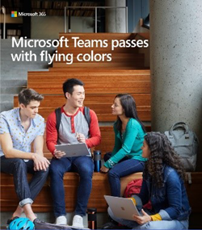
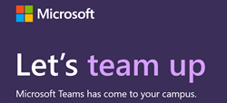

# Ресурсы Microsoft Teams для администраторов учебных заведений

## Ресурсы для удаленного обучения

Нужно ли вашему учебному заведении или университету включить Microsoft Teams для удаленного обучения? Быстро приступите к работе с одним начало работы [и](https://github.com/MicrosoftDocs/OfficeDocs-SkypeForBusiness/blob/live/Teams/downloads/edu-resources/teams-for-education-getting-started-1-pager.pdf?raw=true) любым из приведенных ниже материалов по внедрению.

## Материалы по внедрению

Узнайте, как в вашем учебном заведении работать с Microsoft Teams, используя электронные письма, плакаты, раздатки и другие ресурсы, которые вы можете использовать сейчас. Вы также можете связаться с учащимися в Интернете и в разных учебных заведениях, используя новый набор цифровых средств, заполненный баннерами, GIF-файлами и видео. Начните работу уже сегодня!

Прежде чем использовать эти материалы [,](https://github.com/MicrosoftDocs/OfficeDocs-SkypeForBusiness/blob/live/Teams/downloads/edu-resources/license_agreement_teams_for_education.pdf?raw=true) ознакомьтесь с условиями.

### Физические ресурсы

|&nbsp; | &nbsp; |
|---------|---------|
|Плакаты — [настраиваемые и](https://github.com/MicrosoftDocs/OfficeDocs-SkypeForBusiness/blob/live/Teams/downloads/edu-resources/posters-customizable.zip?raw=true) [готовые к печати](https://github.com/MicrosoftDocs/OfficeDocs-SkypeForBusiness/blob/live/Teams/downloads/edu-resources/posters-print-ready.zip?raw=true)      |[Раздаточные материалы](https://github.com/MicrosoftDocs/OfficeDocs-SkypeForBusiness/blob/live/Teams/downloads/edu-resources/handouts.zip?raw=true) |
|[Листовки](https://github.com/MicrosoftDocs/OfficeDocs-SkypeForBusiness/blob/live/Teams/downloads/edu-resources/flyers.zip?raw=true)    |[Книга рекламы](https://github.com/MicrosoftDocs/OfficeDocs-SkypeForBusiness/blob/live/Teams/downloads/edu-resources/book-adverts.zip?raw=true)          |
|[Фотография брошюры "Советы и рекомендации".](https://github.com/MicrosoftDocs/OfficeDocs-SkypeForBusiness/blob/live/Teams/downloads/edu-resources/get-started-tips-tricks.zip?raw=true)      |

### Цифровые ресурсы

Обязательно ознакомьтесь с руководством по [набору цифровых](https://github.com/MicrosoftDocs/OfficeDocs-SkypeForBusiness/blob/live/Teams/downloads/edu-resources/digital-toolkit-guidance.zip?raw=true) средств для максимально эффективного запуска Teams. 

| &nbsp; |&nbsp;  |
|---------|---------|
|[Email шаблонов](https://github.com/MicrosoftDocs/OfficeDocs-SkypeForBusiness/blob/live/Teams/downloads/edu-resources/email-templates.zip?raw=true)      |[Гифки](https://github.com/MicrosoftDocs/OfficeDocs-SkypeForBusiness/blob/live/Teams/downloads/edu-resources/gifs.zip?raw=true)         |
|[Веб-баннеры](https://github.com/MicrosoftDocs/OfficeDocs-SkypeForBusiness/blob/live/Teams/downloads/edu-resources/web-banners.zip?raw=true)     |[Видеоролики](https://github.com/MicrosoftDocs/OfficeDocs-SkypeForBusiness/blob/live/Teams/downloads/edu-resources/videos.zip?raw=true)           |
|[Рекламные объявления цифрового экрана](https://github.com/MicrosoftDocs/OfficeDocs-SkypeForBusiness/blob/live/Teams/downloads/edu-resources/digital-screen-adverts.zip?raw=true)    |      |

## Призыв к действию

- Посетите [страницу Teams для образования для](https://www.microsoft.com/en-us/education/products/teams/default.aspx) обучения, видео и интерактивных демонстраций
- Включите Teams в [Центр администрирования Microsoft 365](https://portal.office.com/adminportal/home#/Settings/ServicesAndAddIns) (войдите от имени Office 365 администратора)
- Скачайте клиенты Teams: [Microsoft Teams работает на всех ваших устройствах](https://teams.microsoft.com/downloads).
- Получите дополнительные сведения об Office 365 для образования в [Центре справки "Образование"](https://support.office.com/education).

## Дополнительные ресурсы

- [Стратегия развития Teams](https://aka.ms/teamsroadmap)
- Актуальные новости в нашем [блоге Tech Community](https://techcommunity.microsoft.com/t5/Microsoft-Teams-Blog/bg-p/MicrosoftTeamsBlog)
- [Обзор PowerShell в Teams](teams-powershell-overview.md)
- [Отправить предложение](https://aka.ms/eduuservoice)
- [Связаться со службой поддержки](https://aka.ms/o365portal)
- [Задать вопрос сообществу Teams](https://aka.ms/msteamscommunity)
- [Найти дополнительные ресурсы для образовательных учреждений](https://education.microsoft.com/)
