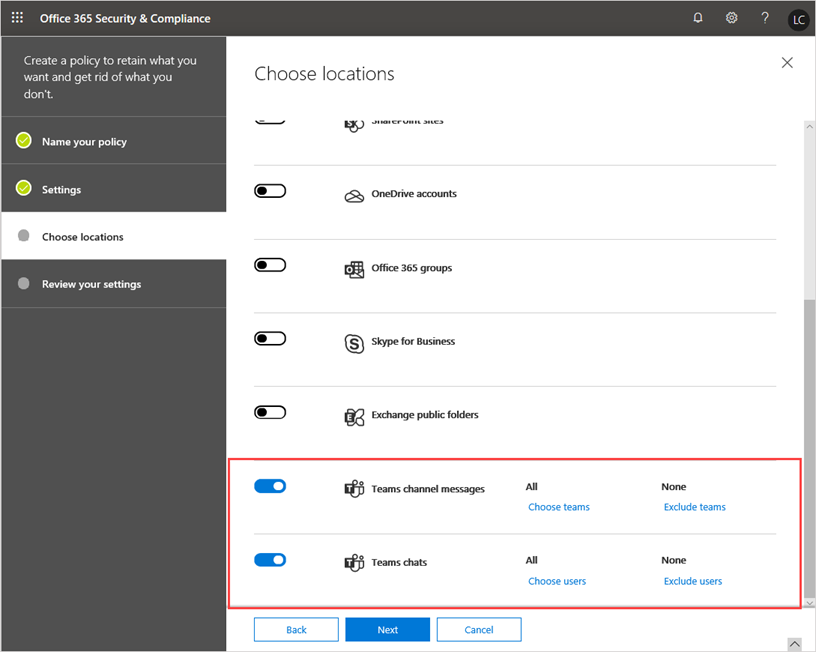

# Политики хранения в Microsoft Teams

Политики хранения помогают эффективнее управлять сведениями в организации. Используйте политики хранения для хранения данных, необходимых для соответствия внутренним политикам организации, отраслевым нормам или юридическим требованиям, а также для удаления данных, считающихся обязательствами, которые больше не требуется хранить, или не имеющих юридической или бизнес-ценности.

По умолчанию данные чатов, каналов и файлов Teams хранятся бессрочно. В качестве администратора вы можете настроить политики хранения Teams для чатов и сообщений каналов, а также заранее решать, следует ли хранить данные, удалить их или сохранить на определенный период времени, а затем удалить.

Вы можете создавать политики хранения для Teams и других рабочих нагрузок, а также управлять ими в [Центре безопасности и соответствия требованиям Office 365](https://protection.office.com/) или с помощью командлетов PowerShell Центра безопасности и соответствия требованиям. Вы можете применить политику хранения Teams ко всей организации или отдельным пользователям и командам.

> [!NOTE]
> Мы пока не поддерживаем конфигурацию для хранения сообщений частных каналов. Поддерживается хранение файлов, к которым предоставлен общий доступ в закрытых каналах.

Дополнительные сведения о политиках хранения для Office 365 см. в статье [Общие сведения о политиках хранения](https://support.office.com/article/overview-of-retention-policies-5e377752-700d-4870-9b6d-12bfc12d2423).

## Что такое политики хранения для Teams?

При настройке политики хранения для Teams или любой другой рабочей нагрузки можно настроить следующее:

- **Хранение данных**. Используйте политику хранения, чтобы обеспечить хранение данных в течение определенного периода времени независимо от действий в пользовательском приложении. Данные сохраняются по соображениям соответствия требованиям, и они доступны для обнаружения электронных данных до истечения срока хранения, после которого политика указывает нужные действия: ничего не делать или удалить данные. Например, если вы создаете политику хранения Teams для хранения сообщений каналов в течение 7 лет, сообщения сохраняются для обнаружения электронных данных в течение 7 лет, даже если пользователи удаляют свои сообщения в Teams.
- **Удаление данных**. Используйте политику хранения для удаления данных, чтобы организация не несла за них ответственность. При использовании политики хранения Teams, когда вы удаляете данные, они удаляются без возможности восстановления из всех мест хранения в службе Teams.

С помощью политик хранения для Teams вы можете:

- Сохранять чаты и/или сообщения каналов Teams в течение указанного срока и не предпринимать последующих действий.
- Сохранять чаты и/или сообщения каналов Teams в течение указанного срока, а затем удалить данные.
- Удалить чаты и/или сообщения каналов Teams после указанного срока.

> [!NOTE]
> Помните, что в Teams файлы, которыми пользователи делятся в приватных чатах, хранятся в учетной записи OneDrive для бизнеса пользователя, поделившегося файлом. А файлы, добавляемые участниками команды в беседу канала, сохраняются на сайте SharePoint команды. Поэтому чтобы сохранить или удалить файлы в Teams, создайте политики хранения, применяющиеся к OneDrive для бизнеса и SharePoint Online.

Если данные регулируются политикой хранения, пользователи могут продолжать работать с ними, так как данные хранятся в исходном расположении. Если пользователь редактирует или удаляет данные, регулируемые политикой хранения, копия сохраняется в безопасном расположении до момента окончания действия политики сохранения.

Минимальным требованием к лицензии для политик хранения является Office 365 E3. Дополнительные сведения о лицензировании см. в статье [Лицензирование Office 365 для Teams](Office-365-licensing.md).

## Как работают политики хранения Teams

Чаты Teams хранятся в скрытой папке SubstrateHolds в почтовом ящике каждого пользователя из чата, а сообщения каналов Teams — в скрытой папке SubstratesHolds в почтовом ящике группы для команды. Teams использует службу чатов на платформе Azure, которая также хранит эти данные, и по умолчанию она хранит их бессрочно. При использовании политики хранения Teams, когда вы удаляете данные, они удаляются без возможности восстановления как из почтовых ящиков Exchange, так и из базовой службы чатов.

Когда вы применяете политику хранения к чатам и сообщениям каналов Teams, происходит следующее:

- Если сообщение чата или канала редактируется или удаляется пользователем в течение срока хранения, оно копируется (если оно было отредактировано) или перемещается (если оно было удалено) в папку SubstrateHolds и хранится там до истечения срока хранения. Если политика настроена на удаление данных после истечения срока хранения, сообщения окончательно удаляются в день истечения срока хранения.
- Если сообщение чата или канала не удаляется пользователем в течение срока хранения, оно перемещается в папку SubstrateHolds в течение одного дня после истечения срока хранения. Если политика настроена на удаление данных после истечения срока хранения, сообщение окончательно удаляется через день после перемещения в папку.

> [!NOTE]
> Такой же процесс применяется для чатов при взаимодействии Skype для бизнеса Online и Teams. Когда чат Skype для бизнеса Online поступает в Teams, он становится сообщением в цепочке чатов Teams и отправляется в соответствующий почтовый ящик. Политики хранения Teams будут удалять эти сообщения из цепочки Teams. Однако если журнал бесед включен для Skype для бизнеса Online и на стороне клиента Skype для бизнеса Online они сохраняются в почтовом ящике, эти данные чата не обрабатываются политикой хранения Teams.

Политики хранения Teams учитывают дату создания сообщений чата или канала и имеют обратную силу. Другими словами, если вы создаете политику хранения для удаления данных старше 90 дней, данные Teams, созданные более 90 дней назад, удаляются.

Политика хранения, примененная к SharePoint Online или OneDrive для бизнеса, может удалить файл, на который ссылается сообщение чата или канала Teams, до удаления этого сообщения. В этом случае файл по-прежнему отображается в сообщении Teams, но при щелчке по нему возникает ошибка "Файл не найден". Это также может произойти при отсутствии политики, если кто-то вручную удаляет файл из SharePoint Online или OneDrive для бизнеса.

### Рекомендации и ограничения

Ниже приведены некоторые рекомендации и ограничения, которые следует учитывать при работе с политиками хранения Teams.

- Для Teams требуется политика хранения, отдельная от других рабочих нагрузок. Другими словами, вы должны создавать специальные политики хранения для чатов и/или сообщений каналов Teams. По этой причине вы не можете включить Teams в политики хранения на уровне организации.

- Сообщения закрытых каналов не поддерживаются. В настоящее время политики хранения для Teams применяются только к сообщениям стандартных каналов.

- Teams не поддерживает расширенные параметры хранения, такие как возможность применения политики к контенту, содержащему ключевые слова или конфиденциальные сведения. В настоящее время политики хранения в Teams применяются ко всему содержимому сообщений чатов и/или каналов.

- Для очистки просроченных сообщений Teams может потребоваться от 3 до 7 дней. Политика хранения Teams удаляет сообщения чатов и каналов по истечении срока хранения. Тем не менее, чтобы очистить эти сообщения и окончательно удалить их, может потребоваться от 3 до семи дней. Кроме того, сообщения чатов и каналов доступны для поиска средствами обнаружения электронных данных после истечения срока хранения и до безвозвратного удаления сообщений.

### Несколько политик хранения и принципы хранения

Если вы настроили несколько политик хранения Teams с разными сроками, применяются [принципы политик хранения](https://docs.microsoft.com/microsoft-365/compliance/retention-policies#the-principles-of-retention-or-what-takes-precedence). Ниже представлен обзор приоритетов:

- сохранение всегда имеет приоритет перед удалением;
- самый длительный срок сохранения всегда имеет приоритет;
- явное включение имеет приоритет перед неявным применительно к расположениям;
- приоритет имеет самый короткий срок удаления.

## Когда применять политики хранения для Teams

Во многих случаях организации считают данные приватных чатов большей ответственностью, чем сообщения каналов, беседы в которых обычно связаны с проектами.

Вы можете настроить отдельные политики хранения для приватных чатов (индивидуальных или групповых чатов) и сообщений каналов. Кроме того, вы можете настроить уникальные политики, применяемые к определенным пользователям или командам в организации. В случае чатов Teams можно выбрать пользователей, к которым применяется политика. В случае сообщений каналов Teams можно выбрать команды, к которым применяется политика.

Например, в случае сообщений каналов к определенным командам в организации можно применять политику удаления со сроком один год, а для остальных команд — политику удаления со сроком три года.

## Управление политиками хранения для Teams

### Использование Центра безопасности и соответствия требованиям

#### Создание политики хранения

Чтобы создать политику хранения для чатов и сообщений каналов Teams, выполните следующее:

1. В левой панели навигации Центра безопасности и соответствия требованиям выберите **Управление информацией** > **Хранение**.
2. Нажмите **Создать**.
3. На странице **Назовите политику** введите имя и описание политики и щелкните **Далее**.
4. На странице **Параметры** укажите, нужно ли хранить данные или удалять их (или оба варианта), срок хранения и щелкните **Далее**.
5. На странице **Выберите расположения** выполните следующие действия и нажмите **Далее**:

    - Чтобы применить политику к сообщениям канала, включите **Сообщения каналов Teams**.  Если вы хотите применить политику к определенным командам в организации, нажмите **Выбрать команды** и выберите нужные команды.
    - Чтобы применить политику к чатам, включите **Чаты Teams**. Если вы хотите применить политику к определенным пользователям в организации, нажмите **Выбрать пользователей** и выберите нужных пользователей.
      > [!NOTE]
      > Когда вы включаете параметры **Сообщения каналов Teams** и/или **Чаты Teams**, все остальные расположения автоматически отключаются. Политика хранения Teams может включать только расположения Teams.

        

      > [!IMPORTANT]
      > На чаты и сообщения каналов Teams не влияют политики хранения, применяемые к почтовым ящикам пользователей или групп в расположениях **Электронная почта Exchange** и **Группы Office 365**. Хотя чаты и сообщения каналов Teams хранятся в Exchange, на них влияет только политика хранения, применяемая к расположениям Teams.

6. Проверьте параметры и после завершения нажмите **Создать политику**.

#### Изменение политики хранения

Чтобы изменить политику хранения Teams, выполните следующее:

1. В левой панели навигации Центра безопасности и соответствия требованиям выберите **Управление информацией** > **Хранение**.
2. В списке политик хранения установите флажок рядом с политикой хранения, которую нужно изменить.
3. Нажмите **Изменить** рядом с элементом, который нужно изменить, внесите изменения, нажмите **Сохранить** и щелкните **Закрыть**.

    

#### Удаление политики хранения

Чтобы удалить политику хранения Teams, выполните следующее:

1. В левой панели навигации Центра безопасности и соответствия требованиям выберите **Управление информацией** > **Хранение**.
2. В списке политик хранения установите флажок рядом с политикой хранения, которую нужно удалить.
3. Выберите **Удалить политику**.

### Использование PowerShell

Чтобы создать политики хранения Teams и управлять ими с помощью [PowerShell & безопасности Office 365](https://docs.microsoft.com/powershell/exchange/office-365-scc/connect-to-scc-powershell/connect-to-scc-powershell), выполните следующие командлеты:

|Политика|Правило|
|---|---|
|[New-RetentionCompliancePolicy](https://docs.microsoft.com/powershell/module/exchange/policy-and-compliance-retention/new-retentioncompliancepolicy?view=exchange-ps)| [New-RetentionComplianceRule](https://docs.microsoft.com/powershell/module/exchange/policy-and-compliance-retention/new-retentioncompliancerule?view=exchange-ps)|
|[Get-RetentionCompliancePolicy](https://docs.microsoft.com/powershell/module/exchange/policy-and-compliance-retention/get-retentioncompliancepolicy?view=exchange-ps)| [Get-RetentionComplianceRule](https://docs.microsoft.com/powershell/module/exchange/policy-and-compliance-retention/get-retentioncompliancerule?view=exchange-ps)|
|[Set-RetentionCompliancePolicy](https://docs.microsoft.com/powershell/module/exchange/policy-and-compliance-retention/set-retentioncompliancepolicy?view=exchange-ps)| [Set-RetentionComplianceRule](https://docs.microsoft.com/powershell/module/exchange/policy-and-compliance-retention/set-retentioncompliancerule?view=exchange-ps)|
|[Remove-RetentionCompliancePolicy](https://docs.microsoft.com/powershell/module/exchange/policy-and-compliance-retention/remove-retentioncompliancepolicy?view=exchange-ps)| [Remove-RetentionComplianceRule](https://docs.microsoft.com/powershell/module/exchange/policy-and-compliance-retention/remove-retentioncompliancerule?view=exchange-ps)|

## Известные проблемы

Ниже описаны известные проблемы политик хранения в Teams, которые отслеживаются и исследуются.

- В разделе **Выбрать команды** в строке расположения **Сообщения каналов Teams** вы можете видеть группы Office 365, не являющиеся командами. Это будет исправлено в будущем.

- В разделе **Выбрать пользователей** в строке расположения **Чаты Teams** вы можете видеть гостей и пользователей без почтовых ящиков. Политики хранения не предназначены для гостей, и мы работаем над удалением их из списка.

- Помощник по обеспечению жизненного цикла Exchange (ELC) запускается ежедневно, но для него используется SLA со сроком 7 дней. Это может привести к тому, что при наличии политики хранения Teams, предназначенной для удаления элементов старше 60 дней, такие элементы могут храниться в течение 67 дней. Это не новая ситуация: она сопутствует модели Exchange. Конечно же, в большинстве случаев задержка не возникает.

## Статьи по теме

- [Обзор политик хранения](https://support.office.com/article/overview-of-retention-policies-5e377752-700d-4870-9b6d-12bfc12d2423)
