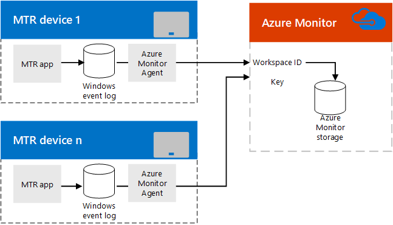

# Планирование управления комнатами Microsoft Teams с помощью Azure MonitorPlan Microsoft Teams Rooms management with Azure Monitor
 
 В этой статье рассматриваются вопросы планирования использования azure Monitor для администрирования устройств комнат Microsoft Teams в реализации Microsoft Teams или Skype для бизнеса.This article discusses planning considerations for using Azure Monitor to administer Microsoft Teams Rooms devices in your Microsoft Teams or Skype for Business implementation.
  
[Azure Monitor](/azure/azure-monitor/overview) — это набор служб управления, разработанных в облаке с самого начала.[Azure Monitor](/azure/azure-monitor/overview) is a collection of management services that were designed in the cloud from the start. Компоненты Azure Monitor размещены в Azure, а не развертываются и управляются ресурсами локальной системы.Rather than deploying and managing on-premise resources, Azure Monitor components are entirely hosted in Azure. Конфигурация минимальна, и вы можете работать в буквальном смысле за считанные минуты.Configuration is minimal, and you can be up and running literally in a matter of minutes. Некоторые настройки помогают управлять системами конференц-связи по комнатам Microsoft Teams, предоставляя в режиме реального времени уведомления о состоянии системы или неисправностях отдельных систем комнат, а также могут перенаправляться в управление тысячами конференц-залов Комнат Microsoft Teams.With some customization work, it can aid in managing Microsoft Teams Rooms conferencing systems by providing real-time notifications of system health or faults for individual room systems, and it can potentially scale up to managing thousands of Microsoft Teams Rooms conference rooms.
  
В этой статье описаны требования, проектирование, архитектура и методики внедрения, необходимые для внедрения управления конференц-связью комнат Microsoft Teams на основе Azure, а также ссылки на подробные статьи о внедрении комнат Azure Teams и важные справочные сведения для постоянного контроля комнат Microsoft Teams.This article provides a discussion of the requirements, design/architecture, and implementation best practices needed to implement Azure Monitor based management of Microsoft Teams Rooms conference devices, and provides links to detailed articles on implementing Azure Monitor for Microsoft Teams Rooms and critical reference information for ongoing monitoring of Microsoft Teams Rooms rooms. 
  
## Функциональный обзорFunctional overview

  
Приложение "Комнаты Microsoft Teams" на устройстве консоли записывает события в журнал событий Windows.The Microsoft Teams Rooms app on the console device writes events to its Windows Event Log. После установки агент мониторинга Майкрософт передает сведения в службу Azure Monitor.A Microsoft Monitoring agent, once installed, passes the information to Azure Monitor service. 
  
После правильной настройки log Analytics анализирует нагрузку JSON, внедренную в описания событий, чтобы описать, как работает каждая система комнат Microsoft Teams и какие ошибки выявляются.Once properly configured, Log Analytics parses the JSON payload embedded in the event descriptions to describe how each Microsoft Teams Rooms system is functioning and what faults are detected. 
  
Администратор, использующий Azure Monitor, может получать уведомления о том, что системы комнат Microsoft Teams работают в автономном режиме, имеют проблемы с приложением, подключением или оборудованием, а также могут быть уведомлены о том, требуется ли перезапустить систему.An administrator using Azure Monitor can get notifications of Microsoft Teams Rooms systems that are offline or are experiencing app, connectivity, or hardware failures as well as knowing if a system needs to be restarted. Состояние системы постоянно обновляется, поэтому эти уведомления близко к обновлениям в режиме реального времени.Each system status is updated frequently, so these notifications are close to real-time updates.
  
## Требования Azure MonitorAzure Monitor requirements

Для использования функции аналитики журналов вам необходимо иметь действиическую подписку Azure для Azure Monitor.You must have a valid Azure subscription for Azure Monitor to use Log Analytics feature. Дополнительные [действия по созданию подписки](/azure/azure-monitor/learn/quick-create-workspace) для организации см. в рабочей области "Аналитика журналов".See [Get started with a Log Analytics workspace](/azure/azure-monitor/learn/quick-create-workspace) to create a subscription for your organization.
  
При необходимости вы должны ознакомиться с использованием конструктора средств аналитики журналов.You should familiarize yourself as necessary on how to use the Log Analytics View Designer. Эти [сведения см. в области "Представления"](/azure/azure-monitor/platform/view-designer) в средстве аналитики журналов.See [Views in Log Analytics](/azure/azure-monitor/platform/view-designer) for those details.
  
### Связанные задачиRelated Tasks

1. После подписки на службу аналитики журналов Azure Monitor создавайте настраиваемые поля (как описано в полях "Карта"), необходимые для анализа сведений, которые отправляются с консолей комнат Microsoft Teams.Once subscribed to Azure Monitor Log Analytics, create custom fields (as described in [Map custom fields](azure-monitor-deploy.md#Custom_fields)) needed to parse the information that will be sent from Microsoft Teams Rooms consoles. Это включает понимание схемы JSON, описанной [в описании записей журнала.](azure-monitor-manage.md#understand-the-log-entries)This includes understanding the JSON schema documented in [Understand the log entries](azure-monitor-manage.md#understand-the-log-entries).
    
2. Разработка представления управления комнатами Microsoft Teams в средстве аналитики журналов.Develop a Microsoft Teams Rooms management view in Log Analytics. Вы можете создать [панель мониторинга комнат Microsoft Teams](azure-monitor-deploy.md#create-a-microsoft-teams-rooms-dashboard-by-using-the-import-method) с помощью метода импорта или создать панель мониторинга комнат Microsoft Teams [вручную.](azure-monitor-deploy.md#create-a-microsoft-teams-rooms-dashboard-manually)You can either [Create a Microsoft Teams Rooms dashboard by using the import method](azure-monitor-deploy.md#create-a-microsoft-teams-rooms-dashboard-by-using-the-import-method) or [Create a Microsoft Teams Rooms dashboard manually](azure-monitor-deploy.md#create-a-microsoft-teams-rooms-dashboard-manually).
    
## Требования к консоли для отдельных комнат Microsoft TeamsIndividual Microsoft Teams Rooms Console requirements

Каждая консоль комнат Microsoft Teams — это приложение, которое работает на устройстве Surface Pro в киоске (обычно оно настроено как единственное приложение, которое может работать на устройстве).Each Microsoft Teams Rooms console is an app running on a Surface Pro device in kiosk mode (normally, it's configured to be the only app that can run on the device). Как и любое приложение Для Windows, приложение Microsoft Teams Rooms записывает такие события, как неисправности запуска и оборудования, в журнал событий Windows.As with any Windows app, the Microsoft Teams Rooms app writes events like startup and hardware faults to the Windows Event Log. Добавление агента Microsoft Monitor на устройство комнат Microsoft Teams позволяет собирать эти события.Adding an Microsoft Monitor agent on your Microsoft Teams Rooms device allows these events to be collected. (Подробные [сведения см. в подключении](/azure/azure-monitor/platform/agent-windows) компьютеров Windows к службе Log Analytics в Azure.)(See [Connect Windows computers to the Log Analytics service in Azure](/azure/azure-monitor/platform/agent-windows) for details.)
  
## Текущее управлениеOngoing management

При использовании azure Monitor для управления устройствами комнат Microsoft Teams необходимо понимать, что содержится в журналах событий, используемых Azure Monitor.While using Azure Monitor to manage your Microsoft Teams Rooms devices, you'll need to understand the information contained in the event logs used by Azure Monitor. Подробные [сведения об этих сообщениях о](azure-monitor-manage.md#understand-the-log-entries) состоянии см. в записях журнала.See [Understand the log entries](azure-monitor-manage.md#understand-the-log-entries) for details on these health messages.
  
### Связанные задачиRelated Tasks

- Понимание оповещений, созданных комнатами Microsoft Teams, и их устранения (см. раздел "Понимание записей [журнала")](azure-monitor-manage.md#understand-the-log-entries)Understand the Alerts generated by Microsoft Teams Rooms and how to resolve them (see the section titled [Understand the log entries](azure-monitor-manage.md#understand-the-log-entries))
    
## См. такжеSee also

[Развертывание управления помещениями Microsoft Teams с помощью Azure MonitorDeploy Microsoft Teams Rooms management with Azure Monitor](azure-monitor-deploy.md)
  
[Управление устройствами комнат Microsoft Teams с помощью Azure MonitorManage Microsoft Teams Rooms devices with Azure Monitor](azure-monitor-manage.md)