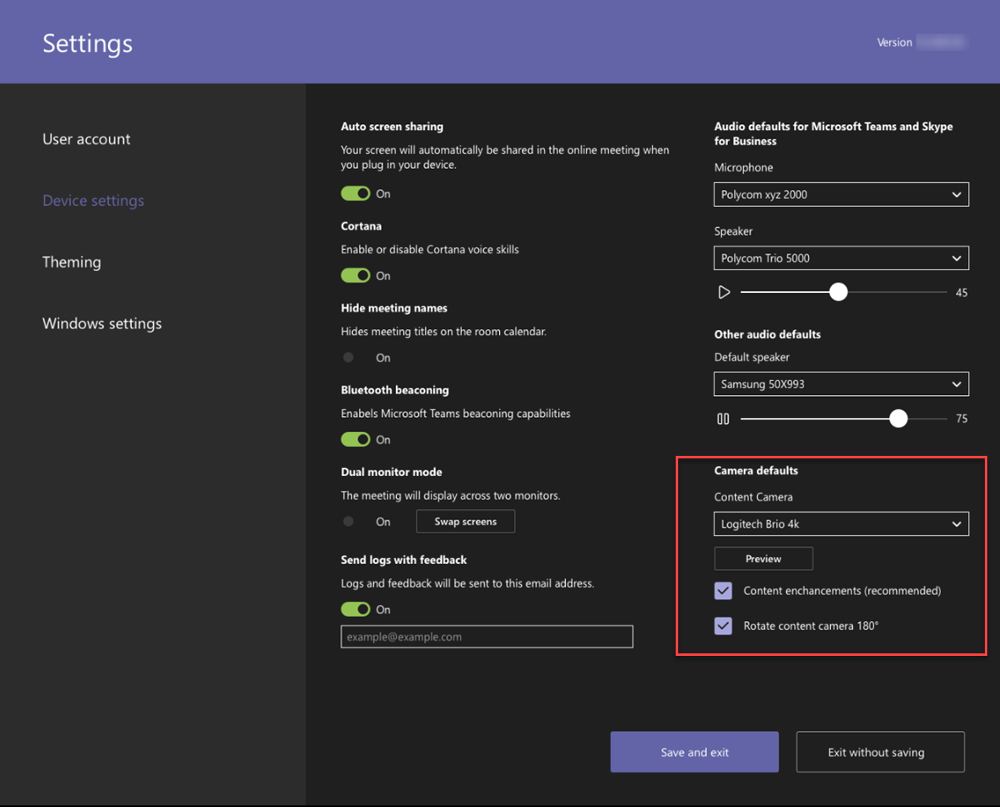

# Камеры содержимого

Теперь вы можете использовать камеру содержимого с системой Microsoft Teams комнаты. Камера содержимого взаимодействует со специальным программным обеспечением для обработки изображений и доской, чтобы позволить представитему рисовать на аналоговой доске и делиться содержимым с удаленными участниками.

Примеры функций камеры содержимого см. в видеоролике ниже.

> [!VIDEO https://www.microsoft.com/videoplayer/embed/RE3E7fy]

## Настройка камеры содержимого

> [!NOTE]
> Всегда соблюдайте стандарт здания вашей страны или региона, который может определять минимальное расстояние от этажа или требования, чтобы оборудование с поверверхом было защищено для обсверления или другой структуры. Следуйте инструкциям по монтажу оборудования, предоставленного для выбранной камеры. Комплекты для установки камеры OEM включают камеру, дополнительные удлинители USB 2.0 и необходимые кабели.

Размер доски, используемой для общего доступа, влияет на размещение камеры. Рекомендации по размеру доски:

- 3–6 ft. (0,9–1,8 m) в ширину — поддерживается
- 6–9 ft. (1,8–2,7 м) в ширину — рекомендуется
- 9–12 FT (2,7–3,6 м) в ширину — поддерживается
- Выше 12 м (3,6 м) — камера занимает 9–12 м (2,7–3,6 м) и обводит остальные части.

## Расположение камеры

Идеальное расположение камеры содержимого расположено по вертикали и по горизонтали на доске. Локальные коды здания могут иметь ограничения высоты, которые требуют, чтобы камера была выше, чем верхняя часть доски.

Вы можете установить камеру до 6 в. (152 мм) выше, чем верхняя часть доски, и находится по центру на доске, как показано ниже. Убедитесь, что изображение камеры содержит не менее шести человек. Граница (152 мм) с обеих сторон по горизонтали. Вы можете использовать предварительный просмотр камеры в Комнаты Microsoft Teams, чтобы определить окончательное расположение камеры.

### Расстояние между камерами

С помощью типичных маркеров доски оптимальным решением для удаленного использования является совместное использование росчерков пера в диапазоне 1–2 мм на пиксель на изображении камеры содержимого, и для достижения наилучших результатов используйте 1,5 мм на пиксель. Все поддерживаемые камеры обеспечивают разрешение 1920 x 1080, и некоторые из них могут превысить это разрешение.

Расстояние от камеры от доски объединяется с разрешением камеры и HFoV для определения расстояния от доски. В таблице ниже показаны примеры расстояний для разных размеров доски. Эти значения можно использовать в качестве отправных точек для определения окончательного размещения камеры содержимого.

**Расстояние камеры от доски**

| HFoV камеры |3 ft. (0,91 m)     | 6 ft. (1,8 m)    | 9 ft. (2,74 m)        |12 ft.  (3,65 м)         | Максимальное расстояние от доски  |
|:---         |:---               |:---                |:---                 |:---             | :--- |
| 80°         | 1,79 ft. (0,54 м) | 3,58 ft. (1,09 m)  | 5,36 ft. (1,6 m)    |7,15 ft. (2,17 м) |7,51 фута (2,28 м) |
| 90°         | 1,5 фута (0,45 м) | 3,00 ft. (0,91 m)   | 4,5 фута (1,37 м)    |6,0 ft. (1,82 м)    |6,3 фута (1,92 м) |
| 100°        | 1,26 ft. (0,38 m)| 2,52 фута (0,77 м)   | 3,78 ft. (1,15 м)   |5,03 ft. (1,53 м)   |5,29 ft. (1,61 m) |
| 110°        | 1,05 ft. (0,32 m)| 2,10 ft. (0,64 m)   | 3,15 ft. (0,96 m)   |4,2 фута (1,28 м)    |4,41 фута (1,31 м) |
| 120°        | 0,87 ft. (0,26 m)| 1,73 ft. (0,52 m)   | 2,60 ft. (0,79 m)   |3,46 ft. (1,05 m)   |3,64 фута (1,10 м) |
|             |               |                  |                  |        |                    |                  |

Расстояние между камерой содержимого и стеной, на которой установлена доска, зависит от HFoV-модели камеры. Установите камеры с более крупным HFoV (например, на 120 градусов) ближе к стене и камеры с более узким HFoV дальше от стены. Прежде чем начать установку выбранной камеры, проверьте HFoV.

Если у вас есть доски размером более 12 м (3,65 м) или без углов (например, полностенные доски), вы можете разместить камеру в любом месте посередине. Если не удается найти углы доски, средство улучшения выбирает область посередине.

> [!NOTE]
> Вы можете использовать темно-цветную ленту или другие элементы для создания определенной области камеры содержимого на полностенной доске.
>
> Вы можете установить камеру на перемещаемый штатив, а не постоянную. Поместите штатив по центру на доску. Эта настройка может быть временной или использовать, если вероятность того, что оборудование будет сбито с места, мало. При использовании временного крепления помните, что улучшение содержимого будет влиять на перемещение камеры после первоначального поделиться, и вам потребуется повторно поделиться, чтобы исправить перемещение.
>
> Доска для записи не белая не поддерживается.

## Поддерживаемые камеры

Чтобы определить, можно ли использовать камеру в качестве камеры содержимого, обратитесь к сертифицированным версиям программного обеспечения для [USB-аудио-](requirements.md#certified-firmware-versions-for-usb-audio-and-video-peripherals)и видео периферийных устройств.

Или обратитесь к магазину Microsoft Teams устройств для поддерживаемых наборов камеры содержимого на [aka.ms/teamsdevices.](https://aka.ms/teamsdevices)

## Параметры камеры

После установки камеры в комнате ее можно настроить на консоли Комнаты Microsoft Teams комнаты:

1. Выберите **Параметры**  значок , войдите в качестве администратора и выберите Устройство Параметры .
2. В разделе **По умолчанию камеры** выберите камеру содержимого и убедитесь, что выбран параметр Улучшения содержимого. 
3. (Необязательно) Если камера установлена вверх ногами из-за того, что камера установлена с окла, проверьте параметр Повернуть камеру **содержимого на 180°.**
4. Выберите **Сохранить и выйти**.

Вы также можете настроить эти параметры удаленно с помощью [XML-файла конфигурации.](xml-config-file.md)

## См. также

[Удаленное управление Комнаты Microsoft Teams консоли с помощью XML-файла конфигурации](xml-config-file.md)

[Требования к комнатам Microsoft Teams](requirements.md)

