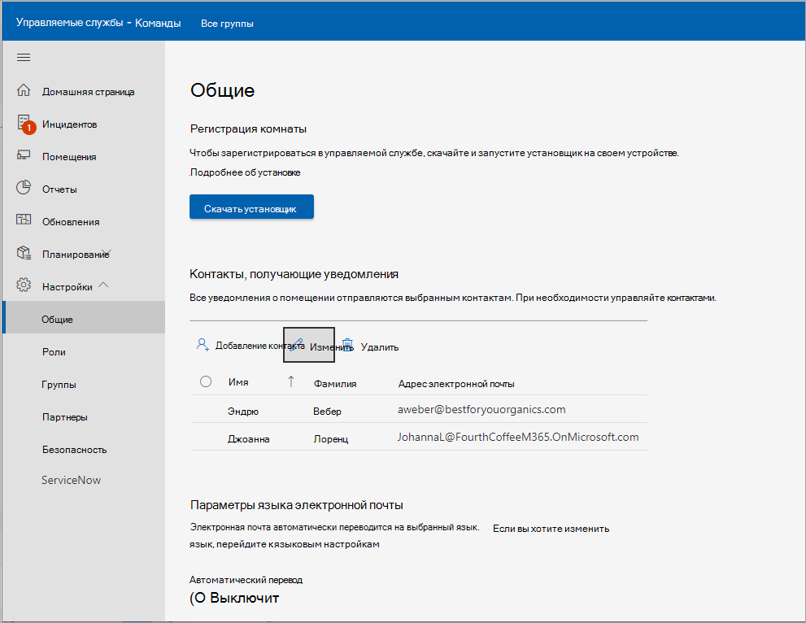

# <a name="enroll-device-into-managed-service"></a>Регистрация устройства в управляемой службе

Для развертывания требуется подключение Комнаты Microsoft Teams устройств к Комнаты Microsoft Teams управляемым службам. Агент службы мониторинга предназначен для использования с сертифицированными Microsoft Teams (MTR) и периферийными устройствами.

## <a name="prerequisites"></a>Необходимые компоненты

Выполните следующие процедуры, чтобы настроить оборудование перед попыткой регистрации:

### <a name="adding-proxy-settings-optional"></a>Добавление параметров прокси-сервера (необязательно)

1. Войдите от имени администратора, выполнив следующие операции Администратор [пользователя устройства MTR](#performing-operations-as-the-admin-user-of-the-mtr-device).
1. В поле Windows ***Search** _ (нижний левый раздел экрана) введите _ *cmd** (либо длинное нажатие экрана, либо выбор вправо, а затем нажмите кнопку "Запуск от имени **_администратора"_**).
1. Выполните следующую команду (важны двойные кавычки в конце команды):

   - При использовании одного ***прокси-сервера***: `bitsadmin /Util /SetIEProxy LOCALSYSTEM MANUAL_PROXY <proxyserver>:<port> ""`

     *Примере:*

     ```DOS
     bitsadmin /Util /SetIEProxy LOCALSYSTEM MANUAL_PROXY contosoproxy.corp.net:8080 ""
     ```

   - При использовании ***PAC-файла*** : `bitsadmin /Util /SetIEProxy LOCALSYSTEM AUTOSCRIPT <pac file url>`

     *Примере:*

     ```DOS
     bitsadmin /Util /SetIEProxy LOCALSYSTEM AUTOSCRIPT `http://contosoproxy.corp.net/proxy.pac`
     ```

### <a name="enabling-tpm-settings"></a>Включение параметров доверенного платформенного модуля

> [!NOTE]
> Для регистрации в управляемой службе необходимо включить TPM.

Если TPM на устройстве Intel NUC отключен, включите TPM на этих устройствах следующим образом:

1. Подключите клавиатуру к устройству NUC.
1. Перезапустите устройство.
1. Чтобы отобразить экран BIOS, быстро нажмите **клавишу F2**.
1. Выберите **"Дополнительно"**.
1. Выберите **"Безопасность"**.
1. Справа под компонентами безопасности включите **технологию intel Platform Trust Technology**.
1. Чтобы сохранить параметры, нажмите **клавишу F10**.
1. В окне подтверждения выберите " **Да"**.

## <a name="performing-operations-as-the-admin-user-of-the-mtr-device"></a>Выполнение операций в качестве Администратор пользователя устройства MTR

Некоторые процедуры настройки и установки требуют входа на устройство с правами администратора.

Чтобы войти на устройство с правами администратора (локальный администратор):

1. Убедитесь, что вы зависаете от текущих вызовов и вернитесь на начальный экран.
1. В пользовательском интерфейсе Microsoft Teams Room нажмите кнопку "Дополнительно **", а** затем выберите **Параметры**, где на устройстве будет предложено ввести пароль локального администратора (пароль по умолчанию **_— sfb_**).
1. Выберите **Параметры**, а **затем выберите Windows Параметры** для доступа Windows в качестве локального администратора.

1. В списке пользователей, отображаемых на экране Windows входа, выберите **администратора (** или соответствующего локального администратора устройства).

> [!NOTE]
> Если компьютер присоединен к *домену, выберите* "Другой пользователь **", затем** используйте **.\admin** или имя локального администратора, настроенное на устройстве в качестве имени пользователя.

Чтобы вернуться в приложение Комнаты Microsoft Teams после выполнения необходимых административных задач:

1. В Windows ***меню*** выйдите из Администратор учетной записи.
1. Вернитесь Комнаты Microsoft Teams, щелкнив значок учетной записи пользователя в левой левой части экрана, а затем выбрав **Skype**.

> [!NOTE]
> Если Skype отсутствует в списке, выберите "Другой пользователь" и введите ***.\skype*** в качестве имени пользователя и выполните вход.

## <a name="urls-required-for-communication"></a>URL-адреса, необходимые для связи

 > [!NOTE]
 > Весь сетевой трафик между агентом устройств MTR и порталом служб Комнаты Microsoft Teams управляемых служб — SSL через порт 443 *.*  См[. Office 365 URL-адреса и диапазоны IP-адресов — Microsoft 365 корпоративный | Документация Майкрософт](/microsoft-365/enterprise/urls-and-ip-address-ranges?view=o365-worldwide&preserve-view=true).

Следующие узлы должны быть разрешены, если в  корпоративной среде включен список разрешенных трафика:

agent.rooms.microsoft.com<br>
global.azure-devices-provisioning.net<br>
gj3ftstorage.blob.core.windows.net<br>
mmrstgnoamiot.azure-devices.net<br>
mmrstgnoamstor.blob.core.windows.net<br>
mmrprodapaciot.azure-devices.net<br>
mmrprodapacstor.blob.core.windows.net<br>
mmrprodemeaiot.azure-devices.net<br>
mmrprodemeastor.blob.core.windows.net<br>
mmrprodnoamiot.azure-devices.net<br>
mmrprodnoamstor.blob.core.windows.net

## <a name="enrollment-process"></a>Процесс регистрации

Процесс регистрации состоит из следующих этапов:

1. На панели навигации слева на Комнаты Microsoft Teams портале управляемых [http://portal.rooms.microsoft.com](https://portal.rooms.microsoft.com/)служб разверните **Параметры выберите "** Общие **"**.
1. В *разделе "Регистрация комнаты*" выберите **"Скачать установщик**  ", чтобы скачать программное обеспечение агента мониторинга.
1. **Дополнительные:** Настройка параметров прокси-сервера для агента; См [. раздел "Добавление параметров прокси-сервера (необязательно)"](#adding-proxy-settings-optional).
1. Установите установщик агента (скачанный на шаге 2) на устройствах MTR, запустив MSI локально на устройстве MTR или с помощью обычных средств массовой публикации приложений MSI на устройствах в среде (групповая политика и т. д.).
1. Комната появится на портале в течение 5–10 минут. В противном случае свяжитесь с managedroomsupport@microsoft.com.

   

> [!NOTE]
> Если вам нужно установить агент без Teams App на MTR, который может войти в Teams, вы можете использовать наш ключ регистрации в качестве дополнительного процесса. Перейти к "?".  (Справка) в правом верхнем углу портала выберите "Скачать ключ (необязательно)". При установке агента поместите ключ самостоятельной регистрации (ранее скачанный с портала) в каталог **C:\Rigel** устройства.

## <a name="installation"></a>Установка

После скачивания установщика из Майкрософт (с портала или с помощью указанного выше URL-адреса AKA.ms) распакуйте его содержимое, чтобы получить доступ к файлу **ManagedRoomsInstaller.msi.**

Существует два режима установки: 1) установка отдельных локальных компьютеров и 2) режим массового развертывания (обычно с помощью групповой политики аналогичного метода). Мы рекомендуем выполнять отдельную установку для компьютеров, не присоединенных к домену, или для компьютеров, на которых невозможно удаленно запускать установщики MSI.

Из-за множества различных способов запуска приложений MSI в режиме массового развертывания в этом документе рассматривается только установка в отдельном режиме.

## <a name="individual-devicemdashdomain-joined-walkthrough"></a>Пошаговое&mdash;руководство по присоединению к домену отдельного устройства

1. Войдите на устройство с правами администратора. Убедитесь *, что выполняются Администратор выполнения* действий пользователя устройства.

1. Скопируйте файл **ManagedRoomsInstaller.msi** на устройство MTR.

   При запуске ***ManagedRoomsInstaller.msi*** отображается экран лицензионного соглашения.

1. Прочитав соглашение, установите флажок ***Я принимаю** условия лицензионного соглашения_ и нажмите клавишу _*Install**.

    Начинается установка программного Комнаты Microsoft Teams мониторинга управляемых служб. Появится запрос на повышение прав (запуск от имени администратора).

1. Выберите **"Да"**.

    Установка продолжится. Во время установки откроется окно консоли и начнется заключительный этап установки программного обеспечения Комнаты Microsoft Teams - Управляемые службы для мониторинга.

    > [!NOTE]
    > Не закрывайте окно. После завершения установки мастер отобразит кнопку "Готово".

## <a name="completing-enrollment"></a>Завершение регистрации

После завершения установки подождите 5–10 минут и обновите портал, и устройство будет указано в списке как *состояние подключения* .

В *состоянии подключения* отображается и обновляется состояние комнаты, но оно не создает оповещений или не создает запросы на исследование.

Выберите комнату и нажмите **кнопку "Регистрация**  ", чтобы начать получать оповещения об инцидентах, запросы на исследование или сообщать об инциденте.

Если у вас возникли вопросы или проблемы, откройте отчет об инциденте, о которых сообщили клиенты, на портале или свяжитесь с managedroomsupport@microsoft.com.

### <a name="unenrolling-and-uninstalling-monitoring-software"></a>Отмена регистрации и удаление программного обеспечения для мониторинга

Чтобы отменить регистрацию устройства, удалите агент мониторинга с устройства MTR следующим образом:

1. На отслеживаемом устройстве войдите на устройство с правами администратора. Обязательно выполните действия, описанные в разделе "Выполнение операций", *Администратор пользователя устройства*.
1. Скачайте скрипт сброса из [aka.ms/MTRPDeviceOffBoarding](https://aka.ms/MTRPDeviceOffBoarding).
1. Извлеките скрипт где-нибудь на устройстве и скопируйте путь.
1. Откройте PowerShell от имени администратора: в поле Windows ***Search** _ (в левом нижнем углу экрана) введите Powershell и щелкните правой _кнопкой_ мыши _*Windows PowerShell**.
1. Выберите *"Запуск от имени администратора"* и примите запрос UAC.
1. *Введите Set-ExecutionPolicy –ExecutionPolicy RemoteSigned*, а затем нажмите **клавишу Y** при следующем запросе.
1. Вставьте или введите полный путь к распакованным скриптам отключения в окне PowerShell и нажмите **клавишу ВВОД**.

   Пример.

   ```powershell
   C:\Users\admin\Downloads\MTRP\_Device\_Offboarding\MTRP\_Device\_Offboarding.ps1
   ```

   Эта команда сбрасывает устройство до пользовательских стандартных обновлений MTR и удаляет агент мониторинга MTRP и файлы.

1. В меню слева на портале Комнаты Microsoft Teams — управляемые службы выберите "**Комнаты"**.
1. В списке предоставленных помещений выберите комнату, которую нужно отменить, и нажмите кнопку "Отменить регистрацию", чтобы прекратить получение оповещений об инцидентах или запросов на исследование, или сообщить об инциденте для помещения.

## <a name="troubleshooting-table"></a>Таблица устранения неполадок

> [!NOTE]
> Все Комнаты Microsoft Teams — ошибки мониторинга управляемых служб регистрируются в определенном файле журнала событий с именем **"Управляемые комнаты Майкрософт"**.

***Расположение файла журнала среды выполнения приложения*** =

C:\Windows\ServiceProfiles\LocalService\AppData\Local\ServicePortalAgent\ app-x.x.x\ServicePortalAgent\ServicePortal\_Verbose\_LogFile.log, **где x.x.x** — номер версии приложения.

|Симптом|Рекомендуемая процедура|
|---|---|
|Вы получите сообщение об ошибке: </p><p> ***ОШИБКА. Запустите это приложение с помощью** _ <br> _ *_повышенные привилегии_**|Запустите приложение с повышенными привилегиями и повторите попытку.|
|||
|Вы получите сообщение об ошибке: </p><p> ***Не удается найти данные доверенного платформенного модуля***|Убедитесь, что на устройстве включен доверенный платформенный модуль (TPM) в BIOS. Обычно это можно найти в параметрах безопасности BIOS устройства.|
|||
|Вы получите сообщение об ошибке: </p><p> ***ОШИБКА: учетная запись локального пользователя с именем Администратор или Skype не найдена***|Убедитесь, что учетные записи пользователей существуют на сертифицированных устройствах Microsoft Teams Room Systems.|
|||
|Вы получаете сообщения о состоянии ошибок, которые не рассматриваются выше.|Предоставьте копию журнала установки агенту Microsoft Teams system.|
