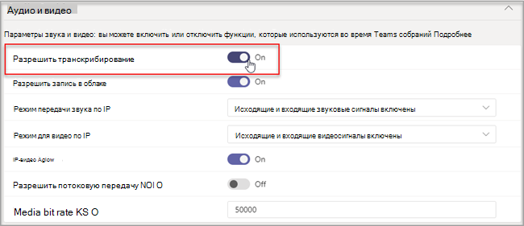

# Управление элементами управления технологиями распознавания речи для интеллектуального динамика

Интеллектуальный докладчик использует сведения о голосовом профиле для распознавания того, кто что говорит при транскрибации в реальном времени. Если Комнаты Microsoft Teams для Windows оснащен интеллектуальным докладчиком, во время собрания можно использовать динамическое транскрибирование. В этой статье объясняется, как администратор клиента управляет голосовым профилированием, которое используется для распознавания речи для создания динамического транскрибирования. Вы можете контролировать, в какой степени организация использует распознавание голоса, и следующие функции:

- Измените имя говорящего в расшифровке.
- Измените говорящего одного высказывания в расшифровке или измените его во всех высказываниях в расшифровке (но не в будущих расшифровок).
- Измените идентификацию говорящего для людей, перечисленных на собрании.
- Удалите идентификацию одного или нескольких речевых фрагментов, определенных как динамик, при каждой расшифровке.

## Проверка требований интеллектуального докладчика

Интеллектуальный динамик включает специальный массив из семи микрофонов. Система использует сведения о голосовом профиле для идентификации голосов до 10 человек в комнатах для собраний.

Ниже приведены требования к интеллектуальному динамику.

- В комнате для собраний должно быть не более 10 человек.
- В комнате для собраний есть ссылка для отправки не менее 7 Мбит/с.

Поддерживаются интеллектуальные динамики Epos, Sennheiser и Yealink.

> [!NOTE]
> Intelligent Speaker доступен во всех странах и регионах. Список [языков, поддерживаемых](#supported-locales) в настоящее время для биометрической регистрации и транскрибирования на собрании, см. в разделе "Поддерживаемые языковые стандарты".

## Настройка интеллектуального динамика

Интеллектуальный динамик подключается непосредственно с помощью USB к Комнаты Teams консоли.

> [!NOTE]
> Интеллектуальный динамик Yealink **должен использоваться** с консолью Yealink.

> [!NOTE]
> Мы не поддерживаем интеллектуальный динамик, подключенный к Logitech Surface Pro Комнаты Microsoft Teams. Существует известная проблема, Комнаты Teams не может распознать интеллектуальный динамик через док-станцию.

Интеллектуальный динамик должен находиться не менее 8 дюймов (20 см) от стен и больших объектов, таких как ноутбуки. Если USB-кабель интеллектуального динамика недостаточно длинный для настройки, используйте расширители кабеля.

1. Войдите в консоль с правами администратора.
2. Задайте Teams устройства в соответствии с микрофоном и динамиком интеллектуального динамика.
   Это также можно сделать на портале TAC, а не в консоли комнаты.

   На схеме показано, как интеллектуальный динамик подключается к устройству, если устройство содержит поле данных.

   

   На схеме показано, как интеллектуальный динамик подключается к устройству, если устройство не содержит поле данных.

   

> [!Note]
> Устройства EPOS и Yealink должны иметь префикс EPOS или Yealink и содержать "UAC2_RENDER" в имени говорящего и "UAC2_TEAMS" в имени микрофона. Если вы не найдете эти имена микрофона и динамика в раскрывающемся меню, перезапустите устройство intelligent Speaker.

## Включение распознавания пользователей интеллектуального говорящего

Данные профиля голосовой связи можно использовать в любом собрании с интеллектуальным докладчиком. Сведения [о параметрах собрания](../meetings-policies-recording-and-transcription.md#allow-transcription) см. в Teams политиках собраний и командлетах [собраний PowerShell](/powershell/module/skype/set-csteamsmeetingpolicy).

Данные голосового профиля пользователя создаются, когда политика настроена для различения или во время собрания выполняется пошаговое руководство по приглашению, не являющееся приглашением на собрание. Данные голосового профиля будут закрыты в конце собрания.

Ниже приведены политики, необходимые для настройки интеллектуального говорящего и распознавания пользователей.

|Политика|Описание|Значения и поведение|
|-|-|-|
|enrollUserOverride|Используется для настройки записи голосового профиля или регистрации в Teams параметров клиента. |**Отключено** <ul><li> Пользователи, которые никогда не регистрируются, не могут просматривать, регистрировать или повторно регистрироваться.<li>Точка входа в поток регистрации будет скрыта.<li>Если пользователи выбирают ссылку на страницу регистрации, они видят сообщение о том, что эта функция не включена для организации.  <li>Зарегистрированные пользователи могут просматривать и удалять свой профиль голоса в Teams параметрах. После удаления голосового профиля он не сможет просматривать, получать доступ к потоку регистрации или выполнять его.</li></ul> **Включено** <ul><li> Пользователи могут просматривать, получать доступ к потоку регистрации и выполнять его.<li>Точка входа будет отображаться на Teams параметров на вкладке **"Распознавание**".</li></ul>|
|roomAttributeUserOverride|Управление идентификацией пользователей на основе голоса в комнатах для собраний. Этот параметр требуется для Комнаты Teams учетных записей.| **Выкл** <ul><li>Устройство Комнаты Teams не будет отправлять из комнаты пропускную способность, экономя звуковые потоки. <li>Пользователи комнаты собраний не будут помечены и не различаются, а их голосовые подписи не будут извлечены или использованы.<li>Пользователи комнаты собраний неизвестны.</li></ul>  **Атрибут** <ul><li>Пользователи комнат будут иметь атрибуты в зависимости от состояния регистрации.<li>Зарегистрированные пользователи отображаются в транскрибирование с их именем.  <li>Пользователи, которые не зарегистрированы, отображаются в качестве докладчика \<n>.<li>Устройство Комнаты Teams отправит семь аудиопотоков из комнаты.</ul>  **Отличить**  <ul><li>Пользователи комнат будут различаться и разделяться как говорящего 1, говорящего 2, .... динамик \<n> в транскрибации.</li><li>Независимо от состояния регистрации пользователя, его имя не будет отображаться в транскрибации.</li><li>Устройство Комнаты Teams отправит семь аудиопотоков из комнаты.</li></ul>
|AllowTranscription|Требуется для учетных записей пользователей и Teams комнат.|**True** и **False**|
||||

В Teams администрирования задайте политику **транскрибирования**. Параметры **отключены** по умолчанию.

  
> [!NOTE]
> После назначения политики может потребоваться до 48 часов. Чтобы политика вступает в силу раньше, учетные записи должны быть выписались и снова вошли в систему.

## Вопросы и ответы

**Где хранятся данные голосового профиля?**

Данные профиля голосовой связи хранятся в Office 365 с содержимым пользователя.

**Что такое временная шкала хранения и политика?**

Общая политика хранения приведена в [обзоре хранения данных](/compliance/assurance/assurance-data-retention-deletion-and-destruction-overview). Кроме того, данные профиля голоса пользователя будут удалены через 1 год, если пользователь не приглашен на собрания с интеллектуальным докладчиком в течение этого 1-го года. Данные не используются ни на каких собраниях для существующих сотрудников. Если сотрудник покинул компанию, данные голосового профиля считаются пользовательским содержимым и обрабатываются как таковые в соответствии с политикой хранения Office 365 данных, описанной в обзоре хранения [данных](/compliance/assurance/assurance-data-retention-deletion-and-destruction-overview).

**Используются ли данные голосового профиля в службы Майкрософт?**

Нет, данные голосового профиля используются только для целей, для которых пользователь предоставил согласие. Корпорация Майкрософт не будет использовать данные профиля голоса, за исключением Teams сценариев распознавания речи.

Например, корпорация Майкрософт не будет использовать данные в следующих ситуациях:

**Используются ли данные профиля голоса при присоединении к собранию в другой организации?**

Не только на собраниях, организованных пользователем в вашей организации.

**Как экспортировать профиль голосовой связи?**

ИТ-администратор может экспортировать звуковые данные в любое время.

## Поддерживаемые языковые стандарты

Следующие языковые стандарты регистрации и транскрибирования на собрании поддерживаются во всех странах и регионах.

### Языковые стандарты регистрации

Конечные пользователи могут регистрировать свои голоса для распознавания в следующих языковых стандартах:

|**Язык**|**Страна или регион**|**Идентификатор языка и региональных параметров**|
|:-----|:-----|:-----|
|Английский    |Австралия   |en-AU    |
|Английский    |Канада    |en-CA   |
|Английский    |Индия    |en-IN    |
|Английский    |Новая Зеландия    |en-NZ    |
|Английский    |Соединенное Королевство    |en-GB    |
|Английский    |США    |en-US    |

### Языковые стандарты транскрибирования в собрании

После регистрации пользователя его голос можно распознать во время собраний и определить в транскрибации, если для собрания задан один из следующих языковых стандартов:

|**Язык**|**Страна или регион**|**Идентификатор языка и региональных параметров**|
|:-----|:-----|:-----|
|Китайский (упрощенное письмо)    |Китай    |zh-CN    |
|Английский    |Австралия   |en-AU    |
|Английский    |Канада    |en-CA   |
|Английский    |Индия    |en-IN    |
|Английский    |Новая Зеландия    |en-NZ    |
|Английский    |Соединенное Королевство    |en-GB    |
|Английский    |США    |en-US    |
|Французский    |Канада    |fr-CA    |
|Французский    |Франция    |fr-FR    |
|Немецкий    |Германия    |de-DE    |
|Итальянский    |Италия    | it-IT   |
|Японский    |Япония    |ja-JP    |
|Корейский    |Корея    |ko-KR    |
|Португальский    |Бразилия    |pt-BR    |
|Испанский    |Мексика    |es-MX    |
|Испанский    |Испания    |es-ES    |

## Статьи по теме

[Статья о поддержке. Использование интеллектуальных докладчиков для идентификации участников в комнате ](https://support.microsoft.com/office/use-teams-intelligent-speakers-to-identify-in-room-participants-in-meeting-transcription-a075d6c0-30b3-44b9-b218-556a87fadc00)
