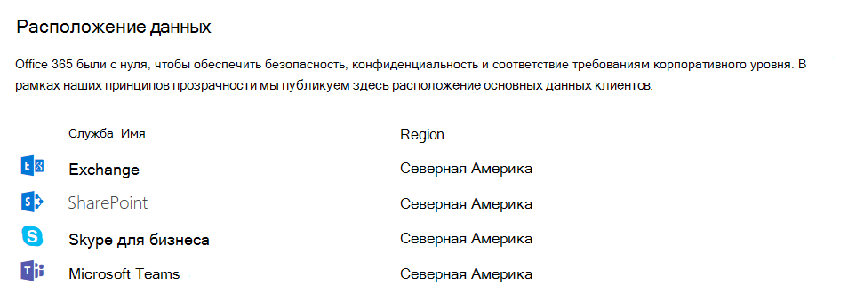

# Безопасность и соответствие требованиям в Microsoft Teams

> [!IMPORTANT]
> Дополнительные сведения о том, как обеспечить безопасность во время работы всех сотрудников дома во время заражения **COVID-19**, см. в следующих статьях:
>  - [Основные 12 задач для отделов обеспечения безопасности при поддержке работы из дома](/microsoft-365/security/top-security-tasks-for-remote-work)
>  - [Оптимизация подключения Microsoft 365 или Office 365 для удаленных пользователей с использованием раздельного VPN-туннелирования](/Office365/Enterprise/office-365-vpn-split-tunnel)
>  - Обновлено 2 апреля 2020 [г.: Teams безопасности](teams-security-guide.md)

Microsoft Teams на основе Microsoft 365 и Office 365 корпоративного уровня, что обеспечивает расширенные возможности безопасности и соответствия требованиям, которые ожидают наши клиенты. Чтобы получить дополнительные сведения о планировании безопасности в Microsoft 365 или [Office 365, рекомендуется](/microsoft-365/security/office-365-security/security-roadmap) начать с этой стратегии. Дополнительные сведения о планировании соответствия требованиям в Microsoft 365 или Office 365 можно начать с плана по обеспечению безопасности & [соответствии](/microsoft-365/compliance/plan-for-security-and-compliance) требованиям.

В этой статье содержатся дополнительные сведения Teams безопасности и соответствия требованиям. Не пропустите эти видеоролики Microsoft Mechanics о безопасности и соответствии требованиям:

- [Microsoft Teams базовый для ИТ: безопасность и соответствие](https://youtu.be/91lHNKVVvQ4) требованиям (12:42 мин)
- [Microsoft Teams безопасности и](https://www.youtube.com/watch?v=Km4T4hMM__k) соответствия требованиям (10:54 мин)

> [!IMPORTANT]
> Как клиент Microsoft 365 или Office 365 вы владеете данными и контролируете их. Корпорация Майкрософт не использует ваши данные для каких-либо целей, кроме предоставления службы, на которую вы подписаны. Как поставщик службы мы не сканируем электронную почту, документы и команды в рекламных или не связанных с обслуживанием целях. Корпорация Майкрософт не имеет доступа к отправленным содержимым. Как OneDrive и SharePoint в Microsoft 365, данные клиента остаются в клиенте. Дополнительные сведения о доверии и безопасности см. в Центре управления [безопасностью Майкрософт](https://microsoft.com/trustcenter). Teams следует тем же рекомендациям и принципам, что и Центр управления безопасностью Майкрософт.

## Безопасность

Teams обеспечивает двухфакторную проверку подлинности на уровне команды и всей организации, единый вход через Active Directory и шифрование передаваемых и неактивных данных. Файлы хранятся в SharePoint и шифруются с помощью него. Заметки хранятся в OneNote и шифруются с помощью него. Данные OneNote хранятся на сайте SharePoint группы. Вики-вкладку также можно использовать для создания заметок, а ее содержимое также хранится в группе SharePoint сайте.

[Ознакомьтесь с моделями](identify-models-authentication.md) удостоверений и проверкой подлинности, чтобы получить дополнительные сведения  о проверке подлинности и Teams, а также о том, как работает современная проверка подлинности, в частности, поможет современная проверка подлинности.

Так Teams работает в сотрудничестве с SharePoint, OneNote, Exchange и т. д., вам должно быть удобно управлять безопасностью в Microsoft 365 или Office 365 всех. Дополнительные сведения см. в статье о настройке Microsoft 365 или [Office 365 организации](/office365/securitycompliance/tenant-wide-setup-for-increased-security) для повышения безопасности.

> [!NOTE]
> В [настоящее время частные каналы](private-channels.md) поддерживают ограниченные функции безопасности и соответствия требованиям. Поддержка полного набора функций безопасности и соответствия требованиям в частных каналах ожидается в ближайшее время.

### Microsoft Defender для Office 365

Microsoft Defender для Office 365 доступны для Microsoft Teams, а также SharePoint и OneDrive, которые интегрируются с Teams для управления содержимым. Defender для Office 365 позволяет определить, является ли содержимое в этих приложениях вредоносным по своей природе, и заблокировать доступ пользователей к этому содержимому.

Управление затронутым содержимым после обнаружения зависит от параметров, выбранных в Microsoft 365 или Office 365. Мы настоятельно рекомендуем рассмотреть все приложения, когда речь идет о настройке Defender для Office 365, а для дальнейшего чтения общие сведения о том, как работают безопасные ссылки[,](/microsoft-365/security/office-365-security/safe-links?view=o365-worldwide) и инструкции по его настройке приведены здесь, чтобы получить подробные сведения для начала работы.

### Сейф ссылки в Microsoft Teams

Defender для Office 365 безопасные ссылки доступны в Microsoft Teams. Чтобы получить дополнительные сведения о безопасных ссылках и действиях с этой функцией, ознакомьтесь с параметрами безопасных ссылок [для Teams](/microsoft-365/security/office-365-security/safe-links?view=o365-worldwide). Сейф ссылки доступны как в Defender для Office 365 1, [так и в плане 2](/microsoft-365/security/office-365-security/overview?view=o365-worldwide).

### Сейф вложения

Сейф вложения — это функция, предназначенная для повышения безопасности пользователей путем проверки и обнаружения вредоносных вложений. Глобальные администраторы или администраторы  безопасности включите эту  функцию и создайте политики для обработки этих подозрительных вредоносных вложений, чтобы предотвратить их отправку пользователям, нажатие и выполнение действий.

Сейф вложения SharePoint, OneDrive, Microsoft Teams, Microsoft 365 или Office 365 в [Microsoft Defender для Office 365 План 1 и план 2](/microsoft-365/security/office-365-security/overview?view=o365-worldwide). Дополнительные сведения о Сейф вложениях и о том, как они могут помочь защитить вашу организацию, см. [в этой статье](/microsoft-365/security/office-365-security/set-up-safe-attachments-policies?view=o365-worldwide).

### Оценка безопасности

Оценка безопасности (Майкрософт) — это измерение состояния безопасности организации с более высоким числом, указывающим на дополнительные действия по улучшению. Его можно найти [в Центр безопасности Microsoft 365.](https://security.microsoft.com/securescore) Следуя рекомендациям по оценке безопасности, можно защитить организацию от угроз. С помощью централизованной панели мониторинга в Центр безопасности Microsoft 365 организации могут отслеживать и работать над безопасностью Microsoft 365 удостоверений, приложений и устройств. Microsoft Teams теперь есть рекомендации по оценке безопасности, и администраторам рекомендуется отслеживать их безопасность на платформе.

Оценка безопасности помогает организациям:
- Отчет о текущем состоянии состояния безопасности организации.
- Повышение уровня безопасности за счет обеспечения возможности обнаружения, видимости, рекомендаций и контроля.
- Сравнение с тестами производительности и установка ключевых показателей эффективности(KPI).

### Как политики условного доступа работают для Teams

Microsoft Teams использует Exchange Online, SharePoint и Skype для бизнеса Online для основных сценариев повышения производительности, таких как собрания, календари, чаты взаимодействия и общий доступ к файлам. Политики условного доступа, задаваемые для этих облачных приложений, применяются Microsoft Teams при непосредственном входе пользователя Microsoft Teams на любом клиенте.

Microsoft Teams поддерживается отдельно как облачное приложение в Azure Active Directory политик условного доступа. Политики условного доступа, задаваемые для Microsoft Teams, применяются Microsoft Teams при входе пользователя. Однако без правильных политик для других приложений, таких как Exchange Online и SharePoint, пользователи могут по-прежнему иметь доступ к этим ресурсам напрямую. Дополнительные сведения о настройке политики условного доступа в портал Azure см. в Azure Active Directory [руководстве](/azure/active-directory/active-directory-conditional-access-azure-portal-get-started).

Microsoft Teams классические клиенты Windows и Mac поддерживают современную проверку подлинности. Современная проверка подлинности обеспечивает вход на основе библиотеки Azure Active Directory проверки подлинности (ADAL) для Microsoft Office клиентских приложений на разных платформах.

Microsoft Teams классическим приложением поддерживает AppLocker.  Дополнительные сведения о предварительных требованиях AppLocker см. в разделе "Требования к использованию [AppLocker"](/windows/security/threat-protection/windows-defender-application-control/applocker/requirements-to-use-applocker).

## Соответствие требованиям

Teams содержит широкий спектр сведений, которые помогут вам в обеспечении соответствия требованиям, включая соответствие требованиям к обмену данными для каналов, чатов и вложений, политики хранения, защиту от потери данных (DLP), обнаружение электронных данных и удержание по юридическим причинам для каналов, чатов и файлов, поиск по журналам аудита, а также управление мобильными приложениями с помощью Microsoft Intune. Мы предоставили некоторые сведения по всем этим темам ниже, и вы можете перейти к [Центр соответствия требованиям Microsoft 365 для управления](https://compliance.microsoft.com) этими параметрами.

### Информационные барьеры

Информационные барьеры Microsoft Purview — это политики, которые администраторы Teams применяют, чтобы запретить пользователям или группам взаимодействовать друг с другом (если бизнес-необходимость в этом нет, или нормативные причины для их блокировки), а также позволяет задавать политики, связанные с такими действиями, как поиск и обнаружение электронных данных (см. ниже). Эти политики могут влиять на пользователей в чатах 1:1, групповых чатах или на уровне команды. Функция информационного барьера доступна в общедоступном облаке, и начиная с января 2021 г. она была развернута в GCC облаке.

Дополнительные сведения по этой теме см. в разделе "[Информационные барьеры" Microsoft Teams](information-barriers-in-teams.md).

### Соответствие требованиям к обмену данными

Соответствие требованиям к обмену данными в Microsoft Purview позволяет добавлять пользователей в политики в области, которые можно настроить для проверки сообщений Microsoft Teams на оскорбительную лексику, конфиденциальную информацию и информацию, связанную с внутренними и нормативными стандартами. Сообщения чата и связанные вложения в общедоступных и частных каналах Teams, отдельных чатах и вложениях можно проверять, чтобы свести к минимуму риски связи в организации. Дополнительные сведения о том, как настроить политики, помогающие обнаруживать, записывать и принимать меры для недопустимых Teams связи, см. в статье "Сведения о соответствии требованиям к обмену [данными"](/microsoft-365/compliance/communication-compliance).

### Метки конфиденциальности

[Примените метки конфиденциальности](/microsoft-365/compliance/sensitivity-labels) для защиты и регулирования доступа к конфиденциальному контенту организации, созданному во время совместной работы в командах. Например, примените метки, которые настраивают конфиденциальность (общедоступную или частную) команд, управляют гостевым доступом и внешним общим доступом, а также управляют доступом с неуправляемых устройств. Дополнительные сведения см. в [разделе "Метки конфиденциальности" Microsoft Teams](sensitivity-labels.md).

### Защита от потери данных Microsoft Purview (DLP)

Защита от потери данных (DLP) в Microsoft Teams, а также более крупная история защиты от потери данных для Microsoft Purview, связана с готовностью бизнеса к защите конфиденциальных документов и данных. Независимо от того, есть ли у вас проблемы с конфиденциальной информацией в сообщениях или документах, политики защиты от потери данных помогут пользователям не предоставлять доступ к этим конфиденциальным данным неправильным людям.

Сведения о защите от потери данных в Teams см[. в Microsoft Teams](/microsoft-365/compliance/dlp-microsoft-teams). Хорошая статья для защиты от потери данных — сведения [о защите от потери данных](/microsoft-365/compliance/dlp-learn-about-dlp).

### Ключ клиента

Microsoft 365 предоставляет дополнительный уровень шифрования поверх шифрования службы для содержимого. Используя ключи, которые вы предоставляете, ключ клиента шифрует несколько различных типов данных в Microsoft Teams. С помощью ключа клиента на уровне приложения ключ клиента шифрует Teams, хранящиеся в SharePoint Online. Дополнительные сведения см [. в разделе "Шифрование службы с помощью ключа клиента Microsoft Purview"](/microsoft-365/compliance/customer-key-overview).

Используя ключ клиента на уровне клиента, ключ клиента шифрует:
- Teams чата (чаты 1:1, групповые чаты, чаты собраний и беседы каналов)
- Teams мультимедиа (изображения, фрагменты кода, видео и вики-изображения)
- Teams и записи собраний, хранящиеся в Teams хранения
- Teams чата
- Teams чата по Кортана
- Teams сообщений о состоянии

Дополнительные сведения см.  в обзоре ключа клиента на уровне клиента и в блоге Microsoft Teams, в котором рассматривается поддержка ключа клиента для Microsoft Teams в общедоступной [предварительной версии](https://techcommunity.microsoft.com/t5/microsoft-teams-blog/customer-key-support-for-microsoft-teams-now-in-public-preview/ba-p/1999893). Сведения о выпуске Microsoft Information Protection, включив ключ клиента на уровне клиента, см. в Microsoft Information Protection о новых возможностях для получения сведений и защиты [конфиденциальных данных](https://techcommunity.microsoft.com/t5/microsoft-security-and/announcing-new-microsoft-information-protection-capabilities-to/ba-p/1999692).

### Политики хранения

Политики хранения в Microsoft Teams позволяют хранить данные, важные для вашей организации, в соответствии с нормативными, юридическими, деловыми или другими причинами, а также удалять содержимое и сообщения, которые не имеют отношения к хранении. Вы также можете использовать политики хранения для хранения данных в течение определенного периода времени, а затем удалить их. Дополнительные сведения см[. в политиках хранения в Microsoft Teams](retention-policies.md).

### Обнаружение электронных данных

Обнаружение электронных данных (eDiscovery) — это электронный аспект идентификации, сбора и создания электронно хранимой информации (ESI) в ответ на запрос рабочей среды в деле или расследовании. К ним относятся управление регистром, сохранение, поиск, анализ и экспорт Teams данных. К ним относятся чат, обмен сообщениями и файлы, сводки по собраниям и звонкам. Для Teams собраний и звонков создается сводка событий, произошедших во время собрания и звонка, и она доступна в службе обнаружения электронных данных.

Дополнительные сведения об использовании средств обнаружения электронных данных на портале соответствия требованиям Microsoft Purview для поиска Teams содержимого см. по следующим ссылкам:

- [Обнаружение электронных данных](/microsoft-365/compliance/manage-legal-investigations)

- [Поиск контента](/microsoft-365/compliance/search-for-content)

У нас есть Teams для получения дополнительных сведений в статье "Проведение исследования электронных данных о содержимом в Microsoft Teams["](eDiscovery-investigation.md).

Клиенты могут использовать обнаружение электронных данных или [обнаружение электронных данных (Premium)](/microsoft-365/compliance/office-365-advanced-ediscovery) в соответствии со своими требованиями. Разница между двумя этими подходами описана в следующей таблице:

|&nbsp; |Обнаружение электронных данных  |обнаружение электронных данных (Premium)  |
|---------|---------|---------|
|Управление обращениями     |X        |X         |
|Управление доступом  |X         |X         |
|Поиск контента     |X         | X        |
|Удержания   |X         | X        |
|Экспорт     |X         |X         |
|Обнаружение дублирования     |-         |X         |
|Поиск с сортировкой по релевантности с использованием машинного обучения    |-         |X         |
|Анализ неструктурированных данных      |-         |X         |

### Удержание по юридическим причинам

Во время судебного разбирательства может потребоваться, чтобы все данные, связанные с пользователем (хранителям) или командой, были сохранены как неизменяемые, чтобы их можно было использовать в качестве свидетельства для дела. Это можно сделать, поместив пользователя (почтовый ящик пользователя) или команду на удержание по юридическим причинам. Для удержания по юридическим причинам почтовый ящик команды можно разместить на следующих удержаниях:

- In-Place удержания (подмножество почтового ящика или семейства веб-сайтов через целевые запросы или отфильтрованное содержимое помещается на удержание) или
- Хранение для судебного разбирательства (весь почтовый ящик или семейство веб-сайтов помещается на удержание).

В любом случае после установки удержания гарантируется, что даже если конечные пользователи удаляют или редактируются сообщения каналов, которые находятся в почтовом ящике группы, неизменяемые копии этого содержимого сохраняются и доступны с помощью поиска по обнаружению электронных данных. Удержания по юридическим причинам обычно применяются в контексте дела обнаружения электронных данных.

Дополнительные [сведения о](/microsoft-365/compliance/retention-policies) политиках хранения см. на портале соответствия Требованиям Microsoft Purview. Чтобы получить Teams сведения о удержании по юридическим причинам, мы также настроим Microsoft Teams или команду на удержание по юридическим причинам, чтобы вы узнали больше.

### Поиск контента

Поиск контента можно использовать для поиска всех Teams с помощью расширенных возможностей фильтрации. Полученные данные можно экспортировать в определенный контейнер для обеспечения соответствия требованиям и судебного разбирательства. Это можно сделать как с инцидентом обнаружения электронных данных, так и без него. Это позволяет администраторам соответствия требованиям собирать Teams всем пользователям, просматривать и экспортировать их для дальнейшей обработки. Дополнительные сведения  о том, как выполнять поиск контента соответствия для Microsoft Teams и других Microsoft 365 или Office 365 на портале соответствия требованиям Microsoft Purview, см. в разделе "Поиск контента".

> [!TIP]
> При необходимости с помощью поиска контента можно отфильтровать только Microsoft Teams, например сообщения чата и каналов, собрания и звонки.

Если вы хотите получить дополнительные Teams сведения о настройке поиска контента, просмотрите поиск контента в [Microsoft Teams.](content-search.md)

### Аудит

Поиск по журналам аудита подключается непосредственно к порталу соответствия Требованиям Microsoft Purview и позволяет настраивать оповещения, а также создавать отчеты о событиях аудита, разрешая экспорт определенных или универсальных наборов событий рабочей нагрузки для администрирования и исследования на неограниченной временной шкале аудита. Вы можете настроить оповещения для всех данных журнала аудита на портале соответствия требованиям Microsoft Purview, а также отфильтровать и экспортировать эти данные для дальнейшего анализа. Дополнительные сведения о поиске событий Microsoft Teams на портале соответствия требованиям Microsoft Purview см. в журнале аудита для событий в [Microsoft Teams.](audit-log-events.md)

## Конфиденциальность

В корпорации Майкрософт защита ваших данных является нашим наивысшим приоритетом. Дополнительные сведения о наших рекомендациях по обеспечению конфиденциальности см. в статье:  

- [Конфиденциальность в Корпорации Майкрософт](https://www.microsoft.com/trust-center/privacy)
- [Наши обязательства по обеспечению конфиденциальности и безопасности в Microsoft Teams](https://www.microsoft.com/en-us/microsoft-365/blog/2020/04/06/microsofts-commitment-privacy-security-microsoft-teams/)
- [Для ИТ-специалистов: конфиденциальность и безопасность в Microsoft Teams](https://www.microsoft.com/en-us/microsoft-365/blog/2020/04/06/it-professionals-privacy-security-microsoft-teams/#:~:text=We%20safeguard%20your%20privacy%20by,and%20distribution%20of%20your%20data.)

## Information Protection архитектуры

На следующем рисунке показан поток приема данных Teams в Exchange и SharePoint для Teams файлов и сообщений.

> [!div class="mx-imgBorder"]
> 

На следующем рисунке показан поток приема Teams собраний и вызовов данных для Exchange.

> [!div class="mx-imgBorder"]
> 

> [!IMPORTANT]
> Обнаружение Teams может занять до 24 часов.

## Лицензирование

Если речь идет о возможностях защиты информации, Microsoft 365 подписки, Office 365 подписки и связанные с ними автономные лицензии определяют доступный набор функций.

Сведения об определении требований лицензирования для реализации функций безопасности и соответствия требованиям см. в разделе  о требованиях к лицензированию для функций обеспечения безопасности и соответствия требованиям.

> [!NOTE]
> Для работы поиска контента, обнаружения электронных данных (стандартная версия) и обнаружения электронных данных (Premium) не требуется включить на портале соответствия требованиям Microsoft Purview. Дополнительные сведения см[. в Microsoft 365 решениях для обнаружения электронных данных](/microsoft-365/compliance/ediscovery).

## Расположение данных в Teams

Данные Teams располагаются в географическом регионе, связанном с организацией Microsoft 365 или Office 365. Чтобы узнать, какие регионы поддерживаются в настоящее время, ознакомьтесь с [расположением данных в Microsoft Teams](location-of-data-in-teams.md).

Если вам нужно узнать, в каком регионе находятся данные для вашего клиента,  >  перейдите к Центр администрирования Microsoft 365 **Параметры** >  **упорядочению**. Прокрутите вниз до раздела **Расположение данных**.

> [!div class="mx-imgBorder"]
> 

## Стандарты соответствия

Teams использует следующие стандарты: [ISO 27001](/microsoft-365/compliance/offering-iso-27001), [ISO 27018](/microsoft-365/compliance/offering-iso-27018), [SSAE18 SOC 1 и SOC 2](/microsoft-365/compliance/offering-soc), [HIPAA](/microsoft-365/compliance/offering-hipaa-hitech) и [EU Model Clauses (EUMC).](/microsoft-365/compliance/offering-eu-model-clauses) В рамках платформы соответствия требованиям Майкрософт корпорация Майкрософт классифицирует Microsoft 365 и Office 365 приложения и службы по четырем категориям. Каждая категория определяется определенными обязательствами по соответствию требованиям, которые должны быть выполнены для службы Microsoft 365, Office 365 или связанной службы Майкрософт, которая будет указана в этой категории.

Подробные сведения можно найти в [ресурсах защиты данных](https://servicetrust.microsoft.com/ViewPage/TrustDocumentsV3?command=Download&downloadType=Document&downloadId=b7d05b86-c69b-41ba-8245-21161b9febf9&tab=7f51cb60-3d6c-11e9-b2af-7bb9f5d2d913&docTab=7f51cb60-3d6c-11e9-b2af-7bb9f5d2d913_Compliance_Guides). Teams также обеспечивает соответствие нормам Cloud Security Alliance.

## Статьи по теме

[Microsoft 365 безопасности](/microsoft-365/security/)

[Microsoft 365 соответствия](/microsoft-365/compliance/)

[Предложения майкрософт по соответствию требованиям](/microsoft-365/compliance/offering-home)
