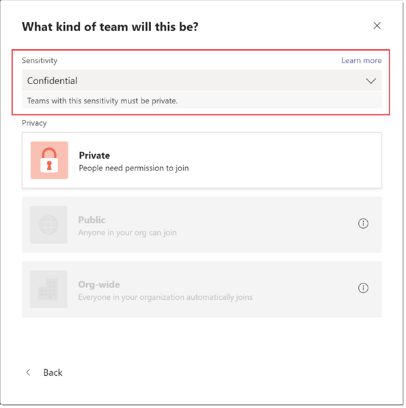

# Метки конфиденциальности для Microsoft Teams

[Метки конфиденциальности позволяют](/microsoft-365/compliance/sensitivity-labels) администраторам Teams защищать и регулировать доступ к конфиденциальному контенту организации, созданному во время совместной работы в командах. После настройки меток конфиденциальности в связанных с ними политиках в Центре соответствия требованиям Майкрософт [эти](/microsoft-365/compliance/go-to-the-securitycompliance-center)метки можно применять к командам в организации.

Метки конфиденциальности в настоящее время неподтверчены для клиентов, использующих skUs Teams для образования. Дополнительные информацию о лицензировании см. в описании [службы Microsoft Teams.](/office365/servicedescriptions/teams-service-description)

## В чем разница между метами конфиденциальности и метами классификации Teams?

Метки конфиденциальности отличаются от меток классификации, также известных как классификация групп Azure AD. Метки классификации — это текстовые строки, которые можно связывать с группой Microsoft 365, но не связанные с ними фактические политики. Метки классификации используются как метаданные, а затем для применения политик необходимо использовать другие методы, например внутренние средства и сценарии.

Преимущество меток конфиденциальности состоит в том, что их политики автоматически применяются на основе сочетания платформы Microsoft 365 Groups, центра соответствия требованиям и служб Teams. Метки конфиденциальности обеспечивают мощную поддержку инфраструктуры для защиты конфиденциальных данных организации и обеспечения соответствия внутренним политикам или нормативным актам.

Если вы используете метки классификации, дополнительные сведения и инструкции по их переносу на метки конфиденциальности см. в следующей документации: классификация группы [Azure AD.](/microsoft-365/compliance/sensitivity-labels-teams-groups-sites#classic-azure-ad-group-classification)

## Примеры сценариев меток конфиденциальности

Примеры сценариев использования меток конфиденциальности в Teams в организации:

- [Настройка уровня конфиденциальности (открытого или закрытого) для команд](#set-the-privacy-level-for-teams)
- [Управление гостевом доступом к командам](#control-guest-access-to-teams)

### Настройка уровня конфиденциальности для команд

Вы можете создать и настроить метку конфиденциальности, которая при ее применении позволяет пользователям создавать команды с определенным параметром конфиденциальности (общедоступный или закрытый).

Например, вы создаете и публикуете метку конфиденциальности "Конфиденциально", которая имеет параметр конфиденциальности **"Частная".** Таким образом, любая команда, созданная с этой меткой, должна быть закрытой. 

Когда пользователь создает новую команду и  выбирает метку "Конфиденциально", для него доступен только параметр **конфиденциальности "Частное".** Другие параметры конфиденциальности, такие как "Общедоступный" и "Все организации", недоступны для выбора:

Кроме того, вы создаете и публикуете метку конфиденциальности "Общие", для параметра конфиденциальности метки которого задан параметр "Общеординированная".  Когда пользователь создает новую команду, он может создавать общедоступные и общедоступные команды для всей организации, только выбрав эту метку:

Когда группа будет создана, метка конфиденциальности будет видна в ее верхнем правом углу. Обратите внимание, что если вы используете иерархические родительские метки детей, такие как "Конфиденциально\Финансы", то в заглавном канале будет показываться только родительская метка.

Владелец команды может в любое время изменить метку конфиденциальности и параметр конфиденциальности команды, перейдите в команду и нажмите кнопку "Изменить **команду".**

### Управление гостевом доступом к командам

Метки конфиденциальности можно использовать для управления гостевом доступом к командам. Команды, созданные с меткой, которая не разрешает гостевой доступ, доступны только пользователям в вашей организации. Людей за пределами организации добавить в команду нельзя.

## Центр администрирования Microsoft Teams

Метки конфиденциальности можно применять при создании или редактировании группы в Центре администрирования Microsoft Teams. 

Метки конфиденциальности также видны в свойствах группы и  в столбце **"Классификация"** на странице "Управление командами" Центра администрирования Microsoft Teams.

## Ограничения

Прежде чем использовать метки конфиденциальности для Teams, следует помнить о следующих ограничениях:

- **Родительские имена не отображаются для подлябелей**
    
    Teams поддерживает подлябели, но не отображает имя родительской метки. Например, **"Конфиденциально** \\ **все сотрудники"** отображается как **"Все сотрудники".**

- **Метки конфиденциальности не поддерживаются API Teams Graph, командлетами PowerShell и шаблонами**
    
    Пользователи не смогут применять метки конфиденциальности к командам, созданным непосредственно с помощью API Teams Graph, командлетов Teams PowerShell и шаблонов Teams.

- **Поддержка частных каналов**
    
    Закрытые каналы, созданные в команде, наследуют метку конфиденциальности, примененную к группе. Та же метка автоматически применяется в коллекции веб-сайтов SharePoint для частного канала.
    
    Однако если пользователь изменяет метку конфиденциальности непосредственно на сайте SharePoint для частного канала, это изменение метки не отражается в клиенте Teams. В этом сценарии пользователи будут по-прежнему видеть исходную метку конфиденциальности, примененную к группе, в заглавном канале частного канала.

## Создание и настройка меток конфиденциальности для Teams

Чтобы создать и настроить метки конфиденциальности для Teams, воспользуйтесь инструкциями из документации Microsoft 365. 

- [Используйте метки конфиденциальности для защиты контента в Microsoft Teams, группах Microsoft 365 и на сайтах SharePoint.](/microsoft-365/compliance/sensitivity-labels-teams-groups-sites)