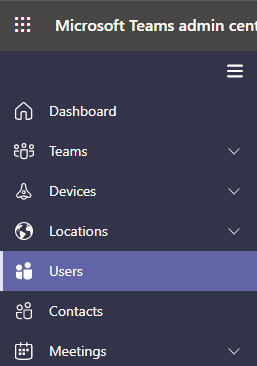

# Задание телефонных номеров, включаемых в приглашения, в Microsoft Teams

Аудиоконференции в Microsoft 365 и Office 365 позволяют пользователям в вашей организации создавать собрания Microsoft Teams, а затем разрешать пользователям выполнять вход на эти собрания по номеру телефона.

Мост конференц-связи предоставляет вашей организации ряд телефонных номеров для подключения. Все эти номера могут быть использованы для подключения к собраниям, созданным организаторами, однако вы можете выбрать, какие номера будут указаны в приглашениях на собрания.

В дополнение к номерам телефонов, включенным в приглашение на собрание для организатора собрания, в нижней части каждого приглашения на собрание есть ссылка, которая открывает полный список всех номеров телефонов с телефонным подключением, которые можно использовать для присоединения к собранию.

> [!NOTE]
> [!INCLUDE [updating-admin-interfaces](includes/updating-admin-interfaces.md)]

## Первоначальное назначение номеров телефонов, включенных в приглашения на собрание для пользователей

Номера телефонов, включенные в приглашения на собрания пользователей, для которых включена аудиоконференции, определяются в *назначенной пользователям политике TeamsAudioConferencingPolicy* . Когда *пользователю назначается TeamsAudioConferencingPolicy* , все платные и бесплатные телефонные номера, добавленные в политику, включаются в приглашения на собрания для пользователей с этой политикой. Если пользователю *назначена политика TeamsAudioConferencingPolicy* и в политику не добавлены платные или бесплатные телефонные номера, то в этом случае номера телефонов, отображаемые в приглашениях на собрание этих пользователей, определяются платным номером конференц-связи по умолчанию и телефонным номером конференц-связи по умолчанию в параметрах каждого отдельного пользователя.

> [!NOTE]
> Платные или бесплатные телефонные номера, добавленные в *TeamsAudioConferencingPolicy* пользователя, имеют приоритет над номерами телефонов, заданными по отдельности, используя платный номер конференц-связи по умолчанию и бесплатный номер конференц-связи по умолчанию в параметрах пользователя.

Как отмечалось выше, в дополнение к номерам телефонов каждое приглашение на собрание содержит ссылку, которая открывает полный список всех номеров телефонов с телефонным подключением, которые можно использовать для присоединения к заданному собранию.

> [!IMPORTANT]
> Отображение назначенных номеров телефонов в приглашении на собрание может занять до 24 часов. Если обновленные номера не отображаются, подождите по крайней мере 24 часа, прежде чем обращаться в службу поддержки.

### Новые пользователи

Платные и бесплатные номера телефонов, включенные в приглашения на собрания для новых пользователей, также определяются *командой TeamsAudioconferencingPolicy* , назначенной этим пользователям. По умолчанию всем новым пользователям назначается global *TeamsAudioconferencingPolicy*. В глобальной политике не добавлены номера телефонов (если администратор клиента не изменил их). В этом случае номера телефонов, которые включаются в приглашения пользователей, включенных для аудиоконференций, определяются платным номером конференц-связи по умолчанию и бесплатным номером конференц-связи по умолчанию, указанным в параметрах каждого пользователя.

Для нового пользователя платные номера конференц-связи по умолчанию назначаются на основе расположения использования, заданного в центре администрирования Microsoft 365 пользователя, если пользователь включен для службы аудиоконференций. Если в мосте конференции есть платный номер, соответствующий стране пользователя, этот номер будет автоматически назначен как платный номер пользователя по умолчанию. Если его нет, номер, определенный как платный номер моста конференции по умолчанию, будет назначен как платный номер пользователя по умолчанию.  

После включения службы аудиоконференций администратор клиента может изменить начальные значения по умолчанию для платных и бесплатных телефонных номеров пользователя.

## Установка или изменение номера телефона аудиоконференций по умолчанию для пользователей в PowerShell с помощью командлета *TeamsAudioConferencingPolicy*

См. [параметры политики аудиоконференций для платных и бесплатных номеров](audio-conferencing-toll-free-numbers-policy.md)

## Установка или изменение номера телефона аудиоконференций по умолчанию для организатора или пользователя собрания по отдельности

Вы должны быть администратором службы Teams, чтобы вносить эти изменения. Сведения о получении ролей и разрешений администратора см. в статье [Управление Teams с помощью ролей администратора Teams](./using-admin-roles.md).

1. Войдите в Центр администрирования Microsoft Teams.

2. В области навигации слева щелкните " **Пользователи"**.

    

3. Щелкните имя пользователя из списка доступных пользователей.

4. Рядом с пунктом **Аудиоконференции** нажмите **Изменить**.

    

5. Используйте поля **"Платный номер** " или **"** Бесплатный номер", чтобы ввести номера для пользователя.

> [!IMPORTANT]
> При изменении параметров аудиоконференций пользователя повторяющиеся и будущие собрания Microsoft Teams должны обновляться и отправляться участникам.

> [!NOTE]
> Номера телефонов, введенные в этом параметре, используются только в том случае, если назначенная пользователю *политика TeamsAudioConferencingPolicy* не имеет добавленных номеров телефонов.

## Хотите использовать Windows PowerShell

Windows PowerShell is all about managing users and what users are allowed or not allowed to do. С Windows PowerShell вы можете управлять Microsoft 365 или Office 365 с помощью единой точки администрирования, которая может упростить вашу ежедневную работу при наличии нескольких задач. Для начала работы с Windows PowerShell ознакомьтесь с приведенными ниже разделами.

- [Шесть причин использовать Windows PowerShell для управления Office 365](/microsoft-365/enterprise/why-you-need-to-use-microsoft-365-powershell)

- [Лучшие способы управления Microsoft 365 или Office 365 с помощью Windows PowerShell](/previous-versions//dn568025(v=technet.10))

Чтобы задать или изменить номер телефона по умолчанию для организатора собрания или пользователя с помощью [Microsoft Teams PowerShell](/powershell/module/teams/?view=teams-ps), **`ServiceNumber`** **`TollFreeServiceNumber`** задайте для командлета [Set-CsOnlineDialInConferencingUser](/powershell/module/skype/set-CsOnlineDialInConferencingUser?view=skype-ps) одно из доступных номеров или параметры.

## См. также

[Попробуйте или приобретите аудиоконференции в Microsoft 365 для Microsoft Teams](try-or-purchase-audio-conferencing-in-office-365-for-teams.md)

[Изменение номеров телефонов для моста аудиоконференций](change-the-phone-numbers-on-your-audio-conferencing-bridge.md)
