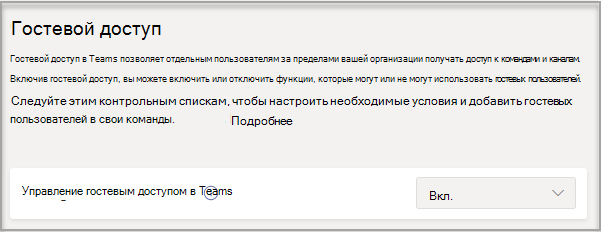
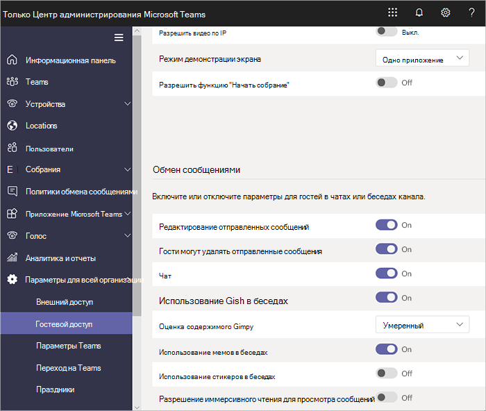

# Включение и отключение гостевого Microsoft Teams включите или отключите

В этой статье описывается настройка параметров гостевого доступа, включая звонки, собрания и чат, в Teams. Гостевой доступ в Teams также требует настройки других параметров в Microsoft 365, включая параметры в Azure AD, Группы Microsoft 365 и SharePoint. Если вы готовы начать приглашать гостей в команды, см. следующие статьи.

- Чтобы настроить гостевой доступ в Teams для общего использования, см. статью [Совместная работа с гостями в команде](/microsoft-365/solutions/collaborate-as-team).
- Чтобы совместно работать с организацией-партнером, использующей Azure Active Directory, и позволить гостям самостоятельно регистрироваться для получения гостевого доступа, см. статью [Создание экстрасети B2B с управляемыми гостями](/microsoft-365/solutions/b2b-extranet).

> [!NOTE]
> Если вы просто хотите найти людей из других организаций, позвонить им, пообщаться с ними в чате и провести с ними собрание, используйте [внешний доступ](manage-external-access.md).

## Настройка гостевого доступа в Центре администрирования Microsoft Teams

1. Войдите в [Центр администрирования Microsoft Teams](https://admin.teams.microsoft.com/).

2. Выберите **доступ** **UsersGuest** > .

3. Установите **"Разрешить гостевой доступ" Teams** "**В сети"**.

    

4. В **разделе "Звонки**", **"** Собрание" и  **"Обмен** сообщениями" выберите "Вкл." или "Выкл." для каждой возможности в зависимости от того, что вы хотите разрешить гостям.

      - **Приватные звонки**. **Включите** этот параметр, чтобы разрешить гостям одноранговые звонки.
      - **IP-видео** . **Включите** этот параметр, чтобы разрешить гостям использовать видео во время звонков и собраний.
      - **Режим общего доступа к** экрану — этот параметр управляет доступностью общего доступа к экрану для гостей.
          - Присвойте ему значение **Отключено**, чтобы запретить гостям демонстрировать свои экраны в Teams.
          - Присвойте ему значение **Одно приложение**, чтобы разрешить демонстрацию отдельных приложений.
          - Присвойте ему значение **Весь экран**, чтобы разрешить полную демонстрацию экрана.
      - **"Провести** собрание" — включите **этот параметр**, чтобы разрешить гостям использовать функцию "Провести собрание" в Microsoft Teams.
      - **Редактирование отправленных сообщений**. **Включите** этот параметр, чтобы разрешить гостям редактировать ранее отправленные сообщения.
      - **Удаление отправленных сообщений** . **Включите** этот параметр, чтобы разрешить гостям удалять отправленные ранее сообщения.
      - **Удаление чата** . **Включите** этот параметр, чтобы разрешить гостям удалять всю беседу в чате.
      - **Чат**. **Включите** этот параметр, чтобы предоставить гостям возможность использовать чат в Teams.
      - **Giphy в беседах** — включите **этот параметр** , чтобы разрешить гостям использовать Giphys в беседах. Giphy — это сетевая база данных и поисковая система, позволяющая пользователям искать и обмениваться анимированными GIF-файлами. Каждому Giphy присваивается рейтинг контента.
      - **Рейтинг контента Giphy**. Выберите рейтинг из раскрывающегося списка:
          - **Разрешить весь контент**. Гости смогут вставлять все Giphy в беседы, независимо от рейтинга контента.
          - **Умеренно**. Гости смогут вставлять Giphy в беседы, при этом будет применяться умеренное ограничение в отношении контента для взрослых. 
          - **Strict** — гости могут вставлять Giphys в чаты, но вставлять содержимое для взрослых будет запрещено.
      - **Мемы в беседах**— включите  этот параметр, чтобы разрешить гостям использовать мемы в беседах.
      - **Наклейки в беседах** — включите **этот параметр** , чтобы разрешить гостям использовать наклейки в беседах.
      - **Иммерсивное** средство чтения для сообщений. **Включите** этот параметр, чтобы разрешить гостям использовать иммерсивное средство чтения [в Teams](https://support.microsoft.com/topic/a700c0d0-bc53-4696-a94d-4fbc86ac7a9a).

    

5. Нажмите **Сохранить**.

## Отключение гостевого доступа

Если отключить гостевой доступ в Teams, существующие гости потеряют доступ к своей команде. Однако они не удаляются из команды. Они по-прежнему видны пользователям в команде и могут @упоминаться. Если снова включить гостевой доступ Teams, они получат доступ заново.

Если вы планируете оставить гостевой доступ отключенным, возможно, следует порекомендовать владельцам команд вручную удалить гостевые учетные записи из своих команд. Хотя у этих гостей нет доступа, наличие их учетных записей в команде может запутать других пользователей в команде.

## См. также

[Настройка безопасной совместной работы с помощью Microsoft 365](/microsoft-365/solutions/setup-secure-collaboration-with-teams)

[Блокировка гостей из определенной команды](/microsoft-365/solutions/per-group-guest-access)

[Set-CsTeamsClientConfiguration](/powershell/module/skype/set-csteamsclientconfiguration)
