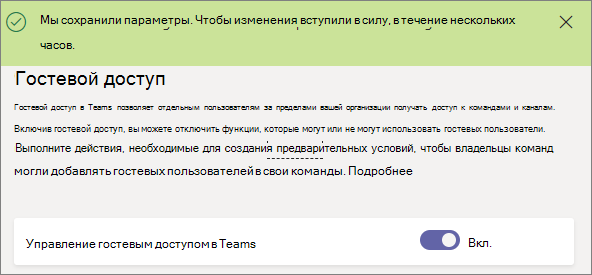

<a name="turn-on-or-off-guest-access-to-microsoft-teams"></a>Включение и отключение гостевого доступа для Microsoft Teams
======================================

Являясь администратором Office 365, вы должны включить функцию гостевого доступа, прежде чем вы или пользователи вашей организации (в частности, владельцы команд) смогут добавлять гостей. 

Параметры гостей задаются в Azure Active Directory. Чтобы эти изменения вступили в силу в рамках всей организации Office 365, требуется от 2 до 24 часов. Если появляется сообщение об «Обратитесь к администратору» при попытке добавить гостя в свои группы, вероятнее всего, что функция гостя не включена или параметры еще не эффективной.


> [!IMPORTANT]
> Чтобы полностью включить все возможности гостевого доступа, важно понять основную зависимость между Microsoft Teams, Azure Active Directory и Office 365. Дополнительные сведения см. в статье [Авторизация гостевого доступа в Microsoft Teams](Teams-dependencies.md).

## <a name="configure-guest-access-in-the-teams--skype-for-business-admin-center"></a>Настройка доступа к гостевой в группы & Скайп по центру администрирования бизнеса

1.  Войдите в группы & Скайп по центру администрирования бизнеса.

2.  Выберите пункт **Параметры масштабе организации** > **доступ в качестве гостя**.

3. Значение переключатель **Разрешить доступ гостя в группах Microsoft** **на**.

    

4.  Задайте переключение в разделе **вызов**, **собрания**и **системы обмена сообщениями** значение **включено** или **отключено**, в зависимости от функциональные возможности, которые необходимо разрешить пользователям гостевой.

    - **Выполнять вызовы частных** – включить этот параметр **на** разрешить Гости выполнять вызовы peer-to-peer.
    - **Разрешить IP-адрес видео** - включите этот параметр, этот параметр **на** разрешить Гости использование видео в их звонков и собрания.
    - **Совместное использование рабочего стола режим** — этот параметр управляет доступность общего доступа для пользователей гостевой экрана. 
       - Включите этот параметр, чтобы **отключено** , чтобы запретить для Гости для совместного использования их экранов в группах. 
       - Включите этот параметр, чтобы **одно приложение** , чтобы разрешить общий доступ к отдельным приложениям. 
       - Включите этот параметр, чтобы **весь экран** , чтобы разрешить общий доступ к завершена.
    - **Разрешить провести собрание** — включить этот параметр **на** разрешить Гости для использования функции провести собрание в группах Майкрософт.
    - **Правка отправленных сообщений** — включить этот параметр **на** разрешить Гости для изменения сообщений они ранее отправленных.
    - **Гости могут удалять отправленных сообщений** — включить этот параметр **на** разрешить Гости для удаления сообщений они ранее отправленных.
    - **Чата** — включите этот параметр, этот параметр **на** предоставление guests возможность использования чата в группах.
    - **Используйте Giphys в беседах** – включить этот параметр **на** позволяет использовать Giphys в беседах с гостевым. Giphy является online базы данных и модуль поиска, который позволяет пользователям выполнять поиск и совместное использование анимационной файлы в формате GIF. Каждый Giphy назначается оценки содержимого.
    - **Оценки содержимого Giphy** — Выбор оценки из раскрывающегося списка:
       - **Разрешать все содержимое** - Гости смогут для вставки всех Giphys в беседах, вне зависимости от оценки содержимого.
       - **Средняя** - Гости смогут вставлять Giphys в беседах, но будет средней полномочий на содержимое для взрослых.
       - **Строгий** – гостевым будет иметь возможность вставить Giphys в беседах, но будет строго полномочий на их вставка содержимое для взрослых.
    - **Используйте Memes в беседах** - включите этот параметр, этот параметр **на** разрешить использование Memes в беседах с гостевым.
    - **Использовать наклейки в беседах** – включить этот параметр **на** чтобы разрешить использование наклейки в беседах с гостевым. 


5.  Нажмите кнопку **Сохранить**.

## <a name="use-powershell-to-turn-guest-access-on-or-off"></a>Чтобы включить доступ в качестве гостя или отключить с помощью PowerShell

1.  Загрузить Скайп для модуля Business Online PowerShell изhttps://www.microsoft.com/en-us/download/details.aspx?id=39366
 
2.  Подключите сеанс PowerShell Скайп для бизнеса в Интернет конечной точки.

    ```
    Import-Module SkypeOnlineConnector
    $Cred = Get-Credential
    $CSSession = New-CsOnlineSession -Credential $Cred
    Import-PSSession -Session $CSSession
    ```
3.  Проверьте конфигурацию и, если `AllowGuestUser` — это `$False`, используйте командлет [Set-CsTeamsClientConfiguration](https://docs.microsoft.com/powershell/module/skype/set-csteamsclientconfiguration?view=skype-ps) Установка для `$True`.

    ```
    Get-CsTeamsClientConfiguration

    Identity                         : Global
    AllowEmailIntoChannel            : True
    RestrictedSenderList             :
    AllowDropBox                     : True
    AllowBox                         : True
    AllowGoogleDrive                 : True
    AllowShareFile                   : True
    AllowOrganizationTab             : True
    AllowSkypeBusinessInterop        : True
    AllowTBotProactiveMessaging      : False
    ContentPin                       : RequiredOutsideScheduleMeeting
    AllowResourceAccountSendMessage  : True
    ResourceAccountContentAccess     : NoAccess
    AllowGuestUser                   : True
    AllowScopedPeopleSearchandAccess : False
    
    Set-CsTeamsClientConfiguration -AllowGuestUser $True -Identity Global
    ```
Теперь можно создать гостевых пользователей в группах для вашей организации.

## <a name="more-information"></a>Подробная информация

В следующем видео для получения дополнительных сведений о доступ в качестве гостя.

|  |  |
|---------|---------|
| Добавление гостей в Microsoft Teams   | <iframe width="350" height="200" src="https://www.youtube.com/embed/1daMBDyBLZc" frameborder="0" allowfullscreen></iframe>   | 
