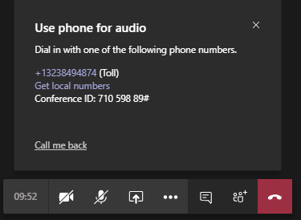

# Настройка функции "Позвонить мне" для пользователейSet up the Call me feature for your users

В Microsoft Teams функция " **позвонить мне** " дает пользователям возможность присоединиться к звуковой части собрания по телефону.In Microsoft Teams, the **Call me** feature gives users a way to join the audio portion of a meeting by phone. Это удобно в сценариях, если использование компьютера для звука может быть невозможным.This is handy in scenarios when using a computer for audio might not be possible. Пользователи получают звуковое сопровождение собрания с помощью сотового телефона или земли, а также части собрания, &mdash; например, если у другого участника собрания есть общий доступ к экрану или воспроизведение видео &mdash; через компьютер.Users get the audio portion of the meeting through their cell phone or land line and the content portion of the meeting&mdash;such as when another meeting participant shares their screen or plays a video&mdash;through their computer.

> [!IMPORTANT]
> 
> В течение периодов с большим объемом собраний, которые мы использовали в сочетании с COVID-19), мы рекомендуем пользователям присоединяться к собраниям, нажимая кнопку <strong>присоединиться</strong> к собранию, а не звонить с помощью номеров конференций PSTN или <strong>позвоните мне по телефону</strong>.During periods of high meeting volume (which we've been experiencing in conjunction with the COVID-19 outbreak), we recommend that users join meetings by clicking the <strong>Join Teams Meeting</strong> button rather than dialing in by using the PSTN conference numbers or by using <strong>Call me at</strong>. Это помогает обеспечить качественный звук во время, когда высокая громкость собрания вызывает перегрузку в сети ТСОП.This helps ensure quality audio during times when high meeting volume is causing congestion on the PSTN network. 

> [!IMPORTANT]
> Во время вспышки COVID-19 мы рекомендуем пользователям присоединяться к собраниям, нажимая кнопку **Присоединиться к собранию Teams**, а не звонить по номеру конференции ТСОП и не использовать функцию **Позвонить мне на номер**</strong>.During the duration of the COVID-19 outbreak, we recommend that users join meetings by clicking the **Join Teams Meeting** button rather than dialing in by using the PSTN conference numbers or by using **Call me at**</strong>. В основном это связано с нагрузкой на телефонную инфраструктуру в странах, пострадавших от эпидемии COVID-19.This is primarily because of congestion in the telephony infrastructures of countries impacted by COVID-19. Избегая звонков по ТСОП, вы повысите качество звука.By avoiding PSTN calls, you'll likely experience better audio quality. 

## Взаимодействие с пользователемThe user experience

### Присоединение к собранию с помощью телефона для звукового сопровожденияJoin a meeting by using phone for audio

Нажмите кнопку **присоединиться** , чтобы присоединиться к собранию, а затем на экране **выберите параметры звука и видео** нажмите кнопку **звук телефона** .Click **Join** to join a meeting, and then click **Phone audio** on the  **Choose your audio and video settings** screen. Отсюда пользователи могут звонить на собрание и присоединиться к ним или самостоятельно звонить в собрании.From here, users can have the meeting call and join them or dial in manually to the meeting.

**Присоединение к собранию Teams****Let the Teams meeting call**

На экране **использовать телефон для звука** пользователь вводит свой номер телефона, а затем щелкает " **позвонить мне**".On the **Use phone for audio** screen, the user enters their phone number, and then clicks **Call me**. Собрание вызывает пользователя и присоединяется к собранию.The meeting calls the user and joins them to the meeting.

**Ручной набор номера****Dial in manually**

Чтобы присоединиться к собранию, вы также можете набрать номер прямо так.Another way to join is to dial in directly to the meeting. На экране " **Использование телефона для звука** " нажмите кнопку " **набрать номер" вручную** , чтобы получить список номеров телефонов, которые нужно использовать для подключения к собранию.On the **Use phone for audio** screen, click **Dial in manually** to get a list of phone numbers to use to dial in to the meeting.

### Получение обратного вызова, когда что-то пошло не так со звуком во время собранияGet a call back when something goes wrong with audio during a meeting

При возникновении проблем со звуком при использовании компьютера во время собрания пользователь может легко переключиться на использование телефона для звукового сопровождения.If a user experiences audio issues when using their computer during a meeting, the user can easily switch to using their phone for audio. В Teams обнаружена проблема, связанная с аудио-или устройством, и перенаправляет пользователя на использование своего телефона, отображая параметр " **позвонить мне назад** ".Teams detects when an audio or device issue occurs and redirects the user to use their phone by displaying a **Call me back** option.

Вот пример сообщения и параметр " **обратная звонок мне** ", который отображается, когда команды не обнаруживают микрофон.Here's an example of the message and the **Call me back** option that's displayed when Teams doesn't detect a microphone.

Пользователь нажимает кнопку " **позвонить мне назад**", что приводит к экрану " **Использование телефона для звука** ".The user clicks **Call me back**, which brings up the **Use phone for audio** screen. В этой статье они могут ввести номер телефона, а также присоединиться к собранию или вручную войти в собрание.From here, they can enter their phone number and have the Teams meeting call and join them to the meeting or dial in manually to the meeting.

## Настройка функции "позвонить мне"Set up the Call me feature

Чтобы включить функцию "позвонить мне" для пользователей в вашей организации, необходимо настроить следующее:To enable the Call me feature for users in your organization, the following must be configured:

- Голосовая Конференция включена для пользователей в вашей организации, которые запланируют собрания (организаторов собраний).Audio Conferencing is enabled for users in your organization who schedule meetings (meeting organizers). Дополнительные сведения можно найти в разделе [Настройка голосовой конференции для Teams](set-up-audio-conferencing-in-teams.md) и [Управление параметрами голосовой конференции для пользователя в Teams](manage-the-audio-conferencing-settings-for-a-user-in-teams.md).To learn more, see [Set up Audio Conferencing for Teams](set-up-audio-conferencing-in-teams.md) and [Manage the Audio Conferencing settings for a user in Teams](manage-the-audio-conferencing-settings-for-a-user-in-teams.md).

- Пользователи могут звонить с собраний.Users can dial out from meetings. Дополнительные сведения можно найти в разделе [Управление параметрами голосовой конференции для пользователя в Teams](manage-the-audio-conferencing-settings-for-a-user-in-teams.md).To learn more, see [Manage the Audio Conferencing settings for a user in Teams](manage-the-audio-conferencing-settings-for-a-user-in-teams.md).

Если пользователь не набирает звонок из включенных собраний, функция " **позвонить мне** " недоступна, и пользователь не получит звонок, чтобы присоединиться к собранию.If a user doesn't have dial out from meetings enabled, the **Call me** option isn't available and the user won't receive a call to join them to the meeting. Вместо этого пользователь видит список номеров телефонов на экране " **Телефон** ", который можно использовать для подключения к собранию на телефоне вручную.Instead, the user sees a list of phone numbers on the **Use phone for audio** screen that they can use to dial in manually to the meeting on their phone.
