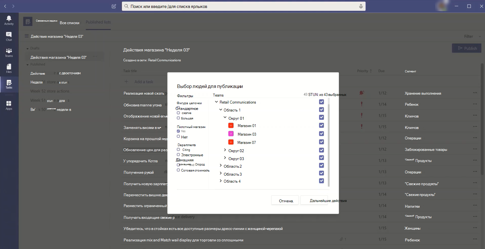

# <a name="set-up-your-team-targeting-hierarchy"></a>Настройка иерархии целей для команды

Настройка иерархии целевой группы позволит вашей организации публиковать контент в большом наборе команд. Иерархия целевых групп определяет, как все группы в иерархии связаны друг с другом, какие пользователи могут публиковать задачи и на какие группы у пользователей есть разрешения на публикацию. Функции публикации будут отключены для всех пользователей, если для вашей организации не настроена иерархия целевой группы. Чтобы настроить иерархию целевой группы, необходимо создать файл, определяющий ее, а затем добавить его в Teams, чтобы применить его к организации. После добавления схемы приложения в Teams могут использовать ее.

> [!IMPORTANT]
> В первом выпуске только приложение "Задачи" поддерживает иерархические группы.  Применение иерархии целевой группы к организации позволит публиковать [задачи](https://support.microsoft.com/office/publish-task-lists-to-create-and-track-work-in-your-organization-095409b3-f5af-40aa-9f9e-339b54e705df) в приложении "Задачи". Иерархия команд в других областях не будет Microsoft Teams.

Ниже представлен пример представления иерархии в приложении "Задачи" Teams. После создания списка задач участники группы публикации могут выбрать группы получателей для отправки (публикации) списка задач. При выборе команд команда публикации может фильтроваться по иерархии, атрибутам или сочетанию обеих команд.<br>



## <a name="terminology"></a>Терминологии

При навигации по иерархиям важно использовать следующие термины: Teams будут называться **узлами.**

* **Корневые узлы** — это верхние узлы в иерархии. В этом примере Retail Communications — это корневой узел.
* **Родительские и** **родительские узлы —** это термины, которые представляют связь между двумя подключенными узлами. В этом примере район 01 — это ребенок, узел области 1.
* Несколько уровней детей называются **потомками.** Район 01, Магазин 01, Магазин 03, Магазин 07, Район 02 и Район 03 — это все районы, которые являются частью 1.
* Узел без детей называется узлом **листа**. Они находятся в нижней части иерархии.
* **Группы получателей** — это группы, которые были выбраны для получения определенного набора содержимого для публикации. Это должны быть узлы с листами.

## <a name="plan-your-hierarchy"></a>Планирование иерархии

Перед созданием схемы, определяемой иерархией, необходимо спланить ее и решить, как вы хотите сформировать свою организацию.  Одним из первых приоритетов является выбор того, какие группы организации должны публиковать задачи в других группах. Каждый узел в иерархии представляет рабочую группу или группу.

### <a name="permissions-to-publish"></a>Разрешения на публикацию

Разрешение на публикацию зависит от того, является ли пользователь участником какой-либо команды в иерархии, а также от отношения этой команды или набора команд к другим командам в иерархии.

> [!NOTE]
> Владельцу группы также предоставлены разрешения на публикацию.

* Если пользователь является участником хотя бы одной команды, которая имеет в иерархии по крайней мере одного из ее потомков, этот пользователь может публиковать в них публикацию, не являясь участником всех команд, в которые он хочет опубликовать.
* Если пользователь является участником хотя бы одной команды в иерархии, но не является участником какой-либо группы с иерархией, он может видеть и получать опубликованное содержимое из своей организации.
* Если пользователь не является участником какой-либо команды в иерархии, он не будет видеть функции, связанные с публикацией.

### <a name="guidelines"></a>Руководящие принципы

* В организации может быть только один файл иерархии. Однако вы можете использовать разные части организации как отдельные иерархии узлов в одном файле. Например, у компании Contoso Pharmaceuticals есть корневый узел "Корневая сеть" и корневой узел Retail. Оба корневых узла имеют несколько строк корневых узлов, и между ними нет перекрытие.
* Получателями публикации могут быть только узлы с листами. Другие узлы в иерархии полезны для выбора получателей публикации.
* В иерархии команда может быть представлена только один раз.
* Иерархия может содержать до 15 000 узлов. Мы планируем вместе с клиентами повысить это ограничение для крупных организаций.

### <a name="example-hierarchy"></a>Пример иерархии

Например, в следующей иерархии команды "Отзыв", "Связь" и "Отдел кадров" могут публиковать задачи на всех нижних узлах (группах) в иерархии, но в северо-восточной зоне можно публиковать задачи только в командах Магазина Нью-Йорк и Магазина Москвы. Иерархия примера позволяет группам отзывов, сообщений и отдела кадров публиковать задачи, которые относятся к всей компании, например сведения о преимуществах или сообщения от директора. В северо-восточной зоне можно публиковать такие задачи, как планирование персонала, сведения о погоде и так далее, только в командах Магазина Нью-Йорк и Store.


## <a name="create-your-hierarchy"></a>Создание иерархии

> [!NOTE]
> В оставшейся части этой статьи обсуждается настройка иерархии группы в контексте публикации задач в командах получателей. Обзор [приложения](./manage-tasks-app.md) "Задачи", в котором при включенной функции Teams задач, можно найти в Teams в приложении "Задачи".

Схема, определяемая иерархией, основана на CSV-файле. Файл должен иметь формат UTF-8. Каждая строка в CSV-файле соответствует одному узлу в иерархии команд. В каждой строке содержится информация, которая содержит имя узла в иерархии, при желании связывает его с командой и атрибуты, которые можно использовать для фильтрации команд в приложениях, поддерживаюх эту функцию.

Вы также можете определить сегменты **,** которые являются категориями, которые группа публикации может использовать для организации контента, отправленного в группы получателей, чтобы упростить для них просмотр, сортировку и фокус на релевантном контенте.

### <a name="add-required-columns"></a>Добавление необходимых столбцов

CSV-файл должен содержать три столбца в следующем порядке, начиная с первого. Для получения задач узел должен быть связан с командой.

| Имя столбца   | Обязательно | Описание   |
----------------|----------|---------------|
| DisplayName    | Да      | Это поле называется узлом. Имя может содержать не более 100 символов и содержать только символы A-Z, a-z и 0–9. Имена узлов должны быть уникальными. |
| ParentName    | Да       | Это имя родительского узла. Это значение должно точно соответствовать значению в поле **DisplayName** родительского узла. Если вы хотите добавить несколько родительских узлов, разделите их имена точками с за semicolon (;). Вы можете добавить до 25 родительских узлов, а каждое имя родительского узла может иметь длину до 2500 символов. Узел может иметь несколько родительских узлов, только если родительские узлы являются корневыми узлами.   <br><br>**ВАЖНО!** Будьте осторожны, чтобы не создать цикл, в котором родительский узел выше в иерархии ссылается на child node lower in the hierarchy. Это не поддерживается. |
| TeamId        | Да, если группа публикует задачи или получает задачи из родительского узла       | Он содержит ИД группы, с ней нужно связать узел. Каждый узел должен ссылаться на уникальную команду, поэтому каждое значение TeamId может отображаться в файле иерархии только один раз. Чтобы получить ИД группы, с которая будет связывать узел, запустите следующую команду PowerShell: `Get-Team | Export-Csv TeamList.csv` . Эта команда содержит список команд в организации, а также имя и ИД каждой из них. Найдите имя команды, с командой, с которая будет связываться, а затем скопируйте в это поле ИД.|

> [!NOTE]
> Если узел не является корневым узлом или узлом листа и вам не требуется, чтобы члены группы предоставили соответствующие разрешения на публикацию и отчеты, вы можете оставить TeamId пустым. Этот метод можно использовать для более детального выбора команд получателей или просмотра отчетов о завершении без на то, чтобы у них не было соответствующей команды.

### <a name="add-attribute-columns"></a>Добавление столбцов атрибутов

После добавления трех необходимых столбцов можно добавить необязательные столбцы атрибутов. Эти атрибуты можно использовать для фильтрации узлов, чтобы можно было легко выбрать те из них, на которые вы хотите опубликовать задачи. Существует два способа определения атрибутов в зависимости от того, являются ли значения для этого атрибута взаимоисключающими.

|Способы добавления атрибутов|Описание |Пример  |
|---|---------|---------|
|Если значения атрибута являются взаимоисключающими, имя заемного столбца становится именем атрибута.|Каждая строка может содержать одно значение для этого атрибута, а каждый столбец атрибута может содержать до 50 уникальных значений. Каждое значение может иметь длину до 100 знаков. Набор значений атрибутов, которые вы указываете в столбце атрибута, будет отображаться в качестве значений фильтра для этого атрибута при выборе команд получателей с помощью иерархии целевой группы.|Вы хотите, чтобы пользователи могли фильтровать хранилища по макетам. Значения этого атрибута являются взаимоисключающими, так как магазин может иметь только один макет. <br><br>Чтобы добавить атрибут для фильтрации хранилищ по макету, добавьте столбец "Макет Магазина". В этом примере атрибут Store layout имеет такие значения: Сжатая, Стандартная и Большая.
|Если необходимо указать несколько значений для атрибута и они не являются взаимоисключающими, используйте формат **AttributeName:UniqueValue** для имен столбцов. <br><br>**ВАЖНО!** Используйте двоеточие только на английском языке (:) поскольку Юникод не поддерживается в качестве разных столбцов атрибутов. |Текстовая строка перед двоеточием (:) становится именем атрибута. Все столбцы, содержащие одинаковые текстовые строки перед двоеточиями (:) группуются в раздел в меню фильтрации. Каждая строка после двоеточия становится значениями для этого раздела.<br><br>Каждая строка может иметь значение 0 (ноль) или 1 для этого атрибута. Значение 0 означает, что атрибут не применяется к узлу, а значение 1 означает, что атрибут применяется к этому узлу.|Вы хотите, чтобы пользователи могли фильтровать хранилища по отделам. Магазин может иметь несколько отделов, поэтому значения этого атрибута не являются взаимоисключающими.<br><br>В этом примере мы добавляем столбцы атрибутов Departments:Платежная система, Departments:Electronics, Departments:Foods, Departments:Home and Garden, Departments:Goods. Отделы становятся именем атрибута, и пользователи могут фильтровать их по отделам "Товары", "Электронная бумага", "Еда", "Главная" и "Огород".|

При добавлении столбца атрибутов помните следующее:

* Имя столбца, которое вы указываете, или имя столбца, которое вы указываете перед двоеточием (:) становится именем атрибута. Это значение будет отображаться в Teams, которые используют иерархию.
* В иерархии может быть до 50 столбцов атрибутов.
* Имя столбца может содержать не более 100 символов и содержать только символы A-Z, a-z и 0–9, а также пробелы. Имена столбцов должны быть уникальными.

### <a name="add-bucket-columns"></a>Добавление столбцов сегмента

Вы можете добавить столбцы сегментов для создания сегментов, которые являются группировками, в которые можно организовать задачи. Каждый сегмент получает свой столбец в CSV-файле. Сегменты, которые вы создаете, доступны группе публикации. После этого команда публикации может классифицировать задачи для команд получателей с помощью этих сегментов. Если в группе еще нет сегмента, сегменты создаются по запросу при публикации задач.

Централизованно классифицируя элементы работы по одному, группа публикации может предварительно упорядоизировать список задач для всех десятков, сотен или тысяч команд получателей, которые получают список задач. Затем группы получателей могут сортировать и фильтровать свои задачи по сегментам, чтобы сосредоточиться на области, наиболее релевантной для их работы.

При добавлении столбца сегмента обратите внимание на следующее:

* Имя столбца становится именем сегмента. Каждый из них будет отображаться в списке Сегменты в Teams, которые используют иерархию.
* Не рекомендуется включать конфиденциальную информацию в названия сегментов. В настоящее время группы публикации не могут удалить сегмент путем публикации после его создания.
* Перед именем столбца должен быть хэштег (#). Оно может содержать не более 100 символов и содержать только символы A-Z, a-z и 0–9. Например, #Operations и #Frozen товары.
* Иерархия может содержать до 25 столбцов сегментов. Мы планируем вместе с клиентами увеличить это ограничение для крупных организаций.

### <a name="example"></a>Пример

Ниже показан пример CSV-файла схемы, который будет создан для поддержки иерархии, показанной на предыдущем изображении. Эта схема содержит следующие данные:

* Три необходимых столбца с `TargetName` `ParentName` именем , и `TeamId`
* Три столбца атрибутов `Store layout` с `Departments:Clothing` именем , и `Departments:Foods`
* Три столбца сегментов `Fresh Foods` с `Frozen Foods` именем , и `Women's Wear`

Атрибут `Store layout` содержит значения, которые включают `Compact` , `Standard` и `Large` . Для столбцов атрибута можно установить `Departments` значение `0` (ноль) или `1` . Макет и атрибуты не показаны `Store` на `Departments` рисунке выше. Они добавляются здесь, чтобы показать, как можно добавлять атрибуты в записи узла. То же самое относится и к трем столбцам сегментов.

```CSV
TargetName,ParentName,TeamId,Store layout,Departments:Clothing,Departments:Foods,#Fresh Foods,#Frozen Foods,#Women's Wear
Recall,,db23e6ba-04a6-412a-95e8-49e5b01943ba,,,,,,
Communications,,145399ce-a761-4843-a110-3077249037fc,,,,,,
HR,,125399ce-a761-4983-a125-3abc249037fc,,,,,,
East Regional Office,HR;Communications;Recall,,,,,,,
West Regional Office,HR;Communications;Recall,,,,,,,
Northeast Zone,East Regional Office,,,,,,,
Southeast Zone,East Regional Office,,,,,,,
New York Store,Northeast Zone,e2ba65f6-25e7-488b-b8f0-b8562d5de60a,Large,1,1,,,
Boston Store,Northeast Zone,0454f08a-0507-437c-969a-682eb2fae7fc,Standard,1,1,,,
Miami Store,Southeast Zone,619d6e4e-5f68-4b36-8e1f-16c98d7396c1,Compact,0,1,,,
New Orleans Store,Southeast Zone,6be960b8-72af-4561-a343-9ac4711874eb,Compact,0,1,,,
Seattle Store,West Regional Zone,487c0d20-4e55-4dc2-8187-a24c826e0fee,Standard,1,1,,,
Los Angeles Store,West Regional Zone,204a1287-2efb-4a8a-88e0-56fbaf5a2389,Large,1,1,,,
```

## <a name="apply-your-hierarchy"></a>Применение иерархии

> [!NOTE] 
> Для выполнения этого шага необходимо установить и использовать общедоступный предварительный модуль Teams PowerShell из коллекции PowerShell. Дополнительные действия по установке модуля см. в Teams PowerShell.

> [!NOTE]
> облако сообщества для государственных организаций (GCC) клиенты должны использовать предварительную версию [cmdlet 2.4.0](https://www.powershellgallery.com/packages/MicrosoftTeams/2.4.0-preview) или более поздней, чтобы обеспечить маршрутию данных в среду GCC, а не в облачную среду общего пользования.

Определив иерархию в CSV-файле схемы, вы можете отправить ее в Teams. Для этого запустите следующую команду: Для этого необходимо быть глобальным администратором или администратором Teams службы.

```powershell
Set-TeamTargetingHierarchy -FilePath "C:\ContosoTeamSchema.csv"
```

### <a name="update-your-hierarchy"></a>Обновление иерархии

Вы можете добавить новую иерархию, чтобы заменить старую с помощью той же команды PowerShell, что и выше. При каждом добавлении новой иерархии она заменяет предыдущую.

### <a name="check-the-status-of-your-hierarchy"></a>Проверка состояния иерархии

Чтобы проверить состояние отправки иерархии, можно выполнить следующую команду:

```powershell
Get-TeamTargetingHierarchyStatus
```

Команда возвращает следующие поля:

Поле|Описание
-----|------------
Id | Уникальный ИД для отправки.
Статус | Upload состояние. Значения: **"Пуск",** **"Проверка",** **"Успешно"** и **"Не удалось"**
ErrorDetails | Сведения об ошибке отправки. Дополнительные сведения об ошибках см. в разделе Устранение неполадок. Если ошибки нет, это поле пустое.
LastUpdatedAt | Timestamp and date of when the file was last updated.
LastModifiedBy | ИД последнего пользователя, который изменил файл.
FileName | Имя CSV-файла.

## <a name="remove-your-hierarchy"></a>Удаление иерархии

Если вы хотите немедленно  отключить вкладку Опубликованные списки для всех пользователей в организации, вы можете удалить иерархию. Пользователи не смогут получить  доступ к вкладке Опубликованные списки или к ее функциям.  Это включает возможность создавать новые списки задач для публикации, доступа к черновикам, публикации, от публикации и дублирования списков, а также просмотра отчетов. При удалении иерархии не удаляются опубликованные задачи. Эти задачи останутся доступными для команд получателей.

Чтобы удалить иерархию, запустите следующую команду: Для выполнения этого шага вы должны быть администратором.

```powershell
Remove-TeamTargetingHierarchy
```

При подтверждении удаления в сообщении о состоянии будет по-прежнему отображаться предыдущая схема, хотя при попытке удалить его снова возвращается ошибка, при этом объект имеет null.

## <a name="create-a-sample-hierarchy"></a>Создание примера иерархии

### <a name="install-the-teams-powershell-module"></a>Установка модуля Teams PowerShell

> [!IMPORTANT]
> Для выполнения этого шага необходимо установить и использовать общедоступный модуль Teams PowerShell из [коллекции PowerShell.](https://www.powershellgallery.com/packages/MicrosoftTeams/) Дополнительные действия по установке модуля см. в Teams [PowerShell.](teams-powershell-install.md)

### <a name="sample-script"></a>Пример сценария

Следующий сценарий можно использовать для создания команд и добавления файла .csv в Microsoft Teams клиента. Если у вас уже есть иерархия, сценарий заменит ее.

#### <a name="create-teams-for-a-simple-hierarchy"></a>Создание команд для простой иерархии

```powershell
$tm1 = New-Team -DisplayName "HQ"
$tm2 = New-Team -DisplayName "North"
$tm3 = New-Team -DisplayName "Store 1"
$tm4 = New-Team -DisplayName "Store 2"
$tm5 = New-Team -DisplayName "South"
$tm6 = New-Team -DisplayName "Store 3"
$tm7 = New-Team -DisplayName "Store 4"
```

#### <a name="use-team-data-to-create-comma-separated-output-displayname-parentname-teamid"></a>Использование данных группы для создания выходных данных, разделенных запятой (DisplayName, ParentName, TeamId)

```powershell
$csvOutput = "DisplayName" + "," + "ParentName" + "," + "TeamId" + "`n"
$csvOutput = $csvOutput + $tm1.DisplayName + "," + "," + $tm1.GroupID + "`n"
$csvOutput = $csvOutput + $tm2.DisplayName + "," + $tm1.DisplayName + "," + $tm2.GroupID + "`n"
$csvOutput = $csvOutput + $tm3.DisplayName + "," + $tm2.DisplayName + "," + $tm3.GroupID + "`n"
$csvOutput = $csvOutput + $tm4.DisplayName + "," + $tm2.DisplayName + "," + $tm4.GroupID + "`n"
$csvOutput = $csvOutput + $tm5.DisplayName + "," + $tm1.DisplayName + "," + $tm5.GroupID + "`n"
$csvOutput = $csvOutput + $tm6.DisplayName + "," + $tm5.DisplayName + "," + $tm6.GroupID + "`n"
$csvOutput = $csvOutput + $tm7.DisplayName + "," + $tm5.DisplayName + "," + $tm7.GroupID 
```

#### <a name="save-output-to-a-csv-file-in-the-downloads-folder"></a>Сохранение выходных данных в .csv в **папке** "Загрузки"

```powershell
$csvOutputPath = $env:USERPROFILE + "\downloads\testhierarchy-" + (Get-Date -Format "yyyy-MM-dd-hhmmss") + ".csv" 
$csvOutput | Out-File $csvOutputPath
```

#### <a name="upload-the-hierarchy"></a>Upload иерархию

```powershell
Set-TeamTargetingHierarchy -FilePath $csvOutputPath
Get-TeamTargetingHierarchyStatus
```

## <a name="troubleshooting"></a>Устранение неполадок

### <a name="how-to-view-error-details"></a>Просмотр сведений об ошибке

Чтобы понять, что вызывает ошибку, и получить сведения об ошибке, можно выполнить следующую команду:

```powershell
(Get-TeamTargetingHierarchyStatus).ErrorDetails.ErrorMessage
```

### <a name="you-receive-an-error-message-when-you-upload-your-schema-csv-file"></a>При отправке CSV-файла схемы вы получаете сообщение об ошибке

Обратите внимание на сообщение об ошибке, которое должно включать сведения об устранении неполадок, чтобы указать, почему не удалось отправить схему. Просмотрите и отредактйте CSV-файл схемы на основе сведений в сообщении об ошибке, а затем попробуйте еще раз.

### <a name="you-receive-an-error-invalidteamid-error-message-when-you-upload-your-schema-csv-file"></a>При отправке CSV-файла схемы вы получаете сообщение об ошибке "Ошибка: invalidTeamId"

При попытке отправить CSV-файл схемы вы получаете следующее сообщение об ошибке:

```console
Error: InvalidTeamId
Description: TeamID in row # doesn't match a valid Group ID. Please view our documentation to learn how to get the proper GroupID for each team.
```

Проверьте, правильно ли вы используете TeamId для команды в CSV-файле схемы. TeamId должен быть таким же, как и Microsoft 365 группы, которая является ее частью. Вы можете найти ИД группы в центре Microsoft Teams администраторов.

1. В левой области навигации центра [администрирования Microsoft Teams](https://admin.teams.microsoft.com/)перейдите **в** Teams Управление  >  **командами.**
2. Если **столбец "ИД** группы" не отображается  в таблице, выберите Изменить столбцы в правом верхнем углу таблицы и включив **ИД группы**.
3. Найдите группу в списке и найдите ее.

Убедитесь, что файл TeamId в CSV-файле схемы совпадает с ИД группы, который отображается в Microsoft Teams центре администрирования.

## <a name="related-topics"></a>Статьи по теме

* [Управление приложением "Задачи" для организации в Teams](manage-tasks-app.md)
* [Обзор PowerShell в Teams](teams-powershell-overview.md)
