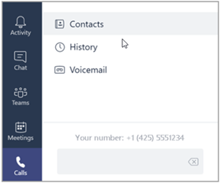

# Настройка телефонной системы в организацииSetting up Phone System in your organization

Ниже приведены пошаговые инструкции по настройке телефонной системы в Office 365.The following is a step-by-step guide for setting up Phone System in Office 365. Ссылки на дополнительные сведения, подробно описанные в конце каждого шага, можно найти по адресу.Links to additional, detailed information are available at the end of each step.

## Действие 1: Убедитесь в том, что телефонная система доступна в вашей стране или регионе.Step 1: Make sure that Phone System is available in your country or region

1.  Сначала перейдите в раздел " [страна и регион" для голосовой конференции и планов звонков](country-and-region-availability-for-audio-conferencing-and-calling-plans/country-and-region-availability-for-audio-conferencing-and-calling-plans.md)и выберите свою страну или регион в списке в верхней части страницы.First go to [Country and region availability for Audio Conferencing and Calling Plans](country-and-region-availability-for-audio-conferencing-and-calling-plans/country-and-region-availability-for-audio-conferencing-and-calling-plans.md), and select your country or region from the list at the top of the page. 
2.  В разделе **Телефонная система**ознакомьтесь со списком функций и подробными сведениями.Under **Phone System**, review the list of features and details. 
3.  Если телефонная система доступна, перейдите к действию 2.If Phone System is available, go to step 2. 

**Чтобы узнать больше о доступности региональных стандартов телефонной системы и видеоконференций, ознакомьтесь со статьей [доступность в стране и регионе для голосовой конференции и планов звонков](country-and-region-availability-for-audio-conferencing-and-calling-plans/country-and-region-availability-for-audio-conferencing-and-calling-plans.md).****To learn more about regional availability of Phone System and Audio Conferencing, see [Country and region availability for Audio Conferencing and Calling Plans](country-and-region-availability-for-audio-conferencing-and-calling-plans/country-and-region-availability-for-audio-conferencing-and-calling-plans.md).**

## Шаг 2: приобретение и назначение лицензий на телефонную систему и план звонковStep 2: Buy and assign Phone System and Calling Plan licenses

Чтобы назначить лицензии на телефонную систему и план звонков для одного пользователя, эти действия будут такими же, как назначение лицензии на Office 365.To assign a Phone System and Calling Plan license to a single user the steps are the same as assigning an Office 365 license. Ознакомьтесь с разделами [Назначение лицензий Microsoft Teams](assign-teams-licenses.md).See [Assign Microsoft Teams licenses](assign-teams-licenses.md). Если вы хотите выполнить массовое назначение нескольких пользователей, ознакомьтесь с разделами [Назначение лицензий Microsoft Teams](assign-teams-licenses.md).If you want to assign multiple users in bulk, see [Assign Microsoft Teams licenses](assign-teams-licenses.md).

## Шаг 3: получение телефонных номеров для пользователейStep 3: Get phone numbers for your users

[] Прежде чем настраивать возможности совершения и получения телефонных звонков для пользователей в организации, необходимо получить для них номера телефонов.Before you can set up users in your organization to make and receive phone calls, you must get phone numbers for them.

У вас есть три способа получить номера для пользователей:You have three ways of getting numbers for your users:
- Получить новые номера с помощью центра администрирования Skype для бизнеса.Get new numbers using the Skype for Business admin center.
- Получайте новые номера, недоступные в центре администрирования Skype для бизнеса.Get new numbers that aren't available in the Skype for Business admin center.
- Перенести или передать существующие номера от вашего текущего поставщика услуг или оператора телефонной связи в Office 365.Port or transfer your existing numbers from your current service provider or phone carrier to Office 365.

Необходимо воспользоваться страницей **Добавление новых пользовательских номеров** для просмотра, поиска, получения и резервирования этих номеров.You must use the **Add new user numbers** page to see, search, acquire, and reserve those numbers. Можно выполнить поиск по атрибутам Страна или регион, Область и Город, а затем ввести номера телефонов, которые потребуются для пользователей.You can search by Country/Region, State, and City, and then enter the number of phone numbers you will need for your users.

### Получение номеров телефонов для новых пользователейGet new user phone numbers 
 
 **с помощью центра администрирования Skype для бизнеса** **Using the Skype for Business admin center**

1. Войдите в Microsoft 365 с помощью своей рабочей или учебной учетной записи.Sign in to Microsoft 365 with your work or school account.

2. Перейдите в > **Skype для бизнеса**в **центре администрирования Microsoft 365**.Go to the **Microsoft 365 admin center** > **Skype for Business**.
    
3. На панели навигации слева перейдите к номерам **голосовых** > **телефонов**, нажмите кнопку **Добавить новый номер** , а затем выберите пункт **новые номера пользователей**.In the left navigation go to **Voice** > **Phone numbers**, click **Add new number** , and then click **New user numbers**.
    
### Получение новых номеров, недоступных в центре администрирования Skype для бизнесаGet new numbers that aren't available in the Skype for Business admin center
  
Иногда (в зависимости от страны или региона) вы не сможете получить новые номера с помощью центра администрирования Skype для бизнеса.Sometimes (depending on your country/region) you won't be able to get your new numbers using the Skype for Business admin center. В этом случае вам потребуется загрузить форму и отправить ее нам.In this case, you will need to download a form and send it back to us. Сведения о том, как запросить новый номер пользователя, можно найти в статье [Управление телефонными номерами в Организации](manage-phone-numbers-for-your-organization/manage-phone-numbers-for-your-organization.md) .See [Manage phone numbers for your organization](manage-phone-numbers-for-your-organization/manage-phone-numbers-for-your-organization.md) to learn how to request new user numbers.   
  
### Перенос номеров от вашего поставщика услуг или оператора телефонной связи.Port or transfer phone numbers from your service provider or phone carrier
  
- Если требуется 999 и менее телефонных номеров, можно использовать мастер **Заказ на перенос нового номера** в центре администрирования Skype для бизнеса.If you need 999 or fewer phone numbers for your users, you can use the **New Local Number Port Order** wizard in the Skype for Business admin center. Выполните действия, описанные в статье [Передача номеров телефонов в Office 365](transfer-phone-numbers-to-office-365.md) для переноса номеров телефонов в Skype для бизнеса Online.Follow the steps found in [Transfer phone numbers to Office 365](transfer-phone-numbers-to-office-365.md) to transfer your phone numbers over to Skype for Business Online.
    
- Если вам нужно перенести более 999 номеров телефонов, ознакомьтесь со статьей [Управление номерами телефонов для Организации](manage-phone-numbers-for-your-organization/manage-phone-numbers-for-your-organization.md) , чтобы отправить запрос на обслуживание по номеру или заказать все номера телефонов, перенесенные в Office 365.If you need to port more than 999 phone numbers, see [Manage phone numbers for your organization](manage-phone-numbers-for-your-organization/manage-phone-numbers-for-your-organization.md) to submit a port order service request or order to get all of these phone numbers ported over to Office 365. 

**Подробные сведения о том, как получить новые номера телефонов или перенести существующие номера, можно найти в разделе [Управление номерами телефонов для Организации](manage-phone-numbers-for-your-organization/manage-phone-numbers-for-your-organization.md).****For detailed information about getting new phone numbers or transferring existing numbers, see [Manage phone numbers for your organization](manage-phone-numbers-for-your-organization/manage-phone-numbers-for-your-organization.md).**

## Шаг 4: получение номеров служебных телефонов (звуковых конференций, очередей звонков, автосекретарей)Step 4: Get service phone numbers (audio conferencing, call queues, auto attendants)

Кроме того, чтобы получить доступ к номерам пользователей из Office 365, вы можете искать и получать платные и бесплатные телефонные номера для таких служб, как голосовые конференции (для мостов конференций), автосекретарей и очереди звонков (также называемые номерами служб).In addition to getting phone numbers for your users from Office 365, you can search and acquire toll or toll-free phone numbers for services such as audio conferencing (for conference bridges), auto attendants, and call queues (also called service numbers). Номера телефонов служб позволяют обслуживать большее число одновременных звонков по сравнению с абонентскими номерами.Service phone numbers have a higher concurrent calling capacity than user or subscriber phone numbers. Например, номер Услуги может обрабатывать большое количество звонков, в то время как телефонный номер пользователя может обрабатывать только несколько звонков одновременно.For example, a service number can handle 100s of calls simultaneously, whereas a user's phone number can only handle a few calls simultaneously.

### Получение новых номеров службGet new service numbers

 **с помощью центра администрирования Skype для бизнеса** **Using the Skype for Business admin center**

1. Войдите в Office 365 под своей учебной или рабочей учетной записью.Sign in to Office 365 with your work or school account.

2. Перейдите в > **Skype для бизнеса**в **центре администрирования Microsoft 365**.Go to the **Microsoft 365 admin center** > **Skype for Business**.

3. На левой панели навигации выберите \*\*\*\* > **номера** > телефонов,**Введите новый номер**, а затем нажмите кнопку **новые номера служб**.In the left navigation go to **Voice** > **Phone numbers** > **Add new number**, and then click **New service numbers**.

    > [!IMPORTANT]
    > Для просмотра параметров **голоса** на левой панели навигации в центре администрирования Skype для бизнеса вы должны сначала приобрести хотя бы одну **лицензию**на корпоративную, одну лицензию на надстройку \*\*\*\* или лицензию для **голосовой конференции** .For you to see the **Voice** option in the left navigation in the Skype for Business admin center, you must first buy at least one **Enterprise E5 license**, one **Phone System** add-on license, or one **Audio Conferencing** add-on license.

### Получение новых номеров, недоступных в центре администрирования Skype для бизнесаGet new numbers that aren't available in the Skype for Business admin center
  
Иногда (в зависимости от страны или региона) вы не сможете получить новые номера с помощью центра администрирования Skype для бизнеса.Sometimes (depending on your country/region) you won't be able to get your new numbers using the Skype for Business admin center. В этом случае вам потребуется загрузить форму и отправить ее нам.In this case, you will need to download a form and send it back to us. Сведения о том, как запросить новые номера, можно найти в статье [Управление телефонными номерами в Организации](manage-phone-numbers-for-your-organization/manage-phone-numbers-for-your-organization.md) .See [Manage phone numbers for your organization](manage-phone-numbers-for-your-organization/manage-phone-numbers-for-your-organization.md) to learn how to request new numbers. 

### Перенос существующих номеров службPort or transfer existing service numbers

Если вы хотите передать служебные номера от вашего текущего поставщика услуг или оператора связи, вам необходимо вручную отправить заказ на перенос номеров в Майкрософт.If you want to transfer service numbers from your current service provider or carrier, you need to manually submit a port order to Microsoft. Вы должны отправлять отдельные заказы на перенос номеров для каждого типа служебных номеров (платных или бесплатных), которые вы будете переносить с помощью Доверенности (LOA).You have to submit separate port orders for each type of service number (toll vs. toll-free) that you will be transferring using a Letter of Authorization (LOA). В Доверенности (LOA) необходимо выбрать правильный тип служебного номера.In the Letter of Authorization (LOA), you must select the correct type of service number. При обращении в службу поддержки корпорации Майкрософт убедитесь, что вы указываете, что вы переносите служебный номер (*а не номер пользователя или абонента*). В противном случае одновременная пропускная способность номера может оказаться недостаточной для обработки объемов вызовов.When contacting Microsoft support, please make sure you specify that you are transferring a service number (*and not a user or subscriber number*), or the concurrent calling capacity may not be enough to handle call volumes. Если вы хотите перенести номера телефонов или выполнить другие действия с вашими телефонными номерами, см. статью [Управление номерами телефонов для вашей организации](manage-phone-numbers-for-your-organization/manage-phone-numbers-for-your-organization.md).If you want to transfer phone numbers or do other things with your phone numbers, see [Manage phone numbers for your organization](manage-phone-numbers-for-your-organization/manage-phone-numbers-for-your-organization.md).

## Шаг 5: Если вы хотите настроить планы звонковStep 5: If you want to set up Calling Plans

Если вы предоставили описанные выше действия, вы уже приобрели и назначили телефонную систему и лицензии, а также план звонков (шаг 2) и приобретенные телефонные номера для пользователей (этап 3), поэтому план звонков частично настроен.If you have been following the steps above, you have already bought and assigned Phone System and licenses and a Calling Plan (step 2) and acquired phone numbers for your users (step 3), so your calling plan is partially set up. Следуйте трем приведенным ниже инструкциям, чтобы завершить настройку тарифного плана.Follow the three procedures below to complete the setup of your Calling Plan.

### Добавление адресов и местоположений для экстренного реагирования для ОрганизацииAdd emergency addresses and locations for your organization

1. На странице **голосовой связи** выберите пункт **местоположения** > для экстренных случаев, чтобы**Добавить новый адрес**.On the **Voice** page, choose **Emergency locations** > **Add new address**.

2. Укажите адрес в поле **Новый адрес** и заполните остальные поля.In the **New address** pane, enter a name for your address, and then complete the remaining boxes.
    
     
  
    > [!TIP]
    > Для пользователей из Англии необходимо указать "st" или "th" для названий улиц с номером (как на рисунке выше).For English customers, if the street name is a number, be sure to include "st" or "th" at the end, as shown in the above picture.

3. Выберите **Проверить**.Choose **Validate**.

    При необходимости внесите изменения в адрес.If needed, you'll be prompted to make corrections to the address.

    > [!CAUTION]
    > На этом этапе проверяется правильность и формат указанного городского адреса или адреса с указанием улицы и здания.Validating a street or civic address involves making sure that it is legitimate and correctly formatted. Возможно, что неверно введенный адрес для экстренного реагирования, например неправильное имя города, может пройти проверку.It is possible that a partially correct emergency address, such as if you mistyped the name of the city, may still pass validation. Даже в таком случае сочетание названия города и правильно указанного почтового адреса позволяет диспетчеру направить службы экстренного реагирования по нужному адресу.Even though it's misspelled and passed validation, the combination of the misspelled name of city along with the other correct parts of the address are enough information to route the call to the appropriate emergency dispatch center.

    > [!TIP]
    > Если адрес для экстренного реагирования исправлен, отобразится зеленый баннер, уведомляющий о том, что адрес был обновлен.If the address needs to be corrected for emergency response, a green banner will appear notifying you that the address was updated.

4. После подтверждения адреса щелкните **Сохранить**.After the address is validated, choose **Save**.

### Назначьте пользователям номера телефонов и адреса для экстренного реагированияAssign phone numbers and emergency addresses to users

> [!TIP]
> Если перед выполнением этого шага вы добавили несколько новых пользователей, обратите внимание, что они могут появиться на странице **Пользователи голосовой связи** только спустя **несколько часов**. Это связано с определенной задержкой.If you add more people to your business right before doing this step, it may take **several hours** for them to appear on the **Voice users** page. There's a latency.

1. На странице **Пользователи голосовой связи** выберите пользователей, которым вы хотите назначить номер телефона и адрес для экстренного реагирования.On the **Voice users** page, select the people who you want to assign a phone number and emergency address to.

2. На Панели операций нажмите **Назначить номер**.In the Action pane, click **Assign number**.

3. На странице **Назначение номера** в списке **выбрать номер для назначения** выберите номер телефона для пользователя.On the **Assign number** page, in the **Select number to assign** list, select the phone number for the user.

4. Чтобы выбрать адрес для экстренного реагирования, введите название города в поле и нажмите кнопку **Поиск**.To select an emergency address, enter name of the city in the box and choose **Search**.

    > [!IMPORTANT]
    > Если вы находитесь за пределами США, ваш номер уже имеет адрес для экстренного реагирования, но вы можете изменить его прямо сейчас.If you are outside the United States, your numbers already have an emergency address, but you can change it now. [В разделе Назначение или изменение адреса для экстренного реагирования для пользователя](/skypeforbusiness/what-are-calling-plans-in-office-365/assign-or-change-an-emergency-address-for-a-user).See [Assign or change an emergency address for a user](/skypeforbusiness/what-are-calling-plans-in-office-365/assign-or-change-an-emergency-address-for-a-user). 
  
5. После назначения номера телефона и адреса для обращения в экстренных случаях нажмите **Сохранить**.After you assign both the phone number and emergency address, choose **Save**.

### Расскажите своим пользователям о новых телефонных номерахTell your users about their new phone numbers

Мы рекомендуем использовать для этого электронную почту или другой выбранный вашей компанией способ связи.We recommend sending mail or using your business's preferred communication method to tell the people about their new phone numbers.

Вот как они могут видеть этот номер телефона в приложении **Skype для бизнеса** :Here's how they can see that phone number in their **Skype for Business** app:

1. Войдите в приложение Skype для бизнеса на рабочем столе.Sign in to Skype for Business on your desktop.
    
2. Выберите **Настройки** > **Инструменты** > **Параметры**.Choose **Settings** > **Tools** > **Options**. 
    
     
  
3. Выберите **Телефоны**.Then choose **Phones**. 
    
    
 
В **Microsoft Teams**пользователи могут видеть свой номер телефона, щелкая **вызовы** на панели навигации слева.In **Microsoft Teams**, users can see their phone number by clicking **Calls** in the left navigation. Номер телефона отображается над панелью набора номера.The phone number is shown above the dial pad.

**Более подробные сведения о всех действиях, которые необходимо выполнить для настройки тарифного плана, приведены в разделе [Настройка планов звонков](set-up-calling-plans.md).****For more detailed information about all of the steps involved in setting up a Calling Plan, see [Set up Calling Plans](set-up-calling-plans.md).**

## Шаг 6: Если вы хотите настроить голосовую конференциюStep 6: If you want to set up Audio Conferencing

В некоторых случаях пользователям в организации требуется телефон, чтобы присоединиться к собранию.Sometimes people in your organization will need to use a phone to call in to a meeting. Skype для бизнеса и Microsoft Teams включают возможность голосовой конференции в этой ситуации!Skype for Business and Microsoft Teams include the audio conferencing feature for just this situation! Пользователи могут звонить на собрания Skype для бизнеса или Microsoft Teams с помощью телефона, вместо того чтобы использовать приложение Skype для бизнеса или Microsoft Teams на мобильном устройстве или компьютере.People can call in to Skype for Business or Microsoft Teams meetings using a phone, instead of using the Skype for Business or Microsoft Teams app on a mobile device or PC.

Вам нужно только настроить аудиоконференции для пользователей, планирующих или проводящих собрания.You only need to set up Audio Conferencing for people who plan to schedule or lead meetings. Присоединяющимся к собранию по телефону участникам не требуются какие-либо назначенные им лицензии или другие настройки.Meeting attendees who dial in don't need any licenses assigned to them or other setup.
  
Часто задаваемые вопросы об аудиоконференции см. в статье [Общие вопросы о проведении аудиоконференций](audio-conferencing-common-questions.md).For frequently asked questions about Audio Conferencing, see [Audio Conferencing common questions](audio-conferencing-common-questions.md).
    
1. Если вы приобрели лицензии на надстройки для **голосовой конференции** и намерены лицензии на связь, назначьте их.If you purchased **Audio Conferencing** add-on licenses and Communications Credits licenses, assign them too. Инструкции можно найти в разделе [Назначение лицензий Microsoft Teams](assign-teams-licenses.md).For instructions, see [Assign Microsoft Teams licenses](assign-teams-licenses.md).

    Выберите поставщика звуковых конференций.Decide on your audio conferencing provider. Поставщик голосовой связи предоставляет мост для видеоконференций.An audio conferencing provider supplies an audio conferencing bridge. Мост конференц-связи задает номера телефонов, контакты и идентификаторы конференций для телефонного подключения для проведения собраний.The conferencing bridge sets your dial-in phone numbers, PINs, and conference IDs for meetings. Решите, следует ли использовать корпорацию Майкрософт или стороннего поставщика голосовой конференц-связи:Decide whether to use Microsoft or a third-party audio conferencing provider:

    > [!NOTE]
    > Пользователям Microsoft Teams не может быть пользователь стороннего поставщика голосовой связи.Microsoft Teams users can't user a third-party audio conferencing provider.

    - **Корпорация Майкрософт в качестве поставщика**видеоконференций: Если вам нужно простое решение для голосовой конференции, выберите Microsoft в качестве поставщика видеоконференций.**Microsoft as your audio conferencing provider**: If you want the easiest solution for audio conferencing, choose Microsoft as your audio conferencing provider.
    
    - **Сторонние поставщики услуг голосовой**связи: Если вы используете страну, в которой нет доступа к голосовой конференции в Office 365, качество обслуживания не очень велико из-за его местоположения или существующего контракта, выберите сторонний звук Поставщик конференц-связи.**Third party as your audio conferencing provider**: If you are in a country where Audio Conferencing in Office 365 isn't available, the service quality isn't great because of its location, or you have an existing contract, choose a third-party audio conferencing provider. Чтобы найти поставщика, перейдите на [веб-приложение Microsoft Pinpoint](http://go.microsoft.com/fwlink/?LinkId=797530).To find a provider, go to [Microsoft PinPoint](http://go.microsoft.com/fwlink/?LinkId=797530).
 
2. Назначение поставщика видеоконференций людям, которые могут заинтересовать или запланировать собрания.Assign the audio conferencing provider to people who lead or schedule meetings. [В разделе Назначение Microsoft в качестве поставщика звуковых конференций](/skypeforbusiness/audio-conferencing-in-office-365/assign-microsoft-as-the-audio-conferencing-provider).See [Assign Microsoft as the audio conferencing provider](/skypeforbusiness/audio-conferencing-in-office-365/assign-microsoft-as-the-audio-conferencing-provider).

3. Настройка приглашений на собрания.Set up meeting invitations. Следующие шаги являются необязательными, однако многие администраторы считают их необходимыми:The following steps are optional, but a lot of admins like to do them: 
  
   1. [Настройка приглашений на собрания в Skype для бизнеса](/skypeforbusiness/set-up-skype-for-business-online/customize-meeting-invitations).[Customize meeting invitations in Skype for Business](/skypeforbusiness/set-up-skype-for-business-online/customize-meeting-invitations). Номера для телефонного подключения, настроенные для пользователя, будут автоматически добавлены в приглашения на собрания, отправляемые участникам.The dial-in numbers that are set for the user will be automatically added to the meeting invitations that are sent to attendees. Тем не менее, вы можете добавить собственную справку и юридические ссылки, текстовое сообщение и рисунок маленькой компании.However, you can add your own help and legal links, a text message, and small company graphic.
    
   2. Настройте номера телефонов для конференц-связи для организаторов собраний, которые включены в приглашения [в Skype для бизнеса](/skypeforbusiness/audio-conferencing-in-office-365/set-the-phone-numbers-included-on-invites) или [в Microsoft Teams](set-the-phone-numbers-included-on-invites-in-teams.md).Set the Audio Conferencing phone numbers for meeting organizers that are included on invites [in Skype for Business](/skypeforbusiness/audio-conferencing-in-office-365/set-the-phone-numbers-included-on-invites) or [in Microsoft Teams](set-the-phone-numbers-included-on-invites-in-teams.md). Это номер телефона, который будет отображаться в собрании, запланированном пользователем.This is the phone number that will show up in the meeting that is scheduled by the user.
    
   3. Настройка языков автосекретаря для голосовой конференции [в Skype для бизнеса](/skypeforbusiness/audio-conferencing-in-office-365/set-auto-attendant-languages-for-audio-conferencing) или [в Microsoft Teams](set-auto-attendant-languages-for-audio-conferencing-in-teams.md) , который используется автосекретарем для приветствия абонента, когда он подключается к номеру телефона голосовой конференции.Set auto attendant languages for Audio Conferencing [in Skype for Business](/skypeforbusiness/audio-conferencing-in-office-365/set-auto-attendant-languages-for-audio-conferencing) or [in Microsoft Teams](set-auto-attendant-languages-for-audio-conferencing-in-teams.md) that the audio conferencing auto attendant uses to greet a caller when they dial in to an Audio Conferencing phone number. Это действие применимо только в том случае, если вы используете Microsoft в качестве поставщика аудио.This step only applies if you're using Microsoft as your audio provider.
    
   4. Установка длины ПИН-кода для собраний по голосовой конференции [в Microsoft Teams](set-the-pin-length-for-audio-conferencing-meetings-in-teams.md).Set the length of the PIN for Audio Conferencing meetings [in Microsoft Teams](set-the-pin-length-for-audio-conferencing-meetings-in-teams.md).
    
      > [!NOTE]
      > Эта функция еще не доступна пользователям Office 365 под управлением компании 21Vianet в Китае.This feature is not yet available to customers using Office 365 operated by 21Vianet in China. Дополнительные сведения см. в разделе [Узнать больше о версии Office 365 под управлением компании 21Vianett](https://support.office.com/article/A8AB5061-3346-4DA0-BB7C-5260822B53AE).To learn more, see [Learn about Office 365 operated by 21Vianet](https://support.office.com/article/A8AB5061-3346-4DA0-BB7C-5260822B53AE).

**Дополнительные сведения о голосовой конференции можно найти в разделе [Настройка голосовой конференции для Microsoft Teams](set-up-audio-conferencing-in-teams.md).****For more information about Audio Conferencing, see [Set up Audio Conferencing for Microsoft Teams](set-up-audio-conferencing-in-teams.md).**

## Шаг 7: Если вы хотите настроить очередь звонков в облакеStep 7: If you want to set up a Cloud call queue

Очереди облачных вызовов включают приветствия, которые используются при звонках на номер телефона для вашей организации, возможность автоматически помещать звонки на удержание и возможность поиска следующего доступного агента звонков для обработки звонка во время звонка. Прослушивание музыки на удержании.Cloud call queues include greetings that are used when someone calls in to a phone number for your organization, the ability to automatically put the calls on hold, and the ability to search for the next available call agent to handle the call while the people who call are listening to music on hold. Вы можете создать для своей организации одну или несколько очередей вызовов.You can create single or multiple call queues for your organization.

Перед созданием и настройкой очередей вызовов необходимо получить или выполнить передачу существующих платных или бесплатных обслуживаемых номеров.Before you can create and set up your call queues, you will need to get or transfer your existing toll or toll-free service numbers. После получения платных или бесплатных обслуживаемых номеров, они будут отображаться в секции **Центр администрирования Skype для бизнеса** > **Голосовая связь** > **Номера телефонов**, а доступный **Тип номера** будет отображаться, как **Обслуживаемый — бесплатный**.After you get the toll or toll-free service phone numbers, they will show up in **Skype for Business admin center** > **Voice** > **Phone numbers**, and the **Number type** listed will be listed as **Service - Toll-Free**. Чтобы получить доступ к вашим услугам, ознакомьтесь со статьей [Получение номеров телефонов для Skype для бизнеса и Microsoft Teams](/SkypeForBusiness/what-is-phone-system-in-office-365/getting-service-phone-numbers) , а также в том случае, если вы хотите перенести и существующий номер Услуги, ознакомьтесь со статьей [Перенос номеров телефонов в Office 365](transfer-phone-numbers-to-office-365.md).To get your service numbers, see [Getting service phone numbers for Skype for Business and Microsoft Teams](/SkypeForBusiness/what-is-phone-system-in-office-365/getting-service-phone-numbers) or if you want to transfer and existing service number, see [Transfer phone numbers to Office 365](transfer-phone-numbers-to-office-365.md).
  
> [!NOTE]
> За пределами США нельзя использовать центр администрирования Skype для бизнеса для получения номеров служб.If you are outside the United States, you can't use the Skype for Business admin center to get service numbers. Чтобы узнать, как сделать это из за пределами США, перейдите в раздел [Управление телефонными номерами в Организации](manage-phone-numbers-for-your-organization/manage-phone-numbers-for-your-organization.md) .Go to [Manage phone numbers for your organization](manage-phone-numbers-for-your-organization/manage-phone-numbers-for-your-organization.md) instead to see how to do it from the outside of the United States.

Чтобы создать новую очередь звонков, в **центре администрирования Skype для бизнеса**выберите**очередь звонков**для **маршрутизации** > звонков, нажмите кнопку **Добавить**, а затем следуйте инструкциям на **этапе 3** [создания очереди облачных звонков](/SkypeForBusiness/what-is-phone-system-in-office-365/create-a-phone-system-call-queue#step-3---create-a-new-call-queue).To create a new call queue, in the **Skype for Business admin center**, click **Call routing** > **Call queues**, click **Add new**, and then follow the instructions in **Step 3** of  [Create a Cloud call queue](/SkypeForBusiness/what-is-phone-system-in-office-365/create-a-phone-system-call-queue#step-3---create-a-new-call-queue).

**Дополнительные сведения о очередях звонков можно найти в разделе [Создание очереди облачных вызовов](/SkypeForBusiness/what-is-phone-system-in-office-365/create-a-phone-system-call-queue).****For more details about call queues, see [Create a Cloud call queue](/SkypeForBusiness/what-is-phone-system-in-office-365/create-a-phone-system-call-queue).**

## Шаг 8: Если вы хотите настроить автоматический секретарь облачной функцииStep 8: If you want to set up a Cloud auto attendant

Автосекретарь позволяет людям, которые могут позвонить в организацию, и переходить в систему меню, чтобы получить их в нужный отдел, очередь звонков, человека или оператор.Auto attendants let people that call in to your organization and navigate a menu system to get them to the right department, call queue, person, or the operator. Вы можете создать автосекретарь для своей организации с помощью центра администрирования Skype для бизнеса.You can create an auto attendant for your organization by using the Skype for Business admin center.

Чтобы создать новый автосекретарь, в центре администрирования Skype для бизнеса выберите команду автосекретарь для **маршрутизации звонков** > \*\*\*\*, нажмите кнопку **Добавить**и следуйте инструкциям для каждой страницы в разделе Настройка автосекретаря облачной службы в **действии 2** . .To create a new auto attendant, in the Skype for Business admin center, click **Call routing** > **Auto attendants**, click **Add new**, and then follow the instructions for each page in **Step 2** of [Set up a Cloud auto attendant](/SkypeForBusiness/what-is-phone-system-in-office-365/set-up-a-phone-system-auto-attendant#step-2---create-a-new-auto-attendant).

**Дополнительные сведения о автосекретарях в облаке можно найти [в разделе Настройка автосекретаря в облаке](/SkypeForBusiness/what-is-phone-system-in-office-365/set-up-a-phone-system-auto-attendant).****For more details about Cloud auto attendants, see [Set up a Cloud auto attendant](/SkypeForBusiness/what-is-phone-system-in-office-365/set-up-a-phone-system-auto-attendant).**

## Действие 9: назначение номеров телефонов служб (звуковые конференции, очереди звонков, автосекретарей)Step 9: Assign service phone numbers (audio conferencing, call queues, auto attendants)

После того как вы будете использовать номера услуг, **описанные выше**, вам нужно будет назначать их каждому нужному типу услуг.Once you have your service numbers from **Step 4 above**, you need to assign them to each type of service that you want. Например, если вам нужен специальный номер телефона службы (платный или платный), вам нужно будет назначить номер мосту конференц-связи.For example, if you want a dedicated service phone number (toll or toll-free), you will need to assign the number to the conferencing bridge.

- Для проведения голосовой конференции вы можете назначить отдельный номер для моста конференц-связи, перейдя на**сайт** >  **центра администрирования Microsoft 365 в центре** > администрирования**Skype для бизнеса** > **Audio** и щелкнув моста конференции или, если [вы видите, можете изменить платный или бесплатный номер в вашем Bridge-](change-the-phone-numbers-on-your-audio-conferencing-bridge.md)видеоконференции.For Audio Conferencing, you can assign a dedicated number to a conferencing bridge by going to **Microsoft 365 admin center** > **Admin centers** > **Skype for Business** > **Audio conferencing** and click on the conference bridge or by seeing  [Change the toll or toll-free numbers on your Audio Conferencing bridge](change-the-phone-numbers-on-your-audio-conferencing-bridge.md).

- Для автосекретаря вы можете назначить специальный номер для автоматического ассистента,\*\*\*\* > перейдя по центру администрирования **центра** > администрирования Microsoft 365 для автосекретаря на**звонки** > в**Skype для бизнеса** > \*\* \*\*и щелкните автосекретарь.For Auto Attendants, you can assign a dedicated number to an auto attendant by going to **Microsoft 365 admin center** > **Admin centers** > **Skype for Business** > **Call routing** > **Auto attendants** and click on the auto attendant. На странице " **Общие** " в раскрывающемся списке " **номер телефона** " вы увидите номер службы, который вы уже используете.On the **General** page the service number you already have will be listed in the **Phone number** drop down. Дополнительные сведения можно найти [в разделе Настройка автосекретаря в облаке](/SkypeForBusiness/what-is-phone-system-in-office-365/set-up-a-phone-system-auto-attendant).For details, see [Set up a Cloud Auto Attendant](/SkypeForBusiness/what-is-phone-system-in-office-365/set-up-a-phone-system-auto-attendant).

- Для очередей звонков вы можете назначить выделенный номер в очередь звонков, перейдя на\*\*\*\* > **сайт** >  **центра** > администрирования Microsoft 365 центр администрирования в**очереди** звонков в**Skype для бизнеса** > и щелкнув в очереди звонков.For Call Queues, you can assign a dedicated number to a call queue by going to **Microsoft 365 admin center** > **Admin centers** > **Skype for Business** > **Call routing** > **Call queues** and click on the call queue. На странице " **Общие** " в раскрывающемся списке " **номер телефона** " вы увидите номер службы, который вы уже используете.On the **General** page the service number you already have will be listed in the **Phone number** drop down. Подробности можно найти в разделе [Создание очереди облачных вызовов](/SkypeForBusiness/what-is-phone-system-in-office-365/create-a-phone-system-call-queue).For details, see [Create a Cloud call queue](/SkypeForBusiness/what-is-phone-system-in-office-365/create-a-phone-system-call-queue).

**Подробные сведения о том, как получить новые номера услуг и перенести существующие номера сервисных услуг, можно найти в статьях Просмотр [номеров телефонов служб](/SkypeForBusiness/what-is-phone-system-in-office-365/getting-service-phone-numbers).****For detailed information about getting new service numbers and porting existing service numbers, see [Getting service phone numbers](/SkypeForBusiness/what-is-phone-system-in-office-365/getting-service-phone-numbers).**

## Шаг 10: Настройка кредитов связи для ОрганизацииStep 10: Set up Communications Credits for your organization

Если вы хотите использовать бесплатные телефонные номера в Skype для бизнеса и Microsoft Teams, вам нужно будет настроить кредиты на связь.You will need to set up Communications Credits if you would like to use toll-free numbers with Skype for Business and Microsoft Teams. Кроме того, мы рекомендуем вам настроить кредитовое сопровождение для абонентских планов (внутренних и международных), а также пользователей голосовой конференции, которым требуется возможность звонить в **любую точку назначения**.Also, we recommend that you set up Communications Credits for your Calling Plans (Domestic or International) and Audio Conferencing users who need the ability to dial out to **any destination**. Подписки на планы звонков и аудиоконференции охватывают множество стран и регионов, но некоторые точки могут быть недоступны.Many countries/regions are included, but some destinations may not be included in your Calling Plan or Audio Conferencing subscriptions. Если вы не настроили выставление счетов на звонки и не хотите, чтобы ваши пользователи выпустили лицензию на **Обмен сообщениями** , и вы не можете занимать дополнительные минуты (в зависимости от вашего тарифного плана или плана голосовой конференции в вашей стране или регионе), эти пользователи Вы не сможете звонить или звонить из собраний на голосовую конференцию.If you don't set up Communications Credits billing and assign a **Communications Credits** license to your users and you run out minutes for your organization (depending on your Calling Plan or Audio Conferencing plan in your country/region), those users won't be able to make calls or dial out from Audio Conferencing meetings. Чтобы получить дополнительные сведения, в том числе рекомендованные суммы финансирования, прочитайте, [что такое кредиты?](what-are-communications-credits.md)You can get more information, including recommended funding amounts, by reading [What are Communications Credits?](what-are-communications-credits.md)
  
> [!NOTE]
> Для получения сведений о стоимости [ознакомьтесь с тарифами здесь](https://go.microsoft.com/fwlink/p/?LinkId=799523 ).To find out how much it costs, [see the rates here](https://go.microsoft.com/fwlink/p/?LinkId=799523 ).

### Настройка кредитов для обмена информациейTo set up Communications Credits

1. Войдите в Microsoft 365 с помощью своей рабочей или учебной учетной записи.Sign in to Microsoft 365 with your work or school account.

2. В центре администрирования Office 365 на панели навигации слева выберите **Выставление счетов** > **Подписки** > **Надстройки** > **Buy add-ons (Купить надстройки)**, а затем **Кредиты на связь** > **Купить**.In the left navigation of the Office 365 admin center, go to **Billing** > **Subscriptions** > **Add-ons** > **Buy add-ons**, and then choose **Communications Credits** > **Buy now**.

3. На странице Подписка на подписку на **связь** введите данные и нажмите кнопку **Далее**.On the **Communications Credits** subscription page, fill in your information, and then click **Next**.

4. Введите платежные данные и выберите команду **Заказать**.Enter your payment information and click **Place order**.
    >[!IMPORTANT]
    >Если вы являетесь заказчиком корпоративного лицензирования, вы можете выбрать номер своего корпоративного соглашения для оплаты.If you are a volume licensing customer, you may choose your enterprise agreement number for payment. Если у вас несколько номеров корпоративных соглашений, вы сможете выбрать Корпоративное соглашение, которое вы хотите использовать для оплаты.If you have multiple enterprise agreement numbers, you will be able to select which enterprise agreement you would like to use for payment. Вы также можете указать номер заказа на покупку, который будет связан с корпоративным номером соглашения (если применимо).You will also be given an opportunity to specify a purchase order number to associate with the enterprise agreement number (if applicable).
    
**Более подробную информацию о настройке кредитов на связь можно найти в разделе [Настройка кредитов связи для вашей организации](set-up-communications-credits-for-your-organization.md).****For more detailed information about setting up Communications Credits, see [Set up Communications Credits for your organization](set-up-communications-credits-for-your-organization.md).**
  
### Назначение пользователю лицензии на кредиты на связьAssign a Communications Credits license to users

1. Войдите в Office 365 под своей учебной или рабочей учетной записью.Sign in to Office 365 with your work or school account.

2. В левой области навигации центра администрирования Microsoft 365 перейдите в раздел**Активные пользователи** **пользователей** > , а затем выберите пользователя или пользователей из списка.In the left navigation of the Microsoft 365 admin center, go to **Users** > **Active users**, and then select a user or users from the list.

3. На панели действий в разделе **Лицензии на продукты** нажмите **Изменить**.In the Action pane under **Product licenses**, click **Edit**.

4. На странице **лицензии на продукты** выберите для \*\*\*\* него значение **в поле Вкл** ., чтобы назначить эту лицензию, а затем нажмите кнопку **сохранить**.On the **Product licenses** page, toggle **Communications Credits** to **On** to assign this license, and then click **Save**.

    > [!NOTE]
    > Это рекомендуется делать даже в том случае, если у вас есть пользователи с назначенными лицензиями на выпуск **Корпоративный E5**.Even if you have users who are assigned an **Enterprise E5** license, it's still recommended that you do this.

**Дополнительные сведения о назначении лицензий на кредиты на связь можно найти в статье [Настройка кредитов связи для вашей организации](set-up-communications-credits-for-your-organization.md).****To learn more about assigning Communications Credits licenses, see [Set up Communications Credits for your organization](set-up-communications-credits-for-your-organization.md).**

## Статьи по темеRelated topics
[Возможности телефонной системы в Office 365Here's what you get with Phone System in Office 365](here-s-what-you-get-with-phone-system.md)

[Получение номеров телефонов служб для Skype для бизнеса и Microsoft TeamsGetting service phone numbers for Skype for Business and Microsoft Teams](/SkypeForBusiness/what-is-phone-system-in-office-365/getting-service-phone-numbers)

[Страны и регионы, для которых доступны аудиоконференции и планы звонковCountry and region availability for Audio Conferencing and Calling Plans](country-and-region-availability-for-audio-conferencing-and-calling-plans/country-and-region-availability-for-audio-conferencing-and-calling-plans.md)
    
  
 
