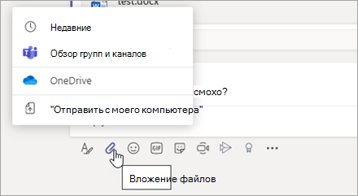
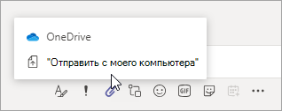
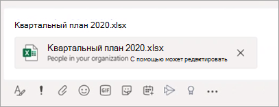
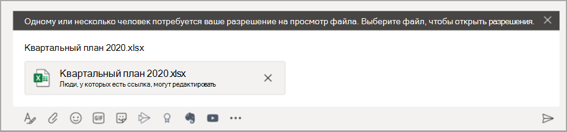

# Совместное использование файлов в Microsoft Teams

В Microsoft Teams пользователи могут совместно использовать содержимое с другими пользователями Teams внутри и за пределами их организации. Совместное использование в Teams основано на параметрах, настроенных в SharePoint и OneDrive, поэтому все параметры, настроены для SharePoint и OneDrive, также будет управлять совместным доступом в Teams.

## Обзор

Пользователи могут представлять общий доступ к файлам из OneDrive, из групп и сайтов, к которым у них есть доступ, а также со своего компьютера. Чтобы предоставить общий доступ к файлу, пользователи могут сделать следующее:

- На канале щелкните **Прикрепить** (значок скрепки), выберите **Недавние**, **Загрузить из Teams и каналов**, **OneDrive** или **Загрузить с компьютера** и затем выберите нужный файл.   
    
- В чате щелкните **Прикрепить** (значок скрепки), выберите или **OneDrive** или **Загрузить с компьютера** и затем выберите нужный файл.  
    
- Скопируйте и вставьте ссылку для совместного использования в поле для создания сообщения. 
    

### Что нужно знать о предоставлении общего доступа к файлу

### Разрешения общих файлов и ссылок для общего доступа

Когда пользователи предоставляют общий доступ к файлу, загружая его из OneDrive, команд и каналов, всем получателям предоставляется доступ вместе с [разрешением по умолчанию, установленное на уровне организации](https://docs.microsoft.com/sharepoint/change-default-sharing-link).

Когда пользователь копирует и вставляет ссылку для общего доступа, разрешения, настроенные для этой ссылки для общего доступа, и URL-адрес SharePoint сокращается до имени файла. Другими словами, Teams использует только имя файла для ссылки на файл.

Когда пользователи предоставляют общий доступ к файлу из Teams, можно указать, кто может получить доступ к файлу, как и в Microsoft 365. Они могут предоставить доступ любому пользователю, сотрудникам организации, пользователям с доступом или определенным пользователям (которые могут включать люди в чате 1:1, групповом чате или канале).  При предоставлении общего доступа к файлу в сообщении доступен предварительный просмотр файла, а также все действия с файлом, такие как **Открыть онлайн**, **Загрузить** и **Скопировать ссылку**. По умолчанию файл открывается в Teams. Иногда ссылка для общего доступа может не преобразоваться в предварительный просмотр файла к моменту отправки сообщения пользователем. Предварительный просмотр файла будет создан системой, но в этом сценарии ссылка для общего доступа не будет сокращена до единственного имени файла.

Когда пользователи предоставляют общий доступ к файлу из чата или канала, они получат уведомление о наличии у некоторых или всех получателей разрешения на просмотр файла. Они могут изменить разрешения для файла перед предоставлением общего доступа, щелкнув стрелку рядом с предварительным просмотром файла, который теперь отображается в сообщении.

### Копирование ссылки для общего доступа в Teams

Пользователи могут скопировать ссылку для общего доступа SharePoint и изменить разрешения на предоставление совместного доступа, как и в Microsoft 365. Они могут предоставить доступ любому пользователю, сотрудникам организации, пользователям с доступом или определенным пользователям. Разрешение по умолчанию для ссылки такое же, как разрешение по умолчанию, установленное на уровне организации, если только разрешения на уровне сайта SharePoint не переопределяют его.

## Настройка общего доступа в OneDrive и SharePoint

Дополнительные сведения о совместном использовании файлов в OneDrive и SharePoint, в том числе о настройке общего доступа, а также включении и отключении общий доступ, см. в следующих разделах:

- [Обзор внешнего доступа](https://docs.microsoft.com/sharepoint/external-sharing-overview) — описано, что происходит при предоставлении пользователями общего доступа в зависимости от того, кому и к чему он предоставляется.

- [Управление параметрами общего доступа](https://docs.microsoft.com/sharepoint/turn-external-sharing-on-or-off) — описано, как глобальные администраторы и администраторы SharePoint могут изменить параметры общего доступа на уровне организации для SharePoint и OneDrive.

- [Включение и отключение внешнего общего доступа для сайта](https://docs.microsoft.com/sharepoint/change-external-sharing-site) — описано, как глобальные администраторы и администраторы SharePoint могут включать или отключать внешний общий доступ к сайту.

- [Изменение типа ссылки по умолчанию для сайта](https://docs.microsoft.com/sharepoint/change-default-sharing-link) — описано, как установить тип ссылки по умолчанию, чтобы он был более строгим.

## Дополнительные сведения

- [Взаимодействие SharePoint Online и OneDrive для бизнеса с Microsoft Teams](sharepoint-onedrive-interact.md)

- [SharePoint и Teams: лучше вместе](https://techcommunity.microsoft.com/t5/Microsoft-SharePoint-Blog/SharePoint-and-Teams-Better-Together/ba-p/189593)

- [Общий доступ к файлам и папкам OneDrive](https://support.office.com/article/Share-OneDrive-files-and-folders-9fcc2f7d-de0c-4cec-93b0-a82024800c07#OS_Type=OneDrive_-_Business)

- [Общий доступ к файлам и папкам SharePoint](https://support.office.com/article/share-sharepoint-files-or-folders-1fe37332-0f9a-4719-970e-d2578da4941c)
