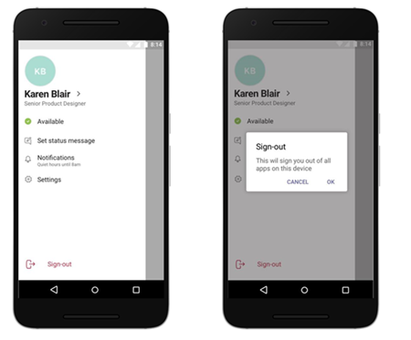

Вход в Microsoft TeamsSign in to Microsoft Teams
==========================

## Пользователи WindowsWindows users

Корпорация Майкрософт рекомендует организациям использовать последние версии Windows 10 с гибридным присоединением к домену или параметром подключения Azure AD. Использование последних версий гарантирует, что учетные записи пользователей заполняются в веб-диспетчере учетных записей Windows, который, в свою очередь, обеспечивает единый вход в Teams и другие приложения Майкрософт. Единый вход удобнее для пользователей (автоматический вход в систему) и надежнее с точки зрения безопасности.Microsoft recommends that organizations use recent versions of Windows 10 with either Hybrid Domain Join or Azure AD Join configuration. Using recent versions ensures that users’ accounts are primed in Windows’ Web Account Manager, which in turn enables single sign-on to Teams and other Microsoft applications. Single sign-on provides a better user experience (silent sign in) and a better security posture.

В Microsoft Teams используется современная проверка подлинности, чтобы обеспечить простой и безопасный вход в систему. Чтобы узнать, как пользователи входят в Teams, см. статью [Вход в Teams](https://support.office.com/article/sign-in-to-teams-ea4b1443-d11b-4791-8ae1-9977e7723055).Microsoft Teams uses modern authentication to keep the sign-in experience simple and secure. To see how users sign in to Teams, read [Sign in to Teams](https://support.office.com/article/sign-in-to-teams-ea4b1443-d11b-4791-8ae1-9977e7723055).

### Принцип работы современной проверки подлинностиHow modern authentication works

Современная проверка подлинности — это процесс, с помощью которого приложение Teams узнает, что пользователи уже ввели свои учетные данные (например, рабочий адрес электронной почты и пароль) в другом месте и им не требуется вводить их повторно, чтобы запустить приложение.Modern authentication is a process that lets Teams know that users have already entered their credentials, such as their work email and password elsewhere, and they shouldn't be required to enter them again to start the app. Интерфейс зависит от нескольких факторов, например от использования Windows или компьютера Mac.The experience varies depending on a couple factors, like if users are working in Windows or on a Mac. Он также изменяется в зависимости от того, включена ли в вашей организации однофакторная или многофакторная проверка подлинности.It will also vary depending on whether your organization has enabled single-factor authentication or multi-factor authentication. При многофакторной проверке подлинности обычно используется проверка учетных данных с помощью телефона, предоставления уникального кода, ввода ПИН-кода или представления отпечатка пальца.Multi-factor authentication usually involves verifying credentials via a phone, providing a unique code, entering a PIN, or presenting a thumbprint. Ниже приведено краткое описание каждого сценария современной проверки подлинности.Here's a rundown of each modern authentication scenario.

Современная проверка подлинности доступна для всех организаций, использующих Teams.Modern authentication is available for every organization that uses Teams. Если пользователям не удается использовать этот процесс, возможно, существуют неполадки в конфигурации Azure AD в вашей организации.If users aren't able to complete the process, there might be an underlying issue with your organization's Azure AD configuration. Дополнительные сведения см. в статье [Почему у меня возникают проблемы со входом в Microsoft Teams?](https://support.office.com/article/why-am-i-having-trouble-signing-in-to-microsoft-teams-a02f683b-61a3-4008-9447-ee60c5593b0f)For more information, see [Why am I having trouble signing in to Microsoft Teams?](https://support.office.com/article/why-am-i-having-trouble-signing-in-to-microsoft-teams-a02f683b-61a3-4008-9447-ee60c5593b0f)

- Если пользователи уже выполнили вход в Windows или другие приложения Office со своей рабочей или учебной учетной записью, при запуске Teams они сразу попадают в приложение.If users have already signed in to Windows or to other Office apps with their work or school account, when they start Teams they're taken straight to the app. Им не потребуется вводить свои учетные данные.There's no need for them to enter their credentials.

- Microsoft рекомендует использовать Windows 10 версии 1903 или более поздней для обеспечения единого входа.Microsoft recommends using Windows 10 version 1903 or later for the best Single Sign-On experience.

- Если пользователи не выполняли вход в свою рабочую или учебную учетную запись Майкрософт в другом месте, при запуске Teams им будет предложено пройти однофакторную или многофакторную проверку подлинности (SFA или MFA)If users are not signed in to their Microsoft work or school account anywhere else, when they start Teams, they're asked to provide either single-factor or multi-factor authentication (SFA or MFA). Этот процесс зависит от выбранной процедуры входа в организации.This process depends on what your organization has decided they'd like the sign-in procedure to require.

- Если пользователи выполнили вход на компьютере, подключенном к домену, при запуске Teams может потребоваться пройти еще один шаг проверки подлинности. Это зависит от того, выбрана ли в организации обязательная MFA или компьютер сразу требует MFA для входа.If users are signed in to a domain-joined computer, when they start Teams, they might be asked to go through one more authentication step, depending on whether your organization opted to require MFA or if their computer already requires MFA to sign in. Если компьютер сразу требует MFA для входа, при открытии Teams приложение запускается автоматически.If their computer already requires MFA to sign in, when they open up Teams, the app automatically starts.

- На компьютерах, подключенных к домену, когда единый вход невозможен, Teams могут предварительно заполнить свой экран входа в систему именем участника-пользователя (UPN).On Domain joined PCs, when SSO isn't possible Teams may pre-fill its login screen with the user principal name (UPN). В некоторых случаях вы можете этого не хотеть, особенно если ваша организация использует разные локальные имена пользователей и в Azure Active Directory.There are cases where you may not want this, especially if your organization uses different UPNs on-premises and in Azure Active Directory. В этом случае вы можете использовать следующий раздел реестра Windows, чтобы отключить предварительное заполнение имени участника-пользователя:If that's the case, you can use the following Windows registry key to turn off pre-population of the UPN:

  Computer\HKEY_CURRENT_USER\Software\Microsoft\Office\TeamsComputer\HKEY_CURRENT_USER\Software\Microsoft\Office\Teams 
  SkipUpnPrefill(REG_DWORD)SkipUpnPrefill(REG_DWORD) 
  0x00000001 (1)0x00000001 (1)

    > [!NOTE]
    > Пропуск или игнорирование предварительного добавления имен пользователей, оканчивающихся на ".local" или ".corp", включено по умолчанию, поэтому вам не нужно настраивать раздел реестра для их отключения.Skipping or ignoring user name pre-fill for user names that end in ".local" or ".corp" is on by default, so you don't need to set a registry key to turn these off.

### Выход из Teams после выполнения современной проверки подлинностиSigning out of Teams after completing modern authentication

Для выхода из Teams пользователи могут нажать свой аватар в верхней части окна приложения и выбрать команду **Выйти**. Кроме того, они могут щелкнуть правой кнопкой мыши значок приложения на панели задач и выбрать команду **Выйти**. После выхода из Teams пользователю потребуется повторно ввести свои учетные данные, чтобы запустить приложение.To sign out of Teams, users can select their profile picture at the top of the app, and then select **Sign out**. They can also right-click the app icon in their taskbar, and then select **Log out**. Once they've sign out of Teams, they need to enter their credentials again to launch the app.

### Вход в другую учетную запись на компьютере, присоединенном к доменуSigning in to another account on a Domain Joined computer

У пользователей компьютера, присоединенного к домену, может не быть возможности входить в Teams с другой учетной записью этого же домена Active Directory.Users on domain-joined computer may not be able to sign in to Teams with another account in the same Active Directory domain.

## Пользователи MacOSMacOS users

В MacOS Teams будут предлагать пользователям ввести свои имя пользователя и учетные данные и могут запрашивать многофакторную аутентификацию в зависимости от настроек вашей организации.On MacOS, Teams will prompt users to enter their username and credentials and may prompt for multi-factor authentication depending on your organization's settings. После ввода пользователем учетных данных ему не потребуется указывать их снова.Once users enter their credentials, they won't be required to provide them again. С этого момента Teams будет запускаться автоматически при работе пользователя на этом компьютере.From that point on, Teams automatically starts whenever they're working on the same computer.

## Пользователи Teams в iOS и AndroidTeams on iOS and Android users

После входа мобильные пользователи увидят список всех учетных записей Microsoft 365, которые находятся в системе в настоящее время или ранее выполняли вход на этом устройстве.Upon sign in, mobile users will see a list of all the Microsoft 365 accounts that are either currently signed-in or were previously signed-in on their device. Пользователи могут нажать любую учетную запись для входа.Users can tap on any of the accounts to sign in. Существует два сценария входа на мобильных устройствах:There are two scenarios for mobile sign in:

1. Если с помощью выбранной учетной записи в настоящее время выполнен вход в других приложениях Office 365 или Microsoft 365, пользователь будет направлен прямо в Teams.If the selected account is currently signed in to other Office 365 or Microsoft 365 apps, then the user will be taken straight to Teams. Пользователю не потребуется вводить свои учетные данные.There's no need for the user to enter their credentials.

2. Если пользователь не вошел в свою учетную запись Microsoft 365 в другом месте, ему будет предложено пройти однофакторную или многофакторную проверку подлинности (SFA или MFA), в зависимости от настроек организации для политик входа на мобильных устройствах.If user isn't signed in to their Microsoft 365 account anywhere else, they will be asked to provide single-factor or multi-factor authentication (SFA or MFA), depending on what your organization has configured for mobile sign-in policies.

> [!NOTE]
> Чтобы пользователи могли применить интерфейс входа, описанный в этом разделе, на их устройствах должен быть установлен Teams для iOS версии 2.0.13 (сборка 2020061704) или более поздняя версия либо Teams для Android версии 1416/1.0.0.2020061702 или более поздней.For users to experience the sign on experience as described in this section, their devices must be running Teams for iOS version 2.0.13 (build 2020061704) or later, or Teams for Android version 1416/1.0.0.2020061702 or later.

## Использование Teams с несколькими учетными записямиUsing Teams with multiple accounts

Приложение Teams для iOS и Android поддерживает одновременное использование нескольких рабочих или учебных и нескольких личных учетных записей.Teams for iOS and Android supports the use of multiple work or school and multiple personal accounts side by side. Классические приложения Teams будут поддерживать одновременно одну рабочую/учебную и одну личную учетную запись с декабря 2020 года. Поддержка нескольких рабочих/учебных учетных записей будет реализована позже.Teams desktop applications will support one work/school and one personal account side by side in December 2020, with support for multiple work/school accounts coming at a later date.

На следующих изображениях показано, как пользователи могут добавить несколько учетных записей в мобильные приложения Teams.The following images show how users can add multiple accounts in Teams mobile applications.

:::image type="content" source="media/sign-in-multiple-accounts.png" alt-text="Добавление нескольких учетных записей в Teams":::

## Ограничение входа в TeamsRestrict sign in to Teams

Организации могут ограничивать использование утвержденных корпоративных приложений на управляемых устройствах. Например, можно ограничить возможности доступа к данным из других организаций для учащихся или сотрудников. Также можно ограничить использование корпоративных приложений для личных целей.Organization may want to restrict how corporate-approved apps are used on managed devices, for example to restrict students' or employees’ ability to access data from other organizations or use corporate-approved apps for personal scenarios. Эти ограничения можно применить с помощью политик устройств, распознаваемых приложениями Teams.These restrictions can be enforced by setting Devices Policies that Teams applications recognize.   

### Ограничение входа на мобильных устройствахHow to restrict sign in on mobile devices

В Teams для iOS и Android ИТ-администраторы могут передавать настройки учетных записей в учетные записи Microsoft 365.Teams for iOS and Android offers IT administrators the ability to push account configurations to Microsoft 365 accounts. Эта возможность поддерживается любым поставщиком управления мобильными устройствами (MDM), использующим канал [конфигурации управляемых приложений](https://developer.apple.com/library/archive/samplecode/sc2279/Introduction/Intro.html) для iOS или канал [Android Enterprise](https://developer.android.com/work/managed-configurations) для Android.This capability works with any Mobile Device Management (MDM) provider that uses the [Managed App Configuration](https://developer.apple.com/library/archive/samplecode/sc2279/Introduction/Intro.html) channel for iOS or the [Android Enterprise](https://developer.android.com/work/managed-configurations) channel for Android.

Для пользователей, зарегистрированных в Microsoft Intune, можно развернуть параметры конфигурации учетных записей с помощью Intune на портале Azure.For users enrolled in Microsoft Intune, you can deploy the account configuration settings using Intune in the Azure portal.

Когда конфигурация учетной записи будет настроена в поставщике MDM, а пользователь зарегистрирует свое устройство, на страницах входа Teams для iOS и Android будут отображаться только разрешенные учетные записи.Once account setup configuration has been configured in the MDM provider, and after the user enrolls their device, on the sign-in page, Teams for iOS and Android will only show the allowed account(s) on the Teams sign-in page. Пользователь может нажать любую из разрешенных учетных записей на этой странице, чтобы выполнить вход.The user can tap on any of the allowed accounts on this page to sign in.

Настройте следующие параметры конфигурации на портале Azure Intune для управляемых устройств.Set the following configuration parameters in the Azure Intune portal for managed devices.

|ПлатформаPlatform |КлючKey  |ЗначениеValue  |
|---------|---------|---------|
|iOSiOS     |  **IntuneMAMAllowedAccountsOnly****IntuneMAMAllowedAccountsOnly**       | **Включено**. Единственной разрешенной учетной записью является управляемая учетная запись пользователя, определяемая ключом IntuneMAMUPN.**Enabled**: The only account allowed is the managed user account defined by the IntuneMAMUPN key.  **Отключено** (или любое другое значение, не соответствующее с учетом регистра значению **Включено**). Разрешены любые учетные записи.**Disabled** (or any value that is not a case insensitive match to **Enabled**): Any account is allowed.        |
|iOSiOS     |   **IntuneMAMUPN****IntuneMAMUPN**      |   UPN учетной записи, которой разрешен вход в Teams.UPN of the account allowed to sign in to Teams.  Для устройств, зарегистрированных в Intune, может использоваться маркер {{userprincipalname}} для представления зарегистрированной учетной записи.For Intune enrolled devices, the {{userprincipalname}} token may be used to represent the enrolled user account.       |
|AndroidAndroid     |**com.microsoft.intune.mam.AllowedAccountUPNs****com.microsoft.intune.mam.AllowedAccountUPNs**         |    Разрешены только управляемые учетные записи пользователей, определенные этим ключом.Only account(s) allowed are the managed user account(s) defined by this key.  Одно или несколько имен участников-пользователей (UPN), разделенных точками с запятой (;).One or more semi-colons;]- delimited UPNs.  Для устройств, зарегистрированных в Intune, может использоваться маркер {{userprincipalname}} для представления зарегистрированной учетной записи.For Intune enrolled devices, the {{userprincipalname}} token may be used to represent the enrolled user account.

После настройки конфигурации учетной записи приложение Teams ограничит возможность входа, чтобы предоставлять доступ только разрешенным учетным записям на зарегистрированных устройствах.Once the account setup configuration has been set, Teams will restrict the ability to sign in, so that only allowed accounts on enrolled devices will be granted access.

Сведения о создании политики конфигурации приложений для управляемых устройств с iOS и iPadOS см. в статье [Добавление политик конфигурации приложений для управляемых устройств с iOS и iPadOS](https://docs.microsoft.com/mem/intune/apps/app-configuration-policies-use-ios).To create an app configuration policy for managed iOS/iPadOS devices, see [Add app configuration policies for managed iOS/iPadOS devices](https://docs.microsoft.com/mem/intune/apps/app-configuration-policies-use-ios).

Сведения о создании политики конфигурации приложений для управляемых устройств с Android см. в статье [Добавление политик конфигурации приложений для управляемых устройств с Android](https://docs.microsoft.com/mem/intune/apps/app-configuration-policies-use-android).To create an app configuration policy for managed Android devices, see [Add app configuration policies for managed Android devices](https://docs.microsoft.com/mem/intune/apps/app-configuration-policies-use-android).

### Ограничение входа на настольных компьютерахHow to restrict sign in on desktop devices
В приложениях Teams для Windows и MacOS реализуется поддержка политик устройств, ограничивающих вход в вашей организации.Teams apps on Windows and MacOS are gaining support for device policies that restrict sign in to your organization. Эти политики можно настраивать с помощью обычных решений для управления устройствами, например MDM (управление мобильными устройствами), а также с помощью объектов групповой политики.The policies can be set via usual Device Management solutions such as MDM (Mobile Device Management) or GPO (Group Policy Object). 

Если на устройстве настроена эта политика, то пользователи смогут входить только с помощью учетных записей в составе клиента Azure AD, который включен в список разрешенных клиентов, определенный в политике.When this policy is configured on a device, users can only sign in with accounts homed in an Azure AD tenant that is included in the “Tenant Allow List” defined in the policy. Эта политика применяется ко входу всех учетных записей, включая первую учетную запись и дополнительные учетные записи.The policy applies to all sign-ins, including first and additional accounts. Если в организации используется несколько клиентов Azure AD, можно включить несколько идентификаторов клиентов в список разрешенных.If your organization spans multiple Azure AD tenants, you can include multiple Tenant IDs in the Allow List. При этом ссылки на добавление другой учетной записи могут по-прежнему отображаться в Teams, но эти ссылки не будут действовать.Links to add another account may continue to be visible in the Teams app, but they won't be operable.

> [!NOTE]
>1. Эта политика ограничивает только вход. Она не ограничивает возможность пользователей быть приглашенными в качестве гостей в другие клиенты Azure AD или переключаться на другие клиенты.The policy only restricts sign-ins. It does not restrict the ability for users to be invited as guest in other Azure AD tenants, or switch to other tenants.
>2. Для этой политики требуется Teams для Windows версии 1.3.00.30866 или более поздней либо Teams для MacOS версии 1.3.00.30882 (выпуск в середине ноября 2020 г.).The policy requires Teams for Windows version 1.3.00.30866 or higher, and Teams for MacOS version 1.3.00.30882 (released mid-November 2020).

**Политики для Windows** Файлы административных шаблонов (ADMX/ADML) доступны в [Центре загрузки](https://www.microsoft.com/download/details.aspx?id=49030).**Policies for Windows** Administrative Template files (ADMX/ADML) are available from the [Download center](https://www.microsoft.com/download/details.aspx?id=49030). Кроме того, вы можете вручную настроить разделы в реестре Windows:Additionally, you can manually set keys in Windows Registry:

- Имя значения: RestrictTeamsSignInToAccountsFromTenantListValue Name: RestrictTeamsSignInToAccountsFromTenantList
- Тип значения: строкаValue Type: String
- Данные значения: идентификатор клиента или список идентификаторов клиентов, перечисленных через запятуюValue Data: Tenant ID, or comma-separated list of Tenant IDs
- Путь: один из следующихPath: use one of the following

 Computer\HKEY_CURRENT_USER\SOFTWARE\Policies\Microsoft\Cloud\Office\16.0\Teams Computer\HKEY_CURRENT_USER\SOFTWARE\Policies\Microsoft\Office\16.0\Teams Computer\HKEY_CURRENT_USER\SOFTWARE\Microsoft\Office\16.0\TeamsComputer\HKEY_CURRENT_USER\SOFTWARE\Policies\Microsoft\Cloud\Office\16.0\Teams Computer\HKEY_CURRENT_USER\SOFTWARE\Policies\Microsoft\Office\16.0\Teams Computer\HKEY_CURRENT_USER\SOFTWARE\Microsoft\Office\16.0\Teams

Пример: SOFTWARE\Policies\Microsoft\Office\16.0\Teams\RestrictTeamsSignInToAccountsFromTenantList = ИД клиента или SOFTWARE\Policies\Microsoft\Office\16.0\Teams\RestrictTeamsSignInToAccountsFromTenantList = ИД клиента 1,ИД клиента 2,ИД клиента 3Example: SOFTWARE\Policies\Microsoft\Office\16.0\Teams\RestrictTeamsSignInToAccountsFromTenantList = Tenant ID or SOFTWARE\Policies\Microsoft\Office\16.0\Teams\RestrictTeamsSignInToAccountsFromTenantList = Tenant ID 1,Tenant ID 2,Tenant ID 3

**Политики для MacOS** На устройствах под управлением MacOS используйте файл PLIST, чтобы развернуть ограничения входа.**Policies for MacOS** For MacOS managed devices, use .plist to deploy sign-in restrictions. Профиль конфигурации представляет собой файл с расширением .PLIST, содержащий записи, которые состоят из ключа (определяющего имя параметра) и значения (оно зависит от типа параметра).The configuration profile is a .plist file that consists of entries identified by a key (which denotes the name of the preference), followed by a value, which depends on the nature of the preference. При этом значения могут быть как простыми (числовое значение), так и сложными (многоуровневый список параметров).Values can either be simple (such as a numerical value) or complex, such as a nested list of preferences.

- Домен: com.microsoft.teamsDomain: com.microsoft.teams
- Ключ: RestrictTeamsSignInToAccountsFromTenantListKey: RestrictTeamsSignInToAccountsFromTenantList
- Тип данных: строкаData Type: String
- Комментарии: введите список идентификаторов клиентов Azure AD, перечисленных через запятуюComments: Enter comma separate list of Azure AD tenant ID(s)

## Выход из приложения на мобильных устройствахSign out on mobile devices

Мобильные пользователи могут выйти из Teams, выбрав меню **Еще** и нажав **Выйти**. После выхода пользователям потребуется повторно ввести свои учетные данные при следующем запуске приложения.Mobile users can sign out of Teams by going to the menu, selecting the **More** menu, and then selecting **Sign out**. Once signed out, users will need to reenter their credentials the next time they launch the app.

> [!NOTE]
> В Teams для Android используется единый вход, чтобы упростить интерфейс входа.Teams for Android uses single sign-on (SSO) to simplify the sign in experience. Пользователи должны выйти из **всех** приложений Майкрософт (помимо Teams), чтобы полностью выполнить выход на платформе Android.Users should make sure to log out of **all** Microsoft apps, in addition to Teams, in order to completely log out on the Android platform.

### Глобальный вход и выходGlobal sign in and sign out

Приложение Teams для Android теперь поддерживает глобальный вход и выход, чтобы обеспечить удобные возможности входа и выхода для сотрудников без компьютера.The Teams Android app now supports Global sign-in and sign-out, to provide a hassle free sign-in and sign-out experience for Firstline Workers. Сотрудник может выбрать устройство в пуле общих устройств и выполнить единый вход, чтобы "оно принадлежало ему" в течение смены.Employees can pick a device from the shared device pool and do a single sign in to "make it theirs" for the duration of their shift. В конце смены сотрудник может выполнить глобальный выход с устройства.At the end of their shift, they should be able to perform sign out to globally sign out on the device. При этом будут удалены все личные и корпоративные сведения с устройства, чтобы его можно было вернуть в пул устройств.This with remove all of their personal and company information from the device so they can return the device to the device pool. Чтобы воспользоваться этой возможностью, устройство должно находиться в общем режиме.To get this capability, the device must be in shared mode. Сведения о том, как настроить общее устройство, см. в статье [Использование режима общего устройства в Android](https://docs.microsoft.com/azure/active-directory/develop/tutorial-v2-shared-device-mode#set-up-an-android-device-in-shared-mode).To learn how to set up a shared device, see [How to use a shared device mode in Android](https://docs.microsoft.com/azure/active-directory/develop/tutorial-v2-shared-device-mode#set-up-an-android-device-in-shared-mode).

Интерфейс входа похож на стандартный интерфейс входа Teams, а интерфейс выхода похож на следующие два изображения:The sign-in experience looks similar to our standard Teams sign experience, while sign out will look like the following two images:

  

## URL-адреса и диапазоны IP-адресовURLs and IP address ranges

Для Teams требуется подключение к Интернету.Teams requires connectivity to the Internet. Для ознакомления с конечными точками, которые должны быть доступны для клиентов, использующих Teams в планах Office 365, государственных и других облаках, см. статью [URL-адреса и диапазоны IP-адресов Office 365](https://docs.microsoft.com/office365/enterprise/urls-and-ip-address-ranges).To understand endpoints that should be reachable for customers using Teams in Office 365 plans, Government, and other clouds, read [Office 365 URLs and IP address ranges](https://docs.microsoft.com/office365/enterprise/urls-and-ip-address-ranges).

> [!IMPORTANT]
> В настоящее время Teams требуется доступ (порт TCP 443) к службе Google ssl.gstatic.com (<https://ssl.gstatic.com)> для всех пользователей, даже если вы не используете Gstatic.Teams presently requires access (TCP port 443) to the Google ssl.gstatic.com service (<https://ssl.gstatic.com)> for all users; this is true even if you're not using Gstatic. Скоро (в начале 2020 г.) это требование будет удалено из Teams, и мы обновим эту статью соответствующим образом.Teams will remove this requirement soon (early 2020), and we'll update this article accordingly at that time.

## Статьи по темеRelated topics

[Устранение неполадок TeamsTeams Troubleshooting](https://docs.microsoft.com/MicrosoftTeams/troubleshoot/teams)
