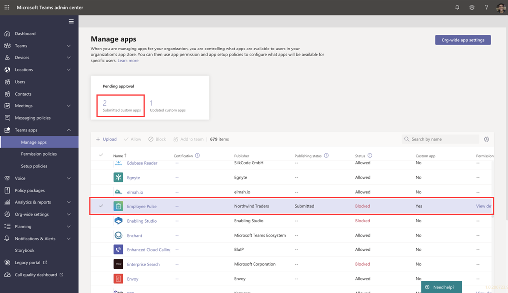
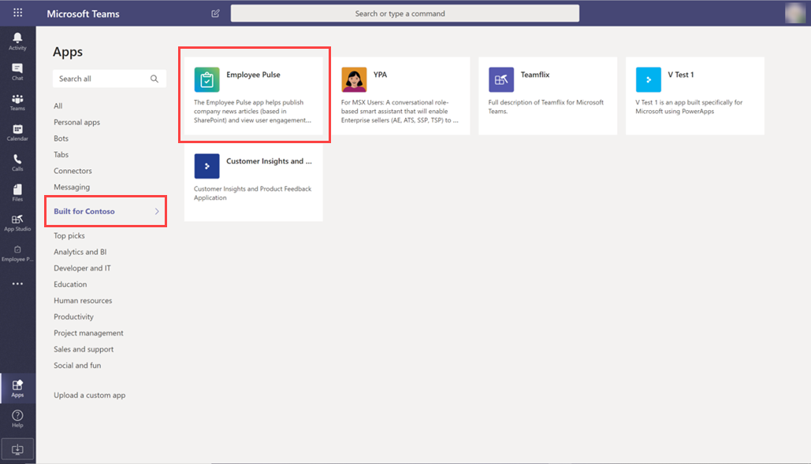

# Публикация пользовательского приложения, отправленного с Teams API отправки приложений

## Обзор

> [!NOTE]
> При публикации пользовательского Teams приложения оно доступно пользователям в магазине приложений вашей организации. Существует два способа публикации пользовательского приложения и способ его использования зависит от способа его получения. **В этой статье основное внимание уделяется** утверждению и публикации настраиваемой программы, которую разработчик передает с помощью API Teams отправки приложений. Другой способ — отправка настраиваемого приложения — используется, когда разработчик отправляет вам пакет приложения .zip формате. Дополнительные информацию об этом способе см. в публикации настраиваемого приложения [путем отправки пакета приложения](/microsoftteams/upload-custom-apps). Мини-приложение "Утверждение приложения" не доступно в GCC клиентах.

> [!IMPORTANT]
> Этот метод в настоящее время не доступен GCC средах. Необходимо использовать способ *отправки настраиваемого* приложения.

В этой статье приводится по-разное руководство по Teams от разработки до развертывания до обнаружения. Вы получите общие сведения о подключенных Teams, которые упрощают разработку, развертывание и управление пользовательскими приложениями в магазине приложений вашей организации.

Мы покроем каждый этап жизненного цикла, включая то, как разработчики могут использовать API отправки приложений Teams для отправки пользовательских приложений непосредственно в Центр администрирования Microsoft Teams для просмотра и утверждения, а также настройки политик для управления приложениями для пользователей в организации и их обнаружения в Teams.

В этом руководстве основное внимание уделяется Teams и предназначено для администраторов и ИТ-специалистов. Сведения о разработке Teams см. в документации Teams [разработчиков](/microsoftteams/platform).

## Разработка

### Создание приложения

Платформа Microsoft Teams позволяет разработчикам легко интегрировать собственные приложения и службы, чтобы повысить производительность, быстрее принимать решения и создавать совместную работу по существующему контенту и рабочим процессам. Приложения, встроенные на платформе Teams, перемыкаются между клиентом Teams и вашими службами и процессами, что напрямую влияет на контекст вашей платформы совместной работы. Дополнительные сведения можно найти в документации [Teams разработчиков](/microsoftteams/platform).

### Отправить приложение

Когда приложение будет готово к использованию в производственной среде, разработчик может отправить его с помощью API отправки приложения Teams, который можно использовать из [API Graph](/graph/api/teamsapp-publish?view=graph-rest-beta&tabs=http#example-2-upload-a-new-application-for-review-to-an-organizations-app-catalog), интегрированной среды разработки (IDE), например Visual Studio Code, или платформы, например Power Apps и Power Virtual Agents. При этом приложение будет доступно на странице "Управление приложениями" Microsoft Teams, где его можно просмотреть и утвердить.

API отправки приложений Teams, созданный на основе [Microsoft Graph](/graph/api/teamsapp-publish?tabs=http&view=graph-rest-beta#example-2-upload-a-new-application-for-review-to-an-organizations-app-catalog), позволяет вашей организации разрабатывать приложения на нужной платформе и автоматизировать процесс отправки на утверждение пользовательских приложений на Teams.

Вот пример того, как выглядит этап отправки приложения в Visual Studio Code:

Имейте в виду, что это приложение пока не публикуется в магазине приложений вашей организации. На этом этапе приложение передается в центр администрирования Microsoft Teams, где его можно утвердить для публикации в магазине приложений вашей организации.

Дополнительные сведения об использовании Graph API для отправки приложений см. [здесь](/graph/api/teamsapp-publish?tabs=http&view=graph-rest-beta#example-2-upload-a-new-application-for-review-to-an-organizations-app-catalog).

## Уведомить

Вы можете включить уведомления, чтобы знать, когда разработчики подают новое приложение для проверки и утверждения. Вы также будете получать уведомления, когда разработчики будут отправлять обновления приложений. Чтобы включить уведомления о отправке приложений в Центре администрирования Teams, [ >  перейдите в & уведомления & **ОтправкиRulesApp** > ](https://admin.teams.microsoft.com/notifications/rules) и активируйте правило, изменив состояние на Активно. По умолчанию этот параметр отключен. Включить этот параметр может только глобальный администратор Teams администратор.

После того как вы включит этот параметр, вы будете получать уведомления  в группе "Оповещения и уведомления администратора" нового канала с именем **"Отправки приложений"**. Кроме того, вы можете выбрать существующую команду и канал, чтобы получать уведомления для указанной команды и канала. Для этого выполните следующие действия:

1. В **правиле отправки приложений** в области Действия выберите оповещение **канала**.
1. Выберите **кнопку Выбрать** канал.
1. Найщите команду, которая будет добавлена.
1. Найщите канал, который нужно добавить.
1. Выберите **Применить**.

    

> [!NOTE]
> Чтобы получать **уведомления для** группы "Оповещения администратора" и "**Уведомления**" в канале отправки приложений, выберите оповещение канала **По умолчанию.**

Вы также можете настроить уведомления для внешнего веб-сайта, указав URL-адрес общедоступных веб-страниц после того,  как вы установите его. На URL-адрес веб-страницы будет отправлено уведомление JSON.

После того как вы настроили правило отправки приложений, вы можете просмотреть карточки уведомлений в указанном канале, чтобы просмотреть сведения о приложении, и выбрать Просмотреть сведения, чтобы открыть приложения Teams центре администрирования.

## Проверить

Страница ["Управление](/microsoftteams/manage-apps) приложениями" в Центре Microsoft Teams администрирования (на левой навигации перейдите в [**Teams** **AppsУправляемые** > ](https://admin.teams.microsoft.com/manage-apps) приложениями) позволяет просмотреть все Teams приложений для вашей организации. **Мини-приложение Ожидается** утверждение в верхней части страницы сообщает, когда настраиваемые приложения отправлены на утверждение.

В таблице недавно отправленные приложения автоматически показывают состояние "Отправка"  и "Состояние **заблокирована"**.  Чтобы быстро найти приложение **, можно** отсортировать столбец Состояние публикации по убытию.

Щелкните имя приложения, чтобы перейти на страницу сведений о приложении. На **вкладке** О приложении можно просмотреть подробные сведения о приложении, включая описание, состояние, отправку и ИД приложения.

Дополнительные сведения об использовании Graph API для проверки состояния публикации см. [здесь](/graph/api/appcatalogs-list-teamsapps?tabs=http&view=graph-rest-beta#example-3-find-application-based-on-the-teams-app-manifest-id).

## Публикации

Когда вы будете готовы сделать приложение доступным для пользователей, опубликуем его.

1. В левой панели навигации Центра администрирования Microsoft Teams выберите **Приложения Teams** > **Управление приложениями**.
2. Щелкните имя приложения, чтобы перейти на страницу сведений о приложении,  а затем в поле Состояние публикации **выберите Опубликовать**.

    

После публикации приложения состояние публикации  изменится на **Опубликовано**, а **состояние автоматически изменится** на **Разрешено**.

## Настройка и управление

### Управление доступом к приложению

По умолчанию все пользователи в организации имеют доступ к приложению в магазине приложений организации. Чтобы ограничить и контролировать, у кого есть разрешение на использование приложения, можно создать и назначить политику разрешений для приложения. Дополнительные сведения см. в статье <a href="/microsoftteams/teams-app-permission-policies" target="_blank">Управление политиками и параметрами пользовательских приложений в Teams</a>.

### Закрепление и установка приложения для обнаружения

По умолчанию пользователям нужно перейти в магазин приложений вашей организации и найти его. Чтобы у пользователей было удобно получать доступ к приложению, вы можете закрепить его на панели приложения в Teams. Для этого создайте политику настройки приложения и назначьте ее пользователям. Дополнительные сведения см. в статье <a href="/microsoftteams/teams-app-setup-policies" target="_blank">Управление политиками и параметрами пользовательских приложений в Teams</a>.

### Поиск событий в приложении Teams в журнале аудита

В журнале аудита можно просмотреть действия Teams приложений в организации. Чтобы узнать больше о поиске в журнале аудита и увидеть список Teams, которые вошли в журнал аудита, см. в журнале аудита найдите события в <a href="/microsoftteams/audit-log-events" target="_blank">Teams.</a>

Прежде чем выполнять поиск в журнале аудита, необходимо сначала включить функцию аудита в <a href="https://protection.office.com" target="_blank">Центре безопасности и соответствия требованиям</a>. Дополнительные сведения см. в статье <a href="https://support.office.com/article/Turn-Office-365-audit-log-search-on-or-off-e893b19a-660c-41f2-9074-d3631c95a014" target="_blank">Включение и отключение поиска в журнале аудита</a>. Обратите внимание, что данные аудита доступны только с момента его включения.

## Обнаружение и принятие

Пользователи, у которых есть разрешения на доступ к приложению, могут найти его в магазине приложений вашей организации. Чтобы найти **пользовательские приложения *вашей*** организации, перейдите в страницу "Встроенные для вашей организации" на странице "Приложения".

Если вы создали и настроили политику настройки приложений, приложение будет закреплено на панели приложения в Teams для удобного доступа для пользователей, которым назначена политика.

## Обновление

Чтобы обновить приложение, разработчики должны продолжать выполнять действия, которые вы должны выполнять в разделе [Разработка](#develop) .

Когда разработчик подает обновление опубликованного настраиваемого приложения, вы получите уведомление в мини-приложении Ожидается  утверждение на странице [Управление приложениями](/microsoftteams/manage-apps). В таблице для **состояния публикации** приложения будет установлено состояние Обновление **отправлено**. Вы также будете получать уведомления в группе "Оповещения  и уведомления администратора" в канале отправки приложения, если вы включили уведомления о отправке приложений. На карточке уведомления будет ссылка, с помощью которых можно перейти непосредственно к приложению в центре Teams администрирования. Дополнительные сведения о том, как включить уведомления о отправке приложений, см. в [уведомлении](#notify).

Чтобы просмотреть и опубликовать обновление приложения:

1. В левой панели навигации Центра администрирования Microsoft Teams выберите **Приложения Teams** > **Управление приложениями**.
2. Щелкните имя приложения, чтобы перейти на страницу сведений о приложении, а затем выберите Обновить доступно для просмотра сведений об обновлении.

    
3. Когда все будет готово, выберите **Опубликовать** , чтобы опубликовать обновление. При этом существующее приложение заменяется, обновляется номер версии и изменяется состояние публикации **на** **Опубликовано**. Для обновленного приложения сохраняются все политики разрешений приложений и политики настройки приложений.

    Если вы отклоняете обновление, более ранная версия приложения остается опубликованной.

Имейте в виду следующее:

- Если приложение утверждено, любой из них может отправить в приложение обновление. Это означает, что другие разработчики, в том числе разработчики, которые изначально отправили приложение, могут отправить обновление в приложение.
- Когда разработчик сообщает о приложении и запрос находится в состоянии ожидания, только этот разработчик может отправить обновление приложению. Другие разработчики могут отправлять обновления только после утверждения приложения.

Дополнительные сведения об использовании Graph API для обновления приложений см. <a href="/graph/api/teamsapp-update">здесь</a>.

## Статьи по теме

- [Публикация пользовательского приложения путем отправки пакета приложения](upload-custom-apps.md)
- [Управление приложениями в Центре Microsoft Teams администрирования](manage-apps.md)
- [Управление пользовательскими политиками и параметрами приложений в Teams](teams-custom-app-policies-and-settings.md)
- [Управление политиками разрешений для приложений в Teams](teams-app-permission-policies.md)
- [Управление политиками настройки приложений в Teams](teams-app-setup-policies.md)
- [Teams мониторинга и оповещений](alerts/teams-admin-alerts.md)
- <a href="/graph/api/resources/teamsapp?view=graph-rest-beta" target="_blank">API Graph Microsoft для Teams приложений</a>
