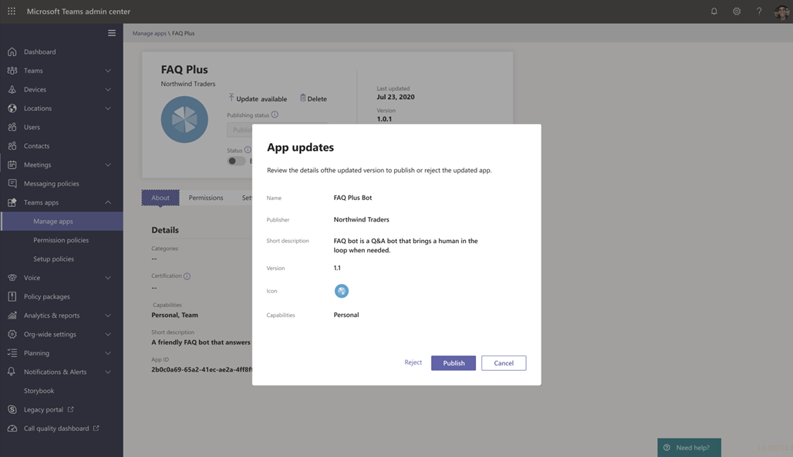

# Публикация пользовательского приложения, добавленного с помощью API-приложения Teams

## Обзор

> [!NOTE]
> Публикуемое приложение Teams доступно пользователям в магазине приложений вашей организации. Существует два способа публикации пользовательского приложения и способа его использования зависит от способа получения приложения. **В этой статье рассматептуется**о том, как утвердить и опубликовать пользовательское приложение, которое отправляет разработчик, с помощью API отправки приложения Teams. Другой способ: добавление пользовательского приложения используется при отправке пакета приложения в формате ZIP. Чтобы узнать больше об этом способе, <a href="https://docs.microsoft.com/microsoftteams/upload-custom-apps" target="_blank">опубликуйте пользовательское приложение, передав пакет приложения.</a>
 
В этой статье приводятся краткие руководства по использованию приложения Teams от разработки до разработки до обнаружения. В нем представлен обзор подключенных возможностей Teams в различных циклах приложений, чтобы упростить разработку, развертывание и управление пользовательскими приложениями в магазине приложений вашей организации.

Мы рассмотрим все этапы жизненного цикла, в том числе о том, как разработчики могут использовать API отправки пользовательских приложений напрямую в Центр администрирования Microsoft Teams, чтобы просматривать и утверждать, настраивать политики для управления приложениями в организации и как пользователи их находит в Teams.

В этом руководстве описаны аспекты Teams и предназначены для администраторов и ИТ-специалистов. Сведения о разработке приложений Teams см. в документации <a href="https://docs.microsoft.com/microsoftteams/platform" target="_blank">для разработчиков Teams.</a>

## Разработка

### Создание приложения

Платформа разработчиков Microsoft Teams позволяет разработчикам интегрировать свои приложения и службы для повышения производительности, ускорения решений и создания существующего контента и рабочих процессов. Приложения, созданные на платформе Teams, являются мостями между клиентом Teams, службами и рабочими процессами, которые переводят их непосредственно в контекст платформы для совместной работы. Дополнительные сведения см. в документации <a href="https://docs.microsoft.com/microsoftteams/platform" target="_blank">для разработчиков Teams.</a>

### Отправка приложения

Когда приложение будет готово к использованию в производстве, разработчик может отправить приложение с помощью API-файла отправки приложений Teams, который можно вызывать <a href="https://docs.microsoft.com/graph/api/teamsapp-publish?view=graph-rest-1.0&tabs=http#example-2-upload-a-new-application-for-review-to-an-organizations-app-catalog" target="_blank">из API Graph API,</a>интегрированной среде разработки (IDE) или Visual Studio платформы, например Power Apps и виртуальные агенты PowerPoint. В результате приложение станет доступно на странице <a href="https://docs.microsoft.com/microsoftteams/manage-apps" target="_blank">"Управление приложениями"</a> Центра администрирования Microsoft Teams, где вы, администратор, сможете проверить и утвердить его.это 

API отправки приложения Teams, опубликованный <a href="https://docs.microsoft.com/graph/api/teamsapp-publish?view=graph-rest-1.0&tabs=http#example-2-upload-a-new-application-for-review-to-an-organizations-app-catalog" target="_blank">в Microsoft Graph,</a>позволяет разрабатывать на платформе выбранного приложения, а отправка пользовательских приложений в Teams выполняется автоматически.

Вот как выглядит эта функция отправки приложения Visual Studio Код:

Помните, что при этом приложение еще не опубликовано в магазине приложений вашей организации. Этот шаг отправляет приложение в Центр администрирования Microsoft Teams, где вы можете утвердить его для публикации в магазине приложений вашей организации.

Дополнительные сведения об отправке приложений с помощью API Graph см. <a href="https://docs.microsoft.com/graph/api/teamsapp-publish?view=graph-rest-1.0&tabs=http#example-2-upload-a-new-application-for-review-to-an-organizations-app-catalog" target="_blank">здесь.</a>

## Проверка

Страница <a href="https://docs.microsoft.com/microsoftteams/manage-apps" target="_blank">"Управление приложениями"</a> в Центре администрирования Microsoft Teams (в левой области навигации перейдите в **приложения Teams**На  >  **панели**управления приложениями), служит для просмотра всех приложений Teams для организации. **Мини-приложение ожидается** в верхней части страницы сообщает, когда оно отправляется на утверждение.

В таблице новое приложение автоматически укажет **Publishing status** состояние публикации с запросом "Отправлен" и **Status** "Состояние **Submitted** заблокированных". **Blocked** Чтобы **быстро** найти приложение, можно отсортировать столбец состояния публикации в порядке убывания.

Щелкните имя приложения, чтобы перейти на страницу сведений о приложении. На вкладке **"О программе"** можно просмотреть сведения о приложении, включая описание, состояние, отправку и идентификатор приложения.

Дополнительные сведения об использовании API Graph для проверки состояния **публикации**см. в <a href="https://docs.microsoft.com/graph/api/teamsapp-list?view=graph-rest-1.0&tabs=http#example-3-list-applications-with-a-given-id-and-return-the-submission-review-state" target="_blank">этой статье.</a>

## Опубли

Когда приложение будет готово к старому доступу, опубликуйте его.

1. В левой области навигации Центра администрирования Microsoft Teams перейдите в раздел **"Управление**  >  **приложениями Teams".**
2. Щелкните имя приложения, чтобы перейти на страницу сведений о приложении, а затем в **окне состояния публикации** выберите **"Опубликовать".**

    После публикации приложения состояние **публикации** изменится на **"Опубликованное",** а **состояние** автоматически изменится на **"Разрешено".**

## Настройка и управление

### Управление доступом к приложению

По умолчанию доступ к приложению могут получить все пользователи в организации в магазине приложений вашей организации. Чтобы ограничить использование приложения и назначать политику разрешений на использование приложения, можно создать и назначить политику разрешений. Дополнительные сведения см. в <a href="https://docs.microsoft.com/microsoftteams/teams-app-permission-policies" target="_blank">разделе "Управление политиками разрешений приложений" в Teams.</a>

### Закрепите и установите приложение для обнаружения пользователей

По умолчанию пользователям нужно найти приложение, которое должно зайти в магазин приложений вашей организации, а затем найти или найти его. Чтобы упростить доступ пользователей к приложению, закрепите приложение на панели приложения в Teams. Для этого создайте политику настройки приложений и назначьте ее пользователям. Дополнительные сведения см. в <a href="https://docs.microsoft.com/microsoftteams/teams-app-setup-policies" target="_blank">разделе "Управление политиками настройки приложений в Teams".</a>

### Поиск событий приложения Teams в журнале аудита

В журнале аудита можно выполнять поиск в журнале аудита, чтобы просмотреть действия в приложениях Teams в вашей организации. Дополнительные сведения о поиске в журнале аудита и просмотре списка действий Teams, регистрируемых в журнале аудита, см. в журнале аудита, в журнале <a href="https://docs.microsoft.com/microsoftteams/audit-log-events" target="_blank">аудита.</a>

Чтобы можно было выполнять поиск в журнале аудита, необходимо сначала включить аудит <a href="https://protection.office.com" target="_blank">в Центре безопасности & Безопасности.</a> Дополнительные сведения см. в статье "Включение и отключение поиска в журнале <a href="https://support.office.com/article/Turn-Office-365-audit-log-search-on-or-off-e893b19a-660c-41f2-9074-d3631c95a014" target="_blank">аудита".</a> Помните, что данные аудита доступны только в том месте, когда вы включили аудит.

## Обнаружение и адаптация

Пользователи с разрешениями на это приложение могут найти его в магазине приложений вашей организации. Найдите **пользовательские *Your Organization Name* ** приложения своей организации на странице "Приложения".

Если вы создали и назначили политику настройки приложения, оно закрепляется на панели приложения Teams для удобного доступа пользователей, которым была назначена политика.

## Обновление

Чтобы обновить приложение, разработчикам нужно продолжать выполнять действия, описанные в разделе ["Разработка".](#develop)

Когда разработчик отправляет обновление опубликованному пользовательскому приложению, вы получите уведомление на странице <a href="https://docs.microsoft.com/microsoftteams/manage-apps" target="_blank">"Управление приложениями".</a> **Pending approval** В таблице **состояние публикации** приложения будет настроено **на обновление.**

Чтобы просмотреть и опубликовать обновление приложения, сделайте вот что:

1. В левой области навигации Центра администрирования Microsoft Teams перейдите в раздел **"Управление**  >  **приложениями Teams".**
2. Щелкните имя приложения, чтобы перейти на страницу сведений о приложении, и выберите **"Обновить** доступное обновление", чтобы просмотреть сведения об обновлении.

    
3. Когда будете готовы, нажмите кнопку **"Опубликовать",** чтобы опубликовать обновление. При этом будет заменено существующее приложение, обновляется номер версии и изменяет **состояние публикации** на **"Опубликованные".** Все политики разрешений приложений и политики настройки приложений остаются принудительно применяемыми к обновленному приложению.

    Если отклонить обновление, более ранняя версия приложения останется опубликованной.

Обратите особое описанное ниже.

- При утверждении приложения любой пользователь может отправить обновление приложению. Это означает, что другие разработчики, включая разработчик, который изначально отправил приложение, может отправить обновление приложению.
- Когда разработчик отправляет приложение и ожидается, только этот разработчик может отправить обновление приложению. Другие разработчики могут отправить обновление только после утверждения приложения.

Дополнительные сведения об обновлении приложений Graph Graph см. <a href="https://docs.microsoft.com/graph/api/teamsapp-update?view=graph-rest-1.0#example-2-update-a-previously-reviewed-and-published-application-to-the-teams-app-catalog" target="_blank">здесь.</a>

### Обновление интерфейса для пользователей

В большинстве случаев после публикации обновления приложения новая версия автоматически появляется для пользователей. Однако для манифеста <a href="https://docs.microsoft.com/microsoftteams/platform/resources/schema/manifest-schema" target="_blank">Microsoft Teams</a> есть некоторые обновления, которые требуют принять пользователю прием.

* Бот добавлен или удален
* Изменено свойство "botId"
* Изменено свойство "isNotificationOnly"
* Изменено свойство "supportsFiles"
* Расширение для сообщения
* Добавлена новая соединительная линия
* Добавлена новая статическая вкладка
* Добавлена новая вкладка с настраиваемой вкладкой
* Свойства внутри веб-приложения "WebApplicationInfo"

## См. также

- [Публикация пользовательского приложения путем загрузки пакета приложения](upload-custom-apps.md)
- [Управление приложениями в Центре администрирования Microsoft Teams](manage-apps.md)
- [Управление пользовательскими политиками и параметрами приложений в Teams](teams-custom-app-policies-and-settings.md)
- [Управление политиками разрешений для приложений в Teams](teams-app-permission-policies.md)
- [Управление политиками настройки приложений в Teams](teams-app-setup-policies.md)
- <a href="https://docs.microsoft.com/graph/api/resources/teamsapp?view=graph-rest-1.0" target="_blank">API приложения Microsoft Graph API для приложений Teams</a>
