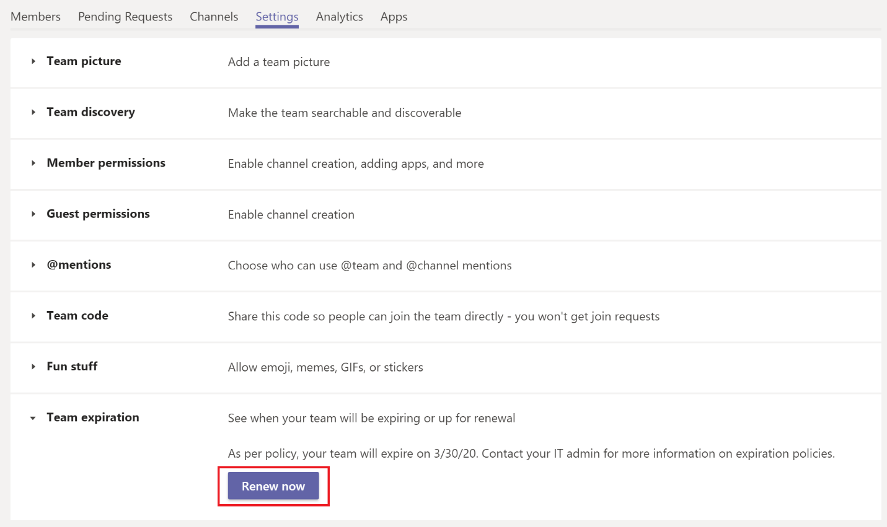

# Срок действия и продление подписки группы в Microsoft Teams

В организациях с большим количеством команд часто есть команды, которые никогда не используются. Это может произойти по нескольким причинам, включая эксперименты с продуктами, краткое сотрудничество в команде или выход владельцев команд из организации. Со временем такие группы могут накапливаться и создавать трудности с ресурсами клиента.  

Чтобы свести к определенному числу неиспользимые команды,  администратор Microsoft 365 использовать политику истечения срока действия группы для автоматической очистки неиспользаемой команды. Так как в командах есть группы, политики срока действия групп также автоматически применяются и к командам.

При применении политики истечения срока действия к команде владелец команды получает уведомление о продлении за 30, 15 и 1 день до истечения срока ее действия. Когда владелец команды получит уведомление, он может нажать кнопку  Продлить сейчас в параметрах команды, чтобы продлить ее.

Если владелец команды не продлевает ее и никаких дополнительных действий с ней не будет, пока не завершится срок действия политики, команда будет перенаирована в состояние "Неявное удаление", то есть ее можно будет восстановить в течение следующих 30 дней.

## Автоматическое продление команды

Иногда владелец команды не может продлить ее, возможно, из-за того, что он забыл продлить подписку или не смог ее продлить. В таких случаях активную команду можно удалить из-за политик срока действия, которые применяются к группе.  

Чтобы предотвратить случайное удаление, автоматическое продление автоматически включено для группы в политике срока действия группы. После того как будет настроена политика истечения срока действия группы, любая команда, которая посещает по крайней мере один канал от участника группы до истечения срока ее действия, автоматически продлевается без вмешательства владельца команды вручную.

## Известные проблемы

**Дата окончания срока действия команды и группы не совпадают**

Перед обновлением команды сначала продлевается группа, которая ее вернула. При продлении для группы устанавливается новая дата окончания срока действия. Эта новая дата может не быть сразу видна в Teams. Синхронизация может занять до 24 часов. Если вы видите несоответствие между датой истечения срока действия для группы и ее группой, подождите 24 часа, прежде чем обращаться за дополнительной поддержкой.