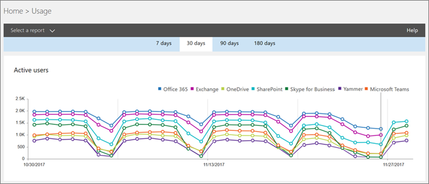

# Использование отчетов об активности в Microsoft Teams 

Вы можете использовать отчеты о действиях в Центр администрирования Microsoft 365, чтобы узнать, как пользователи в вашей организации используют Microsoft Teams. Например, если некоторые еще не используют Microsoft Teams, они могут не знать, как начать работу или понять, как использовать Teams для более эффективной работы и совместной работы. Вы можете использовать отчеты об активности в вашей организации, чтобы определить, где существует приоритетная потребность в обучении и улучшении коммуникации.

## Просмотр отчетов Teams отчетов на панели мониторинга "Отчеты"

1. В [области](https://portal.office.com/adminportal/home)Центр администрирования Microsoft 365 выберите **Использование**  >  **отчетов**.
 
2. На странице **Использование** выберите Выберите **отчет,**  а затем Microsoft Teams в списке отчетов выберите отчет, который вы хотите просмотреть.

## Teams доступных отчетов об активности

В настоящее время вы можете просматривать два отчета об активности:

- [Отчет о действиях пользователей Microsoft Teams](#microsoft-teams-user-activity-report) 
- [Отчет об использовании устройств с Microsoft Teams](#microsoft-teams-device-usage-report) 

### Отчет о действиях пользователей Microsoft Teams

В Teams активности пользователей вы можете просмотреть наиболее распространенные действия, выполняемые пользователями в Teams. Это количество участников чата в канале, количество сообщений в приватном чате и количество участников звонков и собраний. Вы можете увидеть эти сведения для всей организации, а также для каждого отдельного пользователя.

#### Интерпретация Microsoft Teams действий пользователей

Чтобы получить представление о действиях Teams, можно просмотреть диаграммы **Действия** и **Пользователи.**

|Выноска |Описание  |
|--------|-------------|
|**1**   |В Teams активности пользователей можно просмотреть тенденции за последние 7, 30, 90 и 180 дней. Однако если щелкнуть определенный диапазон времени в отчете, в таблице (7) от таблицы от таблицы отскажутся данные за 30 дней до даты (2), когда был создан отчет. |
|**2**   |Для каждого отчета указывается дата создания. Действия обычно отражаются в отчетах с задержкой в 24–48 ч. |
|**3**   |В **представлении** Действия показано количество Microsoft Teams по типам действий. Типы действий: количество сообщений в чате группы, личных сообщений чата, звонков и собраний. |
|**4**   |В **представлении** Пользователи показано количество пользователей по типам действий. Типы действий: количество сообщений в чате группы, личных сообщений чата, звонков и собраний. |
|**5**   |Ось X на диаграммах — это выбранный диапазон дат для конкретного отчета. <ul><li>На **диаграмме Активность** ось Y является количеством указанного действия.</ul></li> <ul><li>На **диаграмме Пользователи** ось Y — это количество пользователей, участвующих в чатах, приватных чатах, звонках и собраниях.</ul></li> |
|**6**   |Вы можете отфильтровать ряд, который отображается на диаграмме, щелкнув элемент легенды. Например, на  диаграмме Активность щелкните или нажмите Сообщения канала **,** Сообщения чата, Звонки **или** Собрания, чтобы увидеть только сведения, относящиеся к этой категории.  При изменении этого выбора данные в таблице-сетке не меняются. |
|**7**   |Список активных команд в самый широкий (180-дневный) период отчетности.  Количество действий зависит от даты.    Чтобы увидеть в таблице следующие сведения, добавьте в нее столбцы. <ul><li>**Имя пользователя** — это адрес электронной почты пользователя. Вы можете отобразить фактический адрес электронной почты или сделать это поле анонимным.</ul></li> <ul><li>**Дата последнего действия (UTC)** — дата последнего участия пользователя в Microsoft Teams действии.</ul></li> <ul><li>**Сообщения канала —** это количество уникальных сообщений, которые пользователь опубликовал в чате группы в указанный период.</ul></li> <ul><li>**Сообщения чата** — это количество уникальных сообщений, которые пользователь опубликовал в приватном чате в указанный период.</ul></li> <ul><li>**Звонки** — это количество звонков, в которые в течение указанного периода времени участвовал пользователь.</ul></li> <ul><li>**Собрания —** это количество собраний по сети, в которые пользователь участвовал в течение указанного периода времени.</ul></li> <ul><li>**Другие действия** — это количество других действий пользователя в группах, среди которых есть и не только: сообщения, приложения, работа с файлами, поиск, просмотр команд и каналов, а также обращение к ним.</ul></li> <ul><li>**При удалении** указывается, удалена ли группа. Если группа удалена, но в ней были действия в отчетный период, она будет отсчитываться в сетке с удаленным и истинным.</ul></li> <ul><li>**Дата удаления —** это дата удаления пользователя.</ul></li> <ul><li>**Продукт назначен** — это список продуктов, которые назначены пользователю.</ul></li>Если политики организации не позволяют просматривать отчеты, в которых есть личные сведения пользователей, можно изменить параметр конфиденциальности для всех отчетов. Ознакомьтесь с **разделом Как скрыть** сведения об уровне пользователя? в разделе Отчеты об активности в предварительной версии Microsoft 365 Admin [Центре просмотра](https://support.office.com/article/activity-reports-in-the-office-365-admin-center-0d6dfb17-8582-4172-a9a9-aed798150263).</ui> |
|**8**   |Щелкните или **нажмите Столбцы,** чтобы добавить или удалить столбцы в таблице. |
|**9**   |Нажмите кнопку **Экспорт,** чтобы экспортировать данные отчета в Excel .csv файл. При этом данные всех пользователей будут экспортированы в формат, позволяющий сортировать и фильтровать их для дальнейшего анализа. Если у вас менее 2000 пользователей, вы можете сортировать и фильтровать таблицы в самом отчете. Если у вас более 2000 пользователей, вам придется экспортировать данные для фильтрации и сортировки отчета. 

### Отчет об использовании устройств с Microsoft Teams

Отчет Teams использования устройств содержит сведения о том, как пользователи подключаются к Teams, включая мобильные приложения. Отчет поможет вам понять, какие устройства являются популярными в организации и сколько пользователей работают в путь.

### Интерпретация Microsoft Teams использования устройств

Чтобы получить представление об использовании Teams, можно просмотреть **диаграммы** Пользователи и **Распределение.**

|Выноска |Описание  |
|--------|-------------|
|**1**   |В Teams на устройствах можно просмотреть тенденции за последние 7, 30, 90 и 180 дней. Однако если щелкнуть определенный диапазон времени в отчете, в таблице (7) от таблицы от таблицы отскажутся данные за 30 дней до даты (2), когда был создан отчет. |
|**2**   |Для каждого отчета указывается дата создания. Действия обычно отражаются в отчетах с задержкой в 24–48 ч. |
|**3**   |В **представлении** Пользователи показано количество пользователей в день по типам устройств. |
|**4**   |В **представлении** "Распределение" показано количество пользователей по устройствам за выбранный период времени.  |
|**5**   | <ul><li>На **диаграмме Пользователи** ось X представляет диапазон дат, выбранный для отчета, а ось Y — количество пользователей по типу устройства.</ul></li> <ul><li>На **оси** X на диаграмме Распределение показаны различные устройства, используемые для подключения Teams а ось Y — количество пользователей, использующих устройство.</ul></li> |
|**6**   |Вы можете отфильтровать ряд, который отображается на диаграмме, щелкнув элемент легенды. Например, на  диаграмме Рассылка щелкните или нажмите **Windows**, **Mac**, **Linux,** **веб,** **iOS** или **Android,** чтобы увидеть только сведения, относящиеся к этой диаграмме. При изменении этого выбора данные в таблице-сетке не меняются. |
|**7**   |Список активных команд в самый широкий (180-дневный) период отчетности.  Количество действий зависит от даты.    Чтобы увидеть в таблице следующие сведения, добавьте в нее столбцы. <ul><li>**Имя пользователя** — это адрес электронной почты пользователя. Вы можете отобразить фактический адрес электронной почты или сделать это поле анонимным.</ul></li> <ul><li>**Дата последнего действия (UTC)** — дата последнего участия пользователя в Teams действии.</ul></li> <ul><li>**При удалении** указывается, удалена ли группа. Если группа удалена, но в ней были действия в отчетный период, она будет отсчитываться в сетке с удаленным и истинным.</ul></li><ul><li>**Дата удаления —** это дата удаления пользователя.</ul></li> <ul><li>**Windows,** если пользователь был активен в клиенте Teams настольного компьютера Windows компьютере.</ul></li> <ul><li>**Если** пользователь был активен в клиенте Teams на компьютере с macOS, выбирается компьютер Mac.</ul></li>  <ul><li>**Linux** выбирается, если пользователь был активен в Teams настольном клиенте на компьютере Linux.</ul></li>   <ul><li>**Веб-клиент** выбирается, если пользователь был активен в Teams клиента.</ul></li> <ul><li>**Выбрана iOS,** если пользователь был активен в мобильном клиенте Teams для iOS.</ul></li> <ul><li>**Телефон с Android** выбирается, если пользователь был активен в мобильном Teams для Android.</ul></li></li> <ui>Если политики организации не предотвращают просмотр отчетов, в которых есть личная информация пользователя, вы можете изменить параметр конфиденциальности для всех отчетов. Ознакомьтесь с **разделом Как скрыть** сведения об уровне пользователя? в разделе Отчеты об активности в предварительной версии Microsoft 365 Admin [Центре просмотра](https://support.office.com/article/activity-reports-in-the-office-365-admin-center-0d6dfb17-8582-4172-a9a9-aed798150263).</ui> |
|**8**   |Щелкните или **нажмите Столбцы,** чтобы добавить или удалить столбцы в таблице. |
|**9**   |Нажмите кнопку **Экспорт,** чтобы экспортировать данные отчета в Excel .csv файл. При этом данные всех пользователей будут экспортированы в формат, позволяющий сортировать и фильтровать их для дальнейшего анализа. Если у вас менее 2000 пользователей, вы можете сортировать и фильтровать таблицы в самом отчете. Если у вас более 2000 пользователей, вам придется экспортировать данные для фильтрации и сортировки отчета. 

## Кто доступ к отчетам Teams действий

Доступ к отчетам об активности могут получить пользователи, которые назначены:

- Роль глобального администратора
- Роль администратора для конкретного продукта (Exchange, Skype для бизнеса или SharePoint)
- Роль "Читатель отчетов"

### Роль "Читатель отчетов"

Роль "Читатель отчетов" можно назначить людям, у которых нет прав администратора, но они отвечают за внедрение или отслеживание использования лицензий Teams. Чтобы узнать, как назначать роли, ознакомьтесь [со](/azure/active-directory/fundamentals/active-directory-users-assign-role-azure-portal)статьей Назначение ролей администратора и администратора пользователям с Azure Active Directory.

## Другие сведения на панели мониторинга "Отчеты"

### Мини-мини-приложения активности

Панель мониторинга отчетов содержит данные об использовании из Teams в мини-приложениях активности, которое позволяет просматривать различные продукты, в которых можно узнать, как пользователи общаются и совместно используют другие службы Microsoft 365 или Office 365.

### Teams карточка действия

На Teams отчетов вы можете получить общее представление о действиях в Teams, включая количество активных пользователей, чтобы быстро понять, сколько пользователей используют службу. Щелкнув карточку действия на панели мониторинга, вы Teams отчет о действиях пользователей. 

