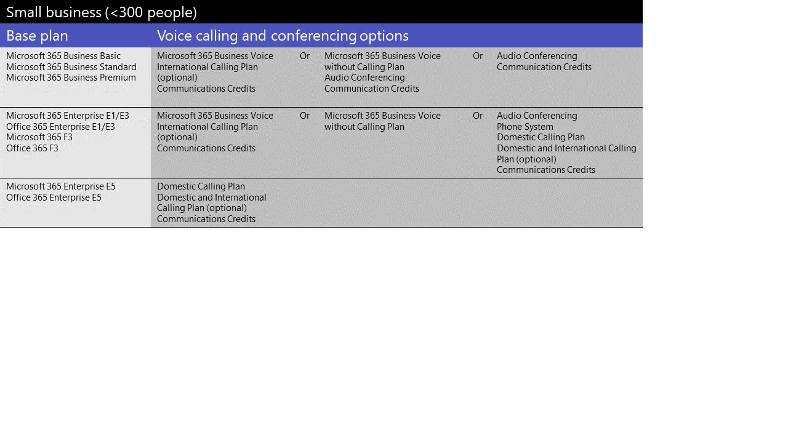
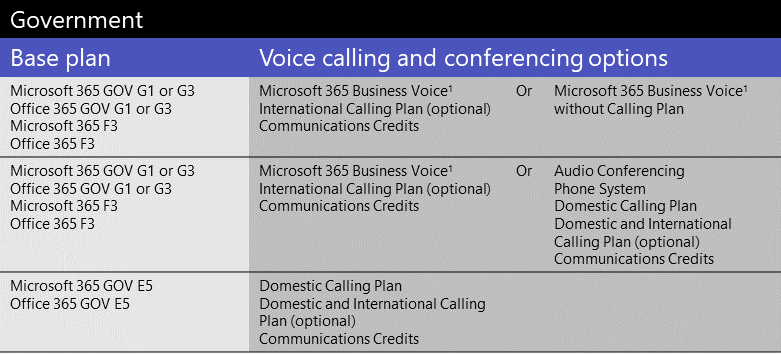

# Лицензии на надстройки Microsoft TeamsMicrosoft Teams add-on licenses

## Что такое лицензии на надстройки?What are add-on licenses?

Лицензии на надстройки — это лицензии на определенные функции Microsoft Teams.Add-on licenses are licenses for specific Microsoft Teams features. Они дают возможность добавлять функции только для тех пользователей в организации, которым они нужны.They give you the flexibility to add features only for users in your organization who need them. Чтобы добавить функцию, купите одну дополнительную лицензию для каждого пользователя, который будет ее использовать.To add a feature, buy one add-on license for each user who will use it.

## Для каких возможностей доступны лицензии?What features can I get with add-on licenses?

Вот список функций, которые можно добавить с помощью лицензий на надстройки Teams.Here's a list of features that you can add with Teams add-on licenses. Доступные варианты лицензирования надстройки зависят от плана Microsoft 365 или Office 365.The add-on licensing options available to you depend on the Microsoft 365 or Office 365 plan you have.

|||||
|:-----|:-----|:-----|:-----|
|**Функция****Feature**   |**Описание****Description**   |**Малый бизнес (<300 пользователей)****Small business (<300 users)**|**Крупный бизнес (>300 пользователей)****Large business (>300 users)**|
**Корпоративная голосовая связь Microsoft 365****Microsoft 365 Business Voice**   | [Business Voice](../business-voice/whats-business-voice.md) — это телефонное решение, предназначенное для малого и среднего бизнеса с количеством пользователей до 300 человек, которое вмещает в себя телефонную систему, аудиоконференцию, план внутренних звонков и другие функции.[Business Voice](../business-voice/whats-business-voice.md) is a telephony solution designed for small and medium businesses of up to 300 users that bundles Phone System, Audio Conferencing, a Domestic Calling Plan, and more. Вы получите такие возможности телефонной системы, как голосовая почта, ИД звоняющего, парк звонков, переадстройка звонков, автоответчики и очереди звонков.Phone System capabilities that you'll get include voicemail, caller ID, call park, call forwarding, auto attendants, and call queues.   Чтобы узнать, доступна ли бизнес-голосовая информация в вашей стране или регионе, см. в этом [вопросе.](../business-voice/country-region-availability.md)To find out whether Business Voice is available in your country or region, see [Country and region availability for Business Voice](../business-voice/country-region-availability.md). Сведения о ценах см. [в сведениях о ценах для бизнеса Voice.](https://go.microsoft.com/fwlink/?linkid=2127221)For pricing info, see [Pricing for Business Voice](https://go.microsoft.com/fwlink/?linkid=2127221).   |&#x2713;&#x2713;||
|**Аудиоконференции****Audio Conferencing**   |Иногда людям в вашей организации требуется воспользоваться телефоном, чтобы позвонить на собрание Teams, а не компьютер.Sometimes people in your organization will need to use a phone to call in to a Teams meeting instead their computer. Настройка [аудиоконференций](../audio-conferencing-in-office-365.md) для пользователей, планющих или ведющих собрания.Set up [Audio Conferencing](../audio-conferencing-in-office-365.md) for users who schedule or leads meetings.   Чтобы узнать, доступна ли функция Аудиоконцеренции в вашей стране или регионе, перейдите в раздел [Страны и регионы, доступные для Аудиоконференций и Тарифные планы](../country-and-region-availability-for-audio-conferencing-and-calling-plans/country-and-region-availability-for-audio-conferencing-and-calling-plans.md).To find out whether Audio Conferencing is available in your country or region, see [Country and region availability for Audio Conferencing and Calling Plans](../country-and-region-availability-for-audio-conferencing-and-calling-plans/country-and-region-availability-for-audio-conferencing-and-calling-plans.md). Информация о ценах приведена в разделе [Цены на аудиоконференции](https://go.microsoft.com/fwlink/?linkid=799762).For pricing info, see [Pricing for Audio Conferencing](https://go.microsoft.com/fwlink/?linkid=799762).     Если у вас малый или средний бизнес с количеством пользователей до 300 человек и в настоящее время нет лицензий на аудиоконференцию, вы можете бесплатно получить аудиоконференцию в течение года.If you're a small or medium-sized business with up to 300 users and you currently don’t have Audio Conferencing licenses, you can get Audio Conferencing free for one year. С 1 октября 2020 г. бесплатное предложение аудиоконференций доступно для пользователей с лицензиями на Microsoft 365 бизнес базовый, бизнес стандартный, бизнес премиум, корпоративный E1 или E3.Starting October 1, 2020, the free Audio Conferencing offer is available to users who have Microsoft 365 Business Basic, Business Standard, Business Premium, Enterprise E1, or Enterprise E3 licenses. Подробнее см. в настройках аудиоконференций для малого и [среднего бизнеса.](../audio-conferencing-smb.md)To learn more, see [Set up Audio Conferencing for small and medium businesses](../audio-conferencing-smb.md).|&#x2713;&#x2713;|&#x2713;&#x2713;|
|**Бесплатные номера****Toll free numbers** |Если вы хотите получить бесплатные номера для аудиоконференций, автосчетов или очередей вызовов, необходимо настроить [кредиты на](../set-up-communications-credits-for-your-organization.md)связь.If you want toll-free numbers for Audio Conferencing, auto attendants, or call queues, you must [set up Communications Credits](../set-up-communications-credits-for-your-organization.md).   |&#x2713;&#x2713;|&#x2713;&#x2713;|
|**Телефонная система****Phone System**   |[Телефонная](../what-is-phone-system-in-office-365.md) система — это hosted telephone service (телефонная система), которая позволяет управлять звонками и возможностями частного филиала Exchange (PBX) с возможностью подключения к телефонной сети общего звонков (STN).[Phone System](../what-is-phone-system-in-office-365.md) is a hosted telephone service that gives you call control and Private Branch Exchange (PBX) capabilities, with options for connecting to the Public Switched Telephone Network (PSTN). К функциям телефонной системы относятся облачная голосовая почта, ИД звониющего, парк звонков, переадстройка звонков, автоответы, очереди звонков, переключение звонков, ИД звониющего и другие.Phone System features include cloud voicemail, caller ID, call park, call forwarding, auto attendants, call queues, call transfer, caller ID, and more.  Чтобы узнать больше, узнайте о том, что вы получаете в [телефонной системе.](../here-s-what-you-get-with-phone-system.md)To learn more, see [Here's what you get with Phone System](../here-s-what-you-get-with-phone-system.md). Сведения о ценах см. [в ценах на телефонную систему.](https://go.microsoft.com/fwlink/?linkid=799763)For pricing info, see [Pricing for Phone System](https://go.microsoft.com/fwlink/?linkid=799763).    |&#x2713;1&#x2713;1|&#x2713;&#x2713;|
|**Планы звонков****Calling Plans**   |Если вы хотите, чтобы пользователи могли звонить на номера телефонов за пределами организации, получите [план звонков.](../calling-plans-for-office-365.md)If you want users to be able to call phone numbers outside your organization, get a [Calling Plan](../calling-plans-for-office-365.md). Существуют планы внутренних и международных и внутренних звонков.There are Domestic Calling Plans and Domestic and International Calling Plans. Сведения о ценах см. [в сведениях о ценах на планы звонков.](https://go.microsoft.com/fwlink/?linkid=799761 )For pricing info, see [Pricing for Calling Plans](https://go.microsoft.com/fwlink/?linkid=799761 ).    |&#x2713;1&#x2713;1|&#x2713;&#x2713;|
|**Комнаты Microsoft Teams****Microsoft Teams Rooms**   |[Комнаты Microsoft Teams](../rooms/index.md) — это не надстройка, а функция, которая позволяет обмениваться видео, звуком и содержимым в конференц-залах.[Microsoft Teams Rooms](../rooms/index.md) isn't an add-on, but a feature that brings video, audio, and content sharing to conference rooms. См. [лицензирование комнат собраний Teams.](../rooms/rooms-licensing.md)See [Teams Meeting Room Licensing](../rooms/rooms-licensing.md).    |&#x2713;&#x2713;|&#x2713;&#x2713;|
|**Advanced Communications****Advanced Communications**   |[Расширенные возможности](advanced-communications.md) связи включают расширенные возможности звонков и собраний, такие как большие собрания, настройка собраний, интеграция коммуникаций и расширенные средства управления коммуникацией.[Advanced Communications](advanced-communications.md) includes enhanced calling and meeting capabilities such as large meetings, meetings customization, communications integrations, and advanced tools for communications management. С помощью трансляций до 20 000 участников и интерактивных собраний с 1000 участников вы до 1000 сове до 1000 аудиторий.Reach larger audiences with live events for up to 20,000 participants and interactive meetings for 1,000 participants. Дополнительные возможности включают настраиваемый фирменный "вестибюль" для проведения собраний, возможность интегрировать собрания и вызовы в рабочий процесс, а также инструменты для отслеживания, отслеживания и анализа данных на пользователях и устройствах.Additional features include custom branded meeting lobby to tailor your meetings, the ability to integrate meetings and calling to workflows, and tools to monitor, track, and analyze data on users and devices.   |&#x2713;&#x2713;|&#x2713;&#x2713;|

1 Если у вас малый или средний бизнес с планом Microsoft 365 корпоративный, вы все равно можете приобрести лицензии на надстройки для этих голосовых функций, но мы рекомендуем рекомендовать план [Microsoft 365 бизнес](https://www.microsoft.com/microsoft-365/compare-all-microsoft-365-products?&activetab=tab:primaryr2) и бизнес-голосовую голосовую функцию. 1 If you're a small or medium-sized business who has a Microsoft 365 Enterprise plan, you can still buy add-on licenses for these voice features, however, we recommend that you consider a [Microsoft 365 Business](https://www.microsoft.com/microsoft-365/compare-all-microsoft-365-products?&activetab=tab:primaryr2) plan and [Business Voice](https://www.microsoft.com/microsoft-365/business/business-voice).

## Какие голосовые функции доступны в моем плане?What voice features are available with my plan?

Узнайте, какие лицензии на надстройки необходимы для получения голосовых функций в Teams (в зависимости от того, какой у вас план).See what add-on licenses you need to get voice features in Teams, depending on the plan you have.

В зависимости от того, что вам нужно, рекомендуем сравнить, стоит ли перейти на план с этими функциями?Depending on the voice features that you want, we recommend comparing whether it's more cost effective for you to switch to a plan that includes those features. Например, для большинства крупных организаций приобретение пакета программного обеспечения в плане Microsoft 365 корпоративный приведет к снижению общей стоимости.For example, for most large organizations, buying a bundle of software in a Microsoft 365 Enterprise plan will result in lower overall cost. Как правило, покупка нескольких лицензий на надстройки по отдельности, а не в рамках плана, может оказаться выше совокупная стоимость.Typically, when you buy several add-on licenses individually instead of as part of a plan, you may end up with a higher combined cost.

#### [**Малый бизнес****Small business**](#tab/small-business/)

Если у вас малый или средний бизнес (менее 300 пользователей), функции голосовой почты можно получить четырьмя способами:If you're a small or medium-sized business (less than 300 users), you have four ways to get voice features:

- Купите план Microsoft 365 бизнес и голосовые решения Microsoft 365 бизнес.Buy a Microsoft 365 Business plan and Microsoft 365 Business Voice.
- Приобретай план корпоративный E1 или E3 и голосовые решения Microsoft 365 бизнес.Buy an Enterprise E1 or E3 plan and Microsoft 365 Business Voice.
- Приобретайте план E1 или E3 и добавляйте функции голосовой почты по отдельности.Buy an Enterprise E1 or E3 plan and add voice features individually.
- Приобретай план E5 с голосовой голосовой функцией.Buy an Enterprise E5 plan, which includes voice features.

Для Microsoft 365 Business Voice можно выбрать один из двух вариантов:For Microsoft 365 Business Voice, you have two options to choose from:

- **Microsoft 365 Business Voice** с планом звонков. Получите это, если вы хотите, чтобы майкрософт обрабатывала управление номерами телефонов и выставление счета.**Microsoft 365 Business Voice with a Calling Plan**: Get this if you want all phone number management and billing to be handled by Microsoft.
- **Голосовая связь Microsoft 365** бизнес без плана звонков (прямая маршрутка). Эта возможность нужна, если вы хотите, чтобы все услуги по управлению номерами телефонов и выставлению счета обрабатывались сторонним поставщиком телефонных услуг.**Microsoft 365 Business Voice without a Calling Plan (Direct Routing)**: Get this if you want all phone number management and billing to be handled by your third-party telephone provider. Вам потребуется настроить и развернуть Direct [Routing](../direct-routing-landing-page.md) для подключения ваших локального граничного контроллера сеанса (SBCs) к Microsoft 365 или Office 365.You'll need to set up and deploy [Direct Routing](../direct-routing-landing-page.md) to connect your on-premises Session Border Controllers (SBCs) to Microsoft 365 or Office 365.

Чтобы узнать больше, см. также: что нужно приобрести для использования голосовой почты [Microsoft 365 бизнес?](../business-voice/what-to-buy.md)To learn more, see [What do I need to buy to use Microsoft 365 Business Voice?](../business-voice/what-to-buy.md).

Вот сводка на основе плана лицензирования.Here's a summary, based on licensing plan.

  

Если аудиоконференция не поддерживается в вашей стране или регионе, вы можете получить план Microsoft 365 корпоративный E5 без плана аудиоконференции или Office 365 корпоративный E5 без плана аудиоконференции.If Audio Conferencing isn't supported in your country or region, you have the option to get a Microsoft 365 Enterprise E5 without Audio Conferencing plan or an Office 365 Enterprise E5 without Audio Conferencing plan.

Если у вас уже есть план Microsoft 365 корпоративный или Office 365 корпоративный, вы все равно можете приобрести лицензии на надстройки для отдельных голосовых функций.If you already have a Microsoft 365 Enterprise or Office 365 Enterprise plan, you can still buy add-on licenses for individual voice features. Однако у вас есть возможность перейти на [план Microsoft 365 бизнес](https://www.microsoft.com/microsoft-365/compare-all-microsoft-365-products?&activetab=tab:primaryr2) и Microsoft [365 Business Voice.](https://www.microsoft.com/microsoft-365/business/business-voice)However, you have the option to switch to a [Microsoft 365 Business](https://www.microsoft.com/microsoft-365/compare-all-microsoft-365-products?&activetab=tab:primaryr2) plan and [Microsoft 365 Business Voice](https://www.microsoft.com/microsoft-365/business/business-voice). В некоторых случаях, в зависимости от нужных функций, может быть более эффективно получить план Microsoft 365 бизнес с Microsoft 365 Business Voice.In some cases, depending on the features that you want, it might be more cost effective to get a Microsoft 365 Business plan with Microsoft 365 Business Voice.

> [!NOTE]
> Если вам нужно использовать сторонную телефонную [службу,](../direct-routing-landing-page.md) в вашей организации развернута прямая маршрутизации или если планы звонков недоступны в вашей стране или регионе, для голосовой связи необходимо использовать прямую маршрутику.If you need to use a third-party telephone service, [Direct Routing](../direct-routing-landing-page.md) is deployed in your organization, or if Calling Plans aren't available in your country or region, you need to use Direct Routing for voice features.

#### [**Enterprise****Enterprise**](#tab/enterprise/)

Если вы работаете в крупной организации или организации (более 300 пользователей), функции голосовой почты можно получить двумя способами:If you're a large business or enterprise organization (more than 300 users), you have two ways to get voice features:

- Приобретайте план E1 или E3 и добавляйте функции голосовой почты по отдельности.Buy an Enterprise E1 or E3 plan and add voice features individually.
- Приобретай план E5 с голосовой голосовой функцией.Buy an Enterprise E5 plan, which includes voice features.

Вот сводка на основе плана лицензирования.Here's a summary, based on licensing plan.

  

Если аудиоконференция не поддерживается в вашей стране или регионе, вы можете получить план Microsoft 365 корпоративный E5 без плана аудиоконференции или Office 365 корпоративный E5 без плана аудиоконференции.If Audio Conferencing isn't supported in your country or region, you have the option to get a Microsoft 365 Enterprise E5 without Audio Conferencing plan or an Office 365 Enterprise E5 without Audio Conferencing plan.

Подробнее см. в корпоративных [планах Microsoft 365](https://www.microsoft.com/microsoft-365/compare-microsoft-365-enterprise-plans) и [Office 365 корпоративный.](https://www.microsoft.com/microsoft-365/business/compare-more-office-365-for-business-plans)To learn more, see [Microsoft 365 Enterprise plans](https://www.microsoft.com/microsoft-365/compare-microsoft-365-enterprise-plans) and [Office 365 Enterprise plans](https://www.microsoft.com/microsoft-365/business/compare-more-office-365-for-business-plans).

> [!NOTE]
> Если вам нужно использовать сторонную телефонную [службу,](../direct-routing-landing-page.md) в вашей организации развернута прямая маршрутизации или если планы звонков недоступны в вашей стране или регионе, для голосовой связи необходимо использовать прямую маршрутику.If you need to use a third-party telephone service, [Direct Routing](../direct-routing-landing-page.md) is deployed in your organization, or if Calling Plans aren't available in your country or region, you need to use Direct Routing for voice features.

#### [**Образование****Education**](#tab/education/)

В учебных заведениях и других образовательных организациях функции голосовой почты можно получить тремя способами.For schools and other academic organizations, you have three ways to get voice features.

- Купите план для EDU A1 или A3 и Голосовые решения Microsoft 365 бизнес.Buy an EDU A1 or A3 plan and Microsoft 365 Business Voice.
- Приобретайте план для EDU A1 или A3 и добавляйте функции голосовой почты по отдельности.Buy an EDU A1 or A3 plan and add voice features individually.
- Купите план A5 для EDU, который включает голосовые функции.Buy an EDU A5 plan, which includes voice features.

Вот сводка на основе плана лицензирования.Here's a summary, based on licensing plan.

  

  1 Доступно только для организаций с менее чем 300 пользователями.1 Only available for organizations with less than 300 users.

Подробнее см. в планах [Microsoft 365 для образования](https://www.microsoft.com/education/buy-license/microsoft365) и Office [365 для образования.](https://www.microsoft.com/microsoft-365/academic/compare-office-365-education-plan)To learn more, see [Microsoft 365 Education](https://www.microsoft.com/education/buy-license/microsoft365) and [Office 365 Education plans](https://www.microsoft.com/microsoft-365/academic/compare-office-365-education-plan).

> [!NOTE]
> Если вам нужно использовать сторонную телефонную [службу,](../direct-routing-landing-page.md) в вашей организации развернута прямая маршрутизации или если планы звонков недоступны в вашей стране или регионе, для голосовой связи необходимо использовать прямую маршрутику.If you need to use a third-party telephone service, [Direct Routing](../direct-routing-landing-page.md) is deployed in your organization, or if Calling Plans aren't available in your country or region, you need to use Direct Routing for voice features.

#### [**Государственные правительственные****Government**](#tab/government/)

В государственных организациях США (GCC) функции голосовой почты можно получить тремя способами.For US government organizations (GCC only), there are three ways to get voice features.

- Купите план GOV G1 или G3 и голосовые решения Microsoft 365 бизнес.Buy a GOV G1 or G3 plan and Microsoft 365 Business Voice.
- Приобретйте план GOV G1 или G3 и добавьте функции облачной голосовой почты по отдельности.Buy a GOV G1 or G3 plan and add cloud voice features individually.
- Приобрести план G5 GOV, который включает функции голосовой почты.Buy a GOV G5 plan, which includes voice features.

Вот сводка на основе плана лицензирования.Here's a summary, based on licensing plan.

  

  1 Доступно только для организаций с менее чем 300 пользователями.1 Only available for organizations with less than 300 users.

Подробнее см. в планах [Microsoft 365 для](https://www.microsoft.com/microsoft-365/government/) государственных органов и [Office 365 для](https://www.microsoft.com/microsoft-365/government/compare-office-365-government-plans)государственных органов.To learn more, see [Microsoft 365 Government](https://www.microsoft.com/microsoft-365/government/) and [Office 365 Government plans](https://www.microsoft.com/microsoft-365/government/compare-office-365-government-plans).

> [!NOTE]
> Если вам нужно использовать сторонную телефонную [службу,](../direct-routing-landing-page.md) в вашей организации развернута прямая маршрутизации или если планы звонков недоступны в вашей стране или регионе, для голосовой связи необходимо использовать прямую маршрутику.If you need to use a third-party telephone service, [Direct Routing](../direct-routing-landing-page.md) is deployed in your organization, or if Calling Plans aren't available in your country or region, you need to use Direct Routing for voice features.

#### [**Некоммерческие организации****Nonprofit**](#tab/nonprofit/)

Если вы некоммерческая организация, у вас есть четыре способа получить голосовые функции.If you're a nonprofit organization, you have four ways to get voice features.

- Купите план Microsoft 365 бизнес базовый для некоммерческих организаций или Microsoft 365 бизнес стандартный для некоммерческих организаций и Microsoft 365 Business Voice.Buy a Microsoft 365 Nonprofit Business Basic or Microsoft 365 Nonprofit Business Standard plan and Microsoft 365 Business Voice.
- Купите план для некоммерческих организаций E1 или E3 и microsoft 365 Business Voice.Buy a Nonprofit E1 or E3 plan and Microsoft 365 Business Voice.
- Приобретайте план для некоммерческих организаций E1 или E3 и добавляйте функции голосовой почты по отдельности.Buy a Nonprofit E1 or E3 plan and add voice features individually.
- Купите некоммерческий E5, который включает функции голосовой почты.Buy a Nonprofit E5, which includes voice features.

Вот сводка на основе плана лицензирования.Here's a summary, based on licensing plan.

  

  1 Доступно только для организаций с менее чем 300 пользователями.1 Only available for organizations with less than 300 users.

Подробнее см. в [предложениях Microsoft 365 и Office 365 для некоммерческих организаций.](https://www.microsoft.com/microsoft-365/nonprofit/office-365-nonprofit-plans-and-pricing)To learn more, see [Microsoft 365 and Office 365 Nonprofit offers](https://www.microsoft.com/microsoft-365/nonprofit/office-365-nonprofit-plans-and-pricing).

> [!NOTE]
> Если вам нужно использовать сторонную телефонную [службу,](../direct-routing-landing-page.md) в вашей организации развернута прямая маршрутизации или если планы звонков недоступны в вашей стране или регионе, для голосовой связи необходимо использовать прямую маршрутику.If you need to use a third-party telephone service, [Direct Routing](../direct-routing-landing-page.md) is deployed in your organization, or if Calling Plans aren't available in your country or region, you need to use Direct Routing for voice features.

#### [**Предложения по пробной версиям****Trial offers**](#tab/trial/)

### Предложения по пробным версиям для планов лицензированияTrial offers for licensing plans

В ответ на рост потребности в удаленной работе (или удаленной работе из дома) корпорация Майкрософт предлагает несколько бесплатных пробных предложений Teams для государственных, образовательных и некоммерческих организаций.In response to an increased need for people to work remotely (or work from home), Microsoft has several free Teams trial offers for government, educational, and non-profit organizations. Пробные планы доступны для таких планов:Trials are available for these plans:

- Пробная версия Office 365 корпоративный [E1](../e1-trial-license.md) (она прекращена с 1 июля 2020 г.), пробная версия E3 и E5Office 365 Enterprise [E1 trial](../e1-trial-license.md) (discontinued as of July 1, 2020), E3 trial, and E5 trial
- Пробная версия Office 365 для [образования A1](../teams-edu-licensing.md)Office 365 Education [A1 trial](../teams-edu-licensing.md)
- Пробная версия Office 365 для государственных [служб G1](../g1-trial-license.md) (прекращена с 1 июля 2020 г.)Office 365 Government [G1 trial](../g1-trial-license.md) (discontinued as of July 1, 2020)

Чтобы зарегистрироваться для регистрации в пробном предложении, [см.](https://transform.microsoft.com/customer-trials?tab=requestnewtrial)To sign up for a trial offer, see [Sign up for a trial offer](https://transform.microsoft.com/customer-trials?tab=requestnewtrial).

### Пробные предложения для голосовых функцийTrial offers for voice features

Вот краткое описание предложений пробной части голосовых функций.Here's a summary of voice feature trial offers.

  

 Базовый план не должен быть пробным предложением для использования этих пробных возможностей голосовой почты.Your base plan doesn't have to be a trial offer to use any of these trials for voice features. Вы можете использовать план Microsoft 365 бизнес либо план Enterprise, Для государственных организаций, образовательных или некоммерческих организаций с любыми пробными предложениями для голосовых функций.You can use a Microsoft 365 Business plan or an Enterprise, Government, Education, or Nonprofit plan with any of the trial offers for voice features. Чтобы увидеть доступные предложения ознакомиться с пробными версиями и надстройки, в Центре администрирования Microsoft 365 перейдите в службы покупки вы выставлений счета, выберите другие категории, которые могут вас заинтересовать, а затем выберите "Надстройки".   >    To see available trial offers and add-ons, in the Microsoft 365 admin center, go to **Billing** > **Purchase services**, select **Other categories that might interest you**, and then select **Add-ons**.

  Для каждого из этих параметров голосовой связи и собраний необходимы кредиты на [связь,](../set-up-communications-credits-for-your-organization.md) если у вас есть бесплатные номера или требуется добавить дополнительные минуты для звонков из собраний или для внутренних и международных звонков по ННР.For each these voice and conferencing options, [Communications Credits](../set-up-communications-credits-for-your-organization.md) are required if you have toll-free numbers or if you need to add additional minutes for users to dial out from meetings or for users to make domestic and international PSTN calls.

 Кроме того, ознакомьтесь со:Also, check out:

- [Бесплатная версия TeamsFree version of Teams](../manage-freemium.md)
- [Ознакомительный опыт](../teams-exploratory.md) Teams — в настоящее время предложение пробных возможностей голосовой связи для использования в этих версиях Teams не предлагается.[Teams Exploratory experience](../teams-exploratory.md) - currently there are no trial offers for voice features for use with the Teams Exploratory experience.
- [Телефонная система Майкрософт — лицензия виртуального](virtual-user.md) пользователя[Microsoft Phone System - Virtual User](virtual-user.md) license

* * *

## Нужна помощь?Need help?

Вам нужно поговорить о параметрах надстройки?Need to talk to someone about the add-on options? [Обратитесь в службу поддержки продуктов для бизнеса — справку для администраторов](https://support.office.com/article/32a17ca7-6fa0-4870-8a8d-e25ba4ccfd4b).[Contact support for business products - Admin Help](https://support.office.com/article/32a17ca7-6fa0-4870-8a8d-e25ba4ccfd4b).

## Статьи по темеRelated topics

- [Назначение лицензий на надстройки TeamsAssign Teams add-on licenses](assign-teams-add-on-licenses.md)
- [Управление доступом пользователей к TeamsManage user access to Teams](../user-access.md)
- [Описание службы TeamsTeams service description](https://docs.microsoft.com/office365/servicedescriptions/teams-service-description)
