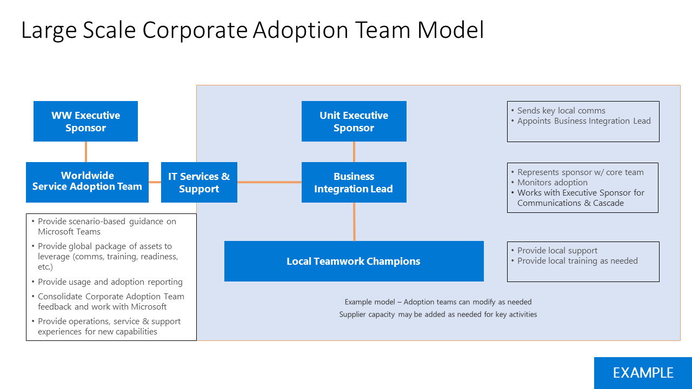

# Определение результатов деятельности и успеха для внедрения вашей группами Майкрософт

Для каждого бизнес-сценарий или службу, которую вы модернизации крайне важна для определения цель для бизнеса. Будет собранные эти сведения для начальной сценариев, сопоставленный их на предыдущем этапе. При подготовке для реализации масштаба, необходимо пересмотреть параметры, а затем разверните этих критериев важные успеха.
  
Ниже приведен рекомендации для сопоставления учетных записей этим условиям. Существует множество допустимый подходов к этому шагу. Можно выполните наших руководство по или выполните руководство партнера Майкрософт, которым могут работа. Независимо от выбранного метода, убедитесь в том, что вашей деятельности поддерживаются технического внедрения служб и общие задачи вашей организации.
  
Существует четыре категории результатов, которые могут их приоритета для бизнеса. Они связаны между собой и форме foundation модернизации и цифровые преобразования, которые смогут работать отдельных сотрудников.  

Пример результатов в каждой категории являются:

- **Организационные**
   - Культурные преобразования
   - Возможность удержания сотрудников
   - Приобретение способностями
   - Социальные сотрудничества
   - Гибкость здесь и эксплуатации 

- **Культурные**
   - Сотрудник пользователей
   - Рекомендации по сотрудников
   - Отзывы клиентов
   - Инновации меры (например, ввод данных форум идеи, hackathons, форм сотрудничества инновации продукта)

- **Реальные**
   - Влияние взаимодействия клиентов (быстрее служба, сокращение службы происшествия, участие в программе ссылок/постоянного клиента)
   - Сокращение расходов
   - Дохода
   - Безопасность данных
   - Упрощение процесса
   - Пенсионного обеспечения устаревших систем
   
- **Индивидуальное**
   - Использование средств желаемую
   - Morale сотрудников
   - Производительность труда сотрудников
   - Деловые сотрудников
   - Создание представления
 
В общем случае следует рассматривать эти меры, агрегирование для создания частное изменений для вашей компании таким образом:

## Выбор стратегии Включение службы

Команды является преобразовавших технологии, поэтому в зависимости от размера организации и существующих технологий, может потребоваться различных подходов. Рассмотрите следующие стратегии:

| Сначала групп | Основные группы | Команды переходят большой | Скайп рядом друг с другом | Миграция |
|------------ | ---------- | ------------ | ------------------ | --------- |
| Привести развертывания облака с группами | Включение сценария должно происходить совместной работы с группами | Всех сотрудников в группы и всей организации рабочих групп | Включение рабочих групп и Скайп для бизнеса | Перенос пользователей из Скайп для бизнеса в группы |
| -Применимо к клиентам новые или низкой об использовании Office 365  -Привести с группами в сценарии конкретного клиента  -Highlight интегрированное взаимодействие с пользователем и ускорение времени значение для Office 365  -Проведение планирования Включение рабочей нагрузки вместе, чтобы избежать последовательной реализации | -Позволяют группам наряду с OneDrive и SharePoint Online  -Создание интрасети организации для совместного использования ресурсов новости и видео с Microsoft потока **Эффективная совместная работа**:  Teams SharePoint Yammer Планировщик PowerApps |-Для клиентов с менее 1000 рабочих мест (Текущее ограничение) -Включите на нескольких совместной работы в организации с помощью одной команды для всех -Автоматизируйте распространенные задачи (отпусков запросы, опросы, оперативное сотрудничества) |-Используйте приемы основных групп для ускорения совместной работы -Highlight сценарий рекомендации, основанные на размер и набор функций требуется на собрания -Используйте Скайп для бизнеса для вызова enterprise, взаимодействия и гибридных сценариев -Ориентиры общедоступных возможность планирования. |-Move план для групп из Скайп для бизнеса путем создания схема стратегии обновления для клиента -Присоединение к график выпуска компонента -Рекомендуется, включая рядом со стороны и основных групп для облегчения перехода

Ниже приведены рекомендации для большинства организаций клиентов корпорации Майкрософт. Тем не менее существуют исключения. Ознакомьтесь с рекомендациями для любого сценария, не представленных здесь, задать свои вопросы сообществу поездок внедрения или расширить эту группы или партнерской сети Майкрософт.

- **Выбор первой группы или групп основных**: большинство организаций имеют существующих инвестиций в технологии корпорации Майкрософт. Вы может возможность более одного рабочей нагрузки по одному, такие как Exchange Online OneDrive для бизнеса, или на сервере SharePoint. В таких случаях Выбор первой группы или групп основных подойдет мудрой. Оно позволит пользователям получить используется для расширенного совместной работы групп. Рабочую группу проекта совместной работы можно затем запланируйте развертывание дополнительных возможностей и обучение и поддержка, необходимые для успешного выполнения. 

- **Выберите большой перейдите групп**: В новых организациях клиента Office 365, чаще всего наиболее групп перейдите большой подход для сведения к минимуму испытания изменений, вызванных обучения новую технологию несколько раз. Вы получите наибольшие преимущества при использовании, позволяя группам основных совместной работы и собраний, SharePoint, OneDrive, планировщик работы, и других рабочих нагрузок и позволяя вашим сотрудникам узнать о них в контексте группы развертывания. 

    Команды перейти велик также стратегия предпочитаемый включение для организаций, в разделе 1 000 сотрудников, чтобы упростить их взаимодействия и сотрудничества. С помощью команды всей организации можно свести людей вместе, чтобы просмотреть общие задачи и инициативы на любом устройстве. 

- **Нажмите кнопку рядом**: для организаций, использующих Скайп для бизнеса для аудиоконференций, поддерживает устройства конференц-связи или возможности облака голосовой связи, рекомендуется выполнить рабочих групп и Скайп рядом друг с другом, чтобы ознакомиться с вашим сотрудникам Основные функции совместной работы, при планировании миграции из Скайп для бизнеса во время удобное для вашей компании. Обратите внимание, что выполнение обоих этих клиентах рядом друг с другом может вызвать путаницу пользователя о какое средство необходимо использовать, поэтому рекомендуется оставить этот этап в поездке внедрения короткий. 

- **Выбор миграции**: миграция с Скайп для бизнеса группам состоит из дополнительных компонентов с точки зрения технические, но реализация внедрения пользователя состоит из одной компонентов как группы перейдите большой реализацию. Кроме того вы будет обучение пользователей о на взаимодействие с группами собрания и интерфейса, новое поведение сохраняемого чата и другие элементы интерфейса, которые отличаются от Скайп для бизнеса.

Для каждой стратегии Включение важно работая в тесном сотрудничестве группе технической готовности убедитесь, что среды обеспечит взаимодействие хорошие сотрудников. 

 Решение: Выберите стратегию включение, которая будет наиболее поддержки вашей деятельности для групп Майкрософт, который можно включить в группе технической реализации. Это решение соединения между руководства ИТ, программа управления интересов и специалистов по внедрению пользователя. Часто это решение наведении с оперативное заинтересованных лиц, являющийся ultimate успеха владельца для групп Майкрософт или служб совместной работы в организации.

Рекомендация: Включение стратегий могут применяться в определенный этап проекта или подразделений реализации расписания. Используйте ключевые пользователей и их потребности для выбранных элементов. Работая в тесном сотрудничестве технической группы для обеспечения высокого качества взаимодействия для пользователей.  

## Привлечь заинтересованных лиц

Связи и управление ими ожиданиям описываются ключевые элементы успешное изменение проекта. Важно регулярно передачи общей концепции и хода выполнения для достижения этой цели другие заинтересованные стороны и другие пользователи в вашей организации. 

 Решение: Определите, такт и метод для общения с заинтересованными в соответствие с корпоративной культуре. Целевые объявлений в различные уровни сотрудничества и процентной внутри организации. 

Параметр: Для создания текущей базы знаний сведений о проекте, рекомендуется использовать новости страниц на сайте SharePoint обмена данными. Новости библиотеки страниц (страниц сайта на сайте SharePoint, связанного с вашей группа планирования) может быть предоставлен, они могут совместно использоваться со всех заинтересованных сторон.

## Разверните узел группы

В крупной организации следует объединения многих различных ролей в вашей широкий Включение этап. Сюда может входить руководители дополнительные организации, руководителей ИТ-поддержки, дополнительные элементы в champion сообщества и в некоторых случаях официальную изменения управления и для обучения численности специалистов по. На приведенном ниже рисунке показана команда внедрения большого масштаба, обеспечивающий для разделения обязанностей.

В небольших организации может выполнить одно или несколько из этих ролей с одним человеком, но навыки, необходимые остаются неизменными.  Технические, обмена данными и обучение навыки важны для успешного изменение проекта. 

## Разверните узел вашей управления и политик управления информацией

После выбора стратегии Включение вы будете готовы к пересмотреть параметры и масштабирования решения по управлению, созданной на шаге 1. Пересмотреть параметры решения, принимаемые 1 – 6 из [управления быстрый запуск](teams-adoption-governance-quick-start.md) и разверните эти политики в соответствие с бизнес-пользователи, которые будут работать с группами. 

| Уровень рабочая группа | Область или назначение | Стандартный членства | Duration (Длительность) |
|----------- | ------------- | ------------------- | -------- |
|1-го уровня | Достоверные группы для подразделения или подразделения | Обычно используется для официального члены деление/единицы | В течение неограниченного периода времени, в течение деления существует (например, отдел ИТ отдела кадров маркетинговых)|
| 2-го уровня | Проект, службы или Инициативная команд с меньшей области |  Обычно организационной нескольких и может включать Гости | В течение этого проекта или службы работает |
| Уровень 3 | На момент времени проектов | Небольшая группа строгий контроль knit отдельных областях действия; может включать Гости | Короткий жизненный цикл, которые привязаны к основных конечных результатов |

Пример команды уровня подготовки и управления советы и рекомендации:

|Уровень рабочая группа | Кто создает? | Lavels и хранения | Особенности |
| --------- | ------------ | -------------------- | -------------- |
| Уровень 1 - подразделений | ИТ или champion для этой группы, чтобы должным образом ему имя | Конфиденциальность, с которым применена политика хранения standard и политику обновления 1 год | Это можно рассматривать как резервирование имя домена. Требуется элемент управления именах групп подразделения и того, что реализовано.  Группа разработки перед добавлением дополнительных пользователей.|
| Уровень 2 - проект и служб | Владелец проекта или известный | Конфиденциальные или конфиденциальными в зависимости от содержимого. Возможно, политики хранения. обновление через 6 месяцев. | Перед созданием это представить только что за пределами проекта или службу, которую вы работаете. Он имеет смысл дополнительные объединить силы с другой группы? Сделайте все усилия для сведения к минимуму число групп, отдельные пользователи имеют посетить при работе службы или же проекта.|
| Уровень 3 — команда небольшой project по запросу | Всем пользователям в организации | Общие метки с помощью стандартных обновления хранения и через 6 месяцев. Может включать соглашение об именовании (префикс/суффикс)| Самообслуживание в группах запросами. Frictionless подготовки. Эти упростить легко совместной работы и коммуникации для небольшой проект группам для получения интерпретации значения из компании, предоставляемые служб. |

## Оптимальные средства business сотрудничества

Важная составляющая поездок цифровых технологий и использования в группах Microsoft работа с вашей бизнес-единицы, чтобы понять, какие потребности, возможностей и трудности у них. Схож с традиционных ИТ в беседе business фокус будет о том, что требуется. Прослушивание перед перемещением технических требований. Во многих случаях из коробки функции в группах будет выполнения требований вашей организации.   

Рекомендация: перед разработке пользовательских решений, убедитесь, что ваша организация полностью использует вне поля возможности Office 365. Разработка настраиваемых решений всегда приводит к долгосрочные затраты ИТ и поддержки отделов.
 
Выполните следующие действия, чтобы повысить эффективность работы с бизнес-подразделениям.  Определить, что в глобальной экономике, очень больших организаций этот процесс может и дальше после первого развертывания большого масштаба группами Майкрософт:

1. Встреча с ключевые факторы влияния в бизнес-единицы, прежде чем яркого руководителя могут анализировать и выравнивание.
2. Основные сведения о своей текущей решения для распространенных сценариев (электронной почты, SharePoint, Yammer и других продуктов).
3. Начать малого, выбрав сценариев, которые сопоставляют серьезные последствия, небольшой и средней сложности как масштаба,
4. Запись свои отзывы и предложения и разработать чемпионатов с знаний подразделения для поддержки перехода
5. Настройка ежемесячный контрольных точек обсудить хода выполнения и определение приоритетов невыполненной работы дополнительных проектов.

 далее: [оптимизировать свои отзывы и предложения и отчетов](teams-adoption-optimize-feedback-and-reporting.md)