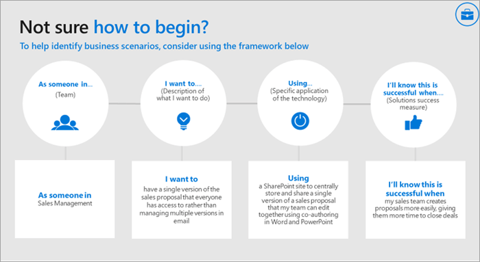

# Определение сценариев использования Microsoft Teams

Убедитесь, что вы понимаете бизнес-проекты (сценарии), которые будут в рамках этого этапа реализации. В этом списке вы можете посмотреть примеры сценариев, которые хорошо подходит для ранних приемных программ. Вы можете начать с простых побед, таких как:

- Личная производительность
- Современное управление проектами
- Современные собрания

Дополнительные сценарии:

- Вовлечение сотрудников и общение
- Ускорять маркетинг кампаний
- Повышение производительности продаж и увеличение дохода
- Оптимизация бизнес-отзывов

Этот сценарий можно посмеять накопительным процессом. Он создает более простые сценарии, которые привязют к ним интерес, знакомство и доверие к новому способу работы. Затем переходить к более масштабным областям влияния. По мере того как Microsoft Teams ваши бизнес-коллеги получат большее влияние на бизнес-коллег, они будут вовлечены в дело и будут влиять на динамику. Многие наши клиенты сразу же после того, как поймют, что все заинтересованные лица по-разму подходят к ним, узнав о том, как их коллеги получают ценность от Microsoft Teams.

## Собеседования с заинтересованными лицами в бизнесе

Чтобы подтвердить выбор этих ранних проектов, мы рекомендуем обратиться непосредственно к заинтересованным лицам, которые были определены ранее в этом процессе. На этом этапе вы должны прослушать и изучить дополнительные сведения об их бизнесе. Чтобы начать беседу, рассмотрите следующие вопросы:

- Каковы некоторые проблемы или проблемные моменты, связанные с общением и совместной работой в организации?
- Какие области хотели бы улучшить в вашей организации?
- Какие стратегические инициативы организации или текущие проекты преобразования Teams могут поддерживаться?
- Какие методы связи и совместной работы обычно лучше получают в вашей организации, чем другие?
- Каков процесс создания, распространения и совместного использования сведений?

## Составление и приоритет бизнес-сценариев

Чтобы убедиться, что у вас есть правильные сведения о бизнес-сценарии, рассмотрите возможность документировать его в следующем формате с точки зрения сотрудника, который завершает работу, и владельца компании. Обе эти перспективы необходимы для того, чтобы создать успешный путь вперед.

После того как вы поговорите с одним или несколькою заинтересованными лицами, вы можете определить приоритеты сценариев с учетом их влияния и сложностей. (Ваши сценарии могут быть добавлены в дополнение к предложенным выше сценариям.) Подходящие кандидаты на этап эксперимента должны иметь большее влияние и низкую или среднюю сложность. Это гарантирует, что на проект не будут повлиять масштабы работ или технические сложности, прежде чем вы сможете показать значение своей работы. Ниже показан пример диаграммы.

> [!Note]
> Мы всегда стремимся узнать, как наши клиенты используют Teams новыми новыми способами. Поделитесь своим #TeamsStories на нашем форуме по внедрению [в машине](https://techcommunity.microsoft.com/t5/driving-adoption/ct-p/DrivingAdoption). Включите хэштег **#TeamsStories** в сообщение. Нам всегда интересно, как вы используете Teams в вашей организации.

 Далее: [Ранние ранние приемники и сбор отзывов](teams-adoption-onboard-early-adopters.md).
