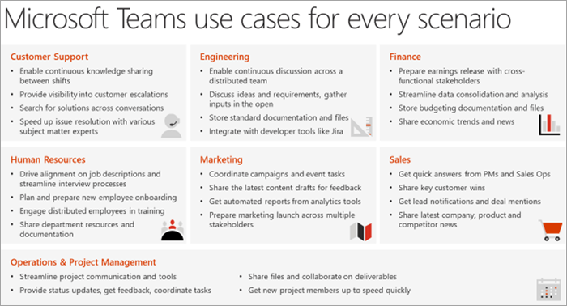

# Определение сценариев использования Microsoft Teams

Убедитесь в том, что вы понимаете бизнес-проекты (сценарии), которые будут ойти в рамках этого этапа реализации. Взгляните на этот список примеров сценариев, которые отлично подходит для ранних кандидатов на участие в программе ранних приемов. Вы можете начать с простой победы, например:

- Личная производительность
- Современное управление проектами
- Современные собрания

Следует учесть дополнительные сценарии:

- Вовлечение сотрудников и общение
- Ускорять маркетинг кампаний
- Повышение производительности продаж и увеличение дохода
- Оптимизация отзывов для бизнеса

Этот сценарий можно образно высмеять как накопительный процесс— повысьте базовые сценарии, чтобы сделать работу интереснее, привыкнее и заверение к новому способу работы. Затем переходить к более хозяйным областям влияния. По мере того как microsoft Teams продемонстрировано вашим коллегам по работе, больше из них вовлечено и будет влиять на качество работы. Многие наши клиенты, получив этот процесс, находят заинтересованные лица после того, как узнали о том, как их коллеги получают ценность от Microsoft Teams.

## Собеседование с заинтересованными лицами в бизнес-деятельности

Чтобы подтвердить выбор этих ранних проектов, рекомендуем встречаться непосредственно с заинтересованными лицами, которые были определены на предыдущих стадиях этого процесса. Ваша цель на этом этапе — прослушать и изучить дополнительные сведения об их бизнесе. Учитывайте следующие вопросы, чтобы вести беседу:

- Каковы некоторые проблемы или проблемные моменты, связанные с общением и совместной работой в организации?
- Какие области нужно улучшить в вашей организации?
- Какие стратегические инициативы организации или текущие проекты преобразования поддерживаются Teams?
- Какие методы связи и совместной работы обычно лучше получают в вашей организации, чем другие?
- В чем дело с черновиками, распространением и распространением информации?

## Составление бизнес-сценариев и их приоритеты

Чтобы убедиться в том, что у вас есть правильные сведения о бизнес-сценарии, рассмотрите возможность документировать его с точки зрения сотрудника, который будет работать над проектом, и владельца бизнес-процесса. Обе эти перспективы необходимы для того, чтобы создать успешный путь к будущему.

После того как вы поговорите с одним или несколько заинтересованными лицами, вы можете определить приоритеты для своих сценариев с учетом влияния и сложности. (Сценарии могут быть не только предложенными выше.) Подходящие кандидаты на этап эксперимента должны иметь большее влияние и высокую или среднюю сложность. Это поможет вам убедиться, что на проект не влияют неполадки, пока вы не сможете продемонстрировать ценность своей работы. Ниже показан пример диаграммы.

> [!Note]
> Мы всегда стремимся узнать о новых способах использования Teams нашими клиентами. Поделитесь своим #TeamsStories с нами на форуме для обсуждения [driving Adoption.](https://techcommunity.microsoft.com/t5/driving-adoption/ct-p/DrivingAdoption) Включите хэштег **#TeamsStories** в сообщение. Нас всегда интересует, как вы используете Teams в вашей организации.

 шаг: [ранние приемники и сбор отзывов.](teams-adoption-onboard-early-adopters.md)
