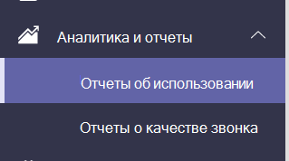

# Microsoft Teams использования приложений

Отчет Teams использования приложений в Центре администрирования Microsoft Teams содержит сведения о том, какие приложения используют пользователи Teams.  

## Просмотр отчета об использовании приложений

1. В левой области навигации Центра администрирования <https://admin.teams.microsoft.com> щелкните Аналитика & **отчеты**  >  **об использовании**.  
2. На **вкладке Просмотр отчетов** в области **Отчет** выберите **Использование приложений**.

3. Выберите диапазон в поле **Диапазон дат**, а затем нажмите кнопку **Запустить отчет**. В Teams использование приложений можно отсвести тенденции за последние 7, 30 или 90 дней.  

## Толкование отчета

:::image type="content" alt-text="Снимок экрана: отчет Teams использования приложений в центре администрирования Teams с помощью перетаксовок." source="media/app-usage-report5.png" lightbox="media/app-usage-report5.png":::

1. В левом верхнем верхнем конце каждого отчета указывается дата его создания. Отчеты обычно отражают 24-часовую задержку от времени открытия приложения.

2. Ось Y на диаграмме — это количество пользователей, которые для даты, выбранной при наведении курсором на диаграмму, считаются активными, так как приложение открывалось хотя бы один раз.

3. Ось X на диаграмме — это диапазон дат, выбранный для отчета.

4. Наведите курсор на точку, представляющую использование приложения в любую дату, чтобы увидеть общее количество активных пользователей в этот день.

5. Чтобы выбрать другие приложения, в правом верхнем конце щелкните **значок Фильтр,** выберите или введите новые условия, а затем нажмите кнопку **Применить**.

6. В таблице в нижней части отчета показаны активные пользователи и группы по имени приложения.

   - **Имя приложения** — это отображаемая имя приложения, используемого в Teams.
   - **Активные** пользователи : количество пользователей, открывавших приложение хотя бы один раз в указанный период.
   - **Тип приложения** — это статическое значение microsoft или third party.
   - **Активные** команды — это количество команд, которые открыли приложение по крайней мере одним участником команды и в указанный период времени.
   - **Publisher** является разработчиком программного обеспечения приложения.
   - **Версия** — это версия приложения от издателя приложения.

   > [!NOTE]
   > **Активные пользователи** **и активные команды** вычисляются только для приложений, используемых только в каналах.

7. Чтобы добавить или удалить столбцы в таблице, в  правом верхнем колонок  щелкните значок Изменить столбцы, на вкладке Изменение столбцов выберите новые условия и нажмите кнопку **Применить**.

8. Чтобы экспортировать отчет в CSV-файл для автономного анализа,  в правом верхнем конце щелкните  значок Экспорт в Excel, а затем на вкладке Загрузки в области Состояние **нажмите** кнопку **Скачать**.

   :::image type="content" alt-text="Снимок экрана: области "Загрузки"." source="media/app-usage-report7.png" lightbox="media/app-usage-report7.png":::

9. При просмотре отчета в Excel вы также увидите  столбец "ИД", который представляет собой ИД приложения ( обычно это буквы и цифры). Если **ид** **\n**, это означает, что пользователь попросил удалить свои данные.

   

## Статьи по теме

- [Аналитика и отчеты Teams](teams-reporting-reference.md)
