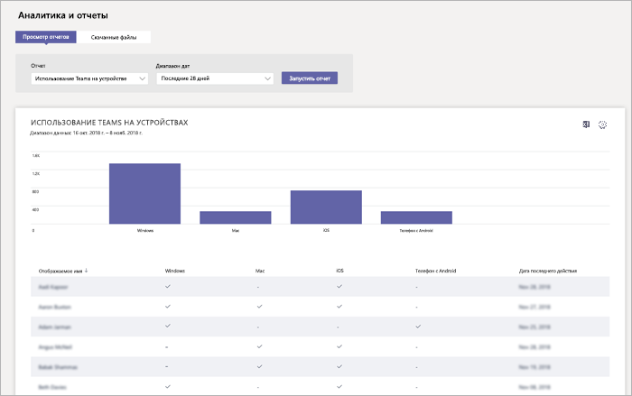

# Отчет об использовании устройств с Microsoft TeamsMicrosoft Teams device usage report

Отчет об использовании устройств Teams в центре администрирования Microsoft Teams содержит сведения о том, как пользователи подключаются к Teams.The Teams device usage report in the Microsoft Teams admin center provides you with information about how users connect to Teams. Вы можете использовать отчет для просмотра устройств, которые используются в вашей организации, в том числе для работы с группами на мобильных устройствах, где бы вы ни находились.You can use the report to see the devices that are used across your organization, including how many use Teams from their mobile devices when on-the-go.  

![Снимок экрана с отчетом об использовании устройств в Teams в центре администрирования] (../media/teams-reports-device-usage.png "Снимок экрана с отчетом об использовании устройств в Teams в центре администрирования Microsoft Teams")

## Просмотр отчетаView the report

1. Перейдите в центр администрирования Microsoft Teams, на панели навигации слева выберите пункт **аналитические отчеты _амп_**, а затем в разделе **отчет**выберите пункт **использование устройств Teams**.Go to the Microsoft Teams admin center, in the left navigation, click **Analytics & reports**, and then under **Report**, select **Teams device usage**. 
2. Выберите диапазон в поле **Диапазон дат**, а затем нажмите кнопку **Запустить отчет**.Under **Date range**, select a range, and then click **Run report**. 

## Толкование отчетаInterpret the report

![Снимок экрана с отчетом об использовании устройств в Teams в центре администрирования] (../media/teams-reports-device-usage-with-callouts.png "Снимок экрана с отчетом об использовании устройств Teams в центре администрирования Microsoft Teams с пронумерованными выносками")

|ВыноскаCallout |ОписаниеDescription  |
|--------|-------------|
|**1****1**   |Отчет об использовании устройств Teams можно просмотреть для тенденций за последние 7 дней или 28 дней.The Teams device usage report can be viewed for trends over the last 7 days or 28 days.  |
|**2****2**   |Каждый отчет содержит дату создания отчета.Each report has a date for when the report was generated. Действия обычно отражаются в отчетах с задержкой в 24-48 ч.The reports usually reflect a 24 to 48 hour latency from time of activity. |
|**3****3**   |<ul><li>Ось X на диаграмме представляет различные устройства (**Windows**, **Mac**, **iOS**, Телефон с **Android**), которые используются для подключения к Teams.The X axis on the chart represents the different devices (**Windows**, **Mac**, **iOS**, **Android Phone**) used to connect to Teams. </li><li>Ось Y — это количество пользователей, использующих устройство в течение выбранного периода времени.The Y axis is the number of users using the device over the selected time period.</li> </ul>Наведите указатель мыши на линию, представляющую устройство, чтобы увидеть количество пользователей, использующих устройство для подключения к Teams.Hover over the bar representing a device to see the number of users using the device to connect to Teams.|
|**4****4**   |Таблица обеспечивает разделение использования устройства пользователем.The table gives you a breakdown of device usage by user. <ul><li>**Отображаемое имя** — это отображаемое имя пользователя.**Display name** is the display name of the user. Вы можете щелкнуть отображаемое имя, чтобы перейти на страницу параметров пользователя в центре администрирования Microsoft Teams.You can click the display name to go to the user's setting page in the Microsoft Teams admin center. </li><li>**Windows** выбирается, если пользователь был активен в классическом клиенте Teams на компьютере с Windows.**Windows** is selected if the user was active in the Teams desktop client on a Windows-based computer.</li><li>**Mac** выбирается, если пользователь был активен в классическом клиенте Teams на macOS компьютере.**Mac** is selected if the user was active in the Teams desktop client on a macOS computer. </li> <li>**iOS** выбирается, если пользователь был активен в клиенте Teams Mobile для iOS.**iOS** is selected if the user was active on the Teams mobile client for iOS.</li><li>**Телефон с Android** выбирается, если пользователь был активен на мобильном клиенте Teams для Android.**Android phone** is selected if the user was active on the Teams mobile client for Android. <li>**Последнее действие** — это Дата последней даты (UTC), которую пользователь участвовал в действии Teams.**Last activity** is the last date (UTC) that the user participated in a Teams activity.</li> </ul> Чтобы нужные сведения отображались в таблице, добавьте в нее соответствующие столбцы.To see the information that you want in the table, make sure to add the columns to the table. |
|**5****5**   |Нажмите **Изменение столбцов**, чтобы добавить или удалить столбцы в таблице.Select **Edit columns** to add or remove columns in the table. |
|**6****6**   |Отчет можно экспортировать в CSV-файл для автономного анализа.You can export the report to a CSV file for offline analysis. Нажмите кнопку **Экспорт в Excel**, а затем на вкладке **загруженные файлы** нажмите кнопку **загрузить** , чтобы скачать отчет, когда он будет готов.Click **Export to Excel**, and then on the **Downloads** tab, click **Download** to download the report when it's ready. |

## Статьи по темеRelated topics
- [Аналитика и отчеты TeamsTeams analytics and reporting](teams-reporting-reference.md)
- [Отчет об использовании TeamsTeams usage report](teams-usage-report.md)
- [Отчет по активности пользователей TeamsTeams user activity report](user-activity-report.md)