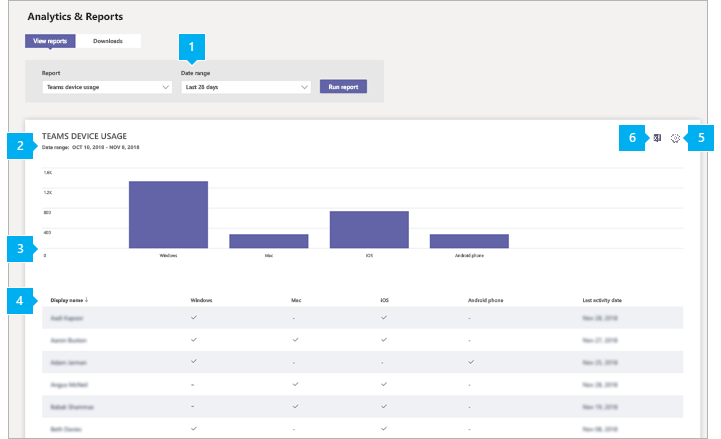

# Отчет об использовании устройств с Microsoft Teams

Отчет об использовании устройств Teams в Центре администрирования Microsoft Teams содержит сведения о том, как пользователи подключаются к Teams. В отчете можно посмотреть, какие устройства используются в организации, в том числе узнать, сколько человек используют Teams с мобильных устройств, когда они находятся в путь.  

## Просмотр отчета об использовании устройств

1. В левой области навигации Центра администрирования Microsoft Teams щелкните **"Аналитика** и & отчеты об  >  **использовании".** На **вкладке "Просмотр отчетов" в** **области "Отчет" выберите** **"Использование устройств Teams".**
2. Выберите диапазон в поле **Диапазон дат**, а затем нажмите кнопку **Запустить отчет**.

    

## Толкование отчета

|Выноска |Описание  |
|--------|-------------|
|**1**   |В отчете об использовании устройств Teams можно отсвести тенденции за последние 7 или 30 дней.  |
|**2**   |У каждого отчета есть дата его сгенерировании. Действия обычно отражаются в отчетах с 24-часовой задержкой. |
|**3**   |<ul><li>Ось X на диаграмме представляет различные устройства **(Windows,** **Mac,** **Linux,** **iOS,** **Android Phone,** **Web),** которые используются для подключения к Teams. </li><li>Ось Y — это количество пользователей устройства за выбранный период времени.</li> </ul>Наведите курсор на панели, представляющей устройство, чтобы узнать количество пользователей, использующих устройство для подключения к Teams.|
|**4**   |В таблице приводится разбивка использования устройств по пользователям. <ul><li>**Имя пользователя —** это отображаемая имя пользователя. Щелкните отображаемого имя, чтобы перейти на страницу параметров пользователя в Центре администрирования Microsoft Teams. </li><li>**Windows** выбирается, если пользователь был активен в клиенте Teams для настольных пк на компьютере с Windows.</li><li>**Компьютер Mac** выбирается, если пользователь был активен в клиенте Teams для настольных пк на компьютере macOS. </li> <li>**Linux** выбирается, если пользователь был активен в клиенте Teams для настольных пк на компьютере Linux. </li> <li>**Выбрана iOS,** если пользователь был активен в мобильном клиенте Teams для iOS.</li><li>**Телефон с Android** выбирается, если пользователь был активен в мобильном клиенте Teams для Android. <li><li>**Веб-клиент** выбирается, если пользователь был активен в веб-клиенте Teams. <li>**Последнее действие —** это последняя дата (UTC), в которую пользователь участвовал в действиях в Teams.</li> </ul> Обратите внимание, что если учетная запись пользователя больше не существует в Azure AD, в таблице отображается имя пользователя "--".   Чтобы нужные сведения отображались в таблице, добавьте в нее соответствующие столбцы. |
|**5**   |Нажмите **Изменение столбцов**, чтобы добавить или удалить столбцы в таблице. |
|**6**   |Отчет можно экспортировать в CSV-файл для автономного анализа. Нажмите **кнопку "Экспорт** в  Excel",  а затем на вкладке "Загрузки" нажмите кнопку "Скачать", чтобы скачать отчет, когда он будет готов.  |

## Статьи по теме

- [Аналитика и отчеты Teams](teams-reporting-reference.md)
