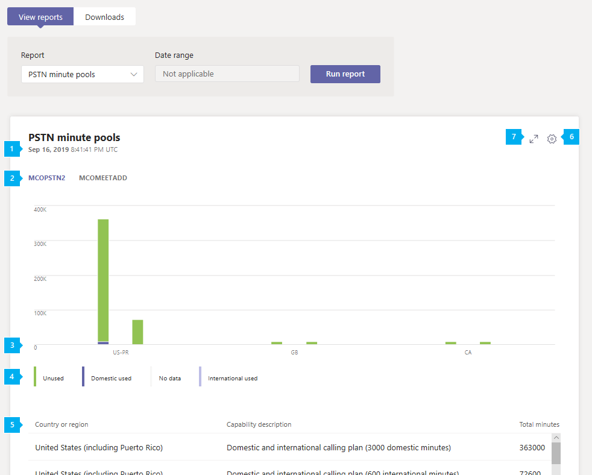

# Отчет о пулах минут Microsoft Teams КТСОПMicrosoft Teams PSTN minute pools report

В центре администрирования Microsoft Teams можно просмотреть отчет о пулах, показывающие, что в течение текущего месяца вы получаете общее представление о голосовой конференции и активности звонков в вашей организации.The Teams PSTN minute pools report in the Microsoft Teams admin center gives you an overview of audio conferencing and calling activity in your organization by showing you the number of minutes consumed during the current month. Вы можете просматривать сведения о действиях, включая лицензию, используемую для звонков, общее количество доступных минут, использованных минут и использование лицензий по местоположению.You can see a breakdown of activity including the license used for calls, total minutes available, used minutes, and license usage by location.

## Просмотр отчетаView the report

В левой области навигации центра администрирования Microsoft Teams выберите пункт **Analytics & отчеты** > **об использовании**.In the left navigation of the Microsoft Teams admin center, click **Analytics & reports** > **Usage reports**. На вкладке **Просмотр отчетов** в группе **отчет**выберите **Пулы PSTN минут**и нажмите кнопку **выполнить отчет**.On the **View reports** tab, under **Report**, select **PSTN minute pools**, and then click **Run report**.

![Снимок экрана: отчет о пулах для групповых минут в центре администрирования]на(../media/teams-reports-pstn-minute-pools-with-callouts.png "снимке экрана в центре администрирования Microsoft Teams с нумерованными вызываемыми") группами

## Толкование отчетаInterpret the report

|ВыноскаCallout |ОписаниеDescription  |
|--------|-------------|
|**1****1**   |Каждый отчет содержит дату создания.Each report has a date for when it was generated. Действия обычно отражаются в отчетах с задержкой в 24-48 ч.The reports usually reflect a 24 to 48 hour latency from time of activity. |
|**2****2**   |Щелкните возможность (лицензия), чтобы просмотреть действия для этой возможности.Click a capability (license) to view activity for that capability. |
|**3****3**   |Ось X — это страна или регион.The X axis is country or region. Ось Y — это количество минут.The Y axis is number of minutes.  Наведите указатель мыши на отрезок на диаграмме, чтобы увидеть активность для этого места использования.Hover over a bar on the chart to see the activity for that usage location.  |
|**4****4**   |Вы можете отфильтровать содержимое диаграммы, щелкнув элемент условных обозначений.You can filter what you see on the chart by clicking an item in the legend. Например, выберите **неиспользуемые**, **внутренние пользователи**, **нет данных**или **Международная связь** , чтобы просмотреть только сведения, относящиеся к каждому из них.For example, click **Unused**, **Domestic users**, **No data**, or **International used** to see only the info related to each one. |
|**5****5**   |Эта таблица позволяет подразделениям пулов минут по возможностям и использованию.The table gives you a breakdown of minute pools by capability and usage location. <ul><li>**Страна или регион** — это место использования.**Country or region** is the usage location. </li><li>**Описание возможности** — это описание лицензии, используемой для звонка.**Capability description** is the description of the license used for the call.  В этом отчете можно увидеть описания возможностей, включая следующие:The capability descriptions you may see in this report include: <ul><li>План внутренних и международных звонков (1200 на отечественные минуты)Domestic and international calling plan (1200 domestic minutes)</li><li>План внутренних и международных звонков (3000 на отечественные минуты)Domestic and international calling plan (3000 domestic minutes)</li><li>План внутренних и международных звонков (600 в США)Domestic and international calling plan (600 international minutes)</li></ul></li> <li>**Всего минут** — общее количество минут, доступных в течение месяца.**Total minutes** is the total number of minutes available for the month.</li><li>**Использованные минуты** — количество минут, использованных в месяце.**Minutes used** is the number of minutes used each month</li> <li>**Доступно минут** : количество минут, остающихся в течение месяца.**Minutes available** is the number of minutes remaining for the month.</li><li>**Возможность** — лицензия, которая была использована при обработке звонка.**Capability** is the license used for the call. Ниже перечислены лицензии, которые вы можете увидеть.The licenses you may see include:<ul><li>**MCOPSTNPP** — кредиты на связь**MCOPSTNPP** - Communications Credits</li><li>**MCOPSTN1** — план внутренних звонков (планы: 3000 мин США/1200 мин ЕС)**MCOPSTN1** - Domestic Calling Plan (3000 min US / 1200 min EU plans)</li><li>**MCOPSTN2** — план международных звонков**MCOPSTN2** - International Calling Plan</li><li>**MCOPSTN5** — план внутренних звонков (план звонков: 120 мин)**MCOPSTN5** - Domestic Calling Plan (120 min calling plan)</li><li>**MCOPSTN6** — план внутренних звонков (план 240 мин)**MCOPSTN6** - Domestic Calling Plan (240 min calling plan)</li><li>**MCOMEETADD** — аудиоконференция**MCOMEETADD** - Audio Conferencing</li><li>**MCOMEETACPEA** — аудиоконференция с поминутной оплатой**MCOMEETACPEA** - Pay Per Minute Audio Conferencing</li></ul></li> </ul> Чтобы нужные сведения отображались в таблице, добавьте в нее соответствующие столбцы.To see the information that you want in the table, make sure to add the columns to the table.|
|**6****6**   |Нажмите **Изменение столбцов**, чтобы добавить или удалить столбцы в таблице.Select **Edit columns** to add or remove columns in the table.|
|**7****7**   |Щелкните во **весь экран** , чтобы просмотреть отчет в полноэкранном режиме.Select **Full screen** to view the report in full screen mode.|

## Статьи по темеRelated topics

- [Аналитика и отчеты TeamsTeams analytics and reporting](teams-reporting-reference.md)