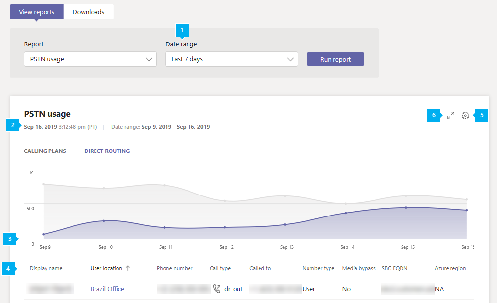

# Отчет об использовании ТСОП в Microsoft Teams

Отчет об использовании ТСОП Teams (телефонная сеть с общедоступным коммутатором) в Центре администрирования Microsoft Teams содержит общие сведения о действиях по звонкам и аудиоконференции в вашей организации. Вы можете просмотреть подробные сведения о действиях звонков для планов звонков, если вы используете Майкрософт в качестве оператора телефонии и прямую маршрутизацию, если вы используете собственный оператор телефонии.

На **вкладке "** Планы звонков" отображаются сведения, включая количество минут, затраченных пользователями на входящие и исходящие вызовы ТСОП, а также стоимость этих вызовов. На **вкладке "Прямая маршрутизация** " отображаются сведения, включая адрес SIP, время начала и окончания вызова. Используйте сведения в этом отчете, чтобы получить представление об использовании ТСОП в организации и помочь вам исследовать, планировать и принимать бизнес-решения.

> [!NOTE]
> Если у вас есть тарифный план Telstra или Softbank, в отчете об использовании ТСОП не будут отображаться подробные записи о звонках. Обратитесь в Telstra или Softbank для создания отчетов. 

## Просмотр отчета об использовании ТСОП

1. В левой области навигации Центра администрирования Microsoft Teams щелкните **"Аналитика & отчетов** >  об **использовании"**. На **вкладке "Просмотр отчетов** " в **разделе "Отчет**" выберите отчет об использовании **ТСОП**.
2. В **разделе "Диапазон дат**" выберите предопределенный диапазон 7 или 28 дней или задайте пользовательский диапазон, а затем выберите "Запустить **отчет"**.

## Толкование отчета

### Планы звонков

   

|Выноска |Описание  |
|--------|-------------|
|**1**   |В отчете можно просмотреть тенденции за последние 7, 28 дней или заданный вами пользовательский диапазон дат. |
|**2**   |Каждый отчет имеет дату создания. Действия обычно отражаются в отчетах с задержкой в 24-48 ч. |
|**3**   |Ось X — это выбранный диапазон дат для конкретного отчета. Ось Y — это общее количество вызовов за выбранный период времени.  Наведите указатель мыши на точку на заданную дату, чтобы просмотреть общее количество вызовов в эту дату.  |
|**4**   |В таблице приведена разбивка использования ТСОП для каждого вызова. <ul><li>**Метка времени (UTC)** — это время начала вызова.</li><li>**Отображаемое** имя — это отображаемое имя пользователя. Вы можете щелкнуть отображаемое имя, чтобы перейти на страницу параметров пользователя в Центре администрирования Microsoft Teams.</li><li>**Имя пользователя —** это имя входа пользователя.</li><li>**Номер телефона** — это номер, который получил вызов для входящих звонков, или номер, полученный для исходящих звонков.</li><li>**Тип звонка** — это исходящий или входящий вызов ТСОП, а также тип звонка, например звонок, размещенный пользователем или аудиоконференции. Типы вызовов, которые могут отображаться, включают:  **Типы  вызовов пользователей Teams**<ul><li>**user_in** — пользователь получил входящий вызов ТСОП</li><li>**user_out** — пользователь разместил исходящий вызов ТСОП</li><li>**user_out_conf** — пользователь добавил двух или более участников ТСОП в вызов, например трехфакторную конференцию</li><li>**user_out_transfer** — пользователь передал вызов на номер ТСОП</li><li>**user_out_forwarding** — пользователь переадресовыл вызов на номер ТСОП</li><li>**conf_in** — входящий вызов моста аудиоконференций</li><li>**conf_out** — исходящий вызов из моста аудиоконференций обычно для добавления номера ТСОП в конференцию</li><li>**unassigned_in** — входящий вызов ТСОП через план звонков на неназначенных номерах</li></ul> **Типы вызовов ботов Teams**<ul><li>**ucap_in** — входящий вызов ТСОП боту Teams, например автосекретарю или очереди звонков</li><li>**ucap_out** — исходящий вызов ТСОП от бота Teams, например автосекретаря или очереди звонков</li></ul> <li>**Вызываемый —** это номер набора.</li><li>**Для страны или региона** задана страна или регион.</li><li>**Номер, с** которого был вызван вызов.</li><li>**Из страны или региона** — это страна или регион, из которых был выполнен звонок.</li><li>**Плата** — это сумма денег или стоимость звонка, которая взимается с вашей учетной записи. </li><li>**Валюта** — это тип валюты, используемой для расчета стоимости вызова. </li><li>**Длительность** — продолжительность звонка.</li><li>**Внутренние или международные** сообщает, был ли звонок внутренним (в пределах страны или региона) или международным (за пределами страны или региона) в зависимости от расположения пользователя.</li><li>**Идентификатор вызова —** это идентификатор вызова. Это идентификатор вызова, который можно использовать при вызове служба поддержки Майкрософт.</li><li>**Тип номера** — это тип номера телефона пользователя, например служба с бесплатным номером. </li><li>**Страна или регион** — это расположение использования. </li> <li>**Идентификатор конференции —** это идентификатор аудиоконференции. </li><li>**Возможность** — лицензия, которая была использована при обработке звонка. Типы лицензий, которые могут отображаться:<ul><li>**MCOEV или MCOEV_VIRTUALUSER или MCOEV_VIRTUALUSER_GOV — голосовые** приложения, такие как автосекретарь или очереди звонков</li><li>**FREECALL** — в случае технической проблемы, которая не позволяет нам расценки на звонок, звонок предоставляется бесплатно и будет отображаться с этой возможностью.</li><li>**MCOPSTN1** — план внутренних звонков (планы: 3000 мин США/1200 мин ЕС)</li><li>**MCOPSTN2** — план международных звонков</li><li>**MCOPSTN5** — план внутренних звонков (план звонков: 120 мин)</li><li>**MCOPSTN6** — план внутренних звонков (план звонков на 240 минут)</li><li>**MCOPSTN8** — план внутренних звонков 120 минут на пользователя (не включается в пул пользователей, как и другие планы звонков)</li><li>**MCOPSTN9** — план международных звонков</li><li>**MCOPSTNCAP** — телефон общего содержимого</li><li>**MCOPSTNPP** — кредиты на связь</li><li>**MCOMEETADD** — аудиоконференция</li><li>**MCOMEETADD_DIALOUT_US** — абонентский план аудиоконференций в США и Канаде</li><li>**MCOMEETADD_CN_GLOBAL** — аудиоконференции для пользователей, отличных от Китая</li><li>**MCOMEETADD_TATA** - Tata Communications Connections</li><li>**MCOMEETACPEA** — аудиоконференции с оплатой поминутно </li><li>**MCOMEETACPEA_GOV** — аудиоконференции с оплатой поминутной оплате для государственных организаций</li></ul></li></ul> Чтобы нужные сведения отображались в таблице, добавьте в нее соответствующие столбцы.|
|**5**   |Нажмите **Изменение столбцов**, чтобы добавить или удалить столбцы в таблице. |
|**6**   |Выберите **фильтр** , чтобы отфильтровать отчет по имени пользователя или типу вызова. |
|**7**   |Выберите **"Полноэкранный** режим", чтобы просмотреть отчет в полноэкранном режиме. |
|**8**   |Отчет можно экспортировать в CSV-файл для автономного анализа. Нажмите **кнопку "** Экспорт в Excel",  а затем на вкладке  "Загрузки" нажмите кнопку "Скачать", чтобы скачать отчет, когда он будет готов.|

### Прямая маршрутизация

   

|Выноска |Описание  |
|--------|-------------|
|**1**   |В отчете можно просмотреть тенденции за последние 7 или 28 дней. |
|**2**   |Каждый отчет имеет дату создания. Действия обычно отражаются в отчетах с задержкой в 24-48 ч. |
|**3**   |Ось X — это выбранный диапазон дат для конкретного отчета. Ось Y — это общее количество вызовов за выбранный период времени. Наведите указатель мыши на точку на заданную дату, чтобы просмотреть общее количество вызовов в эту дату.  |
|**4**   |В таблице приведена разбивка использования ТСОП для каждого вызова. <ul><li>**Метка времени (UTC)** — это время начала вызова.</li><li>**Отображаемое** имя — это отображаемое имя пользователя. Вы можете щелкнуть отображаемое имя, чтобы перейти на страницу параметров пользователя в Центре администрирования Microsoft Teams. Имя также может быть именем бота, например очередь вызовов или облачный автосекретарь. </li><li>**SIP-адрес** — это SIP-адрес пользователя или бота, которые получили или сделали звонок.</li><li>**Номер вызывающего** абонента — это номер пользователя или бота, выполнившего вызов. </li><li>**Номер вызываемого абонента** — это номер пользователя или бота, который получил звонок. При входящем вызове пользователя Teams он будет пользователем Teams, а при исходящих звонках от пользователя Teams — пользователем ТСОП. </li><li>**Тип звонка** — это исходящий или входящий вызов ТСОП, а также тип звонка, например звонок, размещенный пользователем или аудиоконференции. Типы вызовов, которые могут отображаться:  **Типы  вызовов пользователей Teams**<ul><li>**dr_in** — пользователь получил входящий вызов ТСОП</li><li>**dr_out** — пользователь разместил исходящий вызов ТСОП</li><li>**dr_out_user_conf** — пользователь добавил участника ТСОП в вызов</li><li>**user_out_transfer** — пользователь передал вызов на номер ТСОП</li><li>**dr_out_user_forwarding** — пользователь переадресовыл вызов на номер ТСОП</li><li>**dr_out_user_transfer** — пользователь передал вызов на номер ТСОП</li><li>**dr_emergency_out** — пользователь в экстренном вызове</li><li>**dr_unassigned_in** — входящий вызов ТСОП через прямую маршрутизацию на неназначенных номерах</li></ul> **Типы вызовов ботов Teams**<ul><li>**dr_in_bot** — входящий вызов ТСОП боту Teams, например автосекретарю или очереди звонков</li><li>**dr_out_bot** — исходящий вызов ТСОП от бота Teams, например автосекретаря или очереди звонков</li></ul> <li>**Вызывается** номер пользователя, который получил звонок.</li><li>Время начала **(UTC)** — это время, когда прокси-сервер SIP получил окончательный ответ (сообщение SIP "200 OK") из SBC при исходящих звонках (Teams/Bot пользователю ТСОП) или после того, как прокси-сервер SIP отправляет приглашение на следующий прыжок в серверной части Teams при входящем вызове (пользователь ТСОП в Teams или Бот). </li><li>Время приглашения **(UTC)** — это время, когда начальное приглашение было отправлено исходящим вызовом пользователя Или бота Teams в SBC или получено при входящем вызове Teams или бота компонентом прокси-сервера SIP прямой маршрутизации из SBC.</li><li>**Время сбоя (UTC)** — это время сбоя вызова. Только для неудачных вызовов. Окончательный код SIP, окончательный код Майкрософт и последняя фраза SIP предоставляют причины сбоя вызова и могут помочь в устранении неполадок. </li><li>**Время окончания (UTC)** — это время окончания вызова (только для успешных вызовов).</li><li>**Длительность** — это продолжительность подключения звонка от приглашения до окончания вызова или сбоя. Для переадресации звонков длительность включает вызовы в очереди звонков.</li><li>**Тип номера** — это тип номера телефона пользователя, например служба с бесплатным номером. </li><li>**Обход сервера-посредника** указывает, включена ли магистраль для обхода сервера-посредника. </li> <li>**Полное доменное имя SBC** — это полное доменное имя пограничного контроллера сеанса (SBC). </li><li>**Регион Azure для медиа —** это центр обработки данных, который использовался в качестве пути мультимедиа в вызове без обхода. </li><li>**Регион Azure для сигнализации —** это центр обработки данных, который использовался для сигналов для вызовов обхода и без обхода. </li><li>**Тип события** — это тип события вызова. Вы увидите успешное выполнение успешных вызовов и попытку неудачных вызовов. </li><li>**Окончательный код SIP —** это код, с помощью которого был завершен вызов.</li><li>**Окончательный подкод Майкрософт** — это код, указывающий конкретные выполненные действия.</li><li>**Последняя фраза SIP** — это описание кода SIP и подкода Майкрософт.</li><li>**Идентификатор корреляции —** это уникальный идентификатор вызова, который можно использовать при вызове служба поддержки Майкрософт.</li><li>**Идентификатор общей корреляции** отображается только в загружаемом CSV-файле и не существует на портале. Идентификатор общей корреляции существует по крайней мере в двух связанных вызовах. Подробное описание см. ниже.</li></ul> Чтобы нужные сведения отображались в таблице, добавьте в нее соответствующие столбцы.|
|**5**   |Нажмите **Изменение столбцов**, чтобы добавить или удалить столбцы в таблице. |
|**6**   |Выберите **"Полноэкранный** режим", чтобы просмотреть отчет в полноэкранном режиме. |
|**7**   |Выберите **"Экспорт в Excel"** , чтобы скачать данные в CSV-файле с разделителями-запятыми для автономного анализа или использовать их в качестве входных данных для системы выставления счетов. |

#### Рекомендации по полям "Вызывающий/вызываемый"

В зависимости от направления вызова имена вызывающего или вызываемого абонента могут содержать номера, отличные от E164.

Эти поля могут поступать из клиентских SBC. Существует три формата, которые SBC может отправлять в прямую маршрутизацию: числа E.164, числа, отличные от E.164, и строки.

- Номер телефона E.164 от пользователя с номером E.164 до пользователя, у которого также есть номер E.164. 
- Звонок с номера, отличного от E.164. Пользователь из сторонней УАТС, связанный с прямой маршрутиза службой маршрутизации, вызывает пользователя Teams. В этом случае вызывающий номер может быть любым номером, отличным от E.164, например +1001. 
- Спамировщик вызывает и не представляет номер, а только имя, например "Внутренняя служба дохода". Эта строка будет отображаться в отчетах.

#### Запутывание номеров телефонов
Требования к конфиденциальности для каждой страны включают запутывание внешних (не принадлежащих клиенту) номеров телефонов. Три или четыре последние цифры номера телефона заменяются звездочками (+123 456789***). 

Для входящих вызовов номер вызывающего абонента замаскован, для исходящих вызовов — замаскированные. Это относится к отчетам о ТСОП и прямой маршрутизации в центре Администратор клиента, экспорте данных и журналах вызовов, доступных через Microsoft Graph.

Запутывание основано на расположении организации (стране). Полные номера телефонов отображаются для стран, которые не указаны в следующей таблице:

| Страны | Число запутывания цифр |
| :-: | :- |
|BE — Бельгия | 3 |
|CH — Швейцария | 4 |
|DE — Германия | 3 |
|DK — Норвегия | 3 |
|ES — Испания | 3 |
|FI — Финляндия | 3 |
|FR — Франция | 4 |
|ИТ-службы — Испания | 3 |
|NL — Нидерланды | 3 |
|НЕТ — Норвегия | 3 |
|SE — Швеция | 3 |

#### Общие идентификаторы корреляции

Идентификатор общей корреляции существует только в экспортированном файле Excel, который вы скачали, и указывает, что связаны два или более вызовов. Ниже описаны различные сценарии и время, когда присутствует идентификатор общей корреляции.

1.    Пользователь ТСОП 1 в конечной точке ТСОП с именем Teams User 1 в клиенте Teams, тип вызова Dr_In, идентификатор корреляции 57f28917-42k5-4c0c-9433-79734873f2ac, без идентификатора общей корреляции.
2.    Пользователь Teams 1 в клиенте Teams с именем "Пользователь 1 ТСОП" в конечной точке ТСОП, тип вызова Dr_Out 2c12b8ca-62eb-4c48-b68d-e451f518ff4 без идентификатора общей корреляции.
3.    Пользователь 1 ТСОП в конечной точке ТСОП, называемой пользователем Teams 2 в клиенте Teams, call type Dr_In f45e9a25-9f94-46e7-a457-84f5940efde9, shared correlation ID f45e9a25-9f94-46e7-a457-84f5940efde9.
4.    Существующий вызов 3 с идентификатором корреляции "f45e9a25-9f94-46e7-a457-84f5940efde9". Пользователь ТСОП 1 в вызове с пользователем Teams 2. Пользователь Teams 2 передал (незрячий или консультации) звонок пользователю Teams или пользователю ТСОП. тип вызова Dr_Out_User_Transfer 45a1da7c-9e97-481a-8a05-3fe19a9a77e0, общий идентификатор корреляции f45e9a25-9f94-46e7-a457-84f5940efde9.

## Экспорт отчетов
Нажмите **кнопку "** Экспорт в Excel",  а затем на вкладке  "Загрузки" нажмите кнопку "Скачать", чтобы скачать отчет, когда он будет готов. Процесс экспорта может занять от нескольких секунд до нескольких минут в зависимости от количества данных.

При этом данные всех пользователей будут экспортированы в формат, позволяющий сортировать и фильтровать их для дальнейшего анализа. Экспортированные файлы содержат дополнительные поля, недоступные в интерактивном отчете. Их можно использовать для устранения неполадок и автоматизированных рабочих процессов.

 Вы получите ZIP-файл с **именем Calls.Export.`[identifier]`.zip**", идентификатор является уникальным идентификатором для экспорта, который можно использовать для устранения неполадок.

Если у вас есть планы звонков и прямая маршрутизация, экспортированный файл может содержать данные для обоих продуктов. Файл отчета об использовании ТСОП будет иметь имя файла **PSTN.calls.`[UTC date]`.csv**" и прямой маршрутизации **DirectRouting.calls.`[UTC date]`.csv**".

 Помимо файлов ТСОП и прямой маршрутизации, архив содержит файл **parameters.json** с выбранным диапазоном времени экспорта и возможностями.

Экспортированные файлы имеют формат значений с разделителями-запятыми (CSV), соответствующий стандарту [RFC 4180](https://tools.ietf.org/html/rfc4180) . Файлы можно открывать в Excel или любом другом редакторе, соответствующем стандартам, без необходимости преобразования.

Первая строка CSV-файла содержит имена столбцов. Все даты имеют формат UTC и в формате [ISO 8601](https://en.wikipedia.org/wiki/ISO_8601) .

### Экспортированный отчет об использовании ТСОП

 Вы можете экспортировать данные до одного года с текущей даты, если только нормативные акты конкретной страны не запрещают хранение данных в течение 12 месяцев.

> [!div class="has-no-wrap"]  
> | # | Имя | [Тип данных (SQL Server)](/sql/t-sql/data-types/data-types-transact-sql) | Описание |
> | :-: | :-: | :-: |:------------------- |
> | 0 | UsageId | `uniqueidentifier` | Уникальный идентификатор вызова |
> | 1 | Идентификатор звонка | `nvarchar(64)` | Идентификатор вызова. Не гарантируется уникальность |
> | 2 | Идентификатор конференции | `nvarchar(64)` | Идентификатор аудиоконференции |
> | 3 | Расположение пользователя | `nvarchar(2)` | Код страны пользователя [ISO 3166-1 alpha-2](https://en.wikipedia.org/wiki/ISO_3166-1_alpha-2) |
> | 4 | AAD ObjectId | `uniqueidentifier` | Вызов идентификатора пользователя в Azure Active Directory.  Эта и другие сведения о пользователе будут пустыми или пустыми для типов вызовов бота (ucap_in, ucap_out) |
> | 5 | UPN | `nvarchar(128)` | UserPrincipalName (имя входа) в Azure Active Directory. Обычно он совпадает с SIP-адресом пользователя и может совпадать с адресом электронной почты пользователя. |
> | 6 | Отображаемое имя пользователя | `nvarchar(128)` | Отображаемое имя пользователя |
> | 7 | Идентификатор звонящего | `nvarchar(128)` | Номер, который получил вызов для входящих звонков, или номер, находящийся для исходящих звонков. [Формат E.164](https://en.wikipedia.org/wiki/E.164) |
> | 8 | Тип вызова | `nvarchar(32)` | Был ли звонок исходящим или входящим вызовом ТСОП, а также типом звонка, например звонка, выполненного пользователем или аудиоконференции |
> | 9 | Тип числа | `nvarchar(16)` | Тип номера телефона пользователя, например служба с бесплатным номером |
> | 10 | Внутренние и международные | `nvarchar(16)` | Был ли звонок внутренним (в пределах страны или региона) или международным (за пределами страны или региона) в зависимости от расположения пользователя. |
> | 11 | Назначение с номером | `nvarchar(64)` | Страна или регион с номером |
> | 12 | Номер назначения | `nvarchar(32)` | Номер, наданный [в формате E.164](https://en.wikipedia.org/wiki/E.164) |
> | 13 | Время начала | `datetimeoffset` | Время начала вызова |
> | 14 | Время окончания | `datetimeoffset` | Время окончания вызова |
> | 15 | Длительность в секундах | `int` | Продолжительность подключения к вызову |
> | 16 | Плата за подключение | `numeric(16, 2)` | Цена за подключение |
> | 17 | Заряда | `numeric(16, 2)` | Сумма денег или стоимость звонка, которая взимается с вашей учетной записи |
> | 18 | Валюта | `nvarchar(3)` | Тип валюты, используемой для расчета стоимости вызова ([ISO 4217](https://en.wikipedia.org/wiki/ISO_4217)) |
> | 19 | Возможность | `nvarchar(32)` | Лицензия, используемая для вызова |

### Экспортированный отчет об использовании прямой маршрутизации

Вы можете экспортировать данные до пяти месяцев (150 дней) с текущей даты, если только нормативные акты конкретной страны не запрещают хранение данных за этот период.

> [!div class="has-no-wrap"]  
> | # | Имя | [Тип данных (SQL Server)](/sql/t-sql/data-types/data-types-transact-sql) | Описание |
> | :-: | :-: | :-: |:------------------- |
> | 0 | Correlationid | `uniqueidentifier` | Идентификатор вызова. Несколько элементов одного вызова могут совместно использовать один и тот же correlationId. |
> | 1 | AAD ObjectId | `uniqueidentifier` | Вызов идентификатора пользователя в Azure Active Directory.  Эти и другие сведения о пользователе могут быть пустыми или пустыми для типов вызовов бота. |
> | 2 | UPN | `nvarchar(128)` | UserPrincipalName (имя входа, Azure Active Directory) пользователя или бота, которые сделали или получили вызов. Обычно он совпадает с SIP-адресом пользователя и может совпадать с адресом электронной почты пользователя. |
> | 3 | Отображаемое имя | `nvarchar(128)` | Имя пользователя или вызывающего бота (например, очередь вызовов или автосекретарь), как задано в Центр администрирования Microsoft 365 |
> | 4 | Страна пользователя | `nvarchar(2)` | Код страны пользователя [ISO 3166-1 alpha-2](https://en.wikipedia.org/wiki/ISO_3166-1_alpha-2) |
> | 5 | Время приглашения | `datetimeoffset` | Когда начальное приглашение отправляется исходящим вызовом пользователя или бота Teams в SBC или получается при входящем вызове Teams или бота компонентом прокси-сервера SIP прямой маршрутизации из SBC |
> | 6 | Время начала | `datetimeoffset` | Время, когда прокси-сервер SIP получил окончательный ответ (сообщение SIP "200 OK") из SBC при исходящих подключениях (Teams/Bot пользователю ТСОП) или после того, как прокси-сервер SIP отправляет приглашение на следующий прыжок в серверной части Teams при входящем вызове (пользователь ТСОП в Teams или бот). Для неудачных и неотвеченных вызовов это может быть равно времени приглашения или сбоя. |
> | 7 | Время сбоя | `datetimeoffset` | Существует только для неудачных (не полностью установленных) вызовов |
> | 8 | Время окончания | `datetimeoffset` | Существует только для успешных (полностью установленных) вызовов. Время окончания вызова |
> | 9 | Длительность (в секундах) | `int` | Длительность звонка от приглашения до завершения или сбоя вызова. Для переадресации звонков длительность включает вызовы в очереди звонков. |
> | 10 | Success (Успешно) | `nvarchar(3)` | Да/Нет. Успех или попытка |
> | 11 | Номер вызывающего абонента | `nvarchar(32)` | Номер пользователя или бота, выполнившего вызов. При входящем вызове пользователя team это будет пользователь ТСОП, а при исходящих звонках пользователя Teams — номер пользователя Teams. |
> | 12 | Номер вызываемого абонента | `nvarchar(32)` | Номер пользователя или бота, который получил звонок. При входящем вызове пользователя Team это будет пользователь Teams, а при исходящих вызовах пользователя Teams — пользователь ТСОП. |
> | 13 | Тип вызова | `nvarchar(32)` | Тип и направление вызова |
> | 14 | Регион Azure для медиа | `nvarchar(8)` | Центр обработки данных, используемый для пути мультимедиа в вызове без обхода |
> | 15 | Регион Azure для сигнализации | `nvarchar(8)` | Центр обработки данных, используемый для передачи сигналов для вызовов обхода и без обхода |
> | 16 | Окончательный код SIP | `int` | Код, с которым завершился вызов, [RFC 3261](https://tools.ietf.org/html/rfc3261) |
> | 17 | Окончательный подкод Майкрософт | `int` | Помимо кодов SIP, у корпорации Майкрософт есть собственные подкоды, указывающие на конкретную проблему. |
> | 18 | Последняя фраза SIP | `nvarchar(256)` | Описание кода SIP и подкода Майкрософт |
> | 19 | Полное доменное имя SBC | `nvarchar(64)` | Полное доменное имя пограничного контроллера сеанса |
> | 20 | Обход сервера-посредника | `nvarchar(3)` | Да/Нет. Указывает, включена ли магистраль для обхода сервера-посредника. |
> | 21 | Идентификатор общей корреляции | `uniqueidentifier` | Указывает, что два или более вызовов связаны |

## См. также

- [Аналитика и отчеты Teams](teams-reporting-reference.md)
- [Отчет о звонках по ТСОП в Microsoft Graph](/graph/api/callrecords-callrecord-getpstncalls?view=graph-rest-1.0&tabs=http)
- [Отчет о прямой маршрутизации в Microsoft Graph](/graph/api/callrecords-callrecord-getdirectroutingcalls?view=graph-rest-1.0&tabs=http)
