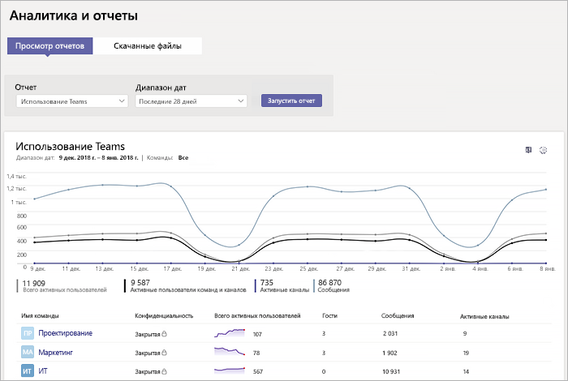

# Отчет об использовании Microsoft TeamsMicrosoft Teams usage report

Отчет об использовании Teams в центре администрирования Microsoft Teams дает вам общее представление об использовании Teams, включая количество активных пользователей и каналов. Благодаря этому вы можете быстро узнать, сколько пользователей в вашей организации используют Teams для общения и совместной работы.The Teams usage report in the Microsoft Teams admin center gives you an overview of the usage activity in Teams, including the number of active users and channels, so you can quickly see how many users across your organization are using Teams to communicate and collaborate. Вы можете просматривать сведения об использовании для команд, включая количество активных пользователей и каналов, гостей и сообщений в каждой команде.You can view usage information for  teams, including the number of active users and channels, guests, and messages in each team.

## Просмотр отчетаView the report

1. Откройте центр администрирования Microsoft Teams, в левой области навигации нажмите **Аналитика и отчеты**, а затем в разделе **Отчет** выберите **Использование Teams**.Go to the Microsoft Teams admin center, in the left navigation, click **Analytics & reports**, and then under **Report**, select **Teams usage**. 
2. Выберите диапазон в поле **Диапазон дат**, а затем нажмите кнопку **Запустить отчет**.Under **Date range**, select a range, and then click **Run report**.

## Толкование отчетаInterpret the report

|ВыноскаCallout |ОписаниеDescription  |
|--------|-------------|
|**1****1**   |В отчете об использовании Teams можно просматривать тенденции за последние 7 или 28 дней.The Teams usage activity report can be viewed for trends over the last 7 days or 28 days. |
|**2****2**   |Для каждого отчета указывается дата создания. Действия обычно отражаются в отчетах с задержкой в 24–48 ч.Each report has a date for when this report was generated. The reports usually reflect a 24 to 48 hour latency from time of activity. |
|**3****3**   |<ul><li>На оси X диаграммы представлен диапазон дат, выбранный для отчета.The X axis on the chart is the selected date range for the report.</li> <li> Значения по оси Y — это количество активных элементов или действий.The Y axis is the count of active items or activity.</li> </ul>Наведите указатель на точку, представляющую элемент или действие за ту или иную дату, чтобы увидеть количество экземпляров этого элемента или действия в соответствующий день.Hover over the dot representing an item or activity on a given date to see the number of instances of that item or activity on that given date.|
|**4****4**   |Вы можете отфильтровать содержимое диаграммы, щелкнув элемент условных обозначений.You can filter what you see on the chart by clicking an item in the legend. Например, можно выбрать элемент **Всего активных пользователей**, **Активные пользователи команд и каналов**, **Активные каналы** или **Сообщения**, чтобы отображались только соответствующие сведения.For example, click  **Total Active users**, **Teams & Channels active users**,  **Active channels**, or **Messages** to see only the info related to each one. При выборе другого значения данные в таблице не меняются.Changing this selection doesn’t change the information in the table. |
|**5****5**   |В этой таблице представлена разбивка использования по командам.The table gives you a breakdown of usage by team. <ul><li>**Отображаемое имя** —это отображаемое имя команды.**Display name** is the display name of the team. Вы можете щелкнуть отображаемое имя, чтобы перейти на страницу параметров группы в центре администрирования Microsoft Teams.You can click the display name to go to the team's settings page in the Microsoft Teams admin center. </li> <li>**Конфиденциальность** указывает на то, является ли команда частной или общедоступной.**Privacy** refers to whether the team is a private team or public team.</li> <li>**Активные пользователи** — это количество активных пользователей в команде за указанный период времени.**Active users** is the number of active users in the team in the specified time period.</li><li>**Гости** — это количество гостей в команде за указанный период времени.**Guests** is the number of guests in the team in the specified time period.</li> </li> </ul>Чтобы нужные сведения отображались в таблице, добавьте в нее соответствующие столбцы.To see the information that you want in the table, make sure to add the columns to the table. |
|**6****6**   |Нажмите **Изменение столбцов**, чтобы добавить или удалить столбцы в таблице.Select **Edit columns** to add or remove columns in the table. 
|**7****7**   |Нажмите **˙˙˙**, а затем выберите пункт **Печать диаграммы**, чтобы распечатать диаграмму.Select **˙˙˙**, and then **Print chart** to print the chart. |

## Статьи по темеRelated topics
- [Аналитика и отчеты TeamsTeams analytics and reporting](teams-reporting-reference.md)
- [Отчет по активности пользователей TeamsTeams user activity report](user-activity-report.md)
- [Отчет об использовании устройств в TeamsTeams device usage report](device-usage-report.md)
