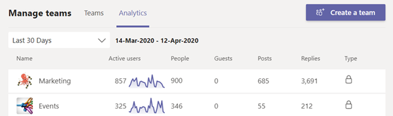

# Просмотр аналитики в Teams

В Microsoft Teams пользователи могут просматривать аналитику для команд и каналов, частью которых они являются. Эта информация дает пользователям представление о шаблонах использования и действиях в своих командах. Пользователи могут просматривать такие данные, как количество активных пользователей, записей, ответов и т. д. на трех уровнях.

- **Кросс-командная аналитика** предоставляет пользователям широкий обзор данных об использовании для всех команд, участником или владельцем которых они являются в одном представлении списка.
- **Аналитика для каждой** команды предоставляет пользователям более детализированное представление, отображающее данные об использовании для конкретной команды.
- **Аналитика по каналам** предоставляет пользователям еще более детализированное представление, отображающее данные об использовании для определенного канала.

Пользователи могут отфильтровать любое из этих представлений, чтобы просмотреть данные за указанный период времени.

## Просмотр кросс-командной аналитики

1. В Teams в нижней части списка команд рядом с пунктом "Присоединиться или **создать** команду" щелкните "Управление **командами"**.
2. Откройте **вкладку "Аналитика** ".
3. Выберите диапазон дат, чтобы отобразить данные об использовании для всех команд, участником или владельцем которых вы являетесь.

    

    |Item |Описание  |
    |--------|-------------|
    |**Имя**   |Имя команды. |
    |**Активные пользователи**   |Количество активных пользователей в команде и линия тренда активности команды за указанный период времени.
    |**Люди**   |Общее количество сотрудников в команде за указанный период времени. К ним относятся владельцы команд, участники команды и гости.|
    |**Гости**   |Количество гостей в команде за указанный период времени. |
    |**Сообщения**   |Количество новых сообщений, опубликованных в командном чате за указанный период времени. |
    |**Ответы**   |Количество ответов в командном чате за указанный период времени. |
    |**Тип**   |Является ли команда закрытой или общедоступной.|

## Просмотр аналитики для каждой команды

1. В Teams перейдите к нужной команде, нажмите кнопку "Дополнительные **параметры" (...)**, а затем нажмите кнопку "Управление **командой"**.
2. Откройте **вкладку "Аналитика** ".
4. Выберите диапазон дат, чтобы отобразить данные об использовании для команды.  

    

    |Item |Описание  |
    |--------|-------------|
    |**Сводка**   |Сводка действий команды, включая следующие:<ul><li>**Пользователи**: общее число пользователей за указанный период времени. К ним относятся владельцы команд, участники команды и гости.</li> <li>**Записи**: количество новых сообщений, опубликованных в командном чате за указанный период времени.</li><li>**Ответы:** количество ответов в командном чате за указанный период времени.</li> <li>**Приложения**: количество приложений, добавленных в команду.</li><li>**Собрания:** количество собраний Teams, организованных на уровне команды.</li> </ul> |
    |**Активные пользователи**   |Количество активных и неактивных пользователей.|
    |**Роль**   |Количество пользователей по роли, включая владельцев команд, участников команды и гостей.|
    |**Диаграмма активных** пользователей  |Число ежедневно активных. Наведите указатель мыши на точку в заданную дату, чтобы просмотреть количество активных пользователей в эту дату.|
    |**Диаграмма сообщений**  |Общее количество сообщений, опубликованных в групповом чате по дате. Наведите указатель мыши на точку в заданную дату, чтобы просмотреть количество новых записей и ответов, опубликованных в эту дату.|

> [!TIP]
> Вы также можете просмотреть аналитику для каждой команды, щелкнув команду в списке в представлении [кросс-командной аналитики](#view-cross-team-analytics).

## Просмотр аналитики по каналу

1. В Teams перейдите к нужному каналу, щелкните "Дополнительные **параметры" (...)**, а затем выберите "Управление **каналом"**.
2. Откройте **вкладку "Аналитика** ".
3. Выберите диапазон дат, чтобы отобразить данные об использовании канала.  

    

    |Item |Описание  |
    |--------|-------------|
    |**Сводка**   |Сводка действий канала, включая следующие:<ul><li>**Пользователи**: общее число пользователей за указанный период времени. К ним относятся владельцы команд, участники команды и гости.</li> <li>**Записи**: количество новых сообщений, отправленных в канал за указанный период времени.</li><li>**Ответы:** количество ответов в канале за указанный период времени.</li> <li>**Приложения**: количество приложений, добавленных в канал.</li> </ul> |
    |**Диаграмма сообщений**  |Общее количество сообщений, отправленных в чат канала по дате. Наведите указатель мыши на точку в заданную дату, чтобы просмотреть количество новых записей и ответов, опубликованных в эту дату.|

> [!TIP]
> Вы также можете просмотреть аналитику по каналу, выбрав канал в раскрывающемся списке в представлении аналитики для каждой [команды](#view-per-team-analytics).
    
> [!NOTE]
> Мы определяем активных пользователей как пользователей, которые выполняют намеренное действие в настольном клиенте, мобильном клиенте и веб-клиенте. Примерами намеренного действия могут быть запуск чата, размещение звонка, общий доступ к файлу, редактирование документа в командах, участие в собрании и т. д. Мы удаляем пассивные действия, такие как автоматическая загрузка, минимизация экрана или закрытие приложения. Мы также отменяем дублирование всех действий по одному идентификатору пользователя.

## См. также

- [Просмотр аналитики для команд](https://support.office.com/article/view-analytics-for-your-teams-5b8ad4b1-af34-4217-aff4-cd11a820b56b)
- [Аналитика и отчеты Teams](teams-reporting-reference.md)