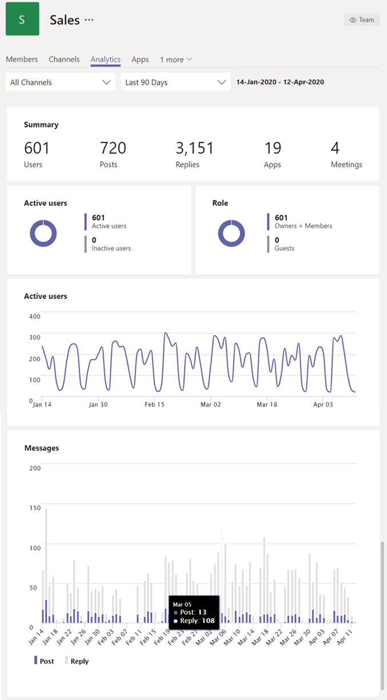

# Просмотр аналитики в Teams

В Microsoft Teams пользователи могут просматривать аналитику для команд и каналов, в которые они входит. Эти сведения дают пользователям представление о шаблонах использования и действиях в их командах. Пользователи могут видеть данные о количестве активных пользователей, записях, ответах и других данных на трех уровнях.

- **В разных командах** представлен общий обзор данных об использовании для всех команд, участником или владельцем одной команды в одном представлении списка.
- **Аналитические данные по группе** дают пользователям более детальное представление, в котором отображаются данные об использовании для определенной группы.
- **Аналитика по каналам** предоставляет пользователям еще более детальное представление, в котором отображаются данные об использовании для определенного канала.

Пользователи могут фильтровать любые из этих представлений, чтобы увидеть данные за указанный период времени.

## Просмотр аналитики для разных команд

1. В Teams в нижней части списка команд щелкните "Управление командами" рядом с командой **"Присоединиться или** создать **команду".**
2. Перейдите **на вкладку "Аналитика".**
3. Выберите диапазон дат, чтобы отобрать данные об использовании для всех команд, участником или владельцем команд.

    

    |Элемент |Описание  |
    |--------|-------------|
    |**Имя**   |Имя группы. |
    |**Активные пользователи**   |Количество активных пользователей в группе и линия тренда активности в течение заданного периода времени.
    |**Люди**   |Общее количество участников группы за указанный период времени. Это касается владельцев, членов команды и гостей.|
    |**Гости**   |Количество гостей в команде в течение указанного периода. |
    |**Записи**   |Количество новых сообщений, опубликованных в чате группы в указанный период времени. |
    |**Ответы**   |Количество ответов в чате группы в течение заданного периода времени. |
    |**Тип**   |Является ли команда закрытой или открытой.|

## Просмотр аналитики по группе

1. В Teams перейдите к нужной команде, щелкните "Дополнительные **параметры" (...)** и выберите **"Управление командой".**
2. Перейдите **на вкладку "Аналитика".**
4. Выберите диапазон дат, чтобы отобрать данные об использовании для группы.  

    

    |Элемент |Описание  |
    |--------|-------------|
    |**Сводка**   |Сводка по деятельности группы, включая следующие:<ul><li>**Пользователи:** общее количество пользователей за указанный период времени. Это касается владельцев, членов команды и гостей.</li> <li>**Posts:** Количество новых сообщений, опубликованных в чате группы в указанный период времени.</li><li>**Ответы:** количество ответов в чате группы в указанный период времени.</li> <li>**Приложения:** количество приложений, добавленных в команду.</li><li>**Собрания:** количество собраний Teams, организованных на уровне команды.</li> </ul> |
    |**Активные пользователи**   |Количество активных и неактивных пользователей.|
    |**Роль**   |Количество пользователей по роли, включая владельцев, членов команды и гостей.|
    |**Диаграмма "Активные пользователи"**  |Количество ежедневно активных действий. Наведите курсор на точку в заданную дату, чтобы узнать количество активных пользователей в эту дату.|
    |**Диаграмма сообщений**  |Общее количество сообщений, опубликованных в чате группы по дате. Наведите курсор на точку в заданную дату, чтобы увидеть количество новых сообщений и ответов, опубликованных в этот день.|

> [!TIP]
> Вы также можете просмотреть аналитические данные для группы, щелкнув команду в списке в представлении аналитики для [разных команд.](#view-cross-team-analytics)

## Просмотр аналитики по каналам

1. В Teams перейдите к нужному каналу, нажмите кнопку "Дополнительные **параметры" (...)** и выберите **"Управление каналом".**
2. Перейдите **на вкладку "Аналитика".**
3. Выберите диапазон дат для показа данных об использовании для канала.  

    

    |Элемент |Описание  |
    |--------|-------------|
    |**Сводка**   |Сводка по активности в канале, включая следующие:<ul><li>**Пользователи:** общее количество пользователей за указанный период времени. Это касается владельцев, членов команды и гостей.</li> <li>**Posts:** Количество новых сообщений, опубликованных на канале в указанный период времени.</li><li>**Ответы:** количество ответов на канале в течение указанного периода времени.</li> <li>**Приложения:** количество приложений, добавленных на канал.</li> </ul> |
    |**Диаграмма сообщений**  |Общее количество сообщений, опубликованных в чате канала по дате. Наведите курсор на точку в заданную дату, чтобы увидеть количество новых сообщений и ответов, опубликованных в этот день.|

> [!TIP]
> Вы также можете просмотреть аналитику по каналам, выбрав канал в списке в представлении аналитики для [группы.](#view-per-team-analytics)
    
> [!NOTE]
> Активные пользователи определяются как пользователи, которые выполняют преднамеренные действия в клиенте для настольных ПК, мобильном и веб-клиенте. Примерами преднамеренных действий являются начало чата, звонок, общий доступ к файлу, редактирование документа в командах, участие в собрании и другие действия. Мы открываем пассивные действия, такие как автоматическое загрузка, свести к минимуму экран или закрыть приложение. Кроме того, мы отписываем все действия с одним ИД пользователя.

## Статьи по теме

- [Просмотр аналитики для команд](https://support.office.com/article/view-analytics-for-your-teams-5b8ad4b1-af34-4217-aff4-cd11a820b56b)
- [Аналитика и отчеты Teams](teams-reporting-reference.md)