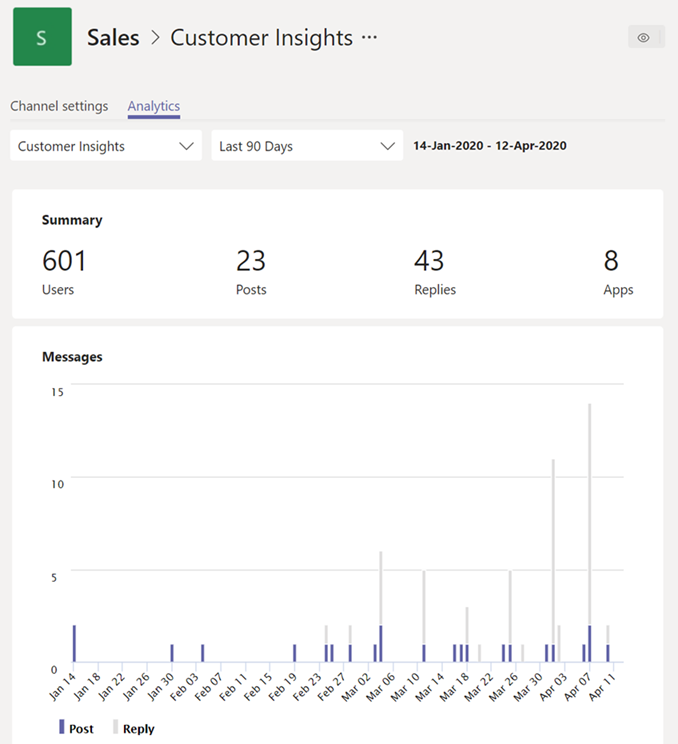

# Просмотр аналитических данных в TeamsView analytics in Teams

В Microsoft Teams пользователи могут просматривать Analytics для Teams и каналы, в которых они входят.In Microsoft Teams, users can view analytics for teams and channels that they are part of. Эта информация дает пользователям представление о шаблонах использования и действиях в их группах.This information gives users insight into usage patterns and activity on their teams. Пользователи могут просматривать такие данные, как количество активных пользователей, записи, ответы и многое другое на трех уровнях.Users can see data such as the number of active users, posts, replies, and more at three levels.

- С помощью **разных команд Analytics** пользователи могут просматривать сведения об использовании для всех групп, в которых они являются членами или владельцами, в одном представлении списка.**Cross-team analytics** gives users a broad overview of usage data for all teams that they are a member or owner of in a single list view.
- С помощью **Team Analytics** пользователи более детально отображаются, отображая данные об использовании определенной команды.**Per-team analytics** gives users a more granular view, showing usage data for a specific team.
- **Analytics для каждого канала** предоставляет пользователям более детальный вид, отображая данные об использовании для определенного канала.**Per-channel analytics** gives users an even more granular view, showing usage data for a specific channel.

Пользователи могут фильтровать любые из этих представлений и просматривать данные за указанный период времени.Users can filter any of these views to see data for a specified time period.

## Просмотр разных группового анализаView cross-team analytics

1. В группе Teams в нижней части списка группы рядом с **командой присоединиться к группе или создать ее**выберите пункт **Управление группами**.In Teams, at the bottom of the teams list, next to **Join or create a team**, click **Manage teams**.
2. Откройте вкладку **аналитика** .Click the **Analytics** tab.
3. Выберите диапазон дат, чтобы отобразить сведения об использовании для всех групп, в которых вы являетесь участником или владельцем.Select a date range to show usage data for all teams that you're a member or owner of.

    

    |ЭлементItem |ОписаниеDescription  |
    |--------|-------------|
    |**Имя****Name**   |Имя команды.Name of the team. |
    |**Активные пользователи****Active users**   |Количество активных пользователей в команде и тенденции активности группы за указанный период времени.Number of active users on the team and trend line of team activity during the specified time period.
    |**Люди****People**   |Общее количество пользователей в команде за указанный период времени.Total number of people on the team in the specified time period. Сюда входят владельцы групп, участники групп и гости.This includes team owners, team members, and guests.|
    |**«****Guests**   |Количество гостей в команде за указанный период времени.Number of guests on the team during the specified time period. |
    |**Провод****Posts**   |Количество новых сообщений, опубликованных в чате группы за указанный период времени.Number of new messages posted in team chat during the specified time period. |
    |**Клик****Replies**   |Количество ответов в чате группы за указанный период времени.Number of replies in team chat during the specified time period. |
    |**Тип****Type**   |Является ли группа частной командой или общедоступной командой.Whether the team is a private team or public team.|

## Просмотр в Team AnalyticsView per-team analytics

1. В Teams выберите нужную команду, щелкните **Дополнительные параметры (...)**, а затем выберите пункт **Управление командой**.In Teams, go to the team that you want, click **More options (...)**, and then click **Manage team**.
2. Откройте вкладку **аналитика** .Click the **Analytics** tab.
4. Выберите диапазон дат для отображения данных об использовании команды.Select a date range to show usage data for the team.  

    

    |ЭлементItem |ОписаниеDescription  |
    |--------|-------------|
    |**Сводка****Summary**   |Сводка по действиям группы, в том числе следующие:Summary of team activity including the following:<ul><li>**Пользователи**: общее количество пользователей за указанный период времени.**Users**: Total number of users in the specified time period. Сюда входят владельцы групп, участники групп и гости.This includes team owners, team members, and guests.</li> <li>**Записи**: количество новых сообщений, опубликованных в чате группы за указанный период времени.**Posts**: Number of new messages posted in team chat during the specified time period.</li><li>**Ответы**: количество ответов в чате группы за указанный период времени.**Replies**: Number of replies in team chat during the specified time period.</li> <li>**Приложения**: количество приложений, добавленных в группу.**Apps**: Number of apps added to the team.</li><li>**Собрания**: количество собраний Teams, организованных на уровне группы.**Meetings**: Number of Teams meetings organized at the team level.</li> </ul> |
    |**Активные пользователи****Active users**   |Количество активных и неактивных пользователей.Number of active and inactive users.|
    |**Роль****Role**   |Количество пользователей по ролям, в том числе владельцам групп, участникам групп и гостям.Numbers of users by role, including team owners, team members, and guests.|
    |Диаграмма " **Активные пользователи** "**Active users** chart  |Количество активных в день.Number of daily active. Наведите указатель мыши на точку в заданной дате, чтобы увидеть число активных пользователей на указанную дату.Hover over the dot on a given date to see the number of active users on that date.|
    |Диаграмма **сообщений****Messages** chart  |Общее количество сообщений, опубликованных в чате группы по дате.Total number of messages posted in team chat by date. Наведите указатель мыши на точку в заданной дате, чтобы увидеть количество новых записей и ответов, опубликованных в этой дате.Hover over the dot on a given date to see the number of new posts and replies posted on that date.|

> [!TIP]
> Вы также можете просмотреть аналитический анализ, щелкнув группу в списке в [представлении "перекрестное Team Analytics](#view-cross-team-analytics)".You can also view per-team analytics by clicking a team in list in the [cross-team analytics view](#view-cross-team-analytics).

## Просмотр аналитических данных по каналамView per-channel analytics

1. В Teams выберите нужный канал, щелкните **Дополнительные параметры (...)**, а затем выберите пункт **Управление каналом**.In Teams, go to the channel that you want, click **More options (...)**, and then click **Manage channel**.
2. Откройте вкладку **аналитика** .Click the **Analytics** tab.
3. Выберите диапазон дат для отображения данных об использовании канала.Select a date range to show usage data for the channel.  

    

    |ЭлементItem |ОписаниеDescription  |
    |--------|-------------|
    |**Сводка****Summary**   |Сводка по действиям каналов, включая следующие:Summary of channel activity including the following:<ul><li>**Пользователи**: общее количество пользователей за указанный период времени.**Users**: Total number of users in the specified time period. Сюда входят владельцы групп, участники групп и гости.This includes team owners, team members, and guests.</li> <li>**Записи**: количество новых сообщений, отправленных в канал за указанный период времени.**Posts**: Number of new messages posted to the channel during the specified time period.</li><li>**Ответы**: количество ответов в канале в указанный период времени.**Replies**: Number of replies in the channel during the specified time period.</li> <li>**Приложения**: количество приложений, добавленных в канал.**Apps**: Number of apps added to the channel.</li> </ul> |
    |Диаграмма **сообщений****Messages** chart  |Общее количество сообщений, отправленных в чат канала по дате.Total number of messages posted to the channel chat by date. Наведите указатель мыши на точку в заданной дате, чтобы увидеть количество новых записей и ответов, опубликованных в этой дате.Hover over the dot on a given date to see the number of new posts and replies posted on that date.|

> [!TIP]
> Вы также можете просмотреть аналитический анализ по каналам, выбрав канал в раскрывающемся списке в представлении "в [Team Analytics](#view-per-team-analytics)".You can also view per-channel analytics by selecting a channel in the drop-down list box in the [per-team analytics view](#view-per-team-analytics).
    
> [!NOTE]
> Мы определяем активные пользователи как пользователи, которые выполняют преднамеренные действия в классическом клиенте, мобильном клиенте и веб-клиенте.We define active users as users who perform an intentional action in the desktop client, mobile client, and web client. К примерам преднамеренного действия относятся начало чата, помещение звонка, совместное использование файла, редактирование документа в Teams, участие в собраниях и т. д.Examples of an intentional action include starting a chat, placing a call, sharing a file, editing a document within teams, participating in a meeting, and so on. Мы выходящими такие пассивные действия, как автоматическая загрузка, свертывание экрана или закрытие приложения.We strip out passive actions like auto boot, minimizing a screen, or closing the app. Кроме того, мы отменяем все действия для одного идентификатора пользователя.We also de-dupe all actions across a single user ID.

## Статьи по темеRelated topics

- [Просмотр аналитических данных для группView analytics for your teams](https://support.office.com/article/view-analytics-for-your-teams-5b8ad4b1-af34-4217-aff4-cd11a820b56b)
- [Аналитика и отчеты TeamsTeams analytics and reporting](teams-reporting-reference.md)