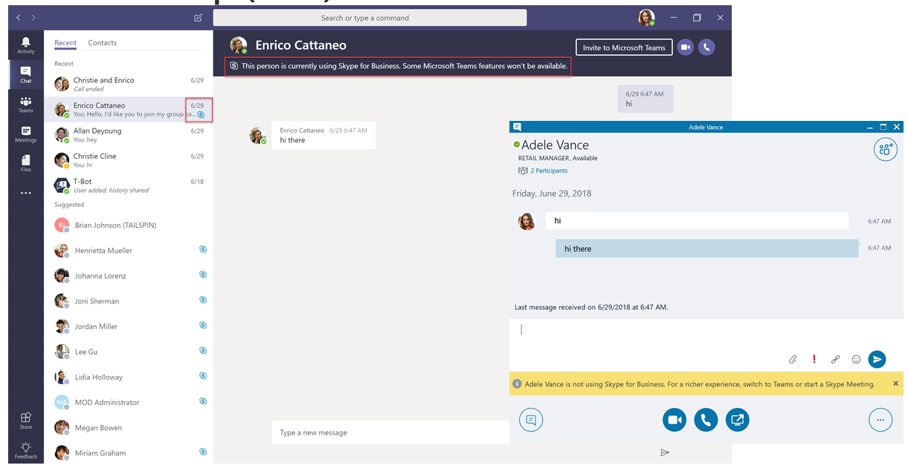

# Понимание Microsoft Teams и Skype для бизнеса сосуществования и совместной работы

Эта статья является частью этапа определения Project пути обновления. Завершив создание спонсорской команды и проектную команду, определите область, цели и план проекта. Прежде чем при этом подтверждать, что вы выполнили следующие действия:

- [Привлечение заинтересованных лиц по проекту](upgrade-enlist-stakeholders.md)
- [Определение области проекта](./upgrade-define-project-scope.md)

Если ваша организация использует Skype для бизнеса и вы начинаете использовать Teams вместе с Skype для бизнеса или вы начинаете обновление до Teams, важно понимать, как два приложения сосуществют, когда и как они пересекаются, и как управлять миграцией пользователей до перехода с Skype для бизнеса на Teams.

> [!Tip]
> В следующем сеансе вы узнаете о [сосуществовании и взаимосвязи.](https://aka.ms/teams-upgrade-coexistence-interop)
>
> Кроме того, вы можете присоединиться к нам для интерактивных семинаров, на которых мы будем делиться рекомендациями, рекомендациями и ресурсами, предназначенными для начала планирования и внедрения обновления.
>
> Чтобы [приступать к работе,](./upgrade-workshops-landing-page.yml) присоединитесь к сеансу планирования обновления.

## Обзор совместной работы Teams Skype для бизнеса.

В следующих разделах описаны режимы сосуществования, доступные при обновлении до Teams, и возможности каждого из них. Кроме того, мы описывают взаимодействия между пользователями в клиентах Skype-for-Business и пользователей в клиентах Teams и то, как выбранный режим сосуществования влияет на взаимодействия.

 Teams возможности совместной работы, чата, звонков и собраний. В зависимости от того, как Teams развертывание, эти возможности могут перекрываться с возможностями, Skype для бизнеса для определенного пользователя. По умолчанию режим должен запускаться Teams вместе Skype для бизнеса с перекрывающимися возможностями. Однако пользователю может быть назначен один из нескольких режимов совместной работы (также известных как режимы обновления), которые были разработаны таким образом, чтобы они не перекрывались с пользователем (в этом случае доступна возможность взаимодействия между Teams и Skype для бизнеса). Например, если у вас есть значительные Skype для бизнеса Server локального актива со сложным развертыванием Корпоративная голосовая связь, но вы хотите, чтобы пользователи могли  как можно быстрее получать доступ к современным собраниям, вы можете в качестве альтернативного пути оценить значение "Собрания сначала".

Рекомендуем просмотреть следующие режимы сосуществования, чтобы определить, какой путь будет правильным для вашей организации.

> [!Important]
> Режимы сосуществования по-прежнему будут существовать после выхода из Skype для бизнеса Online 31 июля 2021 г., но будут актуальны только для организаций с Skype для бизнеса Server. Незадолго до выхода на пенсию пользователям, размещенным в локальном развертывании, можно на назначенном режиме, кроме TeamsOnly. Однако после выхода из Skype для бизнеса Online пользователями, которые работают в облаке, могут быть только TeamsOnly.

### Режим "Острова"

По умолчанию пользователи могут запускать Teams вместе Skype для бизнеса как два отдельных решения, которые обеспечивают сходные и перекрывающиеся возможности. К ним относятся присутствие, чат, вызовы и собрания. Teams пользователи также могут воспользоваться новыми возможностями совместной работы, такими как команды и каналы, доступ к файлам в Microsoft 365 или Office 365 и приложениях.

В этом режиме, называемом **Островами,** клиентские приложения работают как отдельные острова. Skype для бизнеса беседы Skype для бизнеса, а Teams беседы с Teams. Как ожидается, пользователи будут работать с обоими клиентами всегда и смогут общаться в основном в клиенте, с которого было запущено взаимодействие. Поэтому в режиме "О-ва" нет необходимости в **взаимосвязи.**

Чтобы избежать путаницы или регрессионного Skype для бизнеса, Skype для бизнеса обрабатывает следующие интеграции, которые не обрабатываются в режиме Teams **Островов:**

- Внешние (федеративная) связь.
- Голосовые службы и голосовые приложения STN Office интеграцию.
- HID-элементы управления для USB-устройств.
- Несколько других интеграций.  

телефонная система не поддерживается в Teams в **режиме "Острова".** **Режим "Острова"** не поддерживает Корпоративная голосовая связь клиент Skype для бизнеса.

> [!Important]
> В **режиме "Острова"** все сообщения и звонки от федераированных пользователей (людей за пределами организации) доставляются в Skype для бизнеса. После перехода в **режим Teams** только на все сообщения и звонки из-за пределов организации доставляются в Teams.

> [!Tip]
> Skype для бизнеса Клиентам в Интернете рекомендуется использовать режим  "Острова по умолчанию", повысить насыщенность внедрения Teams организации, а затем быстро перейти Teams режим только для пользователей.  Развертывание Skype для бизнеса с помощью режима совместной работы **Teams** в качестве отправной точки вместо режима "Острова" может помочь развертывание локального и гибридного развертывания, а также ход выполнения от него до Skype для бизнеса в режиме **совместной** работы и собраний Teams (то есть "Сначала собрания"), а также в режиме **Teams** Только в том случае, если организация готова к развертыванию Teams. 

### Teams Только

Доступ **ко Teams** доступ ко всем  возможностям в Teams есть только у обновленного Teams. Клиент может сохранить Skype для бизнеса, чтобы присоединяться к собраниям на Skype для бизнеса, организованных пользователями, не обновленными или внешними лицами. Обновленный пользователь может продолжать общаться с другими пользователями в организации, которые по-прежнему используют Skype для бизнеса, используя возможности взаимодействия между Teams и Skype для бизнеса (при  условии, что пользователи Skype для бизнеса не находятся в режиме "Острова"). Однако обновленный пользователь не может начать чат Skype для бизнеса, звонок или собрание.

Как только ваша организация будет готова к использованию Teams в качестве своего средства связи и совместной работы, обновите их до **Teams режиме.** При переходе из  режима "О-ва" советуем сначала Teams процесс внедрения во всей организации. Это позволит избежать проблем с  взаимодействием из-за того, что режим "Острова" не обеспечивает взаимодействие.

В **режиме Teams** только Teams протокол SIP/Tel является приложением по умолчанию. Ссылки в карточке контакта пользователя в Outlook для звонков или чата будут обрабатываться Teams.

Дополнительные моменты о переходе в режим Teams **см.** в Teams [режиме.](teams-only-mode-considerations.md)

### Только Skype для бизнеса

В этом режиме сосуществования пользователи остаются в Skype для бизнеса ( а не Teams) для чатов, собраний и звонков и не используют Teams для команд и каналов. Этот режим доступен уже сегодня. однако в текущей реализации группы и каналы не отключаются автоматически для пользователя. Для этого можно использовать политику установки приложений, чтобы скрыть группы и файлы.

Этот режим можно использовать перед запуском управляемого развертывания Teams, чтобы запретить пользователям использовать Teams перед уже встроенной готовностью. В этом режиме также можно включить участие Teams собраний с Skype для бизнеса пользователями при условии, что у пользователей есть Teams.

### Skype для бизнеса с Teams совместной работы

Используйте этот режим, чтобы Teams в своей среде, продолжая использовать существующие инвестиции в Skype для бизнеса. Оставьте Skype для бизнеса без изменений для чата, звонков и собраний. Добавьте Teams совместной работы:

- Teams и каналы.
- Доступ к файлам в Microsoft 365 или Office 365.
- Приложений. Teams общения — приватный чат, вызовы и планирование собраний.

Teams этом режиме закрытый чат, вызовы и планирование собраний отключены по умолчанию.

Организациям, которые являются отправными точками локального или гибридного Skype для бизнеса Server,  следует использовать этот режим в качестве альтернативы о-вам, если они хотят сделать взаимодействие пользователей более предсказуемыми и предсказуемыми, а также  иметь предсказуемую временную шкалу для обновления до Teams (в отличие от использования насыщенности принятия в режиме "Острова").

### Skype для бизнеса с Teams и собраниями, также известным как "Собрания в первую очередь"

Используйте этот режим совместной работы, чтобы ускорить доступ Teams собраний и совместной работы в организации. В режиме совместной работы пользователи могут воспользоваться преимуществами Teams собраний.

- Отличное качество.
- Транскрибация и перевод.
- Размытый фон.
- Улучшенный пользовательский интерфейс на всех платформах, включая мобильные устройства и браузеры.

В этом режиме Teams не только для команд и каналов, но и для Teams и проведения собраний. Приватный чат и вызовы остаются в Skype для бизнеса. Teams и Skype для бизнеса преимущества различных возможностей, таких как выверка присутствия, автоматическое удержание и поддержка устройства HID в обоих приложениях. При желании команды и каналы можно скрыть с помощью политики установки приложений.

Этот режим сосуществования особенно полезен для организаций с Skype для бизнеса локального развертывания с Корпоративная голосовая связь. Скорее всего, этим организациям необходимо некоторое время на обновление до Teams и они хотят как можно скорее воспользоваться преимуществами Teams собраний.

> [!TIP]
> Чтобы определить рекомендуемый режим обновления на основе возможностей, которые вы хотите включить в Teams, пока Skype для бизнеса еще используется, используйте мастер Skype для [Teams](https://aka.ms/SkypeToTeamsWizard)обновления .

Дополнительные сведения о режимах сосуществования, предварительных условиях  и управлении см. в инструкциях по миграции и совместной работы для организаций, использующих Teams вместе с Skype для бизнеса и Настройка параметров сосуществования и [обновления.](./setting-your-coexistence-and-upgrade-settings.md)

|Значок точки решения |Определение значка |Описание |
|---|---|---|
||Точка принятия решений|<ul><li>Какие режимы сосуществования лучше всего подходят для потребностей организации и пользователей?</li></ul>|
||Следующее действие|<ul><li>Выберите оптимальный подход к обновлению.</li></ul>|

### Interoperability of Teams Skype для бизнеса

Возможность взаимодействия — это возможность Teams и Skype для бизнеса пользователей в одной организации для общения Teams и Skype для бизнеса.

Режим совместной работы определяется режимом совместной работы (режимом обновления) приемника. При подавке в режиме "О-ва" не существует возможности обеспечения interoperability. 

> [!Note]
> При развертывании в любом режиме сосуществования, кроме Островов **,** Teams и Skype для бизнеса могут общаться, позволяя пользователям общаться и звонить друг другу, а также обеспечивать плавность взаимодействия в организации во время обновления Teams. Режимы сосуществования регулируют совместное сотрудничество. Режим совместной работы приемника определяет доступность возможности совместной работы. Например, если приемник находится в режиме, в котором чат доступен только в одном клиенте (например, Teams), как правило, общение в чате будет доступно в том случае, если инициатор использует другой клиент (в данном случае Skype для бизнеса) для запуска чата. С другой стороны, если приемник находится в режиме, в котором чат доступен в обоих клиентах (в режиме "Острова"), для чата не будет доступно общение. Сообщение будет получено приемником в том же клиенте, в котором инициатор начал чат. Поэтому правильная связь в режиме **"Острова"** требует Teams насыщенности внедрения; то есть все пользователи активно используют и отслеживают оба клиента.

> [!Note]
> **Чтобы использовать последнюю версию для совместной работы, клиентская версия должна быть последней доступной в канале развертывания Office пользователя.**

#### Наротовая межбесерегация и межоповая посижений

Существует два типа межявок: родной и взаимосвязаный.

- В _клиенте,_ который используется в настоящее время, используется родной интерфейс. Один пользователь будет в клиенте Skype для бизнеса, а другой в Teams. При этом они не будут перенаться в другой клиент, чтобы общаться. Пользователи смогут вести беседу в клиенте, который используется в данный момент. Чаты и вызовы — это чаты и чаты.
- Во  время переупарации пользователи могут помочь пользователям выполнить дополнительные действия (например, совместный доступ к рабочему столу) и упростить создание собрания, к которому пользователи смогут присоединиться, чтобы продолжить работу на этом собрании. Собрание создается на платформе инициатора действия. Пользователи, которые не являются пользователями этой платформы, получают ссылку для присоединиться к собранию. При щелчке по этой ссылке они присоединяются к собранию в совместимом клиенте (браузере, веб-приложении или полно клиенте в зависимости от конфигурации). Чтобы не допустить Skype для бизнеса, требуется последний клиент. В настоящее время Teams по-настоящему. Обе эти возможности поддерживаются в взаимодействиях как в клиенте, так и в федеративных меж клиентах связи.

#### Native interop experiences

В зависимости от режимов сосуществования, которые назначены пользователям (как описано выше), доступны следующие варианты:

Skype для бизнеса пользователи могут общаться один на один с другими Teams и наоборот. Для общения между шлюзами, которые являются частью облачных служб Teams (и, следовательно, они существуют только в Интернете), требуется чат. Чаты interop — это обычный текст: не поддерживаются насыщенный текст и смайлики. Пользователи в Teams и Skype для бизнеса уведомлены о том, что беседа является беседой.

<!---->

Skype для бизнеса пользователи могут делать звонков и видеосвязь по одному Teams, а Teams пользователи могут делать то же самое.

<!---->

> [!Important]
> При локальном развертывании Skype для бизнеса требуется, чтобы она была в гибридном режиме с Microsoft 365 или Office 365 Skype для бизнеса. Подробные сведения см. в руководстве по миграции и [взаимосвязи.](./migration-interop-guidance-for-teams-with-skype.md)

Эти взаимодействия доступны для пользователей, которым назначен один из следующих режимов совместной работы: Skype для бизнеса с **Teams Совместная** работа , **Skype для бизнеса** с Teams Совместная работа и собрания , **только** Skype для бизнеса или **только** Teams . В режиме "О-ва" не существует возможности для обеспечения interoperability **для** пользователей.

#### Собственные ограничения для работы с interopop

Из-за различий в протоколах и технологиях невозможно полностью поддерживать все возможности. В частности, недоступны следующие возможности:

- Разметка, полноразмерный текст и полный набор смайликов не поддерживаются ни Teams, ни Skype для бизнеса. Другие функции окна сообщения в Teams чатах не поддерживаются.
- Общий доступ к экрану (совместный доступ к рабочему столу или приложению) между Teams и Skype для бизнеса не поддерживается. Однако эта поддержка поддерживается в рамках перепланиации.
- Групповые чаты (много сторона) в Teams могут включать только участников, которые используют Teams.
- В беседах с несколькими участниками (групповыми чатами) в Skype для бизнеса могут быть только участники, использующие Skype для бизнеса. Однако перенакопить на несколько сторон можно из Skype для бизнеса.
- Переключение текущего одноранговых или видеосвязи на одноранговые вызовы с несколькими пользователями, Teams и Skype для бизнеса не поддерживается.
- Передача файлов для двух сторон или вложенных файлов в групповых чатах, Teams в Skype для бизнеса и наоборот, не поддерживается.
- С помощью сохраняемой беседы невозможно Skype для бизнеса чата.

Для всех этих ограничений (кроме сохраняемого чата) одним из возможных обходных пути является начало собрания и приглашение другого пользователя присоединиться к нему.

Это обходное решение является основой для повышения нарастания отношений. В частности, совместный доступ к экрану и распространение на несколько разделов не могут быть достижимы в их языке, но они поддерживаются посредством межэтапной пооперации.

#### Interop опарывная ация

Межвузовая повеяние состоит в том, чтобы дополнять возможности связи наряду с управляемыми повышениями к собраниям. Собрания доступны всем, независимо от того, какой клиент у них есть.

Когда пользователь создает Teams, Teams создается собрание. При его запуске Skype для бизнеса создается собрание Skype для бизнеса собрания. В обоих случаях собрание,  созданное как собрание, не отражается в календаре пользователя.

Другая сторона получает ссылку на собрание через чат и присоединяется по этой ссылке. Если у Skype для бизнеса есть учетная запись Teams и приглашение приглашено пользователем Teams, он присоединяется к собранию, проходит проверку подлинности. В противном случае он присоединится как анонимный участник. И наоборот, Teams у пользователей почти всегда есть учетная запись Skype для бизнеса и клиент Skype для бизнеса, с помощью которые они могут присоединиться к собранию Skype для бизнеса в качестве участника, который проходит проверку подлинности, но также может присоединиться как анонимный участник, например с помощью приложения Skype Meeting App.

После присоединившись к собранию, участники могут проводить любые действия, поддерживаемые в собраниях, например совместный доступ к рабочему столу или содержимому, обмен файлами или передача файлов, добавление других участников и другие действия.

#### Нарастание на несколько Skype для бизнеса

Обновление отношений между Skype для бизнеса было обновлено в сборке ежемесячного обновления C2R за июль 2019 г. Раньше у Skype для бизнеса не было заблаговременного информирования о том, что удаленная сторона использует Teams. Это возможно только из-за сигнального сигнала, полученного после того, как сеанс был установлен.

Когда сигнальный сигнал указывает на то, что ответ поступил от (или через) шлюза interop, на ней отображалась желтая деловая панели (баннер), указывающая, что другая сторона не Skype для бизнеса. По мере развития службы это приводит к ложным срабатывам, когда Skype для бизнеса пользователи будут видеть деловую облачная голосовая почта-службу или другие  облачные голосовые службы, а не Teams только пользователю.

Чтобы предотвратить эти ложные срабатывания, служба присутствия теперь информирует клиент Skype для бизнеса о том, что другая сторона является Teams **фактическим** пользователем. Это позволяет Skype для бизнеса, что перед созданием беседы необходимо создать беседу, а окно беседы должно быть конкретным.

Например Skype для бизнеса пользователь хочет поделиться своим рабочим столом, он получает информацию о том, что мы начнем собрание, и поможет вам в этом.

Тем временем пользователь Teams получает входящий чат со ссылкой на собрание и получает сообщение с погонком присоединиться.

Это нарастание Skype для бизнеса собрания доступно как для меж клиента, так и для федераированных звонков и чатов в разных клиентах. Она по умолчанию и не настраивается администратором.

#### Нарастание на несколько Teams

Переход от Teams к собранию Teams теперь доступен, когда пользователь Teams нажал кнопку совместного доступа к рабочему столу в цепочке между клиентом с пользователем Skype для бизнеса или в цепочке федерации между клиентом. Поддержка перемотки поддерживается при 1:1 чате или 1:1 звонка.

Эта возможность поддерживается в клиенте Teams для настольных пк Windows, в клиенте Teams для Mac и в веб-клиенте Teams для браузеров, где поддерживается общий доступ к контенту, а также для связи с любой клиентской версией Skype для бизнеса.

В потоках обеспечения совместной работы и в потоках взаимосвязи федерации Teams пользователя теперь есть элементы управления (кнопка), с которые можно начать общий доступ к содержимому. Когда Teams нажать кнопку, пользователю будет выведно дополнительное меню с информацией о том, что для обмена содержимым Teams собрания.

Если пользователи были во время звонка, меню также предупредит их о том, что их текущий звонок между Teams и Skype для бизнеса будет прерываться, когда они будут помещаться на Teams собрание. При выборе этого действия пользователь может Skype для бизнеса, прежде чем принимать приглашение.

После принятия они помещаются в Teams собрания; они должны начать общий доступ из области общего доступа на собрании.

Тем временем пользователь Skype для бизнеса получает входящий чат со ссылкой на собрание и получает сообщение с постояступать к собранию.

Это нарастание Teams собрания доступно как для меж клиента, так и для федераированных звонков и чатов в разных клиентах. Она по умолчанию и не настраивается администратором. Однако если администратор включит в учетную записную группу 2010 или 2010 г., она будет ``-AllowPrivateMeetNow`` ``CsTeamsMeetingPolicy`` отключена ``$false`` для пользователя.

Просмотрев эту статью, см. статьи Выбор пути [обновления,](upgrade-and-coexistence-of-skypeforbusiness-and-teams.md)Руководство по миграции и совместной [работы,](./migration-interop-guidance-for-teams-with-skype.md)Сосуществование с Skype для бизнеса [и](coexistence-chat-calls-presence.md)Настройка параметров сосуществования и обновления для подробных сведений о внедрении.  Также рекомендуется видео: Управление сосуществованием и взаимодействиями между [SfB и Teams](https://www.youtube.com/watch?v=wEc9u4S3GIA&list=PLaSOUojkSiGnKuE30ckcjnDVkMNqDv0Vl&index=11)

## Технические сведения о Teams и Skype для бизнеса сосуществовании

В следующих разделах обобщены действия, которые могут возникнуть при запуске клиентов Teams и Skype для бизнеса в одной организации независимо от того, какой режим и какой метод обновления используется:

- [Собрания](#meetings)
- [Взаимодействия](#interoperability)
- [Interop versus native conversations](#interop-versus-native-conversation-threads)
- [Присутствие](#presence)
- [Федерация](#federation)
- [Контакты](#contacts)

### Собрания

Независимо от режима пользователи всегда могут присоединяться к собраниям любого типа, на которые они приглашены, независимо от того, Skype для бизнеса или Teams.  Однако пользователи должны присоединиться к собранию с помощью соответствующего клиента, который соответствует типу собрания:

- Если собрание является Teams, все участники (как пользователи TeamsOnly, Islands, так и Skype для бизнеса) используют клиент Teams присоединиться к собранию. Если Teams не установлен, пользователь будет направлен в Интернет при попытке присоединиться к собранию.

- Если собрание является Skype для бизнеса, все участники (как пользователи TeamsOnly, Islands, так и Skype для бизнеса) используют клиент Skype для бизнеса присоединиться к собранию. Если клиент Skype для бизнеса не установлен, пользователь будет перенаправлиться в Интернет, чтобы присоединиться с помощью Skype meeting App.

При организации собраний тип запланированного собрания зависит от режима организатора, как показано в таблице ниже.

| Режим организатора    |      Поведение |
| :------------------ | :---------------- |
| TeamsOnly, SfbWithTeamsCollabAndMeetings |    Все собрания, запланированные в Teams. Skype для бизнеса надстройка недоступна в Outlook. | 
| SfbWithTeamsCollab, SfbOnly   | Все собрания, запланированные в Skype для бизнеса. Teams надстройка недоступна в Outlook. | 
| Острова | По умолчанию собрания могут быть запланированы в Skype для бизнеса или Teams. Обе надстройки доступны в Outlook. Однако при необходимости вы можете потребовать, чтобы пользователи на островах всегда назначали собрания в Teams, назначая им экземпляр TeamsMeetingPolicy с preferredMeetingProviderForIslandsMode=Teams.| 

### Взаимодействия

Как описано выше в Teams и [Skype для бизнеса,](#interoperability-of-teams-and-skype-for-business)Teams поддерживает Skype для бизнеса в определенных сценариях. Взаимодействие во время взаимодействия — это чат или звонок между Skype для бизнеса и Teams пользователем.  Взаимодействие между пользователями возможно только между двумя пользователями; Многостолбный чат,вызовы или добавление дополнительных пользователей не поддерживаются.

При истинной связи между двумя пользователями создается чат или звонок между двумя пользователями.

- Один пользователь использует Teams, а другой — Skype для бизнеса.

- Получатель исходного сообщения имеет режим НЕО-Острова (в противном случае связь будет находится в одном клиенте), если оба пользователя находятся в одной организации. В федератете отправляя пользователь использует Teams, а получатель не находится в режиме TeamsOnly. 

- У Teams также НЕТ учетной записи Skype для бизнеса, которая является локальной.

Во время взаимодействия чат имеет обычный текст. Кроме того, совместный доступ к файлам и экрану невозможен в самом *чате.* Тем не менее, пользователи во время беседы могут легко добиться общего доступа к файлам и экрану, создав собрание по запросу в чате, как описано ниже.

- Если Teams пытается поделиться своим экраном, автоматически создается собрание по запросу Teams и его клиенту отправляется ссылка на Skype для бизнеса приглашения на него. Щелкнув ссылку, Skype для бизнеса откроет Teams и присоединится к собранию. Оба пользователя сейчас находятся на Teams собрания и могут при необходимости делиться ими.

- Если Skype для бизнеса клиент с 2018 г. или более поздней и пытается поделиться содержимым, автоматически создается собрание Skype для бизнеса по запросу, а его Teams отправляет ссылку на приглашение. Щелкнув ссылку, Teams попытается присоединиться к собранию Skype для бизнеса собрания. Если Teams установлен клиент Skype для бизнеса, он откроется и ему будет предложено войти (если он еще не вошел).  Если Teams не установлен клиент Skype для бизнеса, пользователю будет предложено использовать веб-версию. После того как оба пользователя будут вписались, они будут Skype для бизнеса собрания и смогут при необходимости делиться ими.

### Interop versus native conversations

Так как взаимодействие во время взаимодействия поддерживает не все функции беседы Teams, клиент Teams ведет отдельные беседы для Teams-к-Teams и Teams-Skype для бизнеса общения. Эти беседы в пользовательском интерфейсе отрисуются по-разному: цепочки взаимодействия можно отличить от обычной Teams цепочки.

- Отсутствие средств контроля за использованием текстов, общего доступа к файлам и экранам, невозможность добавить пользователей.
- Изменение значка целевого пользователя с символом "S" для Skype для бизнеса.

Эти различия показаны на снимках экрана ниже.

Уроженная Teams и Teams с помощью теста G3

An interop conversation with the same User G3 Test

После создания цепочки бесед ее тип никогда не изменяется. После создания цепочка в Teams всегда будет направлена в клиент Skype для бизнеса целевого пользователя. Нить всегда будет направлена в клиент целевого Teams пользователя.  Если режим пользователя-получателя изменится, существующие Teams цепочки для этого пользователя перестают работать и в чате будет отображаться заметка со ссылкой для начала новой беседы, как показано на снимке экрана ниже.

### Присутствие

Присутствие для данного пользователя зависит от действий пользователя в службе через клиента. Затем о присутствии будет опубликовано для других пользователей.  Skype для бизнеса и Teams отдельные службы с отдельными клиентами, поэтому каждая служба имеет свое состояние присутствия для пользователя.   Также существует синхронизация между службами присутствия в Teams и в Skype для бизнеса Online.  Это позволяет одной службе при необходимости опубликовать присутствие пользователя из другой службы. 

Публикация данных о присутствии основана на режиме пользователя. Существует три основных случая:

- Если пользователь находится в режиме TeamsOnly, все остальные пользователи видят Teams присутствия для этого пользователя, независимо от того, какой клиент он использует.

- Если пользователь находится в любом из режимов Skype для бизнеса, все остальные пользователи будут видеть Skype для бизнеса его присутствии независимо от того, какой клиент он использует.

- Если пользователь находится в режиме "О-ва", его присутствие, опубликованное в Skype для бизнеса и Teams, является независимым, поэтому присутствие, показанное для пользователей в той же организации, зависит от клиента другого пользователя. Пользователи федераированных организаций будут видеть присутствие этого пользователя на основе их Skype для бизнеса, так как федераированный трафик в режиме "Острова" находится в Skype для бизнеса.

Например, предположим, что пользователь А находится в режиме "Острова". Если пользователь А активен в Teams, но не в Skype для бизнеса, другие пользователи увидят, что пользователь А активен в клиенте Teams, но в клиенте Skype для бизнеса он будет видеть "Пользователь А" в автономном режиме. Это не так, так как с пользователем А невозможно получить данные, если клиент не запущен. 

### Федерация

Для федерации Teams другому пользователю Skype для бизнеса требуется, чтобы Teams был в Интернете Skype для бизнеса. TeamsUpgradePolicy регулирует маршрутику для входящих федераированных чатов и звонков. Поведение федераированной маршрутистики такое же, как и в сценариях с клиентом с одинаковым клиентом, за исключением режима "Острова". Когда получатели находятся в режиме "Острова":

- Чаты и звонки, Teams из Skype для бизнеса, если получатель находится в федераированном клиенте.
- Чаты и звонки, начатые Teams в Teams, если получатель находится в том же клиенте.
- Чаты и звонки, начатые Skype для бизнеса, всегда будут Skype для бизнеса.

Федеративная беседа может быть либо нитью, либо беседой. См. [interop и native conversations ....](#interop-versus-native-conversation-threads)

- Если и отправитель, и отправитель находятся в режиме обновления TeamsOnly, беседа будет иметь свой чат, который включает все возможности обмена сообщениями и звонков. Чтобы узнать больше, ознакомьтесь со чатом на языке внешних [(федеративных) пользователей](native-chat-for-external-users.md)в Teams. 

- Если кто-либо из участников беседы НЕ находится в режиме обновления TeamsOnly, беседа остается в текстовом режиме. В пользовательском интерфейсе федераированные чаты выставляются аналогично цепочкам взаимодействия с клиентом, за исключением заметки о том, что пользователь является внешним.

Дополнительные сведения  см. в Microsoft Teams и Чат на языке внешних [(федеративных) пользователей в Teams.](native-chat-for-external-users.md)

### Контакты

Teams и Skype для бизнеса есть отдельные списки контактов. Это означает, что добавления, удаление и изменения контактов, сделанные в одной системе, не синхронизируются с другой системой. Однако контакты из Skype для бизнеса автоматически копируются в Teams при любом из двух определенных событий: 

- Для любого Skype для бизнеса Online при первом входе в Teams контакты из Skype для бизнеса будут скопироваться в Teams.  Эта возможность недоступна для пользователей с локальной учетной записью в Skype для бизнеса Server.  

- После обновления пользователя до TeamsOnly (через назначение TeamsUpgradePolicy или через Move-CsUser -MoveToTeams) при следующем входе пользователя в Teams существующие контакты в Skype для бизнеса будут объединены с существующими контактами, уже существующими в Teams. Такое поведение происходит независимо от того, был ли пользователь перемещен в TeamsOnly из локальной или сетевой учетной записи. 

В обоих случаях передача контактов из Skype для бизнеса в Teams является асинхронной, поэтому может потребоваться несколько минут, прежде чем они появятся в Teams. Два события выше являются триггером копирования.  

### Связанные ссылки

[Руководство по миграции и взаимодействию для организаций, использующих Teams вместе со Skype для бизнеса](migration-interop-guidance-for-teams-with-skype.md) 

[Настройка гибридного подключения между Skype для бизнеса Server и Microsoft 365 или Office 365](/SkypeForBusiness/hybrid/configure-hybrid-connectivity)

[Перемещение пользователей между локальной средой и облаком](/SkypeForBusiness/hybrid/move-users-between-on-premises-and-cloud)

[Настройка сосуществования и обновления](setting-your-coexistence-and-upgrade-settings.md)

[Grant-CsTeamsUpgradePolicy](/powershell/module/skype/grant-csteamsupgradepolicy?view=skype-ps)

[Использование службы переноса собраний (MMS)](/skypeforbusiness/audio-conferencing-in-office-365/setting-up-the-meeting-migration-service-mms)
