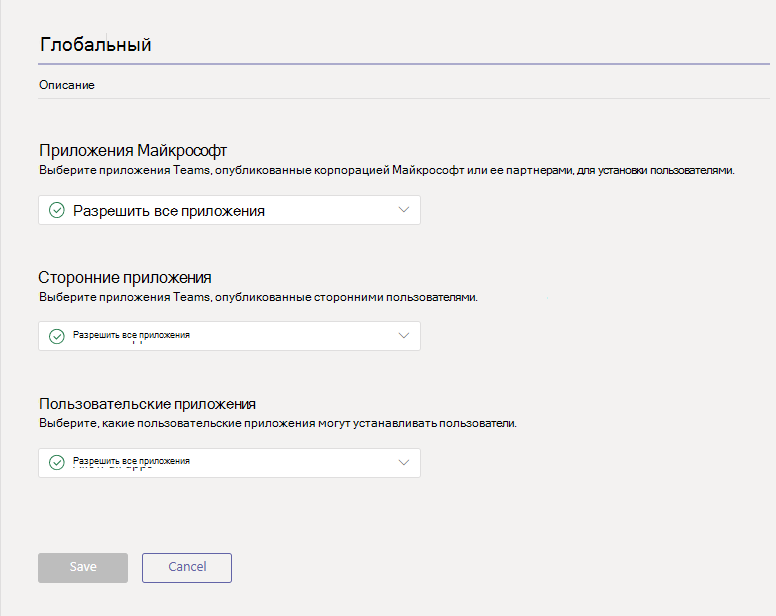
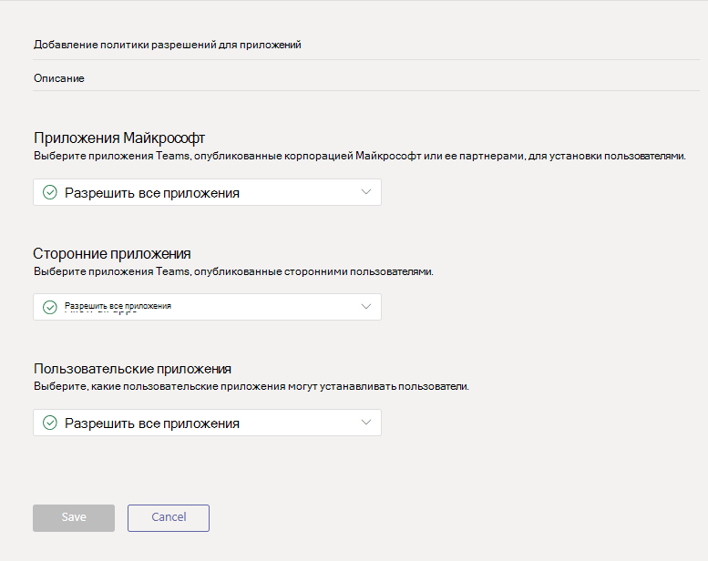

# Управление политиками разрешений для приложений в Microsoft Teams

Как администратор, вы можете использовать политики разрешений приложений, чтобы контролировать, какие приложения доступны пользователям Microsoft Teams в вашей организации. Вы можете разрешить или заблокировать все приложения или определенные приложения, опубликованные Microsoft, сторонними организациями и вашей организацией. Когда вы блокируете приложение, пользователи, имеющие эту политику, не могут установить ее из магазина приложений Teams. Вы должны быть глобальным администратором или администратором службы Teams, чтобы управлять этими политиками.

Вы можете управлять политиками разрешений для приложений в Центре администрирования Microsoft Teams. Вы можете использовать глобальную (по умолчанию в пределах организации) политику или создавать и присваивать настраиваемые политики. Пользователи вашей организации автоматически получают глобальную политику, если вы не создали и не назначили настраиваемую политику. После изменения или назначения политики изменения вступят в силу в течение нескольких часов.

> [!NOTE]
> Параметры приложения в пределах организации переопределяют глобальную политику и любые настраиваемые политики, созданные и назначенные пользователям.

Если организация уже использует Teams, параметры приложения, настроенные в **Параметрах на уровне клиента** в Центре администрирования Microsoft 365, будут отражаться в параметрах приложения в пределах организации на странице [Управление приложениями](manage-apps.md). Если вы только приступаете к работе с Teams, по умолчанию все приложения разрешены в глобальной политике. Сюда входят приложения, опубликованные корпорацией Майкрософт, сторонними производителями и вашей организацией.

Например, вы хотите заблокировать все сторонние приложения и разрешить определенные приложения корпорации Майкрософт для отдела кадров в вашей организации. Сначала перейдите на страницу [Управление приложениями](manage-apps.md) и убедитесь, что приложения, которые вы хотите разрешить для отдела кадров, разрешены на уровне организации. Затем создайте настраиваемую политику с именем "Политика разрешений для приложения отдела кадров", настройте ее, чтобы заблокировать и разрешить нужные приложения, а также назначить их пользователям команды отдела кадров.

> [!NOTE]
> Если вы развернули Teams в среде Microsoft 365 облако сообщества для государственных организаций High (GCCH) и Department of Defense (DoD), см. управление настройками приложений для Microsoft 365 для государственных [организаций](#manage-org-wide-app-settings-for-microsoft-365-government).  чтобы узнать больше о параметрах сторонних приложений, уникальных для GCCH и DoD.

## Создание настраиваемой политики разрешений для приложений

Чтобы управлять приложениями, доступными для различных групп пользователей в организации, создайте и назначьте одну или несколько настраиваемых политик разрешений для приложений. Можно создавать и назначать отдельные настраиваемые политики, в зависимости от того, публикуются ли приложения корпорацией Майкрософт, сторонними производителями или вашей организацией. Важно знать, что после создания настраиваемой политики вы не сможете изменить ее, если приложения сторонних разработчиков отключены в параметрах приложения в пределах организации.

1. В левой части панели администрирования Microsoft Teams перейдите к разделу **Приложения Teams** > **Политика разрешений**.
2. Нажмите **Добавить**. 
    
3. Введите имя и описание для политики.
4. В разделе **Приложения Microsoft**, **Сторонние приложения** и **Настраиваемые приложения** выберите один из следующих вариантов:

    - **Разрешить все приложения**
    - **Разрешить определенные приложения и блокировать все остальные**
    - **Блокировать определенные приложения и разрешить все остальные**
    - **Блокировать все приложения**

5. Если вы выбрали **Разрешить определенные приложения и блокировать все остальные**, добавьте приложения, которые необходимо разрешить:

    1. Нажмите **Разрешить приложения**.
    1. Найдите приложения, которые необходимо разрешить, и нажмите **Добавить**. Результаты поиска будут отфильтрованы по издателю приложения (**Приложения Microsoft**, **Сторонние приложения** или **Настраиваемые приложения**).
    1. Выбрав список приложений, нажмите **Разрешить**. 

6. Кроме того, если выбрана функция **Блокировать определенные приложения и разрешить все остальные**, найдите и добавьте приложения, которые нужно заблокировать, и нажмите **Заблокировать**.
7. Щелкните **Сохранить**.

## Изменение политики разрешений для приложений

В центре администрирования Microsoft Teams можно изменить политику, включая созданные глобальные и настраиваемые политики.

1. В левой части панели администрирования Microsoft Teams перейдите к разделу **Приложения Teams** > **Политика разрешений**.
2. Выберите политику, щелкнув слева от ее имени, а затем нажмите **Изменить**.
3. Внесите необходимые изменения. Можно управлять параметрами в зависимости от издателя приложения, а также добавлять и удалять приложения с учетом параметров "разрешить" и "блокировать".
4. Щелкните **Сохранить**.

## Назначение настраиваемой политики разрешений для приложений пользователям

[!INCLUDE [assign-policy](includes/assign-policy.md)]

## Управление параметрами приложений в пределах организации в Microsoft 365 для государственных организаций  

При развертывании Microsoft 365 GCCH и DoD Teams важно знать о параметрах сторонних приложений, которые уникальны для GCCH и DoD.

В GCCH и DoD все сторонние приложения по умолчанию блокируются. Кроме того, на странице политик разрешений для приложений в Центре администрирования Microsoft Teams отобразится следующая заметка об управлении сторонними приложениями.

Используйте параметры приложений в пределах организации, чтобы указать, могут ли пользователи устанавливать приложения сторонних разработчиков. Параметры приложения в пределах организации определяют поведение всех пользователей и переопределяют любые другие политики разрешений для приложений, назначенных пользователям. Их можно использовать для управления вредоносными или проблемными приложениями.

1. На странице **Политики разрешений** выберите **Параметры приложения в пределах организации**. Затем можно настроить необходимые параметры на панели.

    
    
2. В разделе **Сторонние приложения**, отключите и включите эти параметры для управления доступом к сторонним программам:

    - **Разрешить приложениям сторонних разработчиков**: Определяет, могут ли пользователи использовать приложения сторонних разработчиков. Если отключить этот параметр, пользователи не смогут устанавливать или использовать приложения сторонних разработчиков. При развертывании Microsoft 365 GCCH и DoD Teams этот параметр отключен по умолчанию.
    - **Разрешить любые новые сторонние приложения, опубликованные в магазине по умолчанию**: Определяет, будут ли новые сторонние приложения, опубликованные в магазине приложений Teams, автоматически доступны в Teams. Этот параметр доступен только, если разрешено использование приложений сторонних разработчиков.

3. В разделе **Заблокированные приложения** добавьте приложения, которые необходимо заблокировать в организации. При развертывании Microsoft 365 GCCH и DoD Teams все сторонние приложения по умолчанию добавляются в этот список. Чтобы разрешить стороннее приложение в вашей организации, удалите его из списка заблокированных приложений. При блокировке приложения в пределах организации оно автоматически блокируется для всех пользователей, независимо от того, разрешено ли это приложение в каких-либо политиках разрешений
4. Чтобы параметры приложения в пределах организации вступили в силу, выберите пункт **Сохранить**.

Как упоминалось выше, для разрешения приложений сторонних разработчиков можно изменить и использовать глобальную политику (по умолчанию в пределах организации) или создать и назначить настраиваемые политики.

## Вопросы и ответы

### Работа с политиками разрешений для приложений

#### Какие действия с приложениями влияют на политики разрешений?
Политики разрешений влияют на использование приложений, контролируя установку, обнаружение и взаимодействие с пользователями. Администраторы также могут управлять приложениями в Центре администрирования Microsoft Teams независимо от назначенных им политик разрешений.

#### Можно ли управлять бизнес-приложениями (LOB)?
Да, можно использовать политики разрешений для приложений, чтобы управлять внедрением и распространением пользовательских приложений (LOB). Можно создать настраиваемую политику или изменить глобальную политику, чтобы разрешать или блокировать настраиваемые приложения в зависимости от задач организации.

#### Как политики разрешений для приложений связаны с закрепленными приложениями и политиками настройки приложений?

Можно использовать политики настройки приложений вместе с политиками разрешений для приложений. Предварительно закрепленные приложения выбираются из набора включенных приложений для пользователя. Кроме того, если у пользователя есть политика разрешений для приложений, которая блокирует приложение в своей политике настройки, это приложение не будет отображаться в Teams.

#### Можно ли использовать политики разрешений для приложений, чтобы ограничить передачу пользовательских приложений?

Можно использовать параметры в пределах организации на странице **Управление приложениями** или политики настройки приложений, чтобы ограничить передачу пользовательских приложений в организацию.  

Чтобы запретить определенным пользователям передачу пользовательских приложений, используйте политики пользовательских приложений. Дополнительные сведения см. в статье [Управление политиками и параметрами пользовательских приложений в Teams](teams-custom-app-policies-and-settings.md).

#### Применяется ли блокировка приложения к клиентам Teams для мобильных устройств?

Да. Приложение блокируется для всех клиентов Teams.  

### Впечатления от использования

#### Что происходит если приложение заблокировано?

Пользователи не могут взаимодействовать с заблокированным приложением или его функциями, такими как боты, вкладки и расширения для сообщений. В общем контексте, например в чате команды или группы, боты все еще могут отправлять сообщения всем участникам этого контекста. Teams оповещает пользователя, когда приложение заблокировано.

Например, если приложение заблокировано, пользователи не могут выполнять действия ниже:

- Добавление приложения самостоятельно или в беседу или команду
- Отправка сообщений боту приложения
- Выполнение действий кнопок, которые отправляют информацию в приложение, например сообщения с действиями  
- Просмотр вкладок приложения
- Настройка соединителей для получения уведомлений
- Использование расширения для сообщений

Порталом прежней версии разрешено управление приложением на уровне организации. При этом заблокированное приложение блокируется для всех пользователей организации. Блокирование приложения на странице [Управление приложениями](manage-apps.md) происходит так же.

Для политик разрешений приложений, назначенных определенным пользователям, если приложение с функциями ботов или соединителя было разрешено, а затем заблокировано, и если затем это приложение разрешено только для определенных пользователей в общем контексте, участники группового чата или канала, у которых нет разрешения на доступ к этому приложению, смогут просматривать журнал сообщений и сообщения, отправленные с помощью бота или соединителя, но не смогут взаимодействовать с ним.

## Статьи по теме

[Параметры администратора для приложений в Teams](admin-settings.md)

[Назначение политик пользователям в Teams](policy-assignment-overview.md)
