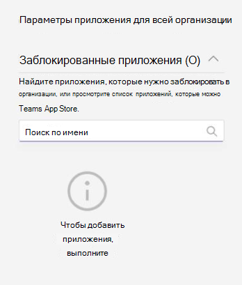

# Управление политиками разрешений для приложений в Microsoft Teams

Как администратор, вы можете использовать политики разрешений приложений, чтобы контролировать, какие приложения доступны пользователям Microsoft Teams в вашей организации. Вы можете разрешить или заблокировать все приложения или определенные приложения, опубликованные Microsoft, сторонними организациями и вашей организацией. Когда вы блокируете приложение, пользователи, имеющие эту политику, не могут установить ее из магазина приложений Teams. Вы должны быть глобальным администратором или администратором службы Teams, чтобы управлять этими политиками.

Вы можете управлять политиками разрешений для приложений в Центре администрирования Microsoft Teams. Вы можете использовать глобальную (по умолчанию в пределах организации) политику или создавать и присваивать настраиваемые политики. Пользователи вашей организации автоматически получают глобальную политику, если вы не создали и не назначили настраиваемую политику. После изменения или назначения политики изменения вступят в силу в течение нескольких часов.

> [!NOTE]
> Параметры приложения в пределах организации переопределяют глобальную политику и любые настраиваемые политики, созданные и назначенные пользователям.

Если организация уже использует Teams, параметры приложения, настроенные в **Параметрах на уровне клиента** в Центре администрирования Microsoft 365, будут отражаться в параметрах приложения в пределах организации на странице [Управление приложениями](manage-apps.md). Если вы только приступаете к работе с Teams, по умолчанию все приложения разрешены в глобальной политике. К ним относятся приложения, опубликованные корпорацией Майкрософт, сторонними поставщиками программного обеспечения и вашей организацией.

Предположим, например, вы хотите разрешить только несколько определенных приложений для отдела кадров в организации. Сначала на странице "Управление [приложениями](https://admin.teams.microsoft.com/policies/manage-apps) " убедитесь, что приложения, которые вы хотите разрешить группе кадров, разрешены на уровне организации. Затем создайте настраиваемую политику, задайте для нее блокировку и разрешение нужных приложений, а также назначьте политику пользователям из отдела кадров.

> [!NOTE]
> Сведения о параметрах сторонних приложений, уникальных для среды Microsoft 365 облако сообщества для государственных организаций High (GCCH) и Министерства обороны (DoD), см. в статье "Управление параметрами приложений для всей организации для Microsoft 365 для государственных [организаций](#manage-org-wide-app-settings-for-microsoft-365-government)".

## Создание настраиваемой политики разрешений для приложений

Используйте одну или несколько настраиваемых политик разрешений приложений, если вы хотите управлять приложениями, доступными для разных групп пользователей. Можно создавать и назначать отдельные настраиваемые политики, в зависимости от того, публикуются ли приложения корпорацией Майкрософт, сторонними производителями или вашей организацией. После создания настраиваемой политики вы не сможете изменить ее, если сторонние приложения отключены в параметрах приложения для всей организации.

1. Войдите в [Teams администрирования](https://admin.teams.microsoft.com/dashboard)
1. На панели слева перейдите к Teams **приложений** > **.**
1. Нажмите **Добавить**.

   

1. Укажите имя и описание политики.
1. В разделе **Приложения Microsoft**, **Сторонние приложения** и **Настраиваемые приложения** выберите один из следующих вариантов:

    * Разрешить все приложения
    * Разрешить определенные приложения и блокировать все остальные
    * Блокировать определенные приложения и разрешить все остальные
    * Блокировать все приложения

1. Если вы выбрали " **Разрешить определенные приложения" и заблокируют все остальные**, добавьте приложения, которые вы хотите разрешить:

    1. Нажмите **Разрешить приложения**.
    1. Найдите приложения, которые вы хотите разрешить, а затем нажмите кнопку **"Добавить"**. Результаты поиска будут отфильтрованы по издателю приложения (**Приложения Microsoft**, **Сторонние приложения** или **Настраиваемые приложения**).
    1. Выбрав список приложений, выберите " **Разрешить"**.

1. Аналогичным образом, если вы выбрали "Блокировать определенные приложения" и разрешите все **остальные**, найдите и добавьте приложения, которые нужно заблокировать, а затем выберите " **Блокировать"**.
1. Нажмите **Сохранить**.

## Изменение политики разрешений для приложений

Центр администрирования Teams для изменения политики, включая глобальную политику и настраиваемые политики, которые вы создаете.

1. В левой области центра администрирования Microsoft Teams перейдите к Teams **приложениям** > .
1. Выберите политику, щелкнув слева от ее имени, и нажмите **Изменить**.
1. Внесите необходимые изменения. Можно управлять параметрами в зависимости от издателя приложения, а также добавлять и удалять приложения с учетом параметров "разрешить" и "блокировать".
1. Нажмите **Сохранить**.

## Назначение настраиваемой политики разрешений для приложений пользователям

[!INCLUDE [assign-policy](includes/assign-policy.md)]

## Управление параметрами приложений в пределах организации в Microsoft 365 для государственных организаций  

В развертывании Microsoft 365 для государственных GCC, GCCH и DoD Teams все сторонние приложения блокируются по умолчанию. В облаках GCCH и DOD сторонние приложения недоступны. Кроме того, в GCC вы увидите следующее примечание об управлении сторонними приложениями на странице политик разрешений приложений в Microsoft Teams администрирования.

:::image type="content" source="media/app-permission-policies-gcc.png" alt-text="Снимок экрана: политика разрешений приложения в GCCH и DoD.":::

Используйте параметры приложений в пределах организации, чтобы указать, могут ли пользователи устанавливать приложения сторонних разработчиков. Параметры приложения в пределах организации определяют поведение всех пользователей и переопределяют любые другие политики разрешений для приложений, назначенных пользователям. Их можно использовать для управления вредоносными или проблемными приложениями.

<!---
1. On the **Permission policies** page, select **Org-wide app settings**. You can then configure the settings you want in the panel. --->

### Для GCC облака

1. На странице **"Управление приложениями** " выберите **параметры приложения для всей организации**. Затем можно настроить необходимые параметры на панели.

   

1. В разделе **Сторонние приложения**, отключите и включите эти параметры для управления доступом к сторонним программам:

    * **Разрешить сторонние приложения**. Этот параметр определяет, могут ли пользователи использовать сторонние приложения. Если отключить этот параметр, пользователи не смогут устанавливать или использовать приложения сторонних разработчиков. В Microsoft 365 для государственных организаций — GCCH и DoD развертывания Teams этот параметр отключен по умолчанию.
    * Разрешить любые новые сторонние приложения, опубликованные в Магазине по **умолчанию. Этот** параметр определяет, будут ли новые сторонние приложения, опубликованные в Teams App Store, автоматически доступны в Teams. Этот параметр доступен только, если разрешено использование приложений сторонних разработчиков.

1. В разделе **Заблокированные приложения** добавьте приложения, которые необходимо заблокировать в организации. В Microsoft 365 для государственных организаций — GCCH и DoD Teams все сторонние приложения добавляются в этот список по умолчанию. Чтобы разрешить стороннее приложение в вашей организации, удалите его из списка заблокированных приложений. При блокировке приложения на уровне организации приложение автоматически блокируется для всех пользователей независимо от того, разрешено ли оно в политиках разрешений приложения.

1. Нажмите **кнопку "** Сохранить", чтобы параметры приложения для всей организации вступает в силу.

Чтобы разрешить сторонние приложения, измените и используйте глобальную политику (по умолчанию для всей организации) или создайте и назначьте пользовательские политики.

### Для облаков GCCH и DoD

1. На странице **Политики разрешений** выберите **Параметры приложения в пределах организации**. Затем можно настроить необходимые параметры на панели.

   

1. В разделе **Заблокированные приложения** добавьте приложения, которые необходимо заблокировать в организации. В Microsoft 365 для государственных организаций — GCCH и DoD Teams все сторонние приложения добавляются в этот список по умолчанию. При блокировке приложения на уровне организации приложение автоматически блокируется для всех пользователей независимо от того, разрешено ли оно в политиках разрешений приложения.
1. Нажмите **кнопку "** Сохранить", чтобы параметры приложения для всей организации вступает в силу.

## Вопросы и ответы

### Работа с политиками разрешений приложений

#### Какие действия с приложениями влияют на политики разрешений?

Политики разрешений влияют на использование приложений, контролируя установку, обнаружение и взаимодействие с пользователями. Администраторы также могут управлять приложениями в Центре администрирования Microsoft Teams независимо от назначенных им политик разрешений.

#### Можно ли управлять бизнес-приложениями (LOB)?

Да, можно использовать политики разрешений для приложений, чтобы управлять внедрением и распространением пользовательских приложений (LOB). Можно создать настраиваемую политику или изменить глобальную политику, чтобы разрешать или блокировать настраиваемые приложения в зависимости от задач организации.

#### Как политики разрешений для приложений связаны с закрепленными приложениями и политиками настройки приложений?

Можно использовать политики настройки приложений вместе с политиками разрешений для приложений. Предварительно закрепленные приложения выбираются из набора включенных приложений для пользователя. Кроме того, если у пользователя есть политика разрешений для приложений, которая блокирует приложение в своей политике настройки, это приложение не будет отображаться в Teams.

#### Можно ли использовать политики разрешений для приложений, чтобы ограничить передачу пользовательских приложений?

Можно использовать параметры в пределах организации на странице **Управление приложениями** или политики настройки приложений, чтобы ограничить передачу пользовательских приложений в организацию.  

Чтобы запретить определенным пользователям передачу пользовательских приложений, используйте политики пользовательских приложений. Дополнительные сведения см. в статье [Управление политиками и параметрами пользовательских приложений в Teams](teams-custom-app-policies-and-settings.md).

#### Применяется ли блокировка приложения к клиентам Teams для мобильных устройств?

Да. Приложение блокируется для всех клиентов Teams.  

### Впечатления от использования

#### Что происходит если приложение заблокировано?

Пользователи не могут взаимодействовать с заблокированным приложением или его функциями, такими как боты, вкладки и расширения для сообщений. В общем контексте, например в чате команды или группы, боты все еще могут отправлять сообщения всем участникам этого контекста. Teams оповещает пользователя, когда приложение заблокировано.

Например, если приложение заблокировано, пользователи не могут выполнять какие-либо из следующих задач:

* Добавление приложения самостоятельно или в беседу или команду
* Отправка сообщений боту приложения
* Выполнение действий кнопок, которые отправляют информацию в приложение, например сообщения с действиями  
* Просмотр вкладки приложения
* Настройка соединителей для получения уведомлений
* Использование расширения для обмена сообщениями приложения

Порталом прежней версии разрешено управление приложением на уровне организации. При этом заблокированное приложение блокируется для всех пользователей организации. Блокирование приложения на странице [Управление приложениями](manage-apps.md) происходит так же.

Для политик разрешений приложений, назначенных определенным пользователям, если приложение с функциями ботов или соединителя было разрешено, а затем заблокировано, и если затем это приложение разрешено только для определенных пользователей в общем контексте, участники группового чата или канала, у которых нет разрешения на доступ к этому приложению, смогут просматривать журнал сообщений и сообщения, отправленные с помощью бота или соединителя, но не смогут взаимодействовать с ним.

## См. также

* [Параметры администратора для приложений в Teams](admin-settings.md)
* [Назначение политик пользователям в Teams](policy-assignment-overview.md)
* [Teams доступности функций](/office365/servicedescriptions/teams-service-description#feature-availability)
