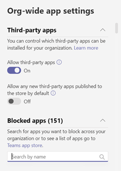

# Управление политиками разрешений для приложений в Microsoft Teams

Как администратор, вы можете использовать политики разрешений приложений, чтобы контролировать, какие приложения доступны пользователям Microsoft Teams в вашей организации. Вы можете разрешить или заблокировать все приложения или отдельные приложения, опубликованные корпорацией Майкрософт, сторонними лицами и вашей организацией. Когда вы блокируете приложение, пользователи, имеющие эту политику, не могут установить ее из магазина приложений Teams. Вы должны быть глобальным администратором или администратором службы Teams, чтобы управлять этими политиками.

Вы управляете политиками разрешений приложений в Центре администрирования Microsoft Teams. Вы можете использовать глобальную политику (по умолчанию в организации) или создать и назначить настраиваемые политики. Пользователи вашей организации автоматически получают глобальную политику, если вы не создали и не назначили настраиваемую политику. После изменения или назначения политики может занять несколько часов, чтобы изменения вступили в силу.

> [!NOTE]
> Параметры приложений для всей организации переопределяют глобальную политику и все настраиваемые политики, которые создаются и назначаются пользователям.

Если ваша организация уже работает в Teams, параметры приложения, настроенные в параметрах клиента в Центре администрирования Microsoft 365, отражаются в параметрах приложений для всей организации на странице "Управление приложениями".   Если вы только начинаете работу с Teams, по умолчанию все приложения разрешены в глобальной политике. Это относится к приложениям, опубликованным корпорацией Майкрософт, сторонними лицами и вашей организацией.

Например, вы хотите заблокировать все сторонние приложения и разрешить определенные приложения корпорации Майкрософт для отдела кадров в организации. Сначала перейдите на  страницу "Управление приложениями" и убедитесь, что приложения, которые вы хотите разрешить для отдела кадров, разрешены на уровне организации. Затем создайте настраиваемую политику с именем "Политика разрешений для приложений для управления персоналом", задайте для нее блокировку и разрешение приложений, а затем назначьте ее пользователям из отдела кадров.

> [!NOTE]
> Если вы развернули Teams в среде Microsoft 365 Government Community Cloud (GCC), см. в этом случае управление настройками приложений для [Microsoft 365](#manage-org-wide-app-settings-for-microsoft-365-government) для государственных организаций, чтобы узнать больше о параметрах сторонних приложений, уникальных для GCC.

## Создание настраиваемой политики разрешений для приложений

Если вы хотите управлять приложениями, доступными для разных групп пользователей в организации, создайте и назначьте одну или несколько настраиваемой политики разрешений для приложений. Вы можете создавать и назначать отдельные настраиваемые политики в зависимости от того, публикуются ли приложения корпорацией Майкрософт, сторонними лицами или вашей организацией. Важно знать, что после создания настраиваемой политики ее нельзя изменить, если сторонние приложения отключены в параметрах приложения для всей организации.

1. В левой области навигации Центра администрирования Microsoft Teams перейдите к политикам разрешений для приложений **Teams.**  >  
2. Нажмите **Добавить**.  
    
3. Введите имя и описание для политики.
4. В **приложениях Майкрософт,** **сторонних и** **пользовательских** приложениях выберите одно из следующих:

    - **Разрешить все приложения**
    - **Разрешить определенные приложения и заблокировать всех остальных**
    - **Блокировка определенных приложений и разрешение на доступ для всех остальных**
    - **Блокировать все приложения**

5. Если вы выбрали "Разрешить **определенные приложения" и заблокировали другие,** добавьте приложения, которые вы хотите разрешить:

    1. Выберите **"Разрешить приложения".**
    1. Найдите приложения, которые вы хотите разрешить, и нажмите кнопку **"Добавить".** Результаты поиска фильтруются по издателю приложения (приложения **Майкрософт,** сторонние приложения или **пользовательские приложения).**
    1. Нажав кнопку "Разрешить", выберите список **приложений.** 

6. Аналогично, если вы выбрали блок для определенных приложений и разрешили всем **остальным,** найдите и добавьте приложения, которые вы хотите заблокировать, а затем нажмите кнопку **"Заблокировать".**
7. Щелкните **Сохранить**.

## Изменение политики разрешений для приложений

Центр администрирования Microsoft Teams можно использовать для изменения политики, включая глобальную политику и настраиваемые политики, которые вы создаете.

1. В левой области навигации Центра администрирования Microsoft Teams перейдите к политикам разрешений для приложений **Teams.**  >  
2. Выберите политику, щелкнув слева от ее имени и нажав кнопку **"Изменить".**
3. В этой области внести нужные изменения. Вы можете управлять настройками на основе издателя приложения, а также добавлять и удалять приложения с учетом параметра "Разрешить/блокировать".
4. Щелкните **Сохранить**.

## Назначение пользовательской политики разрешений для приложений пользователям

[!INCLUDE [assign-policy](includes/assign-policy.md)]

## Управление настройками приложений для Microsoft 365 для государственных организаций  

При развертывании Teams в Microsoft 365 для государственных целей (GCC) важно знать о параметрах сторонних приложений, которые уникальны для GCC.

В GCC все сторонние приложения по умолчанию блокируются. Кроме того, в Центре администрирования Microsoft Teams вы увидите следующее примечание об управлении приложениями сторонних разработчиков на странице политик разрешений приложений.

Используйте параметры приложений для всей организации, чтобы управлять возможностью установки сторонних приложений пользователями. Параметры приложений для всей организации регулируют поведение всех пользователей и переопре параметров других политик разрешений приложений, которые назначены пользователям. С их помощью можно управлять вредоносными или проблемными приложениями.

1. На странице **"Политики разрешений"** выберите параметры приложений **для всей организации.** Затем на панели можно настроить нужные параметры.

    
    
2. В **сторонних приложениях** отключите или включите эти параметры для управления доступом к приложениям сторонних приложений.

    - **Разрешить использование сторонних приложений.** Это позволяет разрешить пользователям использовать приложения сторонних приложений. Если отключить этот параметр, пользователи не смогут устанавливать и использовать приложения сторонних приложений. В microsoft 365 Government — GCC развертывании Teams этот параметр отключен по умолчанию.
    - **Разрешить любые новые** сторонние приложения, опубликованные в Магазине по умолчанию. Это позволяет контролировать автоматическое доступ новых сторонних приложений, публикуемого в магазине приложений Teams, в Teams. Этот параметр можно установить только в том случае, если вы разрешаете сторонние приложения.

3. В **области "Заблокированные** приложения" добавьте приложения, которые вы хотите заблокировать в организации. При развертывании Teams в Microsoft 365 government — GCC все сторонние приложения добавляются в этот список по умолчанию. Если вы хотите разрешить доступ к любому из сторонних приложений в своей организации, удалите его из этого списка заблокированных приложений. Когда вы блокируете приложение в масштабе всей организации, оно автоматически блокируется для всех пользователей независимо от того, разрешено ли это в любых политиках разрешений приложений.
4. Нажмите **кнопку** "Сохранить", чтобы вступили в силу параметры приложений для всей организации.

Как упоминалось выше, чтобы разрешить использование сторонних приложений, вы можете редактировать и использовать глобальную политику (по умолчанию в организации) или создавать и назначать настраиваемые политики.

## Вопросы и ответы

### Работа с политиками разрешений приложений

#### На какие взаимодействия с приложениями влияют политики разрешений?
Политики разрешений регулируют использование приложений, контролируя установку, обнаружение и взаимодействие для конечных пользователей. Администраторы по-прежнему могут управлять приложениями в Центре администрирования Microsoft Teams независимо от политик разрешений, которые им назначены.

#### Можно ли управлять бизнес-приложениями?
Да, политики разрешений приложений можно использовать для управления распространением и раздатью пользовательских приложений. Вы можете создать настраиваемую политику или изменить глобальную политику, чтобы разрешить или заблокировать пользовательские приложения в зависимости от потребностей вашей организации.

#### Как политики разрешений приложений связаны с закрепленным приложением и политиками настройки приложений?

Политики настройки приложений можно использовать вместе с политиками разрешений приложений. Предварительно закрепленные приложения выбираются из набора включенных приложений для пользователя. Кроме того, если у пользователя есть политика разрешений для приложения, которая блокирует приложение в политике установки приложений, это приложение не будет отображаться в Teams.

#### Можно ли ограничить отправку пользовательских приложений с помощью политик разрешений приложений?

Вы можете использовать параметры для  всей организации на странице "Управление приложениями" или политики настройки приложений, чтобы ограничить отправку пользовательских приложений для организации.  

Чтобы запретить определенным пользователям загружать пользовательские приложения, используйте настраиваемые политики приложений. Дополнительные узнать см. в [управлении настраиваемой политикой и настройками](teams-custom-app-policies-and-settings.md)приложений в Teams.

#### Блокировка приложения относится к мобильным клиентам Teams?

Да, когда вы блокируете приложение, это приложение блокируется во всех клиентах Teams.  

### Взаимодействие с пользователем

#### Что происходит с пользователем, когда приложение заблокировано?

Пользователи не могут взаимодействовать с заблокированным приложением или его возможностями, такими как боты, вкладки и расширения для обмена сообщениями. В общем контексте, например в групповом или групповом чате, боты могут отправлять сообщения всем его участникам. Teams указывает пользователю, если приложение заблокировано.

Например, если приложение заблокировано, пользователи не могут:

- Добавление приложения лично или в чат или команду
- Отправка сообщений в бот приложения
- Выполнение действий с кнопками, которые отправляют информацию обратно в приложение, например сообщений с действиями  
- Просмотр вкладки приложения
- Настройка соединители для получения уведомлений
- Использование расширения для обмена сообщениями приложения

Устаревший портал позволял управлять приложениями на уровне организации, то есть когда приложение заблокировано, оно блокируется для всех пользователей в организации. Блокирование приложения на [странице "Управление приложениями"](manage-apps.md) работает точно так же.

Для политик разрешений приложений, которые назначены определенным пользователям, если приложение с ботом или соединитетелем было разрешено, а затем заблокировано и если это разрешено только для некоторых пользователей в общем контексте, участники группового чата или канала, не иметь разрешения на доступ к этому приложению, могут видеть историю сообщений, опубликованную ботом или соединитетелем. , но не можете взаимодействовать с ним.

## Статьи по теме

[Параметры администратора для приложений в Teams](admin-settings.md)

[Назначение политик пользователям в Teams](assign-policies.md)
