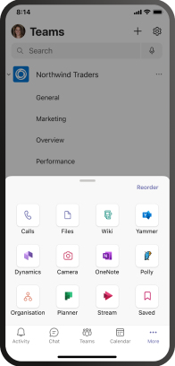
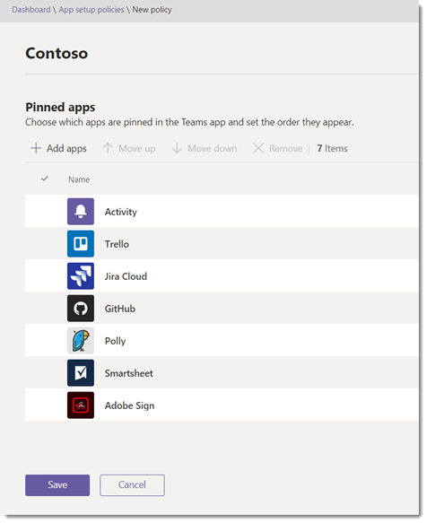

# Управление политиками настройки приложений в Microsoft Teams

Администраторы могут использовать политики настройки приложений для установки и закрепления приложений для продвижения наиболее часто используемых приложений в организации, а также для того, чтобы пользователи могли Teams.

- **Закрепление приложений:** с помощью политик настройки приложений можно выбирать приложения для закрепления, устанавливать порядок их показа для пользователей и управлять возможностью закрепления своих приложений на панели Teams приложений. Дополнительные сведения см. в теме [Закрепление приложений.](#pin-apps)
- **Установка приложений:** с помощью политик настройки приложений можно устанавливать приложения от имени пользователей при Teams и во время собраний. Дополнительные сведения см. в [установке приложений.](#install-apps)
- **Upload настраиваемые приложения:** политики настройки приложений позволяют пользователям загружать пользовательские приложения в Teams. Дополнительные сведения см. в Upload [пользовательских приложений.](#upload-custom-apps)

## Закрепление приложений

Закрепление приложений позволяет демонстрировать приложения, которые нужны пользователям в организации, в том числе приложения, встроенные сторонними разработчиками или разработчиками.

С помощью политики настройки приложения можно выполнять следующие задачи:

- Настройте Teams, чтобы выделить приложения, которые наиболее важны для ваших пользователей. Вы можете выбрать приложения для закрепления и настроить порядок их появления.
- Контроль, могут ли пользователи прикреплять приложения к Teams.

Приложения закреплены на панели приложений, которая находится в Teams клиенте и в нижней части Teams мобильных клиентов (iOS и Android).

|Классический клиент Teams  |Мобильный клиент Teams |
|---------|---------|
|   |         |

> [!NOTE]
> Если вы Teams для образования, важно знать, что приложение "Задания" по умолчанию закреплено в глобальной политике, хотя в настоящее время оно не указано в глобальной политике. Это будет четвертое приложение в списке закрепленных приложений в Teams клиентах.

Чтобы создать политику настройки приложений для закрепления приложений, сделайте следующее:

1. В левой области навигации Центра администрирования Microsoft Teams перейдите в Teams **политики установки**  >  **приложений**.

2. Нажмите **Добавить**.

3. Введите имя и описание для политики.

4. Включите или отключите разрешение закрепления для пользователей **в** зависимости от того, хотите ли вы позволить пользователям персонализировать свои панели приложений, прикрепив приложения к ней.

   > [!NOTE]
   > Параметр **Разрешить** закрепление пользователей доступен в Центре администрирования Teams в средах Microsoft 365 облако сообщества для государственных организаций (GCC) (GCC, GCC High и DoD), но в настоящее время он не действует.

5. В **области Закрепленные приложения** выберите Добавить **приложения**.

6. В области **Добавление закрепленных приложений** найди приложения, которые вы хотите добавить, и выберите **Добавить**. Вы также можете фильтровать приложения с помощью политики разрешений приложений.

7. Нажмите **Добавить**.

8. Расположить приложения в том порядке, в который они должны отображаться в Teams.

   

9. Нажмите **Сохранить**.

## Установка приложений

Вы можете выбрать приложения, установленные по умолчанию для пользователей в личной среде Teams, установить приложения в качестве расширений для сообщений [и](/microsoftteams/platform/messaging-extensions/what-are-messaging-extensions)назначить приложения, которые будут устанавливаться на собраниях.

С помощью политики настройки приложения можно выполнять следующие задачи:

- Установка приложений для пользователей в личных Teams среде
- Установка приложений для пользователей в качестве расширений для обмена сообщениями
- Установка приложений на собраниях для организаторов собраний

> [!NOTE]
> Пользователи по-прежнему смогут устанавливать  приложения самостоятельно, если это разрешает назначенная им политика разрешений.

Чтобы создать политику настройки приложений для установки приложений, сделайте следующее:

1. В левой области навигации Центра администрирования Microsoft Teams перейдите в Teams **политики установки**  >  **приложений**.

2. Нажмите **Добавить**.

3. Введите имя и описание для политики.

4. В **области Установленные приложения** выберите Добавить **приложения**.

5. В области **Добавить установленные** приложения найщите приложения, которые вы хотите автоматически установить для пользователей. Вы также можете фильтровать приложения с помощью политики разрешений приложений.

6. Нажмите **Добавить**.

> [!IMPORTANT]
> Пользователи не могут удалить приложения, установленные администраторами.

## Upload пользовательских приложений

С помощью центра Microsoft Teams администрирования можно создать настраиваемую политику, которая позволяет пользователям загружать пользовательские приложения в Teams.

Чтобы создать политику настройки приложения, которая позволит пользователям загружать пользовательские приложения в Teams, сделайте следующее:

1. В левой области навигации Центра администрирования Microsoft Teams перейдите в Teams **политики установки**  >  **приложений**.

2. Нажмите **Добавить**.

3. Введите имя и описание для политики.

4. Включите или **отключите Upload** настраиваемые приложения в зависимости от того, хотите ли вы разрешать пользователям загружать пользовательские приложения в Teams.

> [!NOTE]
> Этот параметр нельзя изменить,  если в настройках приложений для всей организации отключен параметр Разрешить приложения [сторонних разработчиков.](manage-apps.md#manage-org-wide-app-settings)

## Управление политиками настройки приложений

Вы управляете политиками настройки приложений в Microsoft Teams администрирования. Используйте глобальную политику (стандартную для всей организации) или создайте и назначьте настраиваемые политики.  Пользователи вашей организации автоматически получают глобальную политику, если вы не создали и не назначили настраиваемую политику. Вы должны быть глобальным администратором или администратором службы Teams, чтобы управлять этими политиками.

Вы можете изменить параметры глобальной политики, чтобы включить в нее нужные приложения. Чтобы настроить Teams для разных групп пользователей в организации, создайте и назначьте одну или несколько настраиваемых политик.

### Изменение политики настройки приложения

С помощью Центра Microsoft Teams администрирования можно редактировать политику, в том числе глобальную (по умолчанию в организации) политику и настраиваемые политики, которые вы создаете.

1. В левой области навигации Центра администрирования Microsoft Teams перейдите в Teams **политики установки**  >  **приложений**.

2. Выберите политику, которые вы хотите изменить, и выберите **изменить**.

3. Внести нужные изменения.

4. Нажмите **Сохранить**.

### Назначение настраиваемой политики настройки приложений пользователям

Дополнительные сведения о назначении политик пользователям см. в сведениях о назначении политик [пользователям и группам.](assign-policies-users-and-groups.md)

## Вопросы и ответы

### Работа с политиками настройки приложений

#### Можно ли назначить группу политику настройки приложений

С помощью PowerShell можно на назначение группам политик настройки приложений. Дополнительные сведения о назначении политик группам с помощью PowerShell см. в сведениях о назначении политик [пользователям и группам.](assign-policies-users-and-groups.md#use-the-powershell-option)

#### Встроенные политики настройки приложений, включенные в центр администрирования Microsoft Teams приложений

- **Глобальный (по умолчанию** для всей организации): эта политика по умолчанию применяется ко всем пользователям в организации, если только вы не назначите другую политику. Отредактируем глобальную политику, чтобы закрепить приложения, которые наиболее важны для пользователей.

- **FrontlineWorker:** эта политика для сотрудников с frontline. Вы можете назначить ее сотрудникам, работающим с телефоном в организации. Важно знать, что, как и настраиваемые политики, которые вы создаете, необходимо назначить политику пользователям, чтобы параметры были активными. Дополнительные сведения можно найти в разделе [Назначение](#assign-a-custom-app-setup-policy-to-users) настраиваемой политики настройки приложений пользователям этой статьи.

#### Почему не могу найти приложение в области "Добавить закрепленные приложения"

Не все приложения можно закрепить на Teams с помощью политики настройки приложений. Некоторые приложения могут не поддерживать эту функцию. Чтобы найти приложения, которые можно закрепить, найдите их в области Добавление **закрепленных** приложений. Вкладки с личной областью (статическими вкладками) и ботами можно закрепить в клиенте Teams для настольных пк, и эти приложения доступны в области Добавление **закрепленных** приложений.

Имейте в виду, что Teams app Store перечислены все Teams приложения. В **области Добавить закрепленные** приложения доступны только приложения, которые можно закрепить Teams с помощью политики.

#### Я администратор Teams для образования. Что нужно знать о политиках настройки приложений в Teams для образования

Приложение "Вызовы" не доступно в Teams для образования. При создании новой настраиваемой политики настройки приложения приложение "Вызовы" отображается в списке приложений. Однако приложение не закреплено в Teams, и Teams для образования пользователи не увидят приложение "Звонки" в Teams.

#### Количество закрепленных приложений, которые можно добавить в политику

В мобильных клиентах Teams (iOS и Android) должно быть закреплено как минимум два приложения. Если в политике менее двух приложений, мобильные клиенты не будут отражать ее параметры и будут продолжать использовать существующую конфигурацию.

Количество закрепленных приложений, которые можно добавить в политику, не ограничивается.

#### Сколько времени займет внесение изменений в политику

После изменения или назначения политики изменения вступят в силу в течение нескольких часов.

### Впечатления от использования

#### Как пользователи могут видеть все закрепленные приложения в Teams

Чтобы просмотреть все приложения, закрепленные для пользователя, пользователям может потребоваться сделать следующее в зависимости от количества установленных приложений и размера окна Teams клиента.

|Классический клиент Teams |Мобильный клиент Teams |
|---------|---------|
|На панели приложения сбоку Teams выберите **... Другие приложения**.| На панели приложения в нижней части Teams проведите пальцем вверх.|
|    |  

#### Что нужно знать о мобильном Teams

Мобильные Teams (iOS и Android) поддерживают личные приложения со статическими вкладками. Приложения, закрепленные в Teams, будут отображаться в Teams мобильных клиентах. Личные боты будут отображаться в чате в мобильных клиентах.

Приложения сторонних пользователей (которые можно скачать из Teams Store) должны быть утверждены, прежде чем они будут доступны на мобильном устройстве. Если администратор закрепит приложение, которое не используется корпорацией Майкрософт для мобильных устройств, оно будет Teams на рабочем столе, но не на мобильном устройстве. Дополнительные [сведения см. в](/microsoftteams/platform/tabs/what-are-tabs#mobile-clients) мобильных клиентах.

В мобильных клиентах Teams пользователи будут видеть основные Teams, такие как действия, чат и Teams, и вы можете закрепить некоторые приложения от Майкрософт, например Shifts.

#### Могут ли пользователи изменять порядок приложений, закрепленных с помощью политики

Пользователи могут изменять порядок закрепленных приложений на Teams и  мобильных клиентах, если включен параметр Разрешить закрепление пользователей. Пользователи не могут изменить порядок закрепленных приложений в Teams клиентах.

#### Имеет ли приоритет закрепление пользователей

Пин-коды администраторов всегда имеют приоритет. Если параметр **Разрешить закрепление** пользователей включен, то пользователи будут хранить закрепленные приложения под закрепленным администратором приложениями. Если параметр **Разрешить** закрепление пользователей отключен, пользователи потеряют свои пин-коды, а на панели приложений будут доступны только приложения, закрепленные администратором.

### Пользовательские Teams приложения

#### Моя организация создало пользовательское приложение Teams и опубликовало его в AppSource или каталоге приложений клиента, но значок приложения не отображается, как ожидалось, когда приложение закреплено на панели приложений в Teams. Как это исправить

Прежде чем отправлять приложение, следуйте инструкциям для логотипа. Дополнительные данные см. в списке [отправки панели мониторинга продавца.](/microsoftteams/platform/concepts/deploy-and-publish/appsource/prepare/overview)

## Статьи по теме

[Параметры администратора для приложений в Teams](admin-settings.md)

[Назначение политик пользователям в Teams](assign-policies-users-and-groups.md)
