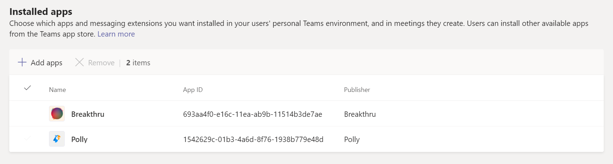

# Управление политиками настройки приложений в Microsoft Teams

Администратор использует политики установки приложений для установки и закрепления приложений, а также позволяет пользователям отправлять пользовательские приложения. Закрепление помогает повысить уровень внедрения соответствующих приложений в организации.

* **Закрепление приложений:** Политики установки приложений позволяют выбирать приложения для закрепления, настраивать порядок отображения приложений для пользователей на панели приложений Teams или в области создания сообщения. Администраторы также могут контролировать, могут ли конечные пользователи закреплять собственные приложения. См [. раздел "Закрепление приложений"](#pin-apps).
* **Установка приложений:** Политики установки приложений позволяют устанавливать приложения от имени пользователей при запуске Teams и во время собраний. Дополнительные сведения см. в разделе ["Установка приложений"](#install-apps).
* **Отправка пользовательских приложений:** Политики установки приложений позволяют пользователям отправлять пользовательские приложения в Teams. Дополнительные сведения см. в статье ["Отправка пользовательских приложений"](#upload-custom-apps).

## Закрепление приложений

Закрепление приложений позволяет выделять приложения, которые больше всего нужны пользователям в вашей организации. Закрепление работает для приложений, предоставляемых корпорацией Майкрософт, независимых поставщиков программного обеспечения и разработчиками в организации. При закреплении приложения с помощью политики установки приложения оно также устанавливается. С помощью политики установки приложения можно выполнить следующие задачи:

* Настройте Teams, чтобы выделить приложения, которые наиболее важны для ваших пользователей. Вы выбираете приложения для закрепления и задаете порядок их отображения.
* Укажите, могут ли пользователи закреплять приложения.

Приложения закрепляются на панели приложений в левой части настольного клиента Teams и в нижней части мобильных клиентов Teams.

|Классический клиент Teams  |Мобильный клиент Teams |
|---------|---------|
|.  |         |

Расширения для обмена сообщениями доступны в нижней части области создания сообщения.

Чтобы создать политику установки приложений для закрепления приложений, выполните следующие действия.

1. Войдите в [Центр администрирования Microsoft Teams](https://admin.teams.microsoft.com).

1. В левой области перейдите к политикам **установки приложений** >  Teams **.**

1. Нажмите **Добавить**.

1. Введите имя и описание для политики.

1. Включите **закрепление пользователя**.

   > [!NOTE]
   > Параметр  закрепления пользователей доступен в Центре администрирования Teams в средах Microsoft 365 Government Community Cloud (GCC, GCC High и DoD), но в настоящее время он не действует.

1. В **разделе закрепленных приложений** выберите " **Добавить приложения"**.

1. На панели **"Добавление закрепленных приложений** " найдите приложения, которые вы хотите добавить, а затем нажмите кнопку **"Добавить"**. Вы также можете фильтровать приложения по политике разрешений приложений.

1. Нажмите **Добавить**.

1. На панели **приложения или** **в расширениях для** обмена сообщениями расположите приложения в том порядке, в котором они должны отображаться в Teams.

   :::image type="content" source="media/pin-messaging-extensions.png" alt-text="Раздел закрепленных приложений"border="true":::

1. Нажмите **Сохранить**.

> [!NOTE]
> В Teams для образования приложение "Назначения" по умолчанию закреплено в глобальной политике, даже если оно не отображается в глобальной политике.

> [!NOTE]
> Для сотрудников без компьютеров в организации рекомендуется использовать специализированное интерфейсное приложение. Эта функция закрепляет наиболее релевантные приложения в Teams для пользователей с лицензией [F](https://www.microsoft.com/en-us/microsoft-365/enterprise/frontline?rtc=1#office-SKUChooser-0dbn8nt). Дополнительные сведения см [. в статье "Адаптация приложений Teams для сотрудников без компьютеров"](/microsoft-365/frontline/pin-teams-apps-based-on-license?bc=%2fmicrosoftteams%2fbreadcrumb%2ftoc.json&toc=%2fmicrosoftteams%2ftoc.json).

## Установка приложений

С помощью политики установки приложения администратор может выполнить следующие задачи:

* По умолчанию установите приложения для конечных пользователей в личной среде Teams.
* Установите приложения для конечных пользователей в качестве [расширений для обмена сообщениями](/microsoftteams/platform/messaging-extensions/what-are-messaging-extensions).
* Установка приложений на собраниях для организаторов собраний.

Конечные пользователи могут устанавливать приложения самостоятельно, если это разрешено [политикой](teams-app-permission-policies.md) разрешений приложения.

Чтобы создать политику установки приложений для установки приложений, выполните следующие действия.

1. Войдите в Центр администрирования Teams и получите доступ к **политикам установки** > **приложений** Teams.

2. Нажмите **Добавить**.

3. Укажите имя и описание политики.

4. В **разделе "Установленные приложения**" выберите **"Добавить приложения"**.

5. В области **"Добавление установленных приложений** " найдите приложения, которые требуется установить для пользователей. Вы также можете фильтровать приложения по политике разрешений приложений.

6. Нажмите **Добавить**.

> [!IMPORTANT]
> Пользователи не могут удалять приложения, установленные администраторами.

>[!NOTE]
> С помощью этой процедуры нельзя установить настраиваемые приложения с настраиваемыми вкладками.

## Отправка пользовательских приложений

Чтобы создать пользовательскую политику, позволяющую пользователям отправлять пользовательские приложения, выполните следующие действия.

1. Войдите в Центр администрирования Teams и получите доступ к **политикам установки** > **приложений** Teams.

2. Нажмите **Добавить**.

3. Укажите имя и описание политики.

4. Включите или отключите **отправку пользовательских приложений**.

> [!NOTE]
> Чтобы изменить этот параметр, параметры приложения на  уровне организации вашего клиента должны разрешать **сторонние приложения**.

## Управление политиками установки приложений

Вы управляете политиками установки приложений в Центре администрирования Microsoft Teams. Используйте глобальную политику (по умолчанию для всей организации) или создайте и назначьте пользовательские политики. Конечные пользователи получают глобальную политику. При создании настраиваемой политики она переопределяет глобальную политику. Управлять этими политиками может глобальный администратор или администратор служб Teams.

Чтобы включить нужные приложения, измените параметры глобальной политики. Чтобы настроить Teams для разных групп пользователей в организации, создайте и назначьте одну или несколько настраиваемых политик.

### Изменение политики установки приложения

Центр администрирования Microsoft Teams можно использовать для изменения политики, включая глобальную политику (по умолчанию для всей организации) и настраиваемые политики, которые вы создаете.

1. На панели навигации в левой стороне окна Центра администрирования Microsoft Teams выберите **Приложения Teams** > **Политики настройки**.

2. Выберите политику, которую нужно изменить, а затем нажмите кнопку **"Изменить"**.

3. Внесите необходимые изменения.

4. Нажмите **Сохранить**.

### Назначение настраиваемой политики установки приложения пользователям и группам

Дополнительные сведения о назначении политик пользователям и группам см. в статье "Назначение политик [пользователям и группам"](assign-policies-users-and-groups.md).

## Вопросы и ответы

<!--- TBD: Incorporate these pointers in the content itself.
--->

### Работа с политиками установки приложений

#### Какие встроенные политики установки приложений включены в Центр администрирования Microsoft Teams

* **Глобальная (по умолчанию для** всей организации). Эта политика по умолчанию применяется ко всем пользователям в организации, если вы не назначите другую политику. Измените глобальную политику, чтобы закрепить приложения, наиболее важные для пользователей.

* **FrontlineWorker:** эта политика предназначена для сотрудников без компьютеров. Его можно назначить сотрудникам без компьютеров в организации. Важно знать, что, как и настраиваемые политики, которые вы создаете, необходимо назначить политику пользователям, чтобы параметры были активными. Дополнительные сведения см. в разделе "Назначение пользовательской политики настройки [приложения пользователям"](#assign-a-custom-app-setup-policy-to-users-and-groups) этой статьи.

#### Почему не удается найти приложение на панели "Добавление закрепленных приложений"

Не все приложения можно закрепить в Teams с помощью политики установки приложений. Некоторые приложения могут не поддерживать эту функцию. Чтобы найти приложения, которые можно закрепить, выполните поиск приложения на панели **"Добавление закрепленных** приложений". Вкладки с личной областью (статическими вкладками) и ботами можно закрепить на настольном клиенте Teams, и эти приложения доступны в области "Добавление **закрепленных приложений** ".

Помните, что в магазине приложений Teams перечислены все приложения Teams. Область **"Добавление закрепленных** приложений" включает только приложения, которые можно закрепить в Teams с помощью политики.

#### Я администратор Teams для образования. Что нужно знать о политиках установки приложений в Teams для образования

Вызывающее приложение недоступно в Teams для образования. При создании новой настраиваемой политики установки приложения вызывающее приложение отображается в списке приложений. Однако приложение не закреплено на клиентах Teams, Teams для образования пользователи не будут видеть приложение "Вызовы" в Teams.

#### Сколько закрепленных приложений можно добавить в политику

На мобильных клиентах Teams (iOS и Android) должно быть закреплено как минимум два приложения. Если политика содержит менее двух приложений, мобильные клиенты не будут отражать параметры политики и будут продолжать использовать существующую конфигурацию.

Количество закрепленных приложений, которые можно добавить в политику, не ограничивается.

#### Сколько времени требуется, чтобы изменения политики вступили в силу

После изменения или назначения политики изменения вступят в силу в течение нескольких часов.

### Впечатления от использования

#### Как пользователи могут видеть все закрепленные приложения в Teams

Чтобы просмотреть все приложения, закрепленные для пользователя, пользователям может потребоваться выполнить следующие действия в зависимости от количества установленных приложений и размера клиентского окна Teams.

|Классический клиент Teams |Мобильный клиент Teams |
|---------|---------|
|На панели приложения на стороне Teams выберите **... Другие приложения**.| На панели приложения в нижней части Teams проведите пальцем вверх.|
|   |  

#### Что мне нужно знать о мобильном интерфейсе Teams

Мобильные клиенты Teams (iOS и Android) поддерживают личные приложения со статическими вкладками. Приложения, закрепленные на настольном клиенте Teams, будут отображаться в мобильных клиентах Teams. Личные боты будут отображаться в чате на мобильных клиентах.

Сторонние приложения (которые можно скачать из Магазина Teams) необходимо утвердить, прежде чем они будут отображаться на мобильных устройствах. Если администратор закрепит приложение, которое не поддерживается корпорацией Майкрософт для мобильных устройств, оно будет отображаться на рабочем столе Teams, но не на мобильном устройстве. [Дополнительные сведения см](/microsoftteams/platform/tabs/what-are-tabs#mobile-clients). в разделе "Мобильные клиенты".

С помощью мобильных клиентов Teams пользователи будут видеть основные приложения Teams, такие как "Активность", "Чат" и "Teams", и вы сможете закрепить некоторые приложения от корпорации Майкрософт, например shifts.

#### Могут ли пользователи изменять порядок приложений, закрепленных с помощью политики

Пользователи могут изменить порядок закрепленных приложений на настольных и мобильных клиентах Teams, если  включен параметр закрепления пользователей. Пользователи не могут изменить порядок закрепленных приложений на веб-клиентах Teams.

#### Имеет ли закрепление пользователя приоритет

Администратор всегда имеют приоритет. Если параметр **закрепления** пользователя включен, закрепленные приложения будут сохранены ниже закрепленных администратором приложений. Если параметр **закрепления** пользователя отключен, пользователи потеряют свои существующие контакты, и на панели приложения будут присутствовать только приложения, закрепленные администратором.

### Пользовательские приложения Teams

#### Моя организация создает пользовательское приложение Teams и публикует его в AppSource или каталоге приложений клиента, но значок приложения не отображается должным образом при закреплении приложения на панели приложений в Teams. Разделы справки исправить это?

Перед отправкой приложения убедитесь, что вы соблюдали правила логотипа. Дополнительные сведения см. в [контрольный список для отправки Панели мониторинга продаж](/microsoftteams/platform/concepts/deploy-and-publish/appsource/prepare/overview).

## См. также

* [Параметры администратора для приложений в Teams](admin-settings.md)
* [Назначение политик конечным пользователям в Teams](assign-policies-users-and-groups.md)
