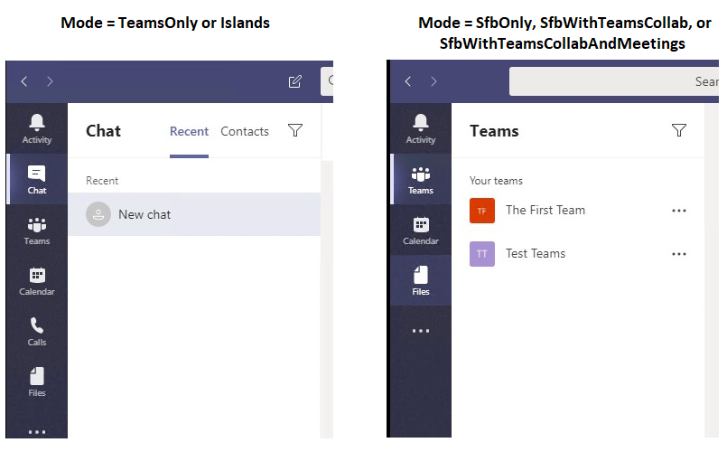

# Взаимодействие с клиентом Teams и соответствие режимам сосуществования

Режимы сосуществования Skype для бизнеса (SfBOnly, SfBWithTeamsCollab, SfBWithTeamsColetings) обеспечивают простой и предсказуемый интерфейс для конечных пользователей по мере перехода организаций с Skype для бизнеса на Teams.  Для организации, перемещаемой в Teams, режим "Только **Teams** " является конечным местом назначения для каждого пользователя, хотя не всем пользователям нужно назначить **только Teams** (или любой другой режим) одновременно.  До того как пользователи перейдите в режим TeamsOnly, организации могут использовать любой из Skype для бизнеса режимов сосуществования, чтобы обеспечить предсказуемую связь между пользователями, которые являются только **Teams**, и пользователями, которые еще не являются пользователями. 

Когда пользователь находится в любом Skype для бизнеса, все входящие чаты и вызовы направляются в клиент Skype для бизнеса пользователя. Чтобы избежать путаницы с конечным пользователем и обеспечить правильную маршрутизацию, вызовы и функции чата в клиенте Teams отключены, когда пользователь находится в любом Skype для бизнеса режиме. Аналогичным образом планирование собраний в Teams явным образом отключается, когда пользователи находятся в режиме SfBOnly или SfBWithTeamsCollab и явно включены, когда пользователь находится в режиме SfBWithTeamsCollabAndMeetings.

Так как присутствие указывает на доступность через чат и звонки, при отключении чата и звонков самостояние в Teams (то есть отображение собственного присутствия в клиенте Teams на рисунке пользователя) также скрыто. 

## Изменение доступных функций в клиенте Teams в зависимости от режима

Доступные функции в Teams зависят от режима сосуществования пользователя, задаваемого TeamsUpgradePolicy. В следующей таблице приводится сводка по поведению.

|Режим действия пользователя|Опыт работы в клиенте Teams|
|---|---|
|Любой Skype для бизнеса режиме|Звонки, чат и самостояние отключены.|
|SfBWithTeamsCollabAndMeetings|Доступно планирование собраний|
|SfBWithTeamsCollab или SfBOnly1|Планирование собраний недоступно|
|||

На следующих снимках экрана показана разница между **режимом "Только Teams** " или **"** Острова" и всеми другими режимами. Обратите внимание, что значки чата и звонков доступны по умолчанию в режиме **"Только Teams**" или "Острова" (снимок экрана слева), но не в других режимах (снимок экрана справа):

Кроме того, самостоятельное присутствие недоступно в других режимах, как показано ниже.

 
**Примечание:**
 1 В данный момент SfBwithTeamsCollab и SfBOnly ведут себя одинаково, но цель состоит в том, чтобы режим SfBOnly также отключал функции каналов и файлов в Teams. В то же время каналы можно скрыть с помощью политики разрешений приложений.

## Влияние режима на другие параметры политики
Как описано выше, режим сосуществования пользователя влияет на то, какие функции доступны в клиенте Teams пользователя. Это означает, что значение режима может иметь приоритет над значением других параметров политики в зависимости от режима. В частности, режим сосуществования влияет на то, учитываются ли следующие параметры политики:

|**Модальность (приложение)**|**Policy.Setting**|
|---|---|
|Чат|TeamsMessagingPolicy.AllowUserChat|
|Звонки|TeamsCallingPolicy.AllowPrivateCalling|
|Планирование собраний|TeamsMeetingPolicy.AllowPrivateMeetingScheduling TeamsMeetingPolicy.AllowChannelMeetingScheduling|
|||

Администраторам *не* нужно явно задавать эти параметры политики при использовании режима сосуществования, но важно понимать, что эти параметры работают следующим образом в заданном режиме. 

|Режим|AllowUserChat|AllowPrivateCalling|AllowPrivateMeetingScheduling|AllowChannelMeetingScheduling|
|---|---|---|---|---|
|TeamsOnly или Islands|Включено|Включено|Включено|Включено|
|SfBWithTeamsCollabAndMeetings|Отключено|Отключено|Включено|Включено|
|SfBWithTeamsCollab или SfBOnly|Отключено|Отключено|Отключено|Отключено|
||||||

При использовании PowerShell `Grant-CsTeamsUpgradePolicy` командлет проверяет конфигурацию соответствующих параметров в TeamsMessagingPolicy, TeamsCallingPolicy и TeamsMeetingPolicy, чтобы определить, будут ли эти параметры заменены TeamsUpgradePolicy и, если да, информационное сообщение предоставляется в PowerShell.  Как отмечалось выше, больше не нужно задавать другие параметры политики. Ниже приведен пример того, как выглядит предупреждение PowerShell:

`Grant-CsTeamsUpgradePolicy -Identity user1@contoso.com -PolicyName SfBWithTeamsCollab`

`WARNING: The user 'user1@contoso.com' currently has enabled values for: AllowUserChat, AllowPrivateCalling, AllowPrivateMeetingScheduling, AllowChannelMeetingScheduling, however these values will be ignored. This is because you are granting this user TeamsUpgradePolicy with mode=SfBWithTeamsCollab, which causes the Teams client to behave as if they are disabled.`

## Статьи по теме

[Руководство по миграции и взаимодействию для организаций, использующих Teams вместе со Skype для бизнеса](./migration-interop-guidance-for-teams-with-skype.md)