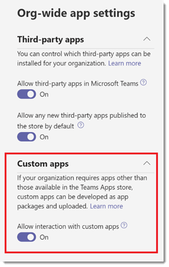

# Управление пользовательскими политиками и параметрами приложений в Microsoft Teams

Как администратор, вы можете использовать политики и параметры настраиваемых приложений для контроля доступа пользователей к загрузке настраиваемых приложений в Microsoft Teams. Администраторы определяют, какие пользователи могут добавлять пользовательские приложения, а администраторы и владельцы групп могут определять, разрешено ли добавлять пользовательские приложения в определенные группы в организации.  После изменения политики настраиваемых приложений может потребоваться несколько часов, чтобы изменения вступили в силу. Вы должны быть глобальным администратором или администратором службы Teams, чтобы управлять этими политиками.

Разработчики в вашей организации могут добавить пользовательское приложение в Teams, отправив пакет приложения (в ZIP-файле) непосредственно в группу или в личном контексте. Загрузка приложений отличается от добавления приложений через магазин приложений Teams. Добавление пользовательского приложения путем отправки пакета приложения, также известного как неопубликованная загрузка, позволяет определенным пользователям в организации протестировать приложение, прежде чем оно будет готово к широкому распространению.

## Политика и параметры настраиваемого приложения

Три компонента определяют, может ли пользователь отправить пользовательское приложение в группу, предоставляя вам детальный контроль над тем, кто может добавлять пользовательские приложения в группу и в какие группы могут быть добавлены настраиваемые приложения:

- [Пользовательская политика настраиваемых приложений](#user-custom-app-policy)
- [Параметры настраиваемых приложений группы](#team-custom-app-setting)
- [Параметры настраиваемых приложений для всей организации](#org-wide-custom-app-setting)

Эти параметры не влияют на возможность блокировки сторонних приложений.  

### Пользовательская политика настраиваемых приложений

В рамках [политик настройки приложений](teams-app-setup-policies.md) администраторы могут использовать параметр политики, **отправлять пользовательские приложения**, для контроля возможности пользователя загружать настраиваемые приложения в Teams.

Если этот параметр отключен:

- Пользователь не может отправить настраиваемое приложение ни в одну группу в вашей организации или в личном контексте.
- Пользователь может взаимодействовать с настраиваемыми приложениями в зависимости от параметра настраиваемого приложения для всей организации.

Если этот параметр включен:

- Пользователь может отправлять настраиваемые приложения в группы, позволяющие это, и в группы, владельцами которых является пользователь, в зависимости от параметра настраиваемых приложений для всей организации.
- Пользователь может загружать настраиваемые приложения в личном контексте.
- Пользователь может взаимодействовать с настраиваемыми приложениями в зависимости от параметра настраиваемого приложения для всей организации.

Вы можете изменить параметры глобальной политики настройки приложений, чтобы добавить нужные приложения. Если вы хотите настроить Teams для различных групп пользователей в организации, создайте и назначьте одну или несколько политик установки настраиваемых приложений.

#### Установить пользовательскую политику настраиваемых приложений

1. На панели навигации в левой стороне окна Центра администрирования Microsoft Teams выберите **Приложения Teams** > **Политики настройки**.
2. Нажмите **Добавить**.
3. Включите или отключите параметр **Загрузить настраиваемые приложения**.
4. Выберите любые другие параметры, которые вы хотели бы использовать для политики.
5. Нажмите кнопку **Сохранить**.

### Параметры настраиваемых приложений группы

Администраторы и владельцы групп могут управлять разрешениями группы на добавление в нее настраиваемых приложений. Параметр **Разрешить участникам добавлять пользовательские приложения** вместе с политикой настраиваемых приложений определяет, кто может добавлять настраиваемые приложения в определенную группу.

Если этот параметр отключен:

- Владельцы групп могут добавлять настраиваемые приложения, если это разрешено их политикой настраиваемых приложений.
- Участники группы, не являющиеся владельцами группы, не могут добавлять в нее настраиваемые приложения.

Если этот параметр включен:

- Владельцы группы могут добавлять настраиваемые приложения, если это разрешено их политикой настраиваемых приложений.
- Владельцы и участники группы могут добавлять настраиваемые приложения, если это допускается их политикой настраиваемых приложений.

#### Конфигурация параметров настраиваемого приложения группы

1. В Teams перейдите к группе, щелкните **Дополнительные параметры…** > **Управление группой**.
2. Щелкните **Параметры**, а затем откройте **Разрешения участников**.
3. Установите или снимите флажок **Разрешить участникам загружать настраиваемые приложения**.

    

### Параметры настраиваемых приложений для всей организации

Параметр **Разрешить взаимодействие с настраиваемыми приложениями** на уровне организации на странице [Управление приложениями](manage-apps.md) применяется ко всем пользователям в организации и определяет, могут ли они взаимодействовать с настраиваемыми приложениями. Этот параметр выступает в качестве главного переключателя для пользовательских и групповых параметров политики настраиваемого приложения. Он предназначен для использования в качестве основного выключателя во время событий системы безопасности. Таким образом, пользовательские и групповые параметры настраиваемых приложений не вступят в силу, если параметр настраиваемого приложения для всей организации не включен, даже если включены параметры политики настраиваемого приложения для пользователя и группы.

#### Конфигурация параметров настраиваемых приложений для всей организации

1. В левой панели навигации Центра администрирования Microsoft Teams выберите **Приложения Teams** > **Управление приложениями**.
2. Щелкните **Управление параметрами приложения в пределах организации**
3. В разделе **Пользовательские приложения** включите или отключите параметр **Разрешить взаимодействие с настраиваемыми приложениями**.

    

## Как работают политики и параметры настраиваемых приложений

В этой таблице приведены политики и параметры настраиваемых приложений, их совместная работа и их совокупное влияние на управление тем, кто в вашей организации может отправлять настраиваемые приложения в Teams.

Например, предположим, что вы хотите разрешить только владельцам групп загружать настраиваемые приложения в определенные группы. В таком случае следует настроить следующие параметры:

- Включите параметр **Разрешить взаимодействие с настраиваемыми приложениями** в центре администрирования Microsoft Teams.
- Отключите параметр **Разрешить участникам загружать настраиваемые приложения** для каждой группы, доступ к которой вы хотите ограничить.
- Создайте и назначьте политику установки настраиваемых приложений в центре администрирования Microsoft Teams с включенным параметром **Загружать настраиваемые приложения** и назначьте ее владельцам групп.

|Параметры настраиваемых приложений для всей организации |Параметры настраиваемых приложений группы |Пользовательская политика настраиваемых приложений |Эффект  |
|---------|---------|---------|---------|
| Выкл    | Выкл    | Выкл     |Взаимодействие со всеми пользовательскими приложениями заблокировано для вашей организации. Настраиваемые приложения не могут быть загружены кем-либо, кроме администратора службы Teams или глобального администратора. Вы можете использовать PowerShell для удаления настраиваемого приложения.   |
| Выкл     | Выкл     | Вкл        |Взаимодействие со всеми пользовательскими приложениями заблокировано для вашей организации. Настраиваемые приложения не могут быть загружены кем-либо, кроме администратора службы Teams или глобального администратора. Вы можете использовать PowerShell для удаления настраиваемого приложения.         |
| Выкл    | Вкл        | Выкл        |Взаимодействие со всеми пользовательскими приложениями заблокировано для вашей организации. Настраиваемые приложения не могут быть загружены кем-либо, кроме администратора службы Teams или глобального администратора. Вы можете использовать Windows PowerShell для удаления настраиваемых приложений.         |
| Выкл    | Вкл      | Вкл       |Взаимодействие со всеми пользовательскими приложениями заблокировано для вашей организации. Настраиваемые приложения не могут быть загружены кем-либо, кроме администратора службы Teams или глобального администратора. Вы можете использовать PowerShell для удаления настраиваемого приложения.         |
| Вкл    | Выкл       | Выкл         |  Пользователь не может отправлять настраиваемые приложения.      |
| Вкл     | Выкл       | Вкл         | Если пользователь является владельцем группы, он может отправлять в нее настраиваемые приложения. Если пользователь не является владельцем группы, он не может загружать в нее настраиваемые приложения. Пользователь может отправлять настраиваемые приложения в личном контексте.     |
| Вкл     | Вкл     | Выкл         | Пользователь не может отправлять настраиваемые приложения.       |
| Вкл    | Вкл        | Вкл        | Пользователь может загружать пользовательские приложения в команду независимо от того, является ли пользователь владельцем команды. Пользователь может отправлять настраиваемые приложения в личном контексте.       |

## См. также

[Параметры администратора для приложений в Teams](admin-settings.md)

[Назначение политик пользователям в Teams](assign-policies-users-and-groups.md)
