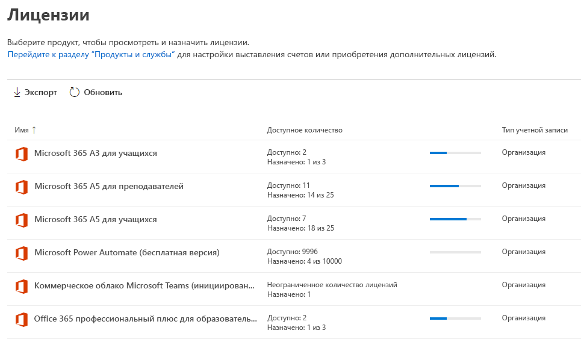
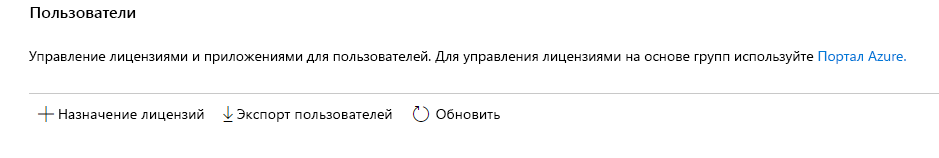
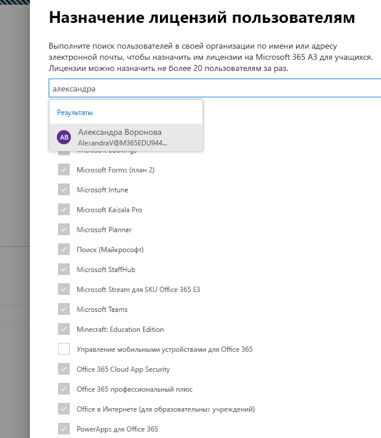
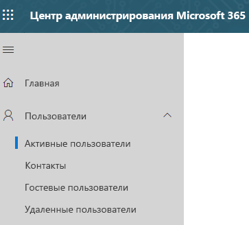
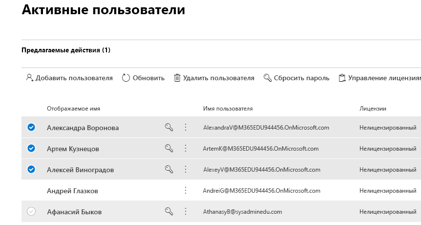
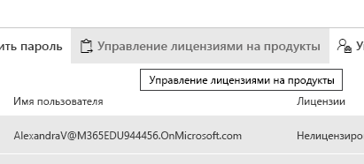
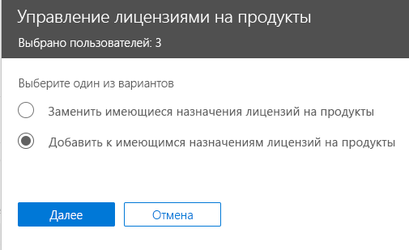
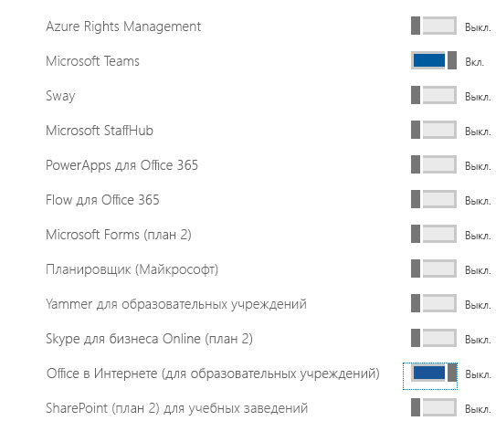

# Назначение лицензий Microsoft Teams для учебных заведений

Microsoft Teams — это объединенное цифровое рабочее пространство для бесед, содержимого и приложений. Поскольку это пространство встроено в Office 365, интеграция с ним дает преимущества учебным заведениям, знакомым с приложениями и службами Office. Microsoft Teams может использоваться в вашем учебном заведении для того, чтобы создавать аудитории для совместной работы, объединяться в профессиональные образовательные сообщества и общаться с персоналом учебного заведения с помощью единого интерфейса в Office 365 для образовательных учреждений.

Чтобы начать работу, ИТ-администратору необходимо через центр администрирования Microsoft 365 [включить Microsoft Teams для вашего учебного заведения](/microsoft-365/education/intune-edu-trial/enable-microsoft-teams).
После подключения необходимо назначить лицензии учетным записям пользователей, чтобы ваши преподаватели, сотрудники и учащиеся получили доступ к службам Office 365, в том числе Microsoft Teams.

Назначать лицензии для учетных записей пользователей можно либо для каждой по отдельности, либо автоматически через членство в группах. В этой статье приводится пошаговое описание процесса назначения лицензий Office 365 для отдельного пользователя или для небольшого числа учетных записей пользователей через Центр администрирования Microsoft 365. О том, как назначать лицензии автоматически через членство в группах, можно узнать из указанных далее статей.

- [Office 365 PowerShell](/office365/enterprise/powershell/assign-licenses-to-user-accounts-with-office-365-powershell)
- [Назначение лицензий пользователям в соответствии с членством в группах в Active Directory](/azure/active-directory/users-groups-roles/licensing-groups-assign)

Лицензии пользователям можно назначать на странице **Лицензии** или на странице **Активные пользователи**. Выбор метода зависит от того, нужно ли назначить лицензии на продукты определенным пользователям или назначить пользователям лицензии на определенные продукты.

> [!NOTE]
> Если вы не используете новый Центр администрирования Microsoft 365, можно включить его с помощью переключателя **Попробовать новый Центр администрирования**, расположенного в верхней части главной страницы.

## Назначение лицензий пользователям на странице "Лицензии"

> [!NOTE]
> Необходимо иметь права глобального администратора, администратора выставления счетов, администратора лицензий или администратора управления пользователями. Дополнительные сведения см. в статье [Роли администраторов в Office 365](/microsoft-365/admin/add-users/about-admin-roles).

Через страницу **Лицензии** можно назначить лицензии на определенный продукт для не более чем 20 пользователей. На странице **Лицензии** отображается список всех продуктов, на которые у вас есть подписки, а также общее количество лицензий для каждого продукта, количество назначенных и доступных лицензий.

1. В Центре администрирования выберите **Выставление счетов** > на странице [Лицензии](https://go.microsoft.com/fwlink/p/?linkid=842264).

   
2. Выберите продукт, для которого нужно назначить лицензии. Microsoft Teams входит в бесплатную версию SKU Office 365 A1 для учащихся.

   
3. Нажмите **Назначение лицензий**.

   
4. В панели **Назначение лицензий пользователям** начните вводить имя, благодаря чему отобразится список имен. Выберите среди результатов имя, которое вы ищете, и добавьте его к списку. Вы можете добавить до 20 пользователей одновременно.

   
5. Выберите **Включение и отключение приложений и служб**, чтобы назначить или удалить доступ к определенным элементам, например, к Microsoft Teams. Убедитесь в том, что выбраны **Microsoft Teams** и **Office в Интернете (для образовательных учреждений)**.
6. После завершения нажмите **Назначить**, а затем — **Закрыть**.

Изменение приложений и служб, к которым у пользователя есть доступ:

1. Выберите строку с пользователем.
1. В области справа выберите приложения и службы, к которым нужно предоставить доступ, или отмените выбор, чтобы удалить соответствующий доступ.
1. После завершения нажмите **Сохранить**, а затем — **Закрыть**.

## Назначение лицензий одному или нескольким пользователям на странице "Активные пользователи"

1. В Центре администрирования откройте страницу **Пользователи**  >  [Активные пользователи](https://go.microsoft.com/fwlink/p/?linkid=834822).

   
2. Установите флажки рядом с именем (именами) пользователя (пользователей), которому (которым) вы хотите назначить лицензии.

   
3. Нажмите вверху **Управление лицензиями на продукты**.

   
4. На панели **Управление лицензиями на продукты** выберите **Добавить к имеющимся назначениям лицензий на продукты** > **Далее**.

   
5. В области **Добавить к имеющимся продуктам** установите переключатель для лицензии, которую вы хотите назначить выбранным пользователям, в положение **Вкл.**. Убедитесь в том, что выбраны **Microsoft Teams** и **Office в Интернете (для образовательных учреждений)**.

   

   Пользователю (пользователям) по умолчанию автоматически назначаются все службы, связанные с этой лицензией (этими лицензиями). Вы можете ограничить доступные для пользователей службы. Для служб, которых не должно быть у пользователей, установите переключатель в положение **Выкл**.
6. Внизу области выберите "Добавить" > "Закрыть".